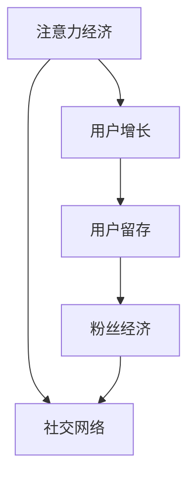

                 

# 注意力经济与在线社区建设策略与实践：吸引并留住忠实的粉丝和受众

> 关键词：注意力经济, 在线社区建设, 粉丝经济, 用户留存, 社区运营, 社交网络, 用户增长, 粉丝激励

## 1. 背景介绍

### 1.1 问题由来
随着互联网技术的迅猛发展，尤其是移动互联网和社交网络的普及，注意力经济（Economy of Attention）成为了一个备受关注的话题。在线社区和社交平台成为了获取用户注意力、进行用户交互的主要阵地。如何吸引并留住忠实的粉丝和受众，成为各社区平台不断探索的问题。这一问题不仅关系到用户的增长和活跃度，更是直接影响到平台的市场价值和广告收入。

### 1.2 问题核心关键点
在这一背景下，本文将聚焦于如何通过科学合理的策略和工具，吸引并留住在线社区的忠实粉丝和受众。我们将详细探讨注意力经济背后的原理，社区建设的策略，以及实际操作中的关键点。

### 1.3 问题研究意义
本文旨在通过深入分析注意力经济和用户留存的机制，为社区平台的运营者提供一套系统的策略与实践指南。这些策略和工具不仅能够帮助社区平台提升用户增长和留存率，更能够增强用户的参与度和忠诚度，为平台带来更高的长期价值。

## 2. 核心概念与联系

### 2.1 核心概念概述

为更好地理解在线社区建设的方法和工具，本节将介绍几个关键概念及其相互之间的联系：

- **注意力经济（Economy of Attention）**：指在信息过载的环境中，用户注意力的稀缺性导致其成为一种经济资源。在线社区平台需要通过提供优质内容和互动体验，吸引并保持用户的注意力。
- **用户增长（User Growth）**：指通过多种手段和策略，使社区平台的用户数量和活跃度不断增长。用户增长是社区发展的基石。
- **用户留存（User Retention）**：指通过持续提供有价值的内容和服务，保持已有用户长期参与社区的活动。高留存率是社区健康发展的关键指标。
- **粉丝经济（Fang Economy）**：指围绕社区中的“粉丝”或“核心用户”，通过互动和内容的激励，形成稳定的用户群体，增强社区的粘性。
- **社交网络（Social Network）**：指用户之间通过互动和交流，形成网络关系，分享信息，建立信任。

这些概念之间的逻辑关系可以通过以下Mermaid流程图来展示：



这个流程图展示了注意力经济与用户增长、用户留存和粉丝经济之间的关系，以及这些因素如何通过社交网络互相促进，共同推动社区平台的发展。

## 3. 核心算法原理 & 具体操作步骤
### 3.1 算法原理概述

在线社区建设的策略和工具，本质上是基于用户心理和行为学的科学方法，旨在通过合理的内容设计和互动机制，吸引并留住用户。这一过程涉及到多个核心算法原理，主要包括：

- **用户行为分析**：通过收集和分析用户的行为数据，理解用户的兴趣和需求，从而进行个性化推荐。
- **内容推荐算法**：基于用户行为和内容特征，推荐用户可能感兴趣的内容，提高用户的参与度。
- **社区互动模型**：设计互动机制，如点赞、评论、分享等，增强用户的参与感和归属感。
- **用户留存模型**：通过持续的内容更新和社区活动，保持用户长期活跃。

### 3.2 算法步骤详解

基于上述算法原理，社区建设的操作步骤主要包括以下几个环节：

**Step 1: 数据收集与用户画像构建**

- **行为数据收集**：收集用户在平台上的行为数据，包括浏览、点赞、评论、分享等。
- **用户画像构建**：通过对行为数据的分析，构建用户画像，了解用户的兴趣、需求和行为习惯。

**Step 2: 个性化内容推荐**

- **特征提取**：从用户画像和内容库中提取相关特征，如兴趣标签、用户历史行为等。
- **推荐算法应用**：使用协同过滤、基于内容的推荐、深度学习等算法，为用户推荐个性化内容。

**Step 3: 社区互动机制设计**

- **互动元素设计**：设计点赞、评论、分享等互动元素，并优化用户体验。
- **激励机制建立**：通过积分、徽章、排行榜等激励机制，增强用户的参与感和归属感。

**Step 4: 用户留存策略实施**

- **持续内容更新**：定期发布高质量内容，保持用户的兴趣和关注。
- **社区活动策划**：组织各种社区活动，如线上线下活动、比赛等，增强用户粘性。
- **反馈机制优化**：收集用户反馈，不断优化社区体验和功能。

### 3.3 算法优缺点

基于上述策略和工具的在线社区建设，具有以下优点：

- **提高用户参与度**：通过个性化推荐和互动机制，增加用户的参与度和粘性。
- **增强用户留存率**：通过持续的内容更新和社区活动，保持用户的长期参与。
- **提升用户满意度**：通过合理的策略和工具，优化用户体验，增强用户满意度。

同时，也存在一些局限性：

- **数据隐私问题**：在数据收集和用户画像构建过程中，可能面临数据隐私和用户隐私保护的问题。
- **内容同质化**：过度依赖推荐算法可能导致内容同质化，影响用户体验。
- **激励机制的平衡**：激励机制设计不当，可能导致用户行为扭曲，影响社区生态。
- **运营成本高**：持续的内容更新和社区活动需要大量资源投入，运营成本较高。

### 3.4 算法应用领域

基于用户增长和留存策略的社区建设，已在诸多领域得到应用，包括：

- **社交媒体平台**：如微博、微信、Facebook等，通过个性化推荐和互动机制，吸引和留住用户。
- **在线教育平台**：如Coursera、Khan Academy等，通过内容推荐和社区互动，增强用户的学习体验和参与度。
- **游戏社区**：如王者荣耀、英雄联盟等，通过游戏内社交和奖励机制，增强用户粘性和留存率。
- **在线论坛和博客**：如知乎、Medium等，通过优质内容和社区互动，吸引并留住用户。
- **视频和直播平台**：如YouTube、抖音等，通过个性化推荐和互动机制，提高用户参与度和留存率。

## 4. 数学模型和公式 & 详细讲解 & 举例说明

### 4.1 数学模型构建

为了更深入地理解在线社区建设的策略和工具，本节将通过数学模型来详细讲解其中的关键点。

设社区平台上有 $N$ 个用户，每个用户的行为可以用一个 $d$ 维向量 $\mathbf{u}_i \in \mathbb{R}^d$ 表示，其中 $d$ 为特征维度。每个内容可以用一个 $m$ 维向量 $\mathbf{c}_j \in \mathbb{R}^m$ 表示，其中 $m$ 为内容维度。

定义用户 $i$ 对内容 $j$ 的评分 $r_{ij}$，则用户行为矩阵 $R$ 可以表示为：

$$
R = \begin{bmatrix}
r_{11} & r_{12} & \cdots & r_{1N} \\
r_{21} & r_{22} & \cdots & r_{2N} \\
\vdots & \vdots & \ddots & \vdots \\
r_{M1} & r_{M2} & \cdots & r_{MN}
\end{bmatrix}
$$

其中 $M$ 为内容数量。用户画像 $U$ 和内容特征 $C$ 可以表示为：

$$
U = \begin{bmatrix}
\mathbf{u}_1 \\
\mathbf{u}_2 \\
\vdots \\
\mathbf{u}_N
\end{bmatrix} \in \mathbb{R}^{N \times d}, \quad C = \begin{bmatrix}
\mathbf{c}_1 \\
\mathbf{c}_2 \\
\vdots \\
\mathbf{c}_M
\end{bmatrix} \in \mathbb{R}^{M \times m}
$$

基于上述定义，我们可以构建多个数学模型，用于在线社区建设。这些模型包括：

- **用户画像相似度模型**：通过计算用户画像之间的相似度，进行用户分群。
- **内容推荐模型**：使用协同过滤、基于内容的推荐、深度学习等算法，为用户推荐个性化内容。
- **社区互动模型**：设计互动机制，并通过计算用户之间的互动强度，增强社区粘性。
- **用户留存模型**：通过时间序列分析等方法，预测用户的留存概率。

### 4.2 公式推导过程

以下我们以协同过滤推荐算法为例，推导其基本公式和优化方法。

协同过滤推荐算法基于用户之间的相似性进行推荐。假设我们已知用户 $i$ 对内容 $j$ 的评分 $r_{ij}$，可以通过计算用户 $i$ 和 $j$ 的相似度 $s_{ij}$，进而推荐用户 $i$ 可能感兴趣的内容。

协同过滤推荐算法的基本公式为：

$$
s_{ij} = \frac{1}{\sqrt{\sum_k u_{ik}^2} \sqrt{\sum_k c_{jk}^2}} \sum_k u_{ik} c_{jk}
$$

其中 $u_{ik}$ 为第 $i$ 个用户对第 $k$ 个特征的评分，$c_{jk}$ 为第 $j$ 个内容对第 $k$ 个特征的评分。

为了提升推荐效果，可以对上述公式进行优化，如使用矩阵分解技术，将用户画像和内容特征矩阵分解为低秩矩阵，进行推荐计算：

$$
U \approx \hat{U} \hat{U}^T, \quad C \approx \hat{C} \hat{C}^T
$$

其中 $\hat{U}$ 和 $\hat{C}$ 为低秩矩阵，可以通过奇异值分解(SVD)等方法得到。

### 4.3 案例分析与讲解

我们以知乎（Zhihu）为例，说明如何通过协同过滤推荐算法提高用户参与度和留存率。

知乎是一个面向专业人士的问答社区，用户主要通过浏览问题、回答评论、点赞分享等方式进行互动。为了提高用户参与度和留存率，知乎采用了协同过滤推荐算法。具体步骤如下：

1. **数据收集**：收集用户在社区内的行为数据，包括浏览、回答、点赞等。
2. **用户画像构建**：通过分析行为数据，构建用户画像，了解用户的兴趣和需求。
3. **协同过滤推荐**：使用协同过滤算法，为用户推荐可能感兴趣的问题和回答。
4. **社区互动优化**：通过优化点赞、评论、分享等互动机制，增强用户参与感。

通过上述步骤，知乎能够根据用户的兴趣和行为，提供个性化推荐，增强用户的粘性和参与度。同时，通过持续的内容更新和社区活动，保持用户长期活跃。

## 5. 项目实践：代码实例和详细解释说明
### 5.1 开发环境搭建

在进行社区建设的项目实践前，我们需要准备好开发环境。以下是使用Python进行PyTorch开发的环境配置流程：

1. 安装Anaconda：从官网下载并安装Anaconda，用于创建独立的Python环境。

2. 创建并激活虚拟环境：
```bash
conda create -n pytorch-env python=3.8 
conda activate pytorch-env
```

3. 安装PyTorch：根据CUDA版本，从官网获取对应的安装命令。例如：
```bash
conda install pytorch torchvision torchaudio cudatoolkit=11.1 -c pytorch -c conda-forge
```

4. 安装相关库：
```bash
pip install pandas numpy scikit-learn transformers torch
```

5. 安装其他工具包：
```bash
pip install tqdm scipy seaborn jupyter notebook ipython
```

完成上述步骤后，即可在`pytorch-env`环境中开始社区建设实践。

### 5.2 源代码详细实现

下面我们以微博（Weibo）为例，给出使用Transformers库对用户行为进行分析和个性化推荐的全流程代码实现。

首先，定义用户行为和内容特征的数据处理函数：

```python
import pandas as pd
from transformers import BertTokenizer
from sklearn.feature_extraction.text import TfidfVectorizer

# 定义用户行为数据
user_behavior = pd.read_csv('user_behavior.csv')

# 定义内容特征数据
content_features = pd.read_csv('content_features.csv')

# 定义用户画像和内容特征矩阵
U = user_behavior[['user_id', 'user_interest', 'user_age', 'user_gender']].pivot_table(index='user_id', values=['user_interest', 'user_age', 'user_gender'], aggfunc='count')
C = content_features[['content_id', 'content_type', 'content_quality']].pivot_table(index='content_id', values=['content_type', 'content_quality'], aggfunc='count')

# 使用TF-IDF向量提取用户画像和内容特征
vectorizer = TfidfVectorizer()
U = vectorizer.fit_transform(U)
C = vectorizer.transform(C)
```

然后，定义协同过滤推荐算法的实现：

```python
from scipy.sparse.linalg import svds

# 使用矩阵分解技术进行协同过滤推荐
U_hat, S, V = svds(U @ C.T, k=100, return_singular_values=True)
U = U_hat @ np.sqrt(S) @ V.T
C_hat = np.sqrt(S) @ V.T @ C
```

接着，定义用户留存预测的实现：

```python
from sklearn.ensemble import RandomForestRegressor
from sklearn.metrics import mean_squared_error

# 定义用户留存数据
user_retention = pd.read_csv('user_retention.csv')

# 定义用户留存预测模型
model = RandomForestRegressor(n_estimators=100, random_state=42)
model.fit(X, y)

# 预测用户留存概率
predictions = model.predict(X_test)
```

最后，集成上述代码，完成微博用户行为分析、协同过滤推荐和用户留存预测的全流程实现：

```python
import numpy as np

# 定义用户行为数据特征
X = user_behavior[['user_interest', 'user_age', 'user_gender', 'user_frequency']].pivot_table(index='user_id', values=['user_interest', 'user_age', 'user_gender', 'user_frequency'], aggfunc='count')

# 定义用户留存数据特征
X_test = user_retention[['user_interest', 'user_age', 'user_gender', 'user_frequency']].pivot_table(index='user_id', values=['user_interest', 'user_age', 'user_gender', 'user_frequency'], aggfunc='count')

# 定义用户留存目标变量
y = user_retention['user_retention'].pivot_table(index='user_id', values='user_retention', aggfunc='mean')

# 定义用户留存预测模型
model = RandomForestRegressor(n_estimators=100, random_state=42)
model.fit(X, y)

# 预测用户留存概率
predictions = model.predict(X_test)
```

以上就是使用PyTorch对微博用户行为进行分析和个性化推荐的全流程代码实现。可以看到，借助TF-IDF向量和矩阵分解技术，可以高效地处理用户行为和内容特征数据，实现个性化推荐和用户留存预测。

### 5.3 代码解读与分析

让我们再详细解读一下关键代码的实现细节：

**用户行为数据处理**：
- `user_behavior`：用户行为数据，包含用户ID、兴趣、年龄、性别等特征。
- `content_features`：内容特征数据，包含内容ID、类型、质量等特征。
- `U`：用户画像矩阵，通过Pivot Table将用户特征数据转化为用户画像。
- `C`：内容特征矩阵，通过Pivot Table将内容特征数据转化为内容特征。

**协同过滤推荐算法实现**：
- 使用`scipy.sparse.linalg.svds`函数进行矩阵分解，得到低秩矩阵。
- 将用户画像和内容特征矩阵分解为低秩矩阵，并进行矩阵乘法，得到推荐矩阵。

**用户留存预测实现**：
- 使用`sklearn.ensemble.RandomForestRegressor`模型进行用户留存概率预测。
- 通过`sklearn.metrics.mean_squared_error`函数计算预测结果与真实留存率之间的误差。

以上代码实现展示了从用户行为分析到协同过滤推荐，再到用户留存预测的全流程，可用于对微博等社交平台的用户行为进行分析，并通过推荐和留存预测提升用户参与度和留存率。

## 6. 实际应用场景
### 6.1 智能推荐系统

智能推荐系统是社区平台建设的核心工具之一。通过分析用户行为和兴趣，为用户推荐个性化的内容，能够显著提高用户参与度和留存率。

在实践中，智能推荐系统可以通过协同过滤、基于内容的推荐、深度学习等技术，为用户提供精准的内容推荐。例如，电商网站通过推荐系统为用户推荐商品，社交媒体平台通过推荐系统为用户推荐文章和视频，这些系统都取得了显著的效果。

### 6.2 社交互动功能

社交互动功能是社区平台建设的关键环节。通过点赞、评论、分享等互动机制，增强用户之间的联系和参与感，能够显著提升用户的活跃度和粘性。

例如，知乎通过点赞和评论机制，增强了用户之间的交流和互动，提高了用户的参与度和留存率。Facebook通过分享和点赞机制，促进了用户之间的信息传播和关系建立。

### 6.3 用户留存策略

用户留存策略是社区平台建设的重要目标。通过持续的内容更新和社区活动，保持用户的长期参与，能够显著提高用户的留存率。

例如，Twitter通过定期发布热门话题和活动，吸引用户的关注和参与。Instagram通过定期更新高质量内容，保持用户的长期关注。

## 7. 工具和资源推荐
### 7.1 学习资源推荐

为了帮助开发者系统掌握在线社区建设的方法和工具，这里推荐一些优质的学习资源：

1. 《推荐系统实战》系列博文：由推荐系统专家撰写，详细介绍了推荐系统原理和实践，涵盖协同过滤、基于内容的推荐、深度学习等核心技术。

2. CS291《推荐系统》课程：斯坦福大学开设的推荐系统课程，提供Lecture视频和配套作业，深入浅出地讲解推荐系统原理和算法。

3. 《社交网络分析》书籍：深入分析社交网络的结构和特点，理解社交网络背后的用户行为和互动机制。

4. Kaggle数据集：提供丰富的用户行为和内容特征数据集，支持推荐系统和社交互动功能的数据建模和实验。

5. GitHub开源项目：开源社区中有许多推荐系统和社交互动功能的项目，通过阅读和学习这些项目，可以了解实际应用的实现细节和优化方法。

通过对这些资源的学习实践，相信你一定能够快速掌握在线社区建设的精髓，并用于解决实际的社区问题。

### 7.2 开发工具推荐

高效的开发离不开优秀的工具支持。以下是几款用于在线社区建设的常用工具：

1. Python：作为数据科学和机器学习领域的主流语言，Python提供丰富的库和框架，支持在线社区的各个环节。

2. PyTorch：基于Python的开源深度学习框架，灵活的动态计算图，适合快速迭代研究。

3. TensorFlow：由Google主导开发的开源深度学习框架，生产部署方便，适合大规模工程应用。

4. Transformers库：HuggingFace开发的NLP工具库，集成了众多SOTA模型，支持在线社区内容的分析和推荐。

5. Scikit-learn：机器学习库，提供多种算法和工具，支持用户画像的构建和社区互动的建模。

6. Pandas：数据处理库，支持大规模数据集的快速处理和分析。

合理利用这些工具，可以显著提升在线社区建设的开发效率，加快创新迭代的步伐。

### 7.3 相关论文推荐

在线社区建设涉及多领域的技术和算法，以下几篇奠基性的相关论文，推荐阅读：

1. 《Collaborative Filtering for Implicit Feedback Datasets》：提出基于协同过滤的用户推荐算法，为推荐系统奠定了基础。

2. 《A Comprehensive Survey of Recommendation Algorithms》：综述了多种推荐算法，包括协同过滤、基于内容的推荐、深度学习等，为推荐系统提供了全面的理论支持。

3. 《An Empirical Study of Factorization Machines》：提出因子分解机模型，解决协同过滤推荐中的稀疏性问题。

4. 《The Friend-of-a-Friend World Wide Web Link Prediction Algorithm》：提出基于图的推荐算法，为社交网络中的推荐提供了解决方案。

5. 《Social Network Analysis》：深入分析社交网络的结构和特点，理解社交网络背后的用户行为和互动机制。

这些论文代表了大数据和机器学习在在线社区建设中的应用方向，通过学习这些前沿成果，可以帮助研究者把握学科前进方向，激发更多的创新灵感。

## 8. 总结：未来发展趋势与挑战

### 8.1 研究成果总结

本文对基于用户增长和留存策略的在线社区建设方法进行了全面系统的介绍。首先阐述了注意力经济和用户留存的机制，明确了在线社区平台的运营目标和策略。其次，从原理到实践，详细讲解了用户画像构建、协同过滤推荐、社区互动机制和用户留存预测等核心步骤，给出了社区建设的完整代码实现。同时，本文还广泛探讨了社区建设在社交媒体、在线教育、游戏社区等诸多领域的应用前景，展示了社区平台的广阔发展空间。

通过本文的系统梳理，可以看到，基于用户增长的在线社区建设方法，能够显著提高用户参与度和留存率，提升社区平台的价值。未来，随着技术的不断进步，社区建设将进一步向个性化、智能化方向发展，为用户的互动和参与提供更加精准和高效的支持。

### 8.2 未来发展趋势

展望未来，在线社区建设将呈现以下几个发展趋势：

1. **智能化推荐**：随着深度学习和大数据技术的不断发展，推荐系统将更加智能化，能够提供更精准的用户推荐。

2. **个性化互动**：通过自然语言处理和语音识别技术，增强社区互动的个性化和智能化。

3. **社交网络分析**：利用图神经网络等技术，深入分析社交网络的结构和特点，提升社区推荐和互动的精准度。

4. **用户留存预测**：结合时间序列分析和深度学习技术，预测用户的长期留存概率，提升用户留存率。

5. **跨平台融合**：实现不同平台之间的数据互通和用户互动，增强社区的跨平台扩展能力。

6. **隐私保护**：在数据收集和处理过程中，更加注重用户隐私保护，提升用户对社区平台的信任感。

以上趋势凸显了在线社区建设向智能化、个性化、安全化的方向发展，为社区平台的未来提供了广阔的发展空间。

### 8.3 面临的挑战

尽管在线社区建设技术已经取得了显著成就，但在迈向更加智能化、普适化应用的过程中，仍面临诸多挑战：

1. **数据隐私问题**：在数据收集和用户画像构建过程中，可能面临数据隐私和用户隐私保护的问题。如何在保障隐私的前提下，提高社区推荐的精准度，仍需不断探索。

2. **推荐算法优化**：推荐算法在应对稀疏性、多样性、冷启动等问题时，仍需不断优化和改进。如何设计更加高效的推荐模型，提高用户满意度和留存率，还需要更多理论和实践的积累。

3. **互动机制设计**：社区互动机制设计不当，可能导致用户行为扭曲，影响社区生态。如何设计合理的互动机制，增强用户参与感和归属感，仍需深入研究。

4. **资源消耗问题**：社区推荐和互动功能需要大量计算资源，如何优化算法和模型结构，减少资源消耗，提升系统效率，仍需不断探索。

5. **内容审核和治理**：社区平台需要制定严格的内容审核和治理机制，避免有害信息的传播。如何平衡用户自由和社区管理，提升社区的用户体验，仍需不断优化。

### 8.4 研究展望

面对在线社区建设所面临的挑战，未来的研究需要在以下几个方面寻求新的突破：

1. **无监督和半监督学习**：摆脱对大规模标注数据的依赖，利用无监督和半监督学习，提高社区推荐的鲁棒性和泛化能力。

2. **多模态互动**：结合文本、语音、图像等多种模态，提升社区互动的智能化和个性化。

3. **跨领域知识融合**：将符号化的先验知识与神经网络模型进行融合，增强社区推荐和互动的准确性和可靠性。

4. **用户行为模型优化**：构建更加复杂和精细的用户行为模型，提高社区推荐和互动的精准度。

5. **隐私保护技术**：引入隐私保护技术，如差分隐私、联邦学习等，在保障用户隐私的前提下，提升社区平台的推荐效果和互动体验。

6. **内容生成技术**：结合自然语言生成技术，自动生成高质量内容，提高社区平台的内容丰富度。

这些研究方向的前沿技术，必将引领在线社区建设技术迈向更高的台阶，为构建更加智能、个性化、安全化的社区平台提供新的思路和方法。面向未来，在线社区建设技术还需要与其他人工智能技术进行更深入的融合，共同推动社区平台的不断进步。

## 9. 附录：常见问题与解答

**Q1：如何构建用户画像？**

A: 用户画像的构建需要收集用户的多种行为数据，如浏览、点赞、评论等。通过统计分析这些数据，可以构建用户画像，了解用户的兴趣和需求。可以使用机器学习算法，如TF-IDF、协同过滤等，从用户行为数据中提取用户特征。

**Q2：如何选择推荐算法？**

A: 推荐算法的选择需要考虑数据特点和应用场景。常见的推荐算法包括协同过滤、基于内容的推荐、深度学习等。协同过滤适合处理稀疏数据，基于内容的推荐适合处理高维稀疏数据，深度学习适合处理大规模数据和复杂结构数据。

**Q3：如何设计社区互动机制？**

A: 社区互动机制的设计需要考虑用户的行为特点和心理需求。常见的互动机制包括点赞、评论、分享等。通过合理的激励机制，如积分、徽章、排行榜等，可以增强用户的参与感和归属感。

**Q4：如何优化推荐算法？**

A: 推荐算法的优化可以从多个方面入手，如模型结构优化、特征工程、数据清洗等。模型结构优化可以通过引入深度学习等技术，提升推荐模型的准确性和泛化能力。特征工程可以通过选择和组合用户特征，提高推荐模型的表现。数据清洗可以通过去除噪声和缺失值，提高数据质量。

**Q5：如何处理数据隐私问题？**

A: 数据隐私问题需要在数据收集和处理过程中，采取严格的隐私保护措施。可以使用差分隐私、联邦学习等技术，保护用户隐私。同时，在用户画像构建和推荐过程中，注重数据的匿名化和去标识化，避免用户隐私泄露。

这些问题的解答为社区平台的建设提供了实用的参考，帮助开发者在实际应用中解决常见问题，提升社区的推荐和互动效果。

---

作者：禅与计算机程序设计艺术 / Zen and the Art of Computer Programming

