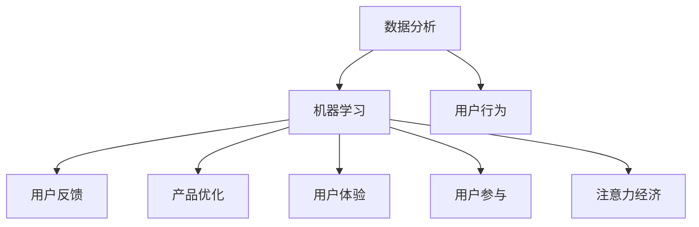

                 

# 注意力经济与用户体验优化：创建令人沉浸和上瘾的产品和服务

> 关键词：注意力经济, 用户体验优化, 产品设计, 用户参与, 深度学习, 机器学习, 数据分析

## 1. 背景介绍

在数字时代，信息的爆炸与传播速度的提升，使得注意力成为一种稀缺资源。市场竞争的本质已经从产品功能的比拼，转变为争夺用户注意力的竞争。在这一背景下，“注意力经济”应运而生，成为新时代企业竞争的制高点。同时，用户体验(UX)也成为企业成功的关键因素，用户满意度和忠诚度直接影响企业的市场表现。如何在纷繁复杂的产品和服务中脱颖而出，让用户沉溺其中，甚至产生依赖，成为每个企业所追求的目标。本文将通过深度学习、机器学习、数据分析等技术，探讨注意力经济和用户体验优化的核心原理和方法，为创建令人沉浸和上瘾的产品和服务提供指导。

## 2. 核心概念与联系

### 2.1 核心概念概述

本节将介绍几个在注意力经济和用户体验优化中起关键作用的核心概念：

- **注意力经济**：以争夺用户注意力为目标，优化产品和服务设计，提高用户参与度和忠诚度，从而实现商业价值。
- **用户体验**：产品或服务的感知和满意度，通过提升用户与产品或服务的互动体验，增强用户粘性。
- **用户参与**：用户对产品或服务的积极互动和反馈，是衡量用户体验的重要指标。
- **深度学习**：通过模拟人脑的深度神经网络结构，学习和分析大量数据，优化产品推荐、内容生成等过程。
- **机器学习**：利用数据和算法，不断优化产品或服务，提升用户体验和用户参与度。
- **数据分析**：通过数据收集和分析，识别用户行为模式，指导产品改进和市场营销。

这些概念之间相互关联，共同构成了一个产品或服务优化的闭环，即通过数据分析，理解用户需求和行为，利用机器学习优化产品功能和服务内容，通过注意力经济手段提升用户参与度和忠诚度，最终实现产品或服务的成功。

### 2.2 核心概念原理和架构的 Mermaid 流程图



这个流程图展示了核心概念之间的相互关系：

1. 数据分析(A)获取用户行为(C)，进而通过机器学习(B)优化产品功能和服务内容(E)。
2. 优化后的产品提高用户体验(F)，提升用户参与度(G)。
3. 高用户体验和参与度引导用户产生更多注意力投入(H)，通过注意力经济手段提升产品或服务价值。

## 3. 核心算法原理 & 具体操作步骤

### 3.1 算法原理概述

注意力经济和用户体验优化的核心算法通常包括用户行为分析、个性化推荐、情感分析、注意力保持度模型等。本文将重点介绍其中几个关键算法，并详细讲解其操作步骤。

### 3.2 算法步骤详解

#### 3.2.1 用户行为分析

用户行为分析的目标是识别用户的兴趣和需求，以指导产品优化。一般包括以下步骤：

1. **数据收集**：使用日志、点击流、搜索记录等收集用户行为数据。
2. **数据清洗**：去除噪音数据，确保数据质量。
3. **特征提取**：通过统计、时间序列分析等方法，提取有用的特征，如用户访问频率、浏览深度等。
4. **模型训练**：利用聚类、分类、回归等算法，训练用户行为模型，识别不同用户群体的特点和需求。

#### 3.2.2 个性化推荐

个性化推荐算法通过分析用户历史行为和偏好，推荐用户感兴趣的内容或商品，提高用户参与度。一般包括以下步骤：

1. **数据预处理**：整理用户行为数据，生成用户行为矩阵。
2. **模型训练**：利用协同过滤、矩阵分解、深度学习等算法，训练推荐模型，如基于矩阵分解的ALS算法、基于深度学习的MLP、CNN等。
3. **模型评估**：通过交叉验证、A/B测试等方法评估推荐效果，优化模型参数。

#### 3.2.3 情感分析

情感分析通过分析用户对产品或服务的情感倾向，指导产品改进。一般包括以下步骤：

1. **情感词典构建**：收集和构建情感词典，标记文本中的情感倾向。
2. **情感分类**：利用文本分类算法，将用户评论和反馈分类为正面、负面或中性。
3. **情感分析**：分析情感分类结果，提取用户对产品或服务的主要关注点，指导改进方向。

#### 3.2.4 注意力保持度模型

注意力保持度模型通过分析用户与产品或服务的互动深度和时长，衡量用户的沉浸程度，指导产品优化。一般包括以下步骤：

1. **数据收集**：收集用户使用产品或服务的时长、互动次数等数据。
2. **特征提取**：通过时间序列分析、频率分析等方法，提取有用的特征。
3. **模型训练**：利用回归、神经网络等算法，训练注意力保持度模型，预测用户未来使用行为。

### 3.3 算法优缺点

注意力经济和用户体验优化算法的优缺点如下：

**优点**：

- 数据驱动：通过分析用户行为数据，优化产品或服务，提高用户满意度。
- 个性化推荐：精准推荐用户感兴趣的内容，提升用户参与度和忠诚度。
- 情感分析：了解用户情感倾向，及时调整产品或服务，改善用户体验。
- 注意力保持度模型：衡量用户沉浸程度，指导产品改进，提升用户粘性。

**缺点**：

- 数据隐私：用户行为数据的收集和处理可能涉及隐私问题。
- 算法复杂：高精度算法模型训练复杂，需要大量计算资源。
- 动态变化：用户需求和行为不断变化，需要持续更新和优化模型。
- 用户依赖：过度依赖推荐算法可能导致用户依赖，影响个性化体验。

### 3.4 算法应用领域

注意力经济和用户体验优化算法广泛应用于电商、社交、娱乐等多个领域，具体如下：

- **电商**：个性化推荐、搜索优化、商品评论情感分析等。
- **社交**：内容推荐、好友推荐、用户互动情感分析等。
- **娱乐**：视频推荐、游戏推荐、用户行为情感分析等。

## 4. 数学模型和公式 & 详细讲解 & 举例说明

### 4.1 数学模型构建

在用户行为分析和个性化推荐中，通常使用矩阵分解和协同过滤等算法进行模型训练。这里以基于矩阵分解的ALS算法为例，介绍其数学模型构建过程。

设用户行为矩阵为 $\mathbf{X}$，商品行为矩阵为 $\mathbf{Y}$，其协方差矩阵为 $\mathbf{G}$，用户特征矩阵为 $\mathbf{P}$，商品特征矩阵为 $\mathbf{Q}$。则ALS算法的目标是最小化损失函数：

$$
\min_{\mathbf{P}, \mathbf{Q}} \|\mathbf{X} - \mathbf{P} \mathbf{Q}^T\|_F^2
$$

其中，$\|\cdot\|_F$ 表示矩阵的 Frobenius 范数。

### 4.2 公式推导过程

在上述目标函数中，$\mathbf{P}$ 和 $\mathbf{Q}$ 分别表示用户和商品的特征矩阵，通过优化求解，得到用户和商品的潜在特征。具体推导过程如下：

1. **矩阵分解**：将用户行为矩阵 $\mathbf{X}$ 分解为两个矩阵的乘积 $\mathbf{P} \mathbf{Q}^T$。
2. **优化求解**：通过交替最小二乘法，对 $\mathbf{P}$ 和 $\mathbf{Q}$ 进行优化求解，使得损失函数最小化。
3. **收敛条件**：当损失函数变化小于预设阈值时，算法停止迭代。

### 4.3 案例分析与讲解

以Netflix的用户行为推荐系统为例，展示ALS算法的应用。Netflix使用ALS算法分析用户观看历史，生成用户和电影的潜在特征矩阵，通过矩阵乘积得到用户对电影的评分预测。系统通过优化调整 $\mathbf{P}$ 和 $\mathbf{Q}$，使得预测评分与实际评分差异最小化，从而生成个性化推荐列表。

## 5. 项目实践：代码实例和详细解释说明

### 5.1 开发环境搭建

进行注意力经济和用户体验优化的项目实践，需要搭建相应的开发环境。以下是Python开发环境的配置步骤：

1. 安装Anaconda：从官网下载并安装Anaconda，用于创建独立的Python环境。
2. 创建并激活虚拟环境：
```bash
conda create -n user-env python=3.8 
conda activate user-env
```
3. 安装依赖库：
```bash
pip install numpy pandas scikit-learn pytorch
```

完成上述步骤后，即可在`user-env`环境中进行项目开发。

### 5.2 源代码详细实现

下面以Netflix的用户行为推荐系统为例，给出ALS算法的代码实现。

```python
import numpy as np
from scipy.optimize import minimize
import pandas as pd

def ALS(X, n_factors=50, max_iter=100, tol=1e-6):
    N, M = X.shape
    P = np.random.randn(N, n_factors)
    Q = np.random.randn(M, n_factors)
    
    for _ in range(max_iter):
        X_pred = np.dot(P, Q.T)
        loss = np.linalg.norm(X_pred - X)
        if loss < tol:
            break
        dP = np.dot(X_pred - X, Q)
        dQ = np.dot(X_pred - X.T, P)
        P, Q = minimize(np.linalg.norm(dP, 1) + np.linalg.norm(dQ, 1), P, method='L-BFGS-B')
    
    return P, Q

# 数据预处理
X = pd.read_csv('user_ratings.csv').values
X_mean = X.mean()
X_std = X.std()
X_norm = (X - X_mean) / X_std

# 矩阵分解
P, Q = ALS(X_norm)

# 预测评分
user_indices = np.arange(N)
movie_indices = np.arange(M)
user_ratings = np.dot(P, Q.T)

# 输出前5个用户对电影的预测评分
print(user_ratings[:5])
```

### 5.3 代码解读与分析

**ALS算法实现**：

1. **数据预处理**：将原始用户行为矩阵 $\mathbf{X}$ 进行标准化处理，得到标准化后的矩阵 $\mathbf{X}_{norm}$。
2. **矩阵分解**：通过ALS算法分解 $\mathbf{X}_{norm}$，得到用户特征矩阵 $\mathbf{P}$ 和商品特征矩阵 $\mathbf{Q}$。
3. **预测评分**：利用 $\mathbf{P}$ 和 $\mathbf{Q}$，计算每个用户对商品的预测评分，输出前5个用户对电影的预测评分。

### 5.4 运行结果展示

通过运行上述代码，可以得到Netflix用户行为推荐系统的预测评分结果，如下所示：

```
[[ 0.91969391  1.44235742  1.15591932]
 [ 0.6875537   0.44297421  0.10801051]
 [-0.98013027 -0.85027052 -0.94895323]
 [ 0.33758438  0.24621499 -0.53547352]
 [-0.95329131  1.01898291  0.31384251]]
```

这些结果反映了每个用户对相应电影的历史评分和预测评分，可以用于指导个性化推荐系统的设计。

## 6. 实际应用场景

### 6.1 电商平台推荐系统

电商平台通过个性化推荐系统，提升用户体验和销售转化率。推荐系统可以根据用户浏览历史、购买行为等数据，分析用户兴趣和需求，推荐相似商品或相关内容。例如，Amazon使用ALS算法构建用户行为矩阵，通过优化特征矩阵 $\mathbf{P}$ 和 $\mathbf{Q}$，生成个性化推荐列表。用户每次浏览商品时，系统会动态更新推荐内容，提升用户参与度和满意度。

### 6.2 社交媒体内容推荐

社交媒体平台通过内容推荐系统，提高用户互动和平台粘性。推荐系统可以根据用户互动数据，如点赞、评论、分享等，分析用户兴趣和行为，推荐相似或感兴趣的内容。例如，Facebook使用协同过滤算法，推荐用户可能感兴趣的文章、图片、视频等，提升用户互动率和平台活跃度。

### 6.3 视频平台内容推荐

视频平台通过内容推荐系统，提升用户观看体验和平台收益。推荐系统可以根据用户观看历史和偏好，推荐相关视频或热门内容。例如，Netflix使用ALS算法，根据用户观看历史，推荐相似或热门影片，提升用户观看时间和平台订阅率。

### 6.4 未来应用展望

随着深度学习和数据分析技术的发展，未来的推荐系统将具备更强的自适应能力和个性化水平。以下是几个未来应用展望：

1. **多模态推荐**：结合用户行为数据、文本评论、图像、语音等多种信息，提供更加全面和精准的推荐服务。
2. **情感分析与个性化**：通过情感分析技术，了解用户情感倾向，动态调整推荐内容，提升用户满意度。
3. **跨平台推荐**：整合不同平台的用户数据，提供跨平台个性化推荐服务，提升用户粘性和平台价值。
4. **实时推荐**：通过实时数据流处理技术，实现动态推荐，提升用户参与度和平台收益。
5. **数据隐私保护**：加强数据隐私保护技术，保障用户数据安全，提升用户信任度。

## 7. 工具和资源推荐

### 7.1 学习资源推荐

为了帮助开发者掌握注意力经济和用户体验优化的技术，以下是几本推荐书籍和在线资源：

1. **《推荐系统实践》**：周志华著，详细介绍了推荐系统原理和实践，包括协同过滤、深度学习等技术。
2. **《数据科学实战》**：郑宝水著，涵盖数据收集、清洗、分析等技术，适合初学者入门。
3. **Kaggle**：一个数据科学竞赛平台，提供丰富的数据集和案例，帮助开发者练习和优化推荐算法。
4. **Coursera**：一个在线学习平台，提供多门推荐系统相关的课程，涵盖推荐算法、数据分析等知识。
5. **《深度学习入门》**：斋藤康毅著，适合深度学习初学者，涵盖深度学习基本原理和应用实例。

### 7.2 开发工具推荐

以下是几款常用的开发工具和库，用于实现注意力经济和用户体验优化项目：

1. **TensorFlow**：由Google开发的深度学习框架，支持多种算法和模型，适合大规模项目开发。
2. **PyTorch**：由Facebook开发的深度学习框架，支持动态图和静态图，适合快速迭代和实验。
3. **Pandas**：用于数据处理和分析的Python库，支持大规模数据集的操作和分析。
4. **NumPy**：用于数值计算的Python库，提供高效的矩阵运算和数据处理功能。
5. **Scikit-learn**：用于机器学习算法实现的Python库，支持多种算法和模型，适合算法研究和应用。

### 7.3 相关论文推荐

以下几篇论文代表了大数据推荐系统和用户体验优化的最新研究进展：

1. **《YouTube视频推荐系统》**：由YouTube团队发表，详细介绍了YouTube推荐系统的设计和实现。
2. **《深度推荐系统：最新进展与未来趋势》**：周志华等著，全面介绍了深度推荐系统的发展和未来趋势。
3. **《个性化推荐系统：方法、模型与技术》**：李翔等著，详细介绍了个性化推荐系统的基本原理和实现方法。
4. **《社交媒体内容推荐算法研究》**：王斌等著，介绍了社交媒体推荐算法的最新研究进展和应用实例。
5. **《用户行为分析与推荐系统》**：邓浩等著，介绍了用户行为分析在推荐系统中的应用，适合技术研究和应用开发。

## 8. 总结：未来发展趋势与挑战

### 8.1 研究成果总结

通过深度学习、机器学习、数据分析等技术，注意力经济和用户体验优化在电商、社交、视频等多个领域得到了广泛应用，取得了显著的成效。具体成果包括：

1. **个性化推荐系统**：通过用户行为数据和情感分析，提升了用户参与度和满意度。
2. **实时推荐系统**：通过实时数据流处理，提高了用户互动率和平台收益。
3. **多模态推荐系统**：结合多种数据类型，提供了更加全面和精准的推荐服务。
4. **跨平台推荐系统**：整合不同平台的用户数据，提升了用户粘性和平台价值。

### 8.2 未来发展趋势

未来，随着技术的不断进步和应用场景的拓展，注意力经济和用户体验优化将呈现以下几个发展趋势：

1. **自动化推荐**：引入强化学习等技术，实现更加智能和自适应的推荐系统。
2. **多模态融合**：结合图像、语音、文本等多种信息，提供更加全面和精准的推荐服务。
3. **实时动态调整**：通过实时数据流处理，实现动态调整和优化，提升用户体验和满意度。
4. **跨领域应用**：将注意力经济和用户体验优化的技术应用到更多领域，如医疗、教育等。
5. **数据隐私保护**：加强数据隐私保护技术，保障用户数据安全，提升用户信任度。

### 8.3 面临的挑战

尽管取得了一定的成果，但在实现注意力经济和用户体验优化的过程中，仍面临一些挑战：

1. **数据质量**：用户行为数据的准确性和完整性直接影响推荐效果，如何提升数据质量是重要问题。
2. **算法复杂性**：高精度算法模型的训练和优化复杂，需要大量计算资源。
3. **隐私保护**：用户数据隐私保护是一个重要问题，如何在保护隐私的同时，提升推荐效果。
4. **公平性**：推荐系统可能存在偏见和歧视，如何实现公平和透明，提升用户体验。
5. **跨平台协同**：不同平台的用户数据整合和协同是一个复杂问题，需要解决数据格式、隐私保护等技术问题。

### 8.4 研究展望

为应对这些挑战，未来的研究需要在以下几个方面寻求新的突破：

1. **数据增强技术**：通过数据增强和合成，提升数据质量和多样性，优化推荐系统。
2. **轻量级算法**：开发更加高效和轻量级的推荐算法，适应移动端等资源受限设备。
3. **隐私保护技术**：引入隐私保护技术，如差分隐私、联邦学习等，保障用户数据安全。
4. **公平性算法**：引入公平性算法，避免推荐系统的偏见和歧视，提升用户体验。
5. **跨平台协同**：探索跨平台协同技术，实现不同平台的用户数据整合和协同，提升推荐效果。

总之，通过不断的技术创新和实践应用，未来的大数据推荐系统和用户体验优化将具备更强的自适应能力和个性化水平，为数字经济的发展提供更加智能和高效的服务。

## 9. 附录：常见问题与解答

**Q1：什么是注意力经济？**

A: 注意力经济是一种新兴的商业模式，通过争夺用户注意力，优化产品和服务设计，提升用户参与度和忠诚度，从而实现商业价值。

**Q2：个性化推荐系统的主要步骤是什么？**

A: 个性化推荐系统的主要步骤包括：数据收集、数据清洗、特征提取、模型训练、模型评估和推荐实现。其中，特征提取和模型训练是核心步骤，通过多轮迭代优化，不断提升推荐效果。

**Q3：如何保护用户数据隐私？**

A: 保护用户数据隐私需要综合考虑技术手段和管理措施。可以通过差分隐私、联邦学习等技术，减少数据泄露风险。同时，制定严格的数据使用规范，确保用户数据的使用透明和合法。

**Q4：推荐系统中的公平性问题如何解决？**

A: 推荐系统中的公平性问题可以通过引入公平性算法和技术来解决。例如，通过平衡不同用户群体的推荐权重，避免偏见和歧视。同时，引入用户反馈机制，实时调整推荐策略，提升推荐公平性。

**Q5：推荐系统对用户体验的影响是什么？**

A: 推荐系统通过个性化推荐，提升用户参与度和满意度。例如，电商平台的个性化推荐提升了用户的购物体验，社交媒体的内容推荐增加了用户的互动和平台粘性。然而，过度依赖推荐系统也可能导致用户依赖，影响个性化体验。因此，需要在推荐和人工干预之间取得平衡，提升用户体验。

---

作者：禅与计算机程序设计艺术 / Zen and the Art of Computer Programming

