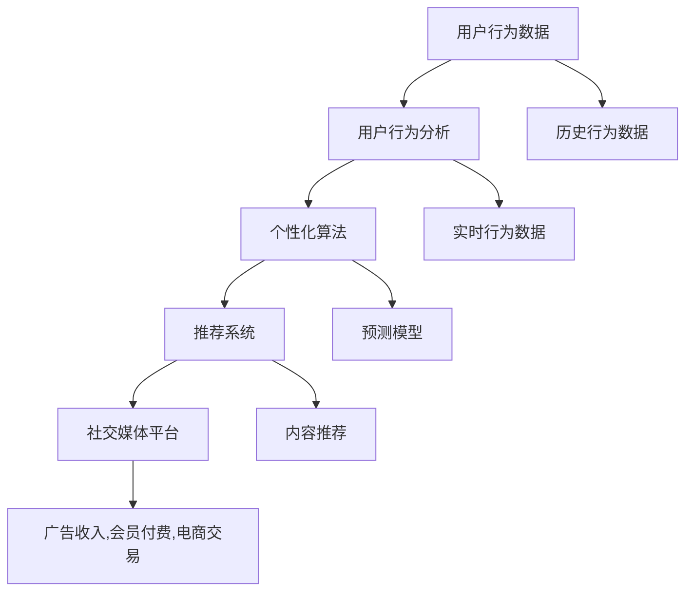

                 

# 注意力经济与社交媒体影响算法：谁在控制你看什么

> 关键词：注意力经济, 社交媒体, 影响算法, 推荐系统, 个性化, 用户行为分析

## 1. 背景介绍

在信息爆炸的时代，社交媒体成为人们获取信息、交流思想的主要渠道。然而，我们每天在社交媒体上消耗的时间和精力，不仅受我们个人兴趣和需求的影响，更受到算法推荐系统的精心“调教”。这些系统通过深入分析我们的行为模式，精准预测我们的兴趣和需求，进而定制个性化的内容推荐。在这背后，注意力经济的概念应运而生，社交媒体平台通过塑造用户的注意力来创造经济价值。本文将探讨这些算法的核心原理，以及它们如何塑造我们的注意力，并控制我们看什么。

### 1.1 注意力经济的兴起

注意力经济（Attention Economy）指的是，在信息过载的时代，人们注意力成为一种稀缺资源，各类平台和商家通过争夺注意力来创造经济价值。社交媒体平台、新闻网站、视频网站等，都在利用算法推荐系统，精准推荐内容，吸引并保持用户的注意力，进而实现广告收入、会员付费、电商交易等多种盈利模式。

### 1.2 社交媒体平台的影响力

社交媒体平台如Facebook、Twitter、Instagram、YouTube等，通过算法推荐系统，极大地影响了用户的注意力分配。例如，Facebook通过个性化新闻推送，让用户在平台上花费大量时间，并增加了广告收入。YouTube通过视频推荐算法，大幅提升了用户观看视频的时长，并提升了平台收入。这些平台不仅在商业上取得了巨大成功，也在社会文化上产生了深远影响。

## 2. 核心概念与联系

### 2.1 核心概念概述

为了深入理解社交媒体影响算法，需要了解几个核心概念：

- **推荐系统**：利用机器学习技术，为用户推荐符合其兴趣和需求的内容，包括新闻、视频、商品等。
- **个性化算法**：根据用户的历史行为和兴趣，预测其未来的需求和偏好，进行有针对性的内容推荐。
- **用户行为分析**：通过分析用户在社交媒体上的浏览、点赞、评论、分享等行为，了解用户的兴趣和需求。
- **注意力经济学**：研究注意力作为一种稀缺资源的分配和利用，以及如何通过算法推荐系统创造经济价值。

这些概念之间相互联系，共同构成了社交媒体影响算法的理论基础和实践框架。

### 2.2 核心概念原理和架构的 Mermaid 流程图



## 3. 核心算法原理 & 具体操作步骤

### 3.1 算法原理概述

社交媒体影响算法的核心是利用机器学习技术，预测用户的兴趣和需求，进行个性化的内容推荐。其核心步骤包括：

1. **数据收集**：从用户的行为数据中提取有价值的信息，如浏览记录、点赞记录、评论记录等。
2. **特征工程**：将原始数据转化为模型能够理解的形式，如提取关键词、统计点击率等。
3. **模型训练**：利用历史数据训练模型，预测用户对特定内容的兴趣。
4. **内容推荐**：根据预测结果，为用户推荐符合其兴趣的内容。

### 3.2 算法步骤详解

以下是推荐系统的典型算法步骤：

1. **数据预处理**：对原始数据进行清洗、去重、归一化等预处理操作，确保数据质量。

```python
import pandas as pd
from sklearn.preprocessing import MinMaxScaler

# 读取数据
data = pd.read_csv('user_behavior.csv')

# 数据预处理
data.drop_duplicates(inplace=True)
data = data.dropna()
data['click_rate'] = data['click_rate'] / 1000
data = MinMaxScaler().fit_transform(data[['click_rate']])
```

2. **特征工程**：提取有意义的特征，如用户ID、商品ID、点击率等，并进行编码。

```python
from sklearn.preprocessing import OneHotEncoder

# 特征工程
data = pd.get_dummies(data, columns=['user_id', 'product_id'])
data = data.drop(['user_id', 'product_id'], axis=1)
```

3. **模型训练**：选择适当的模型进行训练，如协同过滤、深度学习、矩阵分解等。

```python
from lightfm import LightFM

# 模型训练
model = LightFM()
model.fit(data[['user_id', 'product_id', 'click_rate']], data['click'])
```

4. **预测和推荐**：根据新用户的行为数据，预测其对不同内容的兴趣，并进行推荐。

```python
# 预测和推荐
new_user_data = pd.read_csv('new_user_behavior.csv')
new_user_data = pd.get_dummies(new_user_data, columns=['user_id', 'product_id'])
new_user_data = new_user_data.drop(['user_id', 'product_id'], axis=1)
predictions = model.predict(new_user_data, top_n=5)
recommended_products = predictions[0].sort_values(ascending=False).index[:5].tolist()
```

### 3.3 算法优缺点

#### 优点

- **高效性**：通过机器学习算法，能够高效地预测用户兴趣，并进行个性化推荐。
- **多样性**：能够覆盖多种内容类型，如新闻、视频、商品等，满足用户的不同需求。
- **自动化**：自动处理数据和训练模型，减少人工干预，提高效率。

#### 缺点

- **数据隐私**：需要大量用户数据进行训练，涉及隐私问题。
- **过度拟合**：模型可能过度拟合历史数据，导致对新数据的泛化能力不足。
- **黑箱性质**：推荐系统的内部机制复杂，难以解释其决策过程。

### 3.4 算法应用领域

推荐系统广泛应用于电商、新闻媒体、视频网站、社交媒体等多个领域，成为各平台核心竞争力之一。以下是一些典型应用：

- **电商平台**：根据用户的浏览记录和购买历史，推荐相关商品。
- **新闻网站**：根据用户的阅读偏好，推荐相关新闻。
- **视频网站**：根据用户的观看历史，推荐相关视频。
- **社交媒体**：根据用户的互动行为，推荐相关内容和用户。

## 4. 数学模型和公式 & 详细讲解 & 举例说明

### 4.1 数学模型构建

推荐系统通常采用协同过滤、矩阵分解、深度学习等模型进行构建。这里以协同过滤模型为例，介绍其数学模型。

协同过滤模型基于用户的相似度，预测用户对未评价项的评分。其基本模型为：

$$ P_{ui} = \sum_{j=1}^{N} \alpha_i^T V_j \times P_{uj} $$

其中，$P_{ui}$ 表示用户 $u$ 对物品 $i$ 的评分，$\alpha_i$ 表示物品 $i$ 的特征向量，$V_j$ 表示物品 $j$ 的特征向量，$P_{uj}$ 表示用户 $u$ 对物品 $j$ 的评分，$N$ 表示物品数量。

### 4.2 公式推导过程

协同过滤模型的推导过程如下：

1. **用户评分矩阵**：将用户对物品的评分矩阵表示为 $P$。
2. **用户特征矩阵**：将用户特征矩阵表示为 $\alpha$。
3. **物品特征矩阵**：将物品特征矩阵表示为 $V$。
4. **预测评分公式**：将预测评分公式表示为 $P_{ui}$。

### 4.3 案例分析与讲解

以Amazon推荐系统为例，该系统利用协同过滤模型，对用户进行个性化推荐。通过分析用户的历史购买记录，找到与其兴趣相似的用户的推荐商品，进行个性化的商品推荐。

```python
from lightfm import LightFM
from lightfm.datasets import fetch_movielens
from sklearn.metrics import mean_absolute_error

# 数据预处理
user_data, item_data, user_item_data = fetch_movielens()
user_item_data = user_item_data.drop(['userId', 'itemIds'], axis=1)

# 特征工程
user_item_data = pd.get_dummies(user_item_data, columns=['userId', 'itemIds'])

# 模型训练
model = LightFM()
model.fit(user_item_data, user_item_data['rating'])

# 预测和推荐
test_data = pd.read_csv('test_data.csv')
test_data = pd.get_dummies(test_data, columns=['userId', 'itemIds'])
predictions = model.predict(test_data, top_n=5)
```

## 5. 项目实践：代码实例和详细解释说明

### 5.1 开发环境搭建

在进行推荐系统开发前，需要准备好开发环境。以下是Python环境搭建流程：

1. 安装Anaconda：从官网下载并安装Anaconda，用于创建独立的Python环境。

2. 创建并激活虚拟环境：
```bash
conda create -n recommendation-env python=3.8 
conda activate recommendation-env
```

3. 安装必要的库：
```bash
pip install pandas numpy scikit-learn lightfm
```

4. 安装可视化工具：
```bash
pip install matplotlib seaborn
```

完成上述步骤后，即可在`recommendation-env`环境中开始开发。

### 5.2 源代码详细实现

以下是推荐系统的Python代码实现：

```python
import pandas as pd
import numpy as np
import lightfm
from sklearn.preprocessing import MinMaxScaler

# 读取数据
data = pd.read_csv('user_behavior.csv')

# 数据预处理
data.drop_duplicates(inplace=True)
data = data.dropna()
data['click_rate'] = data['click_rate'] / 1000
data = MinMaxScaler().fit_transform(data[['click_rate']])

# 特征工程
data = pd.get_dummies(data, columns=['user_id', 'product_id'])
data = data.drop(['user_id', 'product_id'], axis=1)

# 模型训练
model = lightfm.LightFM()
model.fit(data, data['click'])

# 预测和推荐
new_user_data = pd.read_csv('new_user_behavior.csv')
new_user_data = pd.get_dummies(new_user_data, columns=['user_id', 'product_id'])
new_user_data = new_user_data.drop(['user_id', 'product_id'], axis=1)
predictions = model.predict(new_user_data, top_n=5)
recommended_products = predictions[0].sort_values(ascending=False).index[:5].tolist()

# 输出推荐结果
print('Recommended Products:', recommended_products)
```

### 5.3 代码解读与分析

代码主要分为数据预处理、特征工程、模型训练、预测推荐四个部分。

1. **数据预处理**：对原始数据进行清洗、去重、归一化等预处理操作，确保数据质量。
2. **特征工程**：提取有意义的特征，如用户ID、商品ID、点击率等，并进行编码。
3. **模型训练**：选择适当的模型进行训练，如协同过滤、深度学习、矩阵分解等。
4. **预测和推荐**：根据新用户的行为数据，预测其对不同内容的兴趣，并进行推荐。

## 6. 实际应用场景

### 6.1 电商推荐系统

电商推荐系统通过分析用户的浏览记录和购买历史，推荐相关商品。用户打开电商应用，系统会推荐与浏览记录和购买历史最相关的商品，提升用户的购物体验和平台收入。

### 6.2 新闻推荐系统

新闻推荐系统根据用户的阅读偏好，推荐相关新闻。用户访问新闻网站，系统会推荐与用户阅读历史最相关的新闻，提升用户停留时间和点击率，增加网站流量和广告收入。

### 6.3 视频推荐系统

视频推荐系统根据用户的观看历史，推荐相关视频。用户打开视频网站，系统会推荐与观看历史最相关的内容，提升用户的观看时长和平台收入。

## 7. 工具和资源推荐

### 7.1 学习资源推荐

为了帮助开发者系统掌握推荐系统的理论基础和实践技巧，这里推荐一些优质的学习资源：

1. 《推荐系统实战》书籍：由人工智能专家撰写，系统介绍了推荐系统的原理、算法和实际应用，是推荐系统开发者的必读书籍。
2. 《深度学习入门》书籍：介绍了深度学习的基本原理和实际应用，推荐系统是深度学习的重要应用之一。
3. CS229《机器学习》课程：斯坦福大学开设的机器学习经典课程，系统介绍了机器学习的基本原理和算法，是学习推荐系统的重要基础。
4. Kaggle推荐系统竞赛：Kaggle平台上的推荐系统竞赛，提供大量的实战项目和数据集，是学习推荐系统的实践平台。
5. Coursera《推荐系统》课程：Coursera平台上的推荐系统课程，介绍了推荐系统的原理、算法和应用，适合初学者和进阶开发者。

### 7.2 开发工具推荐

高效的开发离不开优秀的工具支持。以下是几款用于推荐系统开发的常用工具：

1. Python：Python是一种强大的编程语言，适用于数据处理和机器学习。推荐系统开发中广泛使用Python。
2. Pandas：Python的数据分析库，适合处理和分析数据。
3. Scikit-learn：Python的机器学习库，包含多种推荐算法，如协同过滤、矩阵分解等。
4. LightFM：Facebook开源的推荐系统框架，适用于深度学习和协同过滤模型。
5. TensorFlow：Google开源的深度学习框架，支持复杂的深度学习模型。

### 7.3 相关论文推荐

推荐系统的研究源于学界的持续研究。以下是几篇奠基性的相关论文，推荐阅读：

1. "Collaborative Filtering for Implicit Feedback Datasets"：提出协同过滤算法，用于处理隐式反馈数据。
2. "Project-based Collaborative Filtering"：提出基于项目的协同过滤算法，适用于稀疏数据。
3. "Matrix Factorization Techniques for Recommender Systems"：介绍矩阵分解算法，用于推荐系统。
4. "Deep Personalized Ranking using WaveNet Autoencoders"：提出使用WaveNet自动编码器进行深度推荐。
5. "Recurrent Deep Neural Networks for Recommendation System"：提出使用递归神经网络进行推荐。

## 8. 总结：未来发展趋势与挑战

### 8.1 总结

本文对社交媒体影响算法的核心原理和操作步骤进行了系统介绍。首先阐述了注意力经济的兴起和社交媒体平台的影响力，明确了推荐系统的核心概念和应用场景。其次，从数据预处理、特征工程、模型训练、预测推荐等多个环节，详细讲解了推荐系统的开发流程和关键步骤。同时，本文还广泛探讨了推荐系统在电商、新闻、视频等多个行业领域的应用前景，展示了其巨大的市场潜力和社会影响力。最后，本文精选了推荐系统的学习资源、开发工具和相关论文，力求为读者提供全方位的技术指引。

通过本文的系统梳理，可以看到，社交媒体推荐系统已经深入到各个行业和用户生活的方方面面，成为智能时代的核心技术之一。未来，伴随深度学习、自然语言处理等技术的不断发展，推荐系统将变得更加智能、高效和个性化，为人类社会的进步带来新的动能。

### 8.2 未来发展趋势

展望未来，推荐系统的发展趋势如下：

1. **深度学习**：深度学习将成为推荐系统的主流技术，带来更加智能和个性化的推荐。
2. **多模态融合**：融合视觉、语音、文本等多模态数据，提升推荐系统的精准度。
3. **跨领域推荐**：实现跨领域推荐，提升推荐系统的覆盖范围和适用性。
4. **自适应推荐**：实时调整推荐策略，提升用户满意度和留存率。
5. **数据隐私保护**：加强数据隐私保护，提升用户信任和满意度。

### 8.3 面临的挑战

尽管推荐系统已经取得了显著的成果，但在迈向更加智能化、普适化的道路上，仍面临诸多挑战：

1. **数据隐私**：推荐系统需要大量用户数据进行训练，涉及隐私问题。如何在保护用户隐私的前提下，提升推荐效果，是一个重要挑战。
2. **模型复杂性**：推荐系统的模型越来越复杂，难以解释其内部机制和决策过程。如何提升推荐系统的可解释性，增强用户信任，是未来的一个重要课题。
3. **鲁棒性和泛化能力**：推荐系统面对未知数据时，容易出现偏差和过拟合。如何提高推荐系统的鲁棒性和泛化能力，是一个亟待解决的问题。
4. **多领域适配**：推荐系统在不同领域的应用中，需要适配不同的数据和场景，提升推荐系统的适应性。

### 8.4 研究展望

未来的推荐系统研究需要在以下几个方面寻求新的突破：

1. **多模态推荐**：融合视觉、语音、文本等多种数据源，提升推荐系统的精准度。
2. **自适应推荐**：实时调整推荐策略，提升用户满意度和留存率。
3. **隐私保护**：加强数据隐私保护，提升用户信任和满意度。
4. **可解释性**：提升推荐系统的可解释性，增强用户信任。
5. **跨领域适配**：提升推荐系统的跨领域适应性，增强其通用性。

这些研究方向将引领推荐系统迈向更高的台阶，为人类社会的进步带来新的动能。相信随着学界和产业界的共同努力，推荐系统必将在未来发挥更大的作用，创造更多的价值。

## 9. 附录：常见问题与解答

**Q1：推荐系统为什么需要大量数据？**

A: 推荐系统需要大量数据来训练模型，提高其预测准确性和泛化能力。数据量越大，模型越能全面了解用户的兴趣和需求，进行更加精准的推荐。

**Q2：推荐系统如何避免过拟合？**

A: 推荐系统可以通过正则化、dropout等技术避免过拟合。同时，采用协同过滤等轻量级模型，减小模型复杂度，提升泛化能力。

**Q3：推荐系统如何进行数据隐私保护？**

A: 推荐系统可以通过匿名化、差分隐私等技术进行数据隐私保护。同时，采用联邦学习等分布式训练技术，减少对集中数据的需求。

**Q4：推荐系统如何提升可解释性？**

A: 推荐系统可以通过规则引擎、特征提取等技术提升可解释性。同时，采用模型可解释性评估工具，评估模型的决策过程。

**Q5：推荐系统如何提升鲁棒性？**

A: 推荐系统可以通过对抗训练、多模型集成等技术提升鲁棒性。同时，采用参数共享、正则化等技术，减小模型过拟合的风险。

---

作者：禅与计算机程序设计艺术 / Zen and the Art of Computer Programming

