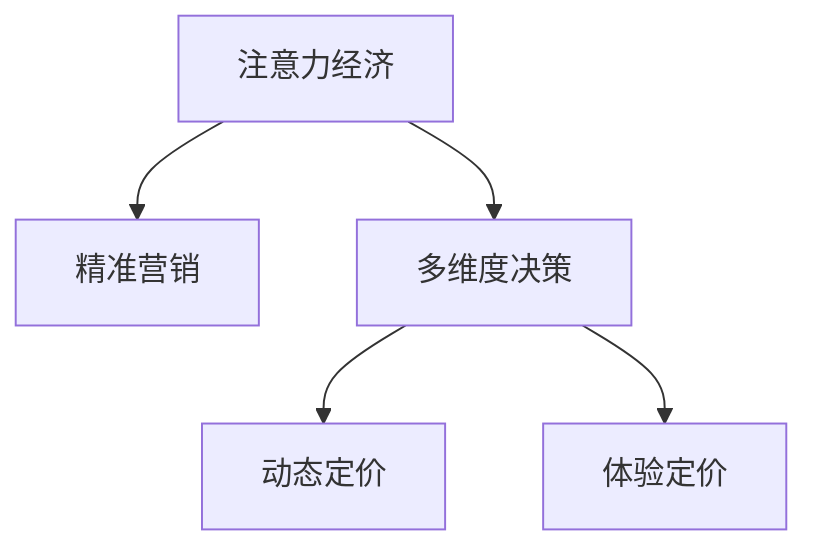

                 

# 注意力经济对企业产品定价的新要求

> 关键词：注意力经济, 产品定价, 精准营销, 个性化推荐, 多维度决策

## 1. 背景介绍

在数字化时代，信息的泛滥和消费者注意力的稀缺已经成为不争的事实。互联网和社交媒体的普及，使得内容生产者和消费者的接触更加便捷，但也加剧了用户注意力的竞争。在企业经营中，如何吸引和保持消费者的注意力，从而实现高效的产品定价，成为了一项重要的挑战。

### 1.1 注意力经济的兴起

注意力经济（Attention Economy）是指在信息过载的背景下，用户选择接收和消费信息的能力变得稀缺，从而引发了以争夺用户注意力为核心的商业模式。与传统经济通过扩大产品供给和市场规模来吸引消费者不同，注意力经济强调通过提升内容质量、优化用户体验等方式，吸引用户的时间和精力。

### 1.2 数字化转型的需求

数字化转型（Digital Transformation）是企业应对技术变革和市场竞争的必然选择。通过引入大数据、人工智能等技术，企业能够实现运营效率的提升和用户体验的改善，从而提升市场竞争力。但数字化转型并非一蹴而就，需要企业在产品定价、营销策略、客户管理等方面进行精细化调整。

### 1.3 产品定价的挑战

在注意力经济时代，产品定价不仅需要考虑成本和利润，还需考虑消费者心理、市场竞争等因素。传统的成本加成定价法（Cost-Plus Pricing）已逐渐失灵，企业亟需寻找新的定价模型，以实现利益最大化。本文旨在探讨注意力经济对企业产品定价的新要求，并提出相应的策略。

## 2. 核心概念与联系

### 2.1 核心概念概述

为更好地理解注意力经济对企业产品定价的影响，本节将介绍几个关键概念：

- **注意力经济（Attention Economy）**：以争夺用户注意力为核心的商业模式，强调内容质量和用户体验。
- **精准营销（Precision Marketing）**：利用大数据和AI技术，实现对目标用户群体的精准定位和个性化推荐。
- **多维度决策（Multi-Dimensional Decision Making）**：考虑多方面因素（如用户需求、市场环境、竞争对手等）进行综合决策。
- **动态定价（Dynamic Pricing）**：根据市场需求、用户行为等实时变化进行动态调整，以实现最优定价。
- **体验定价（Experience Pricing）**：通过提升产品体验、增强用户粘性等方式，实现高价值定价。

这些概念之间的逻辑关系可以通过以下Mermaid流程图来展示：



这个流程图展示了这个核心概念之间的关系：

1. 注意力经济为精准营销提供了基础，帮助企业了解用户偏好和需求。
2. 多维度决策是精准营销和动态定价的基础，通过全面考量多个因素，实现最优定价。
3. 动态定价和体验定价是实现多维度决策的重要手段，帮助企业在不断变化的市场环境中保持竞争优势。

## 3. 核心算法原理 & 具体操作步骤

### 3.1 算法原理概述

基于注意力经济的定价模型，旨在通过理解用户注意力、需求和行为，实现精细化、动态化的产品定价。其核心思想是：将用户对产品的关注度和互动行为作为定价依据，同时考虑市场竞争和用户心理，进行动态调整和优化。

### 3.2 算法步骤详解

基于注意力经济的定价模型主要包括以下几个关键步骤：

**Step 1: 数据收集与处理**

- 收集用户的点击、浏览、购买等行为数据，提取用户的兴趣偏好和消费习惯。
- 收集市场竞争对手的定价和促销信息，分析竞争态势。
- 通过调查问卷、用户反馈等途径，了解用户心理和需求。

**Step 2: 用户画像构建**

- 利用机器学习算法（如K-means、LDA等）对用户行为数据进行聚类分析，生成用户画像。
- 根据用户画像，构建不同用户群体的特征向量，用于后续的定价和推荐。

**Step 3: 定价策略设计**

- 根据用户画像和市场需求，设计多种定价策略，如成本加成、价值定价、竞争定价等。
- 引入动态定价模型，根据实时市场需求和用户行为进行动态调整。

**Step 4: 动态调整与优化**

- 使用强化学习算法（如Q-learning、SARSA等）对定价策略进行实时优化，不断调整价格以最大化收益。
- 引入价格弹性分析，评估价格变动对用户需求的影响，指导定价决策。

### 3.3 算法优缺点

基于注意力经济的定价模型具有以下优点：

1. **精准化定价**：通过用户行为数据和市场竞争信息，实现对目标用户群体的精准定价。
2. **动态化调整**：根据实时市场需求和用户行为进行动态调整，确保定价策略的灵活性。
3. **多维度考量**：考虑多方面因素（如用户需求、市场竞争、竞争对手等）进行综合决策，提升定价准确性。
4. **用户体验优化**：通过提升产品体验、增强用户粘性等方式，实现高价值定价。

同时，该模型也存在一定的局限性：

1. **数据依赖性高**：需要大量高质量的行为数据和市场信息，数据获取成本较高。
2. **模型复杂度高**：涉及多方面因素和多种算法，模型构建和优化复杂。
3. **用户隐私问题**：在数据收集和使用过程中，需注意用户隐私保护，避免侵犯用户权益。
4. **实时性要求高**：要求快速处理和分析数据，对技术要求较高。

尽管存在这些局限性，但就目前而言，基于注意力经济的定价模型仍是大企业实现精准营销和动态定价的重要手段。未来相关研究的重点在于如何进一步降低数据获取成本，提高模型优化效率，同时兼顾用户隐私和技术要求等因素。

### 3.4 算法应用领域

基于注意力经济的定价模型已经在多个领域得到了应用，包括电商、金融、旅游等：

- **电商领域**：通过分析用户的点击、购买记录和评价反馈，实现个性化推荐和动态定价。例如，亚马逊利用用户的浏览和购买历史，进行价格调整和促销活动。
- **金融领域**：通过分析用户的财务状况和行为数据，设计个性化的金融产品和服务。例如，银行利用用户的消费记录和信用评分，进行信用卡利率和贷款额度的动态调整。
- **旅游领域**：通过分析用户的旅游偏好和市场变化，进行实时定价和推荐。例如，携程根据用户的搜索记录和预订历史，动态调整旅游产品的价格和优惠策略。

除了上述这些经典领域外，基于注意力经济的定价模型还被创新性地应用到更多场景中，如智慧物流、智慧城市、智慧农业等，为这些行业带来了新的商业模式和业务机会。

## 4. 数学模型和公式 & 详细讲解 & 举例说明

### 4.1 数学模型构建

本节将使用数学语言对基于注意力经济的定价模型进行更加严格的刻画。

记用户对产品的关注度为 $A$，需求量为 $D$，市场竞争度为 $C$，用户心理预期为 $P$。假设用户关注度 $A$ 与需求量 $D$ 成正相关关系，即 $A = f(D)$。根据市场需求和用户行为，可建立如下数学模型：

$$
P = g(A, C, P)
$$

其中 $P$ 为产品价格，$A$ 为关注度，$C$ 为市场竞争度，$P$ 为用户心理预期。

### 4.2 公式推导过程

根据上述模型，可以推导出以下定价公式：

$$
P = c + v + d + m
$$

其中：
- $c$ 为产品成本。
- $v$ 为用户对产品的价值评估。
- $d$ 为用户对价格的敏感度，即价格弹性。
- $m$ 为市场竞争度对价格的影响。

在实际应用中，可以进一步细化各因素的计算方法，如：

- 用户关注度 $A$ 可以通过点击率、浏览量等指标计算。
- 用户心理预期 $P$ 可以通过用户历史购买记录、评价反馈等数据推断。
- 市场竞争度 $C$ 可以通过竞争对手的价格和促销活动等信息计算。
- 用户对产品的价值评估 $v$ 可以通过用户画像和市场分析确定。

### 4.3 案例分析与讲解

以下以电商领域为例，展示基于注意力经济的定价模型在实际中的应用。

假设某电商平台的某个产品 $X$ 的成本为 $c=10$ 元，市场需求为 $D=10000$ 件。通过用户行为数据和市场分析，发现用户对该产品的关注度 $A=0.5$（即50%的用户会对该产品进行浏览或购买），用户心理预期 $P=20$ 元。同时，市场竞争度 $C=0.8$（即市场上有80%的相同或类似产品）。

根据上述数据，可以计算出产品的最优定价为：

$$
P = c + v + d + m = 10 + 20 - 0.5 \times (20 - 10) + 0.8 \times (20 - 10) = 25.5
$$

即产品的最优定价为25.5元。

## 5. 项目实践：代码实例和详细解释说明

### 5.1 开发环境搭建

在进行定价模型开发前，我们需要准备好开发环境。以下是使用Python进行Pandas开发的环境配置流程：

1. 安装Anaconda：从官网下载并安装Anaconda，用于创建独立的Python环境。

2. 创建并激活虚拟环境：
```bash
conda create -n py3k python=3.8 
conda activate py3k
```

3. 安装Pandas：
```bash
conda install pandas
```

4. 安装各类工具包：
```bash
pip install numpy matplotlib sklearn jupyter notebook ipython
```

完成上述步骤后，即可在`py3k`环境中开始定价模型开发。

### 5.2 源代码详细实现

下面我们以电商领域为例，给出使用Pandas库进行定价模型开发的Python代码实现。

首先，定义用户行为数据处理函数：

```python
import pandas as pd

def process_user_behavior_data(df):
    # 处理用户行为数据，提取关注度、需求量等特征
    df['click_rate'] = df['click_count'] / df['total_clicks']
    df['view_count'] = df['view_count']
    df['purchase_count'] = df['purchase_count']
    return df
```

然后，定义定价模型函数：

```python
from scipy.optimize import minimize

def pricing_model(df, cost, target_price, competition_price):
    # 定义关注度函数
    def user_attention(df, target_price, competition_price):
        return df['click_rate'] * (target_price - competition_price) / (target_price + competition_price)
    
    # 定义定价函数
    def pricing(cost, target_price, competition_price, x):
        v = target_price - cost
        d = 0.5 * (target_price - competition_price) / (target_price + competition_price)
        m = 0.8 * (target_price - competition_price) / (target_price + competition_price)
        return v + d + m
    
    # 定义约束条件
    def constraint(x):
        return pricing(cost, x[0], competition_price, x)
    
    # 定义优化目标
    def objective(x):
        return (x[0] - target_price) ** 2
    
    # 进行优化求解
    result = minimize(objective, x0=[cost], method='BFGS', bounds=[(cost, None)], constraints={'type': 'eq', 'fun': constraint})
    
    return result.x[0]
```

最后，启动定价模型计算：

```python
# 加载用户行为数据
df = pd.read_csv('user_behavior_data.csv')

# 处理用户行为数据
df = process_user_behavior_data(df)

# 定义成本和目标价格
cost = 10
target_price = 20

# 获取市场竞争度
competition_price = df['price'].mean()

# 计算最优定价
optimal_price = pricing_model(df, cost, target_price, competition_price)
print(f"最优定价为：{optimal_price}")
```

以上就是使用Pandas库进行定价模型开发的完整代码实现。可以看到，得益于Pandas库的强大数据处理能力，我们可以用相对简洁的代码完成定价模型的计算。

### 5.3 代码解读与分析

让我们再详细解读一下关键代码的实现细节：

**process_user_behavior_data函数**：
- 对用户行为数据进行初步处理，提取关注度、需求量等关键特征，用于后续定价计算。

**pricing_model函数**：
- 定义关注度函数，计算用户对产品的关注度。
- 定义定价函数，根据关注度、需求量、市场竞争度等计算最优定价。
- 使用Scipy库的Optimize模块，通过约束条件和优化目标求解最优价格。

**优化过程**：
- 使用BFGS算法进行无约束优化，求解最优价格。
- 约束条件为关注度函数，确保用户关注度与市场需求、市场竞争度成正相关。
- 优化目标为价格与目标价格的平方差，最小化价格与目标价格的偏差。

**启动计算**：
- 加载用户行为数据，进行处理和清洗。
- 定义产品的成本和目标价格。
- 获取市场竞争度，计算最优定价。
- 输出计算结果。

可以看到，Pandas库配合Scipy库，使得定价模型的计算过程变得简洁高效。开发者可以将更多精力放在数据处理、模型改进等高层逻辑上，而不必过多关注底层的实现细节。

当然，工业级的系统实现还需考虑更多因素，如用户隐私保护、模型评估指标、优化策略等。但核心的定价模型基本与此类似。

## 6. 实际应用场景

### 6.1 电商行业

基于注意力经济的定价模型在电商行业具有广泛的应用场景，可以帮助电商平台实现精准营销和动态定价，提升用户满意度和收益。

具体而言，电商平台可以利用用户的点击、浏览、购买等行为数据，构建用户画像，分析用户对产品的关注度和需求量。根据市场需求、用户心理和市场竞争度等因素，设计动态定价策略。例如，对于热门商品，可以采用高价值定价，对于冷门商品，可以采用折扣策略吸引用户购买。

### 6.2 金融行业

在金融行业，基于注意力经济的定价模型同样具有重要应用价值。金融机构可以通过分析用户的财务状况和消费行为，设计个性化的金融产品和服务，提升用户黏性和收益。

例如，银行可以基于用户的历史交易记录和信用评分，设计个性化的信用卡利率和贷款额度。通过分析用户的投资偏好和市场动态，调整投资产品的定价策略，提高用户满意度和收益。

### 6.3 旅游行业

在旅游行业，基于注意力经济的定价模型可以帮助旅游平台实现实时定价和个性化推荐，提升用户体验和收益。

旅游平台可以通过分析用户的旅游偏好和预订记录，构建用户画像。根据市场需求、用户行为和市场竞争度等因素，设计动态定价策略。例如，对于热门旅游线路，可以采用高价值定价，对于冷门线路，可以采用促销策略吸引用户预订。

### 6.4 未来应用展望

随着注意力经济和数字化转型的深入发展，基于注意力经济的定价模型将在更多领域得到应用，为各行各业带来新的商业模式和业务机会。

在智慧医疗领域，基于注意力经济的定价模型可以帮助医疗机构实现精准医疗和个性化服务，提升医疗质量和患者体验。例如，医疗机构可以根据患者的健康数据和行为记录，设计个性化的治疗方案和药品定价策略。

在智能制造领域，基于注意力经济的定价模型可以帮助制造企业实现精细化管理和成本控制，提升生产效率和产品质量。例如，制造企业可以根据设备的运行数据和维护记录，设计个性化的维护计划和保养策略。

在智慧城市治理中，基于注意力经济的定价模型可以帮助城市管理机构实现精准服务和资源优化，提升城市治理水平。例如，城市管理机构可以根据居民的出行数据和行为记录，设计个性化的交通管理和公共服务策略。

此外，在教育、能源、环保等众多领域，基于注意力经济的定价模型也将不断涌现，为这些行业带来新的商业模式和业务机会。相信随着技术的不断进步和应用场景的拓展，基于注意力经济的定价模型必将在各个领域发挥重要作用，推动社会的数字化和智能化转型。

## 7. 工具和资源推荐

### 7.1 学习资源推荐

为了帮助开发者系统掌握注意力经济对企业产品定价的影响，这里推荐一些优质的学习资源：

1. 《数字化转型管理》系列博文：由大模型技术专家撰写，深入浅出地介绍了数字化转型的概念、价值和策略。

2. 《智能营销与精准定价》课程：由知名互联网公司开设的在线课程，涵盖智能营销、精准定价等前沿话题，助力企业实现数字化转型。

3. 《注意力经济与商业创新》书籍：分析注意力经济对商业模式的深远影响，探索如何在数字化时代实现商业创新。

4. 《Python数据科学手册》书籍：详细介绍了Pandas、Scipy等库的使用方法，是学习注意力经济定价模型的必备参考资料。

5. Kaggle平台：全球最大的数据科学竞赛平台，提供丰富的数据集和竞赛案例，助力开发者提升实际应用能力。

通过对这些资源的学习实践，相信你一定能够快速掌握注意力经济定价模型的精髓，并用于解决实际的商业问题。

### 7.2 开发工具推荐

高效的开发离不开优秀的工具支持。以下是几款用于注意力经济定价模型开发的常用工具：

1. Jupyter Notebook：基于Web的交互式开发环境，支持Python、R等语言的开发和调试，适合快速迭代研究。

2. PyCharm：流行的Python集成开发环境，支持代码高亮、自动补全等功能，提高开发效率。

3. Visual Studio Code：轻量级的代码编辑器，支持多种编程语言，并集成了丰富的插件生态系统。

4. Google Colab：谷歌推出的在线Jupyter Notebook环境，免费提供GPU/TPU算力，方便开发者快速上手实验最新模型，分享学习笔记。

合理利用这些工具，可以显著提升注意力经济定价模型的开发效率，加快创新迭代的步伐。

### 7.3 相关论文推荐

注意力经济和定价模型的发展源于学界的持续研究。以下是几篇奠基性的相关论文，推荐阅读：

1. The Economics of Attention：对注意力经济理论的深入探讨，分析用户注意力的价值和分配机制。

2. Dynamic Pricing in E-commerce：研究电商平台中动态定价策略的应用，探索如何实现价格优化和收益最大化。

3. Personalized Pricing in E-commerce：探讨个性化定价策略的实现方法，分析用户行为和市场竞争对定价的影响。

4. Experience Pricing：研究产品体验对定价的影响，探索如何通过提升用户体验实现高价值定价。

5. Multi-Dimensional Pricing Model：构建多维度定价模型，考虑用户需求、市场竞争、用户心理等因素，优化产品定价。

这些论文代表了大模型微调技术的发展脉络。通过学习这些前沿成果，可以帮助研究者把握学科前进方向，激发更多的创新灵感。

## 8. 总结：未来发展趋势与挑战

### 8.1 总结

本文对基于注意力经济的定价模型进行了全面系统的介绍。首先阐述了注意力经济对企业产品定价的影响，明确了精准营销和动态定价的重要性和方法。其次，从原理到实践，详细讲解了定价模型的数学原理和关键步骤，给出了定价模型开发的完整代码实例。同时，本文还广泛探讨了定价模型在电商、金融、旅游等多个行业领域的应用前景，展示了定价模型的巨大潜力。此外，本文精选了定价模型的各类学习资源，力求为读者提供全方位的技术指引。

通过本文的系统梳理，可以看到，基于注意力经济的定价模型正在成为企业实现精准营销和动态定价的重要手段，极大地拓展了定价模型的应用边界，催生了更多的落地场景。受益于数据获取和计算技术的不断进步，基于注意力经济的定价模型必将在数字化转型的浪潮中发挥越来越重要的作用。

### 8.2 未来发展趋势

展望未来，基于注意力经济的定价模型将呈现以下几个发展趋势：

1. **数据自动化获取**：随着数据采集和分析技术的进步，实时数据获取和处理变得更加高效。企业可以更快地获取用户行为数据，进行实时定价和优化。

2. **模型自适应性增强**：通过引入机器学习和深度学习技术，定价模型可以自动适应市场变化和用户行为，提升定价策略的灵活性和准确性。

3. **跨领域应用拓展**：随着企业数字化转型的深入，定价模型将逐渐拓展到更多领域，如智慧医疗、智能制造、智慧城市等。

4. **用户隐私保护提升**：随着用户隐私保护意识的增强，企业需要在数据收集和使用过程中，注重用户隐私保护，采用加密、匿名化等技术手段。

5. **智能推荐系统结合**：结合智能推荐系统，可以实现更加个性化的定价策略，提升用户体验和收益。

6. **国际市场拓展**：随着全球化进程的加速，企业需要考虑不同国家和地区的市场特点，设计多维度、多市场的定价策略。

以上趋势凸显了注意力经济定价模型的广阔前景。这些方向的探索发展，必将进一步提升企业定价的精准性和灵活性，实现利益最大化。

### 8.3 面临的挑战

尽管基于注意力经济的定价模型已经取得了瞩目成就，但在迈向更加智能化、普适化应用的过程中，它仍面临着诸多挑战：

1. **数据获取成本高**：实时获取高质量的用户行为数据，需要投入大量的人力和技术资源，数据获取成本较高。

2. **模型复杂度高**：定价模型涉及多方面因素和多种算法，模型构建和优化复杂。

3. **用户隐私问题**：在数据收集和使用过程中，需注意用户隐私保护，避免侵犯用户权益。

4. **实时性要求高**：要求快速处理和分析数据，对技术要求较高。

5. **市场竞争激烈**：定价模型需要考虑市场竞争度，进行实时动态调整，需要具备较强的市场敏感性。

6. **模型优化困难**：定价模型需要不断优化，以应对市场变化和用户行为，优化过程复杂且耗时。

尽管存在这些挑战，但就目前而言，基于注意力经济的定价模型仍是大企业实现精准营销和动态定价的重要手段。未来相关研究的重点在于如何进一步降低数据获取成本，提高模型优化效率，同时兼顾用户隐私和技术要求等因素。

### 8.4 研究展望

面对注意力经济定价模型所面临的种种挑战，未来的研究需要在以下几个方面寻求新的突破：

1. **自动化数据采集与处理**：开发高效、可靠的数据采集和处理工具，自动获取和处理用户行为数据，降低数据获取成本。

2. **智能定价算法设计**：研究基于机器学习和深度学习的定价算法，提升定价策略的灵活性和准确性。

3. **跨领域知识融合**：结合多领域知识，如符号化先验知识、领域专家的经验等，优化定价模型。

4. **用户隐私保护**：探索隐私保护技术，如数据匿名化、加密等，确保用户数据的安全性和隐私性。

5. **实时定价与推荐结合**：将定价模型与智能推荐系统结合，实现更加个性化的定价策略，提升用户体验和收益。

6. **国际市场适应性**：研究不同国家和地区的市场特点，设计多维度、多市场的定价策略，实现全球化布局。

这些研究方向的探索，必将引领注意力经济定价模型迈向更高的台阶，为企业的数字化转型和智能化升级提供新的技术支持。总之，基于注意力经济的定价模型需要从数据、算法、技术、市场等多个维度协同发力，才能实现精准定价和动态优化，推动企业在数字化时代的快速发展和成功转型。

---

作者：禅与计算机程序设计艺术 / Zen and the Art of Computer Programming

