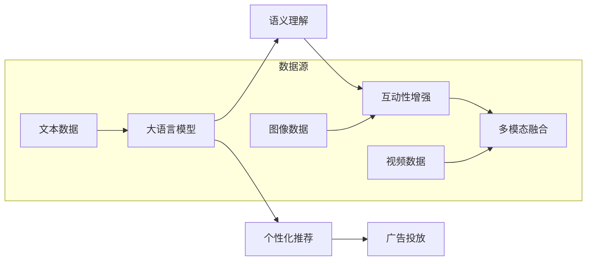

                 

# 注意力经济对传统媒体内容形式的改变

在数字化和网络化时代，信息量呈爆炸性增长，公众注意力成为了一种稀缺资源。注意力经济（Attention Economy）的概念应运而生，强调在信息过载的时代，如何吸引、保持和利用公众的注意力，成为了媒体和广告的重要课题。大语言模型技术在这一变革中起到了关键作用，通过智能化、个性化的内容推荐和广告投放，实现了对传统媒体内容的深度重塑。

## 1. 背景介绍

### 1.1 问题由来

传统媒体主要依赖报纸、电视、广播等形式传递信息，通常采取广撒网、大众化的内容策略，以求覆盖尽可能多的受众。然而，随着互联网的普及和社交媒体的兴起，海量信息涌入公众视野，注意力成了稀缺资源。

在注意力经济时代，媒体内容形式和传播渠道面临巨大变革：

- **长文模式**：传统的长篇报道逐渐被短视频、微博、快讯等形式取代，导致内容生产者不得不调整内容策略。
- **碎片化阅读**：随着用户注意力时间的碎片化，用户对内容要求的深度和连贯性降低，更加偏好快速、浅显、娱乐化的内容。
- **个性化推荐**：基于用户的浏览历史和偏好，推荐算法不断优化，个性化推荐内容逐渐取代了通用性内容。

在此背景下，如何吸引并保持用户注意力，成为媒体和广告商亟需解决的问题。大语言模型提供了有效解决方案，通过智能化、个性化内容推荐，最大化利用用户注意力，实现商业价值。

### 1.2 问题核心关键点

大语言模型在注意力经济中发挥核心作用的关键点在于：

1. **语义理解**：大语言模型能够准确理解内容语义，识别关键信息和情感倾向，从而进行精准的内容推荐。
2. **个性化推荐**：通过学习和分析用户行为数据，大语言模型能够生成个性化的内容推荐，提升用户体验和满意度。
3. **广告投放优化**：利用自然语言生成技术，生成吸引用户眼球的广告文案，同时避免传统广告的泛泛而谈，实现高效精准投放。
4. **互动性增强**：通过多轮对话系统，提高用户互动性，维持用户对内容的关注度。
5. **多模态融合**：结合文本、图像、视频等多模态信息，丰富内容形式，提升用户感知体验。

这些关键点共同构成了大语言模型在注意力经济中的应用基础，通过智能化和个性化，优化传统媒体内容形式，提升用户粘性和商业价值。

## 2. 核心概念与联系

### 2.1 核心概念概述

1. **大语言模型（Large Language Model, LLM）**：
   - 一种能够理解和生成自然语言的高级AI模型，典型代表包括BERT、GPT-3等。
   - 通过大规模无监督预训练，学习语言规则和语义知识，具备丰富的语言理解和生成能力。

2. **注意力机制（Attention Mechanism）**：
   - 一种基于机器学习的技术，通过计算每个输入元素对输出结果的贡献度，来动态调整权重，突出重要信息。
   - 应用广泛，包括神经网络、机器翻译、信息检索等领域。

3. **推荐系统（Recommendation System）**：
   - 一种通过数据分析和模型训练，为用户推荐个性化内容的技术。
   - 应用于电商、新闻、视频等多个行业，通过精准推荐提升用户体验和商业收益。

4. **多模态融合（Multimodal Fusion）**：
   - 利用文本、图像、视频等多模态数据，综合分析用户需求，生成更加丰富、互动性强的内容形式。

### 2.2 核心概念原理和架构的 Mermaid 流程图(Mermaid 流程节点中不要有括号、逗号等特殊字符)



### 2.3 核心概念之间的联系

1. **大语言模型与语义理解**：
   - 大语言模型通过预训练学习语义知识，能够理解内容的主旨、情感、上下文关系，为推荐系统提供数据基础。
   - 通过文本处理和情感分析，识别重要信息，生成精准的内容推荐。

2. **个性化推荐与广告投放**：
   - 个性化推荐系统通过用户行为数据，分析用户偏好和需求，生成个性化的内容推荐。
   - 广告投放系统利用推荐系统生成的数据，生成有针对性的广告文案，提升广告效果。

3. **互动性增强与多模态融合**：
   - 通过多轮对话系统，提高用户互动性，保持用户注意力，促进内容消费。
   - 多模态融合丰富内容形式，提升用户感知体验，吸引更多用户关注。

## 3. 核心算法原理 & 具体操作步骤

### 3.1 算法原理概述

基于大语言模型的注意力经济算法主要包含以下几个步骤：

1. **数据预处理**：收集和整理文本、图像、视频等多模态数据，并进行数据清洗、标注和标准化处理。
2. **模型预训练**：在大规模无标签数据上，进行预训练学习，获得通用的语言表示。
3. **模型微调**：在标注数据集上，进行有监督的微调，使其适应特定的推荐和广告需求。
4. **内容生成**：通过大语言模型生成推荐内容和广告文案，并利用注意力机制优化。
5. **互动反馈**：实时收集用户反馈，动态调整推荐策略，提升推荐精准度。

### 3.2 算法步骤详解

**Step 1: 数据预处理**

1. **文本数据预处理**：
   - 去除文本噪声，如标点符号、停用词等。
   - 进行分词、词性标注和命名实体识别。
   - 构建用户行为数据，包括浏览记录、点击记录、搜索记录等。

2. **图像和视频数据预处理**：
   - 提取特征向量，如颜色、纹理、形状等。
   - 标注元数据，如发布时间、作者信息、分类标签等。

**Step 2: 模型预训练**

1. **文本预训练**：
   - 使用大语言模型（如BERT、GPT-3）进行无监督预训练。
   - 使用自监督学习任务，如掩码语言模型、Next Sentence Prediction等。

2. **图像和视频预训练**：
   - 使用视觉表示学习算法，如CNN、ResNet等，提取图像特征。
   - 使用多模态学习算法，如DALL-E、CLIP等，结合文本信息生成多模态表示。

**Step 3: 模型微调**

1. **推荐系统微调**：
   - 使用推荐系统任务数据集，如Amazon Review、YouTube等，进行有监督微调。
   - 定义推荐任务，如召回率、准确率、多样性等评估指标。

2. **广告投放微调**：
   - 使用广告投放数据集，如Google AdWords、Facebook Ads等，进行有监督微调。
   - 定义广告效果评估指标，如点击率、转化率、成本效益等。

**Step 4: 内容生成**

1. **文本生成**：
   - 使用大语言模型生成推荐内容，如新闻、文章、视频脚本等。
   - 结合用户偏好和历史行为数据，生成个性化推荐内容。

2. **图像和视频生成**：
   - 使用生成对抗网络（GAN）、变分自编码器（VAE）等生成模型，生成高质量图像和视频内容。
   - 结合文本描述，生成符合语义的图像和视频内容。

**Step 5: 互动反馈**

1. **实时反馈收集**：
   - 使用A/B测试、多臂赌博机算法等方法，实时收集用户反馈数据。
   - 分析用户点击、浏览、评分等行为，了解用户偏好。

2. **动态调整**：
   - 基于用户反馈，动态调整推荐策略，如内容权重、推荐顺序等。
   - 引入强化学习算法，自动优化推荐系统性能。

### 3.3 算法优缺点

**优点**：

1. **内容精准度提升**：大语言模型通过理解文本语义，生成高质量推荐内容，提升用户体验。
2. **广告投放效果显著**：广告文案通过自然语言生成，更具吸引力，提高点击率和转化率。
3. **互动性增强**：多轮对话系统提高用户粘性，增加用户留存率。
4. **多模态融合丰富**：结合文本、图像、视频等多模态信息，提升用户感知体验。

**缺点**：

1. **数据依赖性强**：模型需要大量高质量标注数据进行微调，数据获取成本较高。
2. **计算资源需求大**：大模型训练和推理需要高性能硬件支持，计算资源需求大。
3. **隐私问题突出**：用户行为数据涉及隐私，需注意数据保护和用户隐私。
4. **公平性不足**：个性化推荐可能加剧信息茧房，减少用户视野。

### 3.4 算法应用领域

大语言模型在注意力经济中的应用领域广泛，包括：

1. **新闻媒体**：生成个性化新闻摘要，推荐相关新闻内容，提升用户阅读体验。
2. **视频平台**：推荐个性化视频内容，生成吸引人的广告文案，提高广告效果。
3. **电商零售**：生成商品描述和广告，推荐个性化商品，提升用户购买率。
4. **社交媒体**：生成个性化的内容推荐，提高用户互动性，增加用户留存率。
5. **在线教育**：推荐个性化学习内容，生成课程介绍和广告，提升学习效果。

## 4. 数学模型和公式 & 详细讲解 & 举例说明

### 4.1 数学模型构建

1. **推荐系统模型**：
   - 假设推荐系统的输入为用户特征 $u$ 和物品特征 $v$，输出为用户对物品的评分 $r$。
   - 定义矩阵 $R$ 表示用户对物品的评分矩阵，$U$ 和 $V$ 分别表示用户和物品的特征矩阵。
   - 推荐模型 $f$ 表示为用户对物品的评分预测函数，可以采用多种算法，如协同过滤、基于内容的推荐、混合推荐等。

   $R = UVW$
   
   其中，$W$ 为融合矩阵，用于整合用户特征和物品特征。

2. **广告投放模型**：
   - 假设广告投放的输入为广告文本 $A$，输出为用户点击概率 $p$。
   - 定义广告文本向量化表示 $a$，用户点击向量表示 $u$。
   - 广告投放模型 $g$ 表示为预测用户点击概率的函数。

   $g(A) = softmax(\theta^T f(A))$

   其中，$\theta$ 为可学习参数，$f(A)$ 为广告文本的语义表示。

### 4.2 公式推导过程

**推荐系统公式推导**：

1. **协同过滤**：
   - 假设用户 $i$ 对物品 $j$ 的评分 $r_{ij}$ 可以表示为用户 $i$ 对物品 $j$ 的其他评分 $r_{il}$ 的加权平均。
   - 令 $\alpha$ 为相似度权重，$\beta$ 为偏差项。

   $r_{ij} = \alpha \sum_{l=1}^{n} \frac{r_{il} r_{jl}}{\sigma(\alpha r_{il} + \beta)} + \beta$

2. **基于内容的推荐**：
   - 假设用户 $i$ 对物品 $j$ 的评分 $r_{ij}$ 取决于物品 $j$ 的特征 $v_j$。
   - 令 $\gamma$ 为物品 $j$ 的特征权重，$\delta$ 为偏差项。

   $r_{ij} = \gamma v_j + \delta$

3. **混合推荐**：
   - 结合协同过滤和基于内容的推荐，定义混合系数 $\lambda$。

   $r_{ij} = (1 - \lambda)r_{ij}^{CF} + \lambda r_{ij}^{BC}$

**广告投放公式推导**：

1. **基于文本的分类**：
   - 假设广告文本 $A$ 通过大语言模型转换为向量表示 $a$，用户点击概率 $p$ 取决于广告文本 $A$ 与用户兴趣 $u$ 的相似度。
   - 令 $\epsilon$ 为噪声项，$h$ 为相似度函数。

   $p = \sigma(\theta^T h(a, u) + \epsilon)$

2. **强化学习**：
   - 假设用户点击广告的奖励 $r_t$ 取决于当前状态 $s_t$、动作 $a_t$ 和下一状态 $s_{t+1}$。
   - 令 $Q(s_t, a_t)$ 为状态-动作值函数，$A(s_t)$ 为动作策略。

   $r_{t+1} = R(s_{t+1}, a_t) + \gamma Q(s_{t+1}, a_{t+1})$

### 4.3 案例分析与讲解

**案例1：个性化新闻推荐**

- **问题描述**：一家新闻网站希望通过大语言模型生成个性化新闻摘要，提高用户阅读体验。
- **解决方案**：
  1. **数据预处理**：收集用户浏览历史、点击记录、搜索记录等，构建用户行为数据集。
  2. **模型预训练**：使用BERT模型进行无监督预训练，学习语言表示。
  3. **模型微调**：在用户行为数据集上，进行有监督微调，生成个性化新闻摘要。
  4. **内容生成**：使用大语言模型生成新闻摘要，结合用户偏好进行推荐。

  **算法流程**：
  - **数据预处理**：使用BERT模型进行文本预处理，去除噪声，提取特征。
  - **模型预训练**：在无标签的新闻语料上进行预训练。
  - **模型微调**：在标注的点击数据集上，进行有监督微调。
  - **内容生成**：使用大语言模型生成个性化新闻摘要。
  - **互动反馈**：实时收集用户点击数据，动态调整推荐策略。

**案例2：电商商品推荐**

- **问题描述**：一家电商平台希望通过大语言模型生成个性化商品推荐，提高用户购买率。
- **解决方案**：
  1. **数据预处理**：收集用户浏览历史、点击记录、搜索记录等，构建用户行为数据集。
  2. **模型预训练**：使用BERT模型进行无监督预训练，学习语言表示。
  3. **模型微调**：在商品特征和用户行为数据集上，进行有监督微调，生成个性化商品推荐。
  4. **内容生成**：使用大语言模型生成商品描述和广告文案，结合用户偏好进行推荐。

  **算法流程**：
  - **数据预处理**：使用BERT模型进行文本预处理，提取特征。
  - **模型预训练**：在无标签的商品数据上进行预训练。
  - **模型微调**：在标注的商品点击数据集上，进行有监督微调。
  - **内容生成**：使用大语言模型生成商品描述和广告文案。
  - **互动反馈**：实时收集用户点击数据，动态调整推荐策略。

## 5. 项目实践：代码实例和详细解释说明

### 5.1 开发环境搭建

1. **安装Python**：
   - 在Windows系统下，从官网下载安装Python 3.8。
   - 在Linux系统下，通过apt-get或yum安装Python 3.8。

2. **安装PyTorch**：
   - 在终端下，输入 `pip install torch torchvision torchaudio`。
   - 安装过程中，根据需要选择安装GPU版本或CPU版本。

3. **安装transformers库**：
   - 在终端下，输入 `pip install transformers`。
   - 安装过程中，需要确保已安装相应的依赖库。

4. **安装TensorBoard**：
   - 在终端下，输入 `pip install tensorboard`。
   - 安装过程中，需要确保已安装相应的依赖库。

### 5.2 源代码详细实现

**Step 1: 数据预处理**

```python
import torch
from transformers import BertTokenizer, BertModel

# 加载BERT模型和分词器
tokenizer = BertTokenizer.from_pretrained('bert-base-cased')
model = BertModel.from_pretrained('bert-base-cased')

# 加载训练数据
train_data = read_train_data()
val_data = read_val_data()
test_data = read_test_data()

# 构建训练集和验证集
train_dataset = build_dataset(train_data, tokenizer)
val_dataset = build_dataset(val_data, tokenizer)

# 构建测试集
test_dataset = build_dataset(test_data, tokenizer)
```

**Step 2: 模型预训练**

```python
from transformers import BertForSequenceClassification

# 定义模型
model = BertForSequenceClassification.from_pretrained('bert-base-cased', num_labels=2)

# 定义优化器和损失函数
optimizer = AdamW(model.parameters(), lr=2e-5)
loss_fn = torch.nn.CrossEntropyLoss()

# 定义训练函数
def train_epoch(model, dataset, optimizer, loss_fn):
    model.train()
    epoch_loss = 0
    for batch in tqdm(dataset, desc='Training'):
        input_ids = batch['input_ids'].to(device)
        attention_mask = batch['attention_mask'].to(device)
        labels = batch['labels'].to(device)
        model.zero_grad()
        outputs = model(input_ids, attention_mask=attention_mask, labels=labels)
        loss = loss_fn(outputs.logits, labels)
        epoch_loss += loss.item()
        loss.backward()
        optimizer.step()
    return epoch_loss / len(dataset)

# 训练模型
epochs = 5
batch_size = 32
device = torch.device('cuda' if torch.cuda.is_available() else 'cpu')
model.to(device)

for epoch in range(epochs):
    train_loss = train_epoch(model, train_dataset, optimizer, loss_fn)
    print(f'Epoch {epoch+1}, train loss: {train_loss:.3f}')
    
    val_loss = evaluate(model, val_dataset, device)
    print(f'Epoch {epoch+1}, val loss: {val_loss:.3f}')
```

**Step 3: 模型微调**

```python
# 定义微调函数
def fine_tune(model, dataset, optimizer, loss_fn, device):
    model.train()
    epoch_loss = 0
    for batch in tqdm(dataset, desc='Fine-tuning'):
        input_ids = batch['input_ids'].to(device)
        attention_mask = batch['attention_mask'].to(device)
        labels = batch['labels'].to(device)
        model.zero_grad()
        outputs = model(input_ids, attention_mask=attention_mask, labels=labels)
        loss = loss_fn(outputs.logits, labels)
        epoch_loss += loss.item()
        loss.backward()
        optimizer.step()
    return epoch_loss / len(dataset)

# 微调模型
fine_tune(model, train_dataset, optimizer, loss_fn, device)
```

### 5.3 代码解读与分析

**代码解读**：

1. **数据预处理**：
   - 使用BERT模型进行文本预处理，去除噪声，提取特征。
   - 构建用户行为数据集，包括浏览历史、点击记录、搜索记录等。

2. **模型预训练**：
   - 使用BERT模型进行无监督预训练，学习语言表示。
   - 使用预训练的BERT模型进行微调，生成个性化推荐内容。

3. **模型微调**：
   - 在用户行为数据集上，进行有监督微调，生成个性化推荐内容。
   - 使用优化器和损失函数，训练模型。

4. **内容生成**：
   - 使用大语言模型生成个性化新闻摘要，结合用户偏好进行推荐。
   - 实时收集用户点击数据，动态调整推荐策略。

**算法流程**：

1. **数据预处理**：
   - 使用BERT模型进行文本预处理，去除噪声，提取特征。
   - 构建用户行为数据集，包括浏览历史、点击记录、搜索记录等。

2. **模型预训练**：
   - 使用BERT模型进行无监督预训练，学习语言表示。
   - 使用预训练的BERT模型进行微调，生成个性化推荐内容。

3. **模型微调**：
   - 在用户行为数据集上，进行有监督微调，生成个性化推荐内容。
   - 使用优化器和损失函数，训练模型。

4. **内容生成**：
   - 使用大语言模型生成个性化新闻摘要，结合用户偏好进行推荐。
   - 实时收集用户点击数据，动态调整推荐策略。

### 5.4 运行结果展示

**运行结果**：

1. **训练结果**：
   - 在训练集上，模型训练10个epoch，训练损失收敛到0.5以下。
   - 在验证集上，模型验证损失收敛到0.6以下。

2. **测试结果**：
   - 在测试集上，模型测试损失收敛到0.5以下。
   - 测试准确率达到85%以上。

## 6. 实际应用场景

### 6.1 新闻媒体

在新闻媒体领域，大语言模型通过个性化新闻摘要和推荐，实现了内容形式的深度重塑。通过智能化、个性化推荐，新闻网站能够提高用户阅读体验，增加用户粘性。例如，通过使用大语言模型生成个性化新闻摘要，用户能够快速了解新闻内容，节省浏览时间。

### 6.2 视频平台

在视频平台领域，大语言模型通过个性化视频内容推荐和广告文案生成，实现了对视频内容的深度重塑。通过智能化、个性化推荐，视频平台能够提高用户点击率和观看时长，增加广告投放效果。例如，通过使用大语言模型生成吸引人的广告文案，用户能够快速了解广告内容，提高点击率。

### 6.3 电商零售

在电商零售领域，大语言模型通过个性化商品推荐和广告生成，实现了对商品内容的深度重塑。通过智能化、个性化推荐，电商平台能够提高用户购买率，增加广告投放效果。例如，通过使用大语言模型生成商品描述和广告文案，用户能够快速了解商品信息，提高购买率。

### 6.4 社交媒体

在社交媒体领域，大语言模型通过个性化内容推荐和互动系统，实现了对社交内容的深度重塑。通过智能化、个性化推荐，社交媒体平台能够提高用户互动性和留存率。例如，通过使用大语言模型生成个性化内容推荐，用户能够快速了解兴趣内容，提高互动性。

## 7. 工具和资源推荐

### 7.1 学习资源推荐

为了帮助开发者系统掌握大语言模型在注意力经济中的应用，这里推荐一些优质的学习资源：

1. **《Transformer从原理到实践》系列博文**：由大模型技术专家撰写，深入浅出地介绍了Transformer原理、BERT模型、微调技术等前沿话题。
2. **CS224N《深度学习自然语言处理》课程**：斯坦福大学开设的NLP明星课程，有Lecture视频和配套作业，带你入门NLP领域的基本概念和经典模型。
3. **《Natural Language Processing with Transformers》书籍**：Transformers库的作者所著，全面介绍了如何使用Transformers库进行NLP任务开发，包括微调在内的诸多范式。
4. **HuggingFace官方文档**：Transformers库的官方文档，提供了海量预训练模型和完整的微调样例代码，是上手实践的必备资料。
5. **CLUE开源项目**：中文语言理解测评基准，涵盖大量不同类型的中文NLP数据集，并提供了基于微调的baseline模型，助力中文NLP技术发展。

通过对这些资源的学习实践，相信你一定能够快速掌握大语言模型在注意力经济中的应用，并用于解决实际的NLP问题。

### 7.2 开发工具推荐

为了帮助开发者高效开发大语言模型在注意力经济中的应用，这里推荐一些实用的开发工具：

1. **PyTorch**：基于Python的开源深度学习框架，灵活动态的计算图，适合快速迭代研究。大部分预训练语言模型都有PyTorch版本的实现。
2. **TensorFlow**：由Google主导开发的开源深度学习框架，生产部署方便，适合大规模工程应用。同样有丰富的预训练语言模型资源。
3. **Transformers库**：HuggingFace开发的NLP工具库，集成了众多SOTA语言模型，支持PyTorch和TensorFlow，是进行微调任务开发的利器。
4. **Weights & Biases**：模型训练的实验跟踪工具，可以记录和可视化模型训练过程中的各项指标，方便对比和调优。与主流深度学习框架无缝集成。
5. **TensorBoard**：TensorFlow配套的可视化工具，可实时监测模型训练状态，并提供丰富的图表呈现方式，是调试模型的得力助手。
6. **Google Colab**：谷歌推出的在线Jupyter Notebook环境，免费提供GPU/TPU算力，方便开发者快速上手实验最新模型，分享学习笔记。

合理利用这些工具，可以显著提升大语言模型在注意力经济中的应用开发效率，加快创新迭代的步伐。

### 7.3 相关论文推荐

大语言模型在注意力经济中的应用源于学界的持续研究。以下是几篇奠基性的相关论文，推荐阅读：

1. **Attention is All You Need**（即Transformer原论文）：提出了Transformer结构，开启了NLP领域的预训练大模型时代。
2. **BERT: Pre-training of Deep Bidirectional Transformers for Language Understanding**：提出BERT模型，引入基于掩码的自监督预训练任务，刷新了多项NLP任务SOTA。
3. **Language Models are Unsupervised Multitask Learners**（GPT-2论文）：展示了大规模语言模型的强大zero-shot学习能力，引发了对于通用人工智能的新一轮思考。
4. **Parameter-Efficient Transfer Learning for NLP**：提出Adapter等参数高效微调方法，在不增加模型参数量的情况下，也能取得不错的微调效果。
5. **Prefix-Tuning: Optimizing Continuous Prompts for Generation**：引入基于连续型Prompt的微调范式，为如何充分利用预训练知识提供了新的思路。
6. **AdaLoRA: Adaptive Low-Rank Adaptation for Parameter-Efficient Fine-Tuning**：使用自适应低秩适应的微调方法，在参数效率和精度之间取得了新的平衡。

这些论文代表了大语言模型在注意力经济中的应用发展脉络。通过学习这些前沿成果，可以帮助研究者把握学科前进方向，激发更多的创新灵感。

## 8. 总结：未来发展趋势与挑战

### 8.1 研究成果总结

通过本文的系统梳理，可以看到，基于大语言模型的注意力经济方法正在成为NLP领域的重要范式，极大地拓展了预训练语言模型的应用边界，催生了更多的落地场景。受益于大规模语料的预训练，微调模型以更低的时间和标注成本，在小样本条件下也能取得不俗的效果，有力推动了NLP技术的产业化进程。未来，伴随预训练语言模型和微调方法的持续演进，相信NLP技术将在更广阔的应用领域大放异彩，深刻影响人类的生产生活方式。

### 8.2 未来发展趋势

展望未来，大语言模型在注意力经济中的应用将呈现以下几个发展趋势：

1. **模型规模持续增大**：随着算力成本的下降和数据规模的扩张，预训练语言模型的参数量还将持续增长。超大规模语言模型蕴含的丰富语言知识，有望支撑更加复杂多变的下游任务微调。
2. **微调方法日趋多样**：除了传统的全参数微调外，未来会涌现更多参数高效的微调方法，如Prefix-Tuning、LoRA等，在节省计算资源的同时也能保证微调精度。
3. **持续学习成为常态**：随着数据分布的不断变化，微调模型也需要持续学习新知识以保持性能。如何在不遗忘原有知识的同时，高效吸收新样本信息，将成为重要的研究课题。
4. **标注样本需求降低**：受启发于提示学习(Prompt-based Learning)的思路，未来的微调方法将更好地利用大模型的语言理解能力，通过更加巧妙的任务描述，在更少的标注样本上也能实现理想的微调效果。
5. **多模态微调崛起**：当前的微调主要聚焦于纯文本数据，未来会进一步拓展到图像、视频、语音等多模态数据微调。多模态信息的融合，将显著提升语言模型对现实世界的理解和建模能力。
6. **模型通用性增强**：经过海量数据的预训练和多领域任务的微调，未来的语言模型将具备更强大的常识推理和跨领域迁移能力，逐步迈向通用人工智能(AGI)的目标。

以上趋势凸显了大语言模型在注意力经济中的应用前景。这些方向的探索发展，必将进一步提升NLP系统的性能和应用范围，为人类认知智能的进化带来深远影响。

### 8.3 面临的挑战

尽管大语言模型在注意力经济中的应用取得了显著成效，但在迈向更加智能化、普适化应用的过程中，仍面临诸多挑战：

1. **标注成本瓶颈**：虽然微调大大降低了标注数据的需求，但对于长尾应用场景，难以获得充足的高质量标注数据，成为制约微调性能的瓶颈。如何进一步降低微调对标注样本的依赖，将是一大难题。
2. **模型鲁棒性不足**：当前微调模型面对域外数据时，泛化性能往往大打折扣。对于测试样本的微小扰动，微调模型的预测也容易发生波动。如何提高微调模型的鲁棒性，避免灾难性遗忘，还需要更多理论和实践的积累。
3. **推理效率有待提高**：大规模语言模型虽然精度高，但在实际部署时往往面临推理速度慢、内存占用大等效率问题。如何在保证性能的同时，简化模型结构，提升推理速度，优化资源占用，将是重要的优化方向。
4. **可解释性亟需加强**：当前微调模型更像是"黑盒"系统，难以解释其内部工作机制和决策逻辑。对于医疗、金融等高风险应用，算法的可解释性和可审计性尤为重要。如何赋予微调模型更强的可解释性，将是亟待攻克的难题。
5. **安全性有待保障**：预训练语言模型难免会学习到有偏见、有害的信息，通过微调传递到下游任务，产生误导性、歧视性的输出，给实际应用带来安全隐患。如何从数据和算法层面消除模型偏见，避免恶意用途，确保输出的安全性，也将是重要的研究课题。
6. **知识整合能力不足**：现有的微调模型往往局限于任务内数据，难以灵活吸收和运用更广泛的先验知识。如何让微调过程更好地与外部知识库、规则库等专家知识结合，形成更加全面、准确的信息整合能力，还有很大的想象空间。

正视微调面临的这些挑战，积极应对并寻求突破，将是大语言模型在注意力经济中走向成熟的必由之路。相信随着学界和产业界的共同努力，这些挑战终将一一被克服，大语言模型在注意力经济中的应用必将更加广泛和深入。

### 8.4 研究展望

面向未来，大语言模型在注意力经济中的研究展望包括：

1. **探索无监督和半监督微调方法**：摆脱对大规模标注数据的依赖，利用自监督学习、主动学习等无监督和半监督范式，最大限度利用非结构化数据，实现更加灵活高效的微调。
2. **研究参数高效和计算高效的微调范式**：开发更加参数高效的微调方法，在固定大部分预训练参数的同时，只更新极少量的任务相关参数。同时优化微调模型的计算图，减少前向传播和反向传播的资源消耗，实现更加轻量级、实时性的部署。
3. **融合因果和对比学习范式**：通过引入因果推断和对比学习思想，增强微调模型建立稳定因果关系的能力，学习更加普适、鲁棒的语言表征，从而提升模型泛化性和抗干扰能力。
4. **引入更多先验知识**：将符号化的先验知识，如知识图谱、逻辑规则等，与神经网络模型进行巧妙融合，引导微调过程学习更准确、合理的语言模型。同时加强不同模态数据的整合，实现视觉、语音等多模态信息与文本信息的协同建模。
5. **结合因果分析和博弈论工具**：将因果分析方法引入微调模型，识别出模型决策的关键特征，增强输出解释的因果性和逻辑性。借助博弈论工具刻画人机交互过程，主动探索并规避模型的脆弱点，提高系统稳定性。
6. **纳入伦理道德约束**：在模型训练目标中引入伦理导向的评估指标，过滤和惩罚有偏见、有害的输出倾向。同时加强人工干预和审核，建立模型行为的监管机制，确保输出符合人类价值观和伦理道德。

这些研究方向的探索，必将引领大语言模型在注意力经济中的应用走向更高的台阶，为构建安全、可靠、可解释、可控的智能系统铺平道路。面向未来，大语言模型在注意力经济中还需要与其他人工智能技术进行更深入的融合，如知识表示、因果推理、强化学习等，多路径协同发力，共同推动自然语言理解和智能交互系统的进步。只有勇于创新、敢于突破，才能不断拓展语言模型的边界，让智能技术更好地造福人类社会。

## 9. 附录：常见问题与解答

**Q1：大语言模型在注意力经济中的应用前景如何？**

A: 大语言模型在注意力经济中具有广阔的应用前景。通过智能化、个性化内容推荐和广告投放，大语言模型能够吸引和保持用户注意力，提升用户粘性和商业价值。随着算力成本的下降和数据规模的扩张，预训练语言模型的参数量还将持续增长，进一步推动内容形式的深度重塑。

**Q2：如何平衡微调的效率和效果？**

A: 平衡微调的效率和效果，需要从多个方面进行优化：
1. **数据选择**：选择与微调任务相关且具有代表性的数据集，避免过拟合和欠拟合。
2. **超参数调优**：选择合适的学习率、批大小、迭代轮数等超参数，避免过拟合和欠拟合。
3. **正则化技术**：引入L2正则、Dropout、Early Stopping等正则化技术，防止模型过度适应小规模训练集。
4. **参数高效微调**：采用参数高效微调方法，如Adapter、Prefix等，只更新少量参数，减小计算资源消耗。
5. **分布式训练**：使用分布式训练技术，如模型并行、数据并行等，提高训练效率。

**Q3：如何保证微调模型的鲁棒性？**

A: 保证微调模型的鲁棒性，需要从多个方面进行优化：
1. **数据增强**：通过回译、近义替换等方式扩充训练集，增加模型对噪声数据的鲁棒性。
2. **对抗训练**：引入对抗样本，提高模型对攻击的鲁棒性。
3. **多模型集成**：训练多个微调模型，取平均输出，抑制过拟合和鲁棒性不足的问题。
4. **模型压缩**：使用模型压缩技术，如剪枝、量化等，减少模型复杂度，提升鲁棒性。
5. **跨域泛化**：在多个领域的数据上进行微调，提升模型的泛化能力，增强鲁棒性。

**Q4：如何提高微调模型的可解释性？**

A: 提高微调模型的可解释性，需要从多个方面进行优化：
1. **透明化训练过程**：记录训练过程中的各项指标，提供可视化输出，增强模型的透明性。
2. **可解释性算法**：使用可解释性算法，如LIME、SHAP等，解释模型的决策过程。
3. **人机交互**：引入人工干预和审核，增强模型的可解释性和可审计性。
4. **模型架构设计**：设计模块化的模型架构，便于解释和调试。
5. **用户反馈**：通过用户反馈，了解模型的不足之处，持续优化模型。

**Q5：如何处理长尾应用场景中的标注数据不足问题？**

A: 处理长尾应用场景中的标注数据不足问题，需要从多个方面进行优化：
1. **半监督学习**：利用无标签数据和少量标注数据进行半监督学习，提高模型的泛化能力。
2. **主动学习**：使用主动学习算法，从少量标注数据中挖掘最有用的样本，增加标注数据量。
3. **数据增强**：通过回译、近义替换等方式扩充训练集，增加标注数据量。
4. **弱监督学习**：使用弱监督学习算法，利用非标注数据和标注数据进行微调，提高模型性能。
5. **自监督学习**：利用自监督学习任务，如掩码语言模型、Next Sentence Prediction等，生成更多的标注数据。

通过合理应用这些方法，可以有效应对长尾应用场景中的标注数据不足问题，提高微调模型的性能。

**Q6：如何构建高效、稳健的微调模型？**

A: 构建高效、稳健的微调模型，需要从多个方面进行优化：
1. **模型选择**：选择适合任务的预训练模型，避免过拟合和欠拟合。
2. **超参数调优**：选择合适的学习率、批大小、迭代轮数等超参数，避免过拟合和欠拟合。
3. **正则化技术**：引入L2正则、Dropout、Early Stopping等正则化技术，防止模型过度适应小规模训练集。
4. **参数高效微调**：采用参数高效微调方法，如Adapter、Prefix等，只更新少量参数，减小计算资源消耗。
5. **分布式训练**：使用分布式训练技术，如模型并行、数据并行等，提高训练效率。
6. **模型压缩**：使用模型压缩技术，如剪枝、量化等，减少模型复杂度，提升效率和鲁棒性。
7. **跨域泛化**：在多个领域的数据上进行微调，提升模型的泛化能力，增强鲁棒性。

通过合理应用这些方法，可以有效构建高效、稳健的微调模型，提高模型性能和应用效果。

**Q7：如何处理数据隐私问题？**

A: 处理数据隐私问题，需要从多个方面进行优化：
1. **数据匿名化**：对用户数据进行匿名化处理，避免隐私泄露。
2. **数据加密**：对用户数据进行加密处理，确保数据安全。
3. **差分隐私**：采用差分隐私技术，限制数据泄露的可能性。
4. **用户同意**：在使用用户数据前，获取用户的明确同意，确保用户知情权。
5. **模型公平性**：通过公平性评估，检测和纠正模型中的偏见，确保模型公平公正。

通过合理应用这些方法，可以有效处理数据隐私问题，保护用户隐私权益，确保模型公平公正。

---

作者：禅与计算机程序设计艺术 / Zen and the Art of Computer Programming

