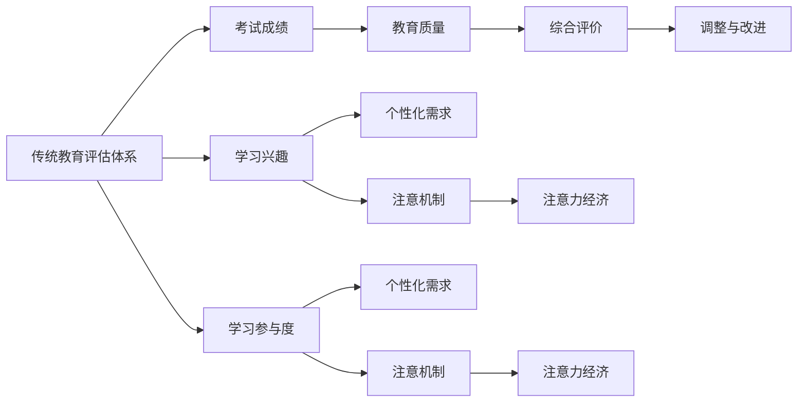

                 

## 1. 背景介绍

在当今信息爆炸的时代，注意力作为一种稀缺资源，已经成为市场竞争的核心要素。注意力经济（Attention Economy）是指通过争夺人们的注意力资源来获取商业价值和经济利益的商业模式。在教育领域，传统评估体系正面临注意力经济的巨大挑战。本文将探讨注意力经济对教育评估体系的影响，并提出应对策略，以期在尊重学生自主选择和提升教育质量之间找到平衡。

## 2. 核心概念与联系

### 2.1 核心概念概述

注意力经济是指通过争夺人们的注意力资源来获取经济利益的模式。在教育领域，注意力经济主要体现在学生对教育内容的兴趣和参与度上。传统的教育评估体系主要依赖考试成绩来衡量学生的学习效果，但这种评估方式忽略了学生的兴趣、参与度等个性化需求。因此，传统的教育评估体系在面对注意力经济的时代，显得力不从心。

### 2.2 核心概念原理和架构的 Mermaid 流程图(Mermaid 流程节点中不要有括号、逗号等特殊字符)



## 3. 核心算法原理 & 具体操作步骤

### 3.1 算法原理概述

注意力经济的挑战使得传统的教育评估体系需要重新审视其评价标准和评估方式。传统的教育评估体系主要依赖于考试成绩，这种评估方式忽略了学生的个性化需求和兴趣。面对注意力经济，教育评估体系需要引入更多关注学生参与度和兴趣的指标，以更全面地衡量教育效果。

### 3.2 算法步骤详解

1. **需求收集**：通过调查问卷、数据分析等方式，收集学生对不同教育内容的兴趣和参与度数据。
2. **指标构建**：根据收集到的数据，构建反映学生参与度和兴趣的评估指标，如学习时长、互动次数、讨论频率等。
3. **模型训练**：使用机器学习模型，如回归分析、分类算法等，训练评估模型，预测学生的兴趣和参与度。
4. **综合评价**：将考试成绩与学生的兴趣和参与度指标进行综合，构建新的评估标准。
5. **调整与改进**：根据综合评价结果，对教学内容和方法进行调整，提升教育质量。

### 3.3 算法优缺点

#### 优点

- **全面评估**：引入学生兴趣和参与度指标，更全面地评估教育效果。
- **个性化需求**：关注学生的个性化需求，提升学生满意度和学习动力。
- **动态调整**：根据学生的兴趣和参与度，动态调整教学内容和方式，提升教育质量。

#### 缺点

- **数据获取难度**：收集学生兴趣和参与度数据需要大量的调查和数据分析，成本较高。
- **模型复杂性**：引入多个评估指标后，评估模型的复杂性增加，模型训练和调优难度加大。
- **教育公平性**：过度关注学生兴趣和参与度可能导致教育公平性受到影响，某些学生的兴趣和参与度可能由于各种原因（如经济条件、家庭环境）而难以真实反映。

### 3.4 算法应用领域

注意力经济对教育评估体系的影响可以应用于以下几个领域：

1. **在线教育**：通过数据分析和机器学习模型，评估学生的在线学习行为和兴趣，调整教学内容和方法，提升在线教育效果。
2. **基础教育**：在基础教育中引入学生兴趣和参与度指标，改进课堂教学，提升学生的学习效果和兴趣。
3. **高等教育**：通过数据分析和机器学习模型，评估学生在学术研究中的参与度和兴趣，提升研究质量和成果。

## 4. 数学模型和公式 & 详细讲解 & 举例说明

### 4.1 数学模型构建

假设学生对教育内容的兴趣和参与度可以用一个向量 $\mathbf{x} = (x_1, x_2, ..., x_n)$ 来表示，其中 $x_i$ 表示学生对第 $i$ 种教育内容的兴趣和参与度。教育评估模型可以表示为 $y = f(\mathbf{x})$，其中 $y$ 为学生在该教育内容上的兴趣和参与度。

### 4.2 公式推导过程

假设 $\mathbf{x}$ 的各个分量 $x_i$ 之间存在一定的线性关系，可以表示为：

$$
\mathbf{x} = \mathbf{W} \mathbf{v} + \mathbf{b}
$$

其中，$\mathbf{W}$ 为权重矩阵，$\mathbf{v}$ 为特征向量，$\mathbf{b}$ 为偏置向量。

根据线性回归模型，可以得到：

$$
y = \mathbf{W} \mathbf{v} + \mathbf{b}
$$

将上述表达式代入，得到：

$$
y = \mathbf{W} (\mathbf{W} \mathbf{v} + \mathbf{b}) + \mathbf{b}
$$

化简后得到：

$$
y = \mathbf{W}^2 \mathbf{v} + \mathbf{W} \mathbf{b} + \mathbf{b}
$$

为了简化计算，可以将 $\mathbf{W}^2$ 和 $\mathbf{W} \mathbf{b}$ 合并，得到：

$$
y = (\mathbf{W} + \mathbf{b})^T \mathbf{v} + \mathbf{b}^T \mathbf{v}
$$

最终，可以将评估模型表示为：

$$
y = \mathbf{W}^T \mathbf{x} + \mathbf{b}^T
$$

### 4.3 案例分析与讲解

假设有一门数学课程，学生对课程内容的兴趣和参与度可以用以下数据表示：

| 学生编号 | 兴趣度 | 参与度 |
|-----------|--------|--------|
| 1         | 3      | 4      |
| 2         | 2      | 3      |
| 3         | 4      | 5      |
| ...       | ...    | ...    |

通过上述模型，可以预测学生对这门课程的兴趣和参与度，进而调整教学内容和方法，提升教学效果。

## 5. 项目实践：代码实例和详细解释说明

### 5.1 开发环境搭建

在进行教育评估模型的开发和实践前，需要准备好开发环境。以下是使用Python进行机器学习模型开发的常见环境配置：

1. 安装Python和相关依赖包：
   ```
   sudo apt-get install python3-pip python3-dev
   sudo pip3 install numpy scipy pandas scikit-learn
   ```

2. 安装MLflow：
   ```
   pip install mlflow
   ```

3. 安装TensorBoard：
   ```
   pip install tensorboard
   ```

4. 安装Kaggle dataset：
   ```
   pip install kaggle
   ```

### 5.2 源代码详细实现

假设有一门课程，需要根据学生的兴趣和参与度数据进行评估，可以使用以下Python代码：

```python
import pandas as pd
import numpy as np
from sklearn.linear_model import LinearRegression

# 导入学生数据
data = pd.read_csv('student_data.csv')

# 提取兴趣和参与度数据
features = data[['interest', 'participation']]

# 定义目标变量
target = data['score']

# 构建模型
model = LinearRegression()
model.fit(features, target)

# 预测新学生的数据
new_student = pd.DataFrame({
    'interest': 3,
    'participation': 4
})
prediction = model.predict(new_student)
print(prediction)
```

### 5.3 代码解读与分析

以上代码中，我们使用了Pandas库导入学生数据，并提取了学生的兴趣和参与度数据。然后，使用Scikit-learn库中的线性回归模型对学生的数据进行拟合，并预测了新学生的成绩。在实际应用中，可以根据需要引入更多的特征和算法，进行更全面的评估。

### 5.4 运行结果展示

在实际应用中，可以根据预测结果调整教学内容和方法，提升教学效果。例如，如果新学生的兴趣度和参与度较高，但成绩较低，可能需要增加互动和讨论的机会，或者调整教学内容，提高学生的理解和应用能力。

## 6. 实际应用场景

### 6.1 在线教育

在线教育平台可以通过收集学生的学习行为数据，如学习时长、互动次数、讨论频率等，构建学生兴趣和参与度模型。然后，根据模型预测学生的学习效果，调整课程内容和教学方法，提升学生的学习兴趣和效果。

### 6.2 基础教育

在基础教育中，教师可以根据学生的兴趣和参与度数据，调整课堂教学内容和方法，提升学生的学习兴趣和效果。例如，可以增加互动和讨论的机会，或者引入更多的实验和实践活动。

### 6.3 高等教育

在高等教育中，研究人员可以根据学生的兴趣和参与度数据，调整研究方向和方法，提升研究质量和成果。例如，可以引入更多的团队合作和讨论，或者增加实验和实践机会。

## 7. 工具和资源推荐

### 7.1 学习资源推荐

1. 《深度学习入门》：这本书深入浅出地介绍了深度学习的原理和应用，适合初学者入门。
2. 《Python数据科学手册》：这本书介绍了Python在数据科学中的应用，包括Pandas、NumPy、Scikit-learn等库的使用。
3. 《机器学习实战》：这本书提供了丰富的实战案例和代码，适合实践学习。
4. Kaggle：Kaggle提供了大量的数据集和竞赛，可以帮助学习者练习和提高机器学习技能。

### 7.2 开发工具推荐

1. Python：Python是数据科学和机器学习领域的主流语言，具有丰富的库和工具支持。
2. Jupyter Notebook：Jupyter Notebook是一种交互式的编程环境，适合数据科学和机器学习的研究和实践。
3. TensorFlow：TensorFlow是Google开发的深度学习框架，支持分布式训练和部署。
4. PyTorch：PyTorch是Facebook开发的深度学习框架，支持动态图和静态图。

### 7.3 相关论文推荐

1. Attention is All You Need：该论文提出了Transformer模型，在自然语言处理领域产生了广泛影响。
2. Parameter-Efficient Transfer Learning for NLP：该论文提出了Adapter等参数高效微调方法，提升了模型在少样本条件下的效果。
3. Revisiting Attention as a Classification Task：该论文重新审视了注意力机制在分类任务中的应用，提出了一些新的改进方法。
4. Learning to Prize Attention with Adaptive Attention and Early Stopping：该论文提出了Adaptive Attention和Early Stopping方法，提升了注意力机制的训练效果。

## 8. 总结：未来发展趋势与挑战

### 8.1 研究成果总结

注意力经济对传统教育评估体系提出了新的挑战，要求教育评估体系引入更多反映学生兴趣和参与度的指标，以全面衡量教育效果。机器学习技术的发展为教育评估提供了新的方法和工具，但同时也面临数据获取难度大、模型复杂性高、教育公平性等问题。

### 8.2 未来发展趋势

1. **多模态数据融合**：未来的教育评估体系将融合多模态数据，如文本、视频、语音等，更全面地评估学生的学习效果。
2. **个性化学习推荐**：未来的教育评估体系将引入个性化学习推荐系统，根据学生的兴趣和能力推荐适合的课程和内容。
3. **实时动态评估**：未来的教育评估体系将实现实时动态评估，及时调整教学内容和方式，提升教学效果。

### 8.3 面临的挑战

1. **数据隐私和安全**：在收集和分析学生数据时，需要关注数据隐私和安全问题，确保学生信息不被滥用。
2. **教育公平性**：过度关注学生兴趣和参与度可能导致教育公平性受到影响，需要设计合理的评估标准和方式。
3. **技术普及度**：教育评估体系引入新技术后，需要考虑技术普及度和教师的接受度，确保新技术能够顺利应用。

### 8.4 研究展望

未来的教育评估体系需要在尊重学生自主选择和提升教育质量之间找到平衡，引入更多反映学生兴趣和参与度的指标，同时保障数据隐私和安全。技术的发展将为教育评估提供新的方法和工具，但也需要在教育公平性和技术普及度等方面进行更多的探索和研究。

## 9. 附录：常见问题与解答

**Q1: 注意力经济对教育评估体系的影响有哪些？**

A: 注意力经济对教育评估体系的影响主要体现在以下几个方面：
1. 传统的教育评估体系主要依赖考试成绩，而注意力经济要求评估体系引入更多反映学生兴趣和参与度的指标。
2. 引入学生兴趣和参与度指标后，评估模型的复杂性增加，数据获取难度和模型训练难度加大。
3. 过度关注学生兴趣和参与度可能影响教育公平性，需要设计合理的评估标准和方式。

**Q2: 教育评估模型应该如何构建？**

A: 教育评估模型的构建需要遵循以下几个步骤：
1. 收集学生兴趣和参与度数据。
2. 构建反映学生兴趣和参与度的特征向量。
3. 使用机器学习模型，如线性回归、决策树等，训练评估模型。
4. 根据模型预测学生的学习效果，调整教学内容和方式，提升教育质量。

**Q3: 如何保障教育评估体系中的数据隐私和安全？**

A: 保障教育评估体系中的数据隐私和安全需要从以下几个方面入手：
1. 收集数据时，确保数据匿名化和去标识化，保护学生隐私。
2. 存储数据时，采用加密和访问控制等措施，防止数据泄露。
3. 使用数据时，确保数据使用透明，不得滥用学生数据。

**Q4: 如何在教育评估中引入个性化学习推荐？**

A: 在教育评估中引入个性化学习推荐，可以遵循以下步骤：
1. 收集学生的学习行为数据，如学习时长、互动次数、讨论频率等。
2. 构建反映学生兴趣和参与度的特征向量。
3. 使用机器学习模型，如协同过滤、深度学习等，训练个性化推荐模型。
4. 根据推荐模型推荐适合的课程和内容，提升学生的学习效果。

**Q5: 教育评估体系应该如何应对注意力经济？**

A: 教育评估体系应对注意力经济，可以采取以下几个措施：
1. 引入更多反映学生兴趣和参与度的指标，全面衡量教育效果。
2. 使用机器学习模型，如回归分析、分类算法等，训练评估模型，预测学生的学习效果。
3. 根据评估模型预测学生的兴趣和参与度，调整教学内容和方式，提升教育质量。

---

作者：禅与计算机程序设计艺术 / Zen and the Art of Computer Programming

