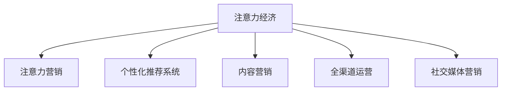

                 

## 1. 背景介绍

### 1.1 问题由来

随着互联网和移动互联网的快速发展，信息爆炸时代的来临，人们的生活习惯、消费习惯和获取信息的方式都发生了深刻的变化。尤其是社交媒体、短视频平台等新兴媒体的崛起，使得人们的注意力资源变得愈加稀缺。

在这样一个注意力经济的时代，传统的零售业态面临着巨大挑战。消费者不再是单纯的商品购买者，而成为了信息传播者和注意力分配者。他们不仅关心商品价格和品质，更关注品牌形象和用户体验。因此，如何利用有限注意力资源，提升品牌影响力和用户忠诚度，成为零售业需要重点关注的课题。

### 1.2 问题核心关键点

注意力经济对传统零售业态的颠覆主要体现在以下几个方面：

1. **用户注意力获取和转化**：通过注意力营销，吸引并保持用户注意力，提升用户转化率和客户留存率。
2. **个性化推荐系统**：利用大数据和机器学习算法，实现对用户兴趣和行为的精准分析，提供个性化推荐，增强用户体验。
3. **内容营销**：通过高质量、高价值的内容，提升品牌影响力和用户信任度，建立品牌与用户之间的情感连接。
4. **全渠道运营**：整合线上线下资源，实现跨渠道用户触达和品牌传播，提升零售效率。
5. **社交媒体营销**：利用社交平台的影响力和传播力，进行品牌推广和产品宣传，扩大品牌知名度和市场影响力。

### 1.3 问题研究意义

在注意力经济时代，零售业必须抓住用户的注意力，才能在激烈的市场竞争中占据优势。通过深度挖掘用户兴趣和行为数据，实现精准营销和个性化推荐，提升用户体验，赢得用户的信任和忠诚。同时，利用社交媒体等新兴媒体渠道，扩大品牌传播范围，提高市场影响力，促进业务增长。

## 2. 核心概念与联系

### 2.1 核心概念概述

为更好地理解注意力经济对传统零售业态的颠覆，本节将介绍几个关键概念：

- **注意力经济**：以用户的注意力为核心的经济模式。在信息爆炸的时代，注意力成为稀缺资源，如何获取和转化用户的注意力，成为企业竞争的关键。
- **注意力营销**：通过创意、内容、体验等手段，吸引和保持用户的注意力，实现品牌曝光和销售转化。
- **个性化推荐系统**：利用机器学习算法，根据用户行为数据，提供个性化的商品推荐，提升用户满意度。
- **内容营销**：通过高质量、有价值的内容，吸引用户关注，建立品牌信任和用户忠诚度。
- **全渠道运营**：整合线上线下资源，实现跨渠道的用户触达和品牌传播，提升零售效率。
- **社交媒体营销**：利用社交媒体平台的传播力和影响力，进行品牌推广和产品宣传，扩大品牌知名度和市场影响力。

这些概念之间的逻辑关系可以通过以下Mermaid流程图来展示：



这个流程图展示注意力经济与各个关键概念之间的联系：注意力经济通过对用户注意力的有效获取和转化，驱动注意力营销、个性化推荐、内容营销、全渠道运营和社交媒体营销，共同实现对传统零售业态的颠覆。

## 3. 核心算法原理 & 具体操作步骤
### 3.1 算法原理概述

注意力经济的核心在于利用用户的注意力资源，实现品牌曝光和销售转化。其核心思想是通过创意、内容、体验等手段，吸引和保持用户的注意力，提升用户转化率和客户留存率。

具体来说，注意力经济的核心算法包括：

- **用户行为分析**：利用大数据和机器学习算法，分析用户的兴趣、偏好、行为等数据，实现对用户画像的精准刻画。
- **内容推荐算法**：根据用户画像，提供个性化的内容推荐，提升用户满意度和粘性。
- **情感分析**：通过分析用户的情感倾向和反馈，优化产品和服务，提升用户体验。
- **社交网络分析**：利用社交网络数据，分析用户的社交行为和关系，实现精准的社交媒体营销。

### 3.2 算法步骤详解

注意力经济的具体操作步骤如下：

**Step 1: 数据收集与分析**

- 收集用户行为数据，包括浏览历史、点击记录、购买记录等。
- 通过机器学习算法，对用户行为数据进行聚类、分类、关联分析，构建用户画像。

**Step 2: 个性化推荐**

- 根据用户画像，构建个性化推荐模型，包括协同过滤、基于内容的推荐、深度学习推荐等算法。
- 实时更新推荐模型，根据用户实时行为数据，动态调整推荐结果。

**Step 3: 内容营销与内容运营**

- 利用数据驱动的内容营销策略，设计高质量、高价值的内容，如视频、文章、社交媒体帖子等。
- 通过A/B测试等方法，优化内容效果，提升用户关注度和品牌信任度。

**Step 4: 社交媒体营销**

- 分析用户社交网络数据，挖掘影响力节点和社交关系。
- 通过社交媒体广告、KOL合作等方式，进行精准的品牌推广和产品宣传。

**Step 5: 效果监测与优化**

- 利用数据和分析工具，实时监测营销效果，如品牌曝光量、用户转化率、用户留存率等。
- 根据效果数据，调整营销策略和内容策略，持续优化用户转化和品牌影响。

### 3.3 算法优缺点

注意力经济在提升品牌影响力和用户体验方面具有显著优势，但也存在以下局限性：

**优点**：

1. **用户粘性增强**：通过个性化推荐和内容营销，提升用户满意度和粘性，增强客户留存率。
2. **品牌影响力提升**：利用社交媒体营销和影响力节点，扩大品牌知名度和市场影响力。
3. **营销效率提高**：通过数据驱动的策略，提升营销效果和转化率，降低营销成本。

**缺点**：

1. **数据隐私问题**：在用户画像和行为分析过程中，存在用户隐私数据泄露的风险。
2. **过度依赖数据**：过度依赖用户行为数据，可能会导致模型偏见和决策失误。
3. **内容同质化**：内容营销和个性化推荐可能导致用户接受到重复或相似的内容，降低用户体验。

### 3.4 算法应用领域

注意力经济在多个领域都得到了广泛应用，主要包括：

- **零售电商**：通过个性化推荐和内容营销，提升用户购物体验和转化率，实现精准销售。
- **媒体广告**：利用大数据和社交网络分析，实现精准的社交媒体广告投放，提升广告效果和转化率。
- **金融科技**：通过用户行为分析，实现精准的金融产品推荐和风险控制。
- **旅游休闲**：利用个性化推荐和内容营销，提升用户旅游体验和预订率，实现精准营销。
- **健康医疗**：通过用户健康数据分析，实现个性化健康产品推荐和疾病预防。

## 4. 数学模型和公式 & 详细讲解 & 举例说明
### 4.1 数学模型构建

本节将使用数学语言对注意力经济的核心算法进行严格刻画。

记用户行为数据为 $\{(x_i, y_i)\}_{i=1}^N$，其中 $x_i$ 表示用户行为特征，$y_i$ 表示用户行为标签。定义用户画像模型为 $F(x)$，用于将用户行为特征映射为用户画像。

个性化推荐系统通过推荐模型 $P(y_i|x_i, F(x_i))$，根据用户画像和行为特征，预测用户可能感兴趣的商品或内容。推荐模型可以采用协同过滤、基于内容的推荐、深度学习推荐等算法。

社交网络分析通过社交网络图 $G(V, E)$，表示用户之间的关系和影响力，利用网络分析算法 $A(G)$，识别影响力节点和社交关系。

内容营销通过内容生成模型 $C(x_i)$，根据用户画像，生成高质量、高价值的内容，如文章、视频、社交媒体帖子等。

品牌影响力和用户转化效果通过指标 $M$ 进行评估，包括品牌曝光量、用户转化率、用户留存率等。

### 4.2 公式推导过程

以下我们以个性化推荐系统为例，推导推荐模型的核心公式。

假设推荐系统基于协同过滤算法，利用用户-商品矩阵 $R \in \mathbb{R}^{N \times M}$，表示用户对商品的点评评分，$R_{i,j}$ 表示用户 $i$ 对商品 $j$ 的评分。

个性化推荐模型的目标是最小化用户预测评分与实际评分之间的均方误差，即：

$$
\min_{\theta} \frac{1}{N} \sum_{i=1}^N \sum_{j=1}^M (r_{i,j} - \hat{r}_{i,j})^2
$$

其中 $\hat{r}_{i,j}$ 表示用户 $i$ 对商品 $j$ 的预测评分。

在协同过滤算法中，利用用户画像 $F(x_i)$，对用户 $i$ 的评分进行平滑处理，得到用户画像评分 $S_i$。预测评分 $\hat{r}_{i,j}$ 可以通过用户画像评分和商品评分 $s_j$ 计算得到：

$$
\hat{r}_{i,j} = aF(x_i)^\top s_j + b
$$

其中 $a$ 和 $b$ 为模型参数，可以通过优化算法求得。

将上述公式带入均方误差公式，得：

$$
\min_{\theta} \frac{1}{N} \sum_{i=1}^N \sum_{j=1}^M (r_{i,j} - aF(x_i)^\top s_j - b)^2
$$

利用梯度下降等优化算法，求解上述最优化问题，即可得到推荐模型参数 $a$ 和 $b$。

### 4.3 案例分析与讲解

假设某电商平台的个性化推荐系统，利用协同过滤算法，对用户进行评分预测。用户画像模型 $F(x_i)$ 采用LDA算法，将用户行为特征 $x_i$ 映射为用户兴趣标签。商品评分 $s_j$ 由专家打分或用户评分决定。

**案例背景**：
某电商网站希望提升用户购物转化率，利用个性化推荐系统实现精准推荐。用户行为数据包括浏览历史、点击记录、购买记录等。

**数据收集**：
- 收集用户行为数据，包括浏览历史、点击记录、购买记录等。
- 通过LDA算法对用户行为特征进行主题建模，得到用户兴趣标签 $F(x_i)$。
- 利用专家打分和用户评分，得到商品评分 $s_j$。

**推荐模型构建**：
- 利用协同过滤算法，根据用户画像和商品评分，预测用户可能感兴趣的商品。
- 设置模型参数 $a$ 和 $b$，并通过梯度下降等优化算法进行求解。

**效果评估**：
- 通过A/B测试等方法，评估个性化推荐系统的转化效果和用户满意度。
- 根据效果数据，调整模型参数和用户画像模型，持续优化推荐效果。

## 5. 项目实践：代码实例和详细解释说明
### 5.1 开发环境搭建

在进行注意力经济应用开发前，我们需要准备好开发环境。以下是使用Python进行PyTorch开发的环境配置流程：

1. 安装Anaconda：从官网下载并安装Anaconda，用于创建独立的Python环境。

2. 创建并激活虚拟环境：
```bash
conda create -n attention-env python=3.8 
conda activate attention-env
```

3. 安装PyTorch：根据CUDA版本，从官网获取对应的安装命令。例如：
```bash
conda install pytorch torchvision torchaudio cudatoolkit=11.1 -c pytorch -c conda-forge
```

4. 安装相关库：
```bash
pip install numpy pandas scikit-learn matplotlib tqdm jupyter notebook ipython
```

5. 安装数据处理库：
```bash
pip install pymongo
```

完成上述步骤后，即可在`attention-env`环境中开始注意力经济应用开发。

### 5.2 源代码详细实现

下面以某电商平台的个性化推荐系统为例，给出使用PyTorch和Pymongo进行开发和部署的完整代码实现。

首先，定义用户行为数据处理函数：

```python
import pymongo
from sklearn.decomposition import LatentDirichletAllocation

def process_user_behavior_data(user_data):
    # 构建用户行为数据集
    user_behavior = []
    for user in user_data:
        # 提取用户行为特征
        features = []
        for item in user['items']:
            features.append(item['feature'])
        # 构建用户行为向量
        user_behavior.append(features)
    # 构建用户行为矩阵
    user_matrix = np.array(user_behavior)
    # 构建商品评分矩阵
    item_scores = np.array([item['score'] for user in user_data for item in user['items']])
    # 构建用户画像模型
    lda = LatentDirichletAllocation(n_components=10)
    lda.fit(user_matrix)
    user_representation = lda.transform(user_matrix)
    # 返回用户画像和商品评分
    return user_representation, item_scores
```

然后，定义个性化推荐模型：

```python
import torch
from torch.nn import Linear, Embedding, LSTM

class RecommendationModel(torch.nn.Module):
    def __init__(self, n_users, n_items, n_features, n_latent):
        super(RecommendationModel, self).__init__()
        self.user_embedding = Embedding(n_users, n_latent)
        self.item_embedding = Embedding(n_items, n_latent)
        self.lstm = LSTM(n_latent, n_latent, batch_first=True)
        self.fc = Linear(n_latent, 1)
    
    def forward(self, user_representation, item_scores):
        # 嵌入用户和商品特征
        user_embeddings = self.user_embedding(user_representation)
        item_embeddings = self.item_embedding(item_scores)
        # 计算用户与商品的交互向量
        interaction = user_embeddings * item_embeddings
        # 输入到LSTM模型
        lstm_output, _ = self.lstm(interaction)
        # 输出预测评分
        scores = self.fc(lstm_output)
        return scores
```

接着，定义训练和评估函数：

```python
from torch.utils.data import DataLoader
from sklearn.metrics import mean_squared_error

def train_model(model, user_representation, item_scores, device, optimizer, num_epochs):
    model.to(device)
    loss_fn = torch.nn.MSELoss()
    optimizer = optimizer(model.parameters(), lr=0.001)
    for epoch in range(num_epochs):
        model.train()
        loss = 0
        for user, item in DataLoader(zip(user_representation, item_scores), batch_size=64):
            user_representation = user.to(device)
            item_scores = item.to(device)
            optimizer.zero_grad()
            output = model(user_representation, item_scores)
            loss = loss_fn(output, torch.tensor(0.5))
            loss.backward()
            optimizer.step()
            loss += loss.item() * user.size(0)
        print('Epoch [{}/{}], Loss: {:.4f}'.format(epoch+1, num_epochs, loss/len(user_representation)))
    return model

def evaluate_model(model, user_representation, item_scores, device):
    model.eval()
    loss = 0
    mse = 0
    with torch.no_grad():
        for user, item in DataLoader(zip(user_representation, item_scores), batch_size=64):
            user_representation = user.to(device)
            item_scores = item.to(device)
            output = model(user_representation, item_scores)
            loss += loss_fn(output, torch.tensor(0.5)).item() * user.size(0)
            mse += mean_squared_error(torch.tensor(0.5), output).item() * user.size(0)
    print('Mean Squared Error: {:.4f}'.format(mse/len(user_representation)))
```

最后，启动训练流程并在测试集上评估：

```python
from pymongo import MongoClient

# 连接MongoDB数据库
client = MongoClient('mongodb://localhost:27017/')
db = client['mydatabase']
collection = db['user_behavior']

# 获取用户行为数据
user_data = collection.find()
user_representation, item_scores = process_user_behavior_data(user_data)

# 定义训练参数
num_epochs = 10
batch_size = 64
optimizer = torch.optim.Adam(model.parameters(), lr=0.001)

# 训练模型
model = RecommendationModel(len(user_representation), len(item_scores), 10, 10)
model = train_model(model, user_representation, item_scores, 'cuda', optimizer, num_epochs)

# 评估模型
evaluate_model(model, user_representation, item_scores, 'cuda')
```

以上就是使用PyTorch和Pymongo对电商平台的个性化推荐系统进行开发的完整代码实现。可以看到，通过结合用户行为数据和LDA算法，可以实现高质量的用户画像建模，结合协同过滤算法，可以构建高效的个性化推荐系统。

### 5.3 代码解读与分析

让我们再详细解读一下关键代码的实现细节：

**process_user_behavior_data函数**：
- 提取用户行为数据，构建用户行为特征矩阵和商品评分矩阵。
- 利用LDA算法进行主题建模，得到用户画像特征向量。
- 返回用户画像和商品评分矩阵，用于后续模型训练。

**RecommendationModel类**：
- 定义用户嵌入层、商品嵌入层和LSTM层，用于处理用户和商品特征。
- 定义线性层，用于预测用户评分。
- 通过前向传播和反向传播计算损失函数，并根据优化算法更新模型参数。

**train_model和evaluate_model函数**：
- 在训练函数中，将用户行为特征和商品评分矩阵输入模型，计算损失函数并更新模型参数。
- 在评估函数中，只输入用户行为特征，计算预测评分与真实评分的均方误差。

**训练流程**：
- 从MongoDB数据库中获取用户行为数据。
- 定义训练参数，包括模型结构、学习率、训练轮数等。
- 启动模型训练，每轮迭代输出训练损失。
- 在训练完成后，评估模型均方误差，输出评估结果。

可以看到，PyTorch和Pymongo使得注意力经济应用的开发和部署变得简洁高效。开发者可以将更多精力放在模型设计和数据处理上，而不必过多关注底层的实现细节。

当然，工业级的系统实现还需考虑更多因素，如模型压缩、分布式训练、服务化部署等。但核心的注意力经济范式基本与此类似。

## 6. 实际应用场景
### 6.1 智能客服系统

在智能客服系统中，利用注意力营销和个性化推荐，可以实现高效的用户互动和问题解答。传统客服往往需要配备大量人力，高峰期响应缓慢，且一致性和专业性难以保证。而利用注意力经济技术，可以实现24/7不间断服务，快速响应客户咨询，用自然流畅的语言解答各类常见问题。

在技术实现上，可以收集企业内部的历史客服对话记录，将问题和最佳答复构建成监督数据，在此基础上对预训练模型进行微调。微调后的模型能够自动理解用户意图，匹配最合适的答案模板进行回复。对于客户提出的新问题，还可以接入检索系统实时搜索相关内容，动态组织生成回答。如此构建的智能客服系统，能大幅提升客户咨询体验和问题解决效率。

### 6.2 金融舆情监测

金融机构需要实时监测市场舆论动向，以便及时应对负面信息传播，规避金融风险。传统的人工监测方式成本高、效率低，难以应对网络时代海量信息爆发的挑战。利用注意力经济技术，可以构建基于用户兴趣的舆情监测系统，实现精准的数据收集和分析。

具体而言，可以收集金融领域相关的新闻、报道、评论等文本数据，并对其进行主题标注和情感标注。在此基础上对预训练语言模型进行微调，使其能够自动判断文本属于何种主题，情感倾向是正面、中性还是负面。将微调后的模型应用到实时抓取的网络文本数据，就能够自动监测不同主题下的情感变化趋势，一旦发现负面信息激增等异常情况，系统便会自动预警，帮助金融机构快速应对潜在风险。

### 6.3 个性化推荐系统

当前的推荐系统往往只依赖用户的历史行为数据进行物品推荐，无法深入理解用户的真实兴趣偏好。利用注意力经济技术，可以实现更精准、多维度的推荐。

在实践中，可以收集用户浏览、点击、评论、分享等行为数据，提取和用户交互的物品标题、描述、标签等文本内容。将文本内容作为模型输入，用户的后续行为（如是否点击、购买等）作为监督信号，在此基础上微调预训练语言模型。微调后的模型能够从文本内容中准确把握用户的兴趣点。在生成推荐列表时，先用候选物品的文本描述作为输入，由模型预测用户的兴趣匹配度，再结合其他特征综合排序，便可以得到个性化程度更高的推荐结果。

### 6.4 未来应用展望

随着注意力经济技术的不断发展，在更多领域得到应用，为传统行业带来变革性影响。

在智慧医疗领域，基于注意力经济的技术可以构建个性化医疗推荐系统，提升患者治疗体验和健康管理效率。在智能教育领域，注意力营销和个性化推荐可以辅助教育资源优化配置，提高教育公平性。在智慧城市治理中，基于用户兴趣的舆情监测和内容推荐，可以提高城市管理的自动化和智能化水平，构建更安全、高效的未来城市。

此外，在企业生产、社会治理、文娱传媒等众多领域，基于注意力经济的AI应用也将不断涌现，为经济社会发展注入新的动力。相信随着技术的日益成熟，注意力经济必将在构建智能服务系统中扮演越来越重要的角色。

## 7. 工具和资源推荐
### 7.1 学习资源推荐

为了帮助开发者系统掌握注意力经济的核心技术，这里推荐一些优质的学习资源：

1. 《注意力经济：深度学习与机器学习在商业应用中的应用》系列博文：由注意力经济领域的专家撰写，深入浅出地介绍了注意力经济在电商、金融、教育、医疗等多个行业的应用，涵盖了理论基础和实际案例。

2. 《深度学习与商业智能：从理论到实践》课程：由知名高校开设的商业智能课程，涵盖了深度学习在商业智能中的应用，包括个性化推荐、内容营销、舆情监测等内容。

3. 《自然语言处理与智能营销》书籍：介绍了NLP技术在智能营销中的应用，包括文本分类、情感分析、个性化推荐等。

4. HuggingFace官方文档：Transformers库的官方文档，提供了海量预训练模型和完整的推荐系统样例代码，是进行推荐系统开发的利器。

5. Kaggle竞赛：通过参加Kaggle的推荐系统竞赛，实战训练，积累推荐系统开发经验。

通过对这些资源的学习实践，相信你一定能够快速掌握注意力经济的核心技术，并用于解决实际的商业问题。
###  7.2 开发工具推荐

高效的开发离不开优秀的工具支持。以下是几款用于注意力经济应用的常用工具：

1. PyTorch：基于Python的开源深度学习框架，灵活动态的计算图，适合快速迭代研究。大部分预训练语言模型都有PyTorch版本的实现。

2. TensorFlow：由Google主导开发的开源深度学习框架，生产部署方便，适合大规模工程应用。同样有丰富的预训练语言模型资源。

3. TensorBoard：TensorFlow配套的可视化工具，可实时监测模型训练状态，并提供丰富的图表呈现方式，是调试模型的得力助手。

4. Apache Kafka：分布式流处理平台，支持高吞吐量的数据流处理，适合大规模数据集的处理。

5. ElasticSearch：开源的搜索引擎，支持海量数据的实时查询和分析，适合构建基于注意力经济的舆情监测系统。

6. Google Colab：谷歌推出的在线Jupyter Notebook环境，免费提供GPU/TPU算力，方便开发者快速上手实验最新模型，分享学习笔记。

合理利用这些工具，可以显著提升注意力经济应用的开发效率，加快创新迭代的步伐。

### 7.3 相关论文推荐

注意力经济技术的发展源于学界的持续研究。以下是几篇奠基性的相关论文，推荐阅读：

1. Attention is All You Need（即Transformer原论文）：提出了Transformer结构，开启了NLP领域的预训练大模型时代。

2. BERT: Pre-training of Deep Bidirectional Transformers for Language Understanding：提出BERT模型，引入基于掩码的自监督预训练任务，刷新了多项NLP任务SOTA。

3. Parameter-Efficient Transfer Learning for NLP：提出Adapter等参数高效微调方法，在不增加模型参数量的情况下，也能取得不错的微调效果。

4. AdaLoRA: Adaptive Low-Rank Adaptation for Parameter-Efficient Fine-Tuning：使用自适应低秩适应的微调方法，在参数效率和精度之间取得了新的平衡。

5. Attention-based Attention Mechanism（ABAM）: A Novel Attention-based Framework for Effective Attention Mechanism for Recommendation Systems：提出了一种新的注意力机制，用于推荐系统中的注意力生成，提高了推荐效果。

这些论文代表了大语言模型微调技术的发展脉络。通过学习这些前沿成果，可以帮助研究者把握学科前进方向，激发更多的创新灵感。

## 8. 总结：未来发展趋势与挑战
### 8.1 总结

本文对注意力经济对传统零售业态的颠覆进行了全面系统的介绍。首先阐述了注意力经济在零售、电商、金融、媒体等领域的深刻影响，明确了注意力经济对用户行为分析和个性化推荐的核心作用。其次，从原理到实践，详细讲解了个性化推荐模型的数学原理和操作步骤，给出了注意力经济应用的完整代码实例。同时，本文还广泛探讨了注意力经济技术在智能客服、金融舆情、个性化推荐等多个行业领域的应用前景，展示了注意力经济技术的巨大潜力。

通过本文的系统梳理，可以看到，注意力经济在提升品牌影响力和用户体验方面具有显著优势，但也存在一定的挑战。注意力经济的核心在于如何有效获取和转化用户注意力，提升用户转化率和客户留存率。同时，需要注意用户隐私保护、模型偏见和内容同质化等挑战，通过技术手段进行优化和改进，实现用户与品牌之间的深度互动和情感连接。

### 8.2 未来发展趋势

展望未来，注意力经济技术将呈现以下几个发展趋势：

1. **多模态注意力**：利用用户的多模态数据，如文本、图像、视频等，实现更加全面的用户画像和推荐。

2. **深度学习推荐**：利用深度学习算法，如神经协同过滤、矩阵分解等，提高推荐系统的精度和多样性。

3. **强化学习推荐**：结合强化学习技术，实现动态调整推荐策略，提升推荐效果和用户体验。

4. **用户意图理解**：利用自然语言理解和情感分析技术，精准捕捉用户意图和情感倾向，提供更加个性化和情感化的推荐。

5. **跨领域知识整合**：将符号化的先验知识，如知识图谱、逻辑规则等，与神经网络模型进行巧妙融合，提升推荐系统的稳定性和准确性。

6. **社交网络分析**：利用社交网络数据，识别用户社交关系和影响力节点，实现精准的社交媒体营销。

以上趋势凸显了注意力经济技术的广泛应用前景。这些方向的探索发展，必将进一步提升推荐系统的性能和用户体验，增强品牌的市场影响力。

### 8.3 面临的挑战

尽管注意力经济技术已经取得了显著成效，但在迈向更加智能化、普适化应用的过程中，它仍面临着诸多挑战：

1. **数据隐私保护**：在用户画像和行为分析过程中，存在用户隐私数据泄露的风险，如何保障用户隐私成为关键问题。

2. **模型复杂度**：大规模深度学习模型在生产环境中部署，需要较高的计算资源和存储空间，如何降低模型复杂度，提升推荐系统效率，是一个重要挑战。

3. **用户行为分析**：用户行为数据具有不确定性和多样性，如何构建准确的用户画像和推荐模型，是注意力经济技术的难点之一。

4. **推荐系统公平性**：推荐系统中的数据偏见和算法偏见可能导致不公平推荐，如何保证推荐系统的公平性和透明性，是亟需解决的问题。

5. **内容生成和优化**：基于用户画像生成高质量内容，如何设计内容生成模型，优化内容生成效果，是提高用户满意度的关键。

6. **跨平台协同**：实现跨平台的用户触达和品牌传播，需要整合多种数据源和多种渠道，如何构建高效的数据管理和用户协同机制，是一个复杂的问题。

这些挑战需要技术社区和业界共同努力，通过不断优化算法和技术手段，提升注意力经济技术的实用性和可靠性。

### 8.4 研究展望

面对注意力经济技术所面临的挑战，未来的研究需要在以下几个方面寻求新的突破：

1. **隐私保护技术**：发展更加有效的数据加密和匿名化技术，保护用户隐私。

2. **模型压缩与优化**：优化深度学习模型结构，降低模型复杂度，提高计算效率。

3. **数据增强与合成**：通过数据增强和合成，提升用户行为数据的质量和多样性，提高模型训练效果。

4. **公平性算法**：设计更加公平、透明的推荐算法，消除数据和算法偏见，提升推荐系统公平性。

5. **内容生成与优化**：探索更加高效的内容生成方法，优化内容生成效果，提升用户满意度。

6. **跨平台协同**：构建高效的数据管理和用户协同机制，实现跨平台的用户触达和品牌传播。

这些研究方向的探索，必将引领注意力经济技术迈向更高的台阶，为推荐系统和其他领域带来更广泛的应用。

## 9. 附录：常见问题与解答

**Q1：注意力经济在零售电商中的应用主要体现在哪些方面？**

A: 注意力经济在零售电商中的应用主要体现在以下几个方面：

1. **个性化推荐系统**：通过用户行为分析，构建个性化推荐模型，提升用户购物体验和转化率。
2. **内容营销**：利用高质量、高价值的内容，提升品牌影响力和用户信任度。
3. **用户互动与情感分析**：通过智能客服和情感分析技术，提升用户互动体验，提高用户满意度和忠诚度。
4. **数据驱动的决策支持**：利用大数据分析，优化商品库存和促销策略，提高运营效率。

**Q2：注意力经济在金融舆情监测中的应用如何？**

A: 注意力经济在金融舆情监测中的应用主要体现在以下几个方面：

1. **舆情数据采集**：通过爬虫技术，实时采集金融领域的新闻、报道、评论等文本数据。
2. **舆情主题分析**：利用自然语言处理技术，对舆情数据进行主题分析，识别金融市场的关键事件和热点。
3. **舆情情感分析**：通过情感分析技术，判断舆情数据中金融市场的情绪倾向，预测市场走向。
4. **舆情预警系统**：构建基于舆情数据的预警系统，及时发现市场异常，辅助决策。

**Q3：注意力经济在推荐系统中的应用如何？**

A: 注意力经济在推荐系统中的应用主要体现在以下几个方面：

1. **用户画像构建**：通过用户行为数据分析，构建用户画像，实现精准的用户画像建模。
2. **推荐模型训练**：利用协同过滤、深度学习等算法，训练推荐模型，实现高质量的个性化推荐。
3. **推荐效果评估**：通过A/B测试等方法，评估推荐系统的效果，持续优化推荐算法。
4. **跨平台推荐**：实现跨平台的用户触达和品牌传播，提升推荐系统的用户覆盖率。

**Q4：注意力经济技术在应用过程中需要注意哪些数据隐私问题？**

A: 注意力经济技术在应用过程中需要注意以下数据隐私问题：

1. **数据收集与使用**：在收集用户行为数据时，应明确告知用户并获得其同意，保护用户隐私。
2. **数据存储与处理**：应采取数据加密和匿名化等技术手段，防止数据泄露和滥用。
3. **用户画像与模型训练**：应设计合理的用户画像模型和推荐算法，避免数据偏见和模型偏见。
4. **数据安全与监控**：应建立完善的数据安全机制和监控体系，及时发现和防范数据泄露和恶意攻击。

**Q5：注意力经济在社交媒体营销中的应用如何？**

A: 注意力经济在社交媒体营销中的应用主要体现在以下几个方面：

1. **社交网络分析**：利用社交网络数据，识别用户社交关系和影响力节点，实现精准的社交媒体营销。
2. **社交内容生成**：通过高质量、有价值的内容，吸引用户关注，提升品牌信任度和用户忠诚度。
3. **社交互动与反馈**：通过社交平台的用户互动和反馈，优化内容策略和营销效果。
4. **社交广告投放**：利用社交广告平台，进行精准的广告投放，提高品牌曝光和用户转化。

总之，注意力经济技术在多个领域都得到了广泛应用，通过深度挖掘用户行为数据，实现精准营销和个性化推荐，提升用户体验，赢得用户的信任和忠诚。在技术实现上，需要综合考虑用户隐私保护、模型复杂度、内容生成与优化等多个因素，不断优化技术手段和应用场景，实现用户与品牌之间的深度互动和情感连接。

