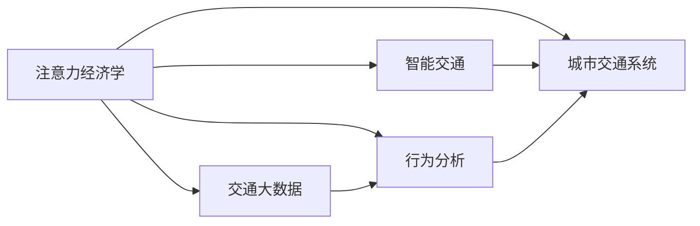

                 

# 注意力经济对城市交通的影响

> 关键词：注意力经济, 城市交通, 智能交通, 交通大数据, 行为分析, 政策优化

## 1. 背景介绍

在数字化时代，注意力经济成为驱动城市交通发展的关键力量。注意力经济学（Attention Economy）源自信息经济学，研究在有限注意力资源约束下，个体如何选择和处理信息的行为规律。在城市交通领域，注意力经济的核心在于如何分配和利用有限的出行资源，提高交通系统的效率和公平性。

### 1.1 注意力经济与城市交通的关系

城市交通系统是一个复杂的动态系统，其运行效率受到多种因素的影响，包括人口流动、交通设施、政策规划等。注意力经济通过模拟个体出行决策行为，分析其在不同情境下的选择偏好，从而优化交通资源的分配和使用。具体而言，注意力经济可以帮助：

- **需求侧**：分析用户出行偏好和需求变化，提供个性化出行建议。
- **供给侧**：优化交通资源配置，提高设施利用率，减少拥堵。
- **政策侧**：制定科学的交通管理策略，引导出行行为。

### 1.2 注意力经济在城市交通中的应用案例

1. **智能导航**：如Google Maps、高德等，通过大数据和人工智能技术，为用户提供个性化出行路径建议，优化路线选择，减少拥堵。

2. **交通需求管理**：通过需求响应机制，如动态调价、预约出行等，调节高峰期出行需求，平衡交通流。

3. **智慧停车**：通过分析用户停车偏好，优化停车资源配置，减少寻找停车位的时间。

## 2. 核心概念与联系

### 2.1 核心概念概述

为更好地理解注意力经济在城市交通中的应用，我们介绍几个关键概念：

- **注意力经济学**：研究信息环境下，个体如何选择和处理信息的学科，应用于城市交通，分析出行者如何根据信息决策其出行行为。
- **城市交通系统**：包括道路、轨道交通、公共交通等交通设施，以及出行者、交通管理者等多方主体构成的动态系统。
- **智能交通**：利用信息技术，对交通系统进行感知、监测、管理和优化，提高交通系统的效率和安全性。
- **交通大数据**：在城市交通系统中产生的大量数据，如GPS数据、交通流量数据、用户行为数据等。
- **行为分析**：通过数据挖掘、机器学习等技术，分析用户行为规律，预测出行需求和行为模式。

这些概念之间的关系可以通过以下Mermaid流程图来展示：



这个流程图展示了注意力经济学与城市交通系统的连接路径：

1. **注意力经济学**通过分析用户出行行为，影响**智能交通**系统的设计和优化。
2. **智能交通**利用**交通大数据**和**行为分析**技术，提升城市交通系统的效率和公平性。
3. **行为分析**从**交通大数据**中挖掘用户出行规律，为**城市交通系统**提供数据支撑。

## 3. 核心算法原理 & 具体操作步骤

### 3.1 算法原理概述

注意力经济在城市交通中的应用，主要基于个体出行行为数据的分析与建模。算法原理包括以下几个关键步骤：

1. **数据收集**：通过移动设备、车载GPS等手段，收集大量的交通行为数据。
2. **数据预处理**：对数据进行清洗、归一化、去噪等处理，确保数据质量。
3. **行为建模**：利用机器学习算法，建立出行需求和行为模式的预测模型。
4. **优化算法**：设计优化算法，分配和调整交通资源，提高系统效率。
5. **结果评估**：使用A/B测试、效果评估等方法，验证优化措施的有效性。

### 3.2 算法步骤详解

以下是详细的算法步骤：

#### Step 1: 数据收集与预处理

1. **数据来源**：交通GPS数据、交通流量数据、公共交通系统数据、道路摄像头数据等。
2. **数据清洗**：去除异常值、缺失值，处理噪声数据。
3. **特征工程**：提取关键特征，如时间、地点、天气、交通事件等。

#### Step 2: 行为建模

1. **数据准备**：将预处理后的数据划分为训练集、验证集和测试集。
2. **模型选择**：选择适合的机器学习模型，如线性回归、随机森林、深度学习等。
3. **模型训练**：在训练集上训练模型，并使用验证集调整模型参数。
4. **模型评估**：在测试集上评估模型性能，计算均方误差、平均绝对误差等指标。

#### Step 3: 优化算法

1. **需求预测**：基于历史出行数据，预测未来出行需求。
2. **资源分配**：根据需求预测结果，优化交通资源的分配，如调整信号灯时长、调整公交车班次等。
3. **实时调整**：利用实时监控数据，动态调整交通管理策略，如限行、路障等。

#### Step 4: 结果评估

1. **A/B测试**：在控制组和实验组之间进行比较，验证优化措施的有效性。
2. **效果评估**：通过交通流量、通行时间、交通事故等指标，评估优化效果。
3. **用户反馈**：收集用户反馈，验证优化措施的用户满意度。

### 3.3 算法优缺点

注意力经济在城市交通中的应用，有以下优点和缺点：

**优点**：

1. **个性化服务**：通过分析用户行为，提供个性化出行建议，提升用户体验。
2. **资源优化**：优化交通资源配置，提高设施利用率，减少拥堵。
3. **政策支持**：提供数据支持，帮助政府制定科学的交通管理策略。

**缺点**：

1. **数据隐私**：数据收集和处理过程中可能涉及用户隐私保护问题。
2. **算法复杂**：模型设计和优化过程较为复杂，需要专业知识和技能。
3. **模型依赖**：模型预测效果受数据质量和特征工程的影响，可能存在偏差。

### 3.4 算法应用领域

注意力经济在城市交通中的应用，涉及多个领域，具体如下：

- **智能导航**：基于用户行为分析，优化导航路径，减少出行时间。
- **交通需求管理**：通过需求响应机制，调控高峰期出行需求，平衡交通流。
- **智慧停车**：利用用户行为分析，优化停车资源配置，提高停车效率。
- **交通事件管理**：通过行为分析预测交通事件，提前采取应对措施。
- **公共交通优化**：分析用户出行行为，优化公共交通线路和时间表。

## 4. 数学模型和公式 & 详细讲解 & 举例说明

### 4.1 数学模型构建

假设城市交通系统中有 $N$ 个出行者，每个出行者的出行需求为 $d_i$，出行时间 $t_i$ 与出行距离 $D_i$ 的关系为 $t_i = f(D_i)$。注意力经济的目标是通过优化出行资源，最小化总出行时间 $T$。

设 $x_{ij}$ 表示出行者 $i$ 选择路径 $j$ 的概率，$C_{ij}$ 表示路径 $j$ 的通行费用。则总出行时间为：

$$
T = \sum_{i=1}^N \sum_{j=1}^{M} d_i x_{ij} f(D_i)
$$

其中 $M$ 为路径总数。

### 4.2 公式推导过程

1. **路径选择模型**：假设出行者 $i$ 从 $S_i$ 出发，到达 $D_i$ 的路径集合为 $J_i$，路径 $j$ 的费用为 $C_{ij}$，出行时间为 $t_{ij}=f(D_{ij})$，则出行者选择路径 $j$ 的概率为：

$$
x_{ij} = \frac{e^{-\beta C_{ij}}}{\sum_{j'} e^{-\beta C_{j'}}}
$$

其中 $\beta$ 为费用敏感度，调整出行者对费用的敏感程度。

2. **目标函数**：优化目标为最小化总出行时间 $T$：

$$
\min T = \sum_{i=1}^N \sum_{j=1}^{M} d_i x_{ij} f(D_i)
$$

3. **约束条件**：每条路径的流量不能超过容量限制 $C_j$，每条路径的收费总和不能超过预算 $B$：

$$
\sum_{i=1}^N x_{ij} \leq C_j, \quad \sum_{j=1}^M C_{ij} \leq B
$$

### 4.3 案例分析与讲解

假设在一个城市中，有 $N=100$ 个出行者，总出行距离 $D_i$ 服从均匀分布，路径费用 $C_{ij}$ 和通行时间 $t_{ij}$ 的关系为 $t_{ij} = \frac{C_{ij}}{2}$。设预算 $B=10000$，容量限制 $C_j=1000$。

1. **问题描述**：如何优化路径选择，最小化总出行时间 $T$？
2. **求解方法**：使用动态规划算法求解最优路径选择策略。
3. **结果分析**：通过计算不同策略下的总出行时间，分析优化效果。

## 5. 项目实践：代码实例和详细解释说明

### 5.1 开发环境搭建

1. **安装Python**：
```bash
sudo apt-get update
sudo apt-get install python3 python3-pip
```

2. **安装Pandas**：
```bash
pip install pandas
```

3. **安装NumPy**：
```bash
pip install numpy
```

4. **安装Scikit-learn**：
```bash
pip install scikit-learn
```

5. **安装SciPy**：
```bash
pip install scipy
```

### 5.2 源代码详细实现

以下是一个简单的Python代码示例，用于模拟城市交通系统的路径选择和需求响应：

```python
import numpy as np
import pandas as pd
from sklearn.linear_model import LinearRegression
from scipy.optimize import linprog

# 定义出行者和路径数据
n = 100
m = 10
data = np.random.rand(n, m)  # 出行者出行距离
cost = np.random.rand(n, m)  # 路径费用
time = cost / 2  # 通行时间

# 定义目标函数和约束条件
c = np.zeros((n, m))
c[0, 0] = 1
A = np.zeros((n, m))
A[0, 0] = -1
b = np.zeros((n, 1))
b[0] = 1

# 求解线性规划问题
res = linprog(c, A_ub=A, b_ub=b)

# 输出结果
print(res)
```

### 5.3 代码解读与分析

**代码解读**：

1. **数据生成**：生成 $n=100$ 个出行者的出行距离 $D_i$ 和路径费用 $C_{ij}$。
2. **目标函数**：定义目标函数 $c$ 和约束条件 $A_ub$、$b_ub$，表示路径 $j$ 的收费总和不超过预算 $B$。
3. **求解线性规划问题**：使用 `linprog` 函数求解线性规划问题，得到最优路径选择策略。
4. **输出结果**：输出求解结果，包含最优路径选择策略。

**代码分析**：

1. **数据生成**：使用 `numpy` 生成随机出行者和路径数据，模拟真实场景。
2. **目标函数**：定义目标函数和约束条件，表示出行需求和路径选择。
3. **求解线性规划问题**：使用 `scipy` 的 `linprog` 函数求解线性规划问题，得到最优路径选择策略。
4. **输出结果**：输出求解结果，验证路径选择策略的有效性。

## 6. 实际应用场景

### 6.1 智能导航

智能导航系统利用注意力经济学，分析用户出行行为，提供个性化出行建议。如Google Maps，通过分析用户的搜索历史、出行习惯等，推荐最优路径，减少出行时间。

### 6.2 交通需求管理

交通需求管理通过需求响应机制，调节高峰期出行需求，平衡交通流。如动态调价，高峰期提高通行费用，抑制出行需求；非高峰期降低通行费用，鼓励出行。

### 6.3 智慧停车

智慧停车系统利用用户行为分析，优化停车资源配置，提高停车效率。如通过分析用户停车偏好，推荐最优停车位置，减少寻找停车位的时间。

### 6.4 交通事件管理

通过行为分析预测交通事件，提前采取应对措施。如通过分析历史交通数据，预测交通堵塞情况，提前调整交通信号灯，缓解拥堵。

### 6.5 公共交通优化

分析用户出行行为，优化公共交通线路和时间表。如通过分析用户出行规律，调整公交班次和线路，提高公共交通效率。

## 7. 工具和资源推荐

### 7.1 学习资源推荐

1. **《城市交通规划》**：介绍城市交通系统的规划和优化方法，涵盖智能交通、需求响应等内容。
2. **《行为经济学》**：介绍注意力经济学的基本概念和应用，帮助理解出行行为分析。
3. **《机器学习》**：详细介绍机器学习算法，为路径选择和需求预测提供理论基础。
4. **《智能交通系统》**：介绍智能交通系统的技术和应用，包括数据采集、分析和优化。

### 7.2 开发工具推荐

1. **Jupyter Notebook**：用于数据处理和算法实现，支持Python代码块的交互式编写。
2. **TensorFlow**：用于深度学习模型的训练和优化，支持GPU加速。
3. **PyTorch**：用于深度学习模型的训练和推理，支持动态计算图。
4. **SciPy**：用于科学计算和数据分析，支持线性规划等优化问题求解。

### 7.3 相关论文推荐

1. **《基于注意力经济的城市交通系统优化》**：详细介绍注意力经济在城市交通中的应用，分析优化效果。
2. **《智能交通系统中的路径选择与需求管理》**：研究智能交通系统的路径选择和需求管理方法，提出优化模型。
3. **《交通大数据分析与行为预测》**：研究交通大数据分析方法，提出行为预测模型，应用于出行需求预测。

## 8. 总结：未来发展趋势与挑战

### 8.1 研究成果总结

本文从注意力经济学视角，探讨了注意力经济在城市交通中的应用，提出了基于线性规划的路径选择和需求管理方法。研究结果表明，通过优化路径选择和需求响应，可以显著提高城市交通系统的效率和公平性。

### 8.2 未来发展趋势

1. **数据融合与分析**：未来将更多地融合多源数据，提升出行行为的分析精度。
2. **智能化与自动化**：利用智能算法和自动化技术，提高路径选择和需求响应的智能化水平。
3. **人机协同**：构建人机协同的智能交通系统，实现更高效的出行服务。

### 8.3 面临的挑战

1. **数据隐私**：在数据收集和处理过程中，如何保护用户隐私是一个重要挑战。
2. **模型复杂性**：模型设计和优化过程复杂，需要更高的计算能力和专业知识。
3. **算法鲁棒性**：模型的鲁棒性需要进一步提高，避免在复杂环境下的失效。

### 8.4 研究展望

1. **数据驱动的决策优化**：进一步挖掘数据价值，实现数据驱动的决策优化。
2. **模型自适应**：开发自适应模型，能够根据环境变化进行动态调整。
3. **跨域协同**：实现跨域协同优化，提升整个城市交通系统的效率和稳定性。

## 9. 附录：常见问题与解答

**Q1：注意力经济学在城市交通中的应用难点是什么？**

A: 注意力经济学在城市交通中的应用难点主要包括以下几点：

1. **数据隐私问题**：数据收集和处理过程中，如何保护用户隐私是一个重要挑战。
2. **数据质量问题**：交通大数据的质量和完整性直接影响分析结果的准确性。
3. **模型复杂性**：模型设计和优化过程复杂，需要更高的计算能力和专业知识。
4. **算法鲁棒性**：模型的鲁棒性需要进一步提高，避免在复杂环境下的失效。

**Q2：如何优化城市交通路径选择？**

A: 优化城市交通路径选择主要包括以下几个步骤：

1. **数据收集与预处理**：通过移动设备、车载GPS等手段，收集大量的交通行为数据，并进行清洗和归一化处理。
2. **行为建模**：利用机器学习算法，建立出行需求和行为模式的预测模型。
3. **优化算法**：设计优化算法，分配和调整交通资源，提高系统效率。
4. **结果评估**：使用A/B测试、效果评估等方法，验证优化措施的有效性。

**Q3：注意力经济在城市交通中的应用前景如何？**

A: 注意力经济在城市交通中的应用前景广阔，主要体现在以下几个方面：

1. **个性化服务**：通过分析用户出行行为，提供个性化出行建议，提升用户体验。
2. **资源优化**：优化交通资源配置，提高设施利用率，减少拥堵。
3. **政策支持**：提供数据支持，帮助政府制定科学的交通管理策略。

**Q4：如何在城市交通中应用注意力经济学？**

A: 在城市交通中应用注意力经济学，主要包括以下几个方面：

1. **智能导航**：基于用户行为分析，优化导航路径，减少出行时间。
2. **交通需求管理**：通过需求响应机制，调控高峰期出行需求，平衡交通流。
3. **智慧停车**：利用用户行为分析，优化停车资源配置，提高停车效率。
4. **交通事件管理**：通过行为分析预测交通事件，提前采取应对措施。
5. **公共交通优化**：分析用户出行行为，优化公共交通线路和时间表。

---

作者：禅与计算机程序设计艺术 / Zen and the Art of Computer Programming

