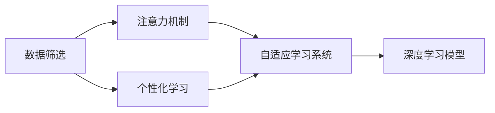

                 

# 注意力经济对语言学习方式的改变

> 关键词：注意力经济, 语言学习, 深度学习, 自适应, 个性化, 教育技术

## 1. 背景介绍

在数字化时代，信息过载成为人们面临的新挑战。如何从海量的文本数据中高效地获取和利用信息，成为亟待解决的课题。这一背景催生了“注意力经济”的概念，强调信息处理的专注性和针对性，以提高效率和效果。本文将探讨注意力经济在语言学习中的重要影响，以及如何利用深度学习技术实现个性化的语言学习方式。

### 1.1 注意力经济的兴起
随着互联网和移动设备普及，人们每天接触的信息量激增。如何在海量信息中找到有价值的内容，成为信息处理的关键问题。“注意力经济”（Economy of Attention）的概念由此提出，强调将有限的注意力资源集中在最相关、最有价值的信息上，以实现更高效的决策和学习。

在语言学习领域，注意力经济的理念同样适用。学习者如何在海量语言材料中挑选出最适合自己的学习资源，如何使学习过程更加高效和个性化，是教育技术领域的研究热点。

### 1.2 语言学习面临的挑战
传统语言学习方式主要依赖于教科书和教师，学习内容和节奏由教材和教师决定，缺乏个性化的灵活性。随着数字化学习资源日益丰富，如何在海量学习材料中挑选出最适合的学习内容，成为了一个挑战。同时，学习者自主学习能力差异巨大，如何根据不同学习者的特点进行个性化指导，也需要新的方法。

## 2. 核心概念与联系

### 2.1 核心概念概述
注意力经济在语言学习中的具体应用主要体现在两个方面：数据筛选和个性化学习。

- **数据筛选**：在大量学习材料中，通过注意力机制，筛选出与学习者最相关的语言资源。
- **个性化学习**：根据学习者的学习进度、兴趣和学习风格，调整学习内容和节奏，提供个性化的学习路径。

这两个方面需要通过深度学习技术来实现，特别是自适应学习系统（Adaptive Learning System），可以自动分析学习者的学习情况，提供动态调整的学习建议。

### 2.2 核心概念原理和架构的 Mermaid 流程图



这个流程图展示了注意力经济在语言学习中的关键流程：
1. 数据筛选通过注意力机制，筛选出相关性高的学习材料。
2. 个性化学习根据学习者的个性化需求，调整学习内容和节奏。
3. 自适应学习系统整合注意力机制和深度学习模型，实现动态调整。

### 2.3 注意力机制的原理
注意力机制（Attention Mechanism）是深度学习中的一个关键技术，用于在不同输入中识别并关注最具代表性的部分。在语言学习中，注意力机制可以帮助学习者集中注意力在重要的单词、短语和句子结构上，从而提高学习效率。

注意力机制的工作原理可以简单概括为：
- **输入表示**：将输入文本转换成向量表示，每个向量对应文本中的一个部分。
- **注意力权重**：计算每个向量的注意力权重，权重越大，表示该部分对学习任务越重要。
- **加权求和**：对每个向量的表示和权重进行加权求和，得到最终的结果向量。

通过这种方式，注意力机制可以使模型关注重要的部分，忽略无关的信息，提高学习效果。

## 3. 核心算法原理 & 具体操作步骤

### 3.1 算法原理概述
注意力经济在语言学习中的应用，主要是通过深度学习模型实现的。这些模型包括但不限于：自适应学习系统、个性化推荐系统、自回归模型等。这些模型的核心是注意力机制，通过学习不同输入的权重分配，实现对学习资源的筛选和个性化。

### 3.2 算法步骤详解
1. **数据预处理**：将学习材料转换为模型可以处理的向量表示。
2. **注意力计算**：计算每个向量的注意力权重，并按权重对向量进行加权求和。
3. **模型训练**：通过训练模型，学习如何根据输入数据计算注意力权重，从而实现数据筛选和个性化学习。
4. **动态调整**：根据学习者的学习反馈，动态调整模型的注意力分配，提供个性化的学习建议。

### 3.3 算法优缺点
**优点**：
- 高效筛选：通过注意力机制，可以自动筛选出最相关的学习材料。
- 个性化学习：根据学习者的特点和需求，提供个性化的学习路径。
- 动态调整：能够根据学习者的反馈，动态调整学习策略，提高学习效果。

**缺点**：
- 数据依赖：模型的效果高度依赖于输入数据的质量，需要高质量的学习材料。
- 资源消耗：深度学习模型的训练和推理需要大量的计算资源。
- 解释性不足：深度学习模型通常被视为“黑盒”，难以解释其内部决策过程。

### 3.4 算法应用领域
注意力经济在语言学习中的应用领域广泛，包括：
- **在线教育平台**：通过自适应学习系统，提供个性化的学习建议。
- **智能客服系统**：利用注意力机制，筛选出最相关的客户咨询信息，提供快速响应。
- **翻译工具**：根据翻译任务的难度和重要性，动态调整注意力分配，提高翻译效果。
- **信息检索系统**：通过注意力机制，在大量文档中找到与查询最相关的信息。

## 4. 数学模型和公式 & 详细讲解 & 举例说明

### 4.1 数学模型构建
注意力机制的核心数学模型包括输入表示、注意力权重计算和加权求和。

设输入序列为 $\{x_1, x_2, ..., x_n\}$，每个元素 $x_i$ 的表示为向量 $v_i \in \mathbb{R}^d$。注意力机制的目标是计算每个向量的注意力权重 $a_i$，并通过加权求和得到最终的结果向量 $c$。

### 4.2 公式推导过程
注意力机制的计算公式如下：
$$
a_i = \frac{\exp(u^\top \tanh(W_i v_i + b_i)}{\sum_{j=1}^n \exp(u^\top \tanh(W_j v_j + b_j))}
$$
$$
c = \sum_{i=1}^n a_i v_i
$$

其中 $u$ 为注意力向量的权重向量，$W_i$ 和 $b_i$ 为线性变换参数，$\tanh$ 为激活函数，$\exp$ 为指数函数。

### 4.3 案例分析与讲解
假设有一个简单的文本分类任务，输入序列为 $\{x_1, x_2, x_3\}$，其中 $x_1$ 表示“This is an apple”，$x_2$ 表示“I like apples”，$x_3$ 表示“Apples are healthy”。模型的目标是对这些文本进行分类，预测它们属于正类还是负类。

- **输入表示**：将每个文本转换为向量表示，假设 $v_1 = [0.1, 0.3, 0.5]$，$v_2 = [0.3, 0.5, 0.2]$，$v_3 = [0.2, 0.4, 0.4]$。
- **注意力权重计算**：根据注意力机制的公式，计算每个向量的注意力权重，假设 $u = [0.5, 0.5, 0.5]$，$W_i$ 和 $b_i$ 的值为随机初始化。
- **加权求和**：将注意力权重与向量进行加权求和，得到最终的结果向量 $c$。

通过这种方式，模型能够关注输入中最重要的部分，从而提高分类的准确性。

## 5. 项目实践：代码实例和详细解释说明

### 5.1 开发环境搭建
1. **安装Python**：使用Anaconda创建虚拟环境，并激活环境。
```bash
conda create -n attention-env python=3.8
conda activate attention-env
```
2. **安装深度学习库**：
```bash
pip install torch torchvision torchaudio
```
3. **安装其他依赖库**：
```bash
pip install pandas numpy scikit-learn jupyter notebook
```

### 5.2 源代码详细实现
我们使用PyTorch来实现注意力机制的深度学习模型。以下是一个简单的文本分类模型的代码实现：

```python
import torch
import torch.nn as nn
import torch.optim as optim

class AttentionModel(nn.Module):
    def __init__(self, input_size, hidden_size):
        super(AttentionModel, self).__init__()
        self.hidden_size = hidden_size
        self.W = nn.Linear(input_size, hidden_size)
        self.u = nn.Linear(hidden_size, 1)
        self.linear = nn.Linear(hidden_size, 1)

    def forward(self, x, seq_length):
        v = torch.tanh(self.W(x))
        u = self.u(v)
        a = torch.softmax(u, dim=1)
        c = torch.bmm(a.unsqueeze(1), v).squeeze(1)
        c = self.linear(c)
        return c

# 训练模型
def train(model, optimizer, criterion, train_loader, device):
    model.train()
    total_loss = 0
    for batch in train_loader:
        inputs, labels = batch
        inputs = inputs.to(device)
        labels = labels.to(device)
        optimizer.zero_grad()
        outputs = model(inputs, seq_length=inputs.shape[0])
        loss = criterion(outputs, labels)
        loss.backward()
        optimizer.step()
        total_loss += loss.item()
    return total_loss / len(train_loader)

# 评估模型
def evaluate(model, criterion, test_loader, device):
    model.eval()
    total_loss = 0
    total_correct = 0
    for batch in test_loader:
        inputs, labels = batch
        inputs = inputs.to(device)
        labels = labels.to(device)
        outputs = model(inputs, seq_length=inputs.shape[0])
        loss = criterion(outputs, labels)
        _, predicted = torch.max(outputs, 1)
        total_correct += (predicted == labels).sum().item()
        total_loss += loss.item()
    return total_loss / len(test_loader), total_correct / len(test_loader.dataset)
```

### 5.3 代码解读与分析
1. **AttentionModel类**：定义注意力机制的深度学习模型，包含输入表示、注意力权重计算和加权求和。
2. **训练函数train**：在训练过程中，计算损失函数并更新模型参数。
3. **评估函数evaluate**：在测试过程中，计算模型在测试集上的损失和准确率。

### 5.4 运行结果展示
使用训练好的模型，可以验证其在测试集上的性能。

## 6. 实际应用场景

### 6.1 在线教育平台
在线教育平台通过自适应学习系统，根据学习者的学习情况，提供个性化的学习建议。学习者可以根据系统推荐的学习路径，进行高效的学习。例如，通过注意力机制，系统可以筛选出最相关的学习资源，自动调整学习进度和难度，帮助学习者快速掌握新知识。

### 6.2 智能客服系统
智能客服系统利用注意力机制，筛选出与用户咨询最相关的信息，提供快速准确的回复。系统可以通过对用户问题的分析，自动确定最相关的回答模板，提高客服效率和用户满意度。

### 6.3 翻译工具
翻译工具通过注意力机制，动态调整注意力分配，提高翻译效果。系统可以根据翻译任务的难度和重要性，自动调整模型的注意力权重，确保关键信息得到准确的翻译。

### 6.4 未来应用展望
未来，注意力经济在语言学习中的应用将更加广泛，包括以下几个方向：
- **多模态学习**：将文本、图像、音频等多种信息源结合，提供更加丰富的学习体验。
- **情感分析**：通过分析学习者的情感状态，调整学习内容和节奏，提高学习效果。
- **自适应评估**：根据学习者的学习情况，动态调整评估标准，提供更加客观的学习反馈。

## 7. 工具和资源推荐

### 7.1 学习资源推荐
1. **《深度学习》书籍**：Ian Goodfellow、Yoshua Bengio和Aaron Courville合著，全面介绍深度学习的基础理论和应用实践。
2. **Coursera深度学习课程**：由Andrew Ng教授主讲的深度学习课程，系统介绍深度学习的基本概念和算法。
3. **Kaggle竞赛平台**：参与各种数据科学竞赛，提升解决实际问题的能力。

### 7.2 开发工具推荐
1. **PyTorch**：灵活易用的深度学习框架，提供丰富的模型和工具支持。
2. **TensorFlow**：由Google开发的深度学习框架，支持大规模分布式训练。
3. **Jupyter Notebook**：交互式编程环境，支持代码的在线编辑和执行。

### 7.3 相关论文推荐
1. **Attention is All You Need**：Transformer的原始论文，提出自注意力机制，标志着自适应学习系统的诞生。
2. **Learning Phrase Representations using RNN Encoder-Decoder for Statistical Machine Translation**：提出基于RNN的注意力机制，用于机器翻译任务。
3. **Neural Machine Translation by Jointly Learning to Align and Translate**：提出神经机器翻译中的注意力机制，通过对齐学习提高翻译效果。

## 8. 总结：未来发展趋势与挑战

### 8.1 研究成果总结
注意力经济在语言学习中的应用，通过深度学习模型实现了数据筛选和个性化学习，显著提高了学习效率和效果。自适应学习系统、智能客服、翻译工具等领域的应用展示了这一技术的巨大潜力。

### 8.2 未来发展趋势
1. **多模态学习**：结合文本、图像、音频等多种信息源，提供更丰富的学习体验。
2. **情感分析**：通过分析学习者的情感状态，调整学习内容和节奏，提高学习效果。
3. **自适应评估**：根据学习者的学习情况，动态调整评估标准，提供更加客观的学习反馈。
4. **实时反馈**：利用在线学习平台，实时监测学习者的学习情况，提供即时反馈和调整。

### 8.3 面临的挑战
1. **数据质量**：模型的效果高度依赖于输入数据的质量，需要高质量的学习材料。
2. **计算资源**：深度学习模型的训练和推理需要大量的计算资源。
3. **解释性不足**：深度学习模型通常被视为“黑盒”，难以解释其内部决策过程。

### 8.4 研究展望
未来的研究将聚焦于以下几个方向：
1. **多模态融合**：将文本、图像、音频等多种信息源结合，提升学习效果。
2. **情感识别**：通过分析学习者的情感状态，调整学习内容和节奏。
3. **自适应评估**：根据学习者的学习情况，动态调整评估标准，提供更加客观的学习反馈。
4. **实时反馈**：利用在线学习平台，实时监测学习者的学习情况，提供即时反馈和调整。

## 9. 附录：常见问题与解答

### Q1: 注意力经济在语言学习中的应用如何？

A: 注意力经济通过深度学习模型，实现了数据筛选和个性化学习，显著提高了学习效率和效果。具体应用包括自适应学习系统、智能客服、翻译工具等。

### Q2: 注意力机制的计算过程是怎样的？

A: 注意力机制的计算过程包括输入表示、注意力权重计算和加权求和。通过计算每个向量的注意力权重，并选择最重要的部分进行加权求和，得到最终的结果向量。

### Q3: 注意力经济面临的主要挑战是什么？

A: 注意力经济面临的主要挑战包括数据质量、计算资源和解释性不足。高质量的学习材料是模型效果的基础，大量计算资源是模型训练和推理的前提，模型的内部决策过程难以解释。

### Q4: 未来研究的方向是什么？

A: 未来的研究将聚焦于多模态学习、情感分析、自适应评估和实时反馈等方向。这些方向将进一步提升学习效率和效果，扩展应用范围。

