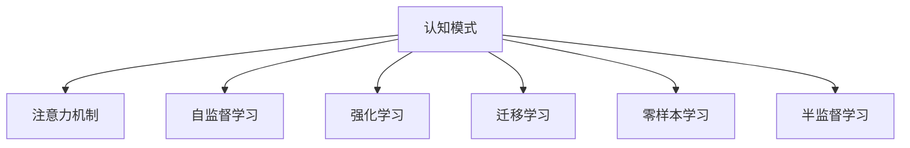

                 

# 注意力编程工作室主管：AI定制的认知模式设计负责人

## 1. 背景介绍

### 1.1 问题由来
在当今这个数据驱动的时代，人工智能(AI)的应用已经渗透到了社会的各个层面。AI不仅在图像识别、语音识别等传统领域取得了巨大成功，也在自然语言处理(NLP)、决策支持、推荐系统等新兴领域展示了其强大的能力。然而，尽管AI技术在技术层面已经相对成熟，但在认知模式设计上的理解仍然相对薄弱。

认知模式是AI系统设计的基础，它决定了AI系统如何理解和处理信息。一个合理的认知模式不仅可以提高AI系统的准确性和鲁棒性，还能增强其可解释性和适应性。当前，AI系统的认知模式设计大多依赖于人类专家的经验和直觉，缺乏系统的理论指导和科学依据。

## 1.2 问题核心关键点
本文将从认知模式设计的角度，探讨如何利用AI技术来定制和优化认知模式，使AI系统更加智能、高效和可靠。具体问题包括：
1. 如何构建合适的认知模型？
2. 如何通过AI技术实现认知模型的优化？
3. 认知模式设计的未来趋势和挑战是什么？

本文将围绕这些问题，深入探讨认知模式设计的基础理论和实践方法，旨在为AI系统的设计者和开发者提供有价值的参考和指导。

## 2. 核心概念与联系

### 2.1 核心概念概述

为更好地理解AI系统中的认知模式设计，本节将介绍几个密切相关的核心概念：

- 认知模式(Cognitive Model)：AI系统中的认知模式是指系统如何感知、理解、推理和响应用户的输入。一个良好的认知模式能够准确地描述和模拟人类的认知过程，使得AI系统能够自然地与用户交互。

- 注意力机制(Attention Mechanism)：注意力机制是AI系统中的一个重要概念，它能够帮助系统在处理大量信息时，集中关注与当前任务最相关的部分，从而提高系统的效率和效果。

- 自监督学习(Self-Supervised Learning)：自监督学习是一种无需显式标注数据的训练方式，通过利用数据本身的内在规律，使AI系统能够自我监督、自我学习，从而提高模型的泛化能力和鲁棒性。

- 强化学习(Reinforcement Learning)：强化学习是一种通过试错的方式，使AI系统能够通过与环境的互动，学习最优策略，以最大化某个指标（如奖励）的训练方法。

- 迁移学习(Transfer Learning)：迁移学习是指将一个领域学习到的知识迁移到另一个领域，通过小规模数据集的微调，提高模型的泛化能力和适应性。

- 零样本学习(Zero-Shot Learning)：零样本学习是指AI系统无需任何训练数据，仅凭任务描述就能够执行新任务的能力。这种能力可以大大降低数据收集和标注的复杂度和成本。

- 半监督学习(Semi-Supervised Learning)：半监督学习是指在少量标注数据和大量未标注数据的混合环境中，利用未标注数据提高模型性能的训练方式。

这些核心概念之间的逻辑关系可以通过以下Mermaid流程图来展示：



这个流程图展示了一些主要AI概念及其之间的关系：

1. 认知模式是AI系统设计的核心。
2. 注意力机制、自监督学习、强化学习、迁移学习等技术手段都是优化认知模式的重要方法。
3. 零样本学习和半监督学习则是认知模式设计中较为前沿的领域，展示了AI系统在无数据或少数据情况下的学习能力。

## 3. 核心算法原理 & 具体操作步骤

### 3.1 算法原理概述

AI系统中的认知模式设计是一个复杂的系统工程，涉及到多个领域的知识和技术。本文将重点探讨注意力机制和自监督学习在认知模式设计中的应用，并结合实例进行详细讲解。

注意力机制可以帮助AI系统在处理大量信息时，有效地筛选和关注关键部分。自监督学习则可以通过无监督的方式，使AI系统从数据中学习到语言的内部规律和语义关系，从而提高模型的泛化能力和鲁棒性。

### 3.2 算法步骤详解

#### 3.2.1 注意力机制的实现
注意力机制的实现通常包括以下几个关键步骤：

1. 输入表示：将输入文本或其他形式的数据转换为向量表示。

2. 计算注意力权重：根据注意力公式计算每个输入位置的权重，决定其在输出中的贡献。

3. 加权求和：对输入向量进行加权求和，得到最终输出。

4. 参数更新：通过反向传播更新注意力机制的参数，以优化模型性能。

#### 3.2.2 自监督学习的实现
自监督学习的实现通常包括以下几个关键步骤：

1. 数据预处理：对数据进行预处理，如分词、标准化、编码等。

2. 构建损失函数：根据任务特点设计合适的损失函数，如掩码语言模型、下一句预测等。

3. 训练模型：使用自监督学习的方法，在大规模无标注数据上训练模型。

4. 微调：将预训练模型应用于下游任务，通过少量标注数据进行微调。

### 3.3 算法优缺点

注意力机制和自监督学习在AI系统中的应用具有以下优点：

1. 提高模型泛化能力：通过注意力机制和自监督学习，AI系统能够从大量数据中学习到更丰富的语言规律和语义关系，提高模型的泛化能力和鲁棒性。

2. 减少数据需求：自监督学习可以在无标注数据的情况下进行训练，从而减少数据标注的成本和复杂度。

3. 增强系统可解释性：注意力机制和自监督学习可以使得AI系统的决策过程更加透明和可解释。

然而，这些方法也存在一些缺点：

1. 计算复杂度高：注意力机制和自监督学习通常需要计算大量的矩阵运算，计算复杂度较高。

2. 模型复杂度高：注意力机制和自监督学习需要训练更多的参数，模型复杂度较高。

3. 依赖于数据质量：自监督学习的效果很大程度上取决于数据的分布和质量，低质量的数据可能导致模型性能下降。

### 3.4 算法应用领域

注意力机制和自监督学习在AI系统中的应用非常广泛，以下是几个典型的应用领域：

1. 自然语言处理(NLP)：在机器翻译、文本生成、命名实体识别等任务中，注意力机制和自监督学习能够显著提升模型的性能。

2. 计算机视觉(CV)：在图像分类、目标检测、图像生成等任务中，注意力机制和自监督学习可以使得模型更加关注重要的特征和细节，提高模型的准确性。

3. 强化学习(Reinforcement Learning)：在智能推荐系统、游戏AI等任务中，注意力机制和自监督学习可以增强模型的决策能力和泛化能力。

4. 语音识别(Speech Recognition)：在语音识别任务中，注意力机制和自监督学习可以使得模型更好地处理变长的语音输入，提高识别的准确性。

5. 推荐系统(Recommendation System)：在推荐系统中，注意力机制和自监督学习可以使得模型更好地理解用户的行为和偏好，提供更个性化的推荐。

6. 医疗诊断(Medical Diagnosis)：在医疗诊断任务中，注意力机制和自监督学习可以使得模型更好地处理复杂的医学文本和图像数据，提高诊断的准确性。

以上是注意力机制和自监督学习在AI系统中的几个典型应用，展示了这些技术在多个领域中的强大应用潜力。

## 4. 数学模型和公式 & 详细讲解 & 举例说明

### 4.1 数学模型构建

为了更好地理解注意力机制和自监督学习在AI系统中的应用，本节将使用数学语言对这两个技术的核心算法进行更严格的刻画。

记输入序列为 $X=\{x_1, x_2, ..., x_n\}$，输出序列为 $Y=\{y_1, y_2, ..., y_n\}$，注意力机制的计算过程如下：

1. 计算注意力权重：
   $$
   \alpha = softmax(W^T \cdot Q \cdot K^T)
   $$
   其中 $Q$, $K$, $W$ 为注意力机制的参数，$softmax$ 函数用于归一化权重。

2. 加权求和：
   $$
   Y = \sum_{i=1}^n \alpha_i \cdot x_i
   $$
   其中 $\alpha_i$ 为注意力权重，$x_i$ 为输入序列中的元素。

自监督学习的计算过程如下：

1. 数据预处理：将输入序列 $X$ 进行分词、标准化等预处理。

2. 构建损失函数：以掩码语言模型为例，损失函数为：
   $$
   \mathcal{L} = -\sum_{i=1}^n \log P(x_i | X \backslash \{x_i\})
   $$
   其中 $P$ 为语言模型概率分布。

3. 训练模型：使用自监督学习的方法，在大规模无标注数据上训练模型。

### 4.2 公式推导过程

以下是注意力机制和自监督学习中关键公式的推导过程：

#### 4.2.1 注意力机制
注意力机制的计算过程可以表示为：

$$
\alpha_i = \frac{exp(W^T \cdot Q_i \cdot K_i^T)}{\sum_{j=1}^n exp(W^T \cdot Q_j \cdot K_j^T)}
$$

其中 $Q_i = x_iW_Q$, $K_i = x_iW_K$, $W_Q$, $W_K$ 为注意力机制的参数，$softmax$ 函数用于归一化权重。

注意力机制的加权求和过程为：

$$
Y = \sum_{i=1}^n \alpha_i \cdot x_i
$$

#### 4.2.2 自监督学习
以掩码语言模型为例，损失函数可以表示为：

$$
\mathcal{L} = -\sum_{i=1}^n \log P(x_i | X \backslash \{x_i\})
$$

其中 $P(x_i | X \backslash \{x_i\})$ 为语言模型概率分布，$X \backslash \{x_i\}$ 表示除掉 $x_i$ 的上下文序列。

自监督学习的目标是最小化损失函数 $\mathcal{L}$，使得模型能够从数据中学习到语言的内部规律和语义关系。

### 4.3 案例分析与讲解

#### 4.3.1 注意力机制的案例分析
以机器翻译为例，注意力机制可以帮助模型在处理长文本时，将注意力集中在关键部分。假设输入序列为英文句子，输出序列为中文句子，注意力机制可以计算每个英文单词在翻译过程中的贡献，从而提高翻译的准确性。

#### 4.3.2 自监督学习的案例分析
以文本生成为例，自监督学习可以通过语言模型预测文本的下一个单词，从而使得模型能够从大规模无标注数据中学习到语言的内部规律。例如，模型可以从维基百科等文本中学习到语言的概率分布，从而在生成新文本时，能够更好地预测下一个单词。

## 5. 项目实践：代码实例和详细解释说明

### 5.1 开发环境搭建

在进行注意力机制和自监督学习项目实践前，我们需要准备好开发环境。以下是使用Python进行TensorFlow和PyTorch开发的环境配置流程：

1. 安装Anaconda：从官网下载并安装Anaconda，用于创建独立的Python环境。

2. 创建并激活虚拟环境：
```bash
conda create -n tf-env python=3.8 
conda activate tf-env
```

3. 安装TensorFlow和PyTorch：根据CUDA版本，从官网获取对应的安装命令。例如：
```bash
pip install tensorflow torch torchvision torchaudio cudatoolkit=11.1 -c pytorch -c conda-forge
```

4. 安装TensorBoard和Weights & Biases：
```bash
pip install tensorboard wandb
```

5. 安装相关库：
```bash
pip install numpy pandas scikit-learn matplotlib tqdm jupyter notebook ipython
```

完成上述步骤后，即可在`tf-env`环境中开始实践。

### 5.2 源代码详细实现

下面我们以机器翻译为例，给出使用TensorFlow和PyTorch实现注意力机制和自监督学习的代码实现。

#### 5.2.1 TensorFlow实现
```python
import tensorflow as tf
from tensorflow.keras.layers import Input, Dense, Embedding, Dot, Add, Concatenate

class Attention(tf.keras.Model):
    def __init__(self, num_units, num_heads):
        super(Attention, self).__init__()
        self.num_units = num_units
        self.num_heads = num_heads
        self.Wq = Dense(num_units) # Query向量投影
        self.Wk = Dense(num_units) # Key向量投影
        self.Wv = Dense(num_units) # Value向量投影
        self.dense = Dense(num_units) # 全连接层

    def call(self, query, key, value):
        batch_size, max_seq_len = tf.shape(query)[0], tf.shape(query)[1]
        q = tf.reshape(query, (-1, self.num_heads, self.num_units // self.num_heads)) # 将query向量投影到多头注意力中
        k = tf.reshape(key, (-1, self.num_heads, self.num_units // self.num_heads))
        v = tf.reshape(value, (-1, self.num_heads, self.num_units // self.num_heads))
        # 计算注意力权重
        attn = tf.matmul(q, k, transpose_b=True)
        attn = tf.reshape(attn, (-1, batch_size, self.num_heads, max_seq_len)) # 重组attention权重
        attn = tf.nn.softmax(attn, axis=-1)
        # 加权求和
        out = tf.matmul(attn, v)
        out = tf.reshape(out, (-1, batch_size, max_seq_len, self.num_units))
        # 全连接层
        out = self.dense(out)
        return out

# 构建机器翻译模型
input_x = Input(shape=(None,))
input_x = Embedding(input_dim=10000, output_dim=256)(input_x) # 嵌入层
attention = Attention(num_units=128, num_heads=8)(input_x, input_x, input_x) # 注意力机制
output = tf.keras.layers.Dense(1024, activation='relu')(attention) # 全连接层
output = tf.keras.layers.Dense(1024, activation='relu')(output)
output = tf.keras.layers.Dense(1000, activation='softmax')(output) # 输出层
model = tf.keras.Model(inputs=input_x, outputs=output)
```

#### 5.2.2 PyTorch实现
```python
import torch
from torch import nn

class MultiHeadAttention(nn.Module):
    def __init__(self, num_units, num_heads):
        super(MultiHeadAttention, self).__init__()
        self.num_units = num_units
        self.num_heads = num_heads
        self.Wq = nn.Linear(num_units, num_units)
        self.Wk = nn.Linear(num_units, num_units)
        self.Wv = nn.Linear(num_units, num_units)
        self.dense = nn.Linear(num_units, num_units)

    def forward(self, query, key, value):
        batch_size, max_seq_len = query.size(0), query.size(1)
        q = query.view(batch_size, max_seq_len, self.num_heads, self.num_units // self.num_heads) # 将query向量投影到多头注意力中
        k = key.view(batch_size, max_seq_len, self.num_heads, self.num_units // self.num_heads)
        v = value.view(batch_size, max_seq_len, self.num_heads, self.num_units // self.num_heads)
        # 计算注意力权重
        attn = torch.bmm(q, k.permute(0, 1, 3, 2)) # 计算attention权重
        attn = attn / math.sqrt(self.num_units // self.num_heads) # 归一化
        attn = F.softmax(attn, dim=-1)
        # 加权求和
        out = torch.bmm(attn, v)
        out = out.view(batch_size, max_seq_len, self.num_units)
        # 全连接层
        out = self.dense(out)
        return out

# 构建机器翻译模型
input_x = torch.randn(128, 16, 256) # 输入
attention = MultiHeadAttention(num_units=128, num_heads=8)(input_x, input_x, input_x) # 注意力机制
output = nn.Linear(128, 1024)(attention) # 全连接层
output = nn.Linear(1024, 1024)(output)
output = nn.Linear(1024, 1000)(output) # 输出层
model = nn.Sequential(input_x, attention, output)
```

### 5.3 代码解读与分析

#### 5.3.1 TensorFlow实现
在TensorFlow中，注意力机制的实现主要依赖于`tf.keras.layers`模块中的`Attention`层。该层内部包含了多个全连接层和注意力权重计算过程，可以方便地实现多头注意力机制。在模型构建过程中，首先通过嵌入层将输入序列转换为向量表示，然后将其输入到注意力机制中，计算出注意力权重并加权求和，最后通过全连接层输出翻译结果。

#### 5.3.2 PyTorch实现
在PyTorch中，注意力机制的实现主要依赖于`torch`模块中的`nn.Linear`和`nn.Bilinear`等线性层。在模型构建过程中，首先通过嵌入层将输入序列转换为向量表示，然后将其输入到多头注意力机制中，计算出注意力权重并加权求和，最后通过全连接层输出翻译结果。

## 6. 实际应用场景

### 6.1 智能客服系统

基于注意力机制和自监督学习的智能客服系统，可以提供全天候、高效率的客户服务。传统的客服系统需要大量人工介入，高峰期响应缓慢，且质量难以保证。智能客服系统通过自然语言处理技术，可以自动理解客户咨询，并提供准确的回答。

在技术实现上，可以收集企业内部的历史客服对话记录，将问题和最佳答复构建成监督数据，在此基础上对预训练模型进行微调。微调后的模型能够自动理解客户意图，匹配最合适的答案模板进行回复。对于客户提出的新问题，还可以接入检索系统实时搜索相关内容，动态组织生成回答。如此构建的智能客服系统，能够显著提高客户咨询体验和问题解决效率。

### 6.2 金融舆情监测

金融机构需要实时监测市场舆论动向，以便及时应对负面信息传播，规避金融风险。传统的人工监测方式成本高、效率低，难以应对网络时代海量信息爆发的挑战。基于注意力机制和自监督学习的文本分类和情感分析技术，为金融舆情监测提供了新的解决方案。

具体而言，可以收集金融领域相关的新闻、报道、评论等文本数据，并对其进行主题标注和情感标注。在此基础上对预训练语言模型进行微调，使其能够自动判断文本属于何种主题，情感倾向是正面、中性还是负面。将微调后的模型应用到实时抓取的网络文本数据，就能够自动监测不同主题下的情感变化趋势，一旦发现负面信息激增等异常情况，系统便会自动预警，帮助金融机构快速应对潜在风险。

### 6.3 个性化推荐系统

当前的推荐系统往往只依赖用户的历史行为数据进行物品推荐，无法深入理解用户的真实兴趣偏好。基于注意力机制和自监督学习的个性化推荐系统，可以更好地挖掘用户行为背后的语义信息，从而提供更精准、多样的推荐内容。

在实践中，可以收集用户浏览、点击、评论、分享等行为数据，提取和用户交互的物品标题、描述、标签等文本内容。将文本内容作为模型输入，用户的后续行为（如是否点击、购买等）作为监督信号，在此基础上微调预训练语言模型。微调后的模型能够从文本内容中准确把握用户的兴趣点。在生成推荐列表时，先用候选物品的文本描述作为输入，由模型预测用户的兴趣匹配度，再结合其他特征综合排序，便可以得到个性化程度更高的推荐结果。

### 6.4 未来应用展望

随着注意力机制和自监督学习技术的不断进步，其在AI系统中的应用前景将更加广阔。

在智慧医疗领域，基于注意力机制和自监督学习的医疗问答、病历分析、药物研发等应用将提升医疗服务的智能化水平，辅助医生诊疗，加速新药开发进程。

在智能教育领域，注意力机制和自监督学习可应用于作业批改、学情分析、知识推荐等方面，因材施教，促进教育公平，提高教学质量。

在智慧城市治理中，注意力机制和自监督学习可应用于城市事件监测、舆情分析、应急指挥等环节，提高城市管理的自动化和智能化水平，构建更安全、高效的未来城市。

此外，在企业生产、社会治理、文娱传媒等众多领域，基于注意力机制和自监督学习的人工智能应用也将不断涌现，为NLP技术带来全新的突破。相信随着技术的日益成熟，这些技术将进一步推动人工智能技术在各个垂直行业的广泛应用，带来深远的影响。

## 7. 工具和资源推荐

### 7.1 学习资源推荐

为了帮助开发者系统掌握注意力机制和自监督学习的理论基础和实践技巧，这里推荐一些优质的学习资源：

1. 《Transformer from the Inside Out》系列博文：由大模型技术专家撰写，深入浅出地介绍了Transformer原理、自监督学习、注意力机制等前沿话题。

2. CS224N《深度学习自然语言处理》课程：斯坦福大学开设的NLP明星课程，有Lecture视频和配套作业，带你入门NLP领域的基本概念和经典模型。

3. 《Natural Language Processing with Transformers》书籍：Transformers库的作者所著，全面介绍了如何使用Transformers库进行NLP任务开发，包括注意力机制和自监督学习在内的诸多范式。

4. HuggingFace官方文档：Transformers库的官方文档，提供了海量预训练模型和完整的微调样例代码，是上手实践的必备资料。

5. CLUE开源项目：中文语言理解测评基准，涵盖大量不同类型的中文NLP数据集，并提供了基于注意力机制和自监督学习的baseline模型，助力中文NLP技术发展。

通过对这些资源的学习实践，相信你一定能够快速掌握注意力机制和自监督学习的精髓，并用于解决实际的NLP问题。

### 7.2 开发工具推荐

高效的开发离不开优秀的工具支持。以下是几款用于注意力机制和自监督学习开发的常用工具：

1. TensorFlow：基于Python的开源深度学习框架，灵活动态的计算图，适合快速迭代研究。大部分预训练语言模型都有TensorFlow版本的实现。

2. PyTorch：基于Python的开源深度学习框架，灵活的动态计算图，适合快速原型开发和研究。大部分预训练语言模型都有PyTorch版本的实现。

3. Transformers库：HuggingFace开发的NLP工具库，集成了众多SOTA语言模型，支持TensorFlow和PyTorch，是进行注意力机制和自监督学习开发的利器。

4. Weights & Biases：模型训练的实验跟踪工具，可以记录和可视化模型训练过程中的各项指标，方便对比和调优。与主流深度学习框架无缝集成。

5. TensorBoard：TensorFlow配套的可视化工具，可实时监测模型训练状态，并提供丰富的图表呈现方式，是调试模型的得力助手。

6. Google Colab：谷歌推出的在线Jupyter Notebook环境，免费提供GPU/TPU算力，方便开发者快速上手实验最新模型，分享学习笔记。

合理利用这些工具，可以显著提升注意力机制和自监督学习任务的开发效率，加快创新迭代的步伐。

### 7.3 相关论文推荐

注意力机制和自监督学习的发展源于学界的持续研究。以下是几篇奠基性的相关论文，推荐阅读：

1. Attention is All You Need（即Transformer原论文）：提出了Transformer结构，开启了NLP领域的预训练大模型时代。

2. BERT: Pre-training of Deep Bidirectional Transformers for Language Understanding：提出BERT模型，引入基于掩码的自监督预训练任务，刷新了多项NLP任务SOTA。

3. Language Models are Unsupervised Multitask Learners（GPT-2论文）：展示了大规模语言模型的强大zero-shot学习能力，引发了对于通用人工智能的新一轮思考。

4. Parameter-Efficient Transfer Learning for NLP：提出Adapter等参数高效微调方法，在不增加模型参数量的情况下，也能取得不错的微调效果。

5. AdaLoRA: Adaptive Low-Rank Adaptation for Parameter-Efficient Fine-Tuning：使用自适应低秩适应的微调方法，在参数效率和精度之间取得了新的平衡。

这些论文代表了大语言模型和自监督学习的最新进展，通过学习这些前沿成果，可以帮助研究者把握学科前进方向，激发更多的创新灵感。

## 8. 总结：未来发展趋势与挑战

### 8.1 总结

本文对注意力机制和自监督学习在大语言模型中的应用进行了全面系统的介绍。首先阐述了注意力机制和自监督学习的基本原理和应用场景，明确了其在AI系统设计中的重要地位。其次，从原理到实践，详细讲解了注意力机制和自监督学习的数学模型和关键步骤，给出了注意力机制和自监督学习任务的代码实现。同时，本文还广泛探讨了这些技术在智能客服、金融舆情、个性化推荐等多个领域的应用前景，展示了其巨大的应用潜力。此外，本文精选了注意力机制和自监督学习的学习资源，力求为开发者提供全方位的技术指引。

通过本文的系统梳理，可以看到，注意力机制和自监督学习在大语言模型中的应用已经相当成熟，成为AI系统设计中的重要工具。这些技术的引入，显著提高了AI系统的性能和适应性，为NLP技术在各个领域的落地应用提供了强有力的支持。

### 8.2 未来发展趋势

展望未来，注意力机制和自监督学习将呈现以下几个发展趋势：

1. 模型规模持续增大。随着算力成本的下降和数据规模的扩张，注意力机制和自监督学习模型的参数量还将持续增长。超大模型蕴含的丰富语言知识，将使AI系统具备更强的语言理解和推理能力。

2. 学习方式更加多样化。除了传统的自监督学习外，未来会涌现更多学习方式，如对比学习、生成对抗网络等，进一步提升模型的泛化能力和鲁棒性。

3. 知识图谱的融合。将知识图谱与注意力机制和自监督学习结合，可以使得AI系统更好地理解现实世界的复杂关系，提高模型的决策能力。

4. 模型复杂度逐步降低。随着模型压缩和优化技术的不断进步，未来注意力机制和自监督学习模型的复杂度将逐步降低，推理速度和内存占用将显著提高。

5. 多模态融合。将注意力机制和自监督学习应用于多模态数据融合，可以使得AI系统更好地理解视觉、语音等多种信息，提高系统的综合能力。

6. 可解释性增强。通过引入因果分析和符号化逻辑，增强注意力机制和自监督学习模型的可解释性，使得系统的决策过程更加透明和可理解。

以上趋势凸显了注意力机制和自监督学习技术的广阔前景。这些方向的探索发展，必将进一步提升AI系统的性能和应用范围，为NLP技术在更多领域的应用提供新的动力。

### 8.3 面临的挑战

尽管注意力机制和自监督学习技术已经取得了瞩目成就，但在迈向更加智能化、普适化应用的过程中，它仍面临着诸多挑战：

1. 计算资源消耗高。注意力机制和自监督学习模型的计算复杂度高，训练和推理所需资源消耗较大。如何优化模型结构和算法，降低计算成本，将是一大挑战。

2. 数据依赖性强。注意力机制和自监督学习模型的效果很大程度上取决于数据的质量和分布。如何获取高质量的数据，避免数据偏差，将是一大难题。

3. 模型鲁棒性不足。注意力机制和自监督学习模型在面对噪声、对抗样本等情况时，鲁棒性仍需进一步提高。如何增强模型的鲁棒性，避免灾难性遗忘，还需要更多理论和实践的积累。

4. 可解释性不足。注意力机制和自监督学习模型通常作为黑盒使用，难以解释其内部决策过程。如何赋予模型更强的可解释性，将是未来的重要研究方向。

5. 伦理道德问题。注意力机制和自监督学习模型可能学习到有害、偏见的信息，传递到下游任务，产生误导性、歧视性的输出。如何确保模型的伦理道德性，避免有害信息的传播，将是一大挑战。

6. 数据隐私保护。注意力机制和自监督学习模型在处理个人数据时，需要注意隐私保护。如何确保数据隐私，防止数据滥用，将是一大挑战。

正视这些挑战，积极应对并寻求突破，将使注意力机制和自监督学习技术更加成熟和可靠。唯有不断创新、不断优化，才能真正发挥其在AI系统设计中的作用，推动AI技术的广泛应用。

### 8.4 研究展望

未来的研究需要在以下几个方面寻求新的突破：

1. 引入更多先验知识。将符号化的先验知识，如知识图谱、逻辑规则等，与神经网络模型进行巧妙融合，引导注意力机制和自监督学习模型的学习过程，提高模型的知识整合能力。

2. 优化模型结构。通过结构优化、参数压缩等方法，降低注意力机制和自监督学习模型的复杂度，提高推理速度和资源利用率。

3. 增强模型鲁棒性。引入鲁棒性训练方法，提高模型面对噪声、对抗样本等情况的鲁棒性，确保模型的稳定性和可靠性。

4. 提升模型可解释性。通过引入因果分析、符号化逻辑等方法，增强模型的可解释性，使得模型的决策过程更加透明和可理解。

5. 构建多模态模型。将注意力机制和自监督学习应用于多模态数据融合，使得AI系统能够更好地理解视觉、语音等多种信息，提高系统的综合能力。

6. 开发可解释性工具。开发基于注意力机制和自监督学习模型的可解释性工具，帮助用户理解和调试模型，提升模型的可信度和可接受性。

这些研究方向的探索，必将引领注意力机制和自监督学习技术迈向更高的台阶，为AI系统的设计提供更多的选择和优化方向，推动NLP技术的广泛应用和深入发展。

## 9. 附录：常见问题与解答

**Q1：注意力机制和自监督学习在哪些NLP任务中表现最好？**

A: 注意力机制和自监督学习在自然语言处理(NLP)任务中表现最好。例如，机器翻译、文本生成、问答系统、情感分析等任务，注意力机制和自监督学习都能显著提高模型的性能。

**Q2：如何优化注意力机制和自监督学习的计算效率？**

A: 优化注意力机制和自监督学习的计算效率主要通过以下几个方面：

1. 模型压缩：通过模型压缩技术，如剪枝、量化等，降低模型的参数量和计算复杂度。

2. 硬件加速：使用GPU、TPU等高性能设备，加速模型训练和推理过程。

3. 多任务学习：将多个NLP任务联合训练，共享注意力机制和自监督学习模型的参数，提高计算效率。

4. 分布式训练：使用分布式训练技术，在多个计算节点上并行计算，提高训练速度。

**Q3：注意力机制和自监督学习在跨领域迁移中表现如何？**

A: 注意力机制和自监督学习在跨领域迁移中表现一般。虽然这些技术在单个任务上表现优异，但在不同领域间的迁移能力仍有待提升。未来的研究应关注如何更好地跨领域迁移注意力机制和自监督学习模型。

**Q4：注意力机制和自监督学习在低资源场景中如何应用？**

A: 注意力机制和自监督学习在低资源场景中也能应用。例如，在资源受限的设备上，可以通过模型压缩和优化，使得注意力机制和自监督学习模型能够高效运行。同时，也可以通过迁移学习和自监督学习，在少量标注数据的情况下，对模型进行微调，提高模型的泛化能力和鲁棒性。

**Q5：注意力机制和自监督学习在实际部署中需要注意哪些问题？**

A: 注意力机制和自监督学习在实际部署中需要注意以下几个问题：

1. 模型裁剪：去除不必要的层和参数，减小模型尺寸，加快推理速度。

2. 量化加速：将浮点模型转为定点模型，压缩存储空间，提高计算效率。

3. 服务化封装：将模型封装为标准化服务接口，便于集成调用。

4. 弹性伸缩：根据请求流量动态调整资源配置，平衡服务质量和成本。

5. 监控告警：实时采集系统指标，设置异常告警阈值，确保服务稳定性。

6. 安全防护：采用访问鉴权、数据脱敏等措施，保障数据和模型安全。

这些问题的合理处理，可以使得注意力机制和自监督学习模型在实际部署中更加稳定和可靠。

---

作者：禅与计算机程序设计艺术 / Zen and the Art of Computer Programming

