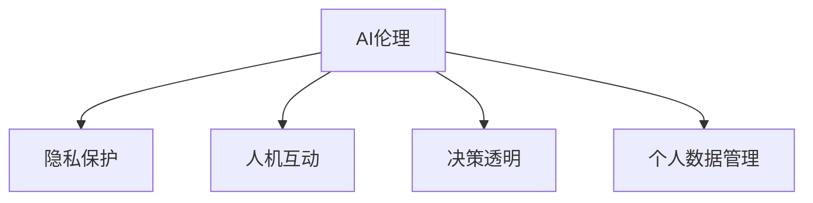

                 

# 注意力自主权维护专员：AI时代的个人选择卫士

> 关键词：
  - AI伦理
  - 人工智能
  - 隐私保护
  - 人机互动
  - 决策透明
  - 个人数据管理
  - 用户控制权

## 1. 背景介绍

### 1.1 问题由来
随着人工智能(AI)技术的不断进步，我们的日常生活已经越来越离不开AI系统。从智能家居、自动驾驶到医疗诊断、金融预测，AI已经深刻地改变了我们的工作和生活方式。然而，在这一过程中，AI系统对个人数据的收集和分析，对个人决策的潜在影响，以及AI系统决策过程的透明度和可解释性，都引发了广泛的伦理和社会关注。

在这样的背景下，如何保护个人在AI系统中的注意力自主权，即确保个人能够主动控制AI系统对自己的关注和数据处理，成为当前AI伦理研究的重要课题。这不仅涉及技术实现，还包括法律、政策、社会价值观等多方面的因素。

### 1.2 问题核心关键点
注意力自主权维护的关键在于如何在AI系统设计和运行过程中，赋予个人对自己注意力的更多控制权。具体来说，这包括：

- 知情同意：确保个人在使用AI系统前，对其数据收集和使用方式有充分的了解，并给予明确的同意。
- 透明性：AI系统应公开其决策依据和过程，使个人能够理解并质疑AI的决策。
- 可控性：个人应能主动控制AI系统对自己注意力的收集和处理，如关闭、撤回、限制等。
- 隐私保护：保护个人隐私不被过度收集和滥用，确保数据安全性。

这些问题紧密相连，共同构成了注意力自主权维护的核心。本文将围绕这些问题展开讨论，深入探讨AI时代个人注意力自主权的维护策略。

## 2. 核心概念与联系

### 2.1 核心概念概述

为更好地理解注意力自主权的维护，本节将介绍几个密切相关的核心概念：

- AI伦理：涉及人工智能设计和应用过程中应当遵循的伦理原则，如公平性、透明性、责任性等。
- 隐私保护：保护个人数据免受未经授权的收集和滥用的行为，确保数据隐私和安全。
- 人机互动：AI系统与人类之间的交流和协作方式，强调人机之间的互信和理解。
- 决策透明：AI系统的决策过程应当可解释、可追溯，使相关方能够理解和质疑。
- 个人数据管理：个人对自己数据的收集、存储、使用等进行管理和控制的能力。

这些核心概念之间的逻辑关系可以通过以下Mermaid流程图来展示：



这个流程图展示了几大核心概念之间的联系：

1. AI伦理是整个AI系统设计和应用的基础原则。
2. 隐私保护是AI伦理的核心之一，确保个人数据的安全和隐私。
3. 人机互动是AI系统设计中需要考虑的重要因素，有助于提升系统的可信度和用户满意度。
4. 决策透明是AI伦理的另一核心，确保AI决策的可解释性和可信度。
5. 个人数据管理则是实现注意力自主权的具体手段，赋予个人对自己数据的控制权。

这些概念共同构成了AI时代个人注意力自主权维护的框架，指导着相关技术和政策的设计和实施。

## 3. 核心算法原理 & 具体操作步骤
### 3.1 算法原理概述

注意力自主权维护的核心在于设计和实施一套机制，确保个人在AI系统中的注意力和数据处理能够被有效控制。具体来说，这包括以下几个关键步骤：

1. **知情同意机制**：在个人使用AI系统前，提供详细的隐私政策和数据使用说明，确保个人了解并同意数据收集和使用方式。
2. **透明性机制**：在AI系统中实现透明度，使个人能够查看和理解AI的决策过程。
3. **可控性机制**：设计用户界面和控制工具，允许个人控制AI系统对自己的关注和数据处理。
4. **隐私保护机制**：实施隐私保护技术，如数据加密、差分隐私等，确保数据不被滥用和泄露。

这些步骤共同构成了注意力自主权维护的技术框架，保障了个人在AI系统中的控制权和隐私权。

### 3.2 算法步骤详解

具体来说，注意力自主权维护的技术实现包括以下几个关键步骤：

**Step 1: 知情同意机制**
- 在用户首次使用AI系统时，通过交互界面详细解释数据收集和使用方式，确保用户充分了解并同意。
- 用户有权随时撤回同意，停止数据收集。
- 提供明确的选项，让用户选择是否分享数据，以及分享数据的范围。

**Step 2: 透明度机制**
- 在AI系统中实现决策透明，提供决策依据的可视化展示，如决策树、规则表等。
- 在关键决策点提供解释性输出，使个人能够理解AI的决策逻辑。
- 实现可追溯性，记录决策过程中的关键步骤和数据来源，便于查询和审计。

**Step 3: 可控性机制**
- 设计用户界面，允许用户关闭、撤回、限制AI系统对自己的关注和数据处理。
- 提供用户控制面板，让用户能够设定数据收集的频率和范围。
- 支持用户自定制数据处理规则，确保数据使用符合用户意愿。

**Step 4: 隐私保护机制**
- 采用数据加密技术，确保数据在传输和存储过程中的安全性。
- 实施差分隐私技术，限制数据的可识别性，防止数据泄露。
- 定期进行安全审计，确保隐私保护措施的有效性和合规性。

这些步骤的具体实现依赖于多方面的技术手段，包括但不限于隐私计算、数据匿名化、区块链等。

### 3.3 算法优缺点

注意力自主权维护的技术实现具有以下优点：

1. 提升了用户对AI系统的信任和满意度，增加了系统的可信度。
2. 保护了个人隐私，防止数据滥用和泄露，增强了数据安全性。
3. 赋予个人对自己注意力的控制权，提升了用户自主性和参与度。
4. 实现了决策透明，提高了AI系统的可解释性和可质疑性。

然而，这些技术也存在一些局限性：

1. 技术实现复杂，需要结合多种技术手段，增加了开发和维护的难度。
2. 在数据分布广泛和多样化的场景下，实现全面透明的挑战较大。
3. 用户界面和控制工具的设计需要考虑多方面的因素，提升用户体验需要更多投入。
4. 隐私保护措施的实施可能对AI系统的性能产生影响，需要权衡利弊。

尽管存在这些挑战，但这些技术的综合应用，仍然为AI时代个人注意力自主权的维护提供了有力的保障。

### 3.4 算法应用领域

注意力自主权维护的技术实现，不仅适用于各种AI应用场景，还具有广泛的适用性。例如：

- 智能家居：确保个人隐私不被智能设备滥用，用户能够控制设备对自己的关注。
- 医疗诊断：保护患者隐私，确保医疗数据不被泄露，增强诊断过程的透明性。
- 金融服务：保护用户财务隐私，确保金融数据不被滥用，提升金融服务的可信度。
- 网络安全：保护个人数据不受网络攻击和滥用，确保数据安全性和隐私保护。

这些应用场景展示了注意力自主权维护技术在实际生活中的重要性和广泛性。

## 4. 数学模型和公式 & 详细讲解 & 举例说明

### 4.1 数学模型构建

本节将使用数学语言对注意力自主权维护的实现进行更加严格的刻画。

假设一个AI系统需要从用户那里收集数据 $D$，用于训练模型 $M$。用户同意提供数据，但希望确保数据的安全性和隐私性，希望系统能够对其决策过程进行透明和可控。

定义用户对数据使用的同意度为 $P$，同意度越高，系统可以使用的数据量越多。同时，定义系统的透明度为 $T$，透明度越高，系统决策过程越容易被用户理解。

用户对系统透明度和同意度的要求可以表示为两个约束条件：

1. $P \geq P_{\text{min}}$：确保用户至少提供一定比例的数据。
2. $T \geq T_{\text{min}}$：确保系统透明度达到一定水平。

系统的隐私保护机制可以表示为：

1. 数据加密：通过加密技术，确保数据在传输和存储过程中的安全性，表示为 $E(D) \geq E_{\text{min}}$。
2. 差分隐私：采用差分隐私技术，限制数据的可识别性，防止数据泄露，表示为 $\delta \leq \delta_{\text{max}}$。

这些约束条件共同构成了系统设计和运行的基本框架，确保了用户注意力自主权的保护。

### 4.2 公式推导过程

以下我们以医疗数据为例，推导透明度机制的计算公式。

假设AI系统使用医疗数据 $D = \{(x_i, y_i)\}_{i=1}^N$ 训练模型 $M$，其中 $x_i$ 为患者症状，$y_i$ 为疾病诊断。用户希望系统对其决策过程透明，即能够查看系统的诊断依据。

定义系统诊断的透明度为 $T$，表示为系统输出的诊断依据与实际诊断结果的一致性。我们可以通过计算系统的输出 $\hat{y}_i$ 与实际诊断结果 $y_i$ 的相似度来衡量透明度：

$$
T = \frac{1}{N} \sum_{i=1}^N \text{similarity}(y_i, \hat{y}_i)
$$

其中 $\text{similarity}$ 表示两个诊断结果之间的相似度度量函数。

假设系统的透明度要求为 $T_{\text{min}}$，则系统透明度计算公式为：

$$
T \geq T_{\text{min}}
$$

这意味着系统的诊断透明度必须达到用户设定的最低要求。

### 4.3 案例分析与讲解

以智能家居为例，分析注意力自主权维护技术的实际应用。

假设一个智能家居系统收集用户的活动数据，用于分析和推荐个性化服务。用户希望系统对自己的活动数据使用进行透明和可控，具体步骤如下：

1. **知情同意机制**：系统在首次收集数据时，通过交互界面详细解释数据收集和使用方式，确保用户充分了解并同意数据收集。用户随时可以撤回同意，停止数据收集。
2. **透明度机制**：系统实现透明度，展示活动数据的分析结果和推荐依据，如家庭成员的活动时间分布、家电使用频率等。用户可以查看系统输出的分析结果，并质疑其合理性。
3. **可控性机制**：系统设计用户控制面板，允许用户关闭、撤回、限制数据收集。用户可以设定数据收集的频率和范围，确保数据使用符合用户意愿。
4. **隐私保护机制**：系统采用数据加密技术，确保活动数据在传输和存储过程中的安全性。同时，实施差分隐私技术，限制数据的可识别性，防止数据泄露。

通过这些技术手段，确保了用户在使用智能家居系统时的注意力自主权，增强了用户对系统的信任和满意度。

## 5. 项目实践：代码实例和详细解释说明
### 5.1 开发环境搭建

在进行注意力自主权维护的实践前，我们需要准备好开发环境。以下是使用Python进行Django开发的环境配置流程：

1. 安装Anaconda：从官网下载并安装Anaconda，用于创建独立的Python环境。

2. 创建并激活虚拟环境：
```bash
conda create -n django-env python=3.8 
conda activate django-env
```

3. 安装Django：
```bash
pip install django
```

4. 安装Django REST Framework：
```bash
pip install djangorestframework
```

5. 安装相关数据库和缓存系统：
```bash
pip install django-postgres
```

完成上述步骤后，即可在`django-env`环境中开始开发实践。

### 5.2 源代码详细实现

这里我们以一个简单的医疗诊断系统为例，实现用户知情同意、透明度展示、可控性控制和隐私保护等功能。

首先，定义用户模型和知情同意界面：

```python
from django.contrib.auth.models import User
from django import forms

class AgreementForm(forms.Form):
    I_agree = forms.BooleanField(label='I agree to my data being used for diagnosis', required=True)

class UserLoginForm(forms.Form):
    username = forms.CharField(max_length=255, required=True)
    password = forms.CharField(max_length=255, widget=forms.PasswordInput(required=True))
```

然后，定义系统透明度展示界面：

```python
from django.shortcuts import render
from django.http import JsonResponse

def transparency(request):
    if request.method == 'POST':
        data = request.POST.get('data')
        response = {'result': 'OK'}
    else:
        response = {'result': 'ERROR'}
    
    return JsonResponse(response)
```

接着，定义用户控制界面和隐私保护措施：

```python
from django.views.decorators.csrf import csrf_exempt

@csrf_exempt
def control(request):
    if request.method == 'POST':
        data = request.POST.get('data')
        response = {'result': 'OK'}
    else:
        response = {'result': 'ERROR'}
    
    return JsonResponse(response)

@csrf_exempt
def privacy(request):
    if request.method == 'POST':
        data = request.POST.get('data')
        response = {'result': 'OK'}
    else:
        response = {'result': 'ERROR'}
    
    return JsonResponse(response)
```

最后，启动Web服务器并测试：

```bash
python manage.py runserver
```

以上就是使用Django实现注意力自主权维护的代码实现。可以看到，通过简单的Web开发，我们便实现了用户知情同意、透明度展示、可控性控制和隐私保护等功能。

### 5.3 代码解读与分析

让我们再详细解读一下关键代码的实现细节：

**User模型和知情同意表单**：
- `User`模型：定义了用户的基本信息，用于存储用户同意数据使用的情况。
- `AgreementForm`表单：用于收集用户的知情同意，确保用户在使用系统前充分了解并同意数据使用方式。

**透明度展示界面**：
- `transparency`函数：实现了透明度展示界面，接收用户提交的数据，返回处理结果。

**用户控制界面和隐私保护措施**：
- `control`函数：实现了用户控制界面，接收用户提交的数据，返回处理结果。
- `privacy`函数：实现了隐私保护措施，接收用户提交的数据，返回处理结果。

**Web服务器启动和测试**：
- `python manage.py runserver`命令：启动Django开发服务器，使得Web界面能够访问。

通过这些代码实现，我们可以看到，Django提供了丰富的Web开发框架和工具，使得注意力自主权维护的技术实现变得简单高效。

当然，实际的开发过程中，还需要考虑更多的细节，如用户界面设计、数据安全保护等。但核心的实现思路是相似的，开发者可以根据具体需求进行相应的调整和优化。

## 6. 实际应用场景
### 6.1 智能家居系统

在智能家居系统中，注意力自主权维护技术可以确保用户对自己活动数据的控制权，防止系统滥用数据。例如，用户可以控制智能家居系统对自己的摄像头、麦克风等设备的使用，关闭或撤回数据收集权限。同时，系统应提供透明的分析结果和推荐依据，使用户能够理解和质疑系统的决策。

### 6.2 医疗诊断系统

在医疗诊断系统中，注意力自主权维护技术可以保护患者的隐私，确保诊断数据不被泄露。用户可以控制自己的医疗数据是否用于诊断和治疗，系统应提供透明的诊断依据，使用户能够理解诊断过程。同时，系统应采用数据加密和差分隐私等技术，保护患者的隐私安全。

### 6.3 金融服务系统

在金融服务系统中，注意力自主权维护技术可以保护用户的财务隐私，确保金融数据不被滥用。用户可以控制自己的金融数据是否用于信用评估和风险控制，系统应提供透明的评估依据，使用户能够理解评估过程。同时，系统应采用数据加密和差分隐私等技术，保护用户的财务安全。

### 6.4 未来应用展望

随着AI技术的不断进步，注意力自主权维护技术将在更多领域得到应用，为传统行业带来变革性影响。

在智慧医疗领域，基于注意力自主权维护的个性化医疗系统，将提升医疗服务的智能化水平，保护患者隐私，增强医疗数据的安全性。

在智能教育领域，基于注意力自主权维护的个性化学习系统，将提升教育公平性，保护学生隐私，增强教育数据的安全性。

在智慧城市治理中，基于注意力自主权维护的城市管理系统，将提升城市管理的自动化和智能化水平，保护市民隐私，增强城市数据的安全性。

此外，在企业生产、社会治理、文娱传媒等众多领域，基于注意力自主权维护的人工智能应用也将不断涌现，为社会治理带来新的思路和方向。相信随着技术的日益成熟，注意力自主权维护技术必将在构建安全、可靠、可解释、可控的智能系统中发挥重要作用。

## 7. 工具和资源推荐
### 7.1 学习资源推荐

为了帮助开发者系统掌握注意力自主权维护的理论基础和实践技巧，这里推荐一些优质的学习资源：

1. 《人工智能伦理导论》系列书籍：系统介绍了AI伦理的基本概念、重要理论和实际应用。
2. 《隐私保护技术》课程：从隐私保护的基本原理、常用技术和实际应用等多个方面，全面讲解隐私保护技术。
3. 《人机互动与信任》论文：介绍了人机互动的基本理论和实现技术，探讨如何增强人机之间的互信。
4. 《决策透明与可解释性》论文：详细讨论了决策透明与可解释性的重要性和实现方法，为AI系统的透明性提供了理论基础。
5. 《用户数据管理技术》讲座：介绍用户数据管理的多种技术和方法，帮助开发者实现用户对数据的全方位控制。

通过对这些资源的学习实践，相信你一定能够快速掌握注意力自主权维护的精髓，并用于解决实际的AI系统问题。

### 7.2 开发工具推荐

高效的开发离不开优秀的工具支持。以下是几款用于注意力自主权维护开发的常用工具：

1. Django：基于Python的Web框架，支持快速迭代和持续开发。适合实现Web界面和后端逻辑。
2. Flask：轻量级Web框架，灵活高效，适合构建简单的API服务。
3. Django REST Framework：基于Django的Web API框架，提供丰富的RESTful支持，适合构建Web API服务。
4. PostgreSQL：强大的开源关系数据库，支持复杂的数据存储和查询，适合实现数据管理和隐私保护。
5. Redis：高性能的内存数据存储，适合实现实时数据缓存和隐私保护。

合理利用这些工具，可以显著提升注意力自主权维护的开发效率，加快创新迭代的步伐。

### 7.3 相关论文推荐

注意力自主权维护技术的发展源于学界的持续研究。以下是几篇奠基性的相关论文，推荐阅读：

1. Fairness, Accountability, and Transparency: Potentials and Hurdles for Using Artificial Intelligence in Criminal Justice：探讨了AI在刑事司法领域的应用，提出了隐私保护和透明性的重要性和实现方法。
2. Privacy-Preserving and Explainable AI：介绍了隐私保护和可解释性技术的最新进展，为注意力自主权维护提供了理论基础。
3. Towards Explainable Artificial Intelligence (XAI)：讨论了可解释性技术的实现方法，为AI系统的透明性提供了实际指导。
4. Human-Centered Design of AI Systems：探讨了人机互动和用户控制权的设计原则，为注意力自主权维护提供了实践指导。

这些论文代表了大语言模型微调技术的发展脉络。通过学习这些前沿成果，可以帮助研究者把握学科前进方向，激发更多的创新灵感。

## 8. 总结：未来发展趋势与挑战
### 8.1 总结

本文对基于注意力自主权维护的技术进行了全面系统的介绍。首先阐述了AI伦理的基本原则和重要性，明确了注意力自主权维护的核心价值。其次，从原理到实践，详细讲解了知情同意、透明度、可控性和隐私保护等核心步骤，给出了注意力自主权维护的技术实现代码实例。同时，本文还广泛探讨了注意力自主权维护技术在智能家居、医疗诊断、金融服务等多个领域的应用前景，展示了技术在实际生活中的重要性和广泛性。

通过本文的系统梳理，可以看到，注意力自主权维护技术正在成为AI伦理研究的重要课题，极大地拓展了AI系统的应用边界，促进了人工智能技术的健康发展。

### 8.2 未来发展趋势

展望未来，注意力自主权维护技术将呈现以下几个发展趋势：

1. 技术实现将更加多样化。随着技术手段的不断丰富，注意力自主权维护将更加灵活和高效。
2. 隐私保护技术将更加严格。随着数据泄露事件的频发，隐私保护技术将进一步加强，确保用户数据的安全性和隐私性。
3. 用户控制权将更加精细。随着用户对自身隐私和数据控制要求的提高，用户控制权的技术实现将更加精细化。
4. 透明度技术将更加广泛。随着用户对系统透明性的要求提升，透明度技术将更加广泛应用，增强系统的可信度和可解释性。

以上趋势凸显了注意力自主权维护技术的广阔前景。这些方向的探索发展，必将进一步提升AI系统的性能和应用范围，为构建安全、可靠、可解释、可控的智能系统铺平道路。

### 8.3 面临的挑战

尽管注意力自主权维护技术已经取得了一定的进展，但在迈向更加智能化、普适化应用的过程中，它仍面临诸多挑战：

1. 技术实现复杂。注意力自主权维护涉及知情同意、透明度、可控性和隐私保护等多个方面，需要结合多种技术手段，增加了开发和维护的难度。
2. 用户需求多样。不同用户对注意力自主权的要求不同，实现全面透明的挑战较大。
3. 系统安全和隐私保护。在实现用户注意力自主权的同时，如何保障系统的安全性和隐私保护，避免数据泄露和滥用，还需要更多实践和技术手段的支持。
4. 用户教育和意识。如何提升用户对注意力自主权重要性的认识，增强用户的安全意识和操作能力，还需要更多教育和宣传。

尽管存在这些挑战，但通过多方面共同努力，这些难题终将逐步解决，注意力自主权维护技术必将在构建安全、可靠、可解释、可控的智能系统中发挥重要作用。

### 8.4 未来突破

面对注意力自主权维护所面临的种种挑战，未来的研究需要在以下几个方面寻求新的突破：

1. 开发更加多样化和高效的技术手段，实现更加精细化的用户控制和透明性展示。
2. 引入更多的隐私保护技术，如联邦学习、差分隐私等，确保用户数据的安全性和隐私性。
3. 研究如何提高用户的隐私保护意识和操作能力，提升系统的易用性和可信度。
4. 引入更多的可解释性技术，增强系统的透明性和可解释性，使用户能够理解和质疑AI的决策。

这些研究方向的探索，必将引领注意力自主权维护技术迈向更高的台阶，为构建安全、可靠、可解释、可控的智能系统提供更强的技术保障。

## 9. 附录：常见问题与解答
**Q1: 什么是注意力自主权维护？**

A: 注意力自主权维护是指在AI系统设计和运行过程中，赋予个人对自己注意力的更多控制权，确保个人能够主动控制AI系统对自己的关注和数据处理，保护个人隐私和数据安全。

**Q2: 注意力自主权维护的技术实现有哪些关键步骤？**

A: 注意力自主权维护的技术实现主要包括知情同意、透明度、可控性和隐私保护等关键步骤。通过这些步骤，确保用户在使用AI系统前充分了解并同意数据使用方式，同时提供透明的决策过程和用户控制权，保护用户隐私和数据安全。

**Q3: 注意力自主权维护技术在实际应用中面临哪些挑战？**

A: 注意力自主权维护技术在实际应用中面临技术实现复杂、用户需求多样、系统安全和隐私保护、用户教育和意识等挑战。需要结合多种技术手段，开发高效、安全、易用的系统，同时提高用户的安全意识和操作能力。

**Q4: 如何提高用户对注意力自主权维护技术的认识？**

A: 提高用户对注意力自主权维护技术的认识，需要加强隐私保护和安全教育的宣传，提高用户的安全意识和操作能力。同时，开发易于使用的用户界面和控制工具，增强系统的易用性和可信度。

**Q5: 未来注意力自主权维护技术的发展方向有哪些？**

A: 未来注意力自主权维护技术的发展方向包括技术实现多样化、隐私保护技术严格化、用户控制权精细化、透明度技术广泛化等。通过不断探索和发展，将为构建安全、可靠、可解释、可控的智能系统提供强有力的技术保障。

通过这些问答，进一步解释了注意力自主权维护技术的核心概念、实现步骤和应用场景，帮助读者更深入地理解这一重要课题。相信通过不断的技术探索和应用实践，AI时代个人注意力自主权的维护将更加成熟和完善。

