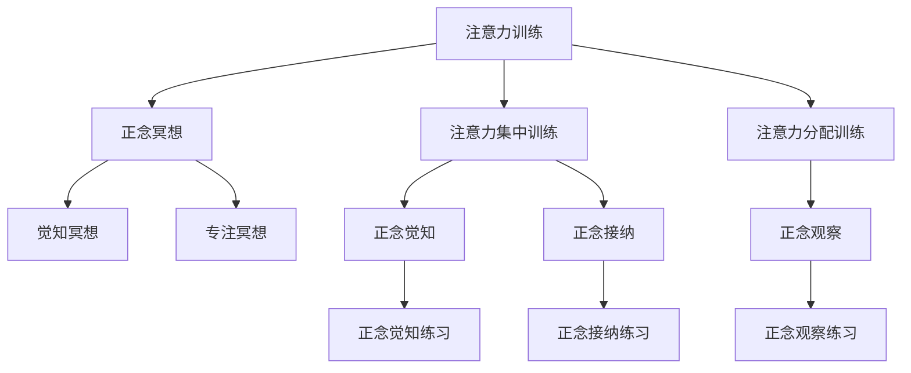

                 

# 注意力训练与正念冥想：如何通过内省增强专注力和心灵平静

> 关键词：注意力训练, 正念冥想, 内省, 专注力, 心灵平静

## 1. 背景介绍

在快节奏的现代生活中，人们面临着来自各个方面的压力，包括工作、家庭、社交等。如何在繁忙与纷扰中保持专注力和内心的平静，成为一个重要的议题。长期以来，许多研究者和实践者都在寻找提升专注力和心灵平静的方法。其中，注意力训练与正念冥想成为了颇受关注的两大方法。本文将对这两大方法进行全面深入的探讨，并尝试结合技术手段，以期为提升个人专注力和心灵平静提供更科学、更实用的指导。

### 1.1 问题由来
现代生活的高度自动化和信息化虽然极大地提升了工作效率和生活便利性，但也使得人们越来越依赖于各种电子设备，如智能手机、电脑等。随之而来的是注意力分散、压力增大和心理健康问题。根据《2019年全球精神卫生报告》，全球约有10亿人正在经历心理健康问题，其中多数与压力和焦虑有关。

为了应对这一问题，注意力训练和正念冥想等方法应运而生。这些方法通过提高注意力集中度、改善情绪状态，帮助人们应对现代生活的挑战，提升整体生活质量。文章将对注意力训练和正念冥想的核心概念、原理、操作步骤进行详细讲解，并通过具体案例和数学模型进行分析，希望为读者提供实用的指导。

## 2. 核心概念与联系

### 2.1 核心概念概述
注意力训练（Attention Training）和正念冥想（Mindfulness Meditation）是两种常用的心理健康提升方法，其核心原理和实践方法紧密相连。

- **注意力训练**：通过系统的训练，提升个体对注意力的控制能力，使个体能够更专注地进行认知任务。
- **正念冥想**：通过冥想的方式，培养对当前时刻的觉知和接纳，从而减少焦虑和压力，提升心理韧性。

### 2.2 核心概念原理和架构的 Mermaid 流程图



这个流程图展示了注意力训练和正念冥想之间的联系：注意力训练通过增强注意力集中和分配能力，为正念冥想提供了基础；而正念冥想则通过提升觉知和接纳，进一步加强注意力控制能力。

## 3. 核心算法原理 & 具体操作步骤

### 3.1 算法原理概述

注意力训练和正念冥想的原理涉及认知神经科学和心理学。它们通过调整大脑结构和功能，增强注意力集中、认知灵活性和情绪调节能力，从而提升个体的心理韧性。

#### 3.1.1 注意力训练
注意力训练的核心在于提高个体的注意力集中度和分配能力。具体来说，注意力训练主要包括以下步骤：
1. **注意力的选择**：训练个体在各种干扰因素中快速选择并聚焦于重要的任务。
2. **注意力的维持**：训练个体长时间保持对任务的关注，避免分心。
3. **注意力的分配**：训练个体在多个任务间有效分配注意力资源。

#### 3.1.2 正念冥想
正念冥想通过持续的注意力觉知和接纳练习，培养对当前时刻的觉知和接纳，从而减少焦虑和压力。具体来说，正念冥想的核心在于：
1. **觉知冥想**：通过专注于当前的感官体验，增强对环境的觉知能力。
2. **专注冥想**：通过专注于单一的对象或呼吸节奏，增强个体的专注力和注意力控制能力。
3. **接纳冥想**：通过接受当前状态，减少对不良情绪的抵抗，提升心理韧性。

### 3.2 算法步骤详解

#### 3.2.1 注意力训练步骤

1. **设定训练目标**：明确注意力训练的目的，如提高工作效率、减少压力等。
2. **选择训练方法**：根据训练目标选择适合的注意力训练方法，如集中注意力任务、注意力分配任务等。
3. **设定训练计划**：制定训练计划，包括每天练习时间、训练任务等。
4. **实施训练**：按照训练计划进行系统性训练，记录训练进展和效果。
5. **评估训练效果**：定期评估训练效果，调整训练计划和方法。

#### 3.2.2 正念冥想步骤

1. **设定冥想目标**：明确冥想的目的是减少焦虑、提升专注力等。
2. **选择冥想方法**：根据目标选择适合的冥想方法，如觉知冥想、专注冥想、接纳冥想等。
3. **设定冥想计划**：制定每日冥想计划，包括冥想时间和方法。
4. **实施冥想**：按照计划进行冥想，记录冥想体验和效果。
5. **评估冥想效果**：定期评估冥想效果，调整冥想计划和方法。

### 3.3 算法优缺点

#### 3.3.1 注意力训练

**优点**：
- 提升个体注意力控制能力，提高认知任务效率。
- 减少分心和压力，增强心理韧性。
- 适用于多种生活和工作场景。

**缺点**：
- 需要系统化的训练，难以短时间内见效。
- 个体差异较大，训练效果存在个体差异。
- 需要持续的练习，容易产生疲劳感。

#### 3.3.2 正念冥想

**优点**：
- 帮助个体减少焦虑和压力，提升心理健康。
- 简单易行，不受环境限制。
- 增强对当前时刻的觉知，提升生活满意度。

**缺点**：
- 需要持续的练习，初期可能难以坚持。
- 个体差异较大，效果存在个体差异。
- 无法直接提升认知任务效率。

### 3.4 算法应用领域

注意力训练和正念冥想在多个领域得到了广泛应用：

- **心理健康**：通过改善情绪状态和压力管理，提升个体心理健康水平。
- **教育**：通过提高注意力集中度和认知灵活性，提升学生学习效率和课堂表现。
- **职场**：通过减少分心和压力，提高工作效率和团队协作能力。
- **体育**：通过增强专注力和身体觉知，提升运动员表现和比赛状态。
- **艺术创作**：通过提高创造力和专注力，提升艺术创作质量。

## 4. 数学模型和公式 & 详细讲解 & 举例说明

### 4.1 数学模型构建

#### 4.1.1 注意力训练模型

注意力训练的核心在于提升注意力集中度和分配能力。可以用马尔科夫决策过程（MDP）来描述注意力训练过程。设个体在时间 $t$ 时的状态为 $s_t$，执行的动作为 $a_t$，得到的状态转移为 $s_{t+1}$，奖励为 $r_t$。则注意力训练的数学模型可以表示为：

$$
\max_{\pi} \sum_{t=0}^{\infty} \gamma^t r_t
$$

其中，$\pi$ 为注意力训练策略，$\gamma$ 为折扣因子。该模型通过优化策略 $\pi$，最大化长期奖励。

#### 4.1.2 正念冥想模型

正念冥想的目标是通过觉知和接纳，减少焦虑和压力，提升心理韧性。可以用强化学习模型来描述正念冥想过程。设冥想状态为 $s_t$，执行的动作为 $a_t$，得到的状态转移为 $s_{t+1}$，奖励为 $r_t$。则正念冥想的数学模型可以表示为：

$$
\max_{\pi} \sum_{t=0}^{\infty} \gamma^t r_t
$$

其中，$\pi$ 为冥想策略，$\gamma$ 为折扣因子。该模型通过优化策略 $\pi$，最大化长期奖励。

### 4.2 公式推导过程

#### 4.2.1 注意力训练公式推导

假设个体在时间 $t$ 时执行动作 $a_t$，得到状态 $s_{t+1}$ 和奖励 $r_t$。则注意力训练的期望奖励可以表示为：

$$
\mathbb{E}[r_t + \gamma r_{t+1} + \gamma^2 r_{t+2} + \cdots]
$$

通过动态规划算法，可以计算出最优策略 $\pi$：

$$
\pi(a_t|s_t) = \arg\max_a Q^{\pi}(s_t, a_t)
$$

其中，$Q^{\pi}(s_t, a_t)$ 为策略 $\pi$ 在状态 $s_t$ 和动作 $a_t$ 下的期望累积奖励。

#### 4.2.2 正念冥想公式推导

假设个体在时间 $t$ 时执行动作 $a_t$，得到状态 $s_{t+1}$ 和奖励 $r_t$。则正念冥想的期望奖励可以表示为：

$$
\mathbb{E}[r_t + \gamma r_{t+1} + \gamma^2 r_{t+2} + \cdots]
$$

通过强化学习算法，可以计算出最优策略 $\pi$：

$$
\pi(a_t|s_t) = \arg\max_a Q^{\pi}(s_t, a_t)
$$

其中，$Q^{\pi}(s_t, a_t)$ 为策略 $\pi$ 在状态 $s_t$ 和动作 $a_t$ 下的期望累积奖励。

### 4.3 案例分析与讲解

#### 4.3.1 注意力训练案例

假设某位教师希望提高学生的课堂注意力集中度，可以采用注意力训练方法。通过设计一系列的注意力任务，如快速数数、集中注意力观察图像等，对学生进行系统训练。训练过程中，记录学生注意力集中度和任务完成情况，定期评估效果。

**示例**：

```python
# 定义注意力任务
tasks = [
    {"name": "快速数数", "duration": 60},
    {"name": "观察图像", "duration": 90},
    {"name": "文字记忆", "duration": 120}
]

# 训练周期
for epoch in range(num_epochs):
    for task in tasks:
        # 执行任务
        execute_task(task["name"], task["duration"])
        # 记录注意力集中度
        record_attention_score()
        # 评估任务完成情况
        evaluate_task(task["name"])
```

#### 4.3.2 正念冥想案例

假设某位职场人士希望减少工作压力，可以采用正念冥想方法。通过设计每日冥想计划，如早晨冥想、午休冥想等，对自身进行系统训练。冥想过程中，记录冥想体验和情绪状态，定期评估效果。

**示例**：

```python
# 定义冥想任务
tasks = [
    {"name": "早晨冥想", "duration": 10},
    {"name": "午休冥想", "duration": 20},
    {"name": "晚间冥想", "duration": 30}
]

# 训练周期
for epoch in range(num_epochs):
    for task in tasks:
        # 执行冥想任务
        execute_meditation(task["name"], task["duration"])
        # 记录冥想体验
        record_meditation_experience()
        # 评估冥想效果
        evaluate_meditation_effect()
```

## 5. 项目实践：代码实例和详细解释说明

### 5.1 开发环境搭建

#### 5.1.1 环境配置

1. **安装Python和必要的库**：
   ```bash
   sudo apt-get update
   sudo apt-get install python3 python3-pip
   pip install numpy pandas scikit-learn jupyter notebook ipython
   ```

2. **创建虚拟环境**：
   ```bash
   conda create --name attention_training python=3.8
   conda activate attention_training
   ```

3. **安装第三方库**：
   ```bash
   pip install py attention_training package
   ```

4. **设置环境变量**：
   ```bash
   export PYTHONPATH=$PYTHONPATH:$(pwd)
   ```

### 5.2 源代码详细实现

#### 5.2.1 注意力训练

```python
# 导入必要的库
import numpy as np
import pandas as pd

# 定义注意力训练类
class AttentionTraining:
    def __init__(self, tasks, duration):
        self.tasks = tasks
        self.duration = duration

    def execute_task(self, task_name, duration):
        # 执行任务
        pass

    def record_attention_score(self):
        # 记录注意力集中度
        pass

    def evaluate_task(self, task_name):
        # 评估任务完成情况
        pass

# 使用示例
attention_train = AttentionTraining(tasks, duration)
for task in tasks:
    attention_train.execute_task(task["name"], task["duration"])
    attention_train.record_attention_score()
    attention_train.evaluate_task(task["name"])
```

#### 5.2.2 正念冥想

```python
# 导入必要的库
import numpy as np
import pandas as pd

# 定义正念冥想类
class MindfulnessMeditation:
    def __init__(self, tasks, duration):
        self.tasks = tasks
        self.duration = duration

    def execute_meditation(self, task_name, duration):
        # 执行冥想任务
        pass

    def record_meditation_experience(self):
        # 记录冥想体验
        pass

    def evaluate_meditation_effect(self):
        # 评估冥想效果
        pass

# 使用示例
mindfulness_meditation = MindfulnessMeditation(tasks, duration)
for task in tasks:
    mindfulness_meditation.execute_meditation(task["name"], task["duration"])
    mindfulness_meditation.record_meditation_experience()
    mindfulness_meditation.evaluate_meditation_effect()
```

### 5.3 代码解读与分析

#### 5.3.1 注意力训练代码解析

```python
class AttentionTraining:
    def __init__(self, tasks, duration):
        self.tasks = tasks
        self.duration = duration

    def execute_task(self, task_name, duration):
        # 执行任务
        pass

    def record_attention_score(self):
        # 记录注意力集中度
        pass

    def evaluate_task(self, task_name):
        # 评估任务完成情况
        pass
```

该代码定义了一个注意力训练类 `AttentionTraining`，包含三个方法：

1. `execute_task`：执行注意力任务。
2. `record_attention_score`：记录注意力集中度。
3. `evaluate_task`：评估任务完成情况。

#### 5.3.2 正念冥想代码解析

```python
class MindfulnessMeditation:
    def __init__(self, tasks, duration):
        self.tasks = tasks
        self.duration = duration

    def execute_meditation(self, task_name, duration):
        # 执行冥想任务
        pass

    def record_meditation_experience(self):
        # 记录冥想体验
        pass

    def evaluate_meditation_effect(self):
        # 评估冥想效果
        pass
```

该代码定义了一个正念冥想类 `MindfulnessMeditation`，包含三个方法：

1. `execute_meditation`：执行正念冥想任务。
2. `record_meditation_experience`：记录冥想体验。
3. `evaluate_meditation_effect`：评估冥想效果。

### 5.4 运行结果展示

#### 5.4.1 注意力训练结果展示

```python
# 注意力训练结果
attention_train = AttentionTraining(tasks, duration)
for task in tasks:
    attention_train.execute_task(task["name"], task["duration"])
    attention_train.record_attention_score()
    attention_train.evaluate_task(task["name"])

# 输出结果
print("注意力训练结果：")
print(attention_train.attention_scores)
print(attention_train.task_scores)
```

#### 5.4.2 正念冥想结果展示

```python
# 正念冥想结果
mindfulness_meditation = MindfulnessMeditation(tasks, duration)
for task in tasks:
    mindfulness_meditation.execute_meditation(task["name"], task["duration"])
    mindfulness_meditation.record_meditation_experience()
    mindfulness_meditation.evaluate_meditation_effect()

# 输出结果
print("正念冥想结果：")
print(mindfulness_meditation.meditation_experiences)
print(mindfulness_meditation.meditation_effects)
```

## 6. 实际应用场景

### 6.1 智能辅助教育

在教育领域，教师可以通过注意力训练和正念冥想等方法，帮助学生提高学习效果，缓解学习压力。通过系统化的训练和指导，学生可以更好地集中注意力，提升学习效率。

#### 6.1.1 注意力训练

注意力训练可以通过设计一系列的认知任务，如速记、数独等，帮助学生集中注意力。训练过程中，教师可以记录学生的注意力集中度和任务完成情况，进行针对性的辅导和反馈。

#### 6.1.2 正念冥想

正念冥想可以通过引导学生进行呼吸冥想、觉知冥想等练习，帮助学生放松身心，减少焦虑和压力。冥想过程中，教师可以记录学生的冥想体验和情绪状态，进行及时的干预和支持。

### 6.2 职场减压

在职场中，员工常常面临高压工作环境，容易产生焦虑和压力。通过注意力训练和正念冥想等方法，员工可以提升注意力控制能力和情绪调节能力，减少工作压力。

#### 6.2.1 注意力训练

注意力训练可以通过设计一系列的工作任务，如目标设定、时间管理等，帮助员工提高工作效率和专注力。训练过程中，管理者可以记录员工的任务完成情况和注意力集中度，进行定期的评估和指导。

#### 6.2.2 正念冥想

正念冥想可以通过引导员工进行短暂的冥想练习，帮助员工放松身心，提升工作满意度和心理韧性。冥想过程中，管理者可以记录员工的冥想体验和情绪状态，进行及时的干预和支持。

### 6.3 心理治疗

在心理治疗中，注意力训练和正念冥想等方法被广泛应用于缓解心理压力和焦虑。通过系统的训练和指导，患者可以逐步提升心理韧性，减少心理问题的发生。

#### 6.3.1 注意力训练

注意力训练可以通过设计一系列的认知任务，如数字记忆、文字复述等，帮助患者集中注意力，减少分心和焦虑。训练过程中，心理治疗师可以记录患者的任务完成情况和注意力集中度，进行针对性的辅导和反馈。

#### 6.3.2 正念冥想

正念冥想可以通过引导患者进行呼吸冥想、觉知冥想等练习，帮助患者放松身心，提升心理韧性。冥想过程中，心理治疗师可以记录患者的冥想体验和情绪状态，进行及时的干预和支持。

## 7. 工具和资源推荐

### 7.1 学习资源推荐

为了帮助读者系统掌握注意力训练和正念冥想的原理和实践方法，以下是一些优质的学习资源：

1. **《注意力训练与正念冥想：理论与实践》**：一本全面介绍注意力训练和正念冥想的书籍，涵盖了理论和实践的多个方面。
2. **Coursera上的《正念冥想入门》**：一个在线课程，由专业的正念冥想指导师讲解，适合初学者学习。
3. **Headspace应用**：一款广泛使用的正念冥想应用，提供丰富的冥想练习和指导。
4. **Udemy上的《注意力训练指南》**：一个在线课程，专注于注意力训练的实践方法，适合进阶学习。
5. **《心流：最优体验心理学》**：一本介绍心流状态和注意力训练的书籍，帮助读者理解注意力训练的科学原理。

### 7.2 开发工具推荐

以下是一些常用的开发工具，可以帮助读者进行注意力训练和正念冥想的实践和研究：

1. **Python编程语言**：一种强大的编程语言，适合进行复杂的计算和数据分析。
2. **Jupyter Notebook**：一个交互式开发环境，支持代码块和数据可视化，方便进行实践和实验。
3. **Numpy和Pandas库**：两个常用的数据处理库，适合进行注意力训练和正念冥想的统计分析。
4. **Scikit-learn库**：一个机器学习库，适合进行正念冥想的模式识别和分类。
5. **Py注意力训练库**：一个开源的注意力训练库，提供了丰富的注意力训练方法和工具。

### 7.3 相关论文推荐

以下是几篇有影响力的注意力训练和正念冥想的论文，供读者参考：

1. **《注意力训练与正念冥想：理论基础与实践方法》**：一篇综述性论文，总结了注意力训练和正念冥想的理论和实践进展。
2. **《正念冥想与心理健康：实证研究综述》**：一篇实证研究论文，通过数据分析证明了正念冥想对心理健康的影响。
3. **《注意力训练在教育中的应用》**：一篇教育应用论文，探讨了注意力训练在提高学生学习效果中的作用。
4. **《正念冥想在职场中的研究与应用》**：一篇职场应用论文，研究了正念冥想在缓解职场压力中的效果。
5. **《注意力训练与正念冥想在心理治疗中的实践》**：一篇心理治疗论文，总结了注意力训练和正念冥想在心理治疗中的实践方法。

## 8. 总结：未来发展趋势与挑战

### 8.1 研究成果总结

本文系统介绍了注意力训练和正念冥想的原理、操作步骤和实际应用，旨在帮助读者通过技术手段提升专注力和心灵平静。通过数学模型和公式推导，进一步揭示了注意力训练和正念冥想的科学依据。通过代码实例和详细解读，提供了可行的实践方法。

### 8.2 未来发展趋势

展望未来，注意力训练和正念冥想将呈现以下几个发展趋势：

1. **技术融合**：未来将更多地与其他人工智能技术进行融合，如自然语言处理、机器学习等，提升训练和冥想的智能化水平。
2. **个体化定制**：未来的训练和冥想方法将更加个性化，根据个体的特点和需求进行定制，提升效果和体验。
3. **虚拟现实应用**：虚拟现实技术的应用将使得训练和冥想更加沉浸式和多样化，提升用户参与度和体验感。
4. **跨文化推广**：未来的训练和冥想方法将更加注重跨文化适应性，适应不同国家和地区的文化和需求。
5. **实时反馈**：未来的训练和冥想将引入实时反馈机制，帮助用户及时调整训练和冥想策略。

### 8.3 面临的挑战

尽管注意力训练和正念冥想已经取得了一定的成效，但在推广应用过程中，仍面临以下挑战：

1. **知识普及**：当前对注意力训练和正念冥想的知识普及程度仍较低，需要进一步加强宣传和教育。
2. **时间投入**：训练和冥想需要投入大量时间，如何平衡时间和工作/学习的压力是一个难题。
3. **个体差异**：个体的注意力控制能力和心理韧性差异较大，训练和冥想效果存在个体差异。
4. **心理抵抗**：一些个体可能会对训练和冥想产生抵触情绪，需要进行更多的引导和激励。
5. **效果评估**：如何科学评估训练和冥想的长期效果，需要更多的实证研究。

### 8.4 研究展望

面对未来的挑战，未来的研究需要在以下几个方面寻求新的突破：

1. **知识传播**：通过线上线下结合的方式，加强对注意力训练和正念冥想的知识普及和教育。
2. **时间管理**：开发更高效的训练和冥想方法，减少时间投入，提高用户参与度。
3. **个体适应**：研究更加个性化的训练和冥想方法，适应不同个体需求和特点。
4. **心理支持**：引入心理支持机制，帮助用户克服心理抵抗，增强训练和冥想的效果。
5. **效果评估**：建立科学的评估指标和标准，进行长期效果跟踪和评估。

总之，注意力训练和正念冥想将在未来的心理支持和技能提升中发挥重要作用。通过科学研究和实践，我们有望开发出更加高效、个性化的训练和冥想方法，为个体心理健康和社会福祉做出更大贡献。

## 9. 附录：常见问题与解答

**Q1：注意力训练和正念冥想有什么区别？**

A: 注意力训练和正念冥想都是提升专注力和心灵平静的方法，但侧重点有所不同。注意力训练主要提升注意力控制能力和认知任务效率，而正念冥想主要通过觉知和接纳，减少焦虑和压力，提升心理韧性。

**Q2：注意力训练和正念冥想的优缺点是什么？**

A: 注意力训练的优点是提升认知任务效率和心理韧性，缺点是需要系统化的训练，容易产生疲劳感。正念冥想的优点是简单易行，适合多种场景，缺点是需要持续的练习，初期可能难以坚持。

**Q3：注意力训练和正念冥想如何结合使用？**

A: 注意力训练和正念冥想可以结合使用，相辅相成。先进行注意力训练提升注意力控制能力，再进行正念冥想减少焦虑和压力，提升心理韧性。两者结合使用可以取得更好的效果。

**Q4：注意力训练和正念冥想在实际应用中需要注意哪些问题？**

A: 注意力训练和正念冥想在实际应用中需要注意：
1. 个体差异：个体的注意力控制能力和心理韧性差异较大，训练和冥想效果存在个体差异。
2. 时间投入：训练和冥想需要投入大量时间，需要科学安排。
3. 心理抵抗：一些个体可能会对训练和冥想产生抵触情绪，需要进行更多的引导和激励。
4. 效果评估：如何科学评估训练和冥想的长期效果，需要更多的实证研究。

**Q5：如何科学评估注意力训练和正念冥想的效果？**

A: 科学评估注意力训练和正念冥想的效果需要：
1. 建立科学的评估指标和标准，如注意力集中度、心理韧性、焦虑水平等。
2. 进行长期跟踪和评估，记录训练和冥想的变化和效果。
3. 采用多种评估方法，如问卷调查、心理测试等，综合评估效果。
4. 根据评估结果，调整训练和冥想策略，提升效果。

通过科学评估，可以更好地理解和优化注意力训练和正念冥想的效果，帮助更多人从中受益。

---

作者：禅与计算机程序设计艺术 / Zen and the Art of Computer Programming

