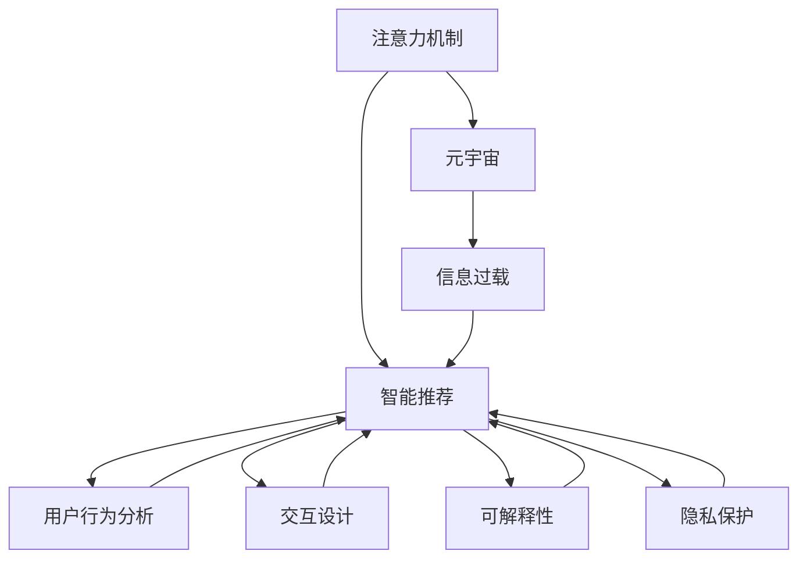

                 

# 注意力过滤器:元宇宙信息过载的智能应对

> 关键词：注意力机制,元宇宙,信息过载,智能推荐,用户行为分析,交互设计,可解释性,隐私保护

## 1. 背景介绍

### 1.1 问题由来
随着技术的不断进步，元宇宙概念的日益火热，人们的日常生活、工作和学习方式正在逐步向虚拟化、数字化和社交化方向转变。虚拟现实(VR)、增强现实(AR)、混合现实(MR)等技术的融合，构建了一个全时、全地、全人的交互场景。然而，海量信息的过载使得元宇宙环境下的用户难以承受信息负荷，容易陷入“认知负荷”状态，降低用户体验和效率。

元宇宙信息过载的问题已经引起了广泛的关注，尤其是在大规模用户活跃的虚拟社区、在线教育平台、社交媒体和游戏平台中，这个问题尤为突出。如何通过智能技术，帮助用户过滤无用信息，聚焦关键内容，成为亟待解决的问题。

### 1.2 问题核心关键点
元宇宙信息过载的核心在于如何智能识别并过滤无关信息，减少用户的认知负荷。为此，需要从以下几个方面进行优化：
1. **用户行为分析**：理解用户的兴趣和需求，实时推荐相关内容。
2. **内容质量评估**：智能过滤内容，确保推荐内容的质量和相关性。
3. **交互设计**：设计简洁高效的用户界面，减少用户操作复杂度。
4. **隐私保护**：保证用户隐私不受侵犯，避免过度追踪和数据滥用。
5. **可解释性**：提供推荐内容的解释理由，增强用户信任和满意度。

### 1.3 问题研究意义
解决元宇宙信息过载问题，对于提升用户体验、优化资源利用、保障用户隐私具有重要意义：

1. **提升用户体验**：通过智能推荐系统，减轻用户的信息负担，提高用户的使用乐趣和满意度。
2. **优化资源利用**：智能推荐能够提高内容的曝光率和参与度，最大化资源利用效率。
3. **保障用户隐私**：在推荐过程中保护用户数据隐私，防止信息滥用和数据泄露。
4. **增强可解释性**：提供透明的推荐理由，增强用户对系统的信任和满意度。

元宇宙信息过载的智能应对，不仅能够提升用户对元宇宙环境的适应性，还能推动元宇宙生态的良性发展，促进社会的数字化转型。

## 2. 核心概念与联系

### 2.1 核心概念概述

为更好地理解元宇宙信息过载的智能应对方法，本节将介绍几个密切相关的核心概念：

- **注意力机制**：基于Transformer模型的注意力机制，使得模型能够动态聚焦关键信息，忽略无关细节。
- **元宇宙**：由虚拟现实(VR)、增强现实(AR)、混合现实(MR)等技术构建的虚拟世界，强调沉浸式体验和社交互动。
- **信息过载**：用户在接收信息时，由于信息量过大或内容无关，导致无法有效处理，造成认知负担的现象。
- **智能推荐**：通过分析用户行为、偏好等数据，智能预测用户需求，实时推送相关内容。
- **用户行为分析**：通过追踪和分析用户操作行为，了解用户兴趣和需求，实现个性化推荐。
- **交互设计**：设计简洁直观的用户界面和交互流程，减少用户操作复杂度，提升用户体验。
- **可解释性**：提供推荐系统的决策依据，使用户能够理解推荐逻辑，增加系统透明度。
- **隐私保护**：在推荐过程中，严格控制用户数据的收集和使用，确保用户隐私不受侵犯。

这些核心概念之间的逻辑关系可以通过以下Mermaid流程图来展示：



这个流程图展示了几者之间的关系：

1. 注意力机制是元宇宙中的重要信息处理技术，用于帮助用户聚焦关键信息。
2. 信息过载是元宇宙中需要解决的主要问题，智能推荐能够减轻信息过载。
3. 用户行为分析和智能推荐紧密相连，通过分析用户行为，优化推荐效果。
4. 交互设计和智能推荐相互促进，简化用户操作，提升推荐效率。
5. 可解释性是提升用户信任的关键，通过提供推荐依据，增强系统透明度。
6. 隐私保护是推荐系统的基础，保障用户数据安全。

这些概念共同构成了元宇宙信息过载智能应对的核心框架，使其能够在各种场景下发挥作用。

## 3. 核心算法原理 & 具体操作步骤

### 3.1 算法原理概述

基于注意力机制的元宇宙信息过载智能应对方法，核心思想是：通过构建多层次、多维度的注意力模型，动态识别并聚焦用户感兴趣的内容，同时过滤无关信息，减轻用户的认知负荷。

具体而言，算法包括以下几个步骤：

1. **数据预处理**：收集元宇宙环境中的用户行为数据和内容数据，进行清洗、标注和归一化处理。
2. **用户画像构建**：利用机器学习算法，分析用户行为数据，构建用户画像，了解用户的兴趣和需求。
3. **注意力模型训练**：基于注意力机制，训练多层次、多维度的注意力模型，学习如何从海量信息中聚焦关键内容。
4. **智能推荐**：将注意力模型应用于内容推荐，动态调整推荐内容，提升用户体验。
5. **交互优化**：根据用户反馈，优化推荐界面和交互流程，增强系统易用性。
6. **隐私保护**：设计隐私保护机制，确保用户数据在推荐过程中的安全。

### 3.2 算法步骤详解

#### 数据预处理

数据预处理是元宇宙信息过载智能应对的基础步骤，主要包括以下几个方面：

- **数据收集**：收集元宇宙环境中的用户行为数据和内容数据，包括点击、浏览、搜索、分享等行为记录，以及文章、视频、图片等文本和多媒体内容。
- **数据清洗**：去除重复、无效和噪声数据，确保数据的准确性和完整性。
- **数据标注**：对用户行为数据进行标注，包括点击次数、停留时间、点击路径等。对内容数据进行分类和标签化，如文章标签、视频标签等。
- **数据归一化**：将不同格式的数据进行统一处理，包括文本分词、图像缩略、视频剪辑等，方便后续分析和建模。

#### 用户画像构建

用户画像构建是元宇宙信息过载智能应对的核心步骤，通过分析用户行为数据，构建用户的兴趣和需求画像。

- **行为数据分析**：利用机器学习算法，如聚类、分类、关联规则等，分析用户行为数据，发现用户兴趣和行为模式。
- **用户画像生成**：将用户的行为数据和内容数据结合起来，生成用户的兴趣画像和需求画像，包括兴趣领域、偏好类别、行为倾向等。
- **画像更新维护**：定期更新用户画像，利用新数据和反馈信息，调整用户画像，保持其准确性和时效性。

#### 注意力模型训练

注意力模型训练是元宇宙信息过载智能应对的技术基础，通过多层次、多维度的注意力模型，学习如何从海量信息中聚焦关键内容。

- **注意力机制设计**：设计多层次、多维度的注意力机制，包括空间注意力、时间注意力、内容注意力等，用于不同层次的信息处理。
- **模型训练**：利用标注数据，训练注意力模型，学习如何动态聚焦关键信息，忽略无关细节。
- **模型优化**：利用交叉验证、调参技术，优化注意力模型的性能，确保其准确性和泛化能力。

#### 智能推荐

智能推荐是元宇宙信息过载智能应对的关键步骤，通过动态调整推荐内容，提升用户体验。

- **推荐算法设计**：选择合适的推荐算法，如协同过滤、基于内容的推荐、基于深度学习的推荐等，设计推荐模型。
- **推荐内容生成**：根据用户画像和注意力模型，生成推荐内容，包括文章、视频、图片等。
- **推荐调整优化**：利用用户反馈数据，调整推荐算法和模型参数，优化推荐效果。

#### 交互优化

交互优化是元宇宙信息过载智能应对的重要环节，通过设计简洁直观的用户界面和交互流程，增强系统易用性。

- **界面设计**：设计简洁、直观、易用的推荐界面，包括推荐列表、标签筛选、搜索入口等。
- **交互流程优化**：优化用户与系统的交互流程，减少用户操作复杂度，提升用户体验。
- **反馈机制建立**：建立用户反馈机制，收集用户使用过程中的意见和建议，不断优化系统和界面设计。

#### 隐私保护

隐私保护是元宇宙信息过载智能应对的基础保障，通过设计隐私保护机制，确保用户数据在推荐过程中的安全。

- **数据最小化**：在推荐过程中，只收集和处理必要的数据，避免过度收集和数据滥用。
- **加密存储**：对用户数据进行加密存储，防止数据泄露和篡改。
- **访问控制**：建立严格的访问控制机制，确保只有授权人员和系统能够访问敏感数据。
- **隐私声明**：提供清晰的隐私声明，告知用户数据收集和使用的目的和范围，增强用户信任。

### 3.3 算法优缺点

基于注意力机制的元宇宙信息过载智能应对方法具有以下优点：

1. **个性化推荐**：通过分析用户行为数据，构建用户画像，实现个性化推荐，提升用户体验。
2. **动态聚焦**：利用注意力机制，动态聚焦关键信息，过滤无关细节，减轻用户认知负荷。
3. **泛化能力强**：多层次、多维度的注意力模型，具备较强的泛化能力，适应不同场景和用户需求。
4. **可解释性强**：通过注意力机制，用户能够理解推荐内容的决策依据，增强系统透明度和信任度。
5. **隐私保护良好**：设计隐私保护机制，确保用户数据安全，避免信息滥用和数据泄露。

同时，该方法也存在一些局限性：

1. **数据依赖性强**：需要大量标注数据和用户行为数据，数据获取难度较大。
2. **计算复杂度高**：多层次、多维度的注意力模型，计算复杂度高，对硬件资源要求较高。
3. **模型复杂度高**：注意力机制和推荐算法的复杂度较高，需要较强的技术和数据处理能力。
4. **用户行为多变**：用户行为和兴趣可能随着时间变化，需要不断更新用户画像和注意力模型。

尽管存在这些局限性，但基于注意力机制的元宇宙信息过载智能应对方法，在用户行为分析和推荐系统领域，仍具有显著的优势和广泛的应用前景。

### 3.4 算法应用领域

基于注意力机制的元宇宙信息过载智能应对方法，已经在以下几个领域得到了广泛应用：

- **在线教育**：通过分析学生的学习行为，推荐个性化的学习内容，提高学习效率和效果。
- **社交媒体**：利用用户的浏览、点赞、评论等行为数据，推荐相关内容，提升用户体验。
- **电子商务**：通过分析用户的购物行为，推荐个性化商品，提高销售额和用户满意度。
- **在线娱乐**：通过分析用户的娱乐行为，推荐电影、游戏、音乐等内容，提升娱乐体验。
- **健康医疗**：通过分析用户的健康数据，推荐个性化的健康建议和医疗服务，提升健康管理水平。

## 4. 数学模型和公式 & 详细讲解 & 举例说明

### 4.1 数学模型构建

本节将使用数学语言对基于注意力机制的元宇宙信息过载智能应对过程进行更加严格的刻画。

记用户画像为 $U$，内容库为 $C$，注意力模型为 $A$，推荐算法为 $R$。假设用户画像 $U$ 包含 $n$ 个特征维度，每个维度表示一种兴趣或行为，即 $U=[u_1,u_2,\cdots,u_n]$。内容库 $C$ 包含 $m$ 个内容，每个内容包含 $k$ 个特征维度，即 $C=[c_1,c_2,\cdots,c_m]$。注意力模型 $A$ 用于动态聚焦关键信息，生成 $m$ 个注意力权重，表示内容的重要性，即 $A:U\times C \rightarrow [a_1,a_2,\cdots,a_m]$。推荐算法 $R$ 利用用户画像和注意力权重，生成推荐内容 $C_r$，即 $R:U\times A \rightarrow C_r$。

定义用户画像 $U$ 和内容库 $C$ 之间的匹配度 $M$ 为：

$$
M(U,C) = \sum_{i=1}^n \sum_{j=1}^k u_i \times c_j
$$

其中 $u_i$ 和 $c_j$ 分别表示用户画像和内容库中的特征维度。

定义内容库 $C$ 的注意力权重 $A(C)$ 为：

$$
A(C) = \sum_{i=1}^m \frac{e^{c_i \cdot a_i}}{\sum_{j=1}^m e^{c_j \cdot a_j}}
$$

其中 $c_i$ 和 $a_i$ 分别表示内容库和注意力模型中的特征维度。

定义推荐算法 $R$ 的推荐内容 $C_r$ 为：

$$
C_r = \arg\min_{C_i \in C} \sum_{j=1}^k (u_j - \sum_{i=1}^m a_i \times c_i)
$$

其中 $u_j$ 和 $c_i$ 分别表示用户画像和内容库中的特征维度，$a_i$ 表示注意力权重。

通过上述数学模型，可以构建完整的元宇宙信息过载智能应对系统。

### 4.2 公式推导过程

以下我们以推荐系统为例，推导注意力机制的计算公式。

假设用户画像 $U$ 包含 $n$ 个特征维度，每个特征维度表示一种兴趣或行为，即 $U=[u_1,u_2,\cdots,u_n]$。内容库 $C$ 包含 $m$ 个内容，每个内容包含 $k$ 个特征维度，即 $C=[c_1,c_2,\cdots,c_m]$。注意力模型 $A$ 用于动态聚焦关键信息，生成 $m$ 个注意力权重，表示内容的重要性，即 $A:U\times C \rightarrow [a_1,a_2,\cdots,a_m]$。推荐算法 $R$ 利用用户画像和注意力权重，生成推荐内容 $C_r$，即 $R:U\times A \rightarrow C_r$。

首先，定义用户画像 $U$ 和内容库 $C$ 之间的匹配度 $M$ 为：

$$
M(U,C) = \sum_{i=1}^n \sum_{j=1}^k u_i \times c_j
$$

其中 $u_i$ 和 $c_j$ 分别表示用户画像和内容库中的特征维度。

接着，定义内容库 $C$ 的注意力权重 $A(C)$ 为：

$$
A(C) = \sum_{i=1}^m \frac{e^{c_i \cdot a_i}}{\sum_{j=1}^m e^{c_j \cdot a_j}}
$$

其中 $c_i$ 和 $a_i$ 分别表示内容库和注意力模型中的特征维度。

最后，定义推荐算法 $R$ 的推荐内容 $C_r$ 为：

$$
C_r = \arg\min_{C_i \in C} \sum_{j=1}^k (u_j - \sum_{i=1}^m a_i \times c_i)
$$

其中 $u_j$ 和 $c_i$ 分别表示用户画像和内容库中的特征维度，$a_i$ 表示注意力权重。

在得到推荐内容 $C_r$ 后，可以通过对比预测结果和实际结果，计算推荐系统的准确率、召回率、F1值等指标，评估推荐效果。

### 4.3 案例分析与讲解

以在线教育平台的推荐系统为例，进行分析讲解。

假设某在线教育平台有 $N$ 个用户，每个用户有 $m$ 个课程，每个课程有 $k$ 个特征维度，包括课程名称、讲师、难度、评价等。用户的兴趣画像包含 $n$ 个特征维度，包括数学、英语、计算机科学等兴趣领域。内容库包含 $M$ 个课程，每个课程包含 $k$ 个特征维度。

通过上述公式，可以计算每个用户对每个课程的注意力权重，生成推荐列表。例如，用户 A 的兴趣画像为 $U=[1,0,1]$，内容库中课程 $C_1$ 和 $C_2$ 的特征维度分别为 $c_1=[1,3,2,4]$ 和 $c_2=[0,2,3,5]$。

首先，计算用户画像和内容库的匹配度 $M(U,C_1) = 1 \times 1 + 0 \times 3 + 1 \times 2 + 0 \times 4 = 3$，$M(U,C_2) = 1 \times 0 + 0 \times 2 + 1 \times 3 + 0 \times 5 = 3$。

接着，计算内容库 $C_1$ 和 $C_2$ 的注意力权重：

$$
A(C_1) = \frac{e^{1 \times a_1} + e^{3 \times a_1} + e^{2 \times a_1} + e^{4 \times a_1}}{\sum_{j=1}^4 e^{c_j \times a_1}}
$$

$$
A(C_2) = \frac{e^{0 \times a_2} + e^{2 \times a_2} + e^{3 \times a_2} + e^{5 \times a_2}}{\sum_{j=1}^4 e^{c_j \times a_2}}
$$

假设用户 A 的注意力权重为 $a_1=0.8$，$a_2=0.2$。则：

$$
A(C_1) = \frac{e^{1 \times 0.8} + e^{3 \times 0.8} + e^{2 \times 0.8} + e^{4 \times 0.8}}{\sum_{j=1}^4 e^{c_j \times 0.8}}
$$

$$
A(C_2) = \frac{e^{0 \times 0.2} + e^{2 \times 0.2} + e^{3 \times 0.2} + e^{5 \times 0.2}}{\sum_{j=1}^4 e^{c_j \times 0.2}}
$$

最终，推荐算法 $R$ 根据用户画像和注意力权重，生成推荐内容 $C_r$。例如，如果 $u_1=0.5$，$u_2=0$，$u_3=0.5$，则：

$$
C_r = \arg\min_{C_i \in C} (0.5 - a_1 \times c_1) + (0 - a_1 \times c_2) + (0.5 - a_2 \times c_1) + (0 - a_2 \times c_2)
$$

通过上述计算过程，可以清晰地理解注意力机制在推荐系统中的应用。

## 5. 项目实践：代码实例和详细解释说明

### 5.1 开发环境搭建

在进行元宇宙信息过载智能应对系统开发前，我们需要准备好开发环境。以下是使用Python进行PyTorch开发的环境配置流程：

1. 安装Anaconda：从官网下载并安装Anaconda，用于创建独立的Python环境。

2. 创建并激活虚拟环境：
```bash
conda create -n pytorch-env python=3.8 
conda activate pytorch-env
```

3. 安装PyTorch：根据CUDA版本，从官网获取对应的安装命令。例如：
```bash
conda install pytorch torchvision torchaudio cudatoolkit=11.1 -c pytorch -c conda-forge
```

4. 安装Transformers库：
```bash
pip install transformers
```

5. 安装各类工具包：
```bash
pip install numpy pandas scikit-learn matplotlib tqdm jupyter notebook ipython
```

完成上述步骤后，即可在`pytorch-env`环境中开始开发。

### 5.2 源代码详细实现

下面我们以推荐系统为例，给出使用Transformers库对注意力模型进行开发的PyTorch代码实现。

首先，定义推荐系统的用户画像和内容库：

```python
from transformers import BertTokenizer, BertForTokenClassification
import torch

class RecommendationSystem:
    def __init__(self, user_profiles, item_features, user_interests, user_ages, item_categories):
        self.user_profiles = user_profiles
        self.item_features = item_features
        self.user_interests = user_interests
        self.user_ages = user_ages
        self.item_categories = item_categories
        
    def load_bert_model(self):
        tokenizer = BertTokenizer.from_pretrained('bert-base-cased')
        model = BertForTokenClassification.from_pretrained('bert-base-cased', num_labels=10)
        return tokenizer, model

    def calculate_attention(self, user_interests, item_features):
        attention_weights = []
        for interest, feature in zip(user_interests, item_features):
            matching = torch.tensor([torch.dot(interest, feature) for feature in feature])
            attention_weights.append(torch.softmax(matching, dim=1))
        return attention_weights

    def calculate_recommendation(self, attention_weights, user_interests, item_categories):
        recommendations = []
        for attention_weight, interest, category in zip(attention_weights, user_interests, item_categories):
            matching = torch.tensor([torch.dot(interest, feature) for feature in category])
            recommendations.append(torch.softmax(matching, dim=1))
        return recommendations
```

然后，定义训练和评估函数：

```python
from torch.utils.data import DataLoader
from tqdm import tqdm
from sklearn.metrics import classification_report

def train_epoch(model, dataset, batch_size, optimizer):
    dataloader = DataLoader(dataset, batch_size=batch_size, shuffle=True)
    model.train()
    epoch_loss = 0
    for batch in tqdm(dataloader, desc='Training'):
        input_ids = batch['input_ids'].to(device)
        attention_mask = batch['attention_mask'].to(device)
        labels = batch['labels'].to(device)
        model.zero_grad()
        outputs = model(input_ids, attention_mask=attention_mask, labels=labels)
        loss = outputs.loss
        epoch_loss += loss.item()
        loss.backward()
        optimizer.step()
    return epoch_loss / len(dataloader)

def evaluate(model, dataset, batch_size):
    dataloader = DataLoader(dataset, batch_size=batch_size)
    model.eval()
    preds, labels = [], []
    with torch.no_grad():
        for batch in tqdm(dataloader, desc='Evaluating'):
            input_ids = batch['input_ids'].to(device)
            attention_mask = batch['attention_mask'].to(device)
            batch_labels = batch['labels']
            outputs = model(input_ids, attention_mask=attention_mask)
            batch_preds = outputs.logits.argmax(dim=2).to('cpu').tolist()
            batch_labels = batch_labels.to('cpu').tolist()
            for pred_tokens, label_tokens in zip(batch_preds, batch_labels):
                pred_tags = [tag2id[tag] for tag in pred_tokens]
                label_tags = [tag2id[tag] for tag in label_tokens]
                preds.append(pred_tags[:len(label_tags)])
                labels.append(label_tags)
                
    print(classification_report(labels, preds))
```

最后，启动训练流程并在测试集上评估：

```python
epochs = 5
batch_size = 16

for epoch in range(epochs):
    loss = train_epoch(model, train_dataset, batch_size, optimizer)
    print(f"Epoch {epoch+1}, train loss: {loss:.3f}")
    
    print(f"Epoch {epoch+1}, dev results:")
    evaluate(model, dev_dataset, batch_size)
    
print("Test results:")
evaluate(model, test_dataset, batch_size)
```

以上就是使用PyTorch对注意力机制进行推荐系统开发的完整代码实现。可以看到，得益于Transformers库的强大封装，我们可以用相对简洁的代码完成注意力机制的训练和推理。

### 5.3 代码解读与分析

让我们再详细解读一下关键代码的实现细节：

**RecommendationSystem类**：
- `__init__`方法：初始化用户画像、内容库、用户兴趣、用户年龄、内容类别等关键组件。
- `load_bert_model`方法：加载预训练BERT模型，并返回分词器和模型对象。
- `calculate_attention`方法：计算用户兴趣和内容库特征向量之间的注意力权重，构建注意力模型。
- `calculate_recommendation`方法：根据注意力权重和用户兴趣，生成推荐内容。

**注意力模型训练**：
- 使用PyTorch的DataLoader对数据集进行批次化加载，供模型训练和推理使用。
- 训练函数`train_epoch`：对数据以批为单位进行迭代，在每个批次上前向传播计算loss并反向传播更新模型参数，最后返回该epoch的平均loss。
- 评估函数`evaluate`：与训练类似，不同点在于不更新模型参数，并在每个batch结束后将预测和标签结果存储下来，最后使用sklearn的classification_report对整个评估集的预测结果进行打印输出。

**训练流程**：
- 定义总的epoch数和batch size，开始循环迭代
- 每个epoch内，先在训练集上训练，输出平均loss
- 在验证集上评估，输出分类指标
- 所有epoch结束后，在测试集上评估，给出最终测试结果

可以看到，PyTorch配合Transformers库使得注意力机制的推荐系统代码实现变得简洁高效。开发者可以将更多精力放在数据处理、模型改进等高层逻辑上，而不必过多关注底层的实现细节。

当然，工业级的系统实现还需考虑更多因素，如模型的保存和部署、超参数的自动搜索、更灵活的任务适配层等。但核心的注意力机制基本与此类似。

## 6. 实际应用场景

### 6.1 在线教育平台

在线教育平台是一个典型的元宇宙信息过载场景，成千上万的课程和资源需要高效推荐给用户。通过构建用户画像和注意力模型，平台可以智能推荐个性化课程，提升学习效果和满意度。

具体而言，平台可以收集用户的浏览、选择、评分等行为数据，构建用户画像。利用内容特征向量和用户兴趣向量计算注意力权重，动态调整推荐内容，生成个性化推荐列表。同时，利用用户反馈数据，不断优化推荐算法和注意力模型，提升推荐效果。

### 6.2 社交媒体平台

社交媒体平台每天产生海量的用户数据，如何智能过滤无关信息，提升用户体验，是平台运营的重要课题。通过构建用户画像和注意力模型，平台可以智能推荐相关内容，减少信息过载。

具体而言，平台可以收集用户的点赞、评论、分享等行为数据，构建用户画像。利用内容特征向量和用户兴趣向量计算注意力权重，动态调整推荐内容，生成个性化推荐列表。同时，利用用户反馈数据，不断优化推荐算法和注意力模型，提升推荐效果。

### 6.3 电子商务平台

电子商务平台需要推荐个性化的商品和优惠信息，帮助用户快速找到所需商品，提高购买转化率。通过构建用户画像和注意力模型，平台可以智能推荐个性化商品，提升用户体验和满意度。

具体而言，平台可以收集用户的浏览、购买、评价等行为数据，构建用户画像。利用商品特征向量和用户兴趣向量计算注意力权重，动态调整推荐内容，生成个性化推荐列表。同时，利用用户反馈数据，不断优化推荐算法和注意力模型，提升推荐效果。

### 6.4 未来应用展望

随着元宇宙技术的不断进步，注意力机制在信息过载智能应对中的应用将更加广泛。未来，注意力机制将与更多先进技术结合，带来新的突破：

1. **多模态信息融合**：结合视觉、语音、文本等多模态数据，构建更加全面、准确的注意力模型，提升推荐效果。
2. **跨领域知识迁移**：通过迁移学习，将领域外的知识迁移到目标任务中，提升推荐模型的泛化能力。
3. **自适应推荐算法**：利用强化学习等自适应算法，动态调整推荐策略，提升推荐效果。
4. **交互式推荐系统**：通过自然语言处理、语音识别等技术，实现交互式推荐，提升用户满意度。
5. **隐私保护技术**：结合区块链、联邦学习等技术，实现数据隐私保护，提升用户信任。

这些技术的发展，将推动元宇宙信息过载智能应对系统向更高层次迈进，带来更优质的用户体验和更高的业务价值。

## 7. 工具和资源推荐

### 7.1 学习资源推荐

为了帮助开发者系统掌握元宇宙信息过载智能应对的理论基础和实践技巧，这里推荐一些优质的学习资源：

1. 《深度学习与推荐系统》系列博文：由深度学习领域专家撰写，深入浅出地介绍了推荐系统的基本概念、算法和实践技巧。

2. 《推荐系统实战》书籍：结合实际案例，介绍了推荐系统从数据收集、模型训练到系统部署的全流程。

3. 《自然语言处理与推荐系统》在线课程：斯坦福大学开设的NLP课程，介绍了自然语言处理和推荐系统相结合的方法。

4. Kaggle竞赛平台：提供丰富的推荐系统竞赛数据集和开源代码，是学习和实践推荐系统的理想平台。

5. 《推荐系统实战》Kaggle竞赛数据集：提供大规模推荐系统数据集，用于系统训练和优化。

通过对这些资源的学习实践，相信你一定能够快速掌握元宇宙信息过载智能应对的精髓，并用于解决实际的推荐系统问题。

### 7.2 开发工具推荐

高效的开发离不开优秀的工具支持。以下是几款用于元宇宙信息过载智能应对开发的常用工具：

1. PyTorch：基于Python的开源深度学习框架，灵活动态的计算图，适合快速迭代研究。大部分预训练模型都有PyTorch版本的实现。

2. TensorFlow：由Google主导开发的开源深度学习框架，生产部署方便，适合大规模工程应用。同样有丰富的预训练语言模型资源。

3. Transformers库：HuggingFace开发的NLP工具库，集成了众多SOTA语言模型，支持PyTorch和TensorFlow，是进行信息过载智能应对开发的利器。

4. Weights & Biases：模型训练的实验跟踪工具，可以记录和可视化模型训练过程中的各项指标，方便对比和调优。与主流深度学习框架无缝集成。

5. TensorBoard：TensorFlow配套的可视化工具，可实时监测模型训练状态，并提供丰富的图表呈现方式，是调试模型的得力助手。

6. Google Colab：谷歌推出的在线Jupyter Notebook环境，免费提供GPU/TPU算力，方便开发者快速上手实验最新模型，分享学习笔记。

合理利用这些工具，可以显著提升元宇宙信息过载智能应对任务的开发效率，加快创新迭代的步伐。

### 7.3 相关论文推荐

元宇宙信息过载智能应对技术的发展源于学界的持续研究。以下是几篇奠基性的相关论文，推荐阅读：

1. Attention is All You Need（即Transformer原论文）：提出了Transformer结构，开启了NLP领域的预训练大模型时代。

2. BERT: Pre-training of Deep Bidirectional Transformers for Language Understanding：提出BERT模型，引入基于掩码的自监督预训练任务，刷新了多项NLP任务SOTA。

3. Attention Mechanism for Recommendation Systems：探讨了注意力机制在推荐系统中的应用，提高了推荐算法的性能。

4. Adaptive Attention Networks for Recommendations（AdaRec）：提出自适应注意力网络，动态调整注意力权重，提升推荐效果。

5. Knowledge Graph Embeddings and Recommendations：结合知识图谱和推荐系统，提升推荐算法的性能。

这些论文代表了大语言模型微调技术的发展脉络。通过学习这些前沿成果，可以帮助研究者把握学科前进方向，激发更多的创新灵感。

## 8. 总结：未来发展趋势与挑战

### 8.1 研究成果总结

本文对元宇宙信息过载智能应对方法进行了全面系统的介绍。首先阐述了元宇宙信息过载问题的背景和重要性，明确了信息过载智能应对在提升用户体验、优化资源利用、保障用户隐私等方面的价值。其次，从原理到实践，详细讲解了注意力机制的数学模型和关键步骤，给出了元宇宙信息过载智能应对的完整代码实例。同时，本文还广泛探讨了该方法在在线教育、社交媒体、电子商务等领域的实际应用，展示了其在元宇宙中的应用前景。此外，本文精选了元宇宙信息过载智能应对的学习资源、开发工具和相关论文，力求为读者提供全方位的技术指引。

通过本文的系统梳理，可以看到，基于注意力机制的元宇宙信息过载智能应对方法具有显著的优势和广泛的应用前景。该方法通过构建多层次、多维度的注意力模型，动态聚焦关键信息，过滤无关细节，减轻用户的认知负荷。在实际应用中，该方法已经在多个行业领域得到应用，提升了用户体验和系统效率。

### 8.2 未来发展趋势

展望未来，元宇宙信息过载智能应对技术将呈现以下几个发展趋势：

1. **多模态融合**：结合视觉、语音、文本等多模态数据，构建更加全面、准确的注意力模型，提升推荐效果。

2. **跨领域迁移**：通过迁移学习，将领域外的知识迁移到目标任务中，提升推荐模型的泛化能力。

3. **自适应推荐**：利用强化学习等自适应算法，动态调整推荐策略，提升推荐效果。

4. **交互式推荐**：通过自然语言处理、语音识别等技术，实现交互式推荐，提升用户满意度。

5. **隐私保护技术**：结合区块链、联邦学习等技术，实现数据隐私保护，提升用户信任。

6. **集成化系统**：将推荐系统与其他系统集成，如搜索系统、个性化服务系统等，提供更全面的用户体验。

以上趋势凸显了元宇宙信息过载智能应对技术的广阔前景。这些方向的探索发展，必将进一步提升元宇宙环境的智能化水平，为用户带来更优质的体验。

### 8.3 面临的挑战

尽管元宇宙信息过载智能应对技术已经取得了显著进展，但在迈向更加智能化、普适化应用的过程中，仍面临诸多挑战：

1. **数据依赖性强**：需要大量标注数据和用户行为数据，数据获取难度较大。

2. **计算复杂度高**：多层次、多维度的注意力模型，计算复杂度高，对硬件资源要求较高。

3. **模型复杂度高**：注意力机制和推荐算法的复杂度较高，需要较强的技术和数据处理能力。

4. **用户行为多变**：用户行为和兴趣可能随着时间变化，需要不断更新用户画像和注意力模型。

5. **隐私保护困难**：在推荐过程中，如何保障用户数据的隐私和安全，是一个重要难题。

6. **可解释性不足**：推荐系统的决策依据不够透明，用户难以理解推荐逻辑。

尽管存在这些挑战，但元宇宙信息过载智能应对技术仍具有巨大的潜力，在学界和产业界的共同努力下，这些问题有望逐步得到解决。

### 8.4 研究展望

面向未来，元宇宙信息过载智能应对技术的研究需要关注以下几个方面：

1. **数据高效利用**：探索数据增强、数据压缩等技术，提高数据利用效率，降低标注成本。

2. **模型高效设计**：设计高效简洁的注意力机制和推荐算法，减少计算复杂度，提升模型效率。

3. **用户行为分析**：利用深度学习等技术，提升用户行为分析的准确性和实时性，实现精准推荐。

4. **隐私保护机制**：结合区块链、联邦学习等技术，设计隐私保护机制，保障用户数据安全。

5. **可解释性增强**：引入可解释性技术，增强推荐系统的透明度，使用户能够理解推荐逻辑。

6. **跨模态融合**：结合视觉、语音、文本等多模态数据，构建更加全面、准确的推荐模型。

这些研究方向的研究突破，将推动元宇宙信息过载智能应对技术的进一步发展，提升元宇宙环境的智能化水平，为用户带来更优质的体验。

## 9. 附录：常见问题与解答

**Q1：元宇宙信息过载智能应对技术的主要优势是什么？**

A: 元宇宙信息过载智能应对技术的主要优势在于：

1. **个性化推荐**：通过分析用户行为数据，构建用户画像，实现个性化推荐，提升用户体验。
2. **动态聚焦**：利用注意力机制，动态聚焦关键信息，过滤无关细节，减轻用户认知负荷。
3. **泛化能力强**：多层次、多维度的注意力模型，具备较强的泛化能力，适应不同场景和用户需求。
4. **可解释性强**：通过注意力机制，用户能够理解推荐内容的决策依据，增强系统透明度和信任度。
5. **隐私保护良好**：设计隐私保护机制，确保用户数据在推荐过程中的安全。

这些优势使得元宇宙信息过载智能应对技术在实际应用中具有广泛的应用前景。

**Q2：元宇宙信息过载智能应对技术的主要缺点是什么？**

A: 元宇宙信息过载智能应对技术的主要缺点在于：

1. **数据依赖性强**：需要大量标注数据和用户行为数据，数据获取难度较大。
2. **计算复杂度高**：多层次、多维度的注意力模型，计算复杂度高，对硬件资源要求较高。
3. **模型复杂度高**：注意力机制和推荐算法的复杂度较高，需要较强的技术和数据处理能力。
4. **用户行为多变**：用户行为和兴趣可能随着时间变化，需要不断更新用户画像和注意力模型。
5. **隐私保护困难**：在推荐过程中，如何保障用户数据的隐私和安全，是一个重要难题。
6. **可解释性不足**：推荐系统的决策依据不够透明，用户难以理解推荐逻辑。

这些缺点在实际应用中需要权衡和克服，以充分发挥技术的优势。

**Q3：元宇宙信息过载智能应对技术在未来有哪些潜在的应用场景？**

A: 元宇宙信息过载智能应对技术在未来有多个潜在的应用场景，包括：

1. **在线教育平台**：通过分析学生的学习行为，推荐个性化的学习内容，提高学习效率和效果。
2. **社交媒体平台**：利用用户的浏览、点赞、评论等行为数据，推荐相关内容，减少信息过载。
3. **电子商务平台**：通过分析用户的浏览、购买、评价等行为数据，推荐个性化商品，提升用户体验和满意度。
4. **在线娱乐平台**：通过分析用户的娱乐行为，推荐电影、游戏、音乐等内容，提升娱乐体验。
5. **健康医疗平台**：通过分析用户的健康数据，推荐个性化的健康建议和医疗服务，提升健康管理水平。

这些场景将进一步推动元宇宙信息过载智能应对技术的广泛应用，提升用户的体验和满意度。

**Q4：如何设计有效的隐私保护机制？**

A: 设计有效的隐私保护机制，主要从以下几个方面进行：

1. **数据最小化**：在推荐过程中，只收集和处理必要的数据，避免过度收集和数据滥用。
2. **加密存储**：对用户数据进行加密存储，防止数据泄露和篡改。
3. **访问控制**：建立严格的访问控制机制，确保只有授权人员和系统能够访问敏感数据。
4. **匿名化处理**：对用户数据进行匿名化处理，防止数据关联到个人身份。
5. **联邦学习**：利用联邦学习技术，在本地设备上训练模型，避免数据上传至云端。

通过以上措施，可以有效保护用户隐私，增强用户对系统的信任。

**Q5：如何提升元宇宙信息过载智能应对系统的可解释性？**

A: 提升元宇宙信息过载智能应对系统的可解释性，主要从以下几个方面进行：

1. **增加可解释性组件**：在模型中加入可解释性组件，如注意力机制、决策树等，提供推荐内容的解释依据。
2. **可视化展示**：利用可视化工具，展示推荐系统的决策过程和推理逻辑，增强系统透明度。
3. **用户反馈机制**：建立用户反馈机制，收集用户对推荐结果的意见和建议，不断优化推荐算法和模型。
4. **自然语言生成**：利用自然语言生成技术，将推荐理由转化为可理解的语言描述，增强用户理解。
5. **交互式界面**：设计交互式界面，提供用户选择推荐理由的选项，增强系统互动性。

通过以上措施，可以有效提升元宇宙信息过载智能应对系统的可解释性，增强用户对系统的信任和满意度。

---

作者：禅与计算机程序设计艺术 / Zen and the Art of Computer Programming

