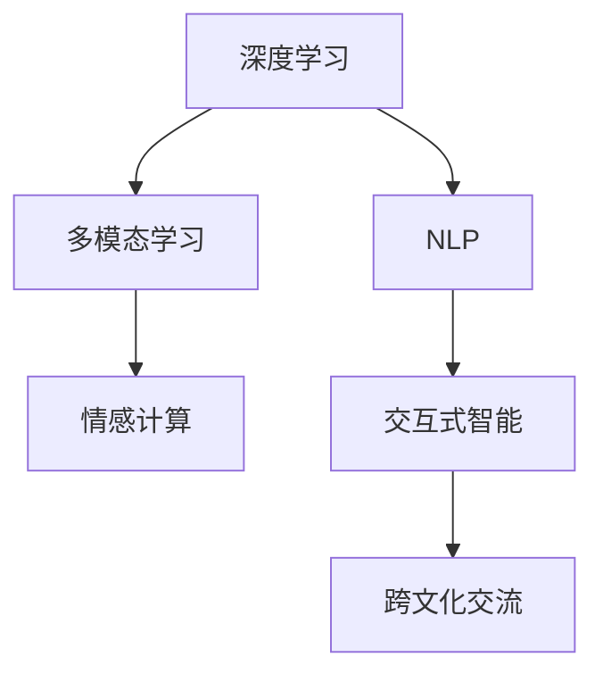

                 

## 1. 背景介绍

### 1.1 问题由来
在当前快速发展的数字时代，人际交往和理解他人的智慧成为了我们面临的重大挑战。随着全球化的深入，人们的工作和生活方式发生了巨大变化，跨文化交流、多元社会认同、虚拟社交环境等新现象不断涌现。如何在数字化时代有效理解和沟通，成为了一项紧迫而又重要的任务。

### 1.2 问题核心关键点
解决这一问题的关键在于，如何在快速获取和分析海量信息的同时，具备深度洞察力和同理心，从而更好地理解他人的情感、行为和观点。这涉及到多模态信息处理、自然语言理解、情感分析、行为预测等多个领域，需要通过综合运用算法和技术手段来解决。

### 1.3 问题研究意义
深度洞察力和同理心在构建和谐社会、提升用户体验、优化服务等方面具有重要意义。研究如何通过技术手段增强人类的同理心和洞察力，不仅能帮助我们更好地理解和沟通，还能促进社会和谐、增进人与人之间的信任和协作，推动社会进步。

## 2. 核心概念与联系

### 2.1 核心概念概述

为更好地理解“洞察力与同理心”在技术上的实现，本节将介绍几个密切相关的核心概念：

- **深度学习（Deep Learning）**：基于多层神经网络的机器学习技术，可以自动学习数据中的复杂特征，广泛应用于图像、语音、自然语言处理等领域。
- **自然语言处理（NLP）**：使用计算机技术处理和理解自然语言的学科，包括文本分类、情感分析、机器翻译等任务。
- **多模态学习（Multimodal Learning）**：结合视觉、听觉、文本等多种数据源，进行跨模态信息融合，提升对复杂情境的理解能力。
- **情感计算（Affective Computing）**：通过分析文本、语音、面部表情等多种数据，理解和计算人类情感的技术，应用于社交媒体分析、客户服务等场景。
- **交互式智能（Interactive Intelligence）**：通过对话系统、推荐系统等技术，实现人与机器的有效互动和沟通。
- **跨文化交流（Cross-cultural Communication）**：通过技术手段处理和理解不同文化背景下的语言和行为，促进全球化进程。

这些核心概念之间的逻辑关系可以通过以下Mermaid流程图来展示：



这个流程图展示了大模型微调的各核心概念及其之间的关系：

1. 深度学习提供底层技术支持，通过神经网络自动提取特征。
2. NLP在文本、语音等领域处理和理解自然语言。
3. 多模态学习结合视觉、听觉、文本等多种数据源，提升综合理解能力。
4. 情感计算分析情感信息，增进人机互动体验。
5. 交互式智能通过对话系统等技术实现有效互动。
6. 跨文化交流处理不同文化背景下的沟通问题，促进全球化。

## 3. 核心算法原理 & 具体操作步骤

### 3.1 算法原理概述

为了提升洞察力和同理心，基于深度学习的技术框架在信息处理、情感计算、跨文化交流等方面得到了广泛应用。以下将详细介绍如何通过深度学习算法实现这些目标：

1. **信息处理**：使用文本分类、情感分析等技术，从海量文本数据中提取信息，理解他人观点和情感。
2. **情感计算**：通过分析文本、语音、面部表情等多种数据，计算和理解人类情感，增强同理心。
3. **跨文化交流**：结合语言翻译和对话系统，处理不同文化背景下的沟通问题，促进全球化交流。

### 3.2 算法步骤详解

以情感计算为例，其基本步骤如下：

**Step 1: 数据准备**
- 收集和标注文本、语音、面部表情等多种数据源，用于训练和测试模型。

**Step 2: 模型构建**
- 选择合适的深度学习模型，如LSTM、GRU、Transformer等，设计情感计算模型。
- 定义模型的输入和输出，如文本数据、语音信号、面部特征等。

**Step 3: 训练模型**
- 使用标注数据训练情感计算模型，最小化损失函数，优化模型参数。
- 应用正则化技术，如L2正则、Dropout、Early Stopping等，防止过拟合。

**Step 4: 模型评估**
- 使用测试数据评估模型的性能，计算准确率、召回率等指标。
- 根据评估结果调整模型参数，进一步优化模型效果。

**Step 5: 应用模型**
- 将训练好的模型应用于实际场景，如社交媒体分析、客户服务、智能对话等。

### 3.3 算法优缺点

基于深度学习的情感计算方法具有以下优点：
1. 自动化程度高：能够自动从大量数据中提取信息，无需手动标注。
2. 精度高：使用深度神经网络，可以学习复杂的非线性特征，提升情感计算的准确性。
3. 灵活性高：可以处理多种数据源，适应不同场景。

同时，也存在一些局限性：
1. 依赖标注数据：需要大量标注数据进行训练，标注成本较高。
2. 模型复杂度高：深度神经网络需要大量计算资源和时间进行训练和推理。
3. 解释性不足：模型通常是黑盒系统，难以解释内部决策逻辑。
4. 鲁棒性不足：面对噪声数据和干扰因素，情感计算模型的稳定性可能受到影响。

尽管存在这些局限性，但基于深度学习的情感计算方法在实际应用中已经取得了显著效果，成为理解他人情感的重要工具。

### 3.4 算法应用领域

基于深度学习的情感计算方法在多个领域得到了广泛应用，例如：

- **社交媒体分析**：分析社交媒体用户的情感状态，预测舆情变化趋势。
- **客户服务**：通过分析客户反馈，提升客户满意度，优化服务体验。
- **智能对话**：使机器能够理解并回应用户情感，增强人机互动体验。
- **心理健康**：通过分析用户的情感状态，提供心理健康支持和干预。
- **教育培训**：通过情感分析学生的反馈，优化教学方法和内容。

这些应用展示了深度学习在情感计算中的巨大潜力，为理解他人的情感和需求提供了有力支持。

## 4. 数学模型和公式 & 详细讲解

### 4.1 数学模型构建

假设我们有一个情感分类任务，数据集包含文本 $D=\{(x_i, y_i)\}_{i=1}^N$，其中 $x_i$ 为输入文本，$y_i$ 为情感标签（如正面、负面、中性）。我们的目标是构建一个情感分类器 $f$，使其能够根据输入文本 $x$ 输出对应的情感标签 $y$。

情感分类器的目标是最小化交叉熵损失函数：

$$
\mathcal{L}(f) = -\frac{1}{N} \sum_{i=1}^N y_i \log f(x_i) + (1-y_i) \log (1-f(x_i))
$$

其中，$f(x_i)$ 表示模型对输入文本 $x_i$ 的情感预测概率，$\log$ 为自然对数函数。

### 4.2 公式推导过程

我们以LSTM模型为例，推导情感计算的数学公式。

LSTM模型是一种常用于文本处理的循环神经网络，其结构如下：

```
Input -> Embedding -> LSTM -> Dropout -> Output
```

其中，Embedding层将输入文本转换为向量表示，LSTM层用于捕捉文本中的长期依赖关系，Dropout层用于防止过拟合，Output层输出情感预测概率。

假设我们有一个文本 $x$，其嵌入向量表示为 $E(x)$，LSTM层的输出表示为 $H(x)$，Dropout后的向量表示为 $D(H(x))$，Output层的输出表示为 $O(D(H(x)))$。则情感预测概率 $f(x)$ 可以表示为：

$$
f(x) = \sigma(O(D(H(x))))
$$

其中，$\sigma$ 为sigmoid函数。

根据交叉熵损失函数的定义，我们求导得到：

$$
\frac{\partial \mathcal{L}(f)}{\partial H(x)} = \frac{1}{N} \sum_{i=1}^N (y_i - f(x_i)) \frac{\partial f(x_i)}{\partial H(x_i)}
$$

将 $f(x_i)$ 的表达式代入，并利用链式法则，我们可以得到 $H(x)$ 的梯度：

$$
\frac{\partial \mathcal{L}(f)}{\partial H(x)} = \frac{1}{N} \sum_{i=1}^N (y_i - \sigma(O(D(H(x)))) \frac{\partial \sigma(O(D(H(x))))}{\partial H(x)} \frac{\partial O(D(H(x)))}{\partial H(x)} \frac{\partial D(H(x))}{\partial H(x)} \frac{\partial H(x)}{\partial E(x)}
$$

这里省略了部分细节，仅展示了主要推导过程。

### 4.3 案例分析与讲解

假设我们有一篇关于某个电影的评论，其中包含正面和负面的情感表达。我们希望使用LSTM模型对其进行情感分类。首先，我们将评论文本转换为嵌入向量，输入LSTM层进行处理。LSTM层捕捉到评论中的情感信息，并输出一个向量表示。然后，Dropout层随机丢弃部分节点，防止过拟合。最后，Output层输出情感预测概率。

通过上述数学推导，我们可以使用反向传播算法计算模型参数的梯度，并使用优化算法（如AdamW）更新模型参数。不断迭代优化，直到模型在测试集上达到满意的性能。

## 5. 项目实践：代码实例和详细解释说明

### 5.1 开发环境搭建

在进行情感计算实践前，我们需要准备好开发环境。以下是使用Python进行TensorFlow开发的环境配置流程：

1. 安装Anaconda：从官网下载并安装Anaconda，用于创建独立的Python环境。

2. 创建并激活虚拟环境：
```bash
conda create -n tensorflow-env python=3.8 
conda activate tensorflow-env
```

3. 安装TensorFlow：根据CUDA版本，从官网获取对应的安装命令。例如：
```bash
conda install tensorflow-gpu==2.8.0 -c pytorch -c conda-forge
```

4. 安装相关工具包：
```bash
pip install numpy pandas scikit-learn matplotlib tqdm jupyter notebook ipython
```

完成上述步骤后，即可在`tensorflow-env`环境中开始情感计算实践。

### 5.2 源代码详细实现

下面我们以情感分类任务为例，给出使用TensorFlow实现LSTM模型的代码实现。

首先，定义情感分类任务的数据处理函数：

```python
import tensorflow as tf
from tensorflow.keras.preprocessing.text import Tokenizer
from tensorflow.keras.preprocessing.sequence import pad_sequences

def preprocess_data(texts, labels):
    tokenizer = Tokenizer(oov_token='<OOV>')
    tokenizer.fit_on_texts(texts)
    sequences = tokenizer.texts_to_sequences(texts)
    max_len = max(len(seq) for seq in sequences)
    padded_sequences = pad_sequences(sequences, maxlen=max_len, padding='post', truncating='post')
    labels = tf.keras.utils.to_categorical(labels)
    return padded_sequences, labels
```

然后，定义LSTM模型：

```python
from tensorflow.keras.models import Sequential
from tensorflow.keras.layers import Embedding, LSTM, Dense, Dropout

model = Sequential([
    Embedding(input_dim=len(tokenizer.word_index)+1, output_dim=128, input_length=max_len),
    LSTM(128, return_sequences=True),
    Dropout(0.2),
    LSTM(64, return_sequences=False),
    Dropout(0.2),
    Dense(64, activation='relu'),
    Dense(3, activation='softmax')
])
```

接着，定义训练和评估函数：

```python
def train_model(model, train_data, validation_data, epochs, batch_size, verbose=True):
    model.compile(optimizer='adam', loss='categorical_crossentropy', metrics=['accuracy'])
    history = model.fit(train_data, validation_data, epochs=epochs, batch_size=batch_size, verbose=verbose)
    return history

def evaluate_model(model, test_data, verbose=True):
    test_loss, test_acc = model.evaluate(test_data)
    print(f'Test loss: {test_loss:.4f}')
    print(f'Test accuracy: {test_acc:.4f}')
```

最后，启动训练流程并在测试集上评估：

```python
train_texts = ...
train_labels = ...
dev_texts = ...
dev_labels = ...
test_texts = ...
test_labels = ...

train_padded, train_labels = preprocess_data(train_texts, train_labels)
dev_padded, dev_labels = preprocess_data(dev_texts, dev_labels)
test_padded, test_labels = preprocess_data(test_texts, test_labels)

history = train_model(model, train_padded, dev_padded, epochs=10, batch_size=32, verbose=True)
evaluate_model(model, test_padded, verbose=True)
```

以上就是使用TensorFlow进行LSTM情感分类的完整代码实现。可以看到，TensorFlow提供了强大的API，可以方便地构建和训练复杂的深度学习模型。

### 5.3 代码解读与分析

让我们再详细解读一下关键代码的实现细节：

**preprocess_data函数**：
- 定义了文本和标签的预处理过程，将文本转换为序列数据，并进行填充和编码。

**LSTM模型定义**：
- 使用Sequential模型，依次定义Embedding层、LSTM层、Dropout层、Dense层等，构建情感分类器。

**train_model函数**：
- 定义了模型的编译、训练过程，使用Adam优化器、交叉熵损失函数和准确率评估指标。
- 应用Early Stopping策略，防止过拟合。

**evaluate_model函数**：
- 定义了模型的评估过程，计算测试集的损失和准确率，输出结果。

**训练流程**：
- 首先，将文本数据转换为序列数据并进行填充。
- 使用train_model函数训练模型，记录训练过程中的损失和准确率变化。
- 在测试集上评估模型，输出最终的性能指标。

可以看到，TensorFlow提供了便捷的工具和API，使得情感计算模型的构建和训练变得简单高效。开发者可以将更多精力放在数据处理、模型改进等高层逻辑上，而不必过多关注底层的实现细节。

当然，工业级的系统实现还需考虑更多因素，如模型的保存和部署、超参数的自动搜索、更灵活的任务适配层等。但核心的情感计算范式基本与此类似。

## 6. 实际应用场景

### 6.1 智能客服系统

基于深度学习的情感计算技术，可以广泛应用于智能客服系统的构建。传统客服往往需要配备大量人力，高峰期响应缓慢，且一致性和专业性难以保证。而使用情感计算的智能客服系统，可以实时监控用户情感，快速响应客户咨询，提升用户体验。

在技术实现上，可以收集企业内部的历史客服对话记录，将问题和最佳答复构建成监督数据，在此基础上对情感计算模型进行微调。微调后的模型能够自动理解用户情感，匹配最合适的回答。对于客户提出的新问题，还可以接入检索系统实时搜索相关内容，动态组织生成回答。如此构建的智能客服系统，能大幅提升客户咨询体验和问题解决效率。

### 6.2 金融舆情监测

金融机构需要实时监测市场舆论动向，以便及时应对负面信息传播，规避金融风险。传统的人工监测方式成本高、效率低，难以应对网络时代海量信息爆发的挑战。基于深度学习的情感计算技术，可以自动分析金融领域相关的新闻、报道、评论等文本数据，并对其进行情感标注。

具体而言，可以收集金融领域相关的新闻、报道、评论等文本数据，并对其进行主题标注和情感标注。在此基础上对情感计算模型进行微调，使其能够自动判断文本属于何种情感倾向。将微调后的模型应用到实时抓取的网络文本数据，就能够自动监测不同情感倾向的变化趋势，一旦发现负面情绪激增等异常情况，系统便会自动预警，帮助金融机构快速应对潜在风险。

### 6.3 个性化推荐系统

当前的推荐系统往往只依赖用户的历史行为数据进行物品推荐，无法深入理解用户的真实兴趣偏好。基于深度学习的情感计算技术，可以更深入地挖掘用户行为背后的情感信息，从而提供更精准、多样的推荐内容。

在实践中，可以收集用户浏览、点击、评论、分享等行为数据，提取和用户交互的物品标题、描述、标签等文本内容。将文本内容作为模型输入，用户的后续行为（如是否点击、购买等）作为监督信号，在此基础上训练情感计算模型。微调后的模型能够从文本内容中准确把握用户的情感兴趣点。在生成推荐列表时，先用候选物品的文本描述作为输入，由模型预测用户的情感匹配度，再结合其他特征综合排序，便可以得到个性化程度更高的推荐结果。

### 6.4 未来应用展望

随着深度学习技术的发展，基于情感计算的智能系统将在更多领域得到应用，为各行各业带来变革性影响。

在智慧医疗领域，基于情感计算的情感识别和情绪管理技术，可以辅助医生诊断和治疗，提升患者体验。在智能教育领域，情感计算可以用于分析学生的情感状态，优化教学方法和内容，提升教学效果。在智慧城市治理中，情感计算可以应用于城市事件监测、舆情分析、应急指挥等环节，提高城市管理的自动化和智能化水平，构建更安全、高效的未来城市。

此外，在企业生产、社会治理、文娱传媒等众多领域，基于情感计算的智能系统也将不断涌现，为经济社会发展注入新的动力。相信随着技术的日益成熟，情感计算技术将成为人工智能技术的重要组成部分，推动人工智能技术向更加智能化、普适化应用迈进。

## 7. 工具和资源推荐

### 7.1 学习资源推荐

为了帮助开发者系统掌握情感计算的理论基础和实践技巧，这里推荐一些优质的学习资源：

1. 《深度学习》系列书籍：由斯坦福大学教授Ian Goodfellow等人合著，系统介绍了深度学习的基本概念和算法。
2. CS224N《自然语言处理》课程：斯坦福大学开设的NLP明星课程，涵盖深度学习在NLP中的应用。
3. 《情感计算理论与应用》书籍：介绍了情感计算的基本理论和实际应用案例，有助于理解情感计算的核心概念。
4. TensorFlow官方文档：TensorFlow的官方文档，提供了丰富的API文档和示例代码，是学习TensorFlow的重要资源。
5. Kaggle平台：数据科学竞赛平台，提供大量情感计算相关的数据集和竞赛任务，适合实践和验证情感计算模型的性能。

通过对这些资源的学习实践，相信你一定能够快速掌握情感计算的精髓，并用于解决实际的情感分析问题。

### 7.2 开发工具推荐

高效的开发离不开优秀的工具支持。以下是几款用于情感计算开发的常用工具：

1. TensorFlow：由Google主导开发的开源深度学习框架，生产部署方便，适合大规模工程应用。
2. PyTorch：基于Python的开源深度学习框架，灵活动态的计算图，适合快速迭代研究。
3. Keras：基于TensorFlow和Theano的高级API，提供便捷的模型构建工具，适合快速上手。
4. Scikit-learn：Python机器学习库，提供了丰富的数据预处理和模型评估工具，适合数据处理和模型调优。

合理利用这些工具，可以显著提升情感计算任务的开发效率，加快创新迭代的步伐。

### 7.3 相关论文推荐

情感计算的研究源于学界的持续研究。以下是几篇奠基性的相关论文，推荐阅读：

1. Sentiment Analysis using Recurrent Neural Networks（RNNs）：使用RNN模型进行情感分析，展示了深度学习在情感计算中的应用。
2. Attention is All You Need（Transformer原论文）：提出Transformer结构，奠定了深度学习在自然语言处理中的基础。
3. A Survey on Sentiment Analysis：综述了情感分析领域的经典算法和应用，介绍了情感计算的基本框架和方法。
4. Emotion Recognition in the Context of the Covid-19 Pandemic：介绍了基于深度学习的情感识别技术在疫情期间的应用，展示了情感计算的社会价值。
5. AffectNet: An RPPN Database for Human Affect and Emotion Recognition：介绍了一个用于情感识别的大规模数据集，推动了情感计算的研究进展。

这些论文代表了大模型微调技术的发展脉络。通过学习这些前沿成果，可以帮助研究者把握学科前进方向，激发更多的创新灵感。

## 8. 总结：未来发展趋势与挑战

### 8.1 总结

本文对基于深度学习的情感计算方法进行了全面系统的介绍。首先阐述了深度学习在情感计算中的应用，明确了情感计算在提升用户体验、优化服务等方面的重要价值。其次，从原理到实践，详细讲解了情感计算的数学原理和关键步骤，给出了情感计算任务开发的完整代码实例。同时，本文还广泛探讨了情感计算方法在智能客服、金融舆情、个性化推荐等多个领域的应用前景，展示了情感计算技术的巨大潜力。此外，本文精选了情感计算技术的各类学习资源，力求为读者提供全方位的技术指引。

通过本文的系统梳理，可以看到，基于深度学习的情感计算方法在实际应用中已经取得了显著效果，成为理解他人情感的重要工具。未来，伴随深度学习技术的不断发展，情感计算方法将进一步拓展其应用场景，为构建更加智能化、普适化的智能系统提供有力支持。

### 8.2 未来发展趋势

展望未来，情感计算技术将呈现以下几个发展趋势：

1. **多模态融合**：情感计算将结合视觉、听觉、文本等多种数据源，提升对复杂情境的理解能力。
2. **跨文化交流**：情感计算将处理不同文化背景下的沟通问题，促进全球化交流。
3. **自动化水平提升**：情感计算将使用更多预训练模型和迁移学习技术，提升模型的自动化水平和泛化能力。
4. **个性化推荐**：情感计算将与推荐系统结合，提供更加个性化的情感服务和产品推荐。
5. **交互式智能**：情感计算将应用于智能对话系统，实现人机深度互动。
6. **社会责任**：情感计算将关注伦理和隐私问题，确保技术的公平性和透明性。

以上趋势凸显了情感计算技术的广阔前景。这些方向的探索发展，必将进一步提升情感计算系统的性能和应用范围，为构建和谐社会、提升用户体验、优化服务等方面提供有力支持。

### 8.3 面临的挑战

尽管基于深度学习的情感计算技术已经取得了显著成果，但在迈向更加智能化、普适化应用的过程中，它仍面临诸多挑战：

1. **数据获取困难**：情感计算需要大量的标注数据进行训练，数据获取成本较高。
2. **模型复杂度高**：深度神经网络需要大量计算资源和时间进行训练和推理。
3. **泛化能力不足**：面对不同的应用场景，情感计算模型的泛化能力有待提升。
4. **隐私保护问题**：情感计算涉及大量的个人情感数据，隐私保护问题需要得到解决。
5. **伦理道德挑战**：情感计算技术的应用需要考虑伦理和道德问题，避免误用和滥用。

尽管存在这些挑战，但基于深度学习的情感计算方法在实际应用中已经取得了显著效果，成为理解他人情感的重要工具。未来，随着技术的不断进步，情感计算将进一步提升其自动化水平和泛化能力，更好地服务于社会和人类。

### 8.4 未来突破

面对情感计算所面临的种种挑战，未来的研究需要在以下几个方面寻求新的突破：

1. **多模态融合**：结合视觉、听觉、文本等多种数据源，提升情感计算模型的综合理解能力。
2. **迁移学习**：使用预训练模型和迁移学习技术，提升模型的自动化水平和泛化能力。
3. **隐私保护**：采用差分隐私、联邦学习等技术，保护用户情感数据的隐私。
4. **伦理道德**：引入伦理导向的评估指标，确保情感计算技术的公平性和透明性。
5. **自动化水平提升**：开发更多参数高效的情感计算方法，提高模型的计算效率和推理速度。

这些研究方向的探索，必将引领情感计算技术迈向更高的台阶，为构建安全、可靠、可解释、可控的智能系统铺平道路。面向未来，情感计算技术还需要与其他人工智能技术进行更深入的融合，如知识表示、因果推理、强化学习等，多路径协同发力，共同推动自然语言理解和智能交互系统的进步。只有勇于创新、敢于突破，才能不断拓展情感计算的边界，让智能技术更好地造福人类社会。

## 9. 附录：常见问题与解答

**Q1：情感计算是否适用于所有应用场景？**

A: 情感计算适用于大多数应用场景，但需要根据具体任务进行优化和调整。对于某些场景，如医疗、法律等，可能需要结合专业知识，进行更精细化的设计和调参。

**Q2：情感计算过程中如何选择合适的模型？**

A: 选择情感计算模型时，需要考虑任务类型、数据规模、计算资源等因素。常用的模型包括RNN、LSTM、Transformer等，其中Transformer模型具有较好的泛化能力和计算效率。

**Q3：情感计算模型在落地部署时需要注意哪些问题？**

A: 在将情感计算模型转化为实际应用时，需要注意以下几个问题：
1. 模型裁剪和优化，以提高推理速度和计算效率。
2. 保护用户隐私，确保情感数据的安全和隐私。
3. 引入人工智能伦理和社会责任，确保技术的公平性和透明性。
4. 优化用户体验，提升人机交互的流畅度和自然性。

**Q4：情感计算技术的发展趋势是什么？**

A: 情感计算技术的发展趋势主要体现在以下几个方面：
1. 多模态融合，结合视觉、听觉、文本等多种数据源，提升综合理解能力。
2. 跨文化交流，处理不同文化背景下的沟通问题，促进全球化交流。
3. 自动化水平提升，使用预训练模型和迁移学习技术，提升模型的自动化水平和泛化能力。
4. 个性化推荐，与推荐系统结合，提供更加个性化的情感服务和产品推荐。
5. 交互式智能，应用于智能对话系统，实现人机深度互动。
6. 隐私保护，采用差分隐私、联邦学习等技术，保护用户情感数据的隐私。
7. 伦理道德，引入伦理导向的评估指标，确保技术的公平性和透明性。

这些趋势展示了情感计算技术的广阔前景，为构建更加智能化、普适化的智能系统提供有力支持。

**Q5：情感计算技术的未来展望是什么？**

A: 情感计算技术的未来展望主要体现在以下几个方面：
1. 结合多模态数据源，提升情感计算的准确性和泛化能力。
2. 处理跨文化交流问题，促进全球化交流。
3. 与推荐系统结合，提供更加个性化的情感服务和产品推荐。
4. 应用于智能对话系统，实现人机深度互动。
5. 保护用户隐私，确保情感数据的安全和隐私。
6. 引入伦理导向的评估指标，确保技术的公平性和透明性。

这些趋势展示了情感计算技术的广阔前景，为构建更加智能化、普适化的智能系统提供有力支持。

**Q6：情感计算技术的实际应用场景有哪些？**

A: 情感计算技术的实际应用场景主要包括以下几个方面：
1. 智能客服系统，实时监控用户情感，快速响应客户咨询。
2. 金融舆情监测，自动分析金融领域相关的新闻、报道、评论等文本数据，监测市场舆论动向。
3. 个性化推荐系统，结合情感数据，提供更加个性化的情感服务和产品推荐。
4. 心理健康支持，通过分析用户的情感状态，提供心理健康支持和干预。
5. 教育培训，分析学生的情感状态，优化教学方法和内容，提升教学效果。
6. 社交媒体分析，分析社交媒体用户的情感状态，预测舆情变化趋势。

这些应用展示了情感计算技术的广阔前景，为构建更加智能化、普适化的智能系统提供有力支持。

**Q7：如何提高情感计算模型的泛化能力？**

A: 提高情感计算模型的泛化能力，需要从以下几个方面进行优化：
1. 增加数据量，使用更多的标注数据进行训练。
2. 引入迁移学习，使用预训练模型和跨领域数据进行微调。
3. 设计更加复杂和强大的模型，如Transformer等。
4. 引入正则化技术，防止过拟合。
5. 使用多任务学习，提高模型的泛化能力和鲁棒性。
6. 引入多模态数据，提升情感计算的综合理解能力。

这些方法可以显著提高情感计算模型的泛化能力和鲁棒性，更好地适应不同的应用场景。

---

作者：禅与计算机程序设计艺术 / Zen and the Art of Computer Programming

