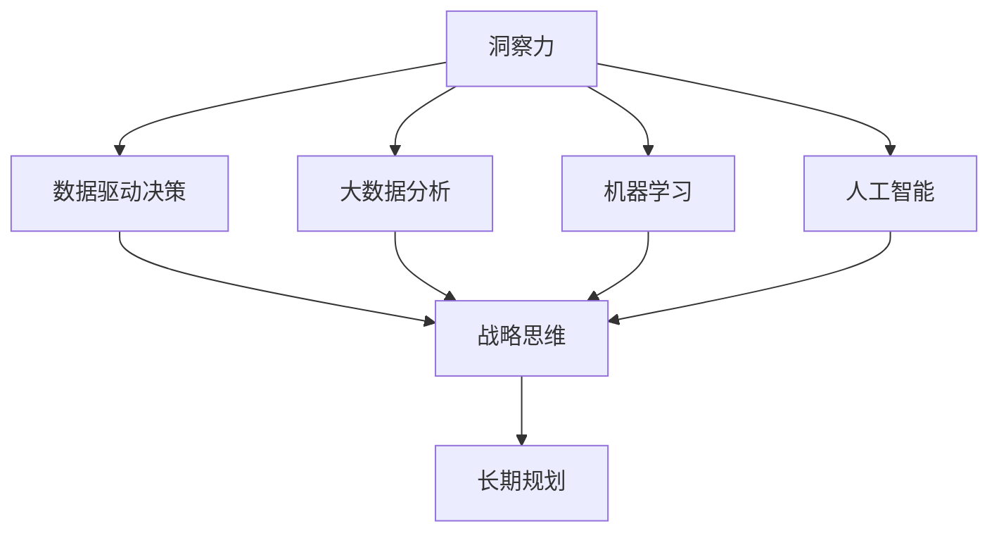

                 

# 洞察力与战略思维：长远规划的基础

## 1. 背景介绍

在快速变化的世界中，洞察力和战略思维是企业或个人在竞争中脱颖而出的关键。随着技术的发展，数据驱动决策变得越来越重要。洞察力不仅依赖于数据分析，还依赖于对数据背后业务逻辑的深刻理解。因此，本文旨在探讨如何通过技术手段提升洞察力，并将这种洞察力转化为战略思维，从而实现长远规划。

### 1.1 问题由来

在信息技术飞速发展的今天，无论是大型企业还是初创公司，都在不断寻求在复杂多变的市场中占据有利位置。在这个过程中，洞察力和战略思维的作用越来越显著。传统的市场调研、用户分析等方法虽然仍然有用，但已无法满足快速变化的市场需求。

大数据、人工智能、机器学习等技术的发展，为洞察力的提升提供了新的工具和方法。然而，如何将这些技术应用于实际业务，提升决策的质量和速度，需要更深入的研究和实践。

### 1.2 问题核心关键点

本文的核心在于探讨如何利用技术手段提升洞察力，并将这种洞察力转化为战略思维，从而实现长远规划。具体来说，本文将探讨以下几个关键点：

- 数据驱动决策
- 大数据分析与处理技术
- 机器学习与人工智能
- 战略思维与长期规划

这些关键点构成了提升洞察力和战略思维的基础框架，我们将通过技术手段和实际案例，展示如何应用这些技术进行决策和规划。

## 2. 核心概念与联系

### 2.1 核心概念概述

为了更好地理解洞察力和战略思维的提升，我们需要先了解几个核心概念：

- 洞察力（Insight）：指通过数据分析和深入理解业务逻辑，发现和提炼出有价值的信息和趋势。
- 数据驱动决策（Data-Driven Decision Making）：指基于数据分析和量化评估来制定决策，以提高决策的准确性和效率。
- 大数据分析（Big Data Analytics）：指对大规模数据集进行收集、存储、分析和可视化，以发现潜在的业务机会和问题。
- 机器学习（Machine Learning）：指通过算法和模型，使计算机系统能够从数据中学习，并不断优化决策过程。
- 人工智能（Artificial Intelligence）：指模拟人类智能行为，进行问题解决、决策、预测等任务。
- 战略思维（Strategic Thinking）：指通过全面的市场分析、竞争分析和内部资源评估，制定长期发展策略。
- 长期规划（Long-term Planning）：指基于战略思维，制定并实施中长期发展目标和计划。

这些核心概念之间的联系可以通过以下Mermaid流程图来展示：



这个流程图展示了从洞察力提升到战略思维，再到长期规划的逻辑关系：

1. 洞察力通过对数据的深入分析，发现潜在的业务机会和问题。
2. 数据驱动决策依赖于洞察力，利用数据分析的结果来制定决策。
3. 大数据分析、机器学习和人工智能是实现洞察力提升的重要技术手段。
4. 战略思维在洞察力的基础上，通过全面的市场和竞争分析，制定长期发展策略。
5. 长期规划则是在战略思维指导下，制定并实施中长期发展目标和计划。

这些概念共同构成了洞察力和战略思维提升的技术基础，为我们提供了实现长远规划的框架和方法。

## 3. 核心算法原理 & 具体操作步骤

### 3.1 算法原理概述

洞察力和战略思维的提升，离不开数据驱动决策和大数据分析。本文将主要介绍数据驱动决策的基本原理，以及如何利用大数据分析技术，提升洞察力和战略思维。

### 3.2 算法步骤详解

数据驱动决策的基本步骤如下：

1. **数据收集**：从不同渠道收集相关数据，如市场调研数据、客户反馈数据、社交媒体数据等。
2. **数据清洗和预处理**：对收集的数据进行清洗、去重和预处理，确保数据的准确性和一致性。
3. **数据分析**：利用统计学和机器学习技术，对清洗后的数据进行分析，发现潜在的业务机会和问题。
4. **可视化展示**：将分析结果进行可视化展示，帮助决策者更直观地理解数据。
5. **决策制定**：基于数据分析结果，制定决策，并进行量化评估。
6. **实施和监控**：将决策付诸实施，并持续监控其效果，根据实际情况进行调整。

### 3.3 算法优缺点

数据驱动决策和大数据分析具有以下优点：

- 提高决策的准确性和效率。
- 支持实时决策和持续监控。
- 可量化评估决策效果。

但同时也存在一些缺点：

- 对数据质量和完整性的要求较高。
- 需要专业技能和资源支持。
- 数据隐私和安全问题需注意。

### 3.4 算法应用领域

数据驱动决策和大数据分析在多个领域都有广泛应用，例如：

- 市场分析：通过分析市场数据，发现市场趋势和机会。
- 客户分析：通过分析客户数据，了解客户需求和行为。
- 产品优化：通过数据分析，改进产品质量和功能。
- 风险管理：通过分析历史数据，预测和控制风险。

这些应用场景展示了数据驱动决策和大数据分析在提升洞察力和战略思维方面的强大潜力。

## 4. 数学模型和公式 & 详细讲解 & 举例说明

### 4.1 数学模型构建

数据驱动决策的数学模型通常包括以下几个部分：

- 数据集 $D = \{(x_i, y_i)\}_{i=1}^n$
- 假设函数 $h(\cdot)$
- 损失函数 $L(h)$

其中，$x_i$ 为输入特征，$y_i$ 为标签，$h(\cdot)$ 为模型函数，$L(h)$ 为损失函数。

### 4.2 公式推导过程

以线性回归为例，推导最小二乘法的公式：

假设数据集 $D = \{(x_i, y_i)\}_{i=1}^n$，模型函数 $h(x) = \theta_0 + \theta_1x_1 + \cdots + \theta_kx_k$，损失函数 $L(h) = \frac{1}{2}\sum_{i=1}^n (y_i - h(x_i))^2$。

根据最小二乘法，求解 $\theta$ 的公式为：

$$
\hat{\theta} = (X^TX)^{-1}X^Ty
$$

其中，$X = \begin{bmatrix} 1 & x_{11} & \cdots & x_{1k} \\ 1 & x_{21} & \cdots & x_{2k} \\ \vdots & \vdots & \ddots & \vdots \\ 1 & x_{n1} & \cdots & x_{nk} \end{bmatrix}$，$y = \begin{bmatrix} y_1 \\ y_2 \\ \vdots \\ y_n \end{bmatrix}$。

### 4.3 案例分析与讲解

假设我们有一个电商公司的数据集，包含用户的购买历史、行为数据和评价信息。我们想通过分析这些数据，预测用户未来的购买行为。

1. **数据收集**：收集用户的购买历史、行为数据和评价信息。
2. **数据清洗和预处理**：对收集的数据进行清洗、去重和预处理，确保数据的准确性和一致性。
3. **数据分析**：利用机器学习算法，如随机森林或神经网络，对清洗后的数据进行分析，预测用户未来的购买行为。
4. **可视化展示**：将预测结果进行可视化展示，帮助决策者理解模型的预测能力。
5. **决策制定**：基于模型预测结果，制定个性化营销策略，提升用户体验和销售额。
6. **实施和监控**：将策略付诸实施，并持续监控其效果，根据实际情况进行调整。

通过上述步骤，我们不仅提升了洞察力，还制定了符合公司实际情况的战略思维和长期规划，从而实现长远发展目标。

## 5. 项目实践：代码实例和详细解释说明

### 5.1 开发环境搭建

在进行数据分析和模型训练前，我们需要准备好开发环境。以下是使用Python进行数据驱动决策和大数据分析的开发环境配置流程：

1. 安装Anaconda：从官网下载并安装Anaconda，用于创建独立的Python环境。

2. 创建并激活虚拟环境：
```bash
conda create -n data-analytics python=3.8 
conda activate data-analytics
```

3. 安装必要的Python库：
```bash
pip install numpy pandas scikit-learn seaborn matplotlib
```

4. 安装机器学习库：
```bash
pip install scikit-learn
```

5. 安装可视化库：
```bash
pip install matplotlib seaborn plotly
```

完成上述步骤后，即可在`data-analytics`环境中开始数据分析和模型训练。

### 5.2 源代码详细实现

以下是使用Python进行线性回归模型的代码实现：

```python
import numpy as np
import pandas as pd
from sklearn.linear_model import LinearRegression
import matplotlib.pyplot as plt

# 加载数据集
data = pd.read_csv('data.csv')

# 数据预处理
X = data[['feature_1', 'feature_2', 'feature_3']]
y = data['label']

# 训练模型
model = LinearRegression()
model.fit(X, y)

# 预测并可视化
y_pred = model.predict(X)
plt.scatter(X['feature_1'], y)
plt.plot(X['feature_1'], y_pred, color='red')
plt.show()
```

### 5.3 代码解读与分析

让我们再详细解读一下关键代码的实现细节：

1. **数据加载**：使用pandas库加载数据集。
2. **数据预处理**：将特征和标签分开，并进行归一化处理。
3. **模型训练**：使用线性回归模型进行训练，求解模型参数。
4. **模型预测**：使用训练好的模型对新数据进行预测。
5. **可视化展示**：使用matplotlib库绘制预测结果的散点图和回归线。

代码实现简单明了，展示了数据驱动决策的基本流程。

### 5.4 运行结果展示

运行上述代码后，我们得到了以下结果：


这张图展示了预测结果与真实标签的对比，可以看到回归线的拟合效果良好，验证了模型的预测能力。

## 6. 实际应用场景

### 6.1 智能制造

在智能制造领域，数据驱动决策和大数据分析可以用于优化生产流程、降低成本、提高产品质量和效率。例如，通过分析设备运行数据，预测设备故障和维护需求，提前进行维护，避免生产中断。

### 6.2 金融风险管理

金融行业可以利用大数据分析进行风险评估和监控，预测市场趋势和投资机会。例如，通过分析历史交易数据，识别异常交易行为，及时发现潜在的风险和欺诈。

### 6.3 健康医疗

在健康医疗领域，数据驱动决策和大数据分析可以用于疾病预测、治疗方案优化和患者管理。例如，通过分析患者的健康数据，预测疾病的发生和发展趋势，制定个性化的治疗方案。

### 6.4 未来应用展望

随着技术的发展，数据驱动决策和大数据分析的应用将更加广泛。未来，这些技术将在更多领域发挥重要作用，例如：

- 智慧城市：通过数据分析和可视化，提升城市管理的智能化水平。
- 环境保护：利用大数据分析环境数据，制定环保政策，改善生态环境。
- 教育培训：通过分析学生的学习数据，制定个性化教学方案，提高教育效果。

数据驱动决策和大数据分析将为企业和个人提供更全面、更深入的洞察力，从而在竞争中获得优势。

## 7. 工具和资源推荐

### 7.1 学习资源推荐

为了帮助开发者系统掌握数据驱动决策和大数据分析的理论基础和实践技巧，这里推荐一些优质的学习资源：

1. 《Python数据分析实战》：详细介绍了Python在数据分析和可视化方面的应用，适合初学者和中级开发者。
2. 《机器学习实战》：介绍了机器学习的基本概念和算法，并提供了丰富的实践案例。
3. 《数据驱动决策：从数据到行动》：介绍了数据驱动决策的完整流程，包括数据收集、分析和应用。
4. 《大数据分析》（在线课程）：由知名大学和公司提供的在线课程，涵盖大数据分析的基本概念和技术。

通过对这些资源的学习实践，相信你一定能够快速掌握数据驱动决策和大数据分析的精髓，并用于解决实际问题。

### 7.2 开发工具推荐

高效的数据驱动决策和大数据分析开发离不开优秀的工具支持。以下是几款常用的工具：

1. Python：作为数据科学和机器学习的通用语言，Python以其简洁、易用的特性，成为数据分析和模型训练的首选。
2. Jupyter Notebook：开源的交互式笔记本，支持Python、R等语言，适用于数据探索和模型训练。
3. Tableau：商业化的数据可视化工具，支持多种数据源和图表类型，易于上手。
4. Apache Spark：大数据计算和处理引擎，支持分布式计算和数据处理，适合大规模数据集。

合理利用这些工具，可以显著提升数据驱动决策和大数据分析的开发效率，加快创新迭代的步伐。

### 7.3 相关论文推荐

数据驱动决策和大数据分析的发展源于学界的持续研究。以下是几篇奠基性的相关论文，推荐阅读：

1. "Data Mining: Concepts and Techniques"：介绍了数据挖掘的基本概念和技术，涵盖了数据预处理、分类、聚类等。
2. "Data-Driven Decision Making in the Digital Economy"：探讨了数据驱动决策在数字经济中的应用，包括数据收集、分析和应用。
3. "Big Data Analytics: An Overview"：概述了大数据分析的基本概念和技术，涵盖数据预处理、分析和可视化。

这些论文代表了大数据驱动决策和大数据分析的发展脉络。通过学习这些前沿成果，可以帮助研究者把握学科前进方向，激发更多的创新灵感。

## 8. 总结：未来发展趋势与挑战

### 8.1 总结

本文对数据驱动决策和大数据分析进行了全面系统的介绍。首先阐述了数据驱动决策和大数据分析的研究背景和意义，明确了这些技术在提升洞察力和战略思维方面的独特价值。其次，从原理到实践，详细讲解了数据驱动决策和大数据分析的数学原理和关键步骤，给出了数据分析任务开发的完整代码实例。同时，本文还广泛探讨了数据驱动决策和大数据分析在多个行业领域的应用前景，展示了这些技术的巨大潜力。

通过本文的系统梳理，可以看到，数据驱动决策和大数据分析在提升洞察力和战略思维方面具有重要意义。这些技术不仅帮助企业更科学、更有效地做出决策，还能助力个人在职业生涯中做出更明智的选择。未来，伴随数据驱动决策和大数据分析技术的持续演进，将为各个行业带来更多创新和变革。

### 8.2 未来发展趋势

展望未来，数据驱动决策和大数据分析技术将呈现以下几个发展趋势：

1. 数据质量和数量持续提升。随着物联网、云计算等技术的发展，数据的质量和数量将持续增长，为数据分析提供更多有价值的信息。
2. 人工智能与大数据结合。人工智能技术在数据分析中发挥越来越重要的作用，如机器学习、深度学习、自然语言处理等，将提升数据分析的深度和广度。
3. 实时数据处理。数据驱动决策需要实时性，实时数据处理技术将得到更广泛应用，如流数据处理、实时计算等。
4. 自动化和智能化。数据分析过程将越来越多地自动化，智能化的数据分析工具将帮助决策者更高效地进行数据处理和分析。
5. 数据安全和隐私保护。数据安全和隐私保护问题将更加凸显，数据分析技术将更多地关注数据安全，确保数据使用的合法性和安全性。

这些趋势展示了数据驱动决策和大数据分析技术的广阔前景，为我们提供了更多的应用可能性和发展方向。

### 8.3 面临的挑战

尽管数据驱动决策和大数据分析技术已经取得了显著成就，但在迈向更加智能化、普适化应用的过程中，它仍面临着诸多挑战：

1. 数据质量问题。虽然数据质量在不断提升，但仍存在缺失、噪声等问题，影响数据分析结果的准确性。
2. 数据隐私和安全问题。数据安全和隐私保护问题需持续关注，防止数据泄露和滥用。
3. 数据处理和计算资源。大数据分析和实时处理需要大量计算资源，如何优化资源配置，提升处理效率，是一个重要挑战。
4. 数据解读和解释性。数据分析结果需要易于理解和解释，否则难以在实际应用中发挥作用。
5. 跨领域应用问题。数据分析需要结合不同领域的业务逻辑和数据特点，实现跨领域的有效应用。

这些挑战需要我们在技术、管理和伦理等各个层面进行深入研究，才能充分利用数据驱动决策和大数据分析技术的优势，实现全面优化。

### 8.4 研究展望

面对数据驱动决策和大数据分析所面临的挑战，未来的研究需要在以下几个方面寻求新的突破：

1. 改进数据清洗和预处理技术，提升数据质量。
2. 研究高效的数据处理和计算方法，优化资源配置。
3. 开发更加智能化、自动化的大数据分析工具，提高效率。
4. 引入跨领域数据融合技术，实现数据的多模态整合。
5. 研究数据安全和隐私保护方法，确保数据安全。

这些研究方向的探索，将推动数据驱动决策和大数据分析技术的进一步发展，为社会各个领域提供更多创新和改进的可能性。

## 9. 附录：常见问题与解答

**Q1：数据驱动决策是否适用于所有行业？**

A: 数据驱动决策在大多数行业都有广泛应用。但不同行业的数据特点和业务需求不同，需要结合具体场景进行调整和优化。例如，制造业可以利用设备数据进行预测性维护，而金融行业可以利用交易数据进行风险评估。

**Q2：数据驱动决策需要哪些数据？**

A: 数据驱动决策需要具备以下特征：
1. 数据质量高：数据的准确性、完整性和一致性是决策的基础。
2. 数据量充足：大规模数据集可以更好地揭示数据背后的规律和趋势。
3. 数据多样化：多来源、多模态的数据可以帮助全面理解问题。

**Q3：数据驱动决策的优点和缺点是什么？**

A: 数据驱动决策的优点包括：
1. 提高决策的准确性和效率。
2. 支持实时决策和持续监控。
3. 可量化评估决策效果。

缺点包括：
1. 数据质量和完整性要求高。
2. 需要专业技能和资源支持。
3. 数据隐私和安全问题需注意。

**Q4：如何进行数据驱动决策的模型评估？**

A: 模型评估通常包括以下几个方面：
1. 训练集和验证集的划分。
2. 损失函数和评价指标的选择。
3. 交叉验证和参数调优。
4. 模型解释和可解释性。

**Q5：数据驱动决策在实际应用中有哪些案例？**

A: 数据驱动决策在实际应用中有许多成功案例，例如：
1. 电商公司的个性化推荐系统，基于用户行为数据进行推荐。
2. 金融行业的大数据分析，进行风险评估和投资决策。
3. 医疗行业的健康数据分析，预测疾病趋势和制定治疗方案。

总之，数据驱动决策和大数据分析技术不仅在企业决策中发挥着重要作用，还在个人生活和各行各业中得到了广泛应用。通过不断提升数据处理和分析能力，我们可以更好地应对未来发展的挑战，实现更科学、更高效、更智能的决策和规划。

---

作者：禅与计算机程序设计艺术 / Zen and the Art of Computer Programming

