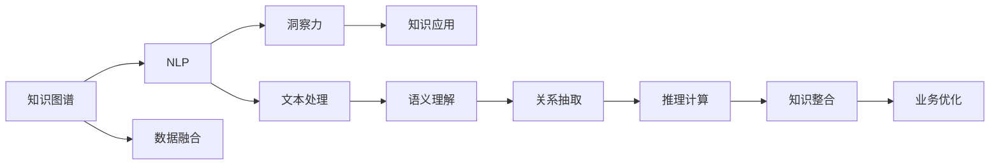

                 

# 洞察力：知识应用的指南针

> 关键词：洞察力,知识应用,知识图谱,知识管理,自然语言处理,NLP,深度学习,机器学习,认知计算,数据驱动决策

## 1. 背景介绍

在当今信息爆炸的时代，如何高效地处理、整合和应用海量知识，成为企业创新和决策的关键。随着大数据、人工智能技术的快速发展，知识图谱和自然语言处理(NLP)技术逐步成为获取、组织和利用知识的重要工具。本文将深入探讨知识图谱和NLP在知识应用中的原理与实践，以及如何通过洞察力提升知识应用的效率和效果。

## 2. 核心概念与联系

### 2.1 核心概念概述

- **知识图谱**：知识图谱是一种通过图形化方式表示实体及其关系的知识表示形式。它由节点（实体）和边（关系）组成，能精确地表示实体之间的关系，支持复杂查询和推理。

- **自然语言处理(NLP)**：NLP是计算机科学、人工智能和语言学交叉领域，旨在使计算机能够理解、解释和生成人类语言。NLP技术主要包括文本分类、情感分析、命名实体识别、机器翻译等。

- **洞察力**：洞察力是指从复杂的现象中发现隐藏规律或洞察深层原因的能力。在知识应用中，洞察力是通过分析、挖掘和整合知识，发现潜在的趋势、模式和关联，从而指导决策和优化业务流程。

### 2.2 核心概念原理和架构的 Mermaid 流程图



该图表展示了知识图谱、NLP和洞察力之间的关系及其在大规模知识应用中的作用。

## 3. 核心算法原理 & 具体操作步骤

### 3.1 算法原理概述

知识图谱和NLP技术的融合，通过构建大规模的知识图谱，再通过NLP技术处理和分析自然语言文本，使得机器能够理解和处理人类语言，进而发现知识中的深层联系和规律，实现知识驱动的决策。这一过程涉及以下几个关键步骤：

1. **知识抽取与构建**：从大量结构化或非结构化数据中提取实体和关系，构建知识图谱。
2. **语义理解与处理**：利用NLP技术对自然语言文本进行语义理解和处理，提取出关键信息。
3. **知识整合与推理**：将知识图谱与文本信息进行整合，通过推理计算，发现知识间的深层联系和规律。
4. **洞察力挖掘与应用**：根据洞察力挖掘结果，指导业务决策，优化业务流程。

### 3.2 算法步骤详解

**Step 1: 构建知识图谱**
- 收集结构化或非结构化数据，识别实体及其关系。
- 设计知识图谱架构，确定实体类型、属性和关系。
- 使用知识图谱构建工具（如Neo4j、ontolog等）建立知识图谱。

**Step 2: 数据预处理**
- 对非结构化数据进行文本清洗、分词、词性标注等预处理。
- 将处理后的文本输入到预训练语言模型（如BERT、GPT等）中，获得文本向量表示。

**Step 3: 语义理解与特征提取**
- 使用词向量表示和语义理解技术，如Word2Vec、GloVe、BERT等，提取文本的语义特征。
- 设计合适的特征提取方法，如TF-IDF、主题模型等，提取文本的统计特征。

**Step 4: 知识抽取与整合**
- 利用规则或机器学习算法从文本中抽取实体及其关系。
- 将抽取的知识与知识图谱进行整合，构建统一的知识库。

**Step 5: 推理计算与洞察力挖掘**
- 使用推理算法（如基于规则、基于事实的推理、基于深度学习的图神经网络等）进行知识推理。
- 根据推理结果，挖掘出知识中的深层联系和规律，生成洞察力报告。

**Step 6: 应用洞察力**
- 根据洞察力报告，指导业务决策和优化流程。
- 集成洞察力报告到实际应用系统，实现自动化决策支持。

### 3.3 算法优缺点

知识图谱与NLP结合的优势：
- **知识整合与推理**：知识图谱能将分散的知识整合起来，通过推理发现深层规律。
- **跨领域应用**：知识图谱适用于跨领域的知识整合和应用，提高知识应用的多样性。
- **支持自然语言处理**：NLP技术使得机器能够理解和生成人类语言，提升知识应用的灵活性。

知识图谱与NLP结合的局限性：
- **构建复杂**：构建大规模知识图谱需要大量人力和资源。
- **数据质量依赖**：知识图谱的准确性依赖于数据的质量和完整性。
- **动态更新挑战**：知识图谱需要不断更新以适应新的数据和知识，更新成本较高。

## 4. 数学模型和公式 & 详细讲解

### 4.1 数学模型构建

知识图谱和NLP技术的融合涉及多个数学模型，主要包括：

- **知识抽取模型**：如关系抽取、实体识别、关系分类等，目标是提取知识图谱中的实体和关系。
- **语义理解模型**：如词向量表示、文本分类、情感分析等，目标是提取文本的语义特征。
- **知识推理模型**：如基于规则的推理、基于神经网络的推理、基于图神经网络的推理等，目标是整合知识图谱和文本信息，发现深层联系和规律。

### 4.2 公式推导过程

**知识抽取模型**
- **关系抽取**：使用逻辑回归或支持向量机等算法，对自然语言中的关系进行分类。公式：
  $$
  y = \sigma(w^T x + b)
  $$
  其中 $x$ 为特征向量，$w$ 和 $b$ 为模型参数，$\sigma$ 为 sigmoid 函数。

**语义理解模型**
- **词向量表示**：使用 Word2Vec、GloVe、BERT 等模型，将单词映射到高维向量空间。公式：
  $$
  \vec{v} = \text{Embed}(x)
  $$
  其中 $\vec{v}$ 为单词的向量表示，$\text{Embed}$ 为嵌入函数。

**知识推理模型**
- **基于神经网络的推理**：使用 LSTM、GRU、Transformer 等模型，对知识图谱和文本信息进行整合。公式：
  $$
  \vec{h} = \text{NeuralNet}(\vec{v}, \vec{k})
  $$
  其中 $\vec{h}$ 为推理结果的向量表示，$\vec{k}$ 为知识图谱中的知识向量，$\text{NeuralNet}$ 为神经网络模型。

### 4.3 案例分析与讲解

假设企业需要优化供应链管理流程，可以通过以下步骤实现：

1. **构建知识图谱**：从供应链相关的结构化数据中抽取实体和关系，构建知识图谱。
2. **数据预处理**：对非结构化采购订单、供应商反馈等文本数据进行预处理。
3. **语义理解与特征提取**：使用 BERT 模型提取采购订单的语义特征。
4. **知识抽取与整合**：从订单数据中抽取供应商、采购量等信息，整合到知识图谱中。
5. **推理计算与洞察力挖掘**：通过推理计算，发现供应商延迟交货与库存下降之间的关系。
6. **应用洞察力**：根据洞察力报告，优化采购计划，减少供应链风险。

## 5. 项目实践：代码实例和详细解释说明

### 5.1 开发环境搭建

1. **安装 Python**：
   ```bash
   conda create -n env python=3.7
   conda activate env
   ```
2. **安装依赖库**：
   ```bash
   pip install nltk spacy gensim py2vec graph-tool pygpy
   ```

### 5.2 源代码详细实现

以下是一个简单的 Python 代码示例，展示了如何利用 NLTK 和 Gensim 库进行文本预处理和词向量表示。

```python
import nltk
import gensim
from gensim.models import Word2Vec

# 加载文本数据
text = "This is an example sentence. It contains some words."

# 分词
tokens = nltk.word_tokenize(text)

# 去除停用词
stop_words = set(nltk.corpus.stopwords.words('english'))
filtered_tokens = [token for token in tokens if token.lower() not in stop_words]

# 构建词向量模型
model = Word2Vec(filtered_tokens, min_count=1, size=100, window=5)

# 获取词向量表示
vector = model.wv['example']
print(vector)
```

### 5.3 代码解读与分析

**nltk 库**：自然语言处理工具包，提供了分词、词性标注、停用词过滤等功能。

**gensim 库**：用于词向量和主题模型的库，通过 Word2Vec 模型计算词向量。

**Word2Vec**：将单词映射到高维向量空间，通过词共现关系学习单词的语义相似性。

## 6. 实际应用场景

### 6.1 金融风险管理

金融领域需要实时监测市场动态，预测风险。知识图谱与NLP的结合可以提供以下支持：

1. **构建知识图谱**：从金融新闻、公告、报告等结构化数据中抽取实体和关系，构建知识图谱。
2. **数据预处理**：对非结构化金融文本数据进行预处理，提取关键信息。
3. **语义理解与特征提取**：使用 BERT 模型提取文本的语义特征。
4. **知识抽取与整合**：从金融文本中抽取实体、公司、金融产品等信息，整合到知识图谱中。
5. **推理计算与洞察力挖掘**：通过推理计算，发现公司财务状况与股票价格之间的关系。
6. **应用洞察力**：根据洞察力报告，调整投资策略，降低风险。

### 6.2 医疗健康诊断

医疗健康领域需要快速准确地诊断疾病，知识图谱与NLP的结合可以提供以下支持：

1. **构建知识图谱**：从医学文献、临床数据、电子病历等结构化数据中抽取实体和关系，构建知识图谱。
2. **数据预处理**：对非结构化电子病历、医学文献等文本数据进行预处理，提取关键信息。
3. **语义理解与特征提取**：使用 ELMo、BERT 模型提取文本的语义特征。
4. **知识抽取与整合**：从医学文本中抽取疾病、症状、治疗等信息，整合到知识图谱中。
5. **推理计算与洞察力挖掘**：通过推理计算，发现疾病与症状之间的深层联系和规律。
6. **应用洞察力**：根据洞察力报告，辅助医生诊断，制定个性化治疗方案。

### 6.3 智能客服

智能客服系统需要快速准确地回答用户问题，知识图谱与NLP的结合可以提供以下支持：

1. **构建知识图谱**：从常见问答、FAQ、客户反馈等结构化数据中抽取实体和关系，构建知识图谱。
2. **数据预处理**：对非结构化用户问题和对话文本进行预处理，提取关键信息。
3. **语义理解与特征提取**：使用 BERT 模型提取文本的语义特征。
4. **知识抽取与整合**：从对话历史中抽取实体、问题、答案等信息，整合到知识图谱中。
5. **推理计算与洞察力挖掘**：通过推理计算，发现常见问题和答案之间的联系和规律。
6. **应用洞察力**：根据洞察力报告，优化回答策略，提高客户满意度。

### 6.4 未来应用展望

随着知识图谱和NLP技术的不断发展，其在知识应用中的作用将愈发显著。未来，知识图谱与NLP的融合将更深入，应用场景将更广泛，带来以下展望：

1. **多模态融合**：结合视觉、语音等模态数据，提升知识应用的多样性和灵活性。
2. **跨领域应用**：知识图谱在更多领域（如教育、娱乐、旅游等）的应用将逐渐普及。
3. **知识驱动的智能决策**：知识图谱与NLP的结合将推动更多知识驱动的智能决策系统的发展。
4. **自动化生成报告**：基于知识图谱和NLP技术的自动化报告生成将大大提升业务效率。

## 7. 工具和资源推荐

### 7.1 学习资源推荐

1. **《自然语言处理综论》**：一本全面介绍NLP技术的经典书籍，涵盖词向量表示、语义分析、情感分析等多个方面。
2. **《知识图谱：构建与应用》**：介绍知识图谱的基本概念和构建方法，涵盖语义网、RDF等技术。
3. **在线课程**：Coursera、edX 等平台提供的多门NLP和知识图谱相关课程。

### 7.2 开发工具推荐

1. **PyTorch**：灵活高效的深度学习框架，支持动态计算图，适合快速迭代研究。
2. **TensorFlow**：生产部署方便的深度学习框架，适合大规模工程应用。
3. **HuggingFace Transformers 库**：提供丰富的预训练语言模型，方便进行微调和应用开发。
4. **PyGPy**：基于图神经网络的工具库，支持大规模知识图谱的构建和推理计算。
5. **Gephi**：可视化工具，用于知识图谱的构建和展示。

### 7.3 相关论文推荐

1. **《知识图谱构建与查询》**：系统介绍了知识图谱的构建和查询方法，涵盖RDF、本体等技术。
2. **《深度学习在自然语言处理中的应用》**：介绍了深度学习在文本分类、情感分析、机器翻译等NLP任务中的应用。
3. **《知识驱动的智能系统》**：介绍了知识图谱与NLP结合的智能系统，涵盖推理计算、语义理解等多个方面。

## 8. 总结：未来发展趋势与挑战

### 8.1 研究成果总结

本文对知识图谱和NLP在知识应用中的原理与实践进行了深入探讨，主要研究成果如下：

1. **知识图谱与NLP的融合**：通过构建知识图谱，结合NLP技术，实现知识驱动的决策支持。
2. **洞察力挖掘与知识应用**：利用洞察力挖掘结果，优化业务流程，提升决策效率。
3. **知识图谱的应用场景**：展示了知识图谱在金融、医疗、客服等多个领域的应用案例。

### 8.2 未来发展趋势

随着知识图谱和NLP技术的不断发展，未来趋势如下：

1. **多模态知识融合**：知识图谱将更好地整合多模态数据，提升知识应用的灵活性和多样性。
2. **跨领域应用普及**：知识图谱在更多领域（如教育、娱乐、旅游等）的应用将逐渐普及。
3. **智能决策系统**：知识图谱与NLP结合，推动更多知识驱动的智能决策系统的发展。

### 8.3 面临的挑战

尽管知识图谱和NLP技术在知识应用中已取得重要进展，但仍面临以下挑战：

1. **数据质量**：知识图谱的准确性依赖于数据的质量和完整性，获取高质量数据成本较高。
2. **复杂构建**：构建大规模知识图谱需要大量人力和资源，构建过程复杂。
3. **动态更新**：知识图谱需要不断更新以适应新的数据和知识，更新成本较高。

### 8.4 研究展望

未来的研究应在以下方向进行探索：

1. **高效构建技术**：研究如何高效构建知识图谱，降低时间和成本。
2. **跨领域应用**：研究知识图谱在更多领域的应用，提升知识应用的普及度。
3. **知识驱动的智能系统**：推动更多知识驱动的智能系统的发展，提升业务效率。

## 9. 附录：常见问题与解答

**Q1: 知识图谱和NLP有什么区别？**

A: 知识图谱是一种图形化的知识表示形式，通过实体和关系的结构化表示，提供深层次的语义理解；而NLP是对自然语言文本进行理解和处理的技术，主要关注语言形式和表面意义的理解。两者结合，可以更好地挖掘知识的深层联系和规律。

**Q2: 如何构建高质量的知识图谱？**

A: 构建高质量的知识图谱需要考虑以下几个方面：
1. 数据源的选择和清洗：选择高质量的数据源，进行数据清洗和预处理。
2. 知识抽取模型的选择：选择适合的实体识别和关系抽取模型，提高抽取的准确性。
3. 推理计算的方法：选择适合的推理算法，如基于规则、基于神经网络的推理等，提高推理的准确性。
4. 持续更新和维护：知识图谱需要不断更新和维护，以适应新的数据和知识。

**Q3: 如何优化NLP模型的性能？**

A: 优化NLP模型性能需要考虑以下几个方面：
1. 数据预处理：对文本数据进行清洗、分词、词性标注等预处理。
2. 模型选择和调参：选择合适的NLP模型，进行超参数调优，提高模型的泛化性能。
3. 模型融合：结合多模型的优势，提高模型的准确性和鲁棒性。
4. 数据增强：通过数据增强技术，提升模型的泛化性能。

**Q4: 如何应用洞察力挖掘结果？**

A: 应用洞察力挖掘结果，可以通过以下步骤：
1. 分析洞察力报告，发现关键信息和趋势。
2. 根据洞察力报告，制定针对性的决策和优化方案。
3. 将洞察力报告集成到实际应用系统中，实现自动化决策支持。

**Q5: 如何评估知识图谱和NLP模型的性能？**

A: 评估知识图谱和NLP模型的性能需要考虑以下几个指标：
1. 准确性：评估模型在实体识别、关系抽取、语义理解等任务上的准确性。
2. 完整性：评估模型在知识图谱构建和整合中的完整性。
3. 鲁棒性：评估模型在不同数据和应用场景下的鲁棒性。
4. 可解释性：评估模型的可解释性，是否能够提供清晰的解释和推理过程。

---

作者：禅与计算机程序设计艺术 / Zen and the Art of Computer Programming

