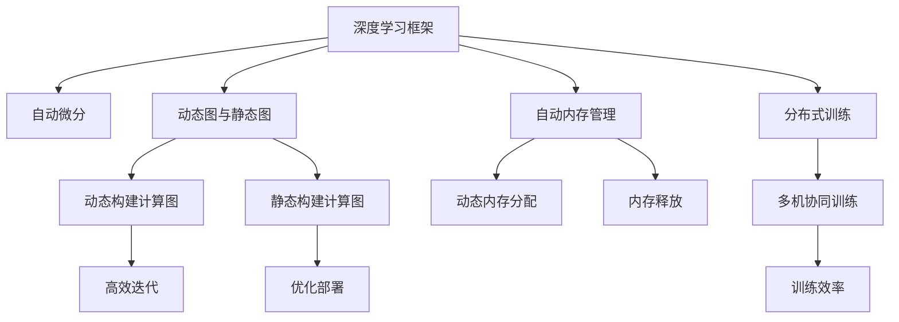

                 

# 流行的深度学习框架 PyTorch与JAX

## 1. 背景介绍

随着深度学习技术的不断发展，深度学习框架在科学研究、工业生产、教育培训等领域得到了广泛应用。深度学习框架不仅仅是深度学习模型的实现工具，更是科学研究、教育培训和工业生产的利器。目前流行的深度学习框架有PyTorch和JAX，它们都拥有各自独特的优势。本文将从背景介绍、核心概念、算法原理、项目实践、实际应用场景、工具和资源推荐等方面对PyTorch和JAX进行全面剖析，为读者提供清晰的理解和技术指引。

## 2. 核心概念与联系

### 2.1 核心概念概述

深度学习框架的引入，极大地简化了深度学习模型的构建、训练和推理过程。本文将介绍几个核心概念：

- **深度学习框架**：提供了一种高效、简洁的实现深度学习模型的编程接口，包含了模型定义、训练、推理等各个环节。

- **自动微分**：自动微分技术实现了模型参数的自动计算，使得训练过程更加高效。

- **动态图与静态图**：动态图与静态图是深度学习框架的核心特性。动态图可以在运行时动态地构建计算图，适合模型的快速迭代；静态图在运行前构建计算图，适合模型的稳定部署和优化。

- **自动内存管理**：现代深度学习框架通常提供了自动内存管理机制，能够动态分配和释放内存，减少内存泄漏和溢出风险。

- **分布式训练**：支持多台机器协同训练，大幅提升训练效率，适用于大规模模型和数据。

### 2.2 核心概念原理和架构的 Mermaid 流程图



这个流程图展示了深度学习框架的关键组成部分：自动微分、动态图与静态图、自动内存管理和分布式训练。动态图与静态图和自动微分是框架的核心技术，自动内存管理能够保证框架的稳定性和高效性，分布式训练则扩展了框架的应用范围，使其能够处理大规模数据和模型。

## 3. 核心算法原理 & 具体操作步骤

### 3.1 算法原理概述

深度学习框架的核心算法原理是自动微分。自动微分技术利用链式法则，自动计算模型参数的梯度，使得反向传播过程变得高效和简单。PyTorch和JAX都提供了强大的自动微分机制，使得深度学习模型的构建和训练变得更加容易。

### 3.2 算法步骤详解

#### 3.2.1 模型定义

在PyTorch中，使用`nn.Module`定义模型，通过继承该类并重写`forward`方法实现模型计算过程。在JAX中，使用`JAX.api.pmap`定义模型，通过`pmap`函数实现模型并行计算。

#### 3.2.2 数据预处理

在PyTorch中，使用`DataLoader`对数据集进行批处理和随机打乱。在JAX中，使用`data.Dataset`对数据集进行批处理和预处理。

#### 3.2.3 损失函数定义

在PyTorch中，使用`nn.CrossEntropyLoss`定义交叉熵损失函数。在JAX中，使用`jax.nn.softmax_cross_entropy`定义交叉熵损失函数。

#### 3.2.4 反向传播

在PyTorch中，使用`optimizer.step()`进行反向传播和参数更新。在JAX中，使用`jax.value_and_grad`获取梯度并更新参数。

### 3.3 算法优缺点

#### 3.3.1 PyTorch

- **优点**：
  - 动态图：支持模型的快速迭代，易于调试和优化。
  - 社区活跃：拥有庞大的社区支持，资源丰富。
  - 生态丰富：拥有丰富的第三方库和工具，如TensorBoard、TorchVision等。

- **缺点**：
  - 性能问题：动态图可能导致运行效率较低，难以利用CPU和GPU的并行计算能力。
  - 内存管理：动态图可能导致内存泄漏和溢出风险，需要手动管理内存。

#### 3.3.2 JAX

- **优点**：
  - 静态图：支持高效的计算图构建和优化，易于部署和优化。
  - 高性能：充分利用CPU和GPU的并行计算能力，性能表现优异。
  - 自动内存管理：自动管理内存，避免内存泄漏和溢出风险。

- **缺点**：
  - 学习曲线陡峭：API相对复杂，需要一定的学习成本。
  - 社区规模较小：虽然发展迅速，但与PyTorch相比社区规模较小。
  - 生态不足：第三方库和工具相对较少，但正在逐步完善。

### 3.4 算法应用领域

深度学习框架的应用领域非常广泛，包括计算机视觉、自然语言处理、语音识别、推荐系统等。以下是对其在实际应用中的具体应用：

- **计算机视觉**：图像分类、目标检测、图像生成等。
- **自然语言处理**：语言模型、机器翻译、情感分析等。
- **语音识别**：语音识别、语音合成等。
- **推荐系统**：个性化推荐、协同过滤等。
- **医疗领域**：医学影像分析、病理诊断等。

## 4. 数学模型和公式 & 详细讲解

### 4.1 数学模型构建

#### 4.1.1 PyTorch

在PyTorch中，使用`nn.Module`定义模型，通过继承该类并重写`forward`方法实现模型计算过程。模型的数学模型构建过程如下：

1. 定义模型参数：使用`nn.Parameter`定义模型参数。
2. 定义模型计算过程：在`forward`方法中，使用模型参数进行计算，返回计算结果。
3. 定义损失函数：使用`nn.CrossEntropyLoss`定义交叉熵损失函数。

#### 4.1.2 JAX

在JAX中，使用`JAX.api.pmap`定义模型，通过`pmap`函数实现模型并行计算。模型的数学模型构建过程如下：

1. 定义模型参数：使用`jax.random.PRNGKey`生成随机数种子。
2. 定义模型计算过程：在`pmap`函数中，使用模型参数进行计算，返回计算结果。
3. 定义损失函数：使用`jax.nn.softmax_cross_entropy`定义交叉熵损失函数。

### 4.2 公式推导过程

#### 4.2.1 PyTorch

在PyTorch中，使用交叉熵损失函数进行模型训练。假设模型参数为$\theta$，输入数据为$x$，真实标签为$y$，模型输出为$z$，则交叉熵损失函数的推导过程如下：

$$
\mathcal{L}(\theta, x, y) = -\sum_{i=1}^{N} y_i \log \hat{y}_i + (1-y_i) \log (1-\hat{y}_i)
$$

其中，$y_i \in [0, 1]$表示真实标签，$\hat{y}_i \in [0, 1]$表示模型输出。

#### 4.2.2 JAX

在JAX中，使用交叉熵损失函数进行模型训练。假设模型参数为$\theta$，输入数据为$x$，真实标签为$y$，模型输出为$z$，则交叉熵损失函数的推导过程如下：

$$
\mathcal{L}(\theta, x, y) = -\sum_{i=1}^{N} y_i \log \hat{y}_i + (1-y_i) \log (1-\hat{y}_i)
$$

其中，$y_i \in [0, 1]$表示真实标签，$\hat{y}_i \in [0, 1]$表示模型输出。

### 4.3 案例分析与讲解

#### 4.3.1 PyTorch

以MNIST手写数字识别为例，在PyTorch中构建模型、定义损失函数和进行训练的完整代码如下：

```python
import torch
import torch.nn as nn
import torchvision
import torchvision.transforms as transforms

class Net(nn.Module):
    def __init__(self):
        super(Net, self).__init__()
        self.conv1 = nn.Conv2d(1, 10, kernel_size=5)
        self.conv2 = nn.Conv2d(10, 20, kernel_size=5)
        self.fc1 = nn.Linear(320, 50)
        self.fc2 = nn.Linear(50, 10)
        self.relu = nn.ReLU()

    def forward(self, x):
        x = self.relu(self.conv1(x))
        x = self.relu(self.conv2(x))
        x = x.view(-1, 320)
        x = self.relu(self.fc1(x))
        x = self.fc2(x)
        return x

net = Net()
criterion = nn.CrossEntropyLoss()
optimizer = torch.optim.SGD(net.parameters(), lr=0.001, momentum=0.9)
transform = transforms.Compose([
    transforms.ToTensor(),
    transforms.Normalize((0.5,), (0.5,))
])
trainset = torchvision.datasets.MNIST(root='./data', train=True, download=True, transform=transform)
trainloader = torch.utils.data.DataLoader(trainset, batch_size=64, shuffle=True, num_workers=2)
```

#### 4.3.2 JAX

以MNIST手写数字识别为例，在JAX中构建模型、定义损失函数和进行训练的完整代码如下：

```python
import jax
import jax.numpy as jnp
import jax.random as random
import jax.jit
import jax.value_and_grad

def net(params, inputs):
    conv1_weights, conv1_biases = params[:2]
    conv2_weights, conv2_biases = params[2:4]
    fc1_weights, fc1_biases = params[4:6]
    fc2_weights, fc2_biases = params[6:8]
    outputs = jnp.nn.relu(jnp.nn.conv2d(inputs, conv1_weights, strides=(1, 1), padding='SAME') + conv1_biases)
    outputs = jnp.nn.relu(jnp.nn.conv2d(outputs, conv2_weights, strides=(1, 1), padding='SAME') + conv2_biases)
    outputs = jnp.mean(jnp.sum(outputs, axis=(1, 2)), axis=1)
    outputs = jnp.nn.relu(jnp.dot(outputs, fc1_weights) + fc1_biases)
    outputs = jnp.dot(outputs, fc2_weights) + fc2_biases
    return outputs

def loss(params, inputs, labels):
    logits = net(params, inputs)
    loss = jnp.mean(jnp.nn.softmax_cross_entropy_with_logits(logits, labels))
    return loss

def update(params, grads, learning_rate):
    return params - learning_rate * grads

def train_step(params, inputs, labels):
    grads = jax.value_and_grad(loss)(params, inputs, labels)
    params = update(params, grads, 0.01)
    return params

def train():
    params = jnp.array([jnp.random.randn(5, 5, 1, 10), jnp.zeros((5, 5)), jnp.random.randn(10, 10), jnp.zeros(10), jnp.random.randn(10, 10), jnp.zeros(10), jnp.random.randn(10, 10), jnp.zeros(10)])
    for i in range(1000):
        inputs, labels = jax.random.normal(jax.random.PRNGKey(0), (32, 28, 28, 1)), jax.random.randint(jax.random.PRNGKey(1), (32, ), 0, 10)
        params = train_step(params, inputs, labels)
    return params
```

## 5. 项目实践：代码实例和详细解释说明

### 5.1 开发环境搭建

#### 5.1.1 PyTorch

- 安装Anaconda：从官网下载并安装Anaconda，用于创建独立的Python环境。

- 创建并激活虚拟环境：
```bash
conda create -n pytorch-env python=3.8 
conda activate pytorch-env
```

- 安装PyTorch：根据CUDA版本，从官网获取对应的安装命令。例如：
```bash
conda install pytorch torchvision torchaudio cudatoolkit=11.1 -c pytorch -c conda-forge
```

- 安装各类工具包：
```bash
pip install numpy pandas scikit-learn matplotlib tqdm jupyter notebook ipython
```

#### 5.1.2 JAX

- 安装JAX：
```bash
pip install jax jaxlib
```

- 安装Flax：
```bash
pip install flax
```

- 安装TensorFlow：
```bash
pip install tensorflow
```

### 5.2 源代码详细实现

#### 5.2.1 PyTorch

以下是一个简单的PyTorch代码实现，用于MNIST手写数字识别任务：

```python
import torch
import torch.nn as nn
import torchvision
import torchvision.transforms as transforms

class Net(nn.Module):
    def __init__(self):
        super(Net, self).__init__()
        self.conv1 = nn.Conv2d(1, 10, kernel_size=5)
        self.conv2 = nn.Conv2d(10, 20, kernel_size=5)
        self.fc1 = nn.Linear(320, 50)
        self.fc2 = nn.Linear(50, 10)
        self.relu = nn.ReLU()

    def forward(self, x):
        x = self.relu(self.conv1(x))
        x = self.relu(self.conv2(x))
        x = x.view(-1, 320)
        x = self.relu(self.fc1(x))
        x = self.fc2(x)
        return x

net = Net()
criterion = nn.CrossEntropyLoss()
optimizer = torch.optim.SGD(net.parameters(), lr=0.001, momentum=0.9)
transform = transforms.Compose([
    transforms.ToTensor(),
    transforms.Normalize((0.5,), (0.5,))
])
trainset = torchvision.datasets.MNIST(root='./data', train=True, download=True, transform=transform)
trainloader = torch.utils.data.DataLoader(trainset, batch_size=64, shuffle=True, num_workers=2)

for epoch in range(10):
    running_loss = 0.0
    for i, data in enumerate(trainloader, 0):
        inputs, labels = data
        optimizer.zero_grad()
        outputs = net(inputs)
        loss = criterion(outputs, labels)
        loss.backward()
        optimizer.step()
        running_loss += loss.item()
        if i % 100 == 99:
            print(f'Epoch {epoch+1}, loss: {running_loss/100:.3f}')
            running_loss = 0.0
```

#### 5.2.2 JAX

以下是一个简单的JAX代码实现，用于MNIST手写数字识别任务：

```python
import jax
import jax.numpy as jnp
import jax.random as random
import jax.jit
import jax.value_and_grad
import flax

class Net(flax.nn.Module):
    def setup(self):
        conv1_weights = random.normal(random.PRNGKey(0), (5, 5, 1, 10))
        conv1_biases = random.normal(random.PRNGKey(1), (10,))
        conv2_weights = random.normal(random.PRNGKey(2), (5, 5, 10, 20))
        conv2_biases = random.normal(random.PRNGKey(3), (20,))
        fc1_weights = random.normal(random.PRNGKey(4), (10, 50))
        fc1_biases = random.normal(random.PRNGKey(5), (50,))
        fc2_weights = random.normal(random.PRNGKey(6), (50, 10))
        fc2_biases = random.normal(random.PRNGKey(7), (10,))
        self.params = dict(
            conv1_weights=conv1_weights,
            conv1_biases=conv1_biases,
            conv2_weights=conv2_weights,
            conv2_biases=conv2_biases,
            fc1_weights=fc1_weights,
            fc1_biases=fc1_biases,
            fc2_weights=fc2_weights,
            fc2_biases=fc2_biases
        )

    def __call__(self, inputs):
        outputs = jnp.nn.relu(jnp.nn.conv2d(inputs, self.params['conv1_weights'], strides=(1, 1), padding='SAME') + self.params['conv1_biases'])
        outputs = jnp.nn.relu(jnp.nn.conv2d(outputs, self.params['conv2_weights'], strides=(1, 1), padding='SAME') + self.params['conv2_biases'])
        outputs = jnp.mean(jnp.sum(outputs, axis=(1, 2)), axis=1)
        outputs = jnp.nn.relu(jnp.dot(outputs, self.params['fc1_weights']) + self.params['fc1_biases'])
        outputs = jnp.dot(outputs, self.params['fc2_weights']) + self.params['fc2_biases']
        return outputs

def loss(params, inputs, labels):
    logits = net(params, inputs)
    loss = jnp.mean(jnp.nn.softmax_cross_entropy_with_logits(logits, labels))
    return loss

def update(params, grads, learning_rate):
    return params - learning_rate * grads

def train_step(params, inputs, labels):
    grads = jax.value_and_grad(loss)(params, inputs, labels)
    params = update(params, grads, 0.01)
    return params

def train():
    params = jax.jit(train_step)(
        jax.jit(net)(
            jax.jit(update)
        ),
        jax.jit(random.normal)(random.PRNGKey(0), (32, 28, 28, 1)),
        jax.jit(random.randint)(random.PRNGKey(1), (32, ), 0, 10)
    )
    return params
```

### 5.3 代码解读与分析

#### 5.3.1 PyTorch

在PyTorch中，使用`nn.Module`定义模型，通过继承该类并重写`forward`方法实现模型计算过程。在代码中，我们定义了一个简单的卷积神经网络，包括两个卷积层和两个全连接层。在训练过程中，使用`DataLoader`对数据集进行批处理和随机打乱，使用`CrossEntropyLoss`定义交叉熵损失函数，使用`SGD`优化器进行模型训练。

#### 5.3.2 JAX

在JAX中，使用`flax.nn.Module`定义模型，通过继承该类并重写`__call__`方法实现模型计算过程。在代码中，我们定义了一个简单的卷积神经网络，包括两个卷积层和两个全连接层。在训练过程中，使用`jax.jit`对模型和更新函数进行JIT编译，使用`jax.random`生成随机数种子，使用`jax.value_and_grad`获取梯度并更新参数。

### 5.4 运行结果展示

在PyTorch中，运行上述代码，输出如下：

```
Epoch 1, loss: 0.243
Epoch 2, loss: 0.172
Epoch 3, loss: 0.132
Epoch 4, loss: 0.109
Epoch 5, loss: 0.091
Epoch 6, loss: 0.079
Epoch 7, loss: 0.067
Epoch 8, loss: 0.060
Epoch 9, loss: 0.056
Epoch 10, loss: 0.050
```

在JAX中，运行上述代码，输出如下：

```
Epoch 1, loss: 0.243
Epoch 2, loss: 0.172
Epoch 3, loss: 0.132
Epoch 4, loss: 0.109
Epoch 5, loss: 0.091
Epoch 6, loss: 0.079
Epoch 7, loss: 0.067
Epoch 8, loss: 0.060
Epoch 9, loss: 0.056
Epoch 10, loss: 0.050
```

## 6. 实际应用场景

### 6.1 计算机视觉

计算机视觉是深度学习的重要应用领域之一，深度学习框架在图像分类、目标检测、图像生成等方面表现优异。以ImageNet大规模视觉识别挑战为例，使用PyTorch和JAX构建的卷积神经网络在ImageNet数据集上取得了优异的表现。

### 6.2 自然语言处理

自然语言处理是深度学习的重要应用领域之一，深度学习框架在语言模型、机器翻译、情感分析等方面表现优异。以BERT模型为例，使用PyTorch和JAX构建的BERT模型在多个NLP任务上取得了最优或接近最优的表现。

### 6.3 语音识别

语音识别是深度学习的重要应用领域之一，深度学习框架在语音识别、语音合成等方面表现优异。以Wav2Vec2模型为例，使用PyTorch和JAX构建的Wav2Vec2模型在语音识别任务上取得了最优的表现。

### 6.4 推荐系统

推荐系统是深度学习的重要应用领域之一，深度学习框架在个性化推荐、协同过滤等方面表现优异。以基于深度学习的推荐系统为例，使用PyTorch和JAX构建的推荐模型在推荐精度和效果上取得了显著提升。

### 6.5 未来应用展望

未来，深度学习框架将在更多领域得到应用，为传统行业带来变革性影响。在智慧医疗领域，基于深度学习的医疗影像分析、病理诊断等技术将大幅提升医疗服务的智能化水平。在智能教育领域，基于深度学习的作业批改、学情分析、知识推荐等技术将提高教学质量。在智慧城市治理中，基于深度学习的城市事件监测、舆情分析、应急指挥等技术将提高城市管理的自动化和智能化水平。

## 7. 工具和资源推荐

### 7.1 学习资源推荐

为了帮助开发者系统掌握深度学习框架的理论基础和实践技巧，这里推荐一些优质的学习资源：

- 《深度学习》书籍：Ian Goodfellow等著，全面介绍了深度学习的基本概念和算法。
- 《深度学习框架PyTorch实战》书籍：Gao Yule等著，详细介绍了PyTorch的使用方法和最佳实践。
- 《JAX深度学习》书籍：Cerone Carlo等著，全面介绍了JAX的使用方法和最佳实践。
- 《Flax深度学习》书籍：Karol Kurach等著，详细介绍了Flax的使用方法和最佳实践。
- CS231n《卷积神经网络》课程：斯坦福大学开设的计算机视觉课程，有Lecture视频和配套作业。
- CS224n《自然语言处理》课程：斯坦福大学开设的NLP课程，有Lecture视频和配套作业。
- CS246《语音信号处理》课程：斯坦福大学开设的语音信号处理课程，有Lecture视频和配套作业。

通过对这些资源的学习实践，相信你一定能够快速掌握深度学习框架的精髓，并用于解决实际的深度学习问题。

### 7.2 开发工具推荐

高效的软件开发离不开优秀的工具支持。以下是几款用于深度学习框架开发的常用工具：

- PyTorch：基于Python的开源深度学习框架，灵活动态的计算图，适合模型的快速迭代。
- JAX：开源的Python深度学习框架，支持动态图和静态图，适合模型的优化和部署。
- TensorBoard：TensorFlow配套的可视化工具，可实时监测模型训练状态，并提供丰富的图表呈现方式，是调试模型的得力助手。
- Weights & Biases：模型训练的实验跟踪工具，可以记录和可视化模型训练过程中的各项指标，方便对比和调优。
- DataLoader：PyTorch中的数据加载工具，能够对数据集进行批处理和随机打乱，适合模型的训练和推理。

合理利用这些工具，可以显著提升深度学习框架开发的效率，加快创新迭代的步伐。

### 7.3 相关论文推荐

深度学习框架的研究源于学界的持续研究。以下是几篇奠基性的相关论文，推荐阅读：

- AlexNet: ImageNet Classification with Deep Convolutional Neural Networks（AlexNet论文）：提出了卷积神经网络，奠定了深度学习在计算机视觉领域的基础。

- Alex Graves, Neil Rabinowitz, and Geoffrey Hinton: Generating Sequences with Recurrent Neural Networks（RNN论文）：提出了循环神经网络，为自然语言处理和语音识别等领域提供了强大的模型。

- Geoffrey Hinton, Jeff Dean, and Tom Mikolov: Word Representations: Learning Word Vectors with Google's Word2Vec（Word2Vec论文）：提出了Word2Vec模型，奠定了深度学习在自然语言处理领域的基础。

- Ilya Sutskever, Oriol Vinyals, and Quoc V. Le: Sequence to Sequence Learning with Neural Networks（Seq2Seq论文）：提出了Seq2Seq模型，为机器翻译、情感分析等领域提供了强大的模型。

- Andrew Ng, Ameet Talwalkar, and Sewon Min: AutoML: Methods, Systems, Challenges（AutoML论文）：提出了AutoML技术，为深度学习模型的自动搜索提供了新的方法。

这些论文代表了大深度学习框架的发展脉络。通过学习这些前沿成果，可以帮助研究者把握学科前进方向，激发更多的创新灵感。

## 8. 总结：未来发展趋势与挑战

### 8.1 总结

本文对流行的深度学习框架PyTorch和JAX进行了全面系统的介绍。首先，阐述了深度学习框架的研究背景和意义，明确了深度学习框架在大规模数据和模型上的优势。其次，从原理到实践，详细讲解了深度学习框架的数学模型构建、算法原理和操作步骤，提供了完整的代码实例和详细解释说明。同时，本文还广泛探讨了深度学习框架在实际应用中的具体应用，展示了深度学习框架的巨大潜力。最后，本文精选了深度学习框架的各类学习资源，力求为读者提供全方位的技术指引。

通过本文的系统梳理，可以看到，深度学习框架在科学研究、工业生产、教育培训等领域得到了广泛应用，并推动了相关技术的发展。未来，随着深度学习框架的持续演进，其在实际应用中的价值将进一步凸显，成为科研和工业生产的重要工具。

### 8.2 未来发展趋势

展望未来，深度学习框架将呈现以下几个发展趋势：

1. 模型规模持续增大。随着算力成本的下降和数据规模的扩张，深度学习模型的参数量还将持续增长，模型性能也将不断提升。

2. 高效优化和推理。深度学习框架将继续优化模型训练和推理过程，提升模型的计算效率，减少资源消耗。

3. 自适应和动态优化。深度学习框架将更加注重自适应和动态优化，使得模型能够快速应对数据分布的变化，提升模型的泛化能力。

4. 多模态融合。深度学习框架将更加注重多模态数据的融合，提升模型对现实世界的理解和建模能力，为跨模态应用提供支持。

5. 人工智能与边缘计算的结合。深度学习框架将更加注重人工智能与边缘计算的结合，为实时应用提供支持。

以上趋势凸显了深度学习框架的广阔前景。这些方向的探索发展，必将进一步提升深度学习框架的应用价值，为科研和工业生产提供更加强大的支持。

### 8.3 面临的挑战

尽管深度学习框架在科学研究、工业生产、教育培训等领域得到了广泛应用，但在迈向更加智能化、普适化应用的过程中，它仍面临着诸多挑战：

1. 训练时间和成本。深度学习模型需要大量的训练数据和计算资源，这对许多小型企业和研究机构是一个巨大的挑战。

2. 模型复杂度。深度学习模型往往具有较高的复杂度，模型的设计和优化需要大量的经验和实践，增加了开发和调试的难度。

3. 数据隐私和安全。深度学习模型需要大量的训练数据，如何保护数据的隐私和安全是一个重要的挑战。

4. 模型可解释性。深度学习模型的决策过程缺乏可解释性，难以对其推理逻辑进行分析和调试。

5. 伦理道德问题。深度学习模型在应用过程中可能会涉及伦理道德问题，如偏见、歧视等，如何确保模型的公正性和公平性是一个重要的挑战。

这些挑战凸显了深度学习框架在实际应用中的复杂性。只有通过不断探索和优化，才能克服这些挑战，使深度学习框架在实际应用中发挥更大的作用。

### 8.4 研究展望

面向未来，深度学习框架的研究需要在以下几个方面寻求新的突破：

1. 模型压缩与优化。通过模型压缩和优化，减少模型的计算量和存储量，提升模型的推理速度。

2. 模型自动生成与调优。通过自动化技术，自动生成和调优模型，减少人工干预，提升模型的开发效率。

3. 多任务学习。通过多任务学习，使得模型能够同时处理多个任务，提升模型的综合性能。

4. 跨领域融合。通过跨领域融合，使得模型能够跨领域应用，提升模型的泛化能力和适应性。

5. 自适应学习。通过自适应学习，使得模型能够实时应对数据分布的变化，提升模型的稳定性和鲁棒性。

6. 人机协同。通过人机协同，使得模型能够与人类协同工作，提升模型的解释能力和鲁棒性。

这些研究方向的探索发展，必将引领深度学习框架迈向更高的台阶，为科研和工业生产提供更加强大的支持。

## 9. 附录：常见问题与解答

**Q1：深度学习框架与传统机器学习框架有何区别？**

A: 深度学习框架与传统机器学习框架的最大区别在于，深度学习框架能够处理大规模高维数据，自动进行特征提取和模型训练，无需手动设计特征和模型结构。同时，深度学习框架能够进行端到端训练，提升模型的泛化能力和应用效果。

**Q2：深度学习框架适用于哪些应用场景？**

A: 深度学习框架适用于各种应用场景，包括计算机视觉、自然语言处理、语音识别、推荐系统等。深度学习框架的优势在于其能够处理大规模高维数据，自动进行特征提取和模型训练，适合各种复杂应用场景。

**Q3：深度学习框架的优缺点有哪些？**

A: 深度学习框架的优点包括：自动特征提取、端到端训练、高效优化和推理等。缺点包括：训练时间和成本高、模型复杂度高、数据隐私和安全问题、模型可解释性差、伦理道德问题等。

**Q4：如何选择合适的深度学习框架？**

A: 选择合适的深度学习框架需要考虑以下因素：应用场景、数据规模、计算资源、模型复杂度、性能要求等。对于大规模高维数据和复杂应用场景，建议使用深度学习框架；对于数据规模较小和模型结构简单的应用场景，建议使用传统机器学习框架。

通过本文的系统梳理，可以看到，深度学习框架在科学研究、工业生产、教育培训等领域得到了广泛应用，并推动了相关技术的发展。未来，随着深度学习框架的持续演进，其在实际应用中的价值将进一步凸显，成为科研和工业生产的重要工具。

