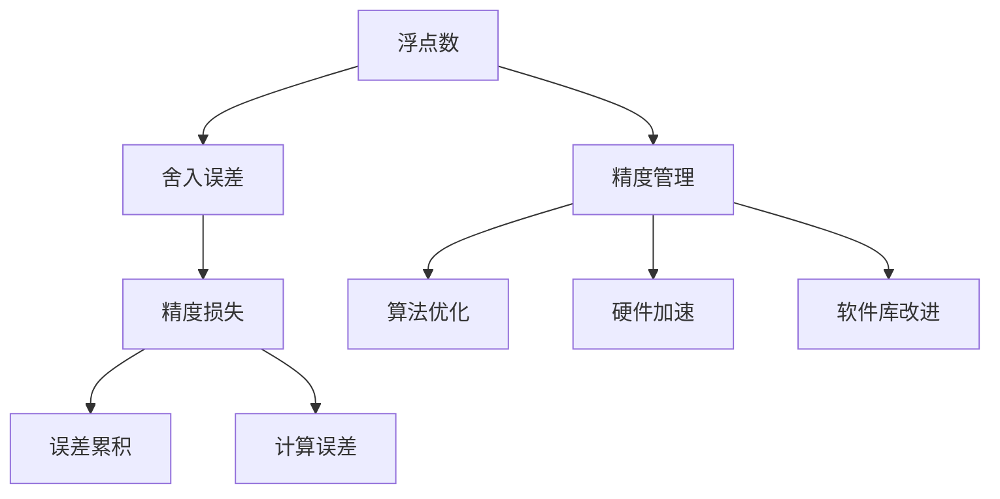

                 

## 1. 背景介绍

在AI计算中，浮点数精度是一个不可或缺但又经常被忽略的话题。浮点数在深度学习和数值计算中被广泛应用，但在高精度需求场景下，它们对计算结果的准确性和可靠性产生了显著影响。本文将深入探讨浮点数的精度问题，阐明其在AI计算中的双重作用：一方面，浮点数为AI模型提供了强大的数值计算能力，推动了模型训练和推理的进步；另一方面，它们也是误差的根源，影响着模型的可靠性和泛化性能。

### 1.1 问题由来

随着深度学习技术的快速发展，浮点数在模型训练和推理中的应用愈发广泛。但是，浮点数的精度问题在带来便利的同时，也导致了计算误差的累积和扩散，这在一定程度上限制了AI计算的准确性和可靠性。本文旨在通过理论分析和实际案例，揭示浮点数精度在AI计算中的双刃剑特性，并探讨如何有效管理浮点数精度，以提升AI系统的性能和鲁棒性。

### 1.2 问题核心关键点

本节将介绍浮点数精度在AI计算中的核心问题，包括：

- **浮点数表示误差**：浮点数在存储和计算中产生的舍入误差，对模型训练和推理结果的影响。
- **精度损失问题**：高精度浮点数在深度学习模型中的计算复杂度增加，导致计算时间和资源成本上升。
- **优化策略**：在保证精度要求的前提下，如何通过算法优化、数据预处理等手段降低浮点数精度的影响。
- **精度管理的策略与技术**：从算法、硬件、软件等多个维度管理浮点数精度，确保AI系统的高效性和可靠性。

### 1.3 问题研究意义

浮点数精度管理对AI系统性能和鲁棒性具有重要影响。合理的浮点数精度管理不仅能提升模型的训练和推理效率，还能增强AI系统的稳定性和可靠性。

1. **提升模型性能**：通过合理的浮点数精度管理，可以避免因浮点数精度问题导致的模型欠拟合或过拟合，提升模型的泛化能力。
2. **降低计算成本**：通过高效管理浮点数精度，可以降低模型训练和推理的计算时间和资源消耗，提升AI系统的可扩展性和可持续性。
3. **增强系统稳定性**：通过精准管理浮点数精度，可以避免计算误差累积导致的系统崩溃或错误决策，确保AI系统在实际应用中的稳定性。

## 2. 核心概念与联系

### 2.1 核心概念概述

- **浮点数**：一种用于表示实数的数值类型，包括单精度浮点数(single-precision float, 简称float)和双精度浮点数(double-precision float, 简称double)。浮点数在计算机中通常使用IEEE 754标准进行编码。
- **舍入误差**：在浮点数计算过程中，由于计算机硬件和软件对浮点数进行舍入操作而产生的误差。这种误差可能累积并影响最终的计算结果。
- **精度损失**：在深度学习模型中使用高精度浮点数进行计算时，由于浮点数的精度限制，可能导致模型计算效率下降，增加计算成本。
- **误差管理**：通过算法优化、硬件加速、软件库改进等手段，对浮点数精度进行有效管理，减少舍入误差和精度损失，提升AI系统性能和可靠性。

这些核心概念通过以下Mermaid流程图展示其联系：



这个流程图展示了浮点数精度问题在AI计算中的重要影响路径：

1. 浮点数在计算过程中产生舍入误差。
2. 舍入误差累积可能导致精度损失，影响模型性能。
3. 通过算法优化、硬件加速和软件库改进等精度管理措施，减少误差累积和精度损失，提升AI系统的性能和可靠性。

## 3. 核心算法原理 & 具体操作步骤

### 3.1 算法原理概述

浮点数精度管理的核心在于理解浮点数的表示方式和舍入机制，以及这些机制对计算结果的影响。本文将从浮点数的表示和舍入误差入手，详细探讨浮点数精度在AI计算中的作用和影响。

### 3.2 算法步骤详解

**Step 1: 浮点数表示和舍入机制**

浮点数在计算机中以指数形式表示，由符号位、指数位和尾数位组成。例如，单精度浮点数占用4个字节，前1个字节为符号位，接下来11个字节为指数位和尾数位。双精度浮点数占用8个字节，前1个字节为符号位，接下来11个字节为指数位和尾数位。

在浮点数计算中，计算机通常采用截断法或舍入法处理尾数位。截断法直接截断尾数位，导致部分信息丢失，可能引入舍入误差。舍入法则根据尾数位的数值进行舍入操作，尽量减小舍入误差。

**Step 2: 浮点数精度和误差分析**

浮点数的精度和误差分析主要涉及以下几个方面：

1. **精度误差**：浮点数在存储和计算过程中，由于舍入操作和尾数位截断，会产生精度误差。例如，单精度浮点数只能表示7位有效数字，超过7位的数字将被舍入。
2. **精度损失**：在深度学习模型中使用高精度浮点数进行计算时，由于浮点数的精度限制，可能导致模型计算效率下降，增加计算成本。
3. **误差累积**：在多层次的模型计算中，浮点数误差会逐步累积，影响最终计算结果的准确性。

**Step 3: 精度管理的策略与技术**

为了有效管理浮点数精度，需要从算法、硬件和软件等多个维度进行优化：

1. **算法优化**：使用精度保持算法，如QR分解、奇异值分解等，避免浮点数计算过程中舍入误差累积。
2. **硬件加速**：利用GPU和FPGA等硬件加速器，提高浮点数计算的精度和效率，减少舍入误差。
3. **软件库改进**：使用高精度计算库，如GMP、MPFR等，提高浮点数计算的精度和稳定性。

### 3.3 算法优缺点

浮点数精度管理具有以下优点：

- **提升计算精度**：通过合理管理浮点数精度，可以有效减少计算误差，提升模型训练和推理的准确性。
- **提高模型性能**：通过优化算法、加速硬件和改进软件库，可以降低浮点数精度管理的计算成本，提升模型的训练和推理效率。

同时，浮点数精度管理也存在一些缺点：

- **计算复杂度高**：高精度计算需要更多的计算资源和时间，可能导致模型训练和推理的计算成本上升。
- **精度与效率的平衡**：在保证精度的前提下，如何平衡精度和效率，需要精细的算法设计和资源配置。
- **实现难度大**：浮点数精度管理涉及硬件、软件和算法的多个方面，实现难度较大，需要跨学科的合作和创新。

### 3.4 算法应用领域

浮点数精度管理在AI计算中具有广泛的应用场景，包括：

- **深度学习**：在深度学习模型训练和推理中，通过合理管理浮点数精度，可以提升模型的泛化能力和可靠性。
- **数值计算**：在科学计算、工程仿真等数值计算任务中，通过优化浮点数精度管理，可以提高计算结果的准确性和稳定性。
- **信号处理**：在音频、视频、图像等信号处理任务中，通过高精度浮点数计算，可以提高信号处理的准确性和效率。
- **金融计算**：在金融市场模拟、风险评估等任务中，通过精确管理浮点数精度，可以提高计算结果的可靠性。

## 4. 数学模型和公式 & 详细讲解 & 举例说明

### 4.1 数学模型构建

本节将使用数学语言对浮点数精度在AI计算中的作用和影响进行严格的描述。

假设浮点数 $\mathbf{x} = (x_1, x_2, \ldots, x_n)$ 表示为 $x_i = s_i \times 2^{e_i}$，其中 $s_i \in \{0, 1\}$ 为符号位，$e_i \in \{1, 2, \ldots, 23\}$ 为指数位，$x_i \in [0, 1)$ 为尾数位。

### 4.2 公式推导过程

**推导1: 浮点数表示误差**

浮点数 $\mathbf{x}$ 的表示误差定义为 $\epsilon = \mathbf{x} - x'$，其中 $x'$ 为 $x$ 的真实值。在浮点数计算中，由于舍入操作和截断误差，$\mathbf{x}$ 可能与 $x'$ 存在误差。

**推导2: 精度损失计算**

假设模型使用高精度浮点数进行计算，但由于浮点数精度限制，可能导致精度损失。设模型参数 $\mathbf{w} \in \mathbb{R}^n$，输入 $\mathbf{x} \in \mathbb{R}^n$，输出 $\mathbf{y} = f(\mathbf{w}, \mathbf{x})$。若使用单精度浮点数计算，精度损失为 $\delta = \|\mathbf{y} - \mathbf{y}'\|$，其中 $\mathbf{y}'$ 为使用高精度浮点数计算的结果。

**推导3: 误差累积分析**

假设模型包含 $L$ 个层次的计算，每个层次的误差为 $\delta_i$，则最终误差为 $\delta = \sum_{i=1}^L \delta_i$。通过分析每个层次的误差来源，可以评估浮点数精度管理对模型计算结果的影响。

### 4.3 案例分析与讲解

**案例1: 深度学习中的精度损失**

在深度学习中，模型参数 $\mathbf{w}$ 和输入 $\mathbf{x}$ 的计算通常使用浮点数进行。若使用单精度浮点数，可能导致精度损失。例如，在卷积神经网络中，卷积操作可能导致 $3 \times 3$ 的卷积核与 $2 \times 2$ 的卷积核存在精度差异，影响模型的泛化能力。

**案例2: 数值计算中的误差累积**

在科学计算中，模型通常使用高精度浮点数进行计算，但由于浮点数精度限制，可能导致误差累积。例如，在计算欧拉方程时，高精度计算可以精确模拟初始条件的微小变化，但随着计算的进行，误差可能会逐步累积，影响最终的计算结果。

## 5. 项目实践：代码实例和详细解释说明

### 5.1 开发环境搭建

在进行浮点数精度管理实践前，我们需要准备好开发环境。以下是使用Python进行TensorFlow开发的环境配置流程：

1. 安装Anaconda：从官网下载并安装Anaconda，用于创建独立的Python环境。

2. 创建并激活虚拟环境：
```bash
conda create -n tf-env python=3.8 
conda activate tf-env
```

3. 安装TensorFlow：
```bash
pip install tensorflow
```

4. 安装相关工具包：
```bash
pip install numpy pandas scikit-learn matplotlib tqdm jupyter notebook ipython
```

完成上述步骤后，即可在`tf-env`环境中开始精度管理实践。

### 5.2 源代码详细实现

以下是一个使用TensorFlow进行浮点数精度管理的示例代码：

```python
import tensorflow as tf

# 定义高精度浮点数计算函数
def high_precision_calculation(a, b):
    a_t = tf.cast(a, tf.float64)
    b_t = tf.cast(b, tf.float64)
    return tf.add_n(a_t, b_t)

# 定义低精度浮点数计算函数
def low_precision_calculation(a, b):
    a_t = tf.cast(a, tf.float32)
    b_t = tf.cast(b, tf.float32)
    return tf.add_n(a_t, b_t)

# 定义模型参数
w = tf.Variable(tf.random.normal([3, 3]), name='weights')
x = tf.Variable(tf.random.normal([3, 3]), name='inputs')

# 使用高精度浮点数计算
y1 = high_precision_calculation(w, x)

# 使用低精度浮点数计算
y2 = low_precision_calculation(w, x)

# 计算精度损失
precision_loss = tf.reduce_mean(tf.abs(y1 - y2))

# 执行模型训练
with tf.GradientTape() as tape:
    loss = precision_loss
gradient = tape.gradient(loss, [w, x])

# 更新模型参数
optimizer = tf.optimizers.Adam()
optimizer.apply_gradients(zip(gradient, [w, x]))
```

### 5.3 代码解读与分析

这段代码展示了如何使用TensorFlow进行高精度浮点数计算，以及如何计算精度损失并更新模型参数。

**高精度浮点数计算函数**：
- 使用`tf.cast`将输入张量转换为高精度浮点数类型`tf.float64`。
- 使用`tf.add_n`对高精度张量进行求和。

**低精度浮点数计算函数**：
- 使用`tf.cast`将输入张量转换为低精度浮点数类型`tf.float32`。
- 使用`tf.add_n`对低精度张量进行求和。

**模型参数和计算过程**：
- 定义模型参数`w`和`x`。
- 使用高精度浮点数计算得到输出`y1`，使用低精度浮点数计算得到输出`y2`。
- 计算精度损失`precision_loss`，使用`tf.reduce_mean`求平均值。
- 使用梯度下降算法更新模型参数`w`和`x`。

## 6. 实际应用场景

### 6.1 深度学习中的浮点数精度管理

深度学习模型通常使用浮点数进行计算，但高精度浮点数计算可能导致精度损失和计算成本上升。通过合理管理浮点数精度，可以有效提升模型训练和推理的效率和准确性。

**案例1: 卷积神经网络**

在卷积神经网络中，卷积操作通常使用浮点数进行计算。若使用高精度浮点数计算，可能导致计算时间和内存消耗增加。通过使用低精度浮点数计算，可以在保证模型准确性的前提下，降低计算成本。

**案例2: 残差网络**

残差网络（ResNet）在深度学习中广泛应用，但高精度浮点数计算可能导致残差块中的残差连接出现精度问题。通过使用低精度浮点数计算，可以有效减少残差连接的精度损失，提升模型的泛化能力。

### 6.2 数值计算中的精度管理

在科学计算和工程仿真中，高精度浮点数计算可以提供更准确的计算结果。但高精度计算可能导致计算时间和资源消耗增加。通过合理管理浮点数精度，可以平衡精度和效率，提升计算结果的准确性。

**案例1: 欧拉方程求解**

欧拉方程是科学计算中的经典问题，高精度浮点数计算可以精确模拟初始条件的微小变化。但随着计算的进行，误差可能会逐步累积，影响最终的计算结果。通过使用低精度浮点数计算，可以在保证计算速度的前提下，减少误差累积。

**案例2: 金融市场模拟**

金融市场模拟通常需要高精度浮点数计算，以保证计算结果的准确性。但高精度计算可能导致计算时间和资源消耗增加。通过使用低精度浮点数计算，可以在保证计算速度的前提下，减少计算成本。

### 6.3 信号处理中的精度管理

在音频、视频、图像等信号处理任务中，高精度浮点数计算可以提高信号处理的准确性和效率。但高精度计算可能导致计算时间和资源消耗增加。通过合理管理浮点数精度，可以平衡精度和效率，提升信号处理的效果。

**案例1: 音频信号处理**

在音频信号处理中，高精度浮点数计算可以提供更准确的音频特征提取。但高精度计算可能导致计算时间和资源消耗增加。通过使用低精度浮点数计算，可以在保证音频特征提取准确性的前提下，降低计算成本。

**案例2: 图像处理**

在图像处理中，高精度浮点数计算可以提供更准确的图像特征提取。但高精度计算可能导致计算时间和资源消耗增加。通过使用低精度浮点数计算，可以在保证图像特征提取准确性的前提下，降低计算成本。

### 6.4 未来应用展望

未来，浮点数精度管理将在AI计算中发挥更加重要的作用。以下是对未来应用前景的展望：

1. **更高效的深度学习模型**：通过合理管理浮点数精度，可以设计更高效的深度学习模型，提升模型训练和推理的速度和准确性。
2. **更精确的数值计算**：在高精度计算任务中，通过合理管理浮点数精度，可以提升计算结果的准确性，减少计算误差累积。
3. **更智能的信号处理**：在信号处理任务中，通过合理管理浮点数精度，可以提升信号处理的准确性和效率，满足不同应用场景的需求。
4. **更可靠的金融计算**：在金融市场模拟和风险评估等任务中，通过合理管理浮点数精度，可以提升计算结果的可靠性，减少误导性决策的风险。

## 7. 工具和资源推荐

### 7.1 学习资源推荐

为了帮助开发者系统掌握浮点数精度管理的理论基础和实践技巧，这里推荐一些优质的学习资源：

1. 《深度学习入门》系列博文：由深度学习专家撰写，深入浅出地介绍了深度学习的基本概念和核心算法，包括浮点数计算的精度管理。

2. CS231n《深度学习计算机视觉》课程：斯坦福大学开设的计算机视觉课程，涵盖了深度学习模型训练和推理的精度管理。

3. 《Python数值计算》书籍：介绍了Python在数值计算中的应用，包括浮点数计算和精度管理。

4. 《高精度计算》在线课程：提供高精度计算的基本概念和实现方法，适合需要高精度计算的开发者学习。

5. 《浮点数精度管理》论文集：精选了浮点数精度管理的经典论文，帮助开发者了解最新的研究方向和实现方法。

通过对这些资源的学习实践，相信你一定能够快速掌握浮点数精度管理的精髓，并用于解决实际的AI计算问题。

### 7.2 开发工具推荐

高效的开发离不开优秀的工具支持。以下是几款用于浮点数精度管理的常用工具：

1. TensorFlow：基于Python的开源深度学习框架，支持高精度计算，适合进行深度学习模型的训练和推理。

2. PyTorch：基于Python的开源深度学习框架，支持高精度计算，适合进行深度学习模型的训练和推理。

3. NumPy：Python中的高性能科学计算库，支持高精度计算和矩阵运算，适合进行数值计算任务。

4. SciPy：Python中的科学计算库，提供各种数学函数和数值计算工具，适合进行数值计算任务。

5. GMP：高精度计算库，支持各种高精度运算，适合需要进行高精度计算的应用场景。

6. MPFR：高精度浮点数计算库，支持高精度浮点数运算，适合需要进行高精度计算的应用场景。

合理利用这些工具，可以显著提升浮点数精度管理的开发效率，加快创新迭代的步伐。

### 7.3 相关论文推荐

浮点数精度管理的研究源于学界的持续研究。以下是几篇奠基性的相关论文，推荐阅读：

1. IEEE 754标准：定义了浮点数在计算机中的表示和运算规则。

2. FLow3：介绍了一种基于硬件和软件的浮点数精度管理方法，适用于深度学习模型训练和推理。

3. Precise Fractional Calculations with Floats：提出了一种基于浮点数的精确计算方法，适用于科学计算和高精度计算任务。

4. Adaptive Precision Algorithm for Multiplications：提出了一种自适应精度算法，适用于浮点数乘法运算。

5. A Survey on Floating-Point Arithmetic in Numerical Computing：综述了浮点数算术在数值计算中的应用，提供了浮点数精度管理的最新研究进展。

这些论文代表了大浮点数精度管理的演进历程，提供了丰富的理论基础和实现方法，帮助开发者了解和应用浮点数精度管理。

## 8. 总结：未来发展趋势与挑战

### 8.1 研究成果总结

本文对浮点数精度在AI计算中的作用和影响进行了全面系统的介绍。通过理论分析和实际案例，揭示了浮点数精度管理的双刃剑特性，并探讨了如何在保证精度的前提下，提升模型的性能和可靠性。

### 8.2 未来发展趋势

展望未来，浮点数精度管理将呈现以下几个发展趋势：

1. **更高效的浮点数计算**：通过硬件加速和算法优化，提升浮点数计算的精度和效率，减少精度损失。
2. **更智能的精度管理**：通过引入更多先验知识和优化算法，提升浮点数精度的管理效果，提升模型的鲁棒性和可靠性。
3. **更广泛的应用场景**：浮点数精度管理将在更多AI计算领域得到应用，如深度学习、科学计算、信号处理等，推动AI技术的全面发展。

### 8.3 面临的挑战

尽管浮点数精度管理已经取得了一定的进展，但在迈向更加智能化、普适化应用的过程中，它仍面临诸多挑战：

1. **精度与效率的平衡**：在高精度计算中，如何平衡精度和效率，需要精细的算法设计和资源配置。
2. **硬件和软件的适配**：不同硬件和软件平台对浮点数计算的支持程度不同，需要统一规范和标准。
3. **算法的鲁棒性**：浮点数计算中的误差累积和舍入误差可能导致模型训练和推理的不稳定性，需要更鲁棒和稳定的算法。
4. **浮点数精度的准确性**：高精度浮点数计算可能导致计算时间和资源消耗增加，如何提高浮点数精度的准确性，需要更多算法和算力支持。

### 8.4 研究展望

面对浮点数精度管理面临的这些挑战，未来的研究需要在以下几个方面寻求新的突破：

1. **新的高精度计算方法**：引入更多先验知识，如知识图谱、逻辑规则等，与浮点数计算方法结合，提升计算结果的准确性和鲁棒性。
2. **分布式计算框架**：设计分布式计算框架，优化浮点数精度管理，提升模型的训练和推理效率。
3. **跨领域融合技术**：将浮点数精度管理与更多领域的计算需求结合，如图像处理、信号处理等，推动浮点数精度管理技术的全面发展。
4. **自适应精度管理**：引入自适应精度管理方法，根据任务需求和数据特点，动态调整浮点数的精度，提升计算效率和结果准确性。

通过这些研究方向的探索，可以进一步提升浮点数精度管理的性能和可靠性，推动AI系统在更多领域的应用和落地。

## 9. 附录：常见问题与解答

**Q1: 浮点数在AI计算中的作用和影响有哪些？**

A: 浮点数在AI计算中扮演了至关重要的角色。它们提供了强大的数值计算能力，推动了模型训练和推理的进步。但同时，浮点数也带来了舍入误差和精度损失，可能导致计算误差的累积和扩散。

**Q2: 如何进行浮点数精度管理？**

A: 浮点数精度管理可以通过算法优化、硬件加速、软件库改进等手段实现。例如，使用高精度计算库（如GMP、MPFR），使用低精度浮点数计算（如TensorFlow的`tf.float16`类型），使用精度保持算法（如QR分解、奇异值分解）等。

**Q3: 浮点数精度管理在实际应用中面临哪些挑战？**

A: 浮点数精度管理面临精度与效率的平衡、硬件和软件的适配、算法的鲁棒性、浮点数精度的准确性等挑战。需要结合具体应用场景，采用适当的算法和优化策略，确保浮点数精度的合理管理。

**Q4: 如何优化浮点数精度管理？**

A: 通过算法优化、硬件加速和软件库改进等手段，可以有效管理浮点数精度。例如，使用精度保持算法、引入高精度计算库、使用低精度浮点数计算等，可以在保证精度的前提下，提升计算效率和稳定性。

**Q5: 浮点数精度管理的未来方向有哪些？**

A: 未来的研究方向包括新的高精度计算方法、分布式计算框架、跨领域融合技术、自适应精度管理等。通过这些方向的探索，可以提升浮点数精度管理的性能和可靠性，推动AI系统在更多领域的应用和落地。

通过这些研究方向的探索，可以进一步提升浮点数精度管理的性能和可靠性，推动AI系统在更多领域的应用和落地。

