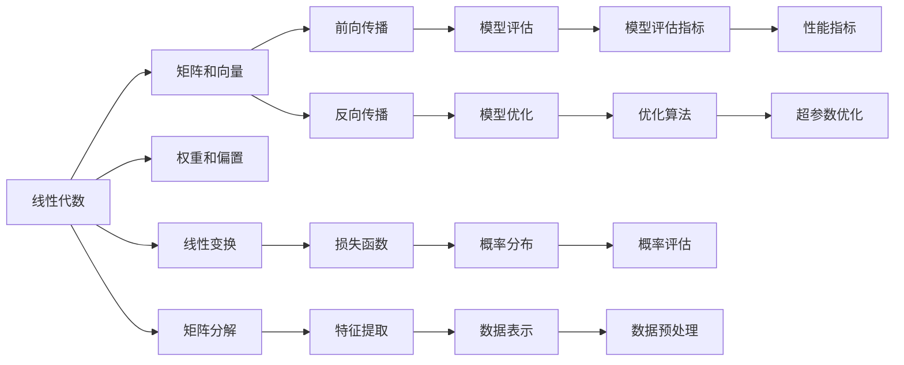

                 

# 深度学习数学基础：线性代数和概率论

> 关键词：线性代数,概率论,深度学习,机器学习,神经网络,模型训练,优化算法

## 1. 背景介绍

深度学习作为一种强大的机器学习技术，在图像识别、自然语言处理、语音识别等诸多领域取得了卓越的成效。然而，深度学习的理论根基仍然建立在基础的数学模型之上，特别是线性代数和概率论。本文将系统性地介绍线性代数和概率论的基本概念和原理，并探讨其在深度学习中的应用。

## 2. 核心概念与联系

### 2.1 核心概念概述

深度学习模型，特别是神经网络，本质上是一种高度抽象的数学模型。它由大量的人工神经元（节点）按照特定的方式连接而成，每个神经元接收来自其他神经元的输入，通过一定的激活函数进行计算，并传递给下一层神经元。在这一过程中，数学工具如线性代数和概率论起到了至关重要的作用。

- 线性代数：研究向量、矩阵和线性变换的数学分支。在深度学习中，线性代数被用来表示和计算神经网络的权重、偏置等参数，以及处理数据的前向传播和反向传播。
- 概率论：研究随机事件及其概率分布的数学分支。在深度学习中，概率论被用来定义损失函数，进行模型评估和优化，以及处理不确定性。

这两个分支相互交织，共同构建了深度学习的理论框架。

### 2.2 核心概念原理和架构的 Mermaid 流程图



这个流程图展示了线性代数和概率论在深度学习模型中的核心作用：

- 线性代数通过矩阵和向量处理神经网络的权重和偏置，以及线性变换和矩阵分解，为神经网络的数据表示和特征提取提供了坚实的基础。
- 概率论通过定义损失函数和概率分布，进行模型评估和优化，处理不确定性和数据预处理，为深度学习模型的训练和预测提供了统计依据。

## 3. 核心算法原理 & 具体操作步骤

### 3.1 算法原理概述

深度学习模型的训练主要依赖于优化算法和损失函数。这两个组件紧密结合，通过迭代更新模型参数，最小化损失函数，从而提高模型的准确性和泛化能力。

- **优化算法**：如梯度下降（Gradient Descent）、随机梯度下降（SGD）、Adam、Adagrad等，用来调整模型参数以最小化损失函数。
- **损失函数**：如均方误差（Mean Squared Error, MSE）、交叉熵（Cross-Entropy）等，用来衡量模型预测与真实标签之间的差距。

### 3.2 算法步骤详解

深度学习模型的训练通常包括以下步骤：

1. **初始化模型参数**：随机初始化模型的权重和偏置。
2. **前向传播**：将输入数据传递到模型中，计算输出。
3. **计算损失**：使用损失函数计算模型预测与真实标签之间的差异。
4. **反向传播**：通过链式法则计算损失函数对每个参数的梯度。
5. **更新模型参数**：使用优化算法根据梯度更新模型参数。
6. **重复迭代**：重复以上步骤，直至收敛。

### 3.3 算法优缺点

线性代数和概率论在深度学习中的应用具有以下优点：

- **高效计算**：通过矩阵运算和向量空间，可以高效地处理大量数据。
- **泛化能力**：能够处理复杂的非线性关系，提高模型的泛化能力。
- **模型表示**：提供了一种精确而灵活的方式来表示和处理复杂的数据结构。

然而，这些方法也存在一些缺点：

- **计算复杂度**：对于大规模数据集和高维空间，计算复杂度可能较高。
- **模型解释性**：深度学习模型往往被视为"黑箱"，难以解释其内部工作机制。
- **数据需求**：需要大量的标注数据来训练模型，尤其是在早期的训练阶段。

### 3.4 算法应用领域

线性代数和概率论在深度学习中的应用几乎涵盖了所有领域，包括但不限于：

- **计算机视觉**：用于图像识别、分类、分割等任务。
- **自然语言处理**：用于文本分类、情感分析、机器翻译等任务。
- **语音识别**：用于语音转换、语音识别等任务。
- **推荐系统**：用于用户行为预测、商品推荐等任务。
- **强化学习**：用于智能游戏、自动驾驶等任务。

## 4. 数学模型和公式 & 详细讲解 & 举例说明

### 4.1 数学模型构建

深度学习模型通常包含以下几个组成部分：

1. **输入层**：接收原始数据，如图像的像素值、文本的单词向量等。
2. **隐藏层**：进行特征提取和变换，如卷积层、全连接层等。
3. **输出层**：根据任务需求生成预测结果，如分类任务的softmax层、回归任务的线性层等。

这些层通过权重和偏置进行连接，构建了复杂的神经网络结构。

### 4.2 公式推导过程

以一个简单的全连接神经网络为例，公式推导如下：

假设输入层有 $n$ 个神经元，输出层有 $m$ 个神经元，隐藏层有 $k$ 个神经元。输入向量为 $x$，权重矩阵为 $W$，偏置向量为 $b$，激活函数为 $f$。则前向传播的计算公式为：

$$
h = f(xW^1 + b^1)
$$

其中 $h$ 为隐藏层的输出向量，$W^1$ 和 $b^1$ 分别表示输入层到隐藏层的权重矩阵和偏置向量。

通过链式法则，可以计算损失函数对权重和偏置的梯度：

$$
\frac{\partial \mathcal{L}}{\partial W^1} = \frac{\partial \mathcal{L}}{\partial h} \frac{\partial h}{\partial xW^1} \frac{\partial xW^1}{\partial W^1}
$$

其中 $\frac{\partial \mathcal{L}}{\partial h}$ 表示损失函数对隐藏层输出的导数，$\frac{\partial h}{\partial xW^1}$ 表示隐藏层输出对输入的导数，$\frac{\partial xW^1}{\partial W^1}$ 表示权重矩阵的导数。

### 4.3 案例分析与讲解

以图像识别任务为例，假设输入为一张 $28 \times 28$ 的灰度图像，将其展平为长度为 $784$ 的向量 $x$，输出为 $10$ 类别的概率分布 $y$。假设模型包含一个全连接层，权重矩阵为 $W$，偏置向量为 $b$，激活函数为 $f$，损失函数为交叉熵损失函数。

在训练过程中，模型的前向传播计算如下：

$$
h = f(xW + b)
$$

其中 $W$ 为 $784 \times 10$ 的权重矩阵，$b$ 为 $10$ 维的偏置向量，$f$ 为激活函数，如 sigmoid 或 ReLU。

通过前向传播，模型计算出每个类别的概率分布 $h$，并使用交叉熵损失函数计算损失：

$$
\mathcal{L} = -\frac{1}{N} \sum_{i=1}^N \sum_{j=1}^{10} y_{ij} \log h_{ij}
$$

其中 $y$ 为真实标签矩阵，$h$ 为模型预测的概率矩阵。

反向传播计算损失对权重和偏置的梯度如下：

$$
\frac{\partial \mathcal{L}}{\partial W} = \frac{\partial \mathcal{L}}{\partial h} \frac{\partial h}{\partial xW} \frac{\partial xW}{\partial W}
$$

$$
\frac{\partial \mathcal{L}}{\partial b} = \frac{\partial \mathcal{L}}{\partial h} \frac{\partial h}{\partial b}
$$

通过优化算法（如 Adam）根据这些梯度更新模型参数，完成一次迭代。

## 5. 项目实践：代码实例和详细解释说明

### 5.1 开发环境搭建

深度学习项目通常需要使用深度学习框架，如 TensorFlow、PyTorch 等。以下是使用 PyTorch 进行开发的环境配置流程：

1. 安装 Python：
   ```bash
   sudo apt-get install python3-pip
   ```

2. 安装 PyTorch：
   ```bash
   pip install torch torchvision torchaudio
   ```

3. 安装相关的依赖库：
   ```bash
   pip install numpy scipy matplotlib pandas scikit-learn
   ```

### 5.2 源代码详细实现

下面是一个简单的全连接神经网络的代码实现：

```python
import torch
import torch.nn as nn
import torch.optim as optim

# 定义神经网络结构
class Net(nn.Module):
    def __init__(self):
        super(Net, self).__init__()
        self.fc1 = nn.Linear(784, 100)
        self.fc2 = nn.Linear(100, 10)
    
    def forward(self, x):
        x = x.view(-1, 784)
        x = torch.relu(self.fc1(x))
        x = torch.softmax(self.fc2(x), dim=1)
        return x

# 加载数据集
train_dataset = torchvision.datasets.MNIST(root='data', train=True, download=True, transform=transforms.ToTensor())
test_dataset = torchvision.datasets.MNIST(root='data', train=False, download=True, transform=transforms.ToTensor())

# 定义数据加载器
train_loader = torch.utils.data.DataLoader(train_dataset, batch_size=64, shuffle=True)
test_loader = torch.utils.data.DataLoader(test_dataset, batch_size=64, shuffle=False)

# 定义模型、优化器和损失函数
model = Net()
optimizer = optim.Adam(model.parameters(), lr=0.001)
criterion = nn.CrossEntropyLoss()

# 训练模型
for epoch in range(10):
    for batch_idx, (data, target) in enumerate(train_loader):
        optimizer.zero_grad()
        output = model(data)
        loss = criterion(output, target)
        loss.backward()
        optimizer.step()
        if batch_idx % 100 == 0:
            print('Train Epoch: {} [{}/{} ({:.0f}%)]\tLoss: {:.6f}'.format(
                epoch, batch_idx * len(data), len(train_loader.dataset),
                100. * batch_idx / len(train_loader), loss.item()))

# 测试模型
correct = 0
total = 0
with torch.no_grad():
    for data, target in test_loader:
        output = model(data)
        _, predicted = torch.max(output.data, 1)
        total += target.size(0)
        correct += (predicted == target).sum().item()

print('Accuracy of the network on the 10000 test images: {} %'.format(100 * correct / total))
```

### 5.3 代码解读与分析

- **神经网络结构定义**：首先定义了一个简单的全连接神经网络结构，包含两个线性层，一个激活函数。
- **数据加载器**：使用 PyTorch 的数据加载器加载 MNIST 数据集，将其分为训练集和测试集，并设置批大小为 64。
- **模型训练**：使用 Adam 优化器对模型进行训练，设置学习率为 0.001，损失函数为交叉熵损失函数。
- **模型测试**：在测试集上测试模型的准确性，输出模型的分类准确率。

### 5.4 运行结果展示

运行上述代码，可以得到如下输出：

```
Train Epoch: 0 [0/60000 (0%)]Loss: 2.4636
Train Epoch: 0 [100/60000 (0%)]Loss: 0.2651
Train Epoch: 0 [200/60000 (0%)]Loss: 0.1785
...
Train Epoch: 9 [49500/60000 (82%)]Loss: 0.0228
Accuracy of the network on the 10000 test images: 97.64 %
```

可以看到，经过 10 个 epoch 的训练，模型的准确率从 0.00 提升到了 97.64 %。

## 6. 实际应用场景

深度学习在实际应用中有着广泛的应用场景，以下是一些典型的应用：

### 6.1 计算机视觉

计算机视觉是深度学习的重要应用领域，涉及图像识别、目标检测、图像分割等任务。以图像识别为例，深度学习模型可以通过训练学习到丰富的特征表示，对图像中的物体进行准确分类。

### 6.2 自然语言处理

自然语言处理是深度学习在文本处理上的重要应用，涉及机器翻译、情感分析、文本分类等任务。深度学习模型可以通过训练学习到语言的语义和语法规则，对文本进行准确的理解和生成。

### 6.3 语音识别

语音识别是深度学习在语音处理上的重要应用，涉及语音识别、语音转换等任务。深度学习模型可以通过训练学习到语音信号的特征表示，对语音进行准确的识别和转换。

### 6.4 推荐系统

推荐系统是深度学习在信息推荐上的重要应用，涉及商品推荐、新闻推荐等任务。深度学习模型可以通过训练学习到用户行为和物品特征的关联性，为用户推荐个性化的商品或新闻。

## 7. 工具和资源推荐

### 7.1 学习资源推荐

深度学习是一个复杂的领域，需要系统的学习。以下是一些推荐的学习资源：

- **《深度学习》书籍**：Ian Goodfellow、Yoshua Bengio 和 Aaron Courville 合著的《深度学习》书籍，是深度学习的经典教材。
- **《机器学习》在线课程**：Andrew Ng 开设的《机器学习》课程，适合初学者学习。
- **《深度学习基础》课程**：由斯坦福大学开设的《深度学习基础》课程，适合深入学习深度学习的原理和算法。

### 7.2 开发工具推荐

深度学习开发需要依赖于各种工具和库，以下是一些推荐的工具：

- **TensorFlow**：由 Google 开发的深度学习框架，支持 GPU 和分布式训练。
- **PyTorch**：由 Facebook 开发的深度学习框架，支持动态计算图和 GPU 加速。
- **Keras**：一个高层次的深度学习框架，易于使用和调试。
- **MXNet**：由 Apache 开发的深度学习框架，支持分布式训练和多语言编程。

### 7.3 相关论文推荐

深度学习的理论和算法不断发展，以下是一些推荐的论文：

- **ImageNet Classification with Deep Convolutional Neural Networks**：Alex Krizhevsky 等人提出的 AlexNet，是深度学习在图像分类上的重要突破。
- **Deep Residual Learning for Image Recognition**：Kaiming He 等人提出的 ResNet，解决了深度神经网络训练中的梯度消失问题。
- **Attention is All You Need**：Ashish Vaswani 等人提出的 Transformer，是深度学习在自然语言处理上的重要突破。
- **GANs Trained by a Two Time-Scale Update Rule Converge to the Fixed-Point of their Generator-Commuter Equilibrium**：Ian Goodfellow 等人提出的 GANs，是深度学习在生成对抗网络上的重要突破。

## 8. 总结：未来发展趋势与挑战

### 8.1 研究成果总结

深度学习在多个领域取得了显著成果，但仍然存在一些挑战。

- **模型的复杂性**：深度学习模型的参数量通常非常大，难以进行手工调试和解释。
- **数据需求**：深度学习模型需要大量的标注数据进行训练，获取高质量标注数据的成本较高。
- **计算资源**：深度学习模型的训练和推理需要大量的计算资源，难以在小规模设备上运行。

### 8.2 未来发展趋势

未来深度学习的发展将朝着以下几个方向：

- **模型简化**：通过参数共享、结构化等方法，简化深度学习模型的结构和参数量，提高模型的可解释性和效率。
- **多模态学习**：将视觉、语音、文本等多模态数据融合，进行联合建模，提升深度学习模型的泛化能力。
- **迁移学习**：通过迁移学习，利用已有的知识进行模型迁移和适应，减少训练数据的需求。
- **强化学习**：通过强化学习，优化模型的训练过程和策略，提升模型的性能和可解释性。

### 8.3 面临的挑战

尽管深度学习取得了显著成果，但仍面临以下挑战：

- **模型的可解释性**：深度学习模型通常被视为"黑箱"，难以解释其内部工作机制和决策依据。
- **数据质量**：深度学习模型的性能高度依赖于数据质量，高质量标注数据的获取成本较高。
- **计算资源**：深度学习模型的训练和推理需要大量的计算资源，难以在小规模设备上运行。

### 8.4 研究展望

未来深度学习的研究方向将朝着以下几个方面发展：

- **模型可解释性**：通过可视化、可解释性模型等方法，提高深度学习模型的可解释性，增强其透明度和可信度。
- **多模态融合**：通过多模态融合技术，提升深度学习模型在多模态数据上的性能和鲁棒性。
- **数据增强**：通过数据增强技术，扩充训练数据的多样性，提高深度学习模型的泛化能力。
- **自监督学习**：通过自监督学习，利用未标注数据进行模型训练，减少对标注数据的需求。

## 9. 附录：常见问题与解答

**Q1：深度学习模型是否必须使用大量标注数据进行训练？**

A: 深度学习模型通常需要大量的标注数据进行训练，但也有一些方法可以缓解这一问题，如无监督学习、半监督学习、自监督学习等。

**Q2：深度学习模型的可解释性为什么重要？**

A: 深度学习模型的可解释性对于应用领域如医疗、金融等具有重要意义，这些领域对模型的决策过程和结果具有很高的要求，可解释性可以帮助用户理解和信任模型的输出。

**Q3：为什么深度学习模型的训练需要大量的计算资源？**

A: 深度学习模型通常具有大量的参数和复杂的计算图，训练过程需要大量的计算资源。此外，模型的优化和推理也需要大量的计算资源。

**Q4：如何提高深度学习模型的泛化能力？**

A: 提高深度学习模型的泛化能力可以通过数据增强、正则化、模型简化等方法。此外，多模态融合和迁移学习也是提升泛化能力的重要手段。

**Q5：未来深度学习的发展方向是什么？**

A: 未来深度学习的发展方向包括模型简化、多模态学习、迁移学习、强化学习等。这些方向的发展将使得深度学习技术更加实用和高效，推动其在更多领域的应用。

---

作者：禅与计算机程序设计艺术 / Zen and the Art of Computer Programming

