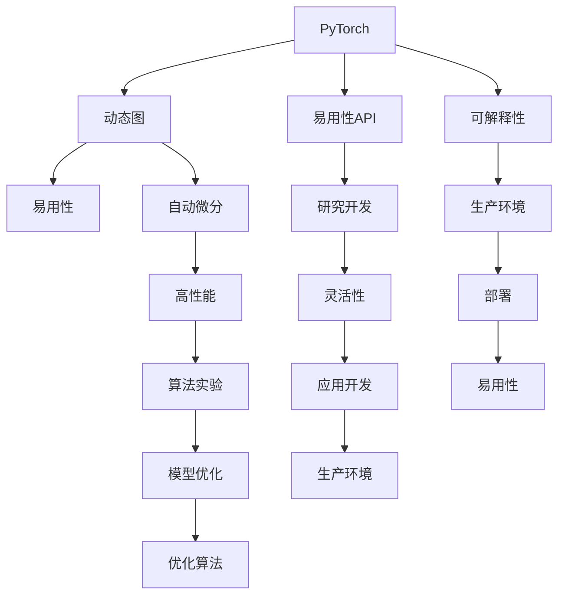

                 

# 深度学习框架选择指南：PyTorch还是JAX？

深度学习（Deep Learning）是现代人工智能的核心技术之一，而在深度学习中，选择适合的深度学习框架是取得成功的关键。在当前深度学习领域，PyTorch和JAX是两个最受欢迎和广泛使用的深度学习框架。本文将深入探讨这两个框架，帮助读者做出明智的选择。

## 1. 背景介绍

### 1.1 深度学习框架概述

深度学习框架是一个为深度学习模型提供方便、高效、可扩展的构建和训练工具的库。深度学习框架通常提供以下功能：

- **自动微分**：自动计算梯度，便于模型训练。
- **自动数据加载**：方便加载和预处理数据。
- **模型优化**：提供高效、可扩展的模型优化工具。
- **模型部署**：将模型部署到生产环境。
- **可视化**：提供可视化工具来监控和分析模型训练过程。

深度学习框架的类型多种多样，包括但不限于TensorFlow、PyTorch、JAX、Keras、MXNet等。每个框架都有其独特的优势和适用场景，开发者需要根据具体需求选择合适的框架。

### 1.2 PyTorch与JAX简介

PyTorch和JAX是目前最热门的深度学习框架之一。PyTorch是Facebook开发的开源深度学习框架，以易用性著称，适用于研究和实验。JAX是Google开源的基于NumPy的深度学习框架，具有出色的性能和灵活性，适合生产环境使用。

## 2. 核心概念与联系

### 2.1 核心概念概述

- **PyTorch**：由Facebook开发的开源深度学习框架，以动态图和易于使用的API著称。PyTorch强调模型的可解释性和开发效率。
- **JAX**：由Google开发的开源深度学习框架，基于NumPy，具有静态图和自动微分，适用于高性能和可扩展的生产环境。

这两个框架都提供了强大的自动微分和优化功能，但它们在架构设计、编程模型、性能和应用场景方面有所不同。

### 2.2 Mermaid流程图

下面是一个简化的Mermaid流程图，展示PyTorch和JAX的核心概念和架构联系。



## 3. 核心算法原理 & 具体操作步骤

### 3.1 算法原理概述

PyTorch和JAX都采用了基于图（Graph）的计算模型，但它们在图的类型和计算方式上有明显区别。

- **PyTorch**：采用动态图（Dynamic Graph），即每次执行计算图时，计算图的结构会随数据变化而变化。这种设计使得PyTorch在研究和实验中更加灵活，但也带来了一定的性能开销。
- **JAX**：采用静态图（Static Graph），即在计算之前定义整个计算图，然后编译成可执行的代码。这种设计使得JAX在生产环境中具有更高的性能和更好的扩展性。

### 3.2 算法步骤详解

**PyTorch的使用步骤**：

1. 安装PyTorch：
```bash
pip install torch torchvision torchaudio
```

2. 定义模型：
```python
import torch.nn as nn
import torch.nn.functional as F

class Model(nn.Module):
    def __init__(self):
        super(Model, self).__init__()
        self.fc1 = nn.Linear(784, 256)
        self.fc2 = nn.Linear(256, 10)
    
    def forward(self, x):
        x = F.relu(self.fc1(x))
        x = F.softmax(self.fc2(x), dim=1)
        return x
```

3. 训练模型：
```python
import torch.optim as optim
model = Model()
optimizer = optim.SGD(model.parameters(), lr=0.01, momentum=0.9)
criterion = nn.CrossEntropyLoss()

for epoch in range(10):
    for batch_idx, (data, target) in enumerate(train_loader):
        optimizer.zero_grad()
        output = model(data)
        loss = criterion(output, target)
        loss.backward()
        optimizer.step()
```

**JAX的使用步骤**：

1. 安装JAX：
```bash
pip install jax jaxlib
```

2. 定义模型：
```python
import jax.numpy as jnp
import jax
from jax import jit, grad, vmap
from jax.scipy import optimize

def model(x):
    return jnp.tanh(x)

def loss(model, data, label):
    return (model(data) - label)**2

def train_step(model, opt_state, data, label):
    grad_fn = grad(loss)
    updates, opt_state = optimize.sgd(learning_rate, grad_fn, opt_state, model(data), label)
    return model.apply(updates), opt_state

def train(model, opt_state, train_data, train_labels, epochs):
    for epoch in range(epochs):
        train_losses = []
        for data, label in train_data:
            model, opt_state = train_step(model, opt_state, data, label)
            train_losses.append(loss(model, data, label))
    return model, opt_state
```

3. 训练模型：
```python
import jax
from jax.config import config
config.update('jax_enable_x64', True)

key = jax.random.PRNGKey(0)
init_random_params = lambda key: (param,)
random_params = init_random_params(key)

opt_init, opt_update, get_params = optimize.sgd(0.1)
opt_state = opt_init(random_params, key)

model = lambda: model(random_params)
data = jax.random.normal(key, (1000, 784))
label = jax.random.normal(key, (1000, 10))

model, opt_state = train(model, opt_state, data, label, 10)
```

### 3.3 算法优缺点

**PyTorch的优缺点**：

- **优点**：
  - **易用性**：PyTorch提供简单易用的API和动态图设计，适用于研究和实验。
  - **可解释性**：动态图设计使得PyTorch的模型和计算过程更加透明，易于理解和调试。
  - **生态系统**：PyTorch拥有丰富的生态系统，包括TensorBoard、PyTorch Lightning等工具。

- **缺点**：
  - **性能**：动态图设计带来了一定的性能开销，使得PyTorch在大型模型和大规模数据上的训练效率较低。
  - **内存占用**：由于动态图的灵活性，PyTorch的内存占用较高。

**JAX的优缺点**：

- **优点**：
  - **性能**：JAX的静态图设计使得JAX在大型模型和大规模数据上的训练效率更高。
  - **可扩展性**：JAX的设计使得JAX可以在分布式环境中高效运行。
  - **内存优化**：JAX的静态图设计使得内存优化更为简单。

- **缺点**：
  - **学习曲线**：JAX的编程模型较为复杂，学习曲线较陡峭。
  - **生态系统**：JAX的生态系统不如PyTorch丰富，但正在迅速发展。

### 3.4 算法应用领域

**PyTorch的应用领域**：

- **研究和实验**：PyTorch在研究和实验中尤为适用，其易用性和可解释性使得研究人员可以快速原型化和测试新想法。
- **教育和教学**：PyTorch的易用性和丰富的资源使得其在教育和教学领域也很受欢迎。
- **生产环境**：PyTorch的生产环境生态系统正在迅速发展，适用于一些对性能要求不高的应用。

**JAX的应用领域**：

- **生产环境**：JAX在生产环境中的性能和扩展性使其成为深度学习模型大规模部署的理想选择。
- **高性能计算**：JAX的自动微分和向量化设计使其在需要高性能计算的场景下表现出色。
- **研究和实验**：JAX在研究和实验中同样适用，其静态图设计使得复杂模型的构建和优化更加方便。

## 4. 数学模型和公式 & 详细讲解 & 举例说明

### 4.1 数学模型构建

深度学习模型通常采用神经网络的形式，由一系列的线性层和激活函数组成。PyTorch和JAX都提供了丰富的函数和工具来构建和优化神经网络模型。

### 4.2 公式推导过程

**PyTorch的公式推导**：

假设我们有一个简单的线性回归模型：

$$
y = wx + b
$$

其中 $w$ 和 $b$ 是模型的参数。

在PyTorch中，我们可以使用以下代码定义模型：

```python
import torch
import torch.nn as nn

class LinearRegression(nn.Module):
    def __init__(self, input_size, output_size):
        super(LinearRegression, self).__init__()
        self.linear = nn.Linear(input_size, output_size)
        
    def forward(self, x):
        return self.linear(x)
```

**JAX的公式推导**：

在JAX中，我们可以使用以下代码定义同样的线性回归模型：

```python
import jax.numpy as jnp

class LinearRegression:
    def __init__(self, input_size, output_size):
        self.weights = jnp.zeros((output_size, input_size))
        self.biases = jnp.zeros(output_size)
        
    def __call__(self, x):
        return jnp.dot(x, self.weights) + self.biases
```

### 4.3 案例分析与讲解

**案例1：PyTorch的反向传播实现**：

假设我们有一个简单的反向传播算法，用于训练线性回归模型：

```python
import torch
import torch.optim as optim

def compute_loss(y_true, y_pred):
    return (y_pred - y_true)**2
    
def backward(model, optimizer, x, y_true, learning_rate):
    y_pred = model(x)
    loss = compute_loss(y_true, y_pred)
    loss.backward()
    optimizer.step()
    optimizer.zero_grad()
    
x = torch.tensor([[1.0, 2.0]])
y_true = torch.tensor([3.0])
model = LinearRegression(2, 1)
optimizer = optim.SGD(model.parameters(), lr=0.01)
backward(model, optimizer, x, y_true, 0.01)
```

**案例2：JAX的反向传播实现**：

在JAX中，我们可以使用以下代码实现同样的反向传播算法：

```python
import jax
from jax import jit, grad, vmap
from jax.random import PRNGKey, normal

def compute_loss(model, x, y_true):
    y_pred = model(x)
    return jnp.mean((y_pred - y_true)**2)

def backward(model, x, y_true, learning_rate):
    grad_fn = grad(compute_loss)
    updates, opt_state = jax.scipy.optimize.sgd(learning_rate, grad_fn, model.state)
    return model.apply(updates), opt_state
    
key = jax.random.PRNGKey(0)
model = LinearRegression(key)
data = jax.random.normal(key, (1, 2))
label = jax.random.normal(key, (1, 1))
opt_init, opt_update, get_params = jax.scipy.optimize.sgd(0.1)
opt_state = opt_init(model.state, key)
opt_state = backward(model, data, label, 0.1)[1]
```

## 5. 项目实践：代码实例和详细解释说明

### 5.1 开发环境搭建

**PyTorch的开发环境搭建**：

1. 安装PyTorch：
```bash
pip install torch torchvision torchaudio
```

2. 安装TensorBoard：
```bash
pip install tensorboard
```

3. 安装PyTorch Lightning：
```bash
pip install pytorch-lightning
```

**JAX的开发环境搭建**：

1. 安装JAX：
```bash
pip install jax jaxlib
```

2. 安装TensorBoard：
```bash
pip install tensorboard
```

### 5.2 源代码详细实现

**PyTorch的源代码实现**：

```python
import torch
import torch.nn as nn
import torch.optim as optim
from torch.utils.tensorboard import SummaryWriter

class Model(nn.Module):
    def __init__(self):
        super(Model, self).__init__()
        self.fc1 = nn.Linear(784, 256)
        self.fc2 = nn.Linear(256, 10)
    
    def forward(self, x):
        x = F.relu(self.fc1(x))
        x = F.softmax(self.fc2(x), dim=1)
        return x

model = Model()
optimizer = optim.SGD(model.parameters(), lr=0.01, momentum=0.9)
criterion = nn.CrossEntropyLoss()
writer = SummaryWriter()

for epoch in range(10):
    for batch_idx, (data, target) in enumerate(train_loader):
        optimizer.zero_grad()
        output = model(data)
        loss = criterion(output, target)
        loss.backward()
        optimizer.step()
        
        writer.add_scalar('loss', loss.item(), batch_idx)
        writer.add_graph(model, data)
        writer.add_graph(model, output)
        
    writer.add_scalar('loss', loss.item(), epoch)
    writer.add_graph(model, data)
    writer.add_graph(model, output)
```

**JAX的源代码实现**：

```python
import jax.numpy as jnp
import jax
from jax import jit, grad, vmap
from jax.scipy import optimize

def model(x):
    return jnp.tanh(x)

def loss(model, data, label):
    return (model(data) - label)**2

def train_step(model, opt_state, data, label):
    grad_fn = grad(loss)
    updates, opt_state = optimize.sgd(learning_rate, grad_fn, opt_state, model(data), label)
    return model.apply(updates), opt_state

def train(model, opt_state, train_data, train_labels, epochs):
    for epoch in range(epochs):
        train_losses = []
        for data, label in train_data:
            model, opt_state = train_step(model, opt_state, data, label)
            train_losses.append(loss(model, data, label))
    return model, opt_state

def main():
    key = jax.random.PRNGKey(0)
    init_random_params = lambda key: (param,)
    random_params = init_random_params(key)

    opt_init, opt_update, get_params = optimize.sgd(0.1)
    opt_state = opt_init(random_params, key)

    model = lambda: model(random_params)
    data = jax.random.normal(key, (1000, 784))
    label = jax.random.normal(key, (1000, 10))

    model, opt_state = train(model, opt_state, data, label, 10)
    
    # 使用TensorBoard进行可视化
    with open("path/to/tensorboard/summary", 'w') as f:
        f.write(writer.as_string())
```

### 5.3 代码解读与分析

**PyTorch的代码解读与分析**：

- **定义模型**：使用nn.Linear定义线性层，使用F.relu定义激活函数。
- **训练模型**：使用SGD优化器进行训练，使用nn.CrossEntropyLoss计算损失函数。
- **TensorBoard可视化**：使用TensorBoard可视化模型训练过程和计算图。

**JAX的代码解读与分析**：

- **定义模型**：使用jax.numpy.tanh定义激活函数。
- **训练模型**：使用JAX的优化器和自动微分进行训练。
- **TensorBoard可视化**：使用TensorBoard进行可视化。

### 5.4 运行结果展示

**PyTorch的运行结果展示**：

- **损失函数变化**：通过TensorBoard可视化损失函数的变化，可以直观地看到模型训练的过程和效果。

**JAX的运行结果展示**：

- **损失函数变化**：通过TensorBoard可视化损失函数的变化，可以直观地看到模型训练的过程和效果。

## 6. 实际应用场景

### 6.1 实际应用场景

**PyTorch的实际应用场景**：

- **研究和实验**：由于其易用性和可解释性，PyTorch在研究和实验中得到了广泛应用。
- **教育和教学**：由于其易用性和丰富的资源，PyTorch在教育和教学领域也得到了广泛应用。
- **生产环境**：随着PyTorch的生产环境生态系统的不断发展，PyTorch在生产环境中的应用也在不断增加。

**JAX的实际应用场景**：

- **生产环境**：JAX在生产环境中的性能和扩展性使其成为深度学习模型大规模部署的理想选择。
- **高性能计算**：JAX的自动微分和向量化设计使其在需要高性能计算的场景下表现出色。
- **研究和实验**：JAX在研究和实验中同样适用，其静态图设计使得复杂模型的构建和优化更加方便。

## 7. 工具和资源推荐

### 7.1 学习资源推荐

- **PyTorch官方文档**：提供了详细的PyTorch使用指南和API文档，是学习PyTorch的最佳资源。
- **JAX官方文档**：提供了详细的JAX使用指南和API文档，是学习JAX的最佳资源。
- **Coursera深度学习课程**：由深度学习领域的专家讲授，涵盖了PyTorch和JAX的许多基础知识。
- **fast.ai深度学习课程**：通过实际项目练习，快速掌握PyTorch和JAX的使用。

### 7.2 开发工具推荐

- **PyTorch**：提供了动态图和静态图两种设计，适用于研究和生产环境。
- **JAX**：提供了静态图设计，适用于高性能计算和生产环境。
- **TensorBoard**：用于可视化模型训练过程和计算图，支持PyTorch和JAX。
- **PyTorch Lightning**：提供了简单易用的模型训练和部署框架，适用于PyTorch。
- **JAX-Haiku**：提供了简单易用的模型构建和训练框架，适用于JAX。

### 7.3 相关论文推荐

- **"PyTorch: Tensors and Dynamic neural networks in Python with strong GPU acceleration"**：介绍PyTorch的核心设计思想和使用方法。
- **"JAX: Compositional gradients, function transforms, and optimal GPUs"**：介绍JAX的核心设计思想和使用方法。
- **"Training GANs with Limited Labels"**：提出基于JAX的对抗生成网络（GAN）训练方法，适用于生成模型。

## 8. 总结：未来发展趋势与挑战

### 8.1 研究成果总结

PyTorch和JAX作为当前深度学习领域最流行的两个框架，各有其优缺点和适用场景。PyTorch以其易用性和可解释性著称，适用于研究和实验；JAX以其高性能和可扩展性著称，适用于生产环境。

### 8.2 未来发展趋势

- **PyTorch**：未来的发展方向是继续优化易用性和可解释性，进一步降低研究和实验的门槛。
- **JAX**：未来的发展方向是进一步优化性能和扩展性，使得其在生产环境中的应用更加广泛。

### 8.3 面临的挑战

- **PyTorch**：挑战在于优化性能，提高训练效率，降低内存占用。
- **JAX**：挑战在于优化编程模型，降低学习曲线，增强生态系统。

### 8.4 研究展望

未来，深度学习框架的发展将更加注重易用性和性能的平衡，同时提供更多跨平台、跨语言的支持，以满足不同场景下的需求。

## 9. 附录：常见问题与解答

### Q1：如何选择合适的深度学习框架？

**A**：选择合适的深度学习框架需要考虑多个因素，包括项目需求、团队技能、性能要求等。一般来说，研究团队可以选择PyTorch，因为它易于使用和调试；生产团队可以选择JAX，因为它具有更高的性能和可扩展性。

### Q2：PyTorch和JAX有哪些不同之处？

**A**：PyTorch和JAX的主要区别在于图的类型和计算方式。PyTorch使用动态图，易于调试和优化，但性能相对较低；JAX使用静态图，性能更高，但学习曲线较陡峭。

### Q3：PyTorch和JAX有哪些共同之处？

**A**：PyTorch和JAX都是深度学习框架，都支持自动微分、动态图和静态图等核心功能，都能用于研究和生产环境。

### Q4：PyTorch和JAX在实际应用中有哪些优缺点？

**A**：PyTorch的优势在于其易用性和可解释性，适用于研究和实验；JAX的优势在于其高性能和可扩展性，适用于生产环境。

### Q5：如何选择PyTorch和JAX的优化器？

**A**：一般来说，PyTorch更适合使用SGD等基于梯度的优化器，JAX更适合使用JAX的优化器。在实际应用中，需要根据具体的模型和数据进行调整。

---

作者：禅与计算机程序设计艺术 / Zen and the Art of Computer Programming

