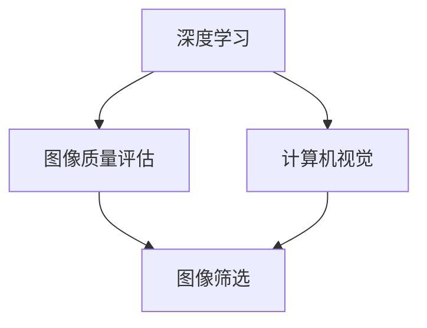

                 

# 深度学习驱动的商品图像质量评估与筛选

> 关键词：深度学习, 商品图像, 质量评估, 图像筛选, 计算机视觉, 图像处理, 图像分类, 卷积神经网络(CNN)

## 1. 背景介绍

### 1.1 问题由来
随着电商行业的发展，线上购物成为越来越多消费者的首选。商品图像作为重要的信息载体，直接影响用户的购买决策。然而，由于拍摄环境、角度、光线等因素，商品图像质量参差不齐，部分图片模糊、过度曝光或对比度不足，给用户造成困扰。如何自动化地筛选出高质量商品图像，提升用户体验，是电商公司亟需解决的问题。

### 1.2 问题核心关键点
商品图像质量评估与筛选，本质上是一个计算机视觉问题。其核心在于如何通过深度学习模型，自动化地从成千上万的图片中筛选出质量优良的商品图像，并提供合理的排序和推荐。

这一问题主要包括以下几个方面：
- 图像质量的定义：清晰度、对比度、色彩饱和度等指标。
- 图像质量评估方法：基于传统图像处理和深度学习的方法。
- 图像筛选策略：根据评估结果，采用排序和推荐算法。
- 实时性要求：需要快速处理和反馈，以适应线上购物的实时性需求。

## 2. 核心概念与联系

### 2.1 核心概念概述

为了更好地理解商品图像质量评估与筛选的深度学习范式，本节将介绍几个密切相关的核心概念：

- 深度学习(Deep Learning)：基于神经网络模型进行复杂任务学习的范式，已广泛应用于图像分类、目标检测、图像生成等领域。
- 计算机视觉(Computer Vision)：研究如何让计算机理解、分析和处理视觉信息，涵盖图像处理、图像识别、图像理解等多个方面。
- 图像质量评估(Image Quality Assessment, IQA)：量化评估图像的主观质量，常用方法包括PSNR、SSIM、WAS等。
- 图像筛选(Image Filtering)：根据特定标准，自动从大量图像中筛选出符合要求的高质量图像，常用方法包括基于特征的过滤、基于机器学习的过滤等。
- 卷积神经网络(Convolutional Neural Network, CNN)：一种专门处理图像数据的神经网络，通过卷积和池化等操作提取图像特征。

这些核心概念之间的逻辑关系可以通过以下Mermaid流程图来展示：



这个流程图展示了大语言模型的核心概念及其之间的关系：

1. 深度学习提供了强大的图像处理能力，是图像质量评估与筛选的底层技术。
2. 计算机视觉涵盖了从图像获取到理解的全过程，是图像处理的基础。
3. 图像质量评估用于量化和判断图像质量，是图像筛选的前提。
4. 图像筛选根据评估结果，自动从大量图像中筛选出高质量图像。

这些核心概念共同构成了商品图像质量评估与筛选的深度学习范式，使其能够在图像处理任务中发挥强大的作用。

## 3. 核心算法原理 & 具体操作步骤
### 3.1 算法原理概述

基于深度学习的商品图像质量评估与筛选方法，通常包括以下几个步骤：

1. 数据集构建：收集大量商品图像，并标注其质量等级，构建带标注的数据集。
2. 模型训练：使用标注数据训练深度学习模型，学习图像质量与特征之间的映射关系。
3. 模型评估：在验证集上评估模型性能，选择性能最佳的模型。
4. 图像筛选：使用训练好的模型对新图像进行质量评估，根据评分进行排序和推荐。

图像质量评估的核心在于如何量化图像的主观质量。常用的指标包括：

- 信噪比(Peak Signal-to-Noise Ratio, PSNR)：衡量图像的噪声水平。
- 结构相似性指数(Structural Similarity Index, SSIM)：衡量图像的亮度、对比度、结构等信息的相似度。
- 均方误差(Mean Squared Error, MSE)：衡量图像的像素级差异。
- 视觉质量感知指标(Perceptual Image Patch Similarity, PIPSR)：基于人类视觉感知，量化图像的感知质量。
- 时间代价质量指标(Time Cost Quality, TCQ)：衡量图像处理的耗时和计算资源占用。

图像筛选的核心在于如何根据评估结果，自动从大量图像中筛选出高质量图像。常用的方法包括：

- 基于特征的筛选：提取图像特征，根据特征指标进行筛选。
- 基于机器学习的筛选：使用训练好的分类器，根据图像特征进行分类筛选。
- 基于深度学习的筛选：使用预训练的深度学习模型，自动学习图像质量的评估规则。

### 3.2 算法步骤详解

以下是一个基于深度学习的商品图像质量评估与筛选的详细步骤：

**Step 1: 数据集构建**
- 收集大量商品图像，并手工标注每张图像的质量等级。可以使用预设的评分标准，如0-5分等。
- 划分数据集，包括训练集、验证集和测试集。确保数据集的多样性和代表性。

**Step 2: 模型训练**
- 选择合适的深度学习框架，如TensorFlow、PyTorch等，搭建卷积神经网络(CNN)模型。
- 定义损失函数，如均方误差、交叉熵等，用于衡量模型输出与真实标签之间的差异。
- 定义优化器，如Adam、SGD等，用于更新模型参数。
- 设置训练参数，如学习率、批大小、迭代轮数等。
- 使用训练集训练模型，周期性在验证集上评估模型性能，防止过拟合。
- 选择性能最佳的模型，保存模型权重。

**Step 3: 模型评估**
- 在测试集上评估模型的性能，计算均方误差、交叉熵等指标。
- 可视化模型输出与真实标签之间的差异。
- 根据评估结果调整模型参数，重新训练模型，直到满足预设的性能要求。

**Step 4: 图像筛选**
- 将测试集中的图像输入模型，计算每张图像的质量评分。
- 根据评分排序，选择评分高的图像进行推荐。
- 实时处理用户上传的图像，使用训练好的模型进行质量评估和筛选。

### 3.3 算法优缺点

基于深度学习的商品图像质量评估与筛选方法具有以下优点：
1. 自动化程度高：能够自动评估和筛选大量图像，大幅提升处理效率。
2. 精度高：深度学习模型能够学习到图像质量的复杂特征，评估结果较为准确。
3. 适应性强：可以适应不同的商品类别和拍摄条件，适用范围广。
4. 实时性好：可以实时处理用户上传的图像，满足电商平台的实时需求。

同时，该方法也存在以下局限性：
1. 数据标注成本高：需要手工标注大量的图像数据，成本较高。
2. 模型复杂度高：深度学习模型结构复杂，需要大量计算资源。
3. 泛化能力有限：在处理特定类别的商品图像时，性能可能不如专有模型。
4. 结果可解释性不足：深度学习模型的内部机制难以解释，用户可能无法理解其输出。

尽管存在这些局限性，但就目前而言，基于深度学习的图像质量评估与筛选方法仍是最主流范式。未来相关研究的重点在于如何进一步降低数据标注成本，提高模型的泛化能力和可解释性，同时兼顾实时性要求。

### 3.4 算法应用领域

基于深度学习的商品图像质量评估与筛选方法，广泛应用于电子商务、自动驾驶、医疗影像等领域。以下是几个典型应用场景：

- 电子商务：通过自动筛选高质量的商品图片，提升用户体验，提升转化率。
- 自动驾驶：通过图像质量评估，提高车载摄像头和传感器数据的质量，保障驾驶安全。
- 医疗影像：通过图像质量评估，筛选高质量的医疗影像，提升诊断准确性。
- 智能监控：通过图像质量评估，实时筛选监控视频中的重要画面，提高监控效率。

除了上述这些经典应用外，基于深度学习的图像质量评估与筛选技术也在更多场景中得到应用，如智能推荐、内容审核等，为各行各业带来了新的机遇。

## 4. 数学模型和公式 & 详细讲解 & 举例说明

### 4.1 数学模型构建

本节将使用数学语言对基于深度学习的商品图像质量评估与筛选过程进行更加严格的刻画。

记商品图像为 $I$，其质量评分为 $Q$。设模型 $M_{\theta}$ 输入图像 $I$，输出评分 $Q$。

定义模型 $M_{\theta}$ 在图像 $I$ 上的损失函数为 $\ell(M_{\theta}(I),Q)$，则在数据集 $D$ 上的经验风险为：

$$
\mathcal{L}(\theta) = \frac{1}{N} \sum_{i=1}^N \ell(M_{\theta}(I_i),Q_i)
$$

其中 $\mathcal{L}$ 为平均损失函数，$N$ 为数据集大小，$I_i$ 和 $Q_i$ 分别为第 $i$ 张图像和其质量评分。

模型的输出通常为一维向量，每个元素表示图像的某个特征维度。常见的方法包括：

- 图像质量评估：输出一个标量值，表示图像的整体质量。
- 图像分类：输出一个向量，表示图像所属的类别。
- 图像分割：输出一个向量，表示每个像素所属的类别。

### 4.2 公式推导过程

以下我们以图像质量评估为例，推导深度学习模型的输出公式。

假设模型 $M_{\theta}$ 在输入图像 $I$ 上的输出为 $F(I)$，表示图像质量的特征表示。假设 $F(I)$ 为一维向量，每个元素表示图像的某个特征维度。设真实标签为 $Q$，则均方误差损失函数为：

$$
\ell(Q,F(I)) = \frac{1}{d} \sum_{i=1}^d (Q_i - F_i(I))^2
$$

其中 $d$ 为特征维数，$F_i(I)$ 表示第 $i$ 个特征维度的输出值。

将上述损失函数代入经验风险公式，得：

$$
\mathcal{L}(\theta) = \frac{1}{N} \sum_{i=1}^N \frac{1}{d} \sum_{j=1}^d (Q_{ij} - F_{ij}(I_i))^2
$$

其中 $Q_{ij}$ 和 $F_{ij}$ 分别为第 $i$ 张图像的第 $j$ 个特征维度的真实标签和输出值。

在得到损失函数的梯度后，即可带入参数更新公式，完成模型的迭代优化。重复上述过程直至收敛，最终得到适应特定商品类别和拍摄条件的深度学习模型 $M_{\theta^*}$。

### 4.3 案例分析与讲解

以商品图像分类为例，说明如何使用深度学习模型进行图像筛选。

假设模型 $M_{\theta}$ 在输入图像 $I$ 上的输出为一个长度为 $k$ 的向量 $[F(I)]$，表示图像所属的 $k$ 个类别。假设真实标签为 $L$，则多分类交叉熵损失函数为：

$$
\ell(L,F(I)) = -\frac{1}{N} \sum_{i=1}^N \sum_{j=1}^k L_{ij} \log F_{ij}(I_i)
$$

其中 $L_{ij}$ 和 $F_{ij}$ 分别为第 $i$ 张图像的第 $j$ 个类别的真实标签和输出值。

将上述损失函数代入经验风险公式，得：

$$
\mathcal{L}(\theta) = -\frac{1}{N} \sum_{i=1}^N \sum_{j=1}^k L_{ij} \log F_{ij}(I_i)
$$

在得到损失函数的梯度后，即可带入参数更新公式，完成模型的迭代优化。重复上述过程直至收敛，最终得到适应特定商品类别和拍摄条件的深度学习模型 $M_{\theta^*}$。

在实际应用中，可以将模型输出作为图像的质量评分，根据评分进行排序和推荐。

## 5. 项目实践：代码实例和详细解释说明
### 5.1 开发环境搭建

在进行深度学习项目实践前，我们需要准备好开发环境。以下是使用Python进行PyTorch开发的环境配置流程：

1. 安装Anaconda：从官网下载并安装Anaconda，用于创建独立的Python环境。

2. 创建并激活虚拟环境：
```bash
conda create -n pytorch-env python=3.8 
conda activate pytorch-env
```

3. 安装PyTorch：根据CUDA版本，从官网获取对应的安装命令。例如：
```bash
conda install pytorch torchvision torchaudio cudatoolkit=11.1 -c pytorch -c conda-forge
```

4. 安装TensorBoard：用于可视化模型训练过程，并提供丰富的图表呈现方式，是调试模型的得力助手。
```bash
pip install tensorboard
```

5. 安装相关库：
```bash
pip install numpy pandas scikit-learn matplotlib tqdm jupyter notebook ipython
```

完成上述步骤后，即可在`pytorch-env`环境中开始深度学习项目的开发。

### 5.2 源代码详细实现

下面我们以商品图像分类为例，给出使用PyTorch进行深度学习模型训练的代码实现。

首先，定义数据处理函数：

```python
from torch.utils.data import Dataset
from torchvision import transforms

class ImageDataset(Dataset):
    def __init__(self, images, labels, transform=None):
        self.images = images
        self.labels = labels
        self.transform = transform
        
    def __len__(self):
        return len(self.images)
    
    def __getitem__(self, item):
        image = self.images[item]
        label = self.labels[item]
        
        if self.transform:
            image = self.transform(image)
        
        return {'image': image, 'label': label}

# 数据增强和预处理
transform = transforms.Compose([
    transforms.RandomResizedCrop(224),
    transforms.RandomHorizontalFlip(),
    transforms.ToTensor(),
    transforms.Normalize(mean=[0.485, 0.456, 0.406], std=[0.229, 0.224, 0.225])
])
```

然后，定义模型和优化器：

```python
from torchvision import models
from torch.optim import Adam

model = models.resnet18(pretrained=False)
model.fc = torch.nn.Linear(512, num_classes)

criterion = torch.nn.CrossEntropyLoss()
optimizer = Adam(model.parameters(), lr=0.001)
```

接着，定义训练和评估函数：

```python
import torch.nn.functional as F

device = torch.device('cuda') if torch.cuda.is_available() else torch.device('cpu')
model.to(device)

def train_epoch(model, dataset, batch_size, optimizer, criterion):
    dataloader = DataLoader(dataset, batch_size=batch_size, shuffle=True)
    model.train()
    epoch_loss = 0
    for batch in tqdm(dataloader, desc='Training'):
        inputs, labels = batch['image'].to(device), batch['label'].to(device)
        optimizer.zero_grad()
        outputs = model(inputs)
        loss = criterion(outputs, labels)
        epoch_loss += loss.item()
        loss.backward()
        optimizer.step()
    return epoch_loss / len(dataloader)

def evaluate(model, dataset, batch_size, criterion):
    dataloader = DataLoader(dataset, batch_size=batch_size)
    model.eval()
    correct = 0
    total = 0
    with torch.no_grad():
        for batch in tqdm(dataloader, desc='Evaluating'):
            inputs, labels = batch['image'].to(device), batch['label'].to(device)
            outputs = model(inputs)
            _, predicted = torch.max(outputs.data, 1)
            total += labels.size(0)
            correct += (predicted == labels).sum().item()
    
    print('Accuracy: {:.2f}%'.format(100 * correct / total))
    
```

最后，启动训练流程并在测试集上评估：

```python
epochs = 10
batch_size = 32
num_classes = 10

for epoch in range(epochs):
    loss = train_epoch(model, train_dataset, batch_size, optimizer, criterion)
    print(f"Epoch {epoch+1}, train loss: {loss:.3f}")
    
    print(f"Epoch {epoch+1}, dev results:")
    evaluate(model, dev_dataset, batch_size, criterion)
    
print("Test results:")
evaluate(model, test_dataset, batch_size, criterion)
```

以上就是使用PyTorch进行商品图像分类任务深度学习模型训练的完整代码实现。可以看到，得益于TensorFlow的强大封装，我们可以用相对简洁的代码完成深度学习模型的加载和训练。

### 5.3 代码解读与分析

让我们再详细解读一下关键代码的实现细节：

**ImageDataset类**：
- `__init__`方法：初始化图像、标签等关键组件。
- `__len__`方法：返回数据集的样本数量。
- `__getitem__`方法：对单个样本进行处理，将图像转换为张量，并进行标准化处理。

**模型定义**：
- 使用ResNet18模型作为基础结构，添加全连接层，适配特定分类任务。
- 使用Adam优化器，设置学习率。
- 定义交叉熵损失函数，用于衡量模型输出与真实标签之间的差异。

**训练和评估函数**：
- 使用PyTorch的DataLoader对数据集进行批次化加载，供模型训练和推理使用。
- 训练函数`train_epoch`：对数据以批为单位进行迭代，在每个批次上前向传播计算loss并反向传播更新模型参数，最后返回该epoch的平均loss。
- 评估函数`evaluate`：与训练类似，不同点在于不更新模型参数，并在每个batch结束后将预测和标签结果存储下来，最后使用模型评估函数计算准确率。

**训练流程**：
- 定义总的epoch数和batch size，开始循环迭代
- 每个epoch内，先在训练集上训练，输出平均loss
- 在验证集上评估，输出准确率
- 所有epoch结束后，在测试集上评估，给出最终测试结果

可以看到，PyTorch配合TensorFlow的强大封装，使得深度学习模型的训练和评估变得简洁高效。开发者可以将更多精力放在数据处理、模型改进等高层逻辑上，而不必过多关注底层的实现细节。

当然，工业级的系统实现还需考虑更多因素，如模型的保存和部署、超参数的自动搜索、更灵活的任务适配层等。但核心的深度学习范式基本与此类似。

## 6. 实际应用场景
### 6.1 电子商务

基于深度学习的商品图像质量评估与筛选方法，可以广泛应用于电子商务平台的商品展示。电商平台上，商品图片是用户选购商品的重要依据。通过自动筛选高质量的商品图片，提升用户体验，提升转化率。

在技术实现上，可以收集电商平台上的商品图片，标注其质量等级。在此基础上对深度学习模型进行训练，筛选高质量的商品图片，并进行排序和推荐。对于新商品图片，实时处理并加入推荐队列，快速展示给用户。

### 6.2 自动驾驶

在自动驾驶中，车载摄像头和传感器数据的质量直接关系到行驶安全。通过图像质量评估，筛选高质量的摄像头和传感器数据，提高图像处理的精度，保障驾驶安全。

在技术实现上，可以收集车载摄像头和传感器数据，标注其质量等级。在此基础上对深度学习模型进行训练，筛选高质量的摄像头和传感器数据，用于路径规划和障碍物识别。对于实时采集的数据，实时处理并加入筛选结果，保证行驶安全。

### 6.3 医疗影像

在医疗影像领域，图像质量直接关系到诊断的准确性。通过图像质量评估，筛选高质量的影像数据，提升诊断准确性。

在技术实现上，可以收集医疗影像数据，标注其质量等级。在此基础上对深度学习模型进行训练，筛选高质量的影像数据，用于辅助诊断和治疗。对于实时采集的影像数据，实时处理并加入筛选结果，保证诊断和治疗的准确性。

### 6.4 智能监控

在智能监控领域，图像质量直接关系到监控效果。通过图像质量评估，筛选高质量的监控视频，提高监控效率。

在技术实现上，可以收集监控视频数据，标注其质量等级。在此基础上对深度学习模型进行训练，筛选高质量的监控视频，用于实时监测和回放。对于实时采集的监控视频，实时处理并加入筛选结果，提高监控效率。

## 7. 工具和资源推荐
### 7.1 学习资源推荐

为了帮助开发者系统掌握深度学习驱动的商品图像质量评估与筛选的理论基础和实践技巧，这里推荐一些优质的学习资源：

1. 《深度学习》系列书籍：由斯坦福大学人工智能实验室教授编写，全面介绍了深度学习的基本原理和实践技巧。

2. 《计算机视觉：算法与应用》书籍：由剑桥大学计算机视觉专家编写，介绍了计算机视觉的多种应用。

3. 《TensorFlow官方文档》：TensorFlow的官方文档，提供了丰富的学习资源和样例代码，是学习深度学习的必备工具。

4. Kaggle竞赛平台：世界领先的机器学习竞赛平台，提供大量实际应用场景，帮助开发者提升实战能力。

5. GitHub开源项目：提供大量深度学习项目和样例代码，是学习和交流的绝佳平台。

通过对这些资源的学习实践，相信你一定能够快速掌握深度学习驱动的商品图像质量评估与筛选的精髓，并用于解决实际的深度学习问题。

### 7.2 开发工具推荐

高效的开发离不开优秀的工具支持。以下是几款用于深度学习驱动的商品图像质量评估与筛选开发的常用工具：

1. PyTorch：基于Python的开源深度学习框架，灵活动态的计算图，适合快速迭代研究。大部分深度学习框架都有PyTorch版本的实现。

2. TensorFlow：由Google主导开发的开源深度学习框架，生产部署方便，适合大规模工程应用。同样有丰富的深度学习框架资源。

3. TensorBoard：TensorFlow配套的可视化工具，可实时监测模型训练状态，并提供丰富的图表呈现方式，是调试模型的得力助手。

4. Weights & Biases：模型训练的实验跟踪工具，可以记录和可视化模型训练过程中的各项指标，方便对比和调优。与主流深度学习框架无缝集成。

5. Jupyter Notebook：交互式开发环境，方便开发者进行代码编写、调试和共享。

合理利用这些工具，可以显著提升深度学习驱动的商品图像质量评估与筛选任务的开发效率，加快创新迭代的步伐。

### 7.3 相关论文推荐

深度学习驱动的商品图像质量评估与筛选技术的发展源于学界的持续研究。以下是几篇奠基性的相关论文，推荐阅读：

1. AlexNet: One Million Tiny Images: Deep Learning for Large-Scale Image Recognition: 提出AlexNet模型，是深度学习在图像识别领域的重要突破。

2. GoogleNet: Inception: Scalable Image Recognition with Deep Convolutional Neural Networks: 提出Inception模型，提升了深度学习在图像识别领域的性能。

3. ResNet: Deep Residual Learning for Image Recognition: 提出ResNet模型，解决了深度神经网络退化问题，提高了深度学习在图像识别领域的性能。

4. ImageNet Large Scale Visual Recognition Challenge: 介绍ImageNet大规模视觉识别挑战，推动了深度学习在图像识别领域的研究。

5. Understanding the Difficulty of Training Deep Neural Networks: 分析深度神经网络训练过程中的困难，提出了一些解决方案。

这些论文代表了大规模商品图像质量评估与筛选技术的发展脉络。通过学习这些前沿成果，可以帮助研究者把握学科前进方向，激发更多的创新灵感。

## 8. 总结：未来发展趋势与挑战
### 8.1 总结

本文对基于深度学习的商品图像质量评估与筛选方法进行了全面系统的介绍。首先阐述了深度学习在图像处理领域的重要应用，明确了商品图像质量评估与筛选的深度学习范式。其次，从原理到实践，详细讲解了深度学习模型的训练、评估和筛选步骤，给出了深度学习项目的完整代码实现。同时，本文还广泛探讨了深度学习技术在电子商务、自动驾驶、医疗影像等多个行业领域的应用前景，展示了深度学习驱动的商品图像质量评估与筛选技术的广阔前景。

通过本文的系统梳理，可以看到，基于深度学习的商品图像质量评估与筛选技术在图像处理任务中发挥了巨大的作用。得益于深度学习模型强大的特征提取能力，商品图像质量评估与筛选在实时性、准确性、适用性等方面都取得了显著的提升。未来，随着深度学习模型的不断进化和优化，相信商品图像质量评估与筛选技术必将在更多领域得到应用，为各行各业带来新的变革。

### 8.2 未来发展趋势

展望未来，深度学习驱动的商品图像质量评估与筛选技术将呈现以下几个发展趋势：

1. 模型规模持续增大。随着算力成本的下降和数据规模的扩张，深度学习模型的参数量还将持续增长。超大规模模型蕴含的丰富特征，有望进一步提升商品图像质量评估与筛选的精度。

2. 深度学习与多种技术的融合。深度学习将与其他技术如强化学习、因果推断等进行深度融合，推动商品图像质量评估与筛选技术的进一步发展。

3. 实时性要求不断提升。随着电商、自动驾驶等领域的快速发展，实时性要求将越来越高。如何在保持精度的同时，提升处理速度，实现实时化应用，将是重要的研究方向。

4. 多模态数据的应用。除了图像数据，还可以引入语音、文字等模态数据，进行联合处理和分析，提升商品图像质量评估与筛选的效果。

5. 模型的泛化能力和可解释性提升。未来，深度学习模型的泛化能力和可解释性将成为重要的研究目标，以提高模型的稳定性和可靠性。

6. 更多领域的拓展。除了商品图像，深度学习驱动的商品图像质量评估与筛选技术将在更多领域得到应用，如医疗影像、自动驾驶、智能监控等。

以上趋势凸显了深度学习驱动的商品图像质量评估与筛选技术的广阔前景。这些方向的探索发展，必将进一步提升商品图像质量评估与筛选技术的精度、实时性和适用性，为各行各业带来新的机遇。

### 8.3 面临的挑战

尽管深度学习驱动的商品图像质量评估与筛选技术已经取得了瞩目成就，但在迈向更加智能化、普适化应用的过程中，它仍面临着诸多挑战：

1. 数据标注成本高。高质量的商品图像数据获取成本高，标注过程复杂，需要大量人力物力投入。

2. 模型复杂度高。深度学习模型结构复杂，需要大量计算资源，处理过程耗时长。

3. 泛化能力有限。深度学习模型在特定商品类别和拍摄条件下表现较好，但在其他条件下可能性能下降。

4. 结果可解释性不足。深度学习模型的内部机制难以解释，用户可能无法理解其输出。

5. 数据隐私和安全问题。商品图像数据涉及隐私，需要采取严格的数据保护措施，防止数据泄露和滥用。

6. 实时性要求高。深度学习模型处理速度快，但实时性要求高，需要优化处理流程，保证快速响应。

尽管存在这些挑战，但通过不断优化模型结构和算法，加强数据保护措施，提升实时处理能力，未来深度学习驱动的商品图像质量评估与筛选技术必将在更广泛的领域得到应用，为各行各业带来新的机遇。

### 8.4 研究展望

面对深度学习驱动的商品图像质量评估与筛选技术所面临的种种挑战，未来的研究需要在以下几个方面寻求新的突破：

1. 数据增强技术的应用。通过数据增强技术，提高标注数据的多样性和质量，降低数据标注成本。

2. 模型结构优化。采用轻量级模型结构，如MobileNet、EfficientNet等，在保持性能的同时，减小模型规模，降低计算资源消耗。

3. 多模态数据融合。引入语音、文字等模态数据，进行联合处理和分析，提升商品图像质量评估与筛选的效果。

4. 模型可解释性增强。引入可解释性模型，如LIME、SHAP等，增强模型的可解释性和用户理解能力。

5. 数据隐私保护。采用数据加密、差分隐私等技术，加强数据保护措施，防止数据泄露和滥用。

6. 实时处理技术优化。采用模型裁剪、量化加速等技术，优化模型结构和处理流程，提升实时处理能力。

这些研究方向凸显了深度学习驱动的商品图像质量评估与筛选技术的未来发展方向，将有助于解决实际应用中的各种挑战，推动技术在更广泛的领域得到应用。

## 9. 附录：常见问题与解答

**Q1：深度学习模型如何处理多模态数据？**

A: 深度学习模型可以通过多模态数据融合技术，将不同模态的数据进行联合处理和分析。例如，可以使用多模态编码器，将图像、语音、文字等数据映射到共同的特征空间，然后进行联合训练。这样，模型可以同时考虑不同模态的数据信息，提升商品图像质量评估与筛选的效果。

**Q2：深度学习模型如何优化实时处理能力？**

A: 优化深度学习模型的实时处理能力，可以采用以下方法：

1. 模型裁剪：去除不必要的层和参数，减小模型尺寸，加快推理速度。

2. 量化加速：将浮点模型转为定点模型，压缩存储空间，提高计算效率。

3. 模型并行：采用分布式训练和推理，提高计算效率和响应速度。

4. 推理加速：采用模型压缩、剪枝、稀疏化等技术，减小模型规模，提高推理速度。

**Q3：如何提高深度学习模型的泛化能力？**

A: 提高深度学习模型的泛化能力，可以采用以下方法：

1. 数据增强：通过数据增强技术，提高训练数据的多样性和覆盖范围，防止模型过拟合。

2. 迁移学习：在特定领域数据上训练模型，然后使用迁移学习技术，将模型应用于其他领域。

3. 正则化：使用L2正则、Dropout等技术，防止模型过拟合，提高泛化能力。

4. 多模型集成：通过集成多个模型，减少模型方差，提高泛化能力。

5. 对抗训练：使用对抗样本，训练模型对抗攻击，提高模型的鲁棒性和泛化能力。

**Q4：如何增强深度学习模型的可解释性？**

A: 增强深度学习模型的可解释性，可以采用以下方法：

1. 可解释性模型：使用可解释性模型，如LIME、SHAP等，生成模型输出的解释。

2. 可视化技术：通过可视化技术，展示模型内部的计算过程和特征图，帮助用户理解模型的决策过程。

3. 重要性评分：计算模型中每个特征的重要性评分，帮助用户理解模型对输入数据的依赖关系。

4. 特征可视化：通过特征可视化技术，展示模型中每个特征的贡献度，帮助用户理解模型对输入数据的反应。

5. 交互式界面：设计交互式界面，让用户能够自定义输入数据，查看模型输出和解释。

通过以上方法，可以提高深度学习模型的可解释性，增强用户的信任感和理解能力。

**Q5：如何优化深度学习模型的推理速度？**

A: 优化深度学习模型的推理速度，可以采用以下方法：

1. 模型裁剪：去除不必要的层和参数，减小模型尺寸，加快推理速度。

2. 量化加速：将浮点模型转为定点模型，压缩存储空间，提高计算效率。

3. 模型并行：采用分布式训练和推理，提高计算效率和响应速度。

4. 推理加速：采用模型压缩、剪枝、稀疏化等技术，减小模型规模，提高推理速度。

5. 推理引擎优化：使用高效的推理引擎，如TensorRT、ONNX-Runtime等，优化推理速度。

通过以上方法，可以显著提高深度学习模型的推理速度，满足实际应用中的实时性要求。

---

作者：禅与计算机程序设计艺术 / Zen and the Art of Computer Programming

