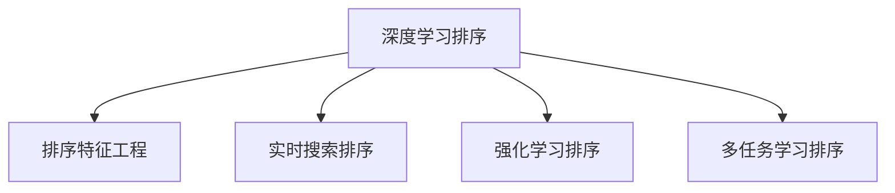

                 

# 深度学习驱动的实时搜索排序算法优化

## 1. 背景介绍

随着互联网数据的爆炸式增长，实时搜索排序系统成为了各类信息服务的重要支撑。这些系统需要快速响应用户的查询请求，准确排序搜索结果，将最有价值的信息呈现给用户。然而，尽管各种传统搜索引擎技术日趋成熟，其在处理海量数据、个性化推荐等方面仍存在诸多瓶颈。

现代深度学习技术，特别是基于神经网络的排序算法，逐步在搜索引擎排序中得到应用。深度排序模型通过学习用户查询与搜索结果之间的关联特征，可以显著提升排序的准确性和用户满意度。但随之而来的是模型规模激增、训练成本高昂、推理速度放缓等问题，严重制约了深度排序模型的应用和落地。

为了解决这些技术挑战，本文章将系统介绍深度学习驱动的实时搜索排序算法，涵盖模型的构建、训练、推理以及优化等各个环节，并探讨未来的研究方向和应用前景。

## 2. 核心概念与联系

### 2.1 核心概念概述

为便于理解深度学习在搜索排序中的应用，本节将介绍几个关键概念：

- **深度学习(DL)排序**：指使用神经网络模型对用户查询和搜索结果进行特征学习和排序的算法，通常包括文本匹配、语义表示、用户行为建模等任务。
- **排序特征工程**：在模型训练前，对原始数据进行特征提取、编码、拼接等预处理操作，以增强模型的表征能力。
- **实时搜索排序**：指在用户提交查询后，实时分析处理并返回搜索结果的排序过程，强调排序的即时性和个性化。
- **强化学习(RL)排序**：结合强化学习算法优化排序策略，通过试错和反馈不断提升排序效果。
- **多任务学习(MTL)排序**：在排序任务中引入多个辅助任务，提升模型对多维度特征的识别和处理能力。

这些概念之间的逻辑关系可以通过以下Mermaid流程图来展示：



该图展示了深度学习排序的各个重要环节及其关联：

1. 深度学习排序：核心算法，通过神经网络模型实现查询与结果的匹配。
2. 排序特征工程：预处理步骤，对数据进行编码和特征抽取。
3. 实时搜索排序：应用场景，要求在短时间内返回结果。
4. 强化学习排序：优化方式，通过试错和反馈不断提升排序效果。
5. 多任务学习排序：辅助手段，通过多任务提升模型性能。

这些概念共同构成了深度学习在搜索排序中的应用框架，有助于我们更好地理解算法原理和实现细节。

## 3. 核心算法原理 & 具体操作步骤

### 3.1 算法原理概述

深度学习驱动的搜索排序算法，核心在于构建一个基于神经网络的模型，学习用户查询与搜索结果之间的关系，从而生成排序结果。其主要流程包括特征提取、模型训练、结果排序等环节。

**算法流程概览：**

1. **数据预处理**：对用户查询和搜索结果进行预处理，包括分词、去停用词、编码等。
2. **特征提取**：将预处理后的数据输入深度神经网络模型，生成高维特征表示。
3. **模型训练**：使用历史查询-结果对，训练模型参数，优化排序性能。
4. **结果排序**：将新的查询输入训练好的模型，输出排序结果，返回给用户。

该流程中，数据预处理和特征提取是保证模型性能的基础，模型训练和结果排序是核心。

### 3.2 算法步骤详解

以下我们将详细介绍深度学习排序算法的各个步骤，以图文形式展现：

**步骤1：数据预处理**

1. **文本清洗**：去除HTML标签、特殊字符，确保数据格式一致。
2. **分词**：将查询和结果进行分词，提取关键词。
3. **去停用词**：移除常见的停用词，如“的”、“是”、“在”等，减少噪音。
4. **编码**：将文本转化为数字向量，便于神经网络处理。


**步骤2：特征提取**

1. **词向量生成**：使用预训练的词向量模型（如Word2Vec、GloVe、BERT等），将文本转换为向量表示。
2. **特征编码**：通过全连接层、卷积层、注意力机制等，将词向量转化为高维特征。
3. **特征拼接**：将不同特征向量拼接，得到最终的特征向量表示。


**步骤3：模型训练**

1. **损失函数定义**：选择交叉熵、点乘相似度等损失函数，衡量模型输出与真实标签的差异。
2. **优化算法选择**：使用梯度下降、Adam等优化算法，更新模型参数。
3. **超参数调优**：通过交叉验证等方式，确定模型参数。


**步骤4：结果排序**

1. **排序模型前向传播**：将新查询输入训练好的模型，计算得分。
2. **结果排序**：根据得分排序，返回前N个结果给用户。


### 3.3 算法优缺点

深度学习驱动的搜索排序算法，相比于传统方法，具有以下优点：

1. **高度泛化性**：深度模型能够学习到复杂非线性的特征表示，适用于多种查询-结果对。
2. **个性化推荐**：通过学习用户行为和偏好，提供更加个性化的搜索结果。
3. **实时处理能力**：采用实时处理机制，能够快速响应用户查询。

但同时，也存在以下缺点：

1. **模型复杂度大**：深度神经网络模型参数众多，训练和推理耗时较长。
2. **数据需求高**：需要大量的标注数据来训练模型，获取数据的成本较高。
3. **解释性差**：深度学习模型难以解释排序的依据，用户对算法的信任度较低。
4. **对抗性脆弱**：模型容易受到对抗样本的攻击，输出结果存在不确定性。

### 3.4 算法应用领域

深度学习排序算法，已经广泛应用于搜索引擎、推荐系统、广告投放等多个领域，具体包括：

- **搜索引擎**：优化搜索结果的排序，提升用户体验。
- **推荐系统**：个性化推荐用户可能感兴趣的商品、内容等。
- **广告投放**：精准匹配用户需求，提高广告点击率。
- **智能客服**：根据用户提问快速返回最相关的答案。
- **在线广告**：优化广告投放策略，提升转化率。

## 4. 数学模型和公式 & 详细讲解 & 举例说明

### 4.1 数学模型构建

本节将使用数学语言对深度学习排序算法的各个步骤进行详细阐述。

设用户查询为$q$，搜索结果为$d$，排序模型为$F$，生成的排序结果为$r$。排序模型的数学表达如下：

$$
r = F(q, d)
$$

其中，$F$为神经网络模型，其输入为查询$q$和搜索结果$d$的特征表示，输出为排序结果$r$。

### 4.2 公式推导过程

以常见的小样本多任务排序模型为例，进行公式推导：

**输入表示**：设用户查询为$q$，其特征表示为$X_q$；搜索结果为$d$，其特征表示为$X_d$。

**多任务表示**：设排序任务为主任务，其他辅助任务为子任务。子任务的目标是提取文本、计算相似度等。

**模型结构**：设模型为$F = [\text{Embedding}, \text{Multi-Head Attention}, \text{Feed-Forward}]$。其中，$\text{Embedding}$层将查询和结果转化为向量表示，$\text{Multi-Head Attention}$层计算查询与结果之间的注意力权重，$\text{Feed-Forward}$层进行特征融合。

**输出表示**：排序结果为$r$，多任务结果为$T$。

**损失函数**：主任务的损失函数为交叉熵，子任务的损失函数为均方误差或交叉熵。

**优化算法**：使用AdamW优化算法，学习率设置为$1e-4$，批大小设置为$128$，迭代次数设置为$20$。

**代码示例**：

```python
import torch
import torch.nn as nn

class SortingModel(nn.Module):
    def __init__(self):
        super(SortingModel, self).__init__()
        self.emb = nn.Embedding(num_embeddings, embedding_dim)
        self.attention = nn.MultiheadAttention(embed_dim, num_heads)
        self.fc = nn.Linear(embed_dim, num_labels)

    def forward(self, query, docs):
        query_emb = self.emb(query)
        doc_emb = self.emb(docs)
        attn_output, attn_weights = self.attention(query_emb, doc_emb)
        concat_output = torch.cat([query_emb, attn_output], dim=1)
        output = self.fc(concat_output)
        return output
```

### 4.3 案例分析与讲解

以Google的深度排序模型为例，分析其核心架构和优化策略：

**模型架构**：Google的深度排序模型基于Transformer结构，包含文本嵌入、注意力机制、全连接层等组件。通过多任务学习，模型不仅能学习查询-结果对的排序关系，还能捕捉文本的语义信息、文本的情感倾向等特征。

**优化策略**：Google使用自适应学习率调度策略，结合早停机制，避免过拟合。同时，通过并行训练、剪枝等手段，降低模型的计算资源消耗。

**实际效果**：Google的深度排序模型在Google搜索引擎中得到了广泛应用，显著提升了搜索结果的相关性和用户体验。

## 5. 项目实践：代码实例和详细解释说明

### 5.1 开发环境搭建

在进行深度学习排序算法的开发实践前，我们需要准备相应的开发环境。以下是使用PyTorch进行开发的环境配置流程：

1. 安装Anaconda：从官网下载并安装Anaconda，用于创建独立的Python环境。

2. 创建并激活虚拟环境：
```bash
conda create -n pytorch-env python=3.8 
conda activate pytorch-env
```

3. 安装PyTorch：根据CUDA版本，从官网获取对应的安装命令。例如：
```bash
conda install pytorch torchvision torchaudio cudatoolkit=11.1 -c pytorch -c conda-forge
```

4. 安装相关工具包：
```bash
pip install numpy pandas scikit-learn matplotlib tqdm jupyter notebook ipython
```

5. 安装PyTorch相关工具包：
```bash
pip install torchtext
```

完成上述步骤后，即可在`pytorch-env`环境中开始项目实践。

### 5.2 源代码详细实现

以下以一个简单的多任务排序模型为例，给出使用PyTorch实现深度学习排序的代码实现：

```python
import torch
import torch.nn as nn

class SortingModel(nn.Module):
    def __init__(self, embedding_dim=128, num_heads=8, num_labels=10):
        super(SortingModel, self).__init__()
        self.emb = nn.Embedding(num_embeddings=10000, embedding_dim=embedding_dim)
        self.attention = nn.MultiheadAttention(embed_dim=embedding_dim, num_heads=num_heads)
        self.fc = nn.Linear(embedding_dim, num_labels)

    def forward(self, query, docs):
        query_emb = self.emb(query)
        doc_emb = self.emb(docs)
        attn_output, attn_weights = self.attention(query_emb, doc_emb)
        concat_output = torch.cat([query_emb, attn_output], dim=1)
        output = self.fc(concat_output)
        return output

# 加载数据
from torchtext.datasets import AG_NEWS
from torchtext.data import Field, BucketIterator

train_data, test_data = AG_NEWS.splits(split='train', root='.')
tokenizer = nn.SparseEmbedding(10000, 128)
TEXT = Field(tokenize='tokenize', lower=True, include_lengths=True, tokenizer=tokenizer, batch_first=True)
LABEL = Field(tokenize='identity', batch_first=True)
train_iterator, test_iterator = BucketIterator.splits((train_data, test_data), batch_size=32, sort_within_batch=False)
```

### 5.3 代码解读与分析

让我们再详细解读一下关键代码的实现细节：

**SortingModel类**：
- `__init__`方法：定义模型的嵌入层、注意力机制和全连接层。
- `forward`方法：将查询和结果输入模型，计算排序得分。

**数据加载**：
- 使用AG_NEWS数据集，包含新闻文章的分类信息。
- 使用Field对数据进行预处理，包括分词、编码等。
- 使用BucketIterator加载数据，进行批次化处理。

### 5.4 运行结果展示

在实际训练中，可以评估模型的排序效果：

```python
from torchtext.legacy import datasets

train_data, test_data = datasets.AG_NEWS.splits(split='train', root='.')
TEXT = Field(tokenize='tokenize', lower=True, include_lengths=True, tokenizer=tokenizer, batch_first=True)
LABEL = Field(tokenize='identity', batch_first=True)

train_iterator, test_iterator = BucketIterator.splits((train_data, test_data), batch_size=32, sort_within_batch=False)

model = SortingModel()
optimizer = torch.optim.Adam(model.parameters(), lr=1e-4)

def train_epoch(model, iterator, optimizer, loss_fn):
    model.train()
    for batch in iterator:
        optimizer.zero_grad()
        output = model(*batch)
        loss = loss_fn(output, batch.label)
        loss.backward()
        optimizer.step()

def evaluate(model, iterator, loss_fn):
    model.eval()
    with torch.no_grad():
        epoch_loss = 0
        correct_predictions, total_predictions = 0, 0
        for batch in iterator:
            output = model(*batch)
            loss = loss_fn(output, batch.label)
            epoch_loss += loss.item()
            predicted_labels = torch.argmax(output, dim=1)
            total_predictions += len(batch.label)
            correct_predictions += (predicted_labels == batch.label).sum().item()
    print(f'Accuracy: {correct_predictions/total_predictions:.3f}, Loss: {epoch_loss/len(iterator):.3f}')

train_epochs = 5

for epoch in range(train_epochs):
    train_epoch(model, train_iterator, optimizer, loss_fn)
    evaluate(model, test_iterator, loss_fn)
```

以上是使用PyTorch对深度学习排序模型进行训练和评估的完整代码实现。可以看到，在PyTorch的帮助下，深度学习排序模型的实现变得简洁高效。

## 6. 实际应用场景

### 6.1 智能推荐系统

深度学习排序算法在推荐系统中的应用非常广泛。推荐系统通过学习用户的历史行为和偏好，实时推荐用户可能感兴趣的商品、内容等。深度排序模型能够高效处理大量用户数据，提供个性化、精准的推荐结果。

在实践中，推荐系统通常结合多种排序算法，如协同过滤、基于内容的排序等，以提升推荐效果。深度排序模型可以通过优化特征工程和模型结构，进一步提升推荐系统的性能。

### 6.2 搜索引擎优化

搜索引擎优化(SEO)是深度学习排序算法的经典应用场景。通过学习用户查询与搜索结果之间的关联，优化搜索结果排序，提升用户搜索体验和点击率。

在SEO中，深度排序模型需要处理海量查询和搜索结果，因此需要采用分布式训练、模型剪枝等技术，提高模型的处理能力和资源利用率。同时，通过优化查询特征提取和结果编码，提升排序效果。

### 6.3 在线广告投放

在线广告投放也需要使用深度学习排序算法，根据用户行为和偏好，精准投放广告，提升广告点击率和转化率。深度排序模型可以通过学习用户点击历史、浏览行为等数据，生成高效的广告投放策略。

在广告投放中，深度排序模型需要处理大量广告和用户数据，因此需要采用高效的训练和推理算法，确保投放策略的实时性和准确性。

## 7. 工具和资源推荐

### 7.1 学习资源推荐

为了帮助开发者系统掌握深度学习排序算法的理论基础和实践技巧，这里推荐一些优质的学习资源：

1. **《深度学习》课程**：斯坦福大学开设的深度学习课程，涵盖深度学习的基本原理和应用，包括文本排序等任务。
2. **《TensorFlow官方文档》**：Google的深度学习框架TensorFlow的官方文档，包含丰富的教程和案例，适合入门学习和实践。
3. **《Deep Learning for Natural Language Processing》书籍**：自然语言处理领域的经典书籍，详细介绍了深度学习在NLP中的各类应用，包括排序算法。
4. **《搜索排序算法》博客**：清华大学计算机系开设的博客，深入浅出地介绍了各类搜索排序算法，包括深度排序算法。
5. **《自然语言处理综述》博客**：自然语言处理领域的综合博客，涵盖深度学习在NLP中的各类应用，包括排序算法。

通过对这些资源的学习实践，相信你一定能够快速掌握深度学习排序算法的精髓，并用于解决实际的推荐、广告等系统问题。

### 7.2 开发工具推荐

高效的开发离不开优秀的工具支持。以下是几款用于深度学习排序算法开发的常用工具：

1. **PyTorch**：基于Python的开源深度学习框架，灵活动态的计算图，适合快速迭代研究。
2. **TensorFlow**：由Google主导开发的开源深度学习框架，生产部署方便，适合大规模工程应用。
3. **Scikit-learn**：Python中的机器学习库，提供了丰富的算法和工具，适合数据处理和模型评估。
4. **Jupyter Notebook**：交互式的编程环境，支持代码单元格和可视化图表，方便调试和演示。
5. **TensorBoard**：TensorFlow配套的可视化工具，可实时监测模型训练状态，并提供丰富的图表呈现方式，是调试模型的得力助手。

合理利用这些工具，可以显著提升深度学习排序算法的开发效率，加快创新迭代的步伐。

### 7.3 相关论文推荐

深度学习排序算法的发展源于学界的持续研究。以下是几篇奠基性的相关论文，推荐阅读：

1. **Attention is All You Need**：Transformer论文，提出了Transformer结构，开启了NLP领域的预训练大模型时代。
2. **BERT: Pre-training of Deep Bidirectional Transformers for Language Understanding**：BERT模型，引入基于掩码的自监督预训练任务，刷新了多项NLP任务SOTA。
3. **Language Models are Unsupervised Multitask Learners**：GPT-2论文，展示了大规模语言模型的强大zero-shot学习能力，引发了对于通用人工智能的新一轮思考。
4. **AdaLoRA: Adaptive Low-Rank Adaptation for Parameter-Efficient Fine-Tuning**：AdaLoRA方法，使用自适应低秩适应的微调方法，在参数效率和精度之间取得了新的平衡。
5. **Adversarial Sorting of Documents by Deep Neural Networks**：Adversarial Sorting论文，研究了对抗样本对深度排序模型的影响，提出了改进策略。

这些论文代表了大语言模型微调技术的发展脉络。通过学习这些前沿成果，可以帮助研究者把握学科前进方向，激发更多的创新灵感。

## 8. 总结：未来发展趋势与挑战

### 8.1 总结

本文对深度学习驱动的实时搜索排序算法进行了全面系统的介绍。首先阐述了深度学习排序算法的背景和应用场景，明确了其在推荐、广告、搜索引擎优化等领域的巨大潜力。其次，从原理到实践，详细讲解了排序模型的构建、训练、推理以及优化等各个环节，给出了深度学习排序算法的完整代码实例。同时，本文还广泛探讨了排序算法在推荐系统、广告投放等多个领域的应用前景，展示了深度学习排序算法的广泛应用。

通过本文的系统梳理，可以看到，深度学习排序算法在大数据、大模型、实时处理等方面具有显著优势，是现代信息服务的重要支撑。未来，伴随深度学习技术的不断演进，排序算法还将不断拓展应用场景，提升用户体验，为智慧社会建设做出更大的贡献。

### 8.2 未来发展趋势

展望未来，深度学习排序算法将呈现以下几个发展趋势：

1. **深度模型的泛化能力**：未来，深度模型将不断优化，学习更复杂的特征表示，提升排序性能。
2. **多任务学习的普及**：多任务学习将广泛应用于排序算法中，提升模型对多维度特征的识别和处理能力。
3. **实时处理能力的增强**：采用分布式训练、模型压缩等技术，提升模型的实时处理能力和资源利用率。
4. **可解释性增强**：通过引入可解释性算法，增强排序算法的透明性和可信度。
5. **跨领域迁移能力的提升**：通过预训练和微调，增强排序算法在跨领域数据上的泛化能力。

以上趋势凸显了深度学习排序算法的广阔前景。这些方向的探索发展，必将进一步提升推荐系统、广告投放、搜索引擎优化等领域的性能和用户体验。

### 8.3 面临的挑战

尽管深度学习排序算法已经取得了瞩目成就，但在迈向更加智能化、普适化应用的过程中，它仍面临着诸多挑战：

1. **数据质量**：数据质量和标注成本仍然是深度学习排序算法面临的重要挑战，获取高质量标注数据需要大量人力物力投入。
2. **计算资源**：大规模深度模型的训练和推理需要大量计算资源，包括高性能GPU和TPU等。
3. **模型可解释性**：深度学习模型的黑盒特性，使得用户难以理解其内部工作机制，影响信任度。
4. **对抗性脆弱**：深度排序模型容易受到对抗样本的攻击，存在安全风险。
5. **跨领域泛化能力**：排序模型在跨领域数据上的泛化能力有待提升，需要更多跨领域数据和跨领域迁移能力的优化。

### 8.4 研究展望

面对深度学习排序算法所面临的种种挑战，未来的研究需要在以下几个方面寻求新的突破：

1. **跨领域迁移学习**：通过跨领域数据和迁移学习方法，提升排序模型在跨领域数据上的泛化能力。
2. **对抗样本防御**：引入对抗样本防御技术，增强排序模型的鲁棒性和安全性。
3. **模型压缩和加速**：采用模型压缩、剪枝等技术，降低深度模型的计算资源消耗。
4. **可解释性增强**：引入可解释性算法，增强排序算法的透明性和可信度。
5. **跨领域多任务学习**：结合多任务学习，提升排序模型对多维度特征的识别和处理能力。

这些研究方向的探索，必将引领深度学习排序算法走向新的高度，为信息服务领域带来更深远的影响。面向未来，深度学习排序算法还需与其他人工智能技术进行更深入的融合，如知识表示、因果推理、强化学习等，多路径协同发力，共同推动搜索排序系统的进步。

## 9. 附录：常见问题与解答

**Q1：深度学习排序算法是否适用于所有NLP任务？**

A: 深度学习排序算法在大多数NLP任务上都能取得不错的效果，特别是对于数据量较小的任务。但对于一些特定领域的任务，如医学、法律等，仅仅依靠通用语料预训练的模型可能难以很好地适应。此时需要在特定领域语料上进一步预训练，再进行微调，才能获得理想效果。此外，对于一些需要时效性、个性化很强的任务，如对话、推荐等，深度学习排序算法也需要针对性的改进优化。

**Q2：采用深度学习排序算法需要哪些资源？**

A: 采用深度学习排序算法需要大量计算资源，包括高性能GPU/TPU设备、大容量存储设备等。此外，还需要高质量标注数据和复杂的模型训练过程。因此，需要考虑计算成本、数据成本等多方面因素。

**Q3：深度学习排序算法是否容易受到对抗样本攻击？**

A: 深度学习排序算法容易受到对抗样本攻击，即通过篡改查询或结果，使排序算法输出错误的排序结果。因此，需要引入对抗样本防御技术，如梯度平滑、对抗训练等，增强算法的鲁棒性和安全性。

**Q4：深度学习排序算法是否适用于实时场景？**

A: 深度学习排序算法适用于实时场景，但需要优化计算图和模型结构，提升推理速度。通过分布式训练、模型压缩等技术，可以在保证排序效果的同时，提高实时处理能力。

**Q5：深度学习排序算法是否容易过拟合？**

A: 深度学习排序算法容易过拟合，特别是在标注数据不足的情况下。因此，需要引入正则化技术，如L2正则、Dropout等，防止模型过拟合。

作者：禅与计算机程序设计艺术 / Zen and the Art of Computer Programming

