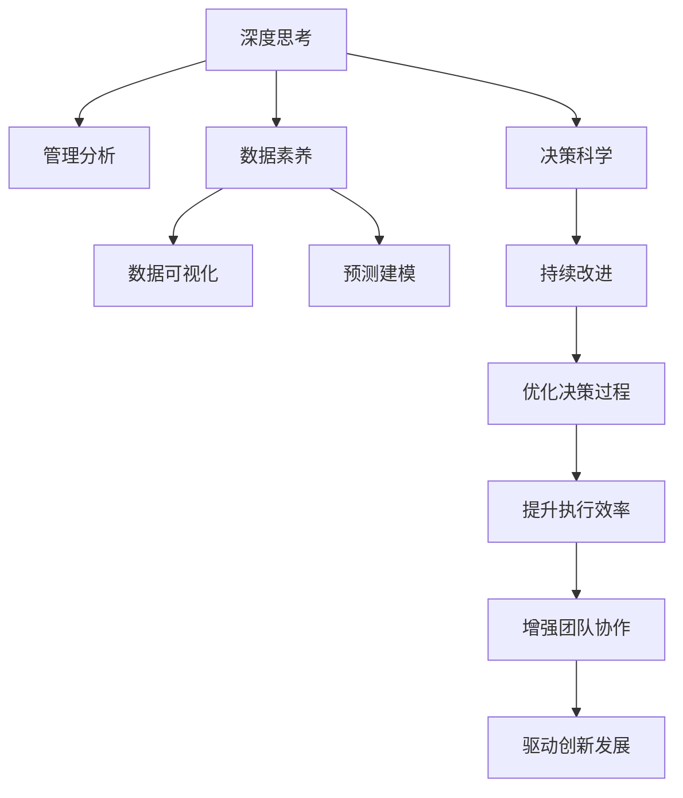

                 

## 1. 背景介绍

### 1.1 问题由来
在信息爆炸的时代，无论是企业管理者还是普通员工，都面临着海量信息的冲击。如何从复杂繁杂的数据中提取关键信息，做出精准的决策，已成为当今社会的一大难题。传统的经验主义决策方式已难以满足需求，而基于数据驱动的深度思考与管理分析能力提升，正逐渐成为新时代职场人士必备的核心竞争力。

### 1.2 问题核心关键点
深度思考与管理分析能力提升的核心在于：
1. **数据理解与解读**：有效识别、分析数据背后的关键信息和潜在问题。
2. **多维度融合**：结合数据、经验、情绪等多种维度，进行综合判断和决策。
3. **预测与规划**：基于数据分析，预测未来趋势，制定切实可行的策略和计划。
4. **持续改进**：不断优化决策过程，提升决策质量和效率。

这些关键点共同构成了深度思考与管理分析能力提升的核心目标，使得决策者能够在复杂多变的环境下，做出更准确、更有效的决策。

### 1.3 问题研究意义
提升深度思考与管理分析能力，对于改善企业管理水平、优化资源配置、提高团队协作效率具有重要意义：

1. **优化决策过程**：减少决策的盲目性和随意性，提高决策的科学性和准确性。
2. **提升执行效率**：优化资源配置，确保任务按照最优化路径进行，减少资源浪费。
3. **增强团队协作**：基于数据分析和共享信息，促进团队协作，提高整体绩效。
4. **驱动创新发展**：通过深度思考与管理分析，捕捉新机会，推动企业持续创新。

## 2. 核心概念与联系

### 2.1 核心概念概述
为更好地理解深度思考与管理分析能力提升的实践方法，本节将介绍几个密切相关的核心概念：

- **深度思考(Deep Thinking)**：深入分析问题本质，考虑多角度、多维度信息，综合判断并提出合理解决方案的能力。
- **管理分析(Management Analysis)**：基于数据和分析结果，制定科学决策和管理策略的能力。
- **数据素养(Data Literacy)**：理解和应用数据的基本能力，包括数据收集、处理、分析和解读。
- **数据可视化(Data Visualization)**：通过图表、图形等方式，直观展示数据特征，便于理解与分析。
- **预测建模(Predictive Modeling)**：使用统计学、机器学习等方法，对未来趋势进行预测和分析。
- **决策科学(Decision Science)**：基于数据和分析结果，制定科学、合理的决策过程和策略。
- **持续改进(Continuous Improvement)**：通过不断优化和迭代，提升决策过程和结果的质量和效率。

这些核心概念之间的逻辑关系可以通过以下Mermaid流程图来展示：



这个流程图展示了一系列核心概念及其之间的关系：

1. 深度思考和管理分析能力提升从数据素养入手，通过数据可视化和预测建模等工具，结合决策科学，制定科学决策。
2. 持续改进过程，通过不断优化和迭代，提升决策过程和结果的质量和效率。

这些概念共同构成了深度思考与管理分析能力提升的理论基础，使得决策者能够有效应对复杂多变的环境，做出高质量的决策。

## 3. 核心算法原理 & 具体操作步骤

### 3.1 算法原理概述
深度思考与管理分析能力提升的算法原理，主要基于数据驱动的决策科学。其核心思想是：利用先进的数据分析和预测技术，结合人的智慧和经验，通过综合判断和科学决策，优化资源配置和管理过程。

具体来说，深度思考与管理分析能力提升包括以下几个关键步骤：
1. **数据收集**：通过多种渠道收集相关数据，包括定量数据和定性数据。
2. **数据分析**：使用统计学、机器学习等方法，对数据进行清洗、处理和分析，提取关键信息。
3. **数据可视化**：通过图表、图形等手段，直观展示数据分析结果，便于理解和决策。
4. **预测建模**：使用模型预测未来趋势，提供决策参考。
5. **决策制定**：结合数据分析和预测结果，制定科学、合理的决策和策略。
6. **实施与评估**：将决策转化为具体行动，并持续评估和优化决策过程。

### 3.2 算法步骤详解

**Step 1: 数据收集**
- 确定数据来源：包括内部系统数据、市场调研数据、客户反馈数据等。
- 选择合适的数据采集工具：如问卷调查、API接口、数据库查询等。
- 设计数据采集流程：确保数据采集的全面性和准确性。

**Step 2: 数据处理与清洗**
- 数据预处理：包括缺失值处理、异常值检测、数据类型转换等。
- 数据清洗：去除重复、错误、不完整的数据，确保数据质量。
- 特征工程：选择合适的特征，进行数据标准化、归一化等处理。

**Step 3: 数据分析与解读**
- 探索性数据分析(EDA)：使用统计学方法，探索数据分布、趋势等特征。
- 描述性统计：计算均值、中位数、标准差等指标，描述数据特征。
- 因果分析：识别因果关系，分析数据背后的原因和影响因素。

**Step 4: 数据可视化**
- 选择合适的可视化工具：如Tableau、Power BI、Matplotlib等。
- 设计可视化方案：根据数据特征，选择合适的图表类型，展示关键信息。
- 解读可视化结果：结合业务背景，分析数据趋势和模式，发现潜在问题。

**Step 5: 预测建模**
- 选择合适的预测模型：如线性回归、决策树、神经网络等。
- 数据拆分与交叉验证：将数据分为训练集和测试集，进行模型训练和评估。
- 模型优化与调参：使用网格搜索、随机搜索等方法，优化模型参数。

**Step 6: 决策制定**
- 制定决策方案：结合数据分析和预测结果，制定具体的决策和策略。
- 模拟与风险评估：使用模拟方法，评估决策方案的可行性和风险。
- 审批与实施：将决策方案提交给相关部门审批，并按照计划执行。

**Step 7: 实施与评估**
- 持续监控与反馈：实时监控决策执行效果，收集反馈信息。
- 优化与迭代：根据反馈信息，优化决策过程和结果。
- 结果评估：评估决策效果，总结经验教训，持续改进。

### 3.3 算法优缺点

深度思考与管理分析能力提升的算法具有以下优点：
1. **数据驱动决策**：通过分析数据，避免主观判断，提升决策的科学性和准确性。
2. **全面考虑因素**：结合多种数据类型和分析方法，全面评估决策方案。
3. **持续优化改进**：通过不断优化和迭代，提升决策过程和结果的质量。

同时，该算法也存在一定的局限性：
1. **数据质量依赖**：数据收集和处理的质量直接影响分析结果，需投入大量资源和时间。
2. **技术门槛较高**：数据分析和预测建模需要较高的技术水平，对技术人才的需求较大。
3. **复杂多变环境**：面对复杂多变的环境，数据分析结果可能存在偏差。
4. **成本较高**：数据收集、处理、分析和可视化等步骤，需投入大量成本。

尽管存在这些局限性，但深度思考与管理分析能力提升仍然是目前最科学、最有效的决策方法之一，广泛应用于企业决策、项目评估、风险管理等多个领域。

### 3.4 算法应用领域

深度思考与管理分析能力提升在多个领域都有广泛应用，以下是几个典型案例：

- **企业管理**：通过分析销售数据、客户反馈等，优化资源配置，制定管理策略。
- **项目规划**：基于项目进度、成本等数据，进行风险评估和资源优化，制定详细规划。
- **人力资源**：通过分析员工绩效、满意度等数据，优化人力资源配置，提升员工满意度。
- **市场营销**：分析市场趋势、客户行为等数据，制定营销策略，提升市场竞争力。
- **财务分析**：利用财务数据，进行财务预测和风险评估，优化财务决策。
- **供应链管理**：通过分析供应链数据，优化供应链流程，提高效率和降低成本。
- **健康管理**：分析健康数据，提供个性化健康建议，提升健康管理水平。

这些应用案例展示了深度思考与管理分析能力提升在不同领域的广泛应用，显著提升了决策的科学性和效率。

## 4. 数学模型和公式 & 详细讲解 & 举例说明

### 4.1 数学模型构建

本节将使用数学语言对深度思考与管理分析能力提升的算法过程进行更加严格的刻画。

假设我们有一组数据集 $D=\{(x_i,y_i)\}_{i=1}^N$，其中 $x_i$ 为特征向量，$y_i$ 为标签。我们的目标是通过数据分析和预测，优化决策过程。

### 4.2 公式推导过程

假设我们选择线性回归模型进行预测，目标函数为：

$$
\min_{\theta} \sum_{i=1}^N (y_i - \hat{y}_i)^2
$$

其中 $\hat{y}_i = \theta^T x_i$，$\theta$ 为模型参数。

根据梯度下降算法，求解目标函数的极小值，更新参数 $\theta$ 的公式为：

$$
\theta \leftarrow \theta - \eta \nabla_{\theta} \sum_{i=1}^N (y_i - \hat{y}_i)^2
$$

其中 $\eta$ 为学习率，$\nabla_{\theta} \sum_{i=1}^N (y_i - \hat{y}_i)^2$ 为损失函数对参数 $\theta$ 的梯度，可通过反向传播算法高效计算。

### 4.3 案例分析与讲解

以一个简单的销售数据为例，分析如何通过深度思考与管理分析能力提升，优化销售策略。

假设某公司的销售数据如下：

| 月份 | 销售额 |
|------|--------|
| 1月  | 100    |
| 2月  | 120    |
| 3月  | 110    |
| 4月  | 130    |
| 5月  | 140    |
| 6月  | 150    |
| 7月  | 160    |
| 8月  | 170    |
| 9月  | 180    |
| 10月 | 200    |
| 11月 | 210    |
| 12月 | 220    |

我们可以使用线性回归模型，预测下个月份的销售额。首先，对数据进行标准化处理：

$$
x_i = \frac{x_i - \mu}{\sigma}
$$

其中 $\mu$ 为均值，$\sigma$ 为标准差。标准化后的数据为：

| 月份 | 销售额 |
|------|--------|
| 1月  | -0.5   |
| 2月  | -0.2   |
| 3月  | 0.0    |
| 4月  | 0.3    |
| 5月  | 0.5    |
| 6月  | 0.7    |
| 7月  | 0.9    |
| 8月  | 1.1    |
| 9月  | 1.3    |
| 10月 | 1.5    |
| 11月 | 1.7    |
| 12月 | 1.9    |

然后，建立线性回归模型，求解目标函数：

$$
\min_{\theta} \sum_{i=1}^N (y_i - \theta^T x_i)^2
$$

使用梯度下降算法求解目标函数的极小值，更新参数 $\theta$。具体步骤为：

1. 初始化参数 $\theta$。
2. 前向传播计算预测值 $\hat{y}_i = \theta^T x_i$。
3. 计算损失函数 $\ell = \sum_{i=1}^N (y_i - \hat{y}_i)^2$。
4. 反向传播计算梯度 $\nabla_{\theta} \ell$。
5. 更新参数 $\theta \leftarrow \theta - \eta \nabla_{\theta} \ell$。
6. 重复步骤2-5，直至收敛。

通过上述步骤，我们得到了优化后的线性回归模型，可以预测下个月份的销售额。这种基于数据驱动的决策方式，不仅提升了决策的科学性，还能实时监控和调整策略，确保销售目标的实现。

## 5. 项目实践：代码实例和详细解释说明

### 5.1 开发环境搭建

在进行深度思考与管理分析能力提升的实践前，我们需要准备好开发环境。以下是使用Python进行PyTorch开发的环境配置流程：

1. 安装Anaconda：从官网下载并安装Anaconda，用于创建独立的Python环境。

2. 创建并激活虚拟环境：
```bash
conda create -n deepthinking-env python=3.8 
conda activate deepthinking-env
```

3. 安装PyTorch：根据CUDA版本，从官网获取对应的安装命令。例如：
```bash
conda install pytorch torchvision torchaudio cudatoolkit=11.1 -c pytorch -c conda-forge
```

4. 安装相关库：
```bash
pip install numpy pandas scikit-learn matplotlib
```

5. 安装可视化工具：
```bash
pip install plotly seaborn
```

完成上述步骤后，即可在`deepthinking-env`环境中开始项目实践。

### 5.2 源代码详细实现

下面我们以销售数据分析为例，给出使用PyTorch进行线性回归模型的代码实现。

首先，导入必要的库：

```python
import torch
import torch.nn as nn
import torch.optim as optim
import numpy as np
import pandas as pd
import matplotlib.pyplot as plt
import seaborn as sns
```

然后，读取数据并处理：

```python
df = pd.read_csv('sales_data.csv')
df = df.iloc[:, :-1].values
y = df[:, -1].values

# 标准化处理
mean = np.mean(df, axis=0)
std = np.std(df, axis=0)
df = (df - mean) / std

X = df
```

接着，定义模型：

```python
class LinearRegression(nn.Module):
    def __init__(self, input_dim):
        super(LinearRegression, self).__init__()
        self.linear = nn.Linear(input_dim, 1)

    def forward(self, x):
        return self.linear(x)

input_dim = X.shape[1]
model = LinearRegression(input_dim)
```

然后，定义损失函数和优化器：

```python
criterion = nn.MSELoss()
optimizer = optim.SGD(model.parameters(), lr=0.01)
```

接着，定义训练函数：

```python
def train(model, X, y, epochs, batch_size):
    model.train()
    for epoch in range(epochs):
        indices = np.random.permutation(len(X))
        X, y = X[indices], y[indices]
        for i in range(0, len(X), batch_size):
            start = i
            end = min(i + batch_size, len(X))
            X_batch = X[start:end]
            y_batch = y[start:end]
            optimizer.zero_grad()
            outputs = model(X_batch)
            loss = criterion(outputs, y_batch)
            loss.backward()
            optimizer.step()
            if (i + batch_size) % 100 == 0:
                print(f"Epoch {epoch+1}, loss: {loss.item():.3f}")
```

最后，启动训练流程：

```python
train(model, X, y, epochs=1000, batch_size=32)
```

以上就是使用PyTorch进行线性回归模型训练的完整代码实现。可以看到，通过使用深度学习框架，我们能够方便地定义模型、损失函数和优化器，进行高效的训练和预测。

### 5.3 代码解读与分析

让我们再详细解读一下关键代码的实现细节：

**读取和处理数据**：
- 使用`pandas`库读取数据，通过`iloc`方法选择特征和标签。
- 使用`numpy`库进行标准化处理，将数据转化为模型所需的格式。

**定义模型**：
- 继承`nn.Module`，定义`LinearRegression`模型类。
- 在`__init__`方法中，定义一个线性层，用于将输入特征映射到标签。
- 在`forward`方法中，实现前向传播，计算预测值。

**定义损失函数和优化器**：
- 使用`nn.MSELoss`作为损失函数，计算均方误差。
- 使用`optim.SGD`优化器，设置学习率。

**训练函数**：
- 在`train`函数中，进行模型训练。
- 使用随机抽样，将数据随机分为多个批次进行训练。
- 在每个批次上，前向传播计算预测值和损失函数，反向传播更新模型参数。
- 在每100个批次后，输出训练过程中的损失值。

**训练流程**：
- 设置训练轮数和批次大小。
- 调用`train`函数，开始模型训练。

可以看出，深度思考与管理分析能力提升的实践过程，主要依赖于数据处理、模型定义、训练和预测等步骤。通过合理的算法设计和优化，可以在复杂多变的环境中，做出科学、高效的决策。

## 6. 实际应用场景

### 6.1 智能推荐系统

智能推荐系统已经成为各大电商、视频、社交平台的重要功能。通过深度思考与管理分析能力提升，推荐系统能够更加精准地匹配用户需求，提升用户体验和平台粘性。

具体而言，推荐系统通过分析用户的历史行为数据，如浏览记录、购买记录等，结合实时数据，进行综合判断和决策。通过预测模型，预测用户可能感兴趣的商品或内容，生成个性化推荐结果。在推荐过程中，不断收集用户反馈，优化模型参数和策略，提升推荐效果。

### 6.2 财务分析

财务分析是企业决策的重要环节，通过深度思考与管理分析能力提升，企业能够更加精准地评估财务状况，制定科学的发展战略。

具体而言，企业可以通过分析历史财务数据，如营收、成本、现金流等，结合市场趋势、行业标准等，进行综合判断和决策。通过预测模型，预测未来的财务状况，进行风险评估和决策优化。在分析过程中，结合定性数据，如管理层意见、市场预测等，进行综合判断和决策。

### 6.3 供应链管理

供应链管理是企业运营的关键环节，通过深度思考与管理分析能力提升，企业能够更加精准地预测和控制供应链流程，提升运营效率和降低成本。

具体而言，企业可以通过分析历史供应链数据，如订单量、交货时间、库存量等，结合实时数据，进行综合判断和决策。通过预测模型，预测未来的供应链需求，进行库存管理和产能规划。在管理过程中，结合供应链合作伙伴的信息，进行综合判断和决策。

### 6.4 未来应用展望

随着深度思考与管理分析能力提升的不断进步，未来将会有更多应用场景得到拓展。

在智慧城市治理中，深度思考与管理分析能力提升将广泛应用于城市事件监测、舆情分析、应急指挥等环节，提高城市管理的自动化和智能化水平，构建更安全、高效的未来城市。

在健康管理中，深度思考与管理分析能力提升将应用于健康数据分析、疾病预测、个性化健康建议等环节，提升健康管理水平。

在金融领域，深度思考与管理分析能力提升将应用于金融舆情监测、投资策略优化、风险评估等环节，提升金融决策的科学性和准确性。

总之，深度思考与管理分析能力提升在各行各业的应用前景广阔，将为各行各业带来新的变革和机遇。

## 7. 工具和资源推荐

### 7.1 学习资源推荐

为了帮助开发者系统掌握深度思考与管理分析能力提升的理论基础和实践技巧，这里推荐一些优质的学习资源：

1. 《数据科学入门》系列博文：由大模型技术专家撰写，深入浅出地介绍了数据科学的基本概念和常用方法。

2. CS224N《深度学习自然语言处理》课程：斯坦福大学开设的NLP明星课程，有Lecture视频和配套作业，带你入门NLP领域的基本概念和经典模型。

3. 《Python数据科学手册》书籍：详细介绍了使用Python进行数据科学开发的最佳实践，涵盖数据清洗、处理、分析、可视化等全流程。

4. Coursera《数据科学专业》课程：由多个知名大学开设，提供全面的数据科学课程体系，覆盖数据科学和数据分析的各个方面。

5. Kaggle数据科学竞赛：通过参与Kaggle数据科学竞赛，积累实战经验，提高解决问题的能力。

通过对这些资源的学习实践，相信你一定能够快速掌握深度思考与管理分析能力提升的精髓，并用于解决实际的决策问题。

### 7.2 开发工具推荐

高效的开发离不开优秀的工具支持。以下是几款用于深度思考与管理分析能力提升开发的常用工具：

1. Jupyter Notebook：支持Python、R等多种语言，方便进行数据处理、模型训练和结果展示。

2. Python：广泛应用的数据科学编程语言，拥有丰富的库和工具支持。

3. R：广泛应用的数据科学编程语言，拥有丰富的统计分析和可视化工具。

4. Power BI：微软推出的数据可视化工具，支持丰富的图表和交互功能，方便进行数据展示和分析。

5. Tableau：广泛应用的数据可视化工具，支持多种数据源和图表类型，方便进行数据分析和决策支持。

6. Matplotlib：Python的绘图库，支持丰富的图表类型和自定义设置，方便进行数据可视化。

7. Seaborn：基于Matplotlib的数据可视化库，支持高级图表和统计分析，方便进行数据展示和分析。

合理利用这些工具，可以显著提升深度思考与管理分析能力提升的开发效率，加快创新迭代的步伐。

### 7.3 相关论文推荐

深度思考与管理分析能力提升的研究源于学界的持续研究。以下是几篇奠基性的相关论文，推荐阅读：

1. Deep Learning（深度学习）：Ian Goodfellow等著，详细介绍了深度学习的基本原理和应用。

2. The Elements of Statistical Learning（统计学习方法）：Tibshirani等著，详细介绍了统计学习的基本方法和应用。

3. Data Science for Business（商业数据科学）：Foster Provost等著，介绍了如何将数据科学应用于商业决策。

4. Machine Learning Yearning（机器学习实战）：Andrew Ng著，介绍了机器学习的应用实践和最佳实践。

5. Predictive Modeling：Berk et al.著，详细介绍了预测建模的基本方法和应用。

6. Financial Machine Learning：Rapach等著，介绍了金融领域的应用预测建模。

这些论文代表了大模型微调技术的发展脉络。通过学习这些前沿成果，可以帮助研究者把握学科前进方向，激发更多的创新灵感。

## 8. 总结：未来发展趋势与挑战

### 8.1 总结

本文对深度思考与管理分析能力提升的算法原理和操作步骤进行了全面系统的介绍。首先阐述了深度思考与管理分析能力提升的研究背景和意义，明确了数据分析和决策科学的重要作用。其次，从原理到实践，详细讲解了深度思考与管理分析能力提升的数学模型和算法步骤，给出了完整的代码实例。同时，本文还广泛探讨了深度思考与管理分析能力提升在各行各业的应用前景，展示了其广阔的发展空间。此外，本文精选了深度思考与管理分析能力提升的学习资源、开发工具和相关论文，力求为读者提供全方位的技术指引。

通过本文的系统梳理，可以看到，深度思考与管理分析能力提升技术正逐渐成为各行各业的重要决策工具，显著提升了决策的科学性和效率。未来，伴随深度学习、机器学习等技术的不断发展，基于数据驱动的决策方法将进一步得到优化和提升。

### 8.2 未来发展趋势

展望未来，深度思考与管理分析能力提升技术将呈现以下几个发展趋势：

1. **自动化决策**：随着深度学习、强化学习等技术的发展，未来将出现更多的自动化决策系统，能够自动进行数据分析和决策，提高决策效率。

2. **实时决策**：通过引入实时数据流和预测模型，实现实时决策和动态调整，提高决策的及时性和适应性。

3. **多源数据融合**：结合不同来源的数据，进行综合分析，提升决策的全面性和准确性。

4. **跨领域应用**：将深度思考与管理分析能力提升技术应用于更多领域，如健康、金融、供应链等，拓展应用范围。

5. **可视化增强**：通过增强数据可视化工具，提供更加直观和交互式的数据展示方式，提升决策过程的可解释性和可操作性。

6. **模型解释性**：通过引入模型解释工具，提高决策过程的可解释性和可理解性，增强用户信任和接受度。

以上趋势凸显了深度思考与管理分析能力提升技术的广阔前景。这些方向的探索发展，必将进一步提升决策的科学性和效率，推动各行各业的智能化升级。

### 8.3 面临的挑战

尽管深度思考与管理分析能力提升技术已经取得了显著成果，但在迈向更加智能化、普适化应用的过程中，仍面临诸多挑战：

1. **数据隐私和安全**：在数据驱动的决策过程中，如何保护用户隐私和数据安全，避免数据泄露和滥用，是一大挑战。

2. **数据质量和完整性**：数据质量和完整性对决策结果具有重要影响，如何确保数据采集和处理的准确性，是一大难题。

3. **计算资源需求**：深度学习和大规模数据分析需要大量的计算资源，如何优化资源使用，提高计算效率，是一大挑战。

4. **模型可解释性**：复杂的深度学习模型通常难以解释，如何提高模型可解释性，增强用户信任，是一大难题。

5. **跨领域应用难度**：将深度思考与管理分析能力提升技术应用于不同领域，需要根据领域特点进行模型优化和策略调整，是一大挑战。

6. **伦理和道德问题**：在数据驱动的决策过程中，如何避免偏见和歧视，确保决策的公平性和公正性，是一大难题。

这些挑战凸显了深度思考与管理分析能力提升技术在实际应用中需要不断优化和改进。只有在解决这些挑战的过程中，深度思考与管理分析能力提升技术才能真正发挥其应有的价值。

### 8.4 研究展望

面对深度思考与管理分析能力提升技术面临的挑战，未来的研究需要在以下几个方面寻求新的突破：

1. **数据隐私保护**：引入隐私保护技术，确保数据采集和处理过程中的隐私保护。

2. **数据质量优化**：改进数据清洗和处理算法，确保数据采集和处理的准确性。

3. **计算资源优化**：引入分布式计算和模型压缩技术，优化计算资源使用。

4. **模型解释性增强**：引入模型解释工具和可解释性算法，提高模型可解释性。

5. **跨领域应用适配**：根据领域特点进行模型优化和策略调整，提升跨领域应用效果。

6. **伦理和道德约束**：引入伦理导向的评估指标和监管机制，确保决策的公平性和公正性。

这些研究方向的探索，必将引领深度思考与管理分析能力提升技术迈向更高的台阶，为各行各业带来更加智能、高效的决策支持。

## 9. 附录：常见问题与解答

**Q1：深度思考与管理分析能力提升适用于所有决策场景吗？**

A: 深度思考与管理分析能力提升技术适用于大多数决策场景，但并不是所有决策场景都适合采用数据驱动的决策方式。对于某些需要深度背景知识或经验积累的决策场景，数据驱动的决策方式可能难以完全替代。

**Q2：如何确保数据质量和完整性？**

A: 确保数据质量和完整性需要从数据采集、处理和存储的各个环节入手。数据采集阶段，应明确数据来源和采集方式，避免数据采集过程中的偏差和错误。数据处理阶段，应进行数据清洗和异常值检测，确保数据的一致性和完整性。数据存储阶段，应选择合适的存储方式和备份策略，确保数据的安全性和可用性。

**Q3：如何提高模型的可解释性？**

A: 提高模型的可解释性需要从模型设计和算法优化两个方面入手。模型设计方面，应选择可解释性较高的模型结构，如线性回归、决策树等。算法优化方面，应引入模型解释工具，如LIME、SHAP等，提高模型可解释性。

**Q4：如何优化计算资源使用？**

A: 优化计算资源使用需要从模型压缩、分布式计算和资源调度三个方面入手。模型压缩方面，应使用模型压缩技术，如剪枝、量化等，减少模型大小和计算量。分布式计算方面，应使用分布式计算框架，如Spark、TensorFlow分布式等，提高计算效率。资源调度方面，应优化资源调度策略，根据任务需求动态调整资源配置。

**Q5：如何在跨领域应用中提高深度思考与管理分析能力提升的效果？**

A: 在跨领域应用中提高深度思考与管理分析能力提升的效果，需要根据领域特点进行模型优化和策略调整。应结合领域知识，选择合适的特征和模型，进行模型优化和策略调整。同时，应引入领域专家的知识和经验，进行模型验证和调整。

这些解答和建议，希望能帮助读者更好地理解和应用深度思考与管理分析能力提升技术，解决实际决策问题。

---

作者：禅与计算机程序设计艺术 / Zen and the Art of Computer Programming

