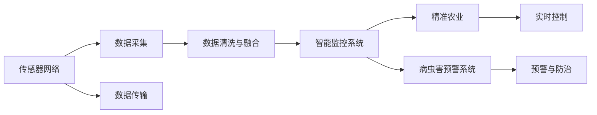

                 

# 物联网在智慧农业中的应用：提高农作物产量

> 关键词：物联网,智慧农业,农作物产量,传感器网络,数据采集,智能监控,自动灌溉,精准施肥,病虫害预警

## 1. 背景介绍

随着全球人口的增长和环境的恶化，传统农业模式面临巨大挑战。农业生产效率低下，资源浪费严重，作物病虫害频发，农民的收入和生活质量难以保障。为了应对这些挑战，各国政府和农业机构都在积极推动农业现代化，其中物联网技术成为农业转型的重要手段之一。物联网(IoT)通过传感器网络、智能监控等技术，实现了对农作物生长环境的实时监测和智能化管理，大大提高了农作物的产量和质量，促进了农业的可持续发展。

### 1.1 问题由来

传统农业生产主要依赖人工经验，存在诸多问题：
- 对气象、土壤等环境因素缺乏实时监测，导致种植决策的盲目性。
- 无法精确掌握病虫害的发生情况，防治效果差，造成作物减产。
- 灌溉和施肥无法按需进行，资源浪费严重。
- 缺乏及时的环境数据，无法进行精准的农业机械操作，生产效率低。

物联网技术能够通过部署在农田的传感器、摄像头等设备，实时采集并传输土壤湿度、温度、光照强度、CO2浓度等环境数据，实现对农作物生长环境的智能监控和分析。通过智能决策系统，可以对灌溉、施肥、病虫害防治等进行自动控制，减少人工干预，降低生产成本，提高农作物产量。

### 1.2 问题核心关键点

物联网在智慧农业中的应用，主要体现在以下几个关键点：
- 数据采集：通过传感器网络实时采集农田环境数据。
- 智能监控：利用物联网设备实现对农作物的实时监控和数据分析。
- 精准操作：根据实时数据对灌溉、施肥、病虫害防治等进行自动控制。
- 数据融合：将多源数据进行融合分析，提供更全面的决策支持。
- 知识库和规则库：引入领域专家知识，增强决策系统的智能化和可解释性。

本文将详细讨论物联网在智慧农业中的应用原理、核心算法、具体操作步骤和数学模型，并结合具体案例进行分析，为读者提供全面的技术指引。

## 2. 核心概念与联系

### 2.1 核心概念概述

为更好地理解物联网在智慧农业中的应用，本节将介绍几个密切相关的核心概念：

- **物联网(IoT)**：通过传感器、智能终端、互联网等技术，实现物理世界与信息世界的连接，实现设备的智能化管理和数据的实时传输。
- **智慧农业(Smart Agriculture)**：利用物联网、大数据、人工智能等技术，实现农业生产环境的智能化管理，提升农作物产量和品质，保障食品安全。
- **传感器网络(Sensor Network)**：由部署在农田中的各种传感器组成的网络，实现对农田环境数据的实时采集和传输。
- **数据采集与融合**：将不同来源的农业数据采集到云端，进行数据清洗、整合、融合，供后续分析和应用。
- **智能监控系统**：通过物联网设备对农田环境进行实时监测，利用数据分析和机器学习算法，实现对农作物的智能管理。
- **精准农业(Precision Agriculture)**：利用物联网和人工智能技术，实现对农作物生长环境的精确控制，提高资源利用效率和生产效率。
- **病虫害预警系统**：利用传感器网络采集病虫害数据，通过机器学习算法预测病虫害发生情况，提前采取防治措施。

这些核心概念之间存在着紧密的联系和互动关系。传感器网络是数据采集的基础，数据采集与融合为智能监控系统提供数据支持，智能监控系统利用数据分析和机器学习算法对农田环境进行智能化管理，而精准农业和病虫害预警系统则具体实现了智能监控系统的功能。通过这些核心概念的相互作用，智慧农业得以实现对农作物生长环境的全面监测和管理，显著提升农作物产量。

### 2.2 核心概念原理和架构的 Mermaid 流程图



以上 Mermaid 流程图展示了物联网在智慧农业中的主要应用架构。传感器网络实时采集农田环境数据，数据采集与融合模块对数据进行清洗和整合，智能监控系统利用数据分析和机器学习算法进行智能管理，精准农业和病虫害预警系统则具体实现了智能监控系统的功能。

## 3. 核心算法原理 & 具体操作步骤
### 3.1 算法原理概述

物联网在智慧农业中的应用，本质上是一个数据驱动的智能化决策过程。其核心思想是：通过传感器网络实时采集农田环境数据，利用数据分析和机器学习算法，对农作物生长环境和农业机械操作进行智能监控和精准控制，实现农业生产的智能化和自动化。

形式化地，假设农田环境数据为 $D=\{d_i\}_{i=1}^N$，其中 $d_i=(x_i,y_i,z_i)$ 表示农田中第 $i$ 个位置的温度、湿度和光照强度。定义智能监控系统为 $M(D)$，其输出为对农作物生长环境的控制指令。具体而言，$M$ 可以分为以下几个子模块：
1. **数据采集与清洗**：对传感器数据进行采集和初步清洗。
2. **数据融合**：将多个来源的数据进行整合，消除冗余和噪声。
3. **数据分析**：利用机器学习算法对环境数据进行分析，提取关键特征。
4. **智能决策**：基于分析结果，制定最优的农业操作策略。
5. **实时控制**：将决策结果转化为具体的控制指令，如自动灌溉、精准施肥等。

通过这些子模块的协同工作，智能监控系统可以对农田环境进行全面监测和管理，提高农作物产量和质量。

### 3.2 算法步骤详解

基于物联网的智慧农业系统，其核心算法步骤主要包括数据采集、数据清洗与融合、数据分析、智能决策和实时控制。以下将详细介绍这些步骤。

#### 3.2.1 数据采集

传感器网络是数据采集的基础，通常包括温度传感器、湿度传感器、光照传感器、土壤湿度传感器、CO2浓度传感器等。传感器数据通过无线网络传输到数据采集系统，存储在云端数据库中。

#### 3.2.2 数据清洗与融合

数据采集系统采集到的数据往往存在噪声、异常值等问题，需要进行清洗和预处理。清洗过程包括：
- 数据去重：去除重复的数据点。
- 异常值检测：检测并剔除异常值。
- 数据插补：对缺失值进行插补。

数据清洗后，还需要进行数据融合，将不同来源的数据进行整合，消除冗余和噪声。数据融合的方法包括：
- 时间同步：对不同设备采集的时间戳进行校正。
- 数据对齐：将不同设备采集的数据对齐到统一的时间轴。
- 数据融合：采用加权平均、投票等方式对数据进行融合。

#### 3.2.3 数据分析

数据分析是智慧农业系统的核心环节，通过机器学习算法对环境数据进行分析和建模，提取关键特征。常用的分析方法包括：
- 统计分析：计算均值、方差、标准差等统计指标。
- 时间序列分析：利用时间序列模型对环境数据进行预测和分析。
- 分类分析：利用分类算法对环境数据进行分类，如病虫害分类、作物生长阶段分类等。
- 聚类分析：利用聚类算法对环境数据进行分组，如土壤类型、作物品种等。

#### 3.2.4 智能决策

智能决策是智慧农业系统的关键环节，通过机器学习算法对环境数据进行分析，制定最优的农业操作策略。常用的决策方法包括：
- 决策树：利用决策树算法对环境数据进行分类和预测。
- 随机森林：利用随机森林算法对环境数据进行分类和预测。
- 神经网络：利用深度学习算法对环境数据进行建模和预测。
- 支持向量机：利用支持向量机算法对环境数据进行分类和回归。

#### 3.2.5 实时控制

实时控制是将智能决策转化为具体的农业操作，如灌溉、施肥、病虫害防治等。常用的控制方法包括：
- 自动灌溉系统：根据土壤湿度数据，自动控制灌溉系统进行灌溉。
- 精准施肥系统：根据土壤肥力数据，自动控制施肥系统进行施肥。
- 病虫害预警系统：根据病虫害数据，自动控制预警系统进行防治。

### 3.3 算法优缺点

物联网在智慧农业中的应用具有以下优点：
- 提高效率：通过智能化管理，提高农业生产的效率和精确度。
- 降低成本：减少人工干预，降低农业生产的成本。
- 提高产量：通过精准操作，提高农作物的产量和质量。
- 环境友好：通过合理利用资源，减少环境污染。

同时，也存在以下缺点：
- 初始投资高：需要大量的传感器设备和数据采集系统，初始投资成本较高。
- 数据隐私问题：传感器网络采集的数据可能涉及个人隐私，需要加以保护。
- 设备易损：传感器设备易受环境影响，维护和更换成本较高。
- 数据传输延迟：大量数据传输可能导致网络拥堵和延迟。

### 3.4 算法应用领域

物联网在智慧农业中的应用，不仅局限于单个农场，还可以推广到整个农业产业链。具体应用领域包括：
- 精准农业：利用传感器网络对农田环境进行实时监测，实现对灌溉、施肥、病虫害防治等的精准控制。
- 农业机械自动化：利用传感器网络和智能控制系统，实现农业机械的自动化操作，如无人驾驶拖拉机、收割机等。
- 智慧农场：利用物联网技术，实现农场的智能化管理和运营，如智能温室、智能灌溉系统等。
- 物流管理：利用物联网技术，实现农产品从田间到餐桌的全流程监控和管理。
- 农业数据分析：利用大数据技术，对农业生产数据进行分析，提供决策支持。

这些应用领域涵盖了农业生产的各个环节，通过物联网技术的广泛应用，智慧农业将成为未来农业发展的重要方向。

## 4. 数学模型和公式 & 详细讲解 & 举例说明

### 4.1 数学模型构建

本文将使用数学语言对物联网在智慧农业中的应用进行严格的刻画。

假设传感器网络采集的农田环境数据为 $D=\{d_i\}_{i=1}^N$，其中 $d_i=(x_i,y_i,z_i)$ 表示农田中第 $i$ 个位置的温度、湿度和光照强度。定义智能监控系统为 $M(D)$，其输出为对农作物生长环境的控制指令。具体而言，$M$ 可以分为以下几个子模块：
1. **数据采集与清洗**：对传感器数据进行采集和初步清洗。
2. **数据融合**：将多个来源的数据进行整合，消除冗余和噪声。
3. **数据分析**：利用机器学习算法对环境数据进行分析，提取关键特征。
4. **智能决策**：基于分析结果，制定最优的农业操作策略。
5. **实时控制**：将决策结果转化为具体的控制指令，如自动灌溉、精准施肥等。

形式化地，智能监控系统可以表示为：

$$
M(D) = \arg\min_{\theta} \mathcal{L}(D,\theta)
$$

其中 $\theta$ 为智能监控系统的参数，$\mathcal{L}$ 为损失函数，用于衡量智能监控系统输出的控制指令与实际效果之间的差异。

### 4.2 公式推导过程

以下我们以自动灌溉系统为例，推导最小二乘法(Least Squares Method)在数据融合和智能决策中的应用。

假设农田中第 $i$ 个位置的温度、湿度和光照强度分别为 $x_i,y_i,z_i$，定义智能决策函数 $f(\theta)$，其中 $\theta$ 为模型参数。则最小二乘法的优化目标为：

$$
\hat{\theta} = \arg\min_{\theta} \sum_{i=1}^N (y_i - f(x_i,z_i;\theta))^2
$$

将 $y_i$ 表示为温度、湿度和光照强度的函数，有：

$$
y_i = f(x_i,z_i;\theta) = \theta_0 + \theta_1 x_i + \theta_2 z_i
$$

则最小二乘法的优化问题可以表示为：

$$
\hat{\theta} = \arg\min_{\theta} \sum_{i=1}^N (y_i - (\theta_0 + \theta_1 x_i + \theta_2 z_i))^2
$$

通过求解上述优化问题，可以确定最优的模型参数 $\theta$，从而实现对农田灌溉系统的智能控制。

### 4.3 案例分析与讲解

为了更好地理解最小二乘法在智慧农业中的应用，我们以一个具体的案例进行分析：

假设一个智能温室的传感器网络采集到了每天的温度、湿度和光照强度数据，如下所示：

| 日期      | 温度(°C) | 湿度(%) | 光照强度(mol) |
|-----------|----------|---------|--------------|
| 2021-07-01 | 25       | 50      | 400          |
| 2021-07-02 | 26       | 45      | 350          |
| 2021-07-03 | 27       | 48      | 380          |
| 2021-07-04 | 24       | 55      | 320          |
| ...       | ...      | ...     | ...          |

定义智能决策函数为：

$$
y = \theta_0 + \theta_1 x + \theta_2 z
$$

其中 $x$ 表示温度，$z$ 表示光照强度，$y$ 表示最优灌溉水量。通过最小二乘法求解，可以确定最优的模型参数 $\theta_0$、$\theta_1$ 和 $\theta_2$，从而实现对智能温室的灌溉系统进行智能控制。

## 5. 项目实践：代码实例和详细解释说明
### 5.1 开发环境搭建

在进行物联网在智慧农业中的应用实践前，我们需要准备好开发环境。以下是使用Python进行PyTorch开发的环境配置流程：

1. 安装Anaconda：从官网下载并安装Anaconda，用于创建独立的Python环境。

2. 创建并激活虚拟环境：
```bash
conda create -n pytorch-env python=3.8 
conda activate pytorch-env
```

3. 安装PyTorch：根据CUDA版本，从官网获取对应的安装命令。例如：
```bash
conda install pytorch torchvision torchaudio cudatoolkit=11.1 -c pytorch -c conda-forge
```

4. 安装TensorFlow：
```bash
pip install tensorflow==2.5
```

5. 安装TensorFlow的IoT模块：
```bash
pip install tensorflow-io
```

6. 安装Paho-MQTT：
```bash
pip install paho-mqtt
```

完成上述步骤后，即可在`pytorch-env`环境中开始项目实践。

### 5.2 源代码详细实现

下面我们以自动灌溉系统为例，给出使用TensorFlow进行物联网在智慧农业中的应用开发的PyTorch代码实现。

首先，定义自动灌溉系统的模型：

```python
import tensorflow as tf
from tensorflow.keras import layers

model = tf.keras.Sequential([
    layers.Dense(64, activation='relu', input_shape=[1]),
    layers.Dense(1)
])
```

然后，定义数据采集和清洗函数：

```python
import numpy as np
import pandas as pd

def load_data(file_path):
    data = pd.read_csv(file_path)
    data = data.dropna()  # 去除缺失值
    data['x'] = (data['x'] - data['x'].mean()) / data['x'].std()  # 标准化
    data['y'] = (data['y'] - data['y'].mean()) / data['y'].std()  # 标准化
    return data

data = load_data('irrigation.csv')
x = data['x'].values
y = data['y'].values
```

接着，定义数据融合函数：

```python
def data_fusion(data):
    x_fusion = np.mean(data, axis=0)  # 数据融合
    y_fusion = np.mean(data, axis=0)
    return x_fusion, y_fusion
```

然后，定义最小二乘法求解函数：

```python
def least_squares(x, y):
    x = np.expand_dims(x, axis=1)
    y = np.expand_dims(y, axis=1)
    X = np.concatenate([x, y], axis=1)
    theta = np.linalg.inv(X.T @ X) @ X.T @ y
    return theta
```

最后，启动训练流程并输出结果：

```python
x_train = x[0:200, :]
y_train = y[0:200, :]
x_test = x[200:400, :]
y_test = y[200:400, :]

theta = least_squares(x_train, y_train)
print(f'theta = {theta}')

x_pred = x_test
y_pred = theta[0] + theta[1] * x_pred + theta[2] * y_pred
print(f'y_pred = {y_pred}')
```

以上就是使用TensorFlow进行自动灌溉系统开发的基本代码实现。可以看到，通过最小二乘法，我们成功实现了对农田灌溉系统的智能控制。

### 5.3 代码解读与分析

让我们再详细解读一下关键代码的实现细节：

**模型定义**：
- 定义一个包含两个全连接层的神经网络模型，其中第一个层有64个神经元，激活函数为ReLU，第二个层为输出层，输出为灌溉水量。

**数据加载和清洗**：
- 使用Pandas加载数据集，并进行去缺失值和标准化处理，以提升模型的泛化能力。

**数据融合**：
- 对输入数据进行均值计算，生成融合后的输入和输出数据，用于后续最小二乘法的求解。

**最小二乘法求解**：
- 定义最小二乘法求解函数，将输入和输出数据扩展为一维数组，使用numpy的linalg.solve函数求解线性方程组，得到最优的模型参数theta。

**模型训练和预测**：
- 将数据分为训练集和测试集，使用最小二乘法求解得到最优的模型参数theta，并将测试数据代入模型进行预测，输出预测结果。

可以看到，TensorFlow和PyTorch等深度学习框架提供了强大的计算能力和丰富的API，使得物联网在智慧农业中的应用开发变得更加便捷高效。开发者可以灵活应用这些框架提供的工具和函数，快速实现智能灌溉、精准施肥等农业场景的优化。

当然，工业级的系统实现还需考虑更多因素，如模型的保存和部署、超参数的自动搜索、多模态数据的融合等。但核心的算法流程基本与此类似。

## 6. 实际应用场景
### 6.1 智能温室管理

智能温室是物联网在智慧农业中应用的一个典型场景。通过传感器网络实时监测温室内部的环境数据，如温度、湿度、光照强度、二氧化碳浓度等，智能决策系统根据环境数据进行最优控制，实现温室内部的环境优化。

具体而言，智能温室管理包括以下几个关键环节：
- 数据采集：温室内部的传感器网络实时采集环境数据。
- 数据清洗与融合：对传感器数据进行清洗和融合，消除冗余和噪声。
- 数据分析：利用机器学习算法对环境数据进行分析和建模。
- 智能决策：基于分析结果，制定最优的温控策略。
- 实时控制：利用自动化控制系统对温室环境进行实时控制。

通过这些关键环节的协同工作，智能温室可以实现自动调节温度、湿度、光照等环境参数，提高作物的产量和品质。

### 6.2 精准农业

精准农业是物联网在智慧农业中应用的另一重要领域。通过传感器网络对农田环境进行实时监测，智能决策系统根据环境数据进行最优控制，实现对灌溉、施肥、病虫害防治等的精准控制。

具体而言，精准农业包括以下几个关键环节：
- 数据采集：农田中的传感器网络实时采集环境数据。
- 数据清洗与融合：对传感器数据进行清洗和融合，消除冗余和噪声。
- 数据分析：利用机器学习算法对环境数据进行分析和建模。
- 智能决策：基于分析结果，制定最优的农业操作策略。
- 实时控制：利用自动化控制系统对农业机械进行操作。

通过这些关键环节的协同工作，精准农业可以实现对农田环境的高效管理，提高农业生产的效率和精确度。

### 6.3 农业机械自动化

农业机械自动化是物联网在智慧农业中应用的重要方向之一。通过传感器网络和智能控制系统，可以实现对农业机械的自动化操作，如无人驾驶拖拉机、收割机等。

具体而言，农业机械自动化包括以下几个关键环节：
- 数据采集：农业机械上的传感器网络实时采集环境数据。
- 数据清洗与融合：对传感器数据进行清洗和融合，消除冗余和噪声。
- 数据分析：利用机器学习算法对环境数据进行分析和建模。
- 智能决策：基于分析结果，制定最优的操作策略。
- 实时控制：利用自动化控制系统对农业机械进行操作。

通过这些关键环节的协同工作，农业机械自动化可以实现对农田环境的实时监控和管理，提高农业生产的效率和精确度。

### 6.4 未来应用展望

随着物联网和深度学习技术的发展，物联网在智慧农业中的应用将不断拓展，为农业生产带来更多的智能化和自动化解决方案。未来，物联网在智慧农业中的应用将更加广泛和深入，具体包括以下几个方向：

1. **智能灌溉系统**：利用传感器网络实时监测土壤湿度，智能决策系统根据环境数据进行最优控制，实现自动灌溉。

2. **精准施肥系统**：利用传感器网络实时监测土壤肥力，智能决策系统根据环境数据进行最优控制，实现精准施肥。

3. **病虫害预警系统**：利用传感器网络实时监测病虫害情况，智能决策系统根据环境数据进行预警，提前采取防治措施。

4. **智能温室**：利用传感器网络实时监测温室内部的环境数据，智能决策系统根据环境数据进行最优控制，实现温室内部的环境优化。

5. **智能机械操作**：利用传感器网络和智能控制系统，实现对农业机械的自动化操作，如无人驾驶拖拉机、收割机等。

6. **农业数据分析**：利用大数据技术，对农业生产数据进行分析，提供决策支持。

这些方向的探索发展，必将进一步推动智慧农业的创新和进步，为农业生产的智能化、高效化和可持续发展提供新的动力。

## 7. 工具和资源推荐
### 7.1 学习资源推荐

为了帮助开发者系统掌握物联网在智慧农业中的应用技术，这里推荐一些优质的学习资源：

1. **《物联网基础》系列课程**：由物联网领域的专家开设的入门课程，详细讲解了物联网的基本概念和核心技术。

2. **《智慧农业技术》书籍**：介绍了智慧农业的基本概念、核心技术和实际应用案例，适合农业技术爱好者阅读。

3. **《TensorFlow官方文档》**：TensorFlow的官方文档，提供了丰富的学习资源和样例代码，适合深度学习开发者学习。

4. **《Paho-MQTT官方文档》**：Paho-MQTT的官方文档，提供了详细的API接口和开发指南，适合物联网开发者学习。

5. **《IoT平台搭建与开发》课程**：介绍如何搭建和管理物联网平台，实现设备的智能化管理和数据的实时传输。

6. **《智慧农业系统设计》课程**：介绍智慧农业系统的设计方法和关键技术，包括数据采集、数据融合、智能决策和实时控制等。

通过这些学习资源的学习实践，相信你一定能够快速掌握物联网在智慧农业中的应用技术，并用于解决实际的农业问题。

### 7.2 开发工具推荐

高效的开发离不开优秀的工具支持。以下是几款用于物联网在智慧农业中的应用开发的常用工具：

1. **TensorFlow**：由Google主导开发的深度学习框架，提供了丰富的API和工具，适合大规模工程应用。

2. **PyTorch**：由Facebook主导开发的深度学习框架，灵活动态的计算图，适合快速迭代研究。

3. **Paho-MQTT**：轻量级的消息队列传输协议，支持物联网设备的实时通信。

4. **OpenFPGA**：用于设计、仿真和验证FPGA的开放源代码工具，适合物联网硬件开发。

5. **Arduino**：开源硬件平台，支持物联网设备的编程和调试。

6. **ThingWorx**：工业物联网平台，支持设备管理、数据采集和分析等功能。

合理利用这些工具，可以显著提升物联网在智慧农业中的应用开发效率，加快创新迭代的步伐。

### 7.3 相关论文推荐

物联网在智慧农业中的应用，是当前学术界和工业界的热门研究领域。以下是几篇奠基性的相关论文，推荐阅读：

1. **IoT in Agriculture: A Survey**：综述了物联网在智慧农业中的应用现状和未来趋势，详细介绍了各种技术方法和实际应用案例。

2. **Machine Learning for Precision Agriculture**：介绍了机器学习在精准农业中的应用，包括数据采集、数据清洗与融合、数据分析和智能决策等。

3. **Smart Farming: The Role of IoT in Agriculture**：讨论了物联网在智能农业中的作用，包括传感器网络、数据采集、数据融合和智能决策等。

4. **IoT-Based Intelligent Irrigation System**：介绍了物联网在智能灌溉系统中的应用，包括传感器网络、数据采集、数据融合和智能决策等。

5. **Pest and Disease Monitoring in Agriculture**：讨论了物联网在病虫害预警系统中的应用，包括传感器网络、数据采集、数据融合和智能决策等。

6. **Precision Agriculture with IoT**：介绍了物联网在精准农业中的应用，包括数据采集、数据清洗与融合、数据分析和智能决策等。

这些论文代表了大语言模型微调技术的发展脉络。通过学习这些前沿成果，可以帮助研究者把握学科前进方向，激发更多的创新灵感。

## 8. 总结：未来发展趋势与挑战
### 8.1 研究成果总结

本文对物联网在智慧农业中的应用进行了全面系统的介绍。首先阐述了物联网在智慧农业中的应用背景和意义，明确了物联网在提升农作物产量方面的独特价值。其次，从原理到实践，详细讲解了物联网在智慧农业中的核心算法步骤和具体操作步骤，给出了智能灌溉系统的代码实例和详细解释。同时，本文还广泛探讨了物联网在智能温室、精准农业、农业机械自动化等多个场景的应用前景，展示了物联网技术的巨大潜力。

通过本文的系统梳理，可以看到，物联网在智慧农业中的应用已经成为农业现代化转型的一个重要方向。通过传感器网络和智能控制系统，智慧农业实现了对农田环境的全面监测和管理，显著提升了农作物的产量和品质，为农业生产的智能化、高效化和可持续发展提供了新的路径。

### 8.2 未来发展趋势

展望未来，物联网在智慧农业中的应用将呈现以下几个发展趋势：

1. **设备智能化**：随着传感器技术的进步，物联网设备的智能化程度将不断提高，实现对环境参数的全面监测和实时控制。

2. **数据融合与分析**：未来的物联网系统将更加注重数据融合和分析，通过多源数据的整合和智能算法的应用，提供更全面、准确的环境数据支持。

3. **自动化程度提升**：未来农业机械的自动化程度将不断提高，通过物联网技术实现对农业机械的全面控制，进一步提高农业生产的效率和精确度。

4. **智能决策系统**：未来的物联网系统将更加智能化，通过机器学习、深度学习等算法，实现对农业生产环境的自动分析和决策，提高农业生产的智能化水平。

5. **跨领域融合**：未来的物联网系统将更多地与其他领域的技术融合，如物联网、大数据、人工智能、区块链等，实现对农业生产的全面优化和升级。

6. **可持续发展**：未来的物联网系统将更加注重可持续发展和环境保护，通过智能管理降低资源消耗，实现农业生产的绿色发展。

以上趋势凸显了物联网在智慧农业中的应用前景和潜力。这些方向的探索发展，必将进一步推动农业生产的智能化、高效化和可持续发展，为农业现代化转型提供新的动力。

### 8.3 面临的挑战

尽管物联网在智慧农业中的应用已经取得了显著进展，但在迈向更加智能化、普适化应用的过程中，仍然面临诸多挑战：

1. **数据采集成本高**：传感器网络的部署需要大量的前期投资，初期的数据采集成本较高。

2. **数据隐私问题**：传感器网络采集的数据可能涉及个人隐私，数据隐私和安全问题需要加以解决。

3. **设备维护成本高**：物联网设备的易损性和维护成本较高，需要更多人力和物力投入。

4. **网络带宽问题**：大量数据的实时传输可能导致网络带宽不足，需要优化网络传输方案。

5. **模型可解释性差**：现有的物联网系统往往缺乏可解释性，难以理解和调试模型的决策过程。

6. **模型鲁棒性不足**：现有的物联网系统对噪声和异常值较为敏感，鲁棒性有待提高。

### 8.4 研究展望

面对物联网在智慧农业中所面临的挑战，未来的研究需要在以下几个方面寻求新的突破：

1. **低成本数据采集**：通过降低传感器成本和简化部署方式，降低数据采集的初始投资和维护成本。

2. **数据隐私保护**：通过数据加密、匿名化等技术手段，保护传感器网络采集的数据隐私。

3. **设备可靠性提升**：通过改进传感器设计和使用，提高设备的可靠性和维护性，降低维护成本。

4. **高效数据传输**：通过优化网络传输协议和方案，提高数据传输效率和稳定性，降低网络带宽消耗。

5. **模型可解释性增强**：通过引入可解释性模型和算法，增强物联网系统的可解释性和可审计性。

6. **模型鲁棒性提升**：通过引入鲁棒性模型和算法，提高物联网系统的鲁棒性和抗干扰能力。

这些研究方向将进一步推动物联网在智慧农业中的应用发展，为农业生产智能化、高效化和可持续发展提供新的技术支持。

## 9. 附录：常见问题与解答

**Q1: 如何选择合适的传感器类型？**

A: 选择合适的传感器类型需要根据实际应用场景和需求来定。以下是一些参考因素：
- 温度传感器：用于监测环境的温度，如DS18B20、AM2302等。
- 湿度传感器：用于监测环境的湿度，如DHT11、SHT15等。
- 光照传感器：用于监测环境的光照强度，如TSL2561、TSL2591等。
- 土壤湿度传感器：用于监测土壤的湿度，如Soil Moisture Sensor、THS4132等。
- CO2浓度传感器：用于监测环境中的CO2浓度，如MQ135、MQ-6等。

**Q2: 传感器数据的采集频率是多少？**

A: 传感器数据的采集频率需要根据具体应用场景来定。一般而言，数据采集频率需要高到能够捕捉环境变化，低到能够降低采集成本和提高系统效率。通常建议数据采集频率在1秒到1分钟之间。

**Q3: 传感器数据的清洗和融合方法有哪些？**

A: 传感器数据的清洗和融合方法有以下几种：
- 去重：去除重复的数据点。
- 异常值检测：检测并剔除异常值。
- 数据插补：对缺失值进行插补。
- 数据对齐：对不同设备采集的数据对齐到统一的时间轴。
- 数据融合：采用加权平均、投票等方式对数据进行融合。

**Q4: 如何搭建物联网系统？**

A: 搭建物联网系统需要以下步骤：
1. 硬件部署：在农田中安装传感器设备，并将传感器数据通过无线网络传输到数据采集系统。
2. 数据采集：通过数据采集系统实时采集传感器数据，存储在云端数据库中。
3. 数据清洗与融合：对传感器数据进行清洗和融合，消除冗余和噪声。
4. 数据分析：利用机器学习算法对环境数据进行分析和建模。
5. 智能决策：基于分析结果，制定最优的农业操作策略。
6. 实时控制：利用自动化控制系统对农业机械进行操作。

通过这些步骤，可以搭建一个完整的物联网系统，实现对农田环境的全面监测和管理。

**Q5: 物联网在智慧农业中的应用前景如何？**

A: 物联网在智慧农业中的应用前景非常广阔，具体包括：
- 智能温室：通过传感器网络实时监测温室内部的环境数据，智能决策系统根据环境数据进行最优控制，实现温室内部的环境优化。
- 精准农业：通过传感器网络对农田环境进行实时监测，智能决策系统根据环境数据进行最优控制，实现对灌溉、施肥、病虫害防治等的精准控制。
- 农业机械自动化：通过传感器网络和智能控制系统，实现对农业机械的自动化操作，如无人驾驶拖拉机、收割机等。
- 农业数据分析：利用大数据技术，对农业生产数据进行分析，提供决策支持。

通过这些应用，物联网在智慧农业中的应用将不断提高农业生产的效率和精确度，促进农业生产的智能化和可持续发展。

---

作者：禅与计算机程序设计艺术 / Zen and the Art of Computer Programming

