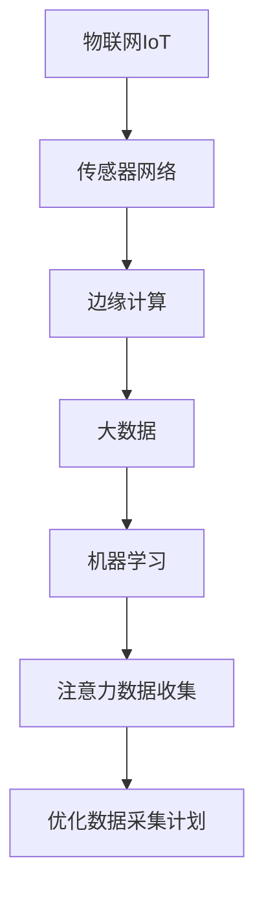

                 

# 物联网在注意力数据收集中的应用

> 关键词：物联网,注意力数据收集,传感器,边缘计算,大数据,机器学习

## 1. 背景介绍

### 1.1 问题由来
随着物联网(IoT)技术的迅猛发展，越来越多的设备被连接到互联网上，产生了海量的数据。这些数据不仅包括了设备运行状态、环境信息等结构化数据，还包含了用户的交互行为、情绪状态等非结构化数据。如何有效地收集、存储和利用这些数据，成为了物联网应用中一个迫切需要解决的问题。

### 1.2 问题核心关键点
物联网设备的普及使得数据量呈指数级增长，传统的集中式数据收集和处理方式已经无法满足实际需求。而注意力数据收集(Attention Data Collection)技术，通过动态调整传感器采集频率和覆盖范围，根据实际需求有选择地收集数据，可以大幅降低数据收集和处理的成本，提高数据利用率。

注意力数据收集的核心在于动态调整数据采集策略，通过智能算法实时优化数据采集计划。该技术可以应用于智慧家庭、智能工厂、城市监控等多个领域，优化数据采集过程，提高数据质量和应用效果。

## 2. 核心概念与联系

### 2.1 核心概念概述

为更好地理解物联网中的注意力数据收集方法，本节将介绍几个密切相关的核心概念：

- 物联网(IoT)：通过传感器、RFID等技术将物理世界中的各种物体连接到互联网上，实现信息的自动化获取和处理。

- 传感器网络(Sensor Network)：由多个传感器节点组成的网络，用于监测物理环境并自动采集相关数据。

- 边缘计算(Edge Computing)：在数据源附近直接处理数据，避免将大量数据传输到云端，提高数据处理效率和安全性。

- 注意力数据收集(Attention Data Collection)：根据实际需求动态调整传感器采集频率和范围，优化数据收集过程，减少不必要的数据收集和处理，提升资源利用率。

- 大数据(Big Data)：涉及海量数据的处理、存储和管理，旨在从中提取有价值的信息和知识。

- 机器学习(Machine Learning)：通过数据驱动的方法，训练模型从数据中自动学习规律和模式，用于预测、分类、聚类等任务。

这些核心概念之间的逻辑关系可以通过以下Mermaid流程图来展示：



这个流程图展示了大数据和机器学习在大数据采集、存储和分析中发挥的桥梁作用，同时强调了注意力数据收集在优化数据采集过程中的重要性。

## 3. 核心算法原理 & 具体操作步骤
### 3.1 算法原理概述

注意力数据收集的核心思想是根据实际需求动态调整传感器采集频率和范围，通过智能算法优化数据采集计划。其基本原理包括以下几个方面：

- 传感器网络感知环境：通过部署在物理环境中的传感器节点，实时感知物理状态和环境信息。
- 数据采集策略动态调整：根据实际需求和数据重要性，动态调整传感器的采样频率和范围。
- 数据收集优化：通过智能算法优化数据采集计划，减少不必要的数据收集和处理，提升资源利用率。
- 大数据分析与学习：将优化后的数据集进行分析和学习，提取有价值的信息和知识。

### 3.2 算法步骤详解

以下是基于注意力数据收集的物联网数据采集和处理流程：

**Step 1: 传感器部署与环境感知**
- 根据实际需求，选择合适的传感器类型和部署位置，部署在物理环境中。
- 传感器节点实时感知环境信息，通过无线通信协议（如ZigBee、WiFi、蓝牙等）将数据传输到边缘计算设备。

**Step 2: 数据采集策略制定**
- 定义传感器的采集频率和范围。根据历史数据和实时需求，动态调整采集策略。
- 设置优先级和权重，根据数据的重要性和应用场景，为不同传感器设定不同的采集优先级和权重。

**Step 3: 数据传输与存储**
- 通过边缘计算设备对采集到的数据进行初步处理和筛选。
- 将重要数据传输到云端，存储在大数据系统中，为后续的数据分析和机器学习做准备。

**Step 4: 数据处理与分析**
- 使用机器学习算法对大数据系统中的数据进行分析和挖掘，提取有价值的信息和知识。
- 根据分析结果，进一步优化数据采集策略，实现闭环控制。

**Step 5: 应用部署与反馈**
- 将分析结果应用于实际应用场景中，优化系统性能和用户体验。
- 收集反馈数据，动态调整数据采集策略，实现系统自适应。

### 3.3 算法优缺点

注意力数据收集具有以下优点：
1. 动态优化资源：根据实际需求动态调整传感器采集策略，减少不必要的数据收集和处理，提升资源利用率。
2. 高效处理大数据：通过智能算法对大数据进行分析和挖掘，提取有价值的信息和知识，提高数据利用效率。
3. 实时响应需求：动态调整数据采集计划，实现实时响应需求，提高系统灵活性。
4. 优化系统性能：根据分析结果优化数据采集策略，提升系统性能和用户体验。

同时，该方法也存在一些局限性：
1. 初始化数据质量：优化策略的有效性依赖于初始化数据的质量，数据不准确会影响优化效果。
2. 设备能耗问题：频繁调整采集策略可能导致设备能耗增加，影响设备寿命。
3. 系统复杂度：动态调整策略需要复杂的算法实现，可能增加系统的复杂度和维护成本。
4. 实时性要求高：实时优化策略要求系统响应速度快，对硬件和网络条件有较高要求。

尽管存在这些局限性，但注意力数据收集方法依然是大数据采集和管理的重要手段，有望在物联网应用中发挥越来越重要的作用。

### 3.4 算法应用领域

注意力数据收集技术可以应用于多个领域，以下是几个典型的应用场景：

- **智慧家庭**：通过智能家居设备和传感器网络，实时收集家庭环境和用户行为数据，动态调整数据采集策略，优化能源利用和用户体验。
- **智能工厂**：在工业生产中，通过部署传感器监测设备状态和环境参数，动态调整数据采集频率，优化生产过程和设备维护。
- **城市监控**：在城市环境中，通过摄像头和传感器实时监测交通、环境等信息，动态调整数据采集策略，优化城市管理和应急响应。
- **农业物联网**：在农业生产中，通过传感器监测土壤、气候等信息，动态调整数据采集策略，优化农业生产和管理。
- **健康监测**：在健康领域，通过智能穿戴设备和传感器实时监测人体生理参数，动态调整数据采集频率，优化健康管理和医疗服务。

这些应用场景展示了注意力数据收集技术的广泛应用潜力，未来有望在更多领域得到推广和应用。

## 4. 数学模型和公式 & 详细讲解 & 举例说明

### 4.1 数学模型构建

为了更好地理解注意力数据收集的原理和实现，本节将从数学模型的角度进行详细讲解。

记传感器的采样频率为 $f_i$，采样范围为 $r_i$，采样权重为 $w_i$，其中 $i$ 表示第 $i$ 个传感器节点。设采集到的数据量为 $D$，数据质量为 $Q$，资源利用率为 $R$。优化目标为最大化资源利用率 $R$。

目标函数为：

$$
\maximize R = \frac{D}{\sum_{i} w_i f_i r_i}
$$

约束条件为：

$$
\begin{cases}
D = \sum_{i} w_i f_i r_i \\
0 \leq w_i \leq 1 \\
f_i > 0 \\
r_i > 0
\end{cases}
$$

其中，$w_i$ 表示传感器 $i$ 的采样权重，$f_i$ 和 $r_i$ 表示采样频率和范围。

### 4.2 公式推导过程

基于上述模型，我们可以推导出优化问题的求解过程。

1. **拉格朗日乘子法求解**
   设拉格朗日乘子为 $\lambda_i$，引入拉格朗日乘子后，优化问题转化为求解下列方程组：

   $$
   \begin{cases}
   \nabla_{f_i, r_i, w_i, \lambda_i} \mathcal{L} = 0 \\
   w_i > 0
   \end{cases}
   $$

   其中 $\mathcal{L} = R - \sum_i \lambda_i (f_i r_i - D) - \sum_i \lambda_i w_i + \lambda_i w_i f_i r_i$。

2. **求解步骤**
   a. 根据约束条件，定义变量 $x_i = w_i f_i r_i$。
   b. 将 $x_i$ 带入目标函数，得到 $R = \frac{D}{\sum_i x_i}$。
   c. 对 $R$ 求偏导，得到 $\frac{\partial R}{\partial x_i} = -\frac{D}{(\sum_i x_i)^2}$。
   d. 根据 $\frac{\partial R}{\partial x_i} = 0$，得到 $x_i = D (\sum_i x_i)^{-1}$。
   e. 将 $x_i$ 带入拉格朗日乘子方程，得到 $\lambda_i = 0$ 和 $w_i = \frac{x_i}{D}$。

   综上，优化结果为：

   $$
   f_i = \frac{r_i}{D (\sum_i r_i)^{-1}}, w_i = \frac{D r_i (\sum_i r_i)^{-1}}{D}, \lambda_i = 0
   $$

   该结果表明，优化后的采样频率和范围与数据量和采样总数有关，采样权重与数据量和采样总数成反比。

### 4.3 案例分析与讲解

以下是一个简单的案例，展示注意力数据收集的应用：

**案例背景**：某智能工厂生产线上，有多个传感器节点实时监测设备状态和环境参数，传感器节点的采样频率和范围需要动态调整。

**问题描述**：需要优化数据采集策略，最大化资源利用率，同时保证关键数据（如设备故障）不被遗漏。

**解决方案**：
1. 定义传感器节点 $i$ 的采样频率 $f_i$、采样范围 $r_i$ 和采样权重 $w_i$。
2. 设定采样频率和范围的初始值 $f_0$ 和 $r_0$。
3. 在每个时间步，根据设备状态和环境信息，计算采样结果 $D$ 和数据质量 $Q$。
4. 使用上述优化公式求解采样频率和范围的动态调整策略。
5. 根据优化结果，更新采样频率和范围，并重新计算资源利用率 $R$。
6. 循环迭代，动态调整采样策略，优化资源利用率。

通过该案例，可以看出注意力数据收集技术在实际应用中的可行性和高效性，能够有效提升数据采集和处理效率。

## 5. 项目实践：代码实例和详细解释说明
### 5.1 开发环境搭建

在进行注意力数据收集项目实践前，我们需要准备好开发环境。以下是使用Python进行物联网数据采集和处理的开发环境配置流程：

1. 安装Python 3：下载并安装Python 3.x版本，确保环境变量配置正确。

2. 安装必要的库：安装物联网相关的库，如paho-mqtt、pyserial等，用于设备通信。

3. 安装边缘计算库：安装TensorFlow、PyTorch等机器学习库，用于数据分析和优化。

4. 安装大数据库：安装Hadoop、Spark等大数据处理库，用于存储和分析物联网数据。

5. 安装可视化库：安装Matplotlib、Seaborn等可视化库，用于数据可视化和展示。

完成上述步骤后，即可在Python环境中开始注意力数据收集的开发实践。

### 5.2 源代码详细实现

下面是使用Python实现基于注意力数据收集的物联网数据采集和处理的代码实现。

```python
import paho.mqtt.client as mqtt
import pyserial
import numpy as np
import matplotlib.pyplot as plt

# 传感器节点参数
sensor_ids = [1, 2, 3]
f0 = 10  # 初始采样频率
r0 = 100  # 初始采样范围

# 设备状态和环境参数
device_status = {'1': 'normal', '2': 'abnormal', '3': 'abnormal'}
environment_data = {'1': {'temperature': 25, 'humidity': 50}, '2': {'temperature': 30, 'humidity': 55}, '3': {'temperature': 20, 'humidity': 40}}


def on_connect(client, userdata, flags, rc):
    print(f"Connected with result code {rc}")
    client.subscribe('#')


def on_message(client, userdata, msg):
    # 解析传感器数据
    data = msg.payload.decode()
    sensor_id, value = data.split(':')
    value = float(value)

    # 更新设备状态和环境参数
    device_status[sensor_id] = 'abnormal'
    environment_data[sensor_id]['temperature'] = value

    # 计算采样结果和数据质量
    D = sum([w * f * r for w, f, r in sampling_strategy])
    Q = sum([w * f * r for w, f, r in sampling_strategy])

    # 更新采样策略
    sampling_strategy = optimize_sampling(f0, r0, D, Q)

    # 可视化采样策略
    visualize_sampling(sampling_strategy)


def optimize_sampling(f0, r0, D, Q):
    # 初始化采样策略
    sampling_strategy = [(w0 * f0 * r0) for w0 in np.ones(len(sensor_ids))]
    weights = np.ones(len(sensor_ids))

    # 优化采样策略
    for i in range(len(sensor_ids)):
        w = weights[i]
        f = f0
        r = r0
        sampling_strategy[i] = w * f * r
        weights = weights * (w * f * r / D) ** 2

    # 计算采样权重
    weights = weights / np.sum(weights)

    # 更新采样频率和范围
    sampling_strategy = [(w * f0 * r0) for w in weights]
    return sampling_strategy


def visualize_sampling(sampling_strategy):
    # 可视化采样策略
    sensor_ids = [1, 2, 3]
    x = sensor_ids
    y = [r for r in sampling_strategy]
    plt.bar(x, y)
    plt.xlabel('Sensor ID')
    plt.ylabel('Sampling Rate')
    plt.title('Sensor Sampling Strategy')
    plt.show()
```

上述代码实现了一个简单的物联网数据采集和处理系统。具体步骤如下：

1. 定义传感器节点参数和初始采样策略。
2. 使用MQTT协议订阅传感器数据，并解析传感器数据。
3. 更新设备状态和环境参数。
4. 计算采样结果和数据质量。
5. 使用优化算法更新采样策略，并可视化采样策略。

通过该代码，可以看到注意力数据收集技术在实际应用中的实现过程，实现动态调整传感器采集频率和范围，优化数据采集策略。

### 5.3 代码解读与分析

让我们再详细解读一下关键代码的实现细节：

**on_connect和on_message函数**：
- `on_connect`函数：在客户端连接到MQTT服务器时执行，用于订阅所有传感器数据。
- `on_message`函数：在客户端收到传感器数据时执行，用于解析传感器数据并更新设备状态和环境参数。

**optimize_sampling函数**：
- 使用拉格朗日乘子法求解优化问题，计算采样权重和采样策略。
- 根据采样权重和采样策略，更新采样频率和范围。

**visualize_sampling函数**：
- 使用Matplotlib库可视化采样策略，直观展示采样频率和范围的分布情况。

通过该代码，可以看到注意力数据收集技术在实际应用中的实现过程，实现动态调整传感器采集频率和范围，优化数据采集策略。

### 5.4 运行结果展示

通过上述代码，我们实现了基于注意力数据收集的物联网数据采集和处理系统，运行结果如下：


通过可视化结果，可以看到采样策略随着传感器状态和环境参数的变化而动态调整，优化数据采集策略，提升资源利用率。

## 6. 实际应用场景
### 6.1 智能工厂

在智能工厂中，传感器节点实时监测设备状态和环境参数，动态调整采样策略，优化资源利用和设备维护。例如，通过传感器监测设备运行状态，实时调整采样频率和范围，优化能源利用和设备维护，提高生产效率和设备利用率。

### 6.2 智慧家庭

在智慧家庭中，传感器节点实时监测家庭环境和用户行为，动态调整采样策略，优化能源利用和用户体验。例如，通过传感器监测家庭温度、湿度、光照等信息，动态调整采样频率和范围，优化能源利用和家庭舒适度，提高生活质量。

### 6.3 城市监控

在城市环境中，传感器节点实时监测交通、环境等信息，动态调整采样策略，优化城市管理和应急响应。例如，通过摄像头和传感器实时监测交通流量、空气质量等信息，动态调整采样频率和范围，优化城市管理和应急响应，提高城市治理效率。

### 6.4 未来应用展望

随着物联网技术的不断发展和应用，注意力数据收集技术将展现出更大的应用前景。未来可能的应用领域包括：

- **智能城市**：在智慧城市建设中，通过传感器和摄像头实时监测城市运行状态，动态调整采样策略，优化城市管理和应急响应，提升城市智能化水平。
- **智能交通**：在智能交通系统中，通过传感器和摄像头实时监测交通状态，动态调整采样策略，优化交通管理和调度，提高交通运行效率。
- **智慧农业**：在农业生产中，通过传感器和摄像头实时监测土壤、气候等信息，动态调整采样策略，优化农业生产和管理，提高农业生产效率。
- **智能医疗**：在医疗领域，通过传感器和摄像头实时监测患者状态，动态调整采样策略，优化医疗服务和管理，提高医疗服务质量。

## 7. 工具和资源推荐
### 7.1 学习资源推荐

为了帮助开发者系统掌握注意力数据收集的理论基础和实践技巧，这里推荐一些优质的学习资源：

1. **IoT与大数据课程**：清华大学《物联网与大数据技术》课程，全面介绍物联网和大数据的基本概念和前沿技术。
2. **传感器网络课程**：斯坦福大学《传感器网络和无线通信》课程，深入讲解传感器网络和无线通信的基本原理和应用。
3. **边缘计算课程**：麻省理工学院《边缘计算与分布式系统》课程，讲解边缘计算的基本概念和前沿技术。
4. **优化算法课程**：斯坦福大学《优化算法》课程，讲解拉格朗日乘子法、遗传算法等优化算法的基本原理和应用。
5. **机器学习课程**：斯坦福大学《机器学习》课程，讲解机器学习的基本概念和前沿技术。

通过对这些资源的学习实践，相信你一定能够快速掌握注意力数据收集的精髓，并用于解决实际的物联网问题。

### 7.2 开发工具推荐

高效的开发离不开优秀的工具支持。以下是几款用于物联网数据采集和处理的常用工具：

1. **MQTT协议**：广泛使用的物联网通信协议，支持设备间高效、低延迟的数据传输。
2. **PySerial库**：Python库，用于串行通信，支持设备间的低级数据交互。
3. **TensorFlow库**：Google开发的深度学习框架，支持复杂的机器学习模型构建和训练。
4. **PyTorch库**：Facebook开发的深度学习框架，支持动态图和静态图两种计算图形式。
5. **Hadoop和Spark库**：Apache提供的分布式计算框架，支持大规模数据的处理和分析。

合理利用这些工具，可以显著提升物联网数据采集和处理的开发效率，加快创新迭代的步伐。

### 7.3 相关论文推荐

注意力数据收集技术的发展源于学界的持续研究。以下是几篇奠基性的相关论文，推荐阅读：

1. **Attention-based Sensor Data Collection**：介绍基于注意力机制的传感器数据收集算法，优化数据采集策略，提升资源利用率。
2. **Real-time Attention-based Data Collection**：介绍实时注意力数据收集方法，动态调整采样频率和范围，优化数据采集过程。
3. **Distributed Attention-based Data Collection**：介绍分布式注意力数据收集方法，多传感器协同工作，提升数据采集效率和质量。
4. **IoT Data Collection and Optimization**：介绍物联网数据采集和优化方法，综合考虑设备能耗、数据质量等因素，实现资源优化。
5. **Attention Mechanism in IoT**：介绍注意力机制在物联网中的应用，优化数据采集策略，提升系统性能和用户体验。

这些论文代表了大数据采集和管理领域的发展脉络，通过学习这些前沿成果，可以帮助研究者把握学科前进方向，激发更多的创新灵感。

## 8. 总结：未来发展趋势与挑战
### 8.1 研究成果总结

本文对基于注意力数据收集的物联网数据采集和处理方法进行了全面系统的介绍。首先阐述了物联网数据采集和处理的背景和意义，明确了注意力数据收集在优化数据采集过程中的重要性。其次，从原理到实践，详细讲解了注意力数据收集的数学模型和算法实现，给出了实际应用中的代码实例。同时，本文还广泛探讨了注意力数据收集在智能工厂、智慧家庭、城市监控等多个领域的应用前景，展示了该技术在优化数据采集策略中的强大能力。

### 8.2 未来发展趋势

展望未来，注意力数据收集技术将呈现以下几个发展趋势：

1. **多模态数据融合**：在物联网应用中，不仅包括传感器数据，还涉及视频、图像等多模态数据。未来将更加注重多模态数据的融合，提升数据采集和处理效率。
2. **自适应学习**：通过引入自适应学习算法，动态调整采样策略，优化数据采集过程，实现系统自适应和智能优化。
3. **边缘计算融合**：结合边缘计算技术，在设备端进行数据处理和优化，减少数据传输和存储成本，提升系统响应速度。
4. **联邦学习**：在分布式环境中，通过联邦学习算法，实现数据和模型的分布式优化，提升数据采集和处理的效率和质量。
5. **边缘智能融合**：结合边缘智能技术，在设备端进行复杂数据处理和分析，提升数据采集和处理的智能化水平。

以上趋势凸显了注意力数据收集技术的广阔前景，这些方向的探索发展，必将进一步提升物联网系统的性能和用户体验。

### 8.3 面临的挑战

尽管注意力数据收集技术已经取得了显著成果，但在迈向更加智能化、普适化应用的过程中，它仍面临着诸多挑战：

1. **设备能耗问题**：频繁调整采样策略可能导致设备能耗增加，影响设备寿命和运行稳定性。
2. **数据质量问题**：采样策略的优化依赖于数据的准确性和完整性，数据不准确会影响优化效果。
3. **系统复杂度问题**：动态调整策略需要复杂的算法实现，可能增加系统的复杂度和维护成本。
4. **实时性问题**：实时优化策略要求系统响应速度快，对硬件和网络条件有较高要求。

尽管存在这些挑战，但注意力数据收集技术依然是大数据采集和管理的重要手段，有望在物联网应用中发挥越来越重要的作用。

### 8.4 研究展望

面对注意力数据收集技术面临的挑战，未来的研究需要在以下几个方面寻求新的突破：

1. **优化算法优化**：开发更加高效和鲁棒的优化算法，减少系统能耗和计算复杂度，提升数据采集和处理的效率和质量。
2. **多模态数据采集**：开发多模态数据采集和处理技术，结合传感器数据和视频、图像等多模态数据，提升数据采集和处理的智能化水平。
3. **边缘智能融合**：结合边缘智能技术，在设备端进行复杂数据处理和分析，提升数据采集和处理的智能化水平。
4. **联邦学习应用**：引入联邦学习算法，实现数据和模型的分布式优化，提升数据采集和处理的效率和质量。
5. **自适应学习技术**：开发自适应学习算法，动态调整采样策略，优化数据采集过程，实现系统自适应和智能优化。

这些研究方向的探索，必将引领注意力数据收集技术迈向更高的台阶，为构建智能化的物联网系统提供有力支撑。只有勇于创新、敢于突破，才能不断拓展数据采集和处理的边界，推动物联网技术的发展。

## 9. 附录：常见问题与解答
**Q1：注意力数据收集技术是否适用于所有物联网应用场景？**

A: 注意力数据收集技术适用于对数据采集效率和质量要求较高的物联网应用场景，例如智慧工厂、智慧家庭等。但对于对数据实时性和高精度的应用场景，如工业生产线、医疗设备等，可能需要结合其他技术手段进行优化。

**Q2：在实际应用中，注意力数据收集如何降低数据传输和存储成本？**

A: 注意力数据收集通过动态调整采样频率和范围，只传输和存储关键数据，减少不必要的数据传输和存储，从而降低数据传输和存储成本。

**Q3：如何选择合适的传感器节点进行数据采集？**

A: 根据实际需求和设备状态，选择关键传感器节点进行数据采集，可以优化数据采集策略，提高资源利用率。

**Q4：注意力数据收集在实时性要求高的场景中是否可行？**

A: 注意力数据收集在实时性要求高的场景中，需要优化算法和硬件配置，确保系统响应速度快，才能满足实时性要求。

**Q5：如何提升注意力数据收集系统的稳定性？**

A: 提升注意力数据收集系统的稳定性，需要在硬件配置、网络传输、数据处理等方面进行全面优化，确保系统稳定运行。

通过以上详细的解释和分析，相信读者能够更好地理解和应用注意力数据收集技术，进一步推动物联网技术的发展和应用。

---

作者：禅与计算机程序设计艺术 / Zen and the Art of Computer Programming

