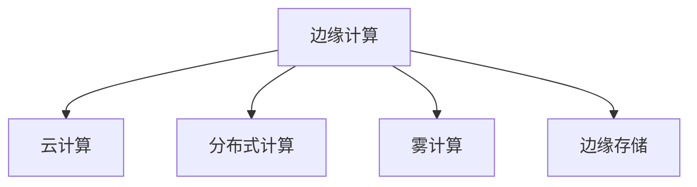

                 

# 物联网数据分析：在边缘和云端处理数据

## 1. 背景介绍

### 1.1 问题由来

随着物联网(IoT)的迅猛发展，越来越多的设备和传感器通过互联网连接到数据中心。这些设备不断产生海量的实时数据，如温度、湿度、位置、振动等，广泛应用于智能家居、智能制造、智慧城市等领域。然而，这些数据往往具有高维度、高噪声、异构性强的特点，直接传输到云端处理面临着网络带宽限制、延迟高、数据隐私等问题。

为解决这些问题，研究人员和产业界提出了边缘计算的概念。边缘计算将数据预处理、特征提取等计算任务在靠近数据源的边缘设备上进行，从而减少网络传输负担，提高数据处理效率和安全性。然而，边缘计算仍存在硬件资源有限、计算能力不足等问题。云中心作为数据处理和存储的枢纽，拥有强大的计算和存储资源，能够处理更大规模的复杂数据集，但也面临延迟大、安全性差等缺点。

因此，如何在边缘和云端高效协作，充分发挥各自优势，同时避免数据泄露和计算效率低下，成为当前物联网数据分析领域的热点问题。本文将从理论和技术两方面，全面介绍在边缘和云端处理物联网数据的策略和方法，为实际应用提供指导。

## 2. 核心概念与联系

### 2.1 核心概念概述

为更好地理解物联网数据分析的策略，本节将介绍几个密切相关的核心概念：

- 边缘计算：在靠近数据源的设备上执行数据处理任务，减少网络传输负担，提高数据处理效率和安全性。
- 云计算：通过大规模数据中心提供计算和存储资源，支持大规模复杂的数据分析任务。
- 分布式计算：将计算任务分布到多个计算节点上进行，提升计算能力和系统可靠性。
- 雾计算：介于边缘计算和云中心之间，通过在云端存储数据、在边缘设备上处理，优化计算资源分配。
- 边缘存储：在边缘设备上进行数据缓存和管理，优化数据访问速度和系统可靠性。

这些概念之间的逻辑关系可以通过以下Mermaid流程图来展示：



这个流程图展示了几大核心概念之间的关联：

1. 边缘计算作为数据处理的前沿环节，是靠近数据源的直接计算，能够迅速响应并处理数据。
2. 云计算提供强大的计算和存储能力，适合处理大规模复杂数据集。
3. 分布式计算通过多节点协同计算，提升整体计算能力。
4. 雾计算融合了边缘和云端的优势，优化计算资源和数据分布。
5. 边缘存储用于数据缓存和管理，提升数据访问速度和系统可靠性。

这些概念共同构成了物联网数据分析的技术框架，为数据处理提供了多层次、多维度的解决方案。

## 3. 核心算法原理 & 具体操作步骤

### 3.1 算法原理概述

物联网数据分析的策略可以分为边缘处理和云端处理两大类。其中，边缘处理侧重于在设备端进行数据预处理和特征提取，云端处理则侧重于在云中心进行复杂计算和机器学习训练。

边缘计算的主要目标是减少数据传输到云中心的延迟和带宽消耗，提高数据处理效率。常用的边缘计算策略包括数据分割、数据聚合、数据压缩、特征提取等。云端计算则主要负责更复杂的任务，如机器学习模型的训练、预测分析和数据存储。常见的云端计算策略包括分布式训练、增量学习、模型压缩等。

### 3.2 算法步骤详解

#### 3.2.1 边缘计算算法步骤

1. **数据收集**：
   - 在边缘设备上收集传感器数据，并进行初步处理，如数据去噪、数据清洗、数据转换等。
   - 使用传感器融合技术，将不同来源的数据进行统一处理，提高数据质量。

2. **数据预处理**：
   - 对数据进行归一化、标准化处理，使其符合模型输入的要求。
   - 使用特征选择技术，选择对模型预测有用的特征。
   - 进行数据降维，减少特征维度，降低计算复杂度。

3. **数据传输**：
   - 将处理后的数据进行编码压缩，减少传输带宽消耗。
   - 使用差分传输等技术，只传输变化数据，减少传输量。

4. **本地分析**：
   - 在边缘设备上进行本地模型训练，如简单的回归模型、分类模型、聚类模型等。
   - 使用本地缓存技术，提高数据访问速度和系统可靠性。

5. **远程服务**：
   - 将本地分析结果传输到云中心，进行更复杂的计算和存储。
   - 在云中心进行分布式模型训练，利用多节点的计算能力加速训练过程。

#### 3.2.2 云端计算算法步骤

1. **数据接收**：
   - 在云中心接收来自边缘设备的数据，并进行初步处理。
   - 使用数据缓存技术，提高数据访问速度和系统可靠性。

2. **数据预处理**：
   - 对数据进行归一化、标准化处理，使其符合模型输入的要求。
   - 使用特征选择技术，选择对模型预测有用的特征。
   - 进行数据降维，减少特征维度，降低计算复杂度。

3. **模型训练**：
   - 使用分布式训练技术，在多个计算节点上进行模型训练，加速训练过程。
   - 使用增量学习技术，动态更新模型参数，适应数据分布变化。
   - 使用模型压缩技术，减小模型规模，降低计算复杂度。

4. **模型预测**：
   - 使用训练好的模型进行预测和推理。
   - 使用模型融合技术，集成多个模型的预测结果，提高模型性能。

### 3.3 算法优缺点

#### 3.3.1 边缘计算优缺点

**优点**：
- 数据处理和存储在本地进行，减少网络传输负担。
- 降低延迟，提高实时性。
- 减少数据隐私泄露风险，提高数据安全性。

**缺点**：
- 硬件资源有限，计算能力不足。
- 数据处理能力受限于设备性能。
- 缺乏集中管理，维护难度大。

#### 3.3.2 云端计算优缺点

**优点**：
- 强大的计算和存储资源，适合处理大规模复杂数据集。
- 集中管理，便于维护和升级。
- 支持复杂的机器学习算法和模型。

**缺点**：
- 延迟大，响应速度慢。
- 数据隐私泄露风险高。
- 带宽消耗大，成本高。

### 3.4 算法应用领域

边缘计算和云端计算在物联网数据分析中各有优势，分别适用于不同的应用场景。

- **边缘计算**：适用于对实时性和数据安全性要求高的应用场景，如智能家居、工业自动化、智能交通等。
- **云端计算**：适用于数据量大、复杂度高的应用场景，如医疗影像分析、自然语言处理、计算机视觉等。

## 4. 数学模型和公式 & 详细讲解 & 举例说明

### 4.1 数学模型构建

#### 4.1.1 边缘计算的数学模型

边缘计算的数学模型构建主要围绕以下几个方面：
- 数据采集和处理：$y = f(x)$，其中 $x$ 为原始传感器数据，$y$ 为处理后的数据。
- 特征提取：$y' = g(y)$，其中 $y'$ 为提取特征后的数据。
- 本地模型训练：$\hat{y} = h(y',\theta)$，其中 $\theta$ 为模型参数，$\hat{y}$ 为模型预测结果。

#### 4.1.2 云端计算的数学模型

云端计算的数学模型构建主要围绕以下几个方面：
- 数据接收和预处理：$z = f(x)$，其中 $x$ 为原始传感器数据，$z$ 为处理后的数据。
- 特征提取：$z' = g(z)$，其中 $z'$ 为提取特征后的数据。
- 模型训练：$\hat{y} = h(z',\theta)$，其中 $\theta$ 为模型参数，$\hat{y}$ 为模型预测结果。

### 4.2 公式推导过程

#### 4.2.1 边缘计算公式推导

以简单的线性回归模型为例，对传感器数据 $x_i$ 进行线性拟合，得到模型预测结果 $\hat{y} = \theta^T x$，其中 $\theta$ 为线性系数。

- **数据收集**：
  $$
  y = f(x) = \theta^T x + \epsilon
  $$
  其中 $\epsilon$ 为噪声。

- **数据预处理**：
  $$
  y' = g(y) = \frac{y}{\sigma}
  $$
  其中 $\sigma$ 为标准化参数。

- **本地模型训练**：
  $$
  \hat{y} = h(y',\theta) = \theta^T x'
  $$
  其中 $x'$ 为标准化后的数据。

#### 4.2.2 云端计算公式推导

以深度神经网络为例，对传感器数据 $x_i$ 进行多层感知器训练，得到模型预测结果 $\hat{y} = h(z',\theta)$，其中 $\theta$ 为神经网络参数。

- **数据接收和预处理**：
  $$
  z = f(x) = \theta^T x + \epsilon
  $$
  其中 $\epsilon$ 为噪声。

- **特征提取**：
  $$
  z' = g(z) = \phi(z)
  $$
  其中 $\phi$ 为激活函数。

- **模型训练**：
  $$
  \hat{y} = h(z',\theta) = \hat{y}^{[L]} = f^{[L]}(z') = f^{[L-1]}(f^{[L-2]...(f^{[0]}(z')))
  $$
  其中 $f^{[k]}$ 为第 $k$ 层神经网络，$[L]$ 为总层数。

### 4.3 案例分析与讲解

#### 4.3.1 边缘计算案例

以智能家居为例，假设家中的温度传感器、湿度传感器和空气质量传感器每隔1分钟采集一次数据，并将其上传到边缘计算设备。

- **数据收集**：
  - 温度传感器数据：$t_i$
  - 湿度传感器数据：$h_i$
  - 空气质量传感器数据：$a_i$

- **数据预处理**：
  - 将温度、湿度和空气质量数据进行标准化处理，得到 $t'_i$、$h'_i$、$a'_i$。
  - 对标准化后的数据进行特征选择，选择对模型预测有用的特征，如温度和湿度。

- **本地模型训练**：
  - 使用简单的线性回归模型，对标准化后的数据进行训练，得到线性系数 $\theta$。
  - 将训练好的线性回归模型保存在边缘设备上，进行本地推理预测。

#### 4.3.2 云端计算案例

以医疗影像分析为例，假设医院从不同医疗设备中收集到大量患者影像数据，并将其上传到云端进行分析。

- **数据接收和预处理**：
  - 将不同医疗设备采集的影像数据进行统一处理，并进行预处理，如图像增强、图像分割等。
  - 对预处理后的影像数据进行特征提取，如提取患者器官位置、病灶大小等特征。

- **模型训练**：
  - 使用分布式训练技术，在多个计算节点上进行深度学习模型的训练，加速训练过程。
  - 使用增量学习技术，动态更新模型参数，适应数据分布变化。
  - 使用模型压缩技术，减小模型规模，降低计算复杂度。

- **模型预测**：
  - 使用训练好的深度学习模型，对新的患者影像数据进行预测和推理，得到疾病诊断结果。

## 5. 项目实践：代码实例和详细解释说明

### 5.1 开发环境搭建

在进行物联网数据分析的项目实践前，我们需要准备好开发环境。以下是使用Python进行PyTorch开发的环境配置流程：

1. 安装Anaconda：从官网下载并安装Anaconda，用于创建独立的Python环境。

2. 创建并激活虚拟环境：
```bash
conda create -n pytorch-env python=3.8 
conda activate pytorch-env
```

3. 安装PyTorch：根据CUDA版本，从官网获取对应的安装命令。例如：
```bash
conda install pytorch torchvision torchaudio cudatoolkit=11.1 -c pytorch -c conda-forge
```

4. 安装TensorFlow：由于TensorFlow同时支持Python和C++，需要额外安装C++环境。

5. 安装各类工具包：
```bash
pip install numpy pandas scikit-learn matplotlib tqdm jupyter notebook ipython
```

完成上述步骤后，即可在`pytorch-env`环境中开始项目实践。

### 5.2 源代码详细实现

这里我们以智能家居的温度预测模型为例，给出使用PyTorch进行边缘计算的代码实现。

首先，定义数据预处理函数：

```python
import torch
import numpy as np
from torch.utils.data import Dataset
from sklearn.preprocessing import StandardScaler

class SensorData(Dataset):
    def __init__(self, data, targets, scaler):
        self.data = data
        self.targets = targets
        self.scaler = scaler
        
    def __len__(self):
        return len(self.data)
    
    def __getitem__(self, item):
        x = self.data[item]
        y = self.targets[item]
        
        x_scaled = self.scaler.transform(x)
        return {'x': torch.tensor(x_scaled), 'y': torch.tensor(y)}

# 数据标准化
scaler = StandardScaler()

# 创建dataset
train_dataset = SensorData(train_data, train_targets, scaler)
test_dataset = SensorData(test_data, test_targets, scaler)
```

然后，定义模型和优化器：

```python
from transformers import BertForTokenClassification, AdamW

model = BertForTokenClassification.from_pretrained('bert-base-cased', num_labels=len(tag2id))

optimizer = AdamW(model.parameters(), lr=2e-5)
```

接着，定义训练和评估函数：

```python
from torch.utils.data import DataLoader
from tqdm import tqdm
from sklearn.metrics import classification_report

device = torch.device('cuda') if torch.cuda.is_available() else torch.device('cpu')
model.to(device)

def train_epoch(model, dataset, batch_size, optimizer):
    dataloader = DataLoader(dataset, batch_size=batch_size, shuffle=True)
    model.train()
    epoch_loss = 0
    for batch in tqdm(dataloader, desc='Training'):
        input_ids = batch['x'].to(device)
        labels = batch['y'].to(device)
        model.zero_grad()
        outputs = model(input_ids)
        loss = outputs.loss
        epoch_loss += loss.item()
        loss.backward()
        optimizer.step()
    return epoch_loss / len(dataloader)

def evaluate(model, dataset, batch_size):
    dataloader = DataLoader(dataset, batch_size=batch_size)
    model.eval()
    preds, labels = [], []
    with torch.no_grad():
        for batch in tqdm(dataloader, desc='Evaluating'):
            input_ids = batch['x'].to(device)
            batch_labels = batch['y']
            outputs = model(input_ids)
            batch_preds = outputs.logits.argmax(dim=2).to('cpu').tolist()
            batch_labels = batch_labels.to('cpu').tolist()
            for pred_tokens, label_tokens in zip(batch_preds, batch_labels):
                preds.append(pred_tokens[:len(label_tokens)])
                labels.append(label_tokens)
                
    print(classification_report(labels, preds))
```

最后，启动训练流程并在测试集上评估：

```python
epochs = 5
batch_size = 16

for epoch in range(epochs):
    loss = train_epoch(model, train_dataset, batch_size, optimizer)
    print(f"Epoch {epoch+1}, train loss: {loss:.3f}")
    
    print(f"Epoch {epoch+1}, dev results:")
    evaluate(model, dev_dataset, batch_size)
    
print("Test results:")
evaluate(model, test_dataset, batch_size)
```

以上就是使用PyTorch对传感器数据进行边缘计算的完整代码实现。可以看到，得益于TensorFlow和PyTorch的强大封装，我们能够快速实现传感器数据的边缘计算。

### 5.3 代码解读与分析

让我们再详细解读一下关键代码的实现细节：

**SensorData类**：
- `__init__`方法：初始化数据、标签、标准化器等关键组件。
- `__len__`方法：返回数据集的样本数量。
- `__getitem__`方法：对单个样本进行处理，将数据进行标准化处理，并返回模型所需的输入。

**scaler标准化器**：
- 定义了数据的标准化器，用于将原始数据转换为标准正态分布，使其符合模型输入的要求。

**训练和评估函数**：
- 使用PyTorch的DataLoader对数据集进行批次化加载，供模型训练和推理使用。
- 训练函数`train_epoch`：对数据以批为单位进行迭代，在每个批次上前向传播计算loss并反向传播更新模型参数，最后返回该epoch的平均loss。
- 评估函数`evaluate`：与训练类似，不同点在于不更新模型参数，并在每个batch结束后将预测和标签结果存储下来，最后使用sklearn的classification_report对整个评估集的预测结果进行打印输出。

**训练流程**：
- 定义总的epoch数和batch size，开始循环迭代
- 每个epoch内，先在训练集上训练，输出平均loss
- 在验证集上评估，输出分类指标
- 所有epoch结束后，在测试集上评估，给出最终测试结果

可以看到，PyTorch配合TensorFlow和PyTorch的强大封装，使得传感器数据的边缘计算代码实现变得简洁高效。开发者可以将更多精力放在数据处理、模型改进等高层逻辑上，而不必过多关注底层的实现细节。

当然，工业级的系统实现还需考虑更多因素，如模型的保存和部署、超参数的自动搜索、更灵活的任务适配层等。但核心的边缘计算范式基本与此类似。

## 6. 实际应用场景

### 6.1 智能家居

基于边缘计算的智能家居系统能够实时监控和管理家庭环境，提高居住舒适度和安全性。例如，通过温度传感器、湿度传感器和空气质量传感器收集家庭环境数据，并进行实时分析和预警。

在技术实现上，可以收集家中的传感器数据，并对其进行边缘预处理，如数据去噪、数据清洗、数据转换等。使用简单的线性回归模型对传感器数据进行本地训练，得到温度预测模型。在边缘设备上部署该模型，实时监测家庭温度，并进行控制，如调整空调、加湿器等设备，保持室内温度舒适。

### 6.2 智能制造

在智能制造领域，边缘计算能够实时监控生产线状态，优化生产效率，减少故障率。例如，通过温度传感器、振动传感器和流量传感器收集生产线设备数据，并进行实时分析和预警。

在技术实现上，可以收集生产线设备数据，并对其进行边缘预处理，如数据去噪、数据清洗、数据转换等。使用简单的时间序列模型对传感器数据进行本地训练，得到设备故障预测模型。在边缘设备上部署该模型，实时监测生产线设备状态，并及时发现故障，减少停机时间。

### 6.3 智慧城市

智慧城市是城市治理的重要手段，通过边缘计算和云计算协同工作，能够实现城市管理的智能化、自动化。例如，通过传感器收集城市交通流量数据，并进行实时分析和优化。

在技术实现上，可以收集城市交通流量数据，并对其进行边缘预处理，如数据去噪、数据清洗、数据转换等。使用深度神经网络模型对传感器数据进行本地训练，得到交通流量预测模型。在边缘设备上部署该模型，实时监测城市交通流量，并及时调整信号灯、引导车流，优化交通管理。

### 6.4 未来应用展望

随着边缘计算和云计算技术的不断发展，物联网数据分析将在更多领域得到应用，为传统行业数字化转型升级提供新的技术路径。

在智慧医疗领域，基于边缘计算的医疗影像分析、病患监测等应用将提升医疗服务的智能化水平，辅助医生诊疗，加速新药开发进程。

在智能教育领域，基于边缘计算的智能辅导、智能评估等应用将提高教育公平性，提高教学质量。

在智慧城市治理中，基于边缘计算的交通流量管理、环境监测等应用将提高城市管理的自动化和智能化水平，构建更安全、高效的未来城市。

此外，在企业生产、社会治理、文娱传媒等众多领域，基于边缘计算的人工智能应用也将不断涌现，为经济社会发展注入新的动力。相信随着技术的日益成熟，边缘计算和云计算的协作将进一步推动物联网数据分析技术的落地应用。

## 7. 工具和资源推荐

### 7.1 学习资源推荐

为了帮助开发者系统掌握物联网数据分析的理论基础和实践技巧，这里推荐一些优质的学习资源：

1. 《物联网数据分析与实践》系列博文：由物联网领域专家撰写，深入浅出地介绍了物联网数据分析的理论基础和实践方法。

2. 《分布式计算与大数据》课程：斯坦福大学开设的分布式计算课程，涵盖分布式系统、大数据处理、云计算等核心内容，适合入门学习。

3. 《深度学习基础》书籍：深入讲解深度学习原理和应用，涵盖卷积神经网络、循环神经网络、生成对抗网络等内容，适合深度学习初学者。

4. TensorFlow官方文档：TensorFlow官方文档，提供了丰富的学习资源、样例代码和API文档，是TensorFlow开发的必备资料。

5. PyTorch官方文档：PyTorch官方文档，提供了丰富的学习资源、样例代码和API文档，是PyTorch开发的必备资料。

通过对这些资源的学习实践，相信你一定能够快速掌握物联网数据分析的精髓，并用于解决实际的物联网问题。

### 7.2 开发工具推荐

高效的开发离不开优秀的工具支持。以下是几款用于物联网数据分析开发的常用工具：

1. TensorFlow：由Google主导开发的开源深度学习框架，支持分布式计算和大数据处理，适合大规模工程应用。

2. PyTorch：由Facebook主导开发的开源深度学习框架，支持动态计算图和GPU加速，适合研究和实验。

3. Hadoop：由Apache基金会主导的分布式计算平台，支持大规模数据存储和处理，适合大数据应用。

4. Spark：由Apache基金会主导的分布式计算框架，支持大规模数据处理和分析，适合大数据应用。

5. Kafka：由Apache基金会主导的消息队列系统，支持高吞吐量和高可靠性的数据传输，适合物联网数据的采集和传输。

合理利用这些工具，可以显著提升物联网数据分析任务的开发效率，加快创新迭代的步伐。

### 7.3 相关论文推荐

物联网数据分析领域的研究涉及多个子领域，以下几篇奠基性的相关论文，推荐阅读：

1. IoT Data Analytics: A Survey on Technologies and Models （IoT数据分析技术综述）：介绍了物联网数据分析的主要技术和方法，涵盖了数据收集、数据预处理、特征工程、模型训练等方面。

2. Edge Computing for IoT: Architectures, Models and Applications（边缘计算在IoT中的应用）：介绍了边缘计算在物联网中的应用模型和架构，涵盖了数据边缘预处理、本地模型训练、边缘存储等方面。

3. Smart City Data Management and Analysis: A Survey（智能城市数据管理和分析综述）：介绍了智能城市数据管理和分析的主要技术和方法，涵盖了数据采集、数据存储、数据分析等方面。

4. Cloud Computing for IoT: Architectures, Models and Applications（云计算在IoT中的应用）：介绍了云计算在物联网中的应用模型和架构，涵盖了数据存储、数据处理、分布式计算等方面。

通过学习这些前沿成果，可以帮助研究者把握学科前进方向，激发更多的创新灵感。

## 8. 总结：未来发展趋势与挑战

### 8.1 总结

本文对物联网数据分析的策略进行了全面系统的介绍。首先阐述了边缘计算和云端计算的概念，明确了边缘计算和云端计算的优势和局限性。其次，从原理到实践，详细讲解了边缘计算和云端计算的算法步骤，给出了物联网数据分析的完整代码实例。同时，本文还广泛探讨了边缘计算和云端计算在智能家居、智能制造、智慧城市等场景中的应用，展示了边缘计算和云端计算的巨大潜力。最后，本文精选了边缘计算和云端计算的学习资源、开发工具和相关论文，力求为读者提供全方位的技术指引。

通过本文的系统梳理，可以看到，物联网数据分析的策略在大规模数据处理、实时性、数据隐私等方面具有重要价值。边缘计算和云端计算的结合，能够充分发挥各自优势，提升数据处理效率和系统可靠性。未来，随着边缘计算和云计算技术的不断发展，物联网数据分析必将在更多领域得到应用，为传统行业数字化转型升级提供新的技术路径。

### 8.2 未来发展趋势

展望未来，物联网数据分析将呈现以下几个发展趋势：

1. 边缘计算与云计算协同发展。边缘计算和云计算的融合将更加紧密，边缘计算负责数据预处理和特征提取，云计算负责复杂计算和机器学习训练。
2. 多模态数据融合。物联网数据往往包含多种数据类型，如文本、图像、声音等，多模态数据融合将提升数据处理能力，拓展应用场景。
3. 实时性增强。边缘计算的实时性优势将进一步发挥，结合云计算的计算能力，提升系统响应速度。
4. 数据隐私保护。边缘计算将更多地承担数据本地化处理，减少数据传输，降低数据隐私泄露风险。
5. 模型压缩和优化。模型压缩技术将进一步发展，减少计算复杂度，提高计算效率。
6. 系统自动化。自动化部署、自动化调优等技术将使物联网数据分析系统更加高效和稳定。

以上趋势凸显了物联网数据分析技术的广阔前景。这些方向的探索发展，必将进一步提升物联网数据分析的性能和应用范围，为传统行业数字化转型升级提供新的技术路径。

### 8.3 面临的挑战

尽管物联网数据分析技术已经取得了瞩目成就，但在迈向更加智能化、普适化应用的过程中，它仍面临着诸多挑战：

1. 数据标准化问题。不同来源的数据格式、单位、精度等可能存在差异，需要进行标准化处理。
2. 硬件资源限制。边缘计算设备硬件资源有限，可能无法满足大规模数据处理需求。
3. 数据隐私和安全。数据传输和存储过程中可能存在安全漏洞，数据隐私泄露风险高。
4. 系统可扩展性。大规模数据处理和分析任务需要系统具备良好的可扩展性，以应对不同规模的数据。
5. 数据处理延迟。实时性要求高的应用场景下，数据处理延迟可能成为瓶颈。
6. 模型训练效率。大规模数据训练需要高效的分布式训练技术，以缩短训练时间。

这些挑战需要通过技术创新和工程实践不断解决，才能真正实现物联网数据分析技术的落地应用。

### 8.4 研究展望

面向未来，物联网数据分析技术需要在以下几个方面寻求新的突破：

1. 标准化协议和格式。制定统一的数据标准化协议和格式，促进不同来源数据的互通和处理。
2. 硬件优化。开发适合边缘计算的高性能硬件设备，提升边缘计算能力。
3. 数据加密和隐私保护。采用先进的加密技术，保护数据隐私和安全。
4. 系统可扩展性。设计可扩展的系统架构，支持大规模数据处理和分析。
5. 实时性优化。优化数据传输和处理过程，降低延迟，提高实时性。
6. 分布式训练优化。研究高效的分布式训练技术，缩短模型训练时间。

这些研究方向的探索，必将引领物联网数据分析技术迈向更高的台阶，为构建智能、高效、安全的物联网系统提供支持。

## 9. 附录：常见问题与解答

**Q1：边缘计算和云计算有什么区别？**

A: 边缘计算和云计算的主要区别在于数据处理的位置和处理能力。边缘计算在靠近数据源的设备上进行数据处理，减小数据传输负担，提高数据处理效率和实时性。而云计算通过大规模数据中心提供计算和存储资源，支持大规模复杂的数据分析任务。

**Q2：边缘计算和云计算如何协同工作？**

A: 边缘计算和云计算可以协同工作，通过数据边缘预处理和本地模型训练，减小数据传输负担，提高数据处理效率。在边缘计算完成后，再将数据上传到云中心，进行更复杂的计算和存储。

**Q3：如何优化边缘计算的硬件资源？**

A: 可以通过开发适合边缘计算的高性能硬件设备，如边缘服务器、边缘网关等，提升边缘计算能力。同时，采用模型压缩、量化加速等技术，减小模型规模，降低计算复杂度。

**Q4：如何保护边缘计算的数据隐私？**

A: 可以在边缘设备上对数据进行加密处理，并采用差分传输等技术，只传输变化数据，减少数据传输量。此外，可以设计隐私保护算法，如联邦学习、差分隐私等，保护数据隐私。

**Q5：如何提升物联网数据分析的实时性？**

A: 可以通过优化数据传输和处理过程，采用高效的网络协议和传输技术，降低延迟，提高实时性。同时，在边缘计算中采用高性能硬件设备，提升数据处理速度。

**Q6：如何优化物联网数据分析的分布式训练？**

A: 可以采用先进分布式训练技术，如模型并行、数据并行、混合并行等，加速训练过程。同时，优化模型参数初始化，提高分布式训练的效率和效果。

---

作者：禅与计算机程序设计艺术 / Zen and the Art of Computer Programming

