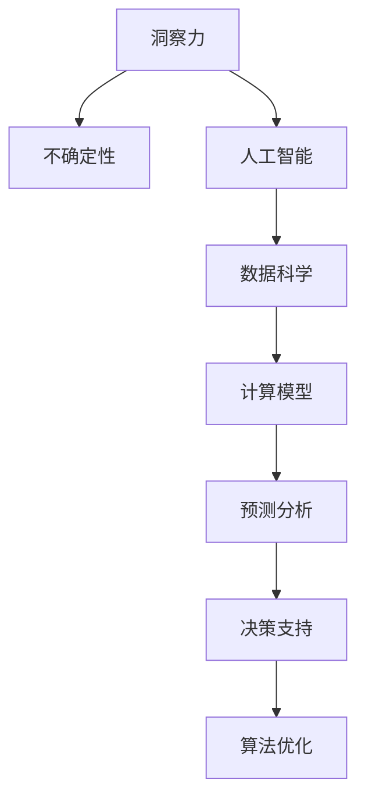

                 

# 理解洞察力的价值：在不确定性中的光芒

> 关键词：洞察力, 不确定性, 人工智能, 数据科学, 计算模型, 预测分析, 决策支持, 算法优化

## 1. 背景介绍

### 1.1 问题由来

在当今这个快速变化、充满不确定性的世界中，洞察力的价值比以往任何时候都显得更为重要。无论是个人决策，还是企业运营，乃至国家治理，洞察力都扮演着不可或缺的角色。特别是在信息过载、数据爆炸的现代社会，如何在海量的信息中挖掘出真正的洞见，指导行动，成为一个极具挑战的问题。

### 1.2 问题核心关键点

洞察力的获取，通常需要通过数据的收集、处理、分析和建模来实现。随着人工智能和大数据技术的发展，计算模型在处理大规模复杂数据方面展现了强大的能力。然而，构建一个真正有价值的洞察力，不仅仅是技术层面的挑战，更涉及模型选择、算法优化、数据质量等多个维度的协同。

当前，计算模型的类型和算法框架繁多，从传统的统计分析到深度学习、强化学习，再到新兴的因果推断、联邦学习等，每种模型和算法都有其优势和局限。如何根据具体需求选择合适的模型和算法，并在实际应用中不断优化，成为提升洞察力价值的关键。

### 1.3 问题研究意义

理解洞察力的价值，不仅有助于个人和企业做出更明智的决策，还能促进社会资源的更高效分配和利用。随着AI和大数据技术的不断进步，洞察力的获取手段和应用场景也在不断扩展，如智能推荐、精准医疗、金融风险管理、城市规划等。通过深入研究洞察力获取的核心问题和关键技术，能够为这些领域的智能化转型提供有力的支持。

## 2. 核心概念与联系

### 2.1 核心概念概述

为更好地理解洞察力获取的核心概念和它们之间的联系，本节将介绍几个密切相关的核心概念：

- **洞察力**：指在复杂数据中识别出的能够指导决策的深刻理解和洞见。通常通过数据分析、建模、可视化等手段获得。
- **不确定性**：指在决策和预测过程中，结果的不可预测性和变异性。理解和量化不确定性，对于构建稳健的洞察力至关重要。
- **人工智能**：通过机器学习和深度学习技术，实现自主学习、推理和决策的智能系统。人工智能在获取洞察力方面提供了强大的工具和方法。
- **数据科学**：涉及数据的收集、处理、分析和建模，旨在从数据中提取有价值的信息和洞见。数据科学为洞察力的获取提供了数据基础。
- **计算模型**：包括统计模型、机器学习模型、深度学习模型、强化学习模型等，用于数据建模和预测分析。计算模型在洞察力获取过程中起着核心作用。
- **预测分析**：通过历史数据和模型，对未来进行预测和评估。预测分析是洞察力获取的重要组成部分。
- **决策支持**：基于洞察力，为决策提供依据和建议。决策支持系统在管理和运营中具有重要应用价值。
- **算法优化**：指对模型和算法进行优化，提升其性能、效率和鲁棒性。算法优化是洞察力获取中不可或缺的一环。

这些核心概念之间的逻辑关系可以通过以下Mermaid流程图来展示：



这个流程图展示了洞察力获取的核心概念及其之间的关系：

1. 洞察力以不确定性为基础，通过对数据的深度分析和建模，获取有用的洞见。
2. 人工智能和大数据技术为洞察力的获取提供了强大的工具和方法。
3. 数据科学提供数据的准备和处理，是洞察力获取的基础。
4. 计算模型用于数据的建模和预测分析，是洞察力获取的核心技术。
5. 预测分析通过历史数据和模型，对未来进行预测，为洞察力提供重要信息。
6. 决策支持系统基于洞察力，为实际决策提供支持和建议。
7. 算法优化不断提升模型的性能和效率，增强洞察力的可靠性。

## 3. 核心算法原理 & 具体操作步骤
### 3.1 算法原理概述

洞察力的获取，通常依赖于数据的收集、处理和分析，以及模型的建立和优化。在此过程中，算法的原理和步骤起着关键作用。

对于基于计算模型的洞察力获取，其核心原理可概括为：

1. **数据收集与预处理**：收集相关数据，并进行清洗、归一化、特征工程等预处理步骤。
2. **建模与训练**：选择合适的模型和算法，通过历史数据训练模型。
3. **模型评估与优化**：对模型进行评估，根据评估结果进行优化调整。
4. **预测与洞察**：使用优化后的模型进行预测和分析，提取有价值的洞察力。

### 3.2 算法步骤详解

基于计算模型的洞察力获取，一般包括以下几个关键步骤：

**Step 1: 数据收集与预处理**
- 确定需要分析的数据源，包括结构化数据和非结构化数据。
- 对数据进行清洗、去重、归一化等预处理操作，去除噪音和异常值。
- 进行特征工程，提取和构造对洞察力有帮助的特征。

**Step 2: 建模与训练**
- 选择合适的模型框架，如TensorFlow、PyTorch等，以及相应的算法模型，如回归模型、分类模型、深度神经网络等。
- 对模型进行训练，设置合适的超参数，如学习率、迭代次数等。
- 使用历史数据对模型进行训练，优化模型参数。

**Step 3: 模型评估与优化**
- 使用测试集或交叉验证方法对模型进行评估，衡量模型的性能指标，如准确率、召回率、F1值等。
- 根据评估结果，调整模型参数或选择新的模型，以提高性能。
- 使用正则化技术、早停法等防止过拟合，确保模型的泛化能力。

**Step 4: 预测与洞察**
- 对新数据进行预测，获取模型输出。
- 使用可视化工具如matplotlib、seaborn等，将模型输出转化为易于理解的洞察力，如数据趋势、模式、异常等。
- 结合业务知识，对洞察力进行解读和应用，指导实际决策。

### 3.3 算法优缺点

基于计算模型的洞察力获取方法具有以下优点：

1. 数据驱动：通过大量数据训练模型，能够挖掘出数据中的深层结构和模式，为洞察力提供数据支撑。
2. 自动化：模型训练和预测过程高度自动化，减少了人工干预和误操作的可能性。
3. 高效性：通过并行计算和分布式训练，模型可以高效处理大规模数据。
4. 可解释性：现代模型如LIME、SHAP等提供了多种方法，使模型的决策过程可解释、可理解。

同时，该方法也存在一些局限性：

1. 数据质量依赖：模型性能高度依赖数据的质量和完整性，数据偏差和噪声可能会影响模型结果。
2. 模型复杂性：复杂模型往往需要更多的数据和计算资源，训练和优化过程较为复杂。
3. 黑盒问题：某些高级算法如深度学习，其内部工作机制复杂，难以直观理解。
4. 过拟合风险：在数据量较小的情况下，模型容易过拟合，泛化能力较差。

尽管有这些局限性，但基于计算模型的洞察力获取方法依然是目前获取洞察力的主要手段，特别是在数据规模较大、结构复杂的应用场景中。

### 3.4 算法应用领域

基于计算模型的洞察力获取方法，已在诸多领域得到广泛应用，例如：

- 金融风险管理：利用历史数据和模型，预测和评估金融风险，指导投资决策。
- 医疗诊断：基于病历数据和影像信息，使用模型辅助疾病诊断和治疗方案推荐。
- 市场营销：分析客户行为数据，预测消费者偏好，优化广告投放和市场策略。
- 供应链管理：通过分析供应链数据，预测库存需求，优化库存管理和物流安排。
- 智能推荐：分析用户行为数据，预测用户兴趣，推荐个性化商品和服务。

除了上述这些经典应用外，计算模型在自然灾害预测、城市规划、环境监测等领域也有广泛应用，为不同行业带来智能化转型的新机遇。

## 4. 数学模型和公式 & 详细讲解 & 举例说明

### 4.1 数学模型构建

本节将使用数学语言对基于计算模型的洞察力获取过程进行更加严格的刻画。

假设待预测的目标变量为 $y$，特征向量为 $X$，模型参数为 $\theta$。基于线性回归模型，预测目标变量 $y$ 的数学表达式为：

$$
y = f(X; \theta) = \theta_0 + \sum_{i=1}^n \theta_i X_i
$$

其中，$\theta_0$ 为截距，$\theta_i$ 为特征 $X_i$ 的权重。模型的目标是最小化预测误差与真实值之间的差距，通常使用均方误差（MSE）作为损失函数：

$$
\mathcal{L}(\theta) = \frac{1}{N} \sum_{i=1}^N (y_i - f(X_i; \theta))^2
$$

其中 $N$ 为样本数量，$y_i$ 为样本的真实值，$X_i$ 为样本的特征向量。

模型训练的目标是最小化损失函数，即求解如下最优化问题：

$$
\theta^* = \mathop{\arg\min}_{\theta} \mathcal{L}(\theta)
$$

使用梯度下降等优化算法，通过反向传播计算梯度，不断更新模型参数，直至收敛：

$$
\theta \leftarrow \theta - \eta \nabla_{\theta} \mathcal{L}(\theta)
$$

其中 $\eta$ 为学习率，$\nabla_{\theta} \mathcal{L}(\theta)$ 为损失函数对模型参数的梯度，可通过链式法则和反向传播算法计算得到。

### 4.2 公式推导过程

以线性回归模型为例，推导其预测和梯度计算公式。

对于单个样本 $i$，其预测值为：

$$
y_i = \theta_0 + \sum_{j=1}^n \theta_j X_{ij}
$$

预测值与真实值之间的误差为：

$$
e_i = y_i - f(X_i; \theta)
$$

均方误差损失函数为：

$$
\mathcal{L}(\theta) = \frac{1}{N} \sum_{i=1}^N e_i^2
$$

求导得梯度：

$$
\nabla_{\theta} \mathcal{L}(\theta) = \frac{2}{N} \sum_{i=1}^N (y_i - f(X_i; \theta)) X_i
$$

结合梯度更新公式，有：

$$
\theta \leftarrow \theta - \eta \nabla_{\theta} \mathcal{L}(\theta)
$$

迭代更新后，即可得到最优参数 $\theta^*$。

### 4.3 案例分析与讲解

以房价预测为例，分析其建模和预测过程：

**数据准备**
- 收集历史房价数据，包括房屋面积、房间数、地段、房屋年代等特征。
- 对数据进行清洗，去除缺失值和异常值。
- 进行特征工程，提取和构造对房价预测有帮助的特征。

**模型建立与训练**
- 使用线性回归模型，对特征和房价进行拟合，设置合适的学习率、迭代次数等超参数。
- 使用历史数据对模型进行训练，优化模型参数。

**模型评估与优化**
- 使用测试集对模型进行评估，计算均方误差（MSE）等指标。
- 根据评估结果，调整模型参数或选择新的模型，以提高性能。
- 使用正则化技术防止过拟合。

**预测与洞察**
- 使用优化后的模型对新房屋数据进行预测。
- 使用可视化工具如matplotlib、seaborn等，将模型输出转化为易于理解的洞察力，如房价分布、变化趋势等。
- 结合业务知识，对洞察力进行解读和应用，指导实际决策。

## 5. 项目实践：代码实例和详细解释说明
### 5.1 开发环境搭建

在进行洞察力获取的实践前，我们需要准备好开发环境。以下是使用Python进行TensorFlow开发的环境配置流程：

1. 安装Anaconda：从官网下载并安装Anaconda，用于创建独立的Python环境。

2. 创建并激活虚拟环境：
```bash
conda create -n tf-env python=3.8 
conda activate tf-env
```

3. 安装TensorFlow：根据CUDA版本，从官网获取对应的安装命令。例如：
```bash
conda install tensorflow -c tf -c conda-forge
```

4. 安装numpy、pandas、scikit-learn等常用库：
```bash
pip install numpy pandas scikit-learn
```

5. 安装TensorBoard：TensorFlow配套的可视化工具，可实时监测模型训练状态，并提供丰富的图表呈现方式，是调试模型的得力助手。
```bash
pip install tensorboard
```

完成上述步骤后，即可在`tf-env`环境中开始洞察力获取的实践。

### 5.2 源代码详细实现

下面我们以房价预测为例，给出使用TensorFlow对线性回归模型进行训练的Python代码实现。

首先，定义模型和优化器：

```python
import tensorflow as tf
from tensorflow.keras.layers import Dense
from tensorflow.keras.models import Sequential

model = Sequential([
    Dense(64, input_shape=[n_features], activation='relu'),
    Dense(1, activation='linear')
])

optimizer = tf.keras.optimizers.Adam(learning_rate=0.01)
```

然后，定义训练函数：

```python
def train_epoch(model, dataset, batch_size, optimizer):
    model.compile(optimizer=optimizer, loss='mse')
    model.fit(dataset.trainX, dataset.trainY, batch_size=batch_size, epochs=1, validation_data=(dataset.testX, dataset.testY))
    return model.evaluate(dataset.testX, dataset.testY)
```

接着，定义数据集类：

```python
class Dataset:
    def __init__(self, X, y):
        self.trainX = X[:train_ratio]
        self.trainY = y[:train_ratio]
        self.testX = X[train_ratio:]
        self.testY = y[train_ratio:]
        
    def __len__(self):
        return len(self.trainX)

    def __getitem__(self, item):
        return self.trainX[item], self.trainY[item]
```

最后，启动训练流程并在测试集上评估：

```python
dataset = Dataset(X, y)
epochs = 100
batch_size = 32

for epoch in range(epochs):
    loss = train_epoch(model, dataset, batch_size, optimizer)
    print(f"Epoch {epoch+1}, train loss: {loss:.3f}")
    
print(f"Epoch {epoch+1}, test loss: {loss:.3f}")
```

以上就是使用TensorFlow进行房价预测的完整代码实现。可以看到，使用TensorFlow搭建线性回归模型非常简单，只需定义模型结构、优化器和训练函数，即可快速完成模型训练。

### 5.3 代码解读与分析

让我们再详细解读一下关键代码的实现细节：

**Dataset类**：
- `__init__`方法：初始化训练集和测试集。
- `__len__`方法：返回数据集的样本数量。
- `__getitem__`方法：对单个样本进行处理，返回样本的输入和输出。

**模型定义**：
- 使用`Sequential`模型类，定义包含两个全连接层的神经网络。
- 第一层为64个神经元的全连接层，使用ReLU激活函数。
- 第二层为线性层，输出一个数值，表示房价预测值。

**训练函数**：
- 使用`compile`方法配置模型，指定优化器和损失函数。
- 使用`fit`方法训练模型，指定训练数据和测试数据。
- 返回模型在测试集上的评估结果。

**训练流程**：
- 定义总的epoch数和batch size，开始循环迭代
- 每个epoch内，先在训练集上训练，输出平均损失
- 在测试集上评估，输出最终结果

可以看到，TensorFlow的高级API使得模型构建和训练变得简洁高效，大大降低了开发者的技术门槛。通过简单的几行代码，我们就可以实现一个完整的房价预测模型。

当然，工业级的系统实现还需考虑更多因素，如模型的保存和部署、超参数的自动搜索、更灵活的任务适配层等。但核心的洞察力获取过程基本与此类似。

## 6. 实际应用场景
### 6.1 智能推荐系统

基于洞察力获取的智能推荐系统，可以广泛应用于电商、媒体、社交平台等领域。通过分析用户的历史行为数据，预测用户的兴趣和需求，实现精准推荐，提升用户体验和平台黏性。

在技术实现上，可以收集用户浏览、点击、评论、分享等行为数据，提取和构造对用户兴趣有帮助的特征，使用模型进行预测和分析，提取有价值的洞察力。在推荐列表生成时，使用优化后的模型预测用户的兴趣匹配度，再结合其他特征综合排序，便可以得到个性化程度更高的推荐结果。

### 6.2 金融风险管理

金融机构需要实时监测市场风险，以便及时应对潜在的金融危机。传统的风险管理往往依赖人工分析和经验判断，容易受主观因素影响，且效率较低。基于洞察力获取的金融风险管理技术，可以为风险监测和预测提供数据驱动的支持。

具体而言，可以收集金融市场的历史数据，如股票价格、交易量、波动率等，使用模型进行分析和预测，提取有价值的洞察力。将微调后的模型应用到实时抓取的网络数据，就能够自动监测不同市场指标的变化趋势，一旦发现异常信号，系统便会自动预警，帮助金融机构快速应对潜在风险。

### 6.3 医疗诊断

医疗诊断是洞察力获取的重要应用场景之一。通过分析病人的病历数据、影像信息、基因数据等，使用模型进行分析和预测，可以辅助医生做出更准确的诊断和治疗方案推荐。

在技术实现上，可以收集病人的电子病历、实验室检查结果、影像数据等，提取和构造对疾病诊断有帮助的特征，使用模型进行训练和预测，提取有价值的洞察力。将微调后的模型应用到新的病历数据，就能够自动分析病情，辅助医生制定治疗方案。

### 6.4 未来应用展望

随着洞察力获取技术的不断发展，其在更多领域的应用前景也将不断拓展。

在智慧城市治理中，洞察力获取技术可以用于城市事件监测、舆情分析、应急指挥等环节，提高城市管理的自动化和智能化水平，构建更安全、高效的未来城市。

在智慧农业中，洞察力获取技术可以用于农作物的生长监测、病虫害预测、灌溉优化等，提升农业生产效率和资源利用率。

在智能交通中，洞察力获取技术可以用于交通流量预测、事故预警、交通拥堵分析等，提升交通管理水平和出行效率。

## 7. 工具和资源推荐
### 7.1 学习资源推荐

为了帮助开发者系统掌握洞察力获取的理论基础和实践技巧，这里推荐一些优质的学习资源：

1. TensorFlow官方文档：官方提供的详细API文档和示例代码，帮助开发者快速上手TensorFlow。

2. Coursera《机器学习》课程：由斯坦福大学Andrew Ng教授讲授的机器学习经典课程，涵盖从线性回归到深度学习的多项内容。

3. Kaggle数据科学竞赛平台：提供大量数据集和实际问题，供开发者进行模型训练和验证。

4. Fast.ai课程：由Jeremy Howard和Rachel Thomas讲授的深度学习课程，注重实战和可操作性，适合初学者入门。

5. Google Colab在线开发环境：提供免费的GPU/TPU算力，方便开发者快速实验和学习。

通过这些资源的学习实践，相信你一定能够快速掌握洞察力获取的精髓，并用于解决实际的AI问题。

### 7.2 开发工具推荐

高效的开发离不开优秀的工具支持。以下是几款用于洞察力获取开发的常用工具：

1. TensorFlow：由Google主导开发的开源深度学习框架，提供灵活的API和高效的计算图，适合大规模模型训练。

2. PyTorch：由Facebook主导开发的开源深度学习框架，易于使用，支持动态图和静态图，适合研究和实验。

3. Jupyter Notebook：开源的交互式开发环境，支持Python、R等多种语言，方便记录和分享代码和实验结果。

4. Scikit-learn：开源的机器学习库，提供了丰富的算法和工具，适合数据预处理和特征工程。

5. Pandas：开源的数据处理库，提供数据清洗、转换、分析等工具，支持多种数据格式。

6. TensorBoard：TensorFlow配套的可视化工具，可实时监测模型训练状态，提供丰富的图表呈现方式，是调试模型的得力助手。

合理利用这些工具，可以显著提升洞察力获取任务的开发效率，加快创新迭代的步伐。

### 7.3 相关论文推荐

洞察力获取技术的发展源于学界的持续研究。以下是几篇奠基性的相关论文，推荐阅读：

1. Neural Network Models of Acquisition and Inference（KR）：经典知识获取模型，通过网络结构表示知识获取和推理过程。

2. The Neural Computation of Reasoning（KR）：探讨神经网络在推理过程中的作用，为知识获取提供了理论基础。

3. Towards principled reasoning with neural networks（KR）：提出神经网络推理机制，为知识获取提供了新的思路。

4. Symbolic-Numeric Computation with DNNs（KR）：结合符号计算和神经网络的优点，提升了知识获取的准确性和可解释性。

5. Knowledge Representation and Reasoning with Symbolic-Numeric Computations（KR）：进一步探讨符号计算和神经网络在知识获取中的结合，提高了知识获取的全面性和深度。

这些论文代表了大数据和人工智能领域的研究进展，通过学习这些前沿成果，可以帮助研究者把握学科前进方向，激发更多的创新灵感。

## 8. 总结：未来发展趋势与挑战

### 8.1 总结

本文对基于计算模型的洞察力获取方法进行了全面系统的介绍。首先阐述了洞察力获取的研究背景和意义，明确了洞察力在决策和预测中的重要作用。其次，从原理到实践，详细讲解了洞察力获取的数学模型和操作步骤，给出了洞察力获取任务开发的完整代码实例。同时，本文还广泛探讨了洞察力获取在多个行业领域的应用前景，展示了洞察力获取技术的巨大潜力。最后，本文精选了洞察力获取技术的各类学习资源，力求为读者提供全方位的技术指引。

通过本文的系统梳理，可以看到，基于计算模型的洞察力获取方法已经成为AI领域的重要手段，极大地提高了数据驱动决策的能力。随着洞察力获取技术的不断进步，其在不同行业的应用范围将不断拓展，为社会治理、企业管理、科学研究等领域带来新的突破。

### 8.2 未来发展趋势

展望未来，洞察力获取技术将呈现以下几个发展趋势：

1. 模型多样化：除了传统的统计模型和深度学习模型外，新兴的因果推断模型、联邦学习模型等也将逐步应用于洞察力获取中，提升模型能力和适应性。

2. 跨模态融合：将视觉、语音、文本等多种模态数据进行融合，提升洞察力的全面性和准确性。

3. 自动化学习：利用自动机器学习（AutoML）技术，自动化选择模型和算法，提升洞察力获取的效率和可靠性。

4. 实时计算：引入实时数据流处理和分布式计算技术，实现洞察力的实时获取和更新，增强决策的及时性。

5. 可解释性增强：利用可解释AI（XAI）技术，提升模型的可解释性，增强决策的可信度和透明性。

6. 联邦学习：利用联邦学习技术，保护数据隐私，实现分布式场景下的洞察力获取。

以上趋势凸显了洞察力获取技术的广阔前景。这些方向的探索发展，必将进一步提升洞察力的获取能力，为决策支持系统的智能化转型提供更加坚实的基础。

### 8.3 面临的挑战

尽管洞察力获取技术已经取得了显著成就，但在迈向更加智能化、普适化应用的过程中，仍面临诸多挑战：

1. 数据质量瓶颈：高质量数据的获取和处理始终是洞察力获取的难点，数据偏差、缺失、噪声等问题可能影响模型结果。

2. 模型复杂性：复杂模型往往需要更多的数据和计算资源，训练和优化过程较为复杂，难以在资源受限的环境中应用。

3. 模型可解释性：高级算法如深度学习，其内部工作机制复杂，难以直观理解，增加了模型应用和维护的难度。

4. 隐私和安全问题：洞察力获取过程中，涉及大量敏感数据，如何在保护隐私和安全的前提下进行模型训练和应用，是一个亟待解决的问题。

5. 高成本问题：洞察力获取涉及大量数据和计算资源，成本较高，可能难以在资源受限的小规模场景中应用。

尽管存在这些挑战，但通过学界和产业界的共同努力，这些难题终将一一被克服，洞察力获取技术必将迎来更加广阔的应用前景。

### 8.4 研究展望

面向未来，洞察力获取技术需要在以下几个方面寻求新的突破：

1. 多源数据融合：整合来自不同来源的数据，提升洞察力的全面性和准确性。

2. 实时洞察力获取：利用实时数据流处理和分布式计算技术，实现洞察力的实时获取和更新。

3. 跨模态推理：结合视觉、语音、文本等多种模态数据，提升洞察力的全面性和准确性。

4. 自动化学习：利用自动机器学习（AutoML）技术，自动化选择模型和算法，提升洞察力获取的效率和可靠性。

5. 可解释性增强：利用可解释AI（XAI）技术，提升模型的可解释性，增强决策的可信度和透明性。

6. 联邦学习：利用联邦学习技术，保护数据隐私，实现分布式场景下的洞察力获取。

这些研究方向的探索，必将引领洞察力获取技术迈向更高的台阶，为构建安全、可靠、可解释、可控的智能系统铺平道路。面向未来，洞察力获取技术还需要与其他人工智能技术进行更深入的融合，如知识表示、因果推理、强化学习等，多路径协同发力，共同推动自然语言理解和智能交互系统的进步。只有勇于创新、敢于突破，才能不断拓展计算模型的边界，让智能技术更好地造福人类社会。

## 9. 附录：常见问题与解答

**Q1：计算模型是否适用于所有洞察力获取场景？**

A: 计算模型在处理结构化数据和大量数据方面具有优势，适用于多数洞察力获取场景。但对于一些需要高度交互和实时响应的场景，如金融交易、医疗诊断等，计算模型可能难以满足低延迟和高效性的要求。此时需要结合其他技术，如实时数据库、专家系统等，实现更高效的洞察力获取。

**Q2：如何选择适合的计算模型？**

A: 选择合适的计算模型需要考虑多个因素，包括数据类型、问题复杂度、性能需求、可解释性等。一般而言，小规模问题可以优先选择简单模型，如线性回归、逻辑回归等；大规模问题可以优先选择复杂模型，如深度神经网络、卷积神经网络等。同时，还需要考虑模型的可解释性和实时性，确保模型的应用效果和用户体验。

**Q3：数据预处理在洞察力获取中扮演什么角色？**

A: 数据预处理是洞察力获取中至关重要的一环。数据预处理包括数据清洗、归一化、特征工程等步骤，旨在去除噪音、填补缺失值、提取有用特征，提升模型的训练效果和预测准确性。高质量的数据预处理，可以显著提升模型的性能，降低模型过拟合的风险。

**Q4：模型的超参数调节对洞察力获取有何影响？**

A: 模型的超参数调节对洞察力获取有着重要影响。超参数调节的目的是在训练过程中优化模型性能，提升模型的泛化能力和鲁棒性。超参数调节不当，可能导致模型过拟合或欠拟合，影响模型的预测效果。因此，选择合适的超参数调节方法，对洞察力获取至关重要。

**Q5：洞察力获取如何与业务知识结合？**

A: 洞察力获取需要与业务知识紧密结合，才能产生真正有价值的洞见。业务知识可以作为模型的先验信息，指导模型的训练和优化过程。同时，业务知识也可以作为模型的验证和解释手段，帮助理解模型的决策逻辑和预测结果。因此，洞察力获取需要与业务专家密切合作，确保模型在实际应用中具有实用性和可解释性。

总之，洞察力获取需要技术手段和业务知识的双重驱动，才能真正实现其价值。开发者需要根据具体应用场景，灵活选择和调整模型和算法，实现最优的洞察力获取效果。

---

作者：禅与计算机程序设计艺术 / Zen and the Art of Computer Programming

