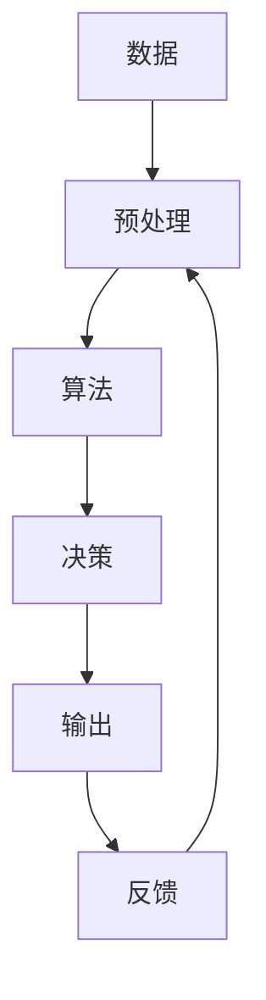

                 

# 理解洞察力的实践：在决策中运用智慧

> 关键词：洞察力, 决策制定, 算法, 优化, 数据分析, 计算模型, 人工智能, 数据科学

## 1. 背景介绍

### 1.1 问题由来
在复杂多变的商业环境中，管理者面临的是众多数据驱动的决策情境。传统的方法主要依赖直觉和经验，但这样的决策往往无法很好地应对瞬息万变的市场和外部因素。面对数据量激增、信息密度降低、决策周期缩短等问题，如何科学高效地运用数据和算法，成为现代管理决策的核心议题。

大企业与创新企业在数据驱动决策方面已经展开了广泛的实践与探索，基于算法的洞察力在商业决策中的应用日益普及。本文章将详细阐述算法的核心概念，深入探讨其应用与优势，为决策者提供科学依据和行动指南。

### 1.2 问题核心关键点
本文章将探讨以下几个关键问题：

1. **算法的核心概念与基本原理**：解释算法是如何运作的，并揭示其在决策中的作用。
2. **基于算法的洞察力的构建与实践**：展示如何运用算法获取与解释数据，辅助决策制定。
3. **算法的优缺点与适用场景**：对常见算法进行优缺点分析，并探讨其在不同决策场景中的应用。
4. **案例分析与实际应用**：使用具体案例阐述算法的应用效果。
5. **算法的未来趋势与挑战**：分析算法在未来的应用前景和可能遇到的挑战。

### 1.3 问题研究意义
深入理解并运用算法，将有助于管理者在决策过程中保持更强的科学性和精准度。在数据爆炸的时代，算法成为洞察力来源的重要工具，能够提供数据驱动的决策支持。

通过算法的运用，管理者能够减少主观偏见，提高决策的可靠性和稳定性，同时提升决策的响应速度与适应性。因此，文章旨在提供一套系统化的决策支持方案，帮助决策者掌握算法的核心原理，从而更高效地处理商业决策中的复杂问题。

## 2. 核心概念与联系

### 2.1 核心概念概述

为了更全面地了解算法的核心概念，本节将详细介绍与算法相关的基本原理与结构。

**算法（Algorithm）**：一组精确、可执行的步骤，用以解决特定问题或执行特定任务。

**决策树（Decision Tree）**：一种基于树状结构决策模型的算法，用以预测或分类数据。

**聚类算法（Clustering Algorithm）**：一种无监督学习方法，用于对数据进行分组或聚类，通常用于市场细分或客户分类。

**回归算法（Regression Algorithm）**：通过寻找数据中的最优拟合线或面，预测数值型数据的未来值。

**优化算法（Optimization Algorithm）**：通过迭代优化过程，寻找问题最优解的算法，如线性规划、遗传算法等。

**强化学习（Reinforcement Learning）**：一种通过奖励和惩罚机制，优化策略的算法，常用于游戏、机器人等自动决策任务。

### 2.2 核心概念原理和架构的 Mermaid 流程图



这个流程图展示了算法的核心步骤与流程：

1. **数据预处理**：对原始数据进行清洗、归一化、特征提取等步骤，以提高数据质量。
2. **算法执行**：根据选择的算法模型对数据进行处理，包括模型训练、参数调优等。
3. **决策执行**：通过算法预测或分类结果，指导决策制定。
4. **反馈调整**：根据实际结果进行反馈调整，进一步优化算法模型。

## 3. 核心算法原理 & 具体操作步骤

### 3.1 算法原理概述

算法的核心在于通过计算和逻辑，从数据中提取信息，并应用这些信息进行决策或预测。常用的算法可以分为几大类，每类算法都有其特定的应用场景与目标。

**监督学习（Supervised Learning）**：利用已标注数据，训练模型以进行分类或回归预测。如决策树、随机森林、支持向量机等。

**无监督学习（Unsupervised Learning）**：使用未标注数据，对数据进行聚类、降维、关联分析等。如K-means、PCA、Apriori等。

**强化学习（Reinforcement Learning）**：通过与环境互动，学习最优策略以达到特定目标。如Q-learning、策略梯度等。

### 3.2 算法步骤详解

以决策树算法为例，详细介绍算法的具体操作步骤。

1. **数据准备**：收集与预处理数据，包括清洗数据、特征提取、数据分割等。
2. **模型构建**：选择合适的决策树算法，如ID3、C4.5、CART等，根据训练数据构建决策树。
3. **模型训练**：在训练集上对决策树进行训练，通过特征选择、剪枝等优化模型。
4. **模型评估**：在验证集上评估决策树性能，如准确率、召回率、F1-score等。
5. **模型应用**：在测试集上应用模型，进行预测或分类，输出最终结果。

### 3.3 算法优缺点

**优点**：
- 算法易于理解和实现。
- 可处理大规模数据。
- 可解释性强，有助于理解和信任决策过程。

**缺点**：
- 过度依赖数据质量。
- 可能存在过拟合或欠拟合问题。
- 处理连续性数据时性能不佳。

### 3.4 算法应用领域

算法广泛应用于众多领域，如金融风控、市场营销、供应链管理等，辅助管理者进行数据驱动的决策制定。

- **金融风控**：利用信用评分模型，对客户的信用风险进行评估和预测。
- **市场营销**：通过客户细分与行为预测，制定精准的市场营销策略。
- **供应链管理**：通过库存优化算法，合理配置供应链资源，降低运营成本。
- **医疗诊断**：应用医学影像识别算法，提高诊断的准确性与效率。

## 4. 数学模型和公式 & 详细讲解 & 举例说明

### 4.1 数学模型构建

以回归算法为例，构建数学模型并进行详细讲解。

**线性回归模型**：

$$
y = \beta_0 + \beta_1x_1 + \beta_2x_2 + ... + \beta_nx_n
$$

其中，$y$ 为预测值，$x_i$ 为自变量，$\beta_i$ 为回归系数。

### 4.2 公式推导过程

推导最小二乘法（Ordinary Least Squares, OLS）用于求解线性回归模型中的回归系数：

$$
\hat{\beta} = (X^TX)^{-1}X^Ty
$$

其中，$X$ 为自变量矩阵，$y$ 为因变量向量。

### 4.3 案例分析与讲解

以房价预测为例，展示如何应用线性回归算法：

假设有一组房屋销售数据，包括房屋面积、房间数等特征，目标预测房价。通过数据收集、预处理和特征工程，构建线性回归模型，并利用数据集进行模型训练和验证。模型训练后，将新房屋数据输入模型进行预测，得出房价。

## 5. 项目实践：代码实例和详细解释说明

### 5.1 开发环境搭建

为了搭建一个回归模型的开发环境，需要准备以下工具和库：

- Python：主流的编程语言，支持广泛的数据科学库。
- NumPy：用于数值计算和矩阵操作。
- Pandas：用于数据处理和清洗。
- Scikit-learn：提供了多种回归算法的实现。

### 5.2 源代码详细实现

以下是一段线性回归的Python代码示例：

```python
from sklearn.linear_model import LinearRegression

# 准备数据
X = pd.DataFrame({
    '房面积': [140, 200, 180, 130, 250],
    '房间数': [3, 4, 2, 2, 3]
})
y = pd.Series([215, 280, 205, 190, 260])

# 创建模型
model = LinearRegression()

# 训练模型
model.fit(X, y)

# 预测房价
new_house = pd.DataFrame({
    '房面积': 220,
    '房间数': 4
})
predicted_price = model.predict(new_house)

print(predicted_price)
```

### 5.3 代码解读与分析

代码首先准备数据集，包括房屋面积和房间数作为特征，房价作为目标变量。然后创建线性回归模型并训练，最后输入新房屋数据进行预测，输出预测的房价。

## 6. 实际应用场景

### 6.1 案例分析

#### 6.1.1 金融风控
某银行利用线性回归模型，根据客户的历史信用记录和行为数据，预测其未来贷款违约的可能性。

#### 6.1.2 市场营销
某电商企业通过聚类算法，对客户行为数据进行分析，将客户分成不同的细分市场，并针对不同市场制定不同的营销策略。

#### 6.1.3 供应链管理
某制造企业应用优化算法，对供应链中的库存和物流进行优化配置，以降低运营成本和提升效率。

#### 6.1.4 医疗诊断
某医院利用机器学习算法，对病人的医学影像数据进行分析，预测疾病风险和诊断结果。

### 6.2 未来应用展望

随着技术的不断进步，算法在决策支持中的应用将更加深入和广泛。未来，基于算法的决策支持系统将成为企业决策的核心工具，为管理者的决策过程提供更科学、精准的依据。

### 6.3 未来趋势与挑战

未来的算法发展将趋向于智能化、自动化和可解释性。人工智能和深度学习等技术的融合，将推动算法在更复杂和不确定性的场景中发挥更大的作用。

面临的挑战包括数据隐私保护、算法偏见和公平性、算法的可解释性和透明性等，这些问题的解决将直接影响算法的广泛应用和信赖度。

## 7. 工具和资源推荐

### 7.1 学习资源推荐

为了帮助读者全面掌握算法的核心原理和实际应用，推荐以下学习资源：

1. **《算法导论》（Introduction to Algorithms）**：由Thomas H. Cormen等撰写，详细讲解了各类经典算法，是学习算法的必备参考资料。
2. **Coursera《机器学习》课程**：由Andrew Ng教授主讲，涵盖机器学习的基本概念和经典算法，适合初学者入门。
3. **Kaggle竞赛平台**：通过参与数据科学竞赛，实践算法的实际应用，提升算法解决实际问题的能力。
4. **《Python数据科学手册》（Python Data Science Handbook）**：由Jake VanderPlas撰写，介绍了Python在数据科学中的广泛应用。
5. **《深度学习》（Deep Learning）**：由Ian Goodfellow等撰写，讲解了深度学习的基本原理和算法实现。

### 7.2 开发工具推荐

使用以下开发工具，可以更高效地进行算法的实现和优化：

1. Python：Python是数据科学和机器学习的主流语言，生态丰富，支持各类数据科学库。
2. R语言：适合统计分析和数据可视化，广泛应用于数据科学领域。
3. SQL：用于数据查询和处理，支持大规模数据管理。
4. Jupyter Notebook：交互式编程环境，支持实时代码展示和数据分析。
5. MATLAB：用于数值计算和科学工程，支持高效的数据分析和可视化。

### 7.3 相关论文推荐

为了深入了解算法的最新进展和应用实践，推荐以下相关论文：

1. **《Grokking Deep Learning》（深入理解深度学习）**：Francesco Mastropietro所著，深入浅出地讲解了深度学习的核心原理和实际应用。
2. **《Pattern Recognition and Machine Learning》（模式识别与机器学习）**：Christopher M. Bishop所著，讲解了机器学习的基本概念和算法实现。
3. **《An Introduction to the Theory of Computation》（计算理论导论）**：Michael Sipser所著，详细介绍了计算理论的基础知识。
4. **《Data Science for Business》（商业数据科学）**：Foster Provost和Tom Fawcett所著，介绍了数据科学在商业中的应用。
5. **《The Elements of Statistical Learning》（统计学习要素）**：Peter Bühlmann和Satoru Uhira所著，讲解了统计学习的基本原理和算法实现。

## 8. 总结：未来发展趋势与挑战

### 8.1 研究成果总结

本文详细介绍了算法的核心概念、基本原理与应用，展示了算法在决策支持中的强大作用。通过实际案例的分析，展示了算法在金融风控、市场营销、供应链管理、医疗诊断等领域的广泛应用。

### 8.2 未来发展趋势

未来，算法的智能与自动化将更加成熟，数据科学和人工智能的融合将推动算法在更复杂和不确定性的场景中发挥更大的作用。算法的可解释性和透明性将逐渐得到重视，人工智能和深度学习的进步将极大提升算法的性能和应用范围。

### 8.3 面临的挑战

算法在实际应用中仍然面临诸多挑战，包括数据隐私保护、算法偏见和公平性、算法的可解释性和透明性等。这些问题将直接影响算法的广泛应用和信赖度，需要持续的改进与优化。

### 8.4 研究展望

未来，需要通过跨学科的合作和深入研究，进一步提升算法的性能和应用范围。研究者需要关注算法的伦理、公平性和可解释性，推动算法在社会和商业中的广泛应用。

## 9. 附录：常见问题与解答

**Q1: 如何选择合适的算法模型？**

A: 选择合适的算法模型需要考虑数据类型、问题类型和模型性能。常用的选择方法包括：

1. 理解问题的本质。根据问题的本质特征选择最合适的算法模型。
2. 理解数据的特征。了解数据的特征，选择最适应的算法模型。
3. 实验对比评估。通过实验对比不同算法模型，选择最优模型。

**Q2: 如何避免算法的过拟合和欠拟合问题？**

A: 过拟合和欠拟合是算法常见的问题。避免方法包括：

1. 数据扩充。通过数据增强或生成新样本，增加数据多样性，避免过拟合。
2. 正则化。通过L1、L2正则化、Dropout等方法，限制模型复杂度，避免过拟合。
3. 模型简化。通过特征选择、模型简化等方法，降低模型复杂度，避免欠拟合。
4. 交叉验证。通过交叉验证方法，评估模型的泛化能力，避免过拟合和欠拟合。

**Q3: 如何提高算法的可解释性？**

A: 提高算法的可解释性是当前研究的重点之一。方法包括：

1. 特征重要性分析。通过特征重要性分析，了解特征对模型的影响。
2. 局部解释方法。通过局部解释方法，解释模型对特定样本的预测过程。
3. 可视化工具。使用可视化工具，展示模型的决策过程。
4. 透明性设计。在设计模型时考虑透明性，提供算法的运行过程和参数。

**Q4: 算法在实际应用中需要注意哪些问题？**

A: 算法在实际应用中需要注意以下问题：

1. 数据隐私保护。确保算法处理的数据符合隐私法规和伦理要求。
2. 算法偏见。避免算法模型引入偏见，确保公平性和透明性。
3. 算法鲁棒性。确保算法在面对数据噪声和异常值时具有鲁棒性。
4. 算法可扩展性。确保算法能够处理大规模数据和复杂问题。

**Q5: 算法在未来应用中有哪些前景？**

A: 算法在未来应用中的前景非常广阔。随着人工智能和深度学习的发展，算法在更多领域和问题中将发挥重要作用。

1. 医疗诊断。通过算法处理医学影像和数据，提高诊断的准确性和效率。
2. 自动驾驶。通过算法处理传感器数据，实现自动驾驶系统的决策和控制。
3. 金融预测。通过算法处理金融数据，预测市场趋势和投资机会。
4. 智能推荐。通过算法处理用户数据，实现精准的智能推荐服务。

---

作者：禅与计算机程序设计艺术 / Zen and the Art of Computer Programming

