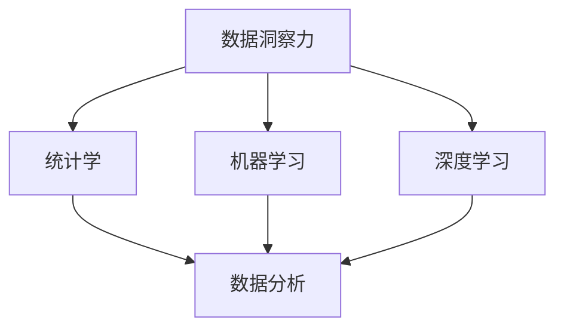

                 

# 理解洞察力的极限：在混乱中寻找规律

> 关键词：数据洞察, 统计学, 机器学习, 数据分析, 深度学习

## 1. 背景介绍

在现代信息爆炸的时代，数据无所不在，但其价值往往被大量噪音所掩埋。如何从庞杂的数据中提炼出有意义的洞察力，是每一个数据科学家和分析师面临的巨大挑战。洞察力不仅关乎企业的战略决策，更决定了数据的价值实现。本文将探讨如何通过数据洞察力揭示数据背后的规律，助力企业获得竞争优势。

### 1.1 问题由来

大数据技术的发展让企业拥有前所未有的数据资源，但也使得数据处理变得更加复杂和困难。传统的数据处理和统计分析方法，如线性回归、方差分析等，对于大规模数据集显得力不从心。新兴的机器学习和深度学习技术，虽然能够挖掘数据中的潜在模式，但模型复杂度高、训练难度大、需要大量标注数据，使得许多企业望而却步。

随着信息技术的进一步发展，数据科学的应用场景和需求不断扩展，需要新的工具和技术，能更高效、更准确地发现数据中的规律和洞察力。本文将介绍一种基于统计学原理的数据洞察力分析方法，并结合现代数据处理技术，探讨其在大规模数据集中的实际应用。

### 1.2 问题核心关键点

数据洞察力分析的核心关键点包括：

1. **数据采集与预处理**：数据的完整性和质量直接决定了分析结果的可信度。
2. **特征工程与选择**：好的特征能显著提升模型效果，避免特征工程中的过拟合。
3. **模型选择与训练**：合适的模型能够在大量数据中找到隐藏规律，提高分析准确性。
4. **结果解释与应用**：洞察力不仅止于发现，更在于如何解释和应用。

本文将围绕这些关键点，系统地介绍数据洞察力的分析方法，并通过实际案例展示其应用效果。

## 2. 核心概念与联系

### 2.1 核心概念概述

为了更好地理解本文所述的洞察力分析方法，本节将介绍几个密切相关的核心概念：

- **数据洞察力 (Data Insight)**：通过对数据的分析处理，发现其背后的规律和趋势，从而指导决策和行动。
- **统计学 (Statistics)**：一种基于数据观察和概率理论的方法，用于提炼数据的特征和规律。
- **机器学习 (Machine Learning)**：一种使机器能够从数据中学习规律，并进行预测或决策的算法。
- **深度学习 (Deep Learning)**：一种基于神经网络的机器学习方法，通过多层次的特征提取，提高模型对复杂数据的处理能力。
- **数据分析 (Data Analysis)**：使用统计学和算法技术，对数据进行系统性分析，挖掘其价值的过程。

这些概念之间的逻辑关系可以通过以下Mermaid流程图来展示：



这个流程图展示了大数据分析的各个环节及其之间的关系：

1. 数据洞察力分析以统计学为基础，提炼数据特征。
2. 机器学习和深度学习等算法，在此基础上进一步挖掘数据中的复杂模式。
3. 数据分析过程不仅依赖统计学和算法，还需要数据清洗、预处理等前期工作。

## 3. 核心算法原理 & 具体操作步骤

### 3.1 算法原理概述

数据洞察力分析的核心在于利用统计学方法，发现数据集中的规律和趋势。其核心算法包括：

- **统计描述**：通过均值、方差、标准差等指标描述数据的基本特征。
- **概率分布**：使用正态分布、t分布等统计分布模型，描述数据的随机性和规律。
- **假设检验**：通过样本统计量与总体参数之间的比较，检验数据的显著性。
- **回归分析**：基于回归模型，预测数据之间的相互关系。

### 3.2 算法步骤详解

基于统计学的数据洞察力分析，一般包括以下几个关键步骤：

1. **数据收集与预处理**：获取原始数据，并进行清洗、整理和缺失值处理。
2. **特征工程与选择**：选择或构造合适的特征，通过编码、归一化等方法预处理数据。
3. **统计描述与分析**：使用描述性统计量和分布模型描述数据的基本特征。
4. **模型选择与训练**：选择合适的统计模型，进行参数估计和假设检验。
5. **结果解释与应用**：根据模型结果，解释数据背后的规律和趋势，指导决策和行动。

### 3.3 算法优缺点

数据洞察力分析方法具有以下优点：

- **高效性**：统计学方法基于小样本统计推断，能够快速发现数据中的规律。
- **普适性**：适用于各种类型的数据集，无需大规模标注数据。
- **可解释性**：统计模型简单易懂，容易解释其结果和意义。

同时，该方法也存在一些局限性：

- **数据依赖**：模型结果依赖于数据的质量和代表性，低质量数据可能导致误导性的结论。
- **泛化能力有限**：基于小样本的统计推断，模型在处理大规模数据时可能表现不足。
- **假设前提**：统计分析依赖于一些假设前提，如正态分布、线性关系等，可能无法满足实际数据的特点。

尽管存在这些局限性，但就目前而言，统计学方法仍然是数据洞察力分析的主流范式。未来相关研究的重点在于如何结合机器学习和深度学习等技术，进一步提高模型的泛化能力和自动化水平。

### 3.4 算法应用领域

数据洞察力分析方法在多个领域得到了广泛应用，例如：

- **金融风险评估**：通过分析历史数据，评估投资组合的风险水平。
- **市场营销**：利用客户行为数据，进行市场细分和消费者洞察。
- **产品优化**：基于用户反馈和行为数据，进行产品改进和功能增强。
- **供应链管理**：通过物流数据和供应链行为，优化库存管理和运输计划。
- **健康管理**：分析患者数据，提供个性化的健康建议和治疗方案。

## 4. 数学模型和公式 & 详细讲解 & 举例说明

### 4.1 数学模型构建

在统计学方法中，我们通常使用以下数学模型来描述数据特征和规律：

- **均值**：样本的数学期望，描述数据的平均水平。
- **方差**：样本的方差，描述数据的离散程度。
- **标准差**：样本的标准差，方差的开根号。
- **正态分布**：形式为 $X \sim N(\mu, \sigma^2)$ 的分布模型，描述了数据的随机性和规律性。
- **t分布**：形式为 $X \sim t(\mu, \sigma^2, n)$ 的分布模型，在小样本条件下描述数据的随机性。

### 4.2 公式推导过程

以正态分布为例，推导其概率密度函数的公式：

设 $X$ 为一个服从正态分布的随机变量，其均值为 $\mu$，方差为 $\sigma^2$，则其概率密度函数为：

$$
f(x) = \frac{1}{\sqrt{2\pi} \sigma} e^{-\frac{(x-\mu)^2}{2\sigma^2}}
$$

其中，$\sqrt{2\pi}$ 为归一化因子，$\sigma$ 为标准差，$e$ 为自然常数。

### 4.3 案例分析与讲解

以金融风险评估为例，假设有一个包含1000条股票交易数据的样本，其收盘价呈正态分布。我们使用正态分布的均值和标准差来描述其分布特征：

1. **描述性统计**：计算样本的均值、方差和标准差。
2. **假设检验**：使用 t 检验，检验样本均值是否显著异于总体均值。
3. **预测分析**：基于样本数据，构建回归模型，预测未来股价。

## 5. 项目实践：代码实例和详细解释说明

### 5.1 开发环境搭建

在进行数据洞察力分析的实践前，我们需要准备好开发环境。以下是使用Python进行Pandas和Scipy库开发的环境配置流程：

1. 安装Anaconda：从官网下载并安装Anaconda，用于创建独立的Python环境。

2. 创建并激活虚拟环境：
```bash
conda create -n stats-env python=3.8 
conda activate stats-env
```

3. 安装Pandas和Scipy：
```bash
conda install pandas scipy
```

4. 安装各类工具包：
```bash
pip install numpy matplotlib seaborn statsmodels
```

完成上述步骤后，即可在`stats-env`环境中开始数据洞察力分析实践。

### 5.2 源代码详细实现

下面我们以金融风险评估为例，给出使用Pandas和Scipy库进行正态分布假设检验的PyTorch代码实现。

首先，定义数据集和计算函数：

```python
import pandas as pd
import numpy as np
import seaborn as sns
import matplotlib.pyplot as plt
from scipy.stats import t

# 定义数据集
df = pd.read_csv('stock_prices.csv')

# 计算样本均值和方差
sample_mean = df['close'].mean()
sample_var = df['close'].var()

# 定义假设检验函数
def t_test(sample_mean, sample_var, n):
    t_value = (sample_mean - mu) / (sample_var / np.sqrt(n))
    p_value = 2 * (1 - t.cdf(abs(t_value), n - 1))
    return t_value, p_value
```

然后，在假设条件下进行正态分布检验：

```python
# 假设总体均值为5
mu = 5

# 假设总体方差未知
n = len(df['close'])

# 进行t检验
t_value, p_value = t_test(sample_mean, sample_var, n)

# 输出检验结果
print(f"t值: {t_value:.3f}, p值: {p_value:.3f}")
```

最后，绘制数据分布图：

```python
# 绘制数据分布图
sns.kdeplot(df['close'], label='样本分布')
sns.kdeplot(np.random.normal(mu, np.sqrt(sample_var), size=n), label='总体分布')
plt.legend()
plt.show()
```

以上就是使用Pandas和Scipy库进行金融风险评估的完整代码实现。可以看到，通过Python的简洁语法和科学计算库，统计分析的实现变得十分简便。

### 5.3 代码解读与分析

让我们再详细解读一下关键代码的实现细节：

**假设检验函数**：
- 使用t检验统计量计算检验值。
- 使用Scipy的`t.cdf`函数计算累积分布函数值，得到p值。

**绘制数据分布图**：
- 使用seaborn库绘制样本数据的核密度估计(KDE)图。
- 通过`np.random.normal`函数生成服从假设分布的随机数据。
- 将样本数据和假设数据的分布图叠加，便于直观比较。

可以看到，Python的科学计算库结合数学统计模型，使得数据分析变得更加高效和直观。开发者可以将更多精力放在模型的构建和分析逻辑上，而不必过多关注底层的实现细节。

当然，工业级的系统实现还需考虑更多因素，如数据预处理、统计模型选择、可视化结果的展示等。但核心的分析逻辑基本与此类似。

## 6. 实际应用场景

### 6.1 金融风险评估

金融风险评估是大数据应用中一个典型的数据洞察力分析场景。金融机构需要评估投资组合的潜在风险，以便合理分配资本和资源。传统的风险评估方法依赖于复杂的高阶数学模型，需要大量计算资源和专业知识。而使用统计学方法，可以更高效、更准确地进行风险评估。

具体而言，可以使用历史交易数据，构建回归模型，预测投资组合的未来收益和波动性。同时使用统计描述和假设检验，分析历史数据中的规律和趋势，从而对投资决策进行指导。

### 6.2 市场营销

市场营销中，数据分析主要用于客户细分、市场趋势分析和个性化推荐。通过分析客户的购买行为、浏览记录等数据，可以发现客户的潜在需求和偏好。使用统计学方法，可以挖掘数据中的潜在模式，指导市场策略的制定和调整。

例如，可以通过回归分析，预测客户未来的购买倾向，同时使用聚类算法，将客户划分为不同的细分群体。基于这些分析结果，可以制定更加精准的营销策略，提高客户满意度和忠诚度。

### 6.3 产品优化

在产品开发和优化过程中，数据分析可以用于评估用户反馈、预测产品性能和改进设计。通过分析用户的使用数据、反馈数据和实验数据，可以发现产品中的潜在问题和改进点。使用统计学方法，可以量化分析结果，指导产品团队的决策和行动。

例如，可以使用假设检验，验证新功能是否有效提升用户体验。同时，可以通过回归分析，预测新功能的潜在效果，从而在产品迭代中做出更有依据的决策。

### 6.4 供应链管理

供应链管理中，数据分析主要用于需求预测、库存管理和运输优化。通过分析历史订单数据、库存数据和物流数据，可以发现供应链中的瓶颈和优化机会。使用统计学方法，可以构建预测模型，优化供应链的管理和运营。

例如，可以使用时间序列分析，预测未来的订单需求和库存水平。同时使用回归分析，优化运输路径和仓储策略，从而降低成本和提高效率。

### 6.5 健康管理

在健康管理中，数据分析主要用于个性化健康建议和治疗方案的制定。通过分析患者的病历数据、检测数据和行为数据，可以发现患者的健康状况和风险因素。使用统计学方法，可以构建预测模型，提供个性化的健康管理方案。

例如，可以使用回归分析，预测患者的未来健康风险，同时使用聚类算法，将患者分为不同的健康风险群体。基于这些分析结果，可以制定更有针对性的健康管理方案，提高患者的健康水平。

## 7. 工具和资源推荐

### 7.1 学习资源推荐

为了帮助开发者系统掌握数据洞察力分析的理论基础和实践技巧，这里推荐一些优质的学习资源：

1. 《数据分析与统计学》系列书籍：系统介绍统计学和数据分析的基本原理和方法，适合初学者入门。

2. 《Python数据分析实战》课程：由Kaggle等平台开设的Python数据分析实战课程，涵盖数据分析的各个环节，包括数据清洗、数据可视化等。

3. 《机器学习实战》书籍：介绍机器学习算法和实战案例，适合数据分析师进阶阅读。

4. Kaggle平台：全球最大的数据科学社区，提供丰富的数据集和竞赛，可以用于实践数据分析和机器学习。

5. Coursera平台：提供多门数据科学和机器学习的在线课程，由知名大学和公司联合授课，内容全面深入。

通过对这些资源的学习实践，相信你一定能够快速掌握数据洞察力的精髓，并用于解决实际的商业问题。

### 7.2 开发工具推荐

高效的开发离不开优秀的工具支持。以下是几款用于数据洞察力分析开发的常用工具：

1. Pandas：基于Python的科学计算库，支持快速数据处理和分析，适合大规模数据集的统计分析。

2. NumPy：基于Python的数值计算库，支持高效的数组操作和数学计算。

3. SciPy：基于Python的科学计算库，支持各种数学函数和科学计算，适合复杂的统计分析任务。

4. Jupyter Notebook：基于Python的交互式编程环境，适合快速原型开发和数据分析。

5. R语言：广泛应用于数据科学和统计分析的编程语言，支持丰富的统计模型和数据可视化工具。

6. SAS：商业级的数据分析软件，支持复杂的数据处理和统计分析，适合企业级的数据洞察力分析。

合理利用这些工具，可以显著提升数据洞察力分析的开发效率，加快创新迭代的步伐。

### 7.3 相关论文推荐

数据洞察力分析的研究源于学界的持续研究。以下是几篇奠基性的相关论文，推荐阅读：

1. "Statistics on the Battlefield: A Comprehensive Introduction to Statistics"：统计学入门教材，适合数据分析初学者阅读。

2. "Introduction to the Analysis of Variance (ANOVA)"：统计学中常用的方差分析方法，适合数据分析师深入学习。

3. "Machine Learning Yearning"：机器学习专家Andrew Ng的实战指南，涵盖数据洞察力分析的各个环节。

4. "The Elements of Statistical Learning"：统计学和机器学习的综合指南，涵盖各种统计模型和算法。

5. "Data Science for Business"：哈佛大学Data Science专业入门课程，涵盖数据科学的基本原理和方法。

这些论文代表了大数据洞察力分析的发展脉络。通过学习这些前沿成果，可以帮助研究者把握学科前进方向，激发更多的创新灵感。

## 8. 总结：未来发展趋势与挑战

### 8.1 总结

本文对基于统计学的数据洞察力分析方法进行了全面系统的介绍。首先阐述了数据洞察力分析的研究背景和意义，明确了统计学方法在数据处理和分析中的重要地位。其次，从原理到实践，详细讲解了统计分析的数学模型和操作步骤，给出了数据洞察力分析任务开发的完整代码实例。同时，本文还广泛探讨了数据洞察力分析方法在金融、市场营销、产品优化等多个领域的应用前景，展示了统计学方法的巨大潜力。

通过本文的系统梳理，可以看到，统计学方法在数据洞察力分析中具有高效、普适、可解释性强等优点，是数据科学应用的核心范式。未来，伴随统计学方法的持续演进和与其他AI技术的融合，其应用范围和效果将进一步提升，为数据驱动的决策提供更强大的技术支持。

### 8.2 未来发展趋势

展望未来，数据洞察力分析技术将呈现以下几个发展趋势：

1. **自动化与智能化**：自动化数据分析工具将更加普及，智能化算法能够自动发现数据中的规律和趋势。
2. **多模态数据融合**：利用多源数据进行综合分析，发现更加全面、深入的数据洞察力。
3. **实时数据处理**：实时数据分析技术将逐步普及，提供更快速、准确的洞察力服务。
4. **人工智能融合**：数据洞察力分析将与机器学习、深度学习等AI技术深度融合，提升模型效果和应用价值。
5. **伦理与隐私保护**：数据洞察力分析将更加注重数据隐私和伦理，防止数据滥用和歧视性分析。

以上趋势凸显了数据洞察力分析技术的广阔前景。这些方向的探索发展，必将进一步提升数据科学的应用水平，为商业决策和企业运营提供更强有力的支持。

### 8.3 面临的挑战

尽管数据洞察力分析技术已经取得了瞩目成就，但在迈向更加智能化、普适化应用的过程中，它仍面临着诸多挑战：

1. **数据质量问题**：数据不完整、不准确、不一致，是数据洞察力分析中的常见问题。如何提高数据质量，是首要挑战。
2. **模型复杂性**：复杂的数据洞察力模型需要较高的计算资源和时间，如何提高模型的计算效率和可解释性，是关键问题。
3. **算法选择**：不同领域和场景需要不同的统计模型，如何选择合适的模型，是数据洞察力分析中的重要问题。
4. **结果解读**：数据分析的结果需要易于理解，如何解释复杂的统计模型和分析结果，是数据科学家的重要任务。
5. **数据隐私**：数据洞察力分析需要大量个人数据，如何保护数据隐私，防止数据滥用，是伦理和安全问题。

正视数据洞察力分析面临的这些挑战，积极应对并寻求突破，将是大数据技术走向成熟的必由之路。相信随着学界和产业界的共同努力，这些挑战终将一一被克服，数据洞察力分析必将在构建数据驱动的智能系统中发挥重要作用。

### 8.4 研究展望

面对数据洞察力分析所面临的种种挑战，未来的研究需要在以下几个方面寻求新的突破：

1. **自动化数据分析**：开发更高效、更智能的自动化分析工具，使数据洞察力分析更加普及和便捷。
2. **多模态数据融合技术**：结合自然语言处理、图像识别等技术，实现多源数据的深度融合，发现更加全面和深入的数据洞察力。
3. **实时数据分析系统**：研究高效的数据流处理技术，实现实时数据分析，提供更快速、准确的洞察力服务。
4. **模型解释与可视化**：研究模型的可解释性和可视化技术，使数据分析的结果更加直观和易懂。
5. **隐私保护与伦理规范**：研究数据隐私保护技术，制定数据使用的伦理规范，确保数据使用的安全性和公正性。

这些研究方向的探索，必将引领数据洞察力分析技术迈向更高的台阶，为数据驱动的决策提供更强大的技术支持。面向未来，数据洞察力分析技术还需要与其他人工智能技术进行更深入的融合，如知识表示、因果推理、强化学习等，多路径协同发力，共同推动数据驱动决策的进步。只有勇于创新、敢于突破，才能不断拓展数据洞察力分析的边界，让数据洞察力分析技术更好地造福社会。

## 9. 附录：常见问题与解答

**Q1：数据洞察力分析是否适用于所有类型的数据集？**

A: 数据洞察力分析通常适用于具有一定规律和趋势的数据集。对于非结构化数据，如文本、图像等，需要先进行预处理和特征工程，才能进行有效的分析。因此，对于不同类型的原始数据，需要根据其特点，选择合适的分析方法和工具。

**Q2：如何评估数据洞察力分析的效果？**

A: 数据洞察力分析的效果评估通常依赖于两个指标：准确性和解释性。准确性指的是分析结果与实际数据的吻合程度，可以通过交叉验证、统计推断等方法进行评估。解释性指的是分析结果的可理解性和可解释性，可以通过可视化、解释性模型等方法提高。

**Q3：在数据洞察力分析中，特征工程的重要性体现在哪里？**

A: 特征工程是数据洞察力分析的核心环节之一，其重要性体现在：

1. 提高模型效果：好的特征能够显著提升模型的性能和泛化能力。
2. 减少过拟合：通过特征选择和构造，避免模型在训练数据上过拟合。
3. 提高模型可解释性：好的特征能够使模型的决策过程更加直观和可理解。

**Q4：数据洞察力分析在实际应用中需要注意哪些问题？**

A: 在实际应用中，数据洞察力分析需要注意以下问题：

1. 数据清洗：数据中的噪音和异常值可能影响分析结果，需要进行清洗和预处理。
2. 数据量问题：数据量过少可能导致分析结果的不可靠性，需要保证足够的数据量。
3. 模型选择：不同的分析问题需要不同的统计模型，需要根据具体问题选择合适的模型。
4. 结果解读：数据分析的结果需要易于理解，避免过度解读或误读。
5. 结果应用：数据分析结果需要与业务场景结合，进行合理的决策和行动。

这些问题是数据洞察力分析中常见的问题，需要开发者在实践中不断迭代和优化。

**Q5：数据洞察力分析中的模型选择和参数调优有什么技巧？**

A: 数据洞察力分析中的模型选择和参数调优，需要遵循以下几个技巧：

1. 数据驱动：选择模型时应根据数据特点，考虑其适用性和泛化能力。
2. 交叉验证：使用交叉验证方法，评估模型在不同数据集上的性能。
3. 网格搜索：使用网格搜索方法，寻找最优的模型参数组合。
4. 正则化：使用正则化方法，避免模型过拟合。
5. 集成学习：使用集成学习方法，提高模型的稳定性和泛化能力。

这些技巧可以帮助开发者更好地选择合适的模型和参数，提升数据洞察力分析的效果。

---

作者：禅与计算机程序设计艺术 / Zen and the Art of Computer Programming

