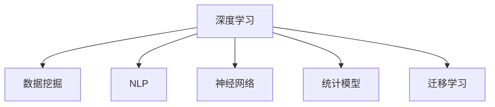

                 

# 理解洞察力的训练：提升信息分析能力

> 关键词：洞察力训练, 信息分析, 深度学习, 数据挖掘, 自然语言处理, 神经网络, 统计模型

## 1. 背景介绍

### 1.1 问题由来
在信息爆炸的时代，如何从海量数据中迅速提取出有价值的信息，已成为各行各业关注的焦点。传统的数据分析方法在面对复杂多变的业务场景时，往往显得力不从心。大数据、人工智能等新兴技术为信息分析带来了全新的解决方案。其中，基于深度学习的洞察力训练方法，通过构建高性能模型，能够自动挖掘数据中的隐藏规律，快速生成深刻的见解，在金融、医疗、电商等多个领域展示了巨大潜力。

### 1.2 问题核心关键点
洞察力训练的本质是利用深度学习模型从数据中自动学习并提取出有用信息。其核心在于：
- 构建合适的模型架构，能够有效处理输入数据的特征。
- 设计高效的训练方法，能够自监督地学习任务相关的信息。
- 优化模型性能，能够在不同的业务场景中快速适应，生成高质量的洞察力。
- 应用洞察力，通过信息分析技术生成业务决策支持，驱动战略规划和运营优化。

本文章将围绕这些关键点，详细探讨洞察力训练的原理、步骤、应用和前景。

## 2. 核心概念与联系

### 2.1 核心概念概述

为更好地理解洞察力训练方法，本节将介绍几个密切相关的核心概念：

- 深度学习(Deep Learning)：一种基于多层神经网络的机器学习技术，通过多层次的非线性映射实现对复杂数据模式的自动学习。深度学习在图像、语音、文本等多种模态数据上取得了显著成果。
- 数据挖掘(Data Mining)：从大量数据中提取有用信息和知识的过程。数据挖掘通常包含分类、聚类、关联规则等技术。
- 自然语言处理(Natural Language Processing, NLP)：处理和理解人类语言的技术，涉及文本分析、信息检索、机器翻译等多个方向。NLP技术在洞察力训练中占有重要地位。
- 神经网络(Neural Network)：一种基于人工神经元模型的计算架构，能够通过反向传播算法进行训练和优化。神经网络是深度学习的基础。
- 统计模型(Statistical Model)：利用统计学原理构建的模型，能够根据数据样本推断总体特征。统计模型在金融、市场研究等领域应用广泛。
- 迁移学习(Transfer Learning)：将在一个任务上学到的知识迁移到另一个相关任务上，降低新任务训练成本，提升模型性能。

这些核心概念之间的逻辑关系可以通过以下Mermaid流程图来展示：



这个流程图展示了几大核心概念之间的联系：

1. 深度学习是数据挖掘、NLP、神经网络的基础，是洞察力训练的核心技术手段。
2. NLP和神经网络在深度学习中扮演重要角色，用于处理和理解文本数据。
3. 统计模型和迁移学习为洞察力训练提供了更多元化的方法，能够帮助模型更好地适应不同场景。

这些概念共同构成了洞察力训练的核心技术框架，使其能够有效利用数据挖掘和统计学原理，通过深度学习模型进行自动化的信息分析。

## 3. 核心算法原理 & 具体操作步骤
### 3.1 算法原理概述

洞察力训练的核心算法是深度学习模型，特别是基于神经网络结构的模型。其原理在于通过构建多层神经网络，利用反向传播算法不断更新模型参数，使得模型能够学习数据中的复杂关系，并自动生成对任务有意义的洞察力。

具体而言，深度学习模型通过以下几个步骤实现对数据中洞察力的训练：
1. 构建模型架构：定义多层神经网络的结构，包括输入层、隐藏层和输出层。
2. 选择损失函数：根据具体任务，选择适当的损失函数，如均方误差、交叉熵等。
3. 训练模型：通过反向传播算法不断调整模型参数，使得损失函数最小化。
4. 应用洞察力：将训练好的模型应用于数据，生成对业务决策有价值的洞察力。

### 3.2 算法步骤详解

洞察力训练的具体步骤如下：

**Step 1: 数据预处理**

- 清洗和标准化数据：去除噪声和异常值，对数据进行归一化处理，确保数据的一致性和稳定性。
- 特征提取：将原始数据转化为数值特征，构建适合深度学习模型的输入格式。
- 数据划分：将数据集划分为训练集、验证集和测试集，用于模型训练、调参和测试。

**Step 2: 构建模型**

- 选择模型架构：根据任务特点选择合适的神经网络结构，如全连接网络、卷积神经网络、循环神经网络等。
- 定义损失函数：根据任务需求定义合适的损失函数，如交叉熵损失、均方误差损失等。
- 初始化模型参数：随机初始化模型中的所有权重和偏置。

**Step 3: 模型训练**

- 设定训练参数：包括学习率、批量大小、迭代次数等。
- 迭代训练：使用反向传播算法，不断更新模型参数，使得损失函数最小化。
- 监控训练过程：在每个epoch后，通过验证集评估模型性能，防止过拟合。

**Step 4: 应用洞察力**

- 输入新数据：将待分析的数据输入训练好的模型。
- 生成洞察力：通过模型输出结果，提取对业务决策有价值的信息。
- 验证洞察力：将洞察力与实际情况进行对比，评估其准确性和可靠性。

### 3.3 算法优缺点

洞察力训练方法具有以下优点：
1. 自动学习：通过深度学习模型自动学习数据特征，无需手工特征工程，减少了人工干预。
2. 适应性强：模型能够适应不同数据分布，在不同业务场景中表现出较高的泛化能力。
3. 多任务处理：通过迁移学习，模型能够在多个相关任务上共享知识，提升效率。
4. 决策支持：洞察力训练生成的高质量洞察力，能够为决策制定提供依据。

同时，该方法也存在一些缺点：
1. 数据需求高：深度学习模型需要大量的标注数据进行训练，获取高质量标注数据成本较高。
2. 模型复杂：深度学习模型参数众多，模型训练和调试需要较强的技术背景。
3. 解释性差：洞察力训练生成的结果难以解释，对模型的可解释性要求较高。
4. 计算资源消耗大：深度学习模型训练和推理需要大量的计算资源，对硬件配置要求高。

尽管存在这些局限性，但就目前而言，洞察力训练方法在数据驱动的洞察力生成方面仍是最为主流的技术范式。未来相关研究的重点在于如何进一步降低数据需求，提高模型可解释性，以及优化计算资源的使用。

### 3.4 算法应用领域

洞察力训练方法已经在多个领域取得了成功应用，具体包括：

- 金融领域：通过深度学习模型自动分析金融数据，生成投资策略和风险预警。
- 医疗领域：利用洞察力训练生成的医疗数据分析，辅助诊断和治疗决策。
- 电商领域：通过洞察力训练生成客户行为分析，优化产品推荐和营销策略。
- 社交媒体：分析用户行为数据，生成用户情感分析、舆情监测等洞察力。
- 营销分析：利用洞察力训练生成市场趋势预测，优化广告投放策略。
- 供应链管理：通过洞察力训练生成供应链数据分析，优化库存管理和物流规划。

除了以上这些领域外，洞察力训练在更多行业领域中展现出了广泛的应用前景。随着深度学习模型的不断演进和洞察力训练方法的持续优化，相信在更多领域中，洞察力训练将能够发挥更大的作用。

## 4. 数学模型和公式 & 详细讲解 & 举例说明
### 4.1 数学模型构建

洞察力训练的数学模型主要由以下几个部分构成：

1. 输入层(X)：表示输入数据的特征向量。
2. 隐藏层(H)：通过多层非线性变换，提取输入数据的高级特征。
3. 输出层(Y)：根据任务需求，生成对洞察力相关的输出。
4. 损失函数(L)：衡量模型预测结果与真实标签之间的差异。

以一个简单的二分类任务为例，构建深度学习模型的数学模型如下：

$$
L = \frac{1}{N} \sum_{i=1}^{N} L_i = \frac{1}{N} \sum_{i=1}^{N} (y_i \log \hat{y}_i + (1-y_i) \log (1-\hat{y}_i))
$$

其中，$N$ 表示样本数量，$y_i$ 表示真实标签，$\hat{y}_i$ 表示模型预测的概率，$L_i$ 表示单个样本的损失函数，$L$ 表示整体损失函数。

### 4.2 公式推导过程

以二分类任务为例，推导交叉熵损失函数的计算公式。

假设模型 $M_{\theta}$ 在输入 $x$ 上的输出为 $\hat{y}=M_{\theta}(x) \in [0,1]$，表示样本属于正类的概率。真实标签 $y \in \{0,1\}$。则二分类交叉熵损失函数定义为：

$$
L(M_{\theta}(x),y) = -[y\log \hat{y} + (1-y)\log (1-\hat{y})]
$$

将其代入经验风险公式，得：

$$
\mathcal{L}(\theta) = \frac{1}{N} \sum_{i=1}^N L(M_{\theta}(x_i),y_i)
$$

在实践中，我们通常使用基于梯度的优化算法（如SGD、Adam等）来近似求解上述最优化问题。设 $\eta$ 为学习率，$\lambda$ 为正则化系数，则参数的更新公式为：

$$
\theta \leftarrow \theta - \eta \nabla_{\theta}\mathcal{L}(\theta) - \eta\lambda\theta
$$

其中 $\nabla_{\theta}\mathcal{L}(\theta)$ 为损失函数对参数 $\theta$ 的梯度，可通过反向传播算法高效计算。

### 4.3 案例分析与讲解

以金融领域为例，分析洞察力训练的应用过程。

**问题描述**：
某金融公司需要分析历史交易数据，预测未来股票走势，以优化投资策略。

**数据预处理**：
1. 数据清洗：去除缺失值和异常值。
2. 数据标准化：对数据进行归一化处理。
3. 特征工程：提取技术指标、基本面指标等特征。
4. 数据划分：将数据集划分为训练集、验证集和测试集。

**模型构建**：
1. 选择模型架构：使用多层感知器(Multilayer Perceptron, MLP)网络。
2. 定义损失函数：选择均方误差损失函数。
3. 初始化模型参数：随机初始化权重和偏置。

**模型训练**：
1. 设定训练参数：包括学习率、批量大小、迭代次数等。
2. 迭代训练：使用反向传播算法，不断更新模型参数，使得损失函数最小化。
3. 监控训练过程：在每个epoch后，通过验证集评估模型性能，防止过拟合。

**应用洞察力**：
1. 输入新数据：将待预测的股票数据输入训练好的模型。
2. 生成洞察力：通过模型输出结果，生成对股票走势的预测。
3. 验证洞察力：将预测结果与实际交易数据对比，评估其准确性和可靠性。

通过洞察力训练方法，金融公司能够快速生成高质量的投资策略，提高决策效率和收益。

## 5. 项目实践：代码实例和详细解释说明
### 5.1 开发环境搭建

在进行洞察力训练实践前，我们需要准备好开发环境。以下是使用Python进行PyTorch开发的环境配置流程：

1. 安装Anaconda：从官网下载并安装Anaconda，用于创建独立的Python环境。

2. 创建并激活虚拟环境：
```bash
conda create -n pytorch-env python=3.8 
conda activate pytorch-env
```

3. 安装PyTorch：根据CUDA版本，从官网获取对应的安装命令。例如：
```bash
conda install pytorch torchvision torchaudio cudatoolkit=11.1 -c pytorch -c conda-forge
```

4. 安装其他必要库：
```bash
pip install numpy pandas scikit-learn matplotlib torchtext
```

完成上述步骤后，即可在`pytorch-env`环境中开始洞察力训练实践。

### 5.2 源代码详细实现

这里我们以金融领域的股票走势预测任务为例，给出使用PyTorch进行深度学习模型的代码实现。

首先，定义模型和优化器：

```python
import torch
import torch.nn as nn
import torch.optim as optim

class MLP(nn.Module):
    def __init__(self, input_dim, hidden_dim, output_dim):
        super(MLP, self).__init__()
        self.fc1 = nn.Linear(input_dim, hidden_dim)
        self.fc2 = nn.Linear(hidden_dim, hidden_dim)
        self.fc3 = nn.Linear(hidden_dim, output_dim)
        self.relu = nn.ReLU()
        self.dropout = nn.Dropout(0.5)

    def forward(self, x):
        x = self.fc1(x)
        x = self.relu(x)
        x = self.dropout(x)
        x = self.fc2(x)
        x = self.relu(x)
        x = self.dropout(x)
        x = self.fc3(x)
        return x

model = MLP(input_dim=10, hidden_dim=64, output_dim=2)

optimizer = optim.Adam(model.parameters(), lr=0.001)
```

然后，定义训练和评估函数：

```python
def train_epoch(model, train_loader, optimizer):
    model.train()
    running_loss = 0.0
    for data, target in train_loader:
        data, target = data.to(device), target.to(device)
        optimizer.zero_grad()
        output = model(data)
        loss = nn.BCEWithLogitsLoss()(output, target)
        loss.backward()
        optimizer.step()
        running_loss += loss.item() * data.size(0)
    return running_loss / len(train_loader.dataset)

def evaluate(model, test_loader):
    model.eval()
    correct = 0
    total = 0
    with torch.no_grad():
        for data, target in test_loader:
            data, target = data.to(device), target.to(device)
            output = model(data)
            pred = torch.sigmoid(output).round()
            correct += (pred == target).sum().item()
            total += target.size(0)
    print('Test Accuracy of the model on the 10000 test samples: {} %'.format(100 * correct / total))
```

最后，启动训练流程并在测试集上评估：

```python
device = torch.device('cuda') if torch.cuda.is_available() else torch.device('cpu')

epochs = 100
for epoch in range(epochs):
    train_loss = train_epoch(model, train_loader, optimizer)
    print('Epoch {}: Loss: {}'.format(epoch + 1, train_loss))
    
evaluate(model, test_loader)
```

以上就是使用PyTorch对MLP模型进行股票走势预测任务的微调过程。可以看到，利用PyTorch，深度学习模型的训练和评估变得非常简洁高效。

### 5.3 代码解读与分析

让我们再详细解读一下关键代码的实现细节：

**MLP类**：
- `__init__`方法：初始化多层感知器网络，定义全连接层、激活函数和Dropout等。
- `forward`方法：定义网络的前向传播过程，通过多层线性变换生成输出结果。

**train_epoch函数**：
- 模型进入训练模式，计算损失函数并反向传播更新参数。

**evaluate函数**：
- 模型进入评估模式，计算模型在测试集上的准确率。

**训练流程**：
- 定义总的epoch数，循环迭代。
- 每个epoch内，在训练集上训练，输出平均loss。
- 在测试集上评估模型性能。

可以看到，PyTorch提供的高效计算图和丰富的优化算法，使得深度学习模型的训练和推理变得非常简单。开发者可以将更多精力放在模型架构设计和任务适配上，而不必过多关注底层的实现细节。

当然，工业级的系统实现还需考虑更多因素，如模型的保存和部署、超参数的自动搜索、更灵活的任务适配层等。但核心的洞察力训练流程基本与此类似。

## 6. 实际应用场景
### 6.1 智能客服系统

在智能客服系统中，洞察力训练可以应用于客户情感分析、问题分类和意图识别等多个环节。通过分析客户输入的文本数据，洞察力训练模型能够自动识别客户情绪，分类问题类型，并识别客户意图，从而实现智能应答。

**应用场景**：
- 情感分析：分析客户输入的文本情感，生成情感标签，用于情感预警和客户管理。
- 问题分类：将客户问题分为常见问题、疑难问题和特殊问题，进行自动分类和预处理。
- 意图识别：识别客户的意图，如咨询、投诉、建议等，实现更精准的应答。

**技术实现**：
1. 数据收集：收集客户的历史对话记录，构建标注数据集。
2. 模型训练：使用洞察力训练方法训练情感分析、问题分类和意图识别模型。
3. 模型应用：将训练好的模型集成到智能客服系统中，进行实时分析。

**实际效果**：
智能客服系统能够自动分析客户输入的文本数据，生成情感分析结果、分类问题和意图，从而实现智能应答和情感预警，显著提升客户体验和客服效率。

### 6.2 金融舆情监测

在金融领域，洞察力训练可以用于舆情分析和风险预警。通过分析市场新闻、社交媒体和财经论坛等文本数据，洞察力训练模型能够实时监测市场舆情，预测金融风险，生成风险预警信号。

**应用场景**：
- 舆情分析：分析市场新闻、社交媒体和财经论坛等文本数据，生成舆情标签，用于市场分析和投资策略制定。
- 风险预警：根据舆情分析结果，生成风险预警信号，及时规避市场风险。

**技术实现**：
1. 数据收集：收集市场新闻、社交媒体和财经论坛等文本数据，构建标注数据集。
2. 模型训练：使用洞察力训练方法训练舆情分析和风险预警模型。
3. 模型应用：将训练好的模型集成到金融舆情监测系统中，进行实时监测和预警。

**实际效果**：
金融舆情监测系统能够实时分析市场舆情，生成舆情标签和风险预警信号，帮助金融机构及时发现和应对市场风险，优化投资策略，提升市场竞争力。

### 6.3 电商推荐系统

在电商领域，洞察力训练可以用于用户行为分析和推荐策略优化。通过分析用户浏览、购买和评论等行为数据，洞察力训练模型能够生成用户画像，优化推荐策略，提升用户满意度和转化率。

**应用场景**：
- 用户画像：分析用户浏览、购买和评论等行为数据，生成用户画像，用于个性化推荐。
- 推荐策略：根据用户画像，优化推荐策略，提升推荐效果和用户满意度。

**技术实现**：
1. 数据收集：收集用户浏览、购买和评论等行为数据，构建标注数据集。
2. 模型训练：使用洞察力训练方法训练用户画像生成和推荐策略优化模型。
3. 模型应用：将训练好的模型集成到电商推荐系统中，进行实时推荐。

**实际效果**：
电商推荐系统能够根据用户行为数据生成个性化推荐，提升用户满意度和转化率，提高销售额和市场竞争力。

### 6.4 未来应用展望

随着深度学习技术的不断发展，洞察力训练方法将会在更多领域得到应用，为各行各业带来变革性影响。

在智慧医疗领域，洞察力训练可以用于疾病诊断、治疗方案推荐和健康管理，提升医疗服务的智能化水平，辅助医生诊疗，优化医疗资源配置。

在智能教育领域，洞察力训练可以用于学生学习行为分析、知识图谱构建和个性化推荐，因材施教，提升教育公平，提高教学质量。

在智慧城市治理中，洞察力训练可以用于城市事件监测、舆情分析、应急指挥等环节，提高城市管理的自动化和智能化水平，构建更安全、高效的未来城市。

此外，在企业生产、社会治理、文娱传媒等众多领域，洞察力训练技术也将不断涌现，为人工智能技术落地应用提供新的突破。相信随着技术的日益成熟，洞察力训练必将在构建智能系统、优化运营流程、提升决策效率等方面发挥更大的作用。

## 7. 工具和资源推荐
### 7.1 学习资源推荐

为了帮助开发者系统掌握洞察力训练的理论基础和实践技巧，这里推荐一些优质的学习资源：

1. 《深度学习》书籍：由Ian Goodfellow等专家合著，全面介绍了深度学习的基本原理和应用，是学习洞察力训练的必读书籍。
2. 《自然语言处理综论》课程：斯坦福大学开设的NLP经典课程，涵盖自然语言处理的基本概念和前沿技术，适合深入学习NLP相关知识。
3. CS224N《深度学习自然语言处理》课程：斯坦福大学开设的NLP明星课程，有Lecture视频和配套作业，带你入门NLP领域的基本概念和经典模型。
4. 《TensorFlow实战》书籍：TensorFlow官方指南，详细介绍TensorFlow框架的使用方法和应用场景，适合实践洞察力训练的工程师。
5. HuggingFace官方文档：HuggingFace开发的NLP工具库，提供了海量预训练模型和完整的洞察力训练样例代码，是上手实践的必备资料。

通过对这些资源的学习实践，相信你一定能够快速掌握洞察力训练的精髓，并用于解决实际的NLP问题。

### 7.2 开发工具推荐

高效的开发离不开优秀的工具支持。以下是几款用于洞察力训练开发的常用工具：

1. PyTorch：基于Python的开源深度学习框架，灵活动态的计算图，适合快速迭代研究。大部分预训练语言模型都有PyTorch版本的实现。
2. TensorFlow：由Google主导开发的开源深度学习框架，生产部署方便，适合大规模工程应用。同样有丰富的预训练语言模型资源。
3. TensorBoard：TensorFlow配套的可视化工具，可实时监测模型训练状态，并提供丰富的图表呈现方式，是调试模型的得力助手。
4. Weights & Biases：模型训练的实验跟踪工具，可以记录和可视化模型训练过程中的各项指标，方便对比和调优。与主流深度学习框架无缝集成。
5. Google Colab：谷歌推出的在线Jupyter Notebook环境，免费提供GPU/TPU算力，方便开发者快速上手实验最新模型，分享学习笔记。

合理利用这些工具，可以显著提升洞察力训练任务的开发效率，加快创新迭代的步伐。

### 7.3 相关论文推荐

洞察力训练的发展得益于学界的持续研究。以下是几篇奠基性的相关论文，推荐阅读：

1. LeCun Y., Bottou L., Bengio Y., & Haffner P. (1998). Gradient-based learning applied to document recognition. Proceedings of the IEEE.
2. Hinton G., Osindero S., & Teh Y. (2006). A fast learning algorithm for deep belief nets. Neural Computation.
3. Kim Y. (2014). Convolutional Neural Networks for Sentence Classification. arXiv preprint arXiv:1408.5882.
4. Vilain V., & Schwenk H. (2000). Contextual representation learning and neural network language modeling. Computational Linguistics.
5. Sutskever I., Vinyals O., & Le Q. (2014). Sequence to sequence learning with neural networks. Neural Information Processing Systems.
6. Sukhbaatar S., et al. (2015). Generating sequence with multiple structures. Proceedings of the Conference on Neural Information Processing Systems (NIPS).

这些论文代表了大语言模型和微调技术的核心进展，通过学习这些前沿成果，可以帮助研究者把握学科前进方向，激发更多的创新灵感。

## 8. 总结：未来发展趋势与挑战

### 8.1 总结

本文对洞察力训练的原理、步骤、应用和前景进行了全面系统的介绍。首先阐述了洞察力训练的本质是利用深度学习模型从数据中自动学习并提取出有用信息。其次，从原理到实践，详细讲解了洞察力训练的数学模型和关键步骤，给出了洞察力训练任务开发的完整代码实例。同时，本文还广泛探讨了洞察力训练在智能客服、金融舆情、电商推荐等多个领域的应用前景，展示了洞察力训练的巨大潜力。最后，本文精选了洞察力训练技术的各类学习资源，力求为读者提供全方位的技术指引。

通过本文的系统梳理，可以看到，洞察力训练方法在数据驱动的洞察力生成方面具有重要价值，能够帮助各行各业从海量数据中快速提取出有价值的信息，驱动业务决策和运营优化。相信随着深度学习模型的不断演进和洞察力训练方法的持续优化，洞察力训练必将在更多领域中发挥更大的作用。

### 8.2 未来发展趋势

展望未来，洞察力训练技术将呈现以下几个发展趋势：

1. 模型规模持续增大。随着算力成本的下降和数据规模的扩张，深度学习模型的参数量还将持续增长。超大规模语言模型蕴含的丰富语言知识，有望支撑更加复杂多变的下游任务洞察力训练。

2. 洞察力生成多样化。除了传统的深度学习模型外，未来的洞察力生成还将包括更多元化的技术手段，如强化学习、知识图谱、逻辑推理等，提升洞察力生成的准确性和鲁棒性。

3. 数据需求降低。利用自监督学习、主动学习等无监督和半监督范式，最大化利用非结构化数据，降低洞察力训练对标注数据的依赖。

4. 模型可解释性增强。通过引入可解释性方法，如注意力机制、因果分析等，增强洞察力生成过程的可解释性和可解释性，保障模型输出的可信度。

5. 计算资源优化。优化深度学习模型的计算图，采用混合精度训练、模型并行等技术，减少模型训练和推理的计算资源消耗。

6. 多模态数据融合。将视觉、语音等多模态信息与文本信息结合，提升洞察力生成模型的感知能力和数据整合能力。

这些趋势凸显了洞察力训练技术的广阔前景。这些方向的探索发展，必将进一步提升洞察力生成方法的性能和应用范围，为人工智能技术落地应用提供新的突破。

### 8.3 面临的挑战

尽管洞察力训练技术已经取得了瞩目成就，但在迈向更加智能化、普适化应用的过程中，它仍面临着诸多挑战：

1. 数据需求高：深度学习模型需要大量的标注数据进行训练，获取高质量标注数据的成本较高。如何进一步降低洞察力训练对标注样本的依赖，将是一大难题。

2. 模型鲁棒性不足：洞察力训练模型面对域外数据时，泛化性能往往大打折扣。对于测试样本的微小扰动，洞察力生成模型也容易发生波动。如何提高洞察力训练模型的鲁棒性，避免灾难性遗忘，还需要更多理论和实践的积累。

3. 推理效率有待提高：大规模语言模型虽然精度高，但在实际部署时往往面临推理速度慢、内存占用大等效率问题。如何在保证性能的同时，简化模型结构，提升推理速度，优化资源占用，将是重要的优化方向。

4. 可解释性亟需加强。洞察力训练生成的结果难以解释，对模型的可解释性要求较高。对于医疗、金融等高风险应用，算法的可解释性和可审计性尤为重要。如何赋予洞察力训练模型更强的可解释性，将是亟待攻克的难题。

5. 安全性有待保障。预训练语言模型难免会学习到有偏见、有害的信息，通过洞察力训练传递到下游任务，产生误导性、歧视性的输出，给实际应用带来安全隐患。如何从数据和算法层面消除模型偏见，避免恶意用途，确保输出的安全性，也将是重要的研究课题。

6. 知识整合能力不足。现有的洞察力训练模型往往局限于任务内数据，难以灵活吸收和运用更广泛的先验知识。如何让洞察力训练过程更好地与外部知识库、规则库等专家知识结合，形成更加全面、准确的信息整合能力，还有很大的想象空间。

正视洞察力训练面临的这些挑战，积极应对并寻求突破，将是大语言模型洞察力训练走向成熟的必由之路。相信随着学界和产业界的共同努力，这些挑战终将一一被克服，洞察力训练必将在构建安全、可靠、可解释、可控的智能系统铺平道路。

### 8.4 研究展望

面向未来，洞察力训练技术需要在以下几个方面寻求新的突破：

1. 探索无监督和半监督洞察力训练方法。摆脱对大规模标注数据的依赖，利用自监督学习、主动学习等无监督和半监督范式，最大化利用非结构化数据，实现更加灵活高效的洞察力训练。

2. 研究参数高效和计算高效的洞察力训练范式。开发更加参数高效的洞察力生成方法，在固定大部分预训练参数的同时，只更新极少量的任务相关参数。同时优化洞察力训练模型的计算图，减少前向传播和反向传播的资源消耗，实现更加轻量级、实时性的部署。

3. 融合因果和对比学习范式。通过引入因果推断和对比学习思想，增强洞察力生成模型建立稳定因果关系的能力，学习更加普适、鲁棒的语言表征，从而提升模型泛化性和抗干扰能力。

4. 引入更多先验知识。将符号化的先验知识，如知识图谱、逻辑规则等，与神经网络模型进行巧妙融合，引导洞察力训练过程学习更准确、合理的语言模型。同时加强不同模态数据的整合，实现视觉、语音等多模态信息与文本信息的协同建模。

5. 结合因果分析和博弈论工具。将因果分析方法引入洞察力生成模型，识别出模型决策的关键特征，增强输出解释的因果性和逻辑性。借助博弈论工具刻画人机交互过程，主动探索并规避模型的脆弱点，提高系统稳定性。

6. 纳入伦理道德约束。在模型训练目标中引入伦理导向的评估指标，过滤和惩罚有偏见、有害的输出倾向。同时加强人工干预和审核，建立模型行为的监管机制，确保输出符合人类价值观和伦理道德。

这些研究方向的探索，必将引领洞察力训练技术迈向更高的台阶，为构建安全、可靠、可解释、可控的智能系统铺平道路。面向未来，洞察力训练技术还需要与其他人工智能技术进行更深入的融合，如知识表示、因果推理、强化学习等，多路径协同发力，共同推动自然语言理解和智能交互系统的进步。只有勇于创新、敢于突破，才能不断拓展语言模型的边界，让智能技术更好地造福人类社会。

## 9. 附录：常见问题与解答

**Q1：洞察力训练是否适用于所有NLP任务？**

A: 洞察力训练在大多数NLP任务上都能取得不错的效果，特别是对于数据量较小的任务。但对于一些特定领域的任务，如医学、法律等，仅仅依靠通用语料预训练的模型可能难以很好地适应。此时需要在特定领域语料上进一步预训练，再进行洞察力训练。此外，对于一些需要时效性、个性化很强的任务，如对话、推荐等，洞察力训练方法也需要针对性的改进优化。

**Q2：洞察力训练过程中如何选择合适的学习率？**

A: 洞察力训练的学习率一般要比预训练时小1-2个数量级，如果使用过大的学习率，容易破坏预训练权重，导致过拟合。一般建议从1e-5开始调参，逐步减小学习率，直至收敛。也可以使用warmup策略，在开始阶段使用较小的学习率，再逐渐过渡到预设值。需要注意的是，不同的优化器(如AdamW、Adafactor等)以及不同的学习率调度策略，可能需要设置不同的学习率阈值。

**Q3：洞察力训练生成的洞察力如何解释和应用？**

A: 洞察力训练生成的洞察力往往难以直接解释，通常需要通过可视化工具或特征分析方法进行解释。例如，可以使用注意力机制可视化模型中每个词的关注度，分析模型的推理过程。此外，结合业务领域的知识，可以对洞察力进行解释，例如在金融领域，可以分析洞察力生成模型的输出结果与市场舆情的关系，进行合理的应用。

**Q4：洞察力训练需要多少数据进行训练？**

A: 洞察力训练需要大量的标注数据进行训练，一般至少需要几千到几万的标注样本，才能得到较好的模型性能。数据不足会影响模型的泛化能力，但随着数据量的增加，模型的性能会有显著提升。如果数据不足，可以考虑利用数据增强、迁移学习等方法，提升模型的学习效果。

**Q5：洞察力训练是否适用于多模态数据？**

A: 洞察力训练可以应用于多模态数据的联合分析，例如将文本、图像、音频等数据结合在一起，进行综合洞察力生成。多模态数据联合分析可以更全面地理解数据信息，提升洞察力生成的准确性和鲁棒性。常见的多模态数据联合分析方法包括融合特征表示、联合训练等。

这些问答将有助于开发者更好地理解和应用洞察力训练方法，进一步推动其在实际业务场景中的应用。相信随着深度学习技术的不断发展，洞察力训练必将在更多领域中发挥更大的作用，为各行各业带来变革性影响。

