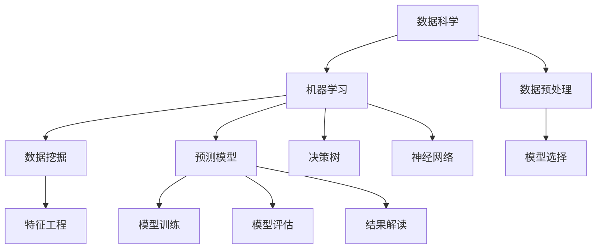

                 

# 理解洞察力：复杂世界中的导航仪

> 关键词：洞察力,复杂世界,导航仪,数据科学,机器学习,模型选择,数据分析,决策支持

## 1. 背景介绍

在当今这个信息爆炸、知识繁杂的时代，决策者面临的挑战已经从简单的数据查询和计算转变为深入的理解和洞察。洞察力（Insight），即在复杂系统中发现深层次关联、揭示潜在模式和预测未来趋势的能力，已经成为决策者最宝贵的资产之一。然而，洞察力的获取并非易事，尤其是在面对海量、多源、异构的数据时，决策者往往难以从中提取出有价值的洞见。

### 1.1 问题由来

洞察力的获取在各个领域中都是一项重要的工作，例如金融分析、市场预测、产品研发等。传统的数据分析方式依赖于专家经验，但这种方法在处理复杂问题时存在主观偏差、误判风险等缺点。随着技术的发展，基于机器学习的洞察力获取技术（即数据科学和人工智能）逐渐兴起，为决策者提供了一种更加客观、自动化的解决方案。

### 1.2 问题核心关键点

机器学习在洞察力获取中的应用，核心在于通过数据驱动的方式，自动识别和提取数据中的模式和关联，从而辅助决策者理解复杂世界。机器学习的核心关键点包括：

- 数据预处理：清洗、整合、归一化海量数据，确保数据的完整性和一致性。
- 模型选择：根据问题的特性选择合适的算法，如回归、分类、聚类等。
- 特征工程：从原始数据中提取出有信息量的特征，增加模型的预测能力。
- 模型训练：利用训练数据训练模型，使其学习到数据的内在结构。
- 模型评估：通过测试数据评估模型性能，调整模型参数以提升效果。
- 结果解读：将模型预测结果转化为可理解的洞察，辅助决策者做出合理决策。

## 2. 核心概念与联系

### 2.1 核心概念概述

为了更好地理解洞察力获取的机器学习应用，我们首先介绍几个核心概念：

- 数据科学：研究数据的获取、整理、分析和解释的学科，目标是发现数据中的模式和知识。
- 机器学习：利用数据训练算法模型，使其具备从数据中学习和推理的能力。
- 数据挖掘：在大型数据集中识别出有价值的信息和模式，如关联规则、聚类等。
- 预测模型：根据历史数据预测未来事件的概率分布，如回归模型、分类模型等。
- 决策树：一种树形结构的分类和回归模型，通过特征拆分实现数据分割。
- 神经网络：模拟人脑神经元连接模式，通过多层次的非线性变换实现复杂数据的表示和分类。

这些概念之间的逻辑关系可以通过以下Mermaid流程图来展示：



这个流程图展示了数据科学和机器学习的主要过程，每个步骤都涉及不同的技术和算法，最终形成可行的决策支持系统。

## 3. 核心算法原理 & 具体操作步骤

### 3.1 算法原理概述

洞察力获取的机器学习过程，本质上是利用训练好的模型对复杂数据集进行分析，并生成可理解的洞察。该过程包括以下几个关键步骤：

1. **数据预处理**：通过数据清洗、归一化、标准化等步骤，确保数据的质量和一致性，为后续分析提供可靠的基础。
2. **特征工程**：根据问题的特点，选择和构造有信息量的特征，提升模型的预测能力。
3. **模型训练**：利用训练数据训练模型，使其学习到数据的内在结构和规律。
4. **模型评估**：通过测试数据评估模型的性能，选择最优模型。
5. **结果解读**：将模型的预测结果转化为可理解的洞察，辅助决策。

### 3.2 算法步骤详解

以下将详细介绍机器学习洞察力获取的核心步骤及其操作流程：

**Step 1: 数据预处理**
- 收集和整合数据：确保数据的完整性和一致性，包括缺失值处理、异常值检测等。
- 数据归一化：将不同尺度的特征转换到同一范围内，便于模型训练。
- 数据采样：根据模型需求对数据进行随机采样或分层采样，确保训练样本的多样性。

**Step 2: 特征工程**
- 特征选择：选择对目标变量影响较大的特征，减少模型复杂度。
- 特征构造：利用数据生成新的特征，如时间特征、交互特征等。
- 特征编码：将类别型特征转换为数值型特征，便于模型处理。

**Step 3: 模型训练**
- 模型选择：根据问题的类型（如回归、分类、聚类等）选择适合的模型。
- 参数调优：使用交叉验证等方法调整模型参数，以获得最佳性能。
- 训练算法：选择合适的优化算法，如梯度下降、随机梯度下降等。

**Step 4: 模型评估**
- 划分数据集：将数据分为训练集和测试集。
- 评估指标：选择适合的评估指标，如准确率、召回率、F1分数等。
- 模型验证：在测试集上评估模型性能，选择最优模型。

**Step 5: 结果解读**
- 结果可视化：使用图表、热力图等手段展示模型的预测结果。
- 洞察生成：将模型预测结果转化为可理解的洞察，支持决策。
- 应用落地：将洞察应用于实际决策过程中，验证其有效性。

### 3.3 算法优缺点

机器学习在洞察力获取中的应用，具有以下优点：

1. **客观性**：机器学习通过数据驱动的方式进行洞察，减少了人为偏差，提高了决策的客观性。
2. **效率高**：机器学习可以自动化地处理大量数据，快速提取洞察。
3. **适应性强**：机器学习模型可以根据数据变化进行实时调整，适应不同的应用场景。

同时，该方法也存在一些局限性：

1. **数据质量依赖性高**：机器学习的效果很大程度上取决于数据的质量，数据不完整或不准确会影响模型性能。
2. **模型复杂性**：某些复杂的机器学习模型可能需要大量数据和高计算资源才能训练，增加了模型的复杂度。
3. **黑盒问题**：机器学习模型通常被认为是“黑盒”，难以解释其内部决策过程。
4. **鲁棒性问题**：机器学习模型对噪声数据和异常值敏感，需要额外的数据清洗和异常处理。

### 3.4 算法应用领域

机器学习在洞察力获取中的应用，已经广泛应用于以下几个领域：

1. **金融分析**：通过分析历史数据，预测股票市场趋势，辅助投资决策。
2. **市场预测**：利用消费者行为数据，预测市场需求变化，指导产品设计和销售策略。
3. **医疗诊断**：通过分析医疗影像和患者数据，辅助医生诊断疾病，提高诊断准确率。
4. **供应链管理**：利用销售和库存数据，预测需求和库存水平，优化供应链管理。
5. **风险管理**：通过分析历史风险数据，预测未来风险事件，制定风险管理策略。
6. **客户关系管理**：利用客户行为数据，分析客户需求和偏好，制定个性化营销策略。

## 4. 数学模型和公式 & 详细讲解 & 举例说明

### 4.1 数学模型构建

洞察力获取的机器学习过程，可以通过以下数学模型进行描述：

设训练数据集为 $\mathcal{D} = \{(x_i, y_i)\}_{i=1}^N$，其中 $x_i \in \mathcal{X}$ 为输入特征向量，$y_i \in \mathcal{Y}$ 为输出标签。机器学习模型 $f$ 的训练目标是最小化损失函数 $\mathcal{L}$，即：

$$
\min_{\theta} \mathcal{L}(f_\theta(x_i), y_i)
$$

其中 $f_\theta(x)$ 为模型在参数 $\theta$ 下的预测函数，$\mathcal{L}$ 为损失函数。常见的损失函数包括均方误差、交叉熵等。

### 4.2 公式推导过程

以下我们将以回归模型为例，推导其最小化均方误差的梯度下降算法：

设回归模型的损失函数为均方误差（MSE）：

$$
\mathcal{L}(y, \hat{y}) = \frac{1}{2N} \sum_{i=1}^N (y_i - \hat{y}_i)^2
$$

其中 $y_i$ 为真实标签，$\hat{y}_i$ 为模型预测值。

对 $f_\theta(x)$ 求导，得到梯度：

$$
\nabla_{\theta} \mathcal{L} = \frac{1}{N} \sum_{i=1}^N (y_i - \hat{y}_i) \nabla_{\theta} \hat{y}_i
$$

其中 $\nabla_{\theta} \hat{y}_i$ 为预测值的梯度，可以通过链式法则计算得到。

通过梯度下降算法，模型参数 $\theta$ 更新公式为：

$$
\theta \leftarrow \theta - \eta \nabla_{\theta} \mathcal{L}
$$

其中 $\eta$ 为学习率，控制模型参数的更新速度。

### 4.3 案例分析与讲解

**案例分析：**
假设我们要预测房价，已知历史房价数据和相应的影响因素（如面积、楼层、地理位置等），使用回归模型进行预测。

**步骤1: 数据预处理**
- 收集房价数据和影响因素数据，进行清洗和归一化处理。
- 将影响因素数据进行编码，如使用one-hot编码表示不同楼层。

**步骤2: 特征工程**
- 选择影响房价的关键因素，如面积、地理位置等。
- 构造新的特征，如面积-楼层交互特征。

**步骤3: 模型训练**
- 使用线性回归模型，选择适当的损失函数和优化算法。
- 使用交叉验证调整模型参数，选择最优模型。

**步骤4: 模型评估**
- 将数据集划分为训练集和测试集。
- 使用均方误差作为评估指标，评估模型性能。

**步骤5: 结果解读**
- 可视化模型的预测结果，如房价和面积的关系图。
- 根据模型预测结果，提供建议，如选择合适的楼层和面积以提高房价。

## 5. 项目实践：代码实例和详细解释说明

### 5.1 开发环境搭建

在进行机器学习洞察力获取的项目实践前，我们需要准备好开发环境。以下是使用Python进行Scikit-learn开发的环境配置流程：

1. 安装Anaconda：从官网下载并安装Anaconda，用于创建独立的Python环境。

2. 创建并激活虚拟环境：
```bash
conda create -n sklearn-env python=3.8 
conda activate sklearn-env
```

3. 安装Scikit-learn：
```bash
conda install scikit-learn
```

4. 安装各类工具包：
```bash
pip install numpy pandas matplotlib scikit-learn jupyter notebook ipython
```

完成上述步骤后，即可在`sklearn-env`环境中开始项目实践。

### 5.2 源代码详细实现

下面我们以房价预测任务为例，给出使用Scikit-learn对线性回归模型进行训练和预测的Python代码实现。

首先，定义数据处理函数：

```python
import pandas as pd
from sklearn.model_selection import train_test_split
from sklearn.preprocessing import StandardScaler, OneHotEncoder

def load_data(filename):
    data = pd.read_csv(filename)
    return data.drop(['price'], axis=1), data['price']

def preprocess_data(X, y):
    X = pd.get_dummies(X)
    X = pd.concat([X, X.drop(columns='area')], axis=1)
    X = pd.concat([X, X.drop(columns='location')], axis=1)
    scaler = StandardScaler()
    encoder = OneHotEncoder(sparse=False)
    X = scaler.fit_transform(X)
    X = encoder.fit_transform(X)
    return X, y

X_train, y_train = load_data('train.csv')
X_test, y_test = load_data('test.csv')

X_train, X_val, y_train, y_val = train_test_split(X_train, y_train, test_size=0.2, random_state=42)
X_train, X_val = preprocess_data(X_train, y_train)
X_test = preprocess_data(X_test, y_test)
```

然后，定义模型和训练函数：

```python
from sklearn.linear_model import LinearRegression
from sklearn.metrics import mean_squared_error

model = LinearRegression()
model.fit(X_train, y_train)

val_pred = model.predict(X_val)
test_pred = model.predict(X_test)

val_mse = mean_squared_error(y_val, val_pred)
test_mse = mean_squared_error(y_test, test_pred)
print(f'Validation MSE: {val_mse:.2f}, Test MSE: {test_mse:.2f}')
```

最后，评估模型性能：

```python
import matplotlib.pyplot as plt
plt.scatter(X_test[:, 0], y_test)
plt.plot(X_test[:, 0], test_pred, color='red')
plt.xlabel('Area')
plt.ylabel('Price')
plt.title('Housing Price Prediction')
plt.show()
```

以上就是使用Scikit-learn对线性回归模型进行房价预测任务训练和预测的完整代码实现。可以看到，Scikit-learn提供了丰富而易用的API，使得模型开发和训练变得非常简单。

### 5.3 代码解读与分析

让我们再详细解读一下关键代码的实现细节：

**数据预处理函数**：
- `load_data`函数：读取数据文件，分割出特征和标签。
- `preprocess_data`函数：将类别型特征进行独热编码，并标准化数值型特征。

**模型定义和训练函数**：
- 使用`LinearRegression`定义线性回归模型。
- 使用`fit`方法进行模型训练，使用训练集进行拟合。

**模型评估函数**：
- 使用`mean_squared_error`计算验证集和测试集上的均方误差。
- 使用Matplotlib可视化模型预测结果，展示面积与房价的关系。

**训练流程**：
- 在`preprocess_data`函数中对特征进行标准化和独热编码。
- 在`LinearRegression`模型中使用交叉验证调整模型参数。
- 在训练函数中使用均方误差作为评估指标，评估模型性能。
- 在评估函数中计算验证集和测试集上的均方误差，并可视化模型预测结果。

可以看出，Scikit-learn提供了完整的数据预处理、模型训练和评估流程，极大地方便了机器学习洞察力获取的实践。

## 6. 实际应用场景

### 6.1 智能推荐系统

基于机器学习的洞察力获取技术，可以广泛应用于智能推荐系统的构建。传统的推荐系统依赖于用户历史行为数据进行物品推荐，难以捕捉用户的兴趣变化和复杂偏好。通过机器学习，可以从用户的浏览、评分、评论等行为数据中提取有价值的信息，预测用户未来的行为和兴趣，从而实现更精准、个性化的推荐。

在实践中，可以收集用户的各种行为数据，利用这些数据训练预测模型，如协同过滤、内容推荐等，结合用户的实时行为数据进行动态调整，生成个性化的推荐结果。智能推荐系统可以通过机器学习洞察力获取技术，大幅提升推荐质量，增强用户体验，提升系统转化率。

### 6.2 异常检测系统

在金融、安全等领域，异常检测是一个重要的应用场景。传统的手工规则和统计方法难以应对复杂多变的异常模式。机器学习可以通过历史数据学习异常的特征分布，实时监测数据变化，识别出异常行为。

在实践中，可以利用机器学习模型训练异常检测系统，如基于聚类、分类、异常检测等方法，实时监控系统数据，检测异常行为，及时预警，防止潜在风险。异常检测系统可以通过机器学习洞察力获取技术，提升系统的安全性和可靠性，保障企业利益。

### 6.3 图像识别系统

图像识别是计算机视觉领域的重要应用，通过机器学习可以从图像中提取特征，进行分类、识别、检测等任务。在医疗、安防、工业等领域，图像识别系统具有广泛的应用价值。

在实践中，可以收集大量的图像数据，利用机器学习模型训练图像识别系统，如卷积神经网络（CNN）、残差网络（ResNet）等，进行目标检测、图像分割等任务。图像识别系统可以通过机器学习洞察力获取技术，提高识别精度，减少误检和漏检，提升系统的应用价值。

## 7. 工具和资源推荐

### 7.1 学习资源推荐

为了帮助开发者系统掌握洞察力获取的机器学习理论基础和实践技巧，这里推荐一些优质的学习资源：

1. 《机器学习实战》书籍：介绍了机器学习的基本概念和算法，提供了丰富的代码示例和案例分析。
2. Coursera《机器学习》课程：斯坦福大学的经典课程，涵盖了机器学习的核心内容，并提供了在线作业和实验平台。
3. Kaggle数据科学竞赛：通过参与各类竞赛，实践机器学习模型的构建和优化，积累实战经验。
4. Scikit-learn官方文档：提供了丰富的机器学习模型和算法，以及详细的API文档和使用示例。
5. TensorFlow官方文档：提供了强大的深度学习框架，支持多种模型和算法，并提供了丰富的学习资源。

通过这些资源的学习实践，相信你一定能够快速掌握机器学习洞察力获取的精髓，并用于解决实际的业务问题。

### 7.2 开发工具推荐

高效的开发离不开优秀的工具支持。以下是几款用于机器学习洞察力获取开发的常用工具：

1. Jupyter Notebook：开源的交互式笔记本环境，支持多种编程语言和库，便于代码编写和展示。
2. TensorBoard：TensorFlow配套的可视化工具，可以实时监测模型训练状态，提供丰富的图表呈现方式。
3. Weights & Biases：模型训练的实验跟踪工具，可以记录和可视化模型训练过程中的各项指标，方便对比和调优。
4. Matplotlib：Python的绘图库，支持多种图表和动画展示，便于数据可视化和结果展示。
5. Scikit-learn：提供了丰富的机器学习模型和算法，以及完整的API支持，是数据科学领域的重要工具。

合理利用这些工具，可以显著提升机器学习洞察力获取的开发效率，加快创新迭代的步伐。

### 7.3 相关论文推荐

机器学习在洞察力获取中的应用，得益于学界的持续研究。以下是几篇奠基性的相关论文，推荐阅读：

1. "Introduction to Statistical Learning" 书籍：介绍了机器学习的基本概念和算法，适合初学者阅读。
2. "Pattern Recognition and Machine Learning" 书籍：由机器学习专家Christopher Bishop所著，涵盖了机器学习的核心内容。
3. "Deep Learning" 书籍：由深度学习专家Ian Goodfellow等人所著，全面介绍了深度学习的原理和应用。
4. "An Introduction to Statistical Learning with Applications in R" 书籍：介绍了机器学习的统计方法和实际应用，适合数据科学家阅读。
5. "Machine Learning Yearning" 书籍：由深度学习专家Andrew Ng所著，介绍了机器学习的实践经验和工程挑战。

这些论文代表了大数据、机器学习和人工智能的研究方向，通过学习这些前沿成果，可以帮助研究者把握学科前进方向，激发更多的创新灵感。

## 8. 总结：未来发展趋势与挑战

### 8.1 研究成果总结

机器学习在洞察力获取中的应用，已经取得了一系列重要成果，涵盖了数据预处理、特征工程、模型训练、结果解读等多个方面。这些技术的应用，极大地提高了决策的客观性和准确性，帮助企业和组织更好地应对复杂多变的环境。

### 8.2 未来发展趋势

展望未来，机器学习在洞察力获取中的应用将呈现以下几个发展趋势：

1. **模型多样性**：未来的机器学习模型将更加多样化，包括基于深度学习的模型、强化学习模型、知识图谱等，满足不同应用场景的需求。
2. **数据融合**：未来的机器学习将更加注重数据融合，将多源异构数据进行联合分析和推理，提升洞察的全面性和准确性。
3. **实时性**：未来的机器学习系统将更加注重实时性，能够快速处理大量数据，并实时生成洞察，满足决策的实时需求。
4. **自动化**：未来的机器学习将更加自动化，通过自动化的数据预处理、特征工程、模型训练等流程，提升开发效率。
5. **可解释性**：未来的机器学习将更加注重可解释性，通过模型解释技术，提供可理解的洞察，增强决策的可信度和透明度。

### 8.3 面临的挑战

尽管机器学习在洞察力获取中的应用已经取得显著进展，但在实践中仍面临一些挑战：

1. **数据质量问题**：数据不完整、不规范、不准确等问题，是机器学习面临的主要挑战。如何提高数据质量，确保数据的一致性和完整性，是未来研究的重要方向。
2. **模型复杂性**：一些复杂的机器学习模型，如深度学习模型，需要大量的数据和计算资源，难以在大规模应用中推广。如何简化模型结构，提高计算效率，是未来研究的重要方向。
3. **可解释性问题**：机器学习模型通常是“黑盒”系统，难以解释其内部决策过程。如何提高模型的可解释性，增强决策的透明度和可信度，是未来研究的重要方向。
4. **安全性问题**：机器学习模型可能会学习到有害、误导性的知识，需要加入安全性和伦理约束，确保系统的可信度和安全性。
5. **鲁棒性问题**：机器学习模型对噪声数据和异常值敏感，需要加入鲁棒性约束，确保系统的稳定性和可靠性。

### 8.4 研究展望

为了应对这些挑战，未来的研究需要在以下几个方面进行深入探索：

1. **数据质量提升**：开发更高效的数据清洗和数据增强技术，提升数据质量。
2. **模型简化和优化**：研究轻量级、高效的机器学习模型，优化模型结构，提高计算效率。
3. **模型可解释性**：开发可解释的机器学习模型，通过模型解释技术，提供可理解的洞察，增强决策的可信度。
4. **安全性保障**：引入安全性和伦理约束，通过模型训练和评估，确保系统的可信度和安全性。
5. **鲁棒性提升**：研究鲁棒性机器学习模型，提升系统对噪声数据和异常值的鲁棒性。

总之，机器学习在洞察力获取中的应用具有广阔的前景，但也面临诸多挑战。只有在数据质量、模型结构、可解释性、安全性和鲁棒性等多个方面进行深入探索，才能真正实现机器学习在洞察力获取中的大规模应用。相信随着技术的不断进步，机器学习将为复杂世界中的决策者提供更加强大、可靠的洞察力支持。

## 9. 附录：常见问题与解答

**Q1：机器学习如何应用于洞察力获取？**

A: 机器学习通过数据驱动的方式，自动识别和提取数据中的模式和关联，从而辅助决策者理解复杂世界。具体而言，数据预处理、特征工程、模型训练、结果解读等步骤构成了完整的机器学习流程。通过机器学习，可以从大量数据中提取有价值的洞察，帮助决策者做出合理决策。

**Q2：机器学习模型如何提高数据质量？**

A: 数据质量是机器学习的重要基础，通过数据清洗、数据增强等技术可以提高数据质量。具体而言，数据清洗可以处理缺失值、异常值、重复值等数据问题，数据增强可以通过数据合成、数据扩充等方式提升数据多样性。

**Q3：机器学习模型如何提高模型复杂度？**

A: 模型的复杂度是机器学习的关键指标之一。通过简化模型结构、优化模型参数等方法可以降低模型复杂度。例如，使用轻量级模型如线性回归、决策树等，避免过度拟合；通过正则化、剪枝等方法减少模型参数，提高计算效率。

**Q4：机器学习模型如何提高可解释性？**

A: 可解释性是机器学习模型的重要特征之一，通过模型解释技术可以增强模型的可解释性。例如，使用LIME、SHAP等工具进行局部解释，通过特征重要性分析进行全局解释。

**Q5：机器学习模型如何提高安全性？**

A: 安全性是机器学习模型的重要保障，通过加入安全性和伦理约束可以提高模型的安全性。例如，在模型训练过程中加入数据隐私保护技术，防止数据泄露；在模型评估过程中加入安全性和伦理约束，确保模型的可信度和安全性。

---

作者：禅与计算机程序设计艺术 / Zen and the Art of Computer Programming

