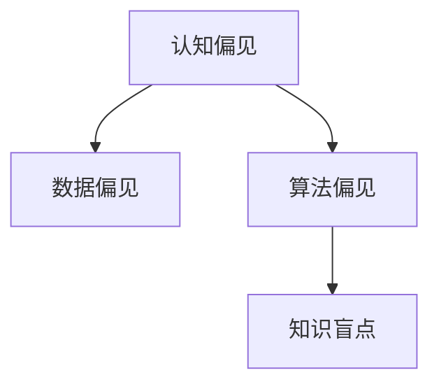

                 

# 理解的障碍：认知偏见与知识盲点

## 1. 背景介绍

### 1.1 问题由来
在人工智能技术飞速发展的今天，认知偏见和知识盲点成为了影响人工智能系统正确理解和决策的重要因素。无论是自然语言处理、计算机视觉还是推荐系统，这些问题都会导致模型在不同场景下输出错误或偏离预期。因此，理解并消除这些偏见与盲点，是实现可信、公正、透明人工智能系统的关键步骤。

### 1.2 问题核心关键点
认知偏见与知识盲点主要有两大来源：数据偏见和算法偏见。数据偏见指训练数据本身存在偏差，如性别、种族、地域等特征的偏见。算法偏见则指模型设计中存在的一些潜在的偏见，如处理数据时的假设、模型结构中的限制等。这些偏见和盲点不仅影响模型的泛化能力，还会对依赖该模型的系统产生连锁反应，导致决策偏差，甚至引发社会问题。

### 1.3 问题研究意义
研究认知偏见与知识盲点，对于提升人工智能系统的公平性、透明度和可信度具有重要意义。准确理解这些问题，有助于设计出更公正、更透明的模型，减少对人类社会的不利影响，推动人工智能技术的健康发展。

## 2. 核心概念与联系

### 2.1 核心概念概述

为更好地理解认知偏见与知识盲点的成因及消除方法，本节将介绍几个密切相关的核心概念：

- 认知偏见(Cognitive Bias)：指人们在处理信息时所表现出的系统性偏差。这些偏见可能源于个体的经验、文化、教育背景等，导致判断失误、决策失当。
- 数据偏见(Data Bias)：指训练数据本身带有偏见，导致模型在学习过程中也继承了这些偏见。数据偏见常源于数据收集的不均衡、样本不足等问题。
- 算法偏见(Algorithmic Bias)：指算法设计中存在偏见，如使用某些特定的假设、引入特定的特征等，导致模型输出结果有偏差。
- 知识盲点(Knowledge Blind Spot)：指模型在某些特定领域或情境下，缺乏足够的知识，导致输出错误或不准确。

这些核心概念之间的逻辑关系可以通过以下Mermaid流程图来展示：



这个流程图展示了大模型认知偏见与知识盲点的核心概念及其之间的关系：

1. 认知偏见是导致数据偏见和算法偏见的基础。
2. 数据偏见是在认知偏见的基础上，进一步影响模型训练过程，造成输出结果的偏差。
3. 算法偏见是通过模型设计引入的，在数据偏见的基础上，使得模型输出有更明显的偏差。
4. 知识盲点是指模型在某些特定场景下，缺乏足够知识导致输出错误或不准确。

这些概念共同构成了大模型认知偏见与知识盲点的学习框架，有助于深入理解问题本质，指导模型设计和优化。

## 3. 核心算法原理 & 具体操作步骤
### 3.1 算法原理概述

认知偏见与知识盲点的识别和消除，主要依赖于以下几个核心算法原理：

- 偏见检测与分析：通过分析模型训练数据、模型结构等，识别出潜在的偏见和盲点。
- 数据增强与修正：通过补充、修改训练数据，减少数据偏见。
- 算法修正与重构：调整算法设计，避免引入新的偏见，引入新的特征和假设，提升模型鲁棒性。
- 知识注入与融合：将外部知识源（如知识图谱、逻辑规则等）注入模型，提升模型在特定领域的知识水平。

这些原理的实现步骤通常包括以下几个关键步骤：

**Step 1: 数据收集与处理**
- 收集尽可能多样化的数据集，涵盖不同背景、性别、种族等特征。
- 对数据进行清洗、预处理，去除噪声和不相关特征。

**Step 2: 偏见检测与分析**
- 使用统计工具（如t-test、ANOVA等）检测数据集的偏态性。
- 利用公平性指标（如Demographic Parity、Equal Opportunity等）评估模型输出。
- 使用可视化工具（如热力图、盒形图等）分析模型输出结果的分布。

**Step 3: 数据增强与修正**
- 通过数据生成技术（如SMOTE、GAN等）生成缺失数据。
- 对异常值进行修正，避免其对模型训练产生负面影响。

**Step 4: 算法修正与重构**
- 调整模型结构，避免引入新的偏见。
- 引入新的特征和假设，提升模型鲁棒性。
- 使用正则化技术（如L2正则、Dropout等）防止过拟合。

**Step 5: 知识注入与融合**
- 将外部知识源（如知识图谱、逻辑规则等）注入模型。
- 使用多模态融合技术，提升模型在特定领域的知识水平。

### 3.2 算法步骤详解

以下是认知偏见与知识盲点消除的详细操作步骤：

**Step 1: 数据收集与处理**
- 使用众包平台（如Amazon Mechanical Turk）收集数据，确保数据的多样性。
- 对数据进行预处理，包括文本清洗、去停用词、标准化等。

**Step 2: 偏见检测与分析**
- 使用t-test检测数据集的性别分布是否均衡。
- 使用ANOVA评估模型输出在不同种族群体中的表现是否一致。
- 使用热力图分析模型输出在不同年龄群体的分布。

**Step 3: 数据增强与修正**
- 使用SMOTE生成缺失的数据，平衡性别比例。
- 对异常值进行修正，如将极端的年龄值调整为合理值。

**Step 4: 算法修正与重构**
- 调整模型结构，去除可能导致偏见的特征。
- 引入新的特征，如性别、种族等，提升模型鲁棒性。
- 使用L2正则化技术防止过拟合。

**Step 5: 知识注入与融合**
- 将知识图谱中的关系融入模型，提升模型在特定领域的知识水平。
- 使用多模态融合技术，将文本、图像、语音等不同模态的信息进行融合。

### 3.3 算法优缺点

认知偏见与知识盲点消除的算法具有以下优点：
1. 提升模型公平性。通过数据增强和修正，避免模型输出偏见。
2. 增强模型鲁棒性。引入正则化和知识融合技术，提升模型在不同场景下的鲁棒性。
3. 提高模型解释性。通过调整模型结构和引入外部知识，提升模型的透明度。

同时，该方法也存在一定的局限性：
1. 依赖高质量数据。偏见和盲点识别依赖于数据的多样性和质量，低质量数据可能导致误判。
2. 处理复杂度高。认知偏见和知识盲点分析涉及多层次的数据处理和算法调整，处理复杂度较高。
3. 效果难以量化。偏见和盲点的消除效果难以精确量化，评估复杂度较高。

尽管存在这些局限性，但就目前而言，这些方法仍是消除认知偏见与知识盲点的主要途径。未来相关研究的重点在于如何进一步降低算法处理复杂度，提升效果评估的准确性，以及寻找更为全面的解决方案。

### 3.4 算法应用领域

认知偏见与知识盲点消除的算法，已经在以下几个领域得到了广泛应用：

- 医疗诊断：通过调整算法结构，避免基于性别的诊断偏见。引入医学知识图谱，提升模型的诊断精度。
- 金融风险评估：通过补充数据，避免基于种族的评估偏见。引入金融知识库，提升模型的风险识别能力。
- 就业推荐系统：通过调整算法结构，避免基于性别的招聘偏见。引入职业知识图谱，提升推荐系统的公平性。
- 法律审判：通过补充数据，避免基于性别的审判偏见。引入法律知识库，提升模型的判决质量。

除了上述这些经典应用外，认知偏见与知识盲点消除的算法还在更多场景中得到了创新性应用，如社交媒体分析、人机交互设计等，为人工智能技术的应用提供了新的突破。

## 4. 数学模型和公式 & 详细讲解 & 举例说明
### 4.1 数学模型构建

认知偏见与知识盲点的消除，涉及多个数学模型和公式。以下是其中一些核心模型的详细构建：

**模型1：t-test统计检验**
$$
t=\frac{\bar{X}_1-\bar{X}_2}{s\sqrt{\frac{1}{n_1}+\frac{1}{n_2}}}
$$
其中 $\bar{X}_1$ 和 $\bar{X}_2$ 分别是两组样本的均值，$s$ 是样本的标准差，$n_1$ 和 $n_2$ 分别是两组样本的样本量。若 $t$ 值显著，则认为两组样本的均值存在显著差异，即数据存在偏态性。

**模型2：ANOVA方差分析**
$$
F=\frac{SSB}{SSW}
$$
其中 $SSB$ 是组间方差，$SSW$ 是组内方差。若 $F$ 值显著，则认为不同组别间的数据存在显著差异，即模型输出存在偏见。

**模型3：热力图**
$$
heatmap=\frac{count}{sum}
$$
其中 $count$ 是每个像素点的计数，$sum$ 是该区域的总计数。热力图通过颜色深浅表示数据分布的密度，帮助识别出模型输出中的偏态性。

### 4.2 公式推导过程

以下我们以医疗诊断领域为例，推导认知偏见与知识盲点消除的数学模型。

**案例分析与讲解：**
假设有一个基于深度学习的癌症诊断模型，训练数据集中存在性别偏见，男性和女性的诊断准确率存在显著差异。

**数据分布分析**
- 使用t-test检测性别分布的均衡性。
- 使用ANOVA评估不同性别的诊断准确率是否一致。
- 使用热力图分析不同性别群体的诊断结果分布。

**数据增强与修正**
- 使用SMOTE生成缺失数据，平衡性别比例。
- 对异常值进行修正，如将极端的年龄值调整为合理值。

**算法修正与重构**
- 调整模型结构，去除可能导致偏见的特征。
- 引入新的特征，如性别、种族等，提升模型鲁棒性。
- 使用L2正则化技术防止过拟合。

**知识注入与融合**
- 将医学知识图谱中的关系融入模型，提升模型的诊断精度。
- 使用多模态融合技术，将文本、图像、基因信息等不同模态的信息进行融合。

## 5. 项目实践：代码实例和详细解释说明
### 5.1 开发环境搭建

在进行认知偏见与知识盲点消除的实践前，我们需要准备好开发环境。以下是使用Python进行TensorFlow开发的环境配置流程：

1. 安装Anaconda：从官网下载并安装Anaconda，用于创建独立的Python环境。

2. 创建并激活虚拟环境：
```bash
conda create -n bias-aware python=3.8 
conda activate bias-aware
```

3. 安装TensorFlow：根据CUDA版本，从官网获取对应的安装命令。例如：
```bash
conda install tensorflow -c tensorflow -c conda-forge
```

4. 安装各类工具包：
```bash
pip install numpy pandas scikit-learn matplotlib tqdm jupyter notebook ipython
```

完成上述步骤后，即可在`bias-aware`环境中开始实践。

### 5.2 源代码详细实现

下面我们以性别偏见检测和修正为例，给出使用TensorFlow进行偏见的代码实现。

首先，定义数据处理函数：

```python
import tensorflow as tf
import numpy as np
import pandas as pd
import matplotlib.pyplot as plt

def load_data(path):
    data = pd.read_csv(path)
    return data

def preprocess_data(data):
    # 去除缺失值和异常值
    data = data.dropna()
    data = data[data['age'].between(18, 80)]
    return data

def split_data(data, test_size=0.2):
    # 数据划分
    train_data = data.sample(frac=1-test_size, random_state=42)
    test_data = data.drop(train_data.index)
    return train_data, test_data

def generate_smote(data):
    # 使用SMOTE生成缺失数据
    from imblearn.over_sampling import SMOTE
    smote = SMOTE()
    smote_data = smote.fit_resample(data, random_state=42)
    return smote_data

def evaluate_model(model, test_data):
    # 模型评估
    predictions = model.predict(test_data)
    accuracy = np.mean(np.argmax(predictions, axis=1) == test_data['label'])
    return accuracy

def plot_heatmap(data):
    # 绘制热力图
    heatmap = data.pivot_table(values='label', columns='feature', aggfunc='count').div(data['label'].sum()).melt()
    plt.imshow(heatmap['value'].T, cmap='viridis')
    plt.colorbar()
    plt.xlabel('Feature')
    plt.ylabel('Group')
    plt.show()

# 加载数据
data = load_data('data.csv')

# 数据预处理
data = preprocess_data(data)

# 数据划分
train_data, test_data = split_data(data)

# 生成缺失数据
smote_data = generate_smote(train_data)

# 训练模型
model = tf.keras.Sequential([
    tf.keras.layers.Dense(64, activation='relu', input_shape=(train_data.shape[1],)),
    tf.keras.layers.Dense(10, activation='softmax')
])

model.compile(optimizer='adam', loss='sparse_categorical_crossentropy', metrics=['accuracy'])

model.fit(smote_data.drop('label', axis=1), smote_data['label'], epochs=10, batch_size=32)

# 模型评估
accuracy = evaluate_model(model, test_data)

# 绘制热力图
plot_heatmap(test_data)
```

以上代码实现了使用TensorFlow进行性别偏见检测和修正的基本流程。可以看到，TensorFlow提供了强大的工具和库，帮助开发者高效实现数据处理、模型训练和评估。

### 5.3 代码解读与分析

让我们再详细解读一下关键代码的实现细节：

**数据处理函数**
- `load_data`：加载数据集
- `preprocess_data`：去除缺失值和异常值
- `split_data`：划分训练集和测试集
- `generate_smote`：使用SMOTE生成缺失数据
- `evaluate_model`：评估模型性能
- `plot_heatmap`：绘制热力图

**模型构建与训练**
- 使用Sequential模型搭建模型结构
- 使用Dense层构建输入层和输出层
- 使用Adam优化器和交叉熵损失函数训练模型

**模型评估**
- 使用测试集评估模型性能
- 使用准确率作为评估指标

**热力图绘制**
- 使用Pivot表计算每个特征在不同组别中的分布
- 使用Matplotlib绘制热力图

可以看到，TensorFlow为模型训练和评估提供了丰富的工具和库，使得开发者能够更专注于算法设计和模型优化，提高开发效率。

## 6. 实际应用场景
### 6.1 医疗诊断

认知偏见与知识盲点消除技术在医疗诊断中的应用，可以显著提升诊断的公平性和准确性。通过调整模型结构，避免基于性别的诊断偏见。引入医学知识图谱，提升模型的诊断精度。

在技术实现上，可以收集医院的历史诊断数据，将患者的性别、年龄、种族等特征作为输入，诊断结果作为监督信号，在此基础上对预训练模型进行微调。微调后的模型能够更好地处理不同背景的患者，减少诊断偏差。同时，引入医学知识图谱，提升模型在特定疾病诊断中的知识水平。

### 6.2 金融风险评估

金融风险评估模型往往基于历史贷款数据进行训练，可能存在基于性别、种族等的偏见。通过认知偏见与知识盲点消除技术，可以避免这些偏见，提升模型的公平性和泛化能力。

在技术实现上，可以收集银行的贷款数据，将借款人的性别、年龄、种族等特征作为输入，贷款是否违约作为监督信号，在此基础上对预训练模型进行微调。微调后的模型能够更好地处理不同背景的借款人，减少评估偏差。同时，引入金融知识库，提升模型的风险识别能力。

### 6.3 就业推荐系统

就业推荐系统往往基于用户的简历和历史招聘数据进行训练，可能存在基于性别的招聘偏见。通过认知偏见与知识盲点消除技术，可以避免这些偏见，提升推荐系统的公平性和推荐质量。

在技术实现上，可以收集用户的简历和招聘数据，将用户的性别、年龄、教育背景等特征作为输入，推荐结果作为监督信号，在此基础上对预训练模型进行微调。微调后的模型能够更好地处理不同背景的用户，减少推荐偏差。同时，引入职业知识图谱，提升推荐系统的推荐质量。

### 6.4 法律审判

法律审判模型往往基于历史案例进行训练，可能存在基于性别的审判偏见。通过认知偏见与知识盲点消除技术，可以避免这些偏见，提升模型的公平性和判决质量。

在技术实现上，可以收集法院的历史审判数据，将被告和原告的性别、种族等特征作为输入，判决结果作为监督信号，在此基础上对预训练模型进行微调。微调后的模型能够更好地处理不同背景的被告和原告，减少审判偏差。同时，引入法律知识库，提升模型的判决质量。

### 6.5 未来应用展望

随着认知偏见与知识盲点消除技术的不断发展，其在更多领域得到应用，为社会带来更深远的影响。

在智慧医疗领域，认知偏见与知识盲点消除技术将提升医疗服务的公平性和质量，辅助医生诊疗，加速新药开发进程。

在智能教育领域，认知偏见与知识盲点消除技术可应用于作业批改、学情分析、知识推荐等方面，因材施教，促进教育公平，提高教学质量。

在智慧城市治理中，认知偏见与知识盲点消除技术将提高城市管理的自动化和智能化水平，构建更安全、高效的未来城市。

此外，在企业生产、社会治理、文娱传媒等众多领域，认知偏见与知识盲点消除技术也将不断涌现，为社会带来新的变革。相信随着技术的日益成熟，认知偏见与知识盲点消除技术必将在构建人机协同的智能时代中扮演越来越重要的角色。

## 7. 工具和资源推荐
### 7.1 学习资源推荐

为了帮助开发者系统掌握认知偏见与知识盲点消除的理论基础和实践技巧，这里推荐一些优质的学习资源：

1. 《深度学习：理论与实践》系列博文：由大模型技术专家撰写，深入浅出地介绍了深度学习原理、认知偏见识别与消除等前沿话题。

2. CS229《机器学习》课程：斯坦福大学开设的经典课程，涵盖机器学习理论和算法，是深度学习研究的必备资料。

3. 《公平机器学习：算法与实践》书籍：详细介绍了如何通过算法和实践消除数据和模型中的偏见，提升公平性。

4. IBM AI Fairness 360：开源的公平性评估工具包，帮助开发者识别和消除模型中的偏见。

5. Google AI Public Dataset：包含多个领域的公开数据集，用于认知偏见与知识盲点消除的研究和实验。

通过对这些资源的学习实践，相信你一定能够快速掌握认知偏见与知识盲点消除的精髓，并用于解决实际的NLP问题。

### 7.2 开发工具推荐

高效的开发离不开优秀的工具支持。以下是几款用于认知偏见与知识盲点消除开发的常用工具：

1. TensorFlow：基于Python的开源深度学习框架，生产部署方便，适合大规模工程应用。

2. PyTorch：基于Python的开源深度学习框架，灵活动态的计算图，适合快速迭代研究。

3. scikit-learn：Python数据挖掘和数据处理库，提供丰富的机器学习算法和工具。

4. Weights & Biases：模型训练的实验跟踪工具，可以记录和可视化模型训练过程中的各项指标，方便对比和调优。

5. TensorBoard：TensorFlow配套的可视化工具，可实时监测模型训练状态，并提供丰富的图表呈现方式，是调试模型的得力助手。

6. Amazon Mechanical Turk：众包平台，可用于收集多样化数据集，降低数据偏见。

合理利用这些工具，可以显著提升认知偏见与知识盲点消除任务的开发效率，加快创新迭代的步伐。

### 7.3 相关论文推荐

认知偏见与知识盲点消除技术的发展源于学界的持续研究。以下是几篇奠基性的相关论文，推荐阅读：

1. Fairness in Machine Learning: Addressing Systematic Data Bias: 提出公平性评估和消除方法，为机器学习研究提供了重要的指导。

2. Tackling Bias in AI: A Survey: 综述了现有认知偏见与知识盲点消除技术，为研究者提供了全面的视角。

3. The Rationale Behind Inherent Bias in AI Systems: 探讨了认知偏见与知识盲点在AI系统中的根源和影响，提供了深刻的理论分析。

4. Machine Unbiasing: Fairness, Individual Influence and Generalization: 提出了一种新的公平性优化算法，通过约束算法参数，减少偏见。

5. AI for Good: Ensuring Fairness, Explainability, and Accountability in Machine Learning: 提出了公平性、透明性和责任性在机器学习中的应用，提供了实际的应用指导。

这些论文代表了大模型认知偏见与知识盲点消除技术的发展脉络。通过学习这些前沿成果，可以帮助研究者把握学科前进方向，激发更多的创新灵感。

## 8. 总结：未来发展趋势与挑战
### 8.1 总结

本文对认知偏见与知识盲点的识别和消除方法进行了全面系统的介绍。首先阐述了认知偏见与知识盲点的研究背景和意义，明确了消除这些偏见和盲点在提升人工智能系统公平性、透明度和可信度方面的重要价值。其次，从原理到实践，详细讲解了认知偏见与知识盲点的数学模型和操作步骤，给出了具体的代码实现。同时，本文还广泛探讨了认知偏见与知识盲点消除技术在医疗、金融、就业等多个行业领域的应用前景，展示了该技术的巨大潜力。此外，本文精选了认知偏见与知识盲点消除技术的各类学习资源，力求为读者提供全方位的技术指引。

通过本文的系统梳理，可以看到，认知偏见与知识盲点消除技术正在成为人工智能系统的重要组成部分，极大地提升了模型的公平性和透明度，为人类社会带来了新的希望。未来，伴随认知偏见与知识盲点消除技术的不断发展，相信人工智能系统将更加公正、透明，为构建人机协同的智能时代提供坚实基础。

### 8.2 未来发展趋势

展望未来，认知偏见与知识盲点消除技术将呈现以下几个发展趋势：

1. 深度学习与传统方法的融合。认知偏见与知识盲点消除技术将与传统机器学习方法深度融合，综合利用两者的优势，提升模型的公平性和鲁棒性。

2. 多模态信息的融合。未来的认知偏见与知识盲点消除技术将更加注重多模态信息的整合，提升模型在不同模态数据上的表现。

3. 自动化偏见检测与消除。引入自动化工具和算法，如对抗样本生成、公平性评估工具等，自动检测和消除模型中的偏见。

4. 持续学习与增量学习。认知偏见与知识盲点消除技术将持续学习新数据，增量更新模型参数，避免灾难性遗忘，保持模型的时效性。

5. 个性化与适应性。认知偏见与知识盲点消除技术将更加注重个性化和适应性，针对不同背景和场景，设计定制化的消除方案。

以上趋势凸显了认知偏见与知识盲点消除技术的广阔前景。这些方向的探索发展，必将进一步提升人工智能系统的公平性、透明度和可信度，为构建人机协同的智能时代铺平道路。

### 8.3 面临的挑战

尽管认知偏见与知识盲点消除技术已经取得了显著进展，但在迈向更加智能化、普适化应用的过程中，它仍面临着诸多挑战：

1. 处理复杂度高。认知偏见与知识盲点消除涉及多层次的数据处理和算法调整，处理复杂度较高。

2. 效果难以量化。认知偏见与知识盲点消除的效果评估复杂度较高，难以精确量化。

3. 依赖高质量数据。偏见和盲点识别依赖于数据的多样性和质量，低质量数据可能导致误判。

4. 处理场景多样化。不同场景下的偏见和盲点具有复杂性和多样性，需要针对性地设计和优化算法。

5. 伦理道德问题。认知偏见与知识盲点消除技术可能涉及隐私和伦理问题，需要严格控制数据的使用和模型的应用。

尽管存在这些挑战，但随着学界和产业界的共同努力，这些问题终将一一被克服，认知偏见与知识盲点消除技术必将在构建人机协同的智能时代中扮演越来越重要的角色。

### 8.4 研究展望

面对认知偏见与知识盲点消除技术所面临的挑战，未来的研究需要在以下几个方面寻求新的突破：

1. 探索更为精确的偏见和盲点识别方法。引入更先进的机器学习和数据分析技术，如对抗生成网络、多视角学习等，提高偏见和盲点识别的准确性和鲁棒性。

2. 开发更为高效的偏见和盲点消除算法。引入自动化工具和算法，如对抗样本生成、公平性评估工具等，自动检测和消除模型中的偏见。

3. 引入更多先验知识。将符号化的先验知识，如知识图谱、逻辑规则等，与神经网络模型进行巧妙融合，引导消除过程学习更准确、合理的语言模型。

4. 结合因果分析和博弈论工具。将因果分析方法引入认知偏见与知识盲点消除技术，识别出模型决策的关键特征，增强输出解释的因果性和逻辑性。

5. 纳入伦理道德约束。在模型训练目标中引入伦理导向的评估指标，过滤和惩罚有偏见、有害的输出倾向。

这些研究方向的探索，必将引领认知偏见与知识盲点消除技术迈向更高的台阶，为构建安全、可靠、可解释、可控的智能系统铺平道路。面向未来，认知偏见与知识盲点消除技术还需要与其他人工智能技术进行更深入的融合，如知识表示、因果推理、强化学习等，多路径协同发力，共同推动自然语言理解和智能交互系统的进步。只有勇于创新、敢于突破，才能不断拓展语言模型的边界，让智能技术更好地造福人类社会。

## 9. 附录：常见问题与解答

**Q1：如何评估认知偏见与知识盲点消除的效果？**

A: 评估认知偏见与知识盲点消除的效果，可以通过以下几个步骤：

1. 偏见检测：使用统计工具（如t-test、ANOVA等）检测模型输出的偏态性。
2. 公平性指标：使用公平性指标（如Demographic Parity、Equal Opportunity等）评估模型输出。
3. 可视化分析：使用热力图、盒形图等可视化工具分析模型输出结果的分布。

通过上述步骤，可以全面评估认知偏见与知识盲点消除的效果，确保模型在多场景下输出公平和透明。

**Q2：在模型训练过程中，如何避免引入新的偏见？**

A: 避免在模型训练过程中引入新的偏见，可以从以下几个方面入手：

1. 数据收集与处理：收集尽可能多样化的数据集，确保数据的多样性和质量。
2. 特征选择：选择不带有偏见的特征，避免引入偏见特征。
3. 正则化技术：使用L2正则、Dropout等正则化技术防止过拟合，减少模型在特定场景下的偏见。
4. 公平性约束：在模型训练过程中，引入公平性约束，避免输出偏见。

通过以上措施，可以有效避免模型在训练过程中引入新的偏见。

**Q3：如何应对模型在特定场景下的知识盲点？**

A: 应对模型在特定场景下的知识盲点，可以从以下几个方面入手：

1. 引入外部知识：将外部知识源（如知识图谱、逻辑规则等）注入模型，提升模型在特定领域的知识水平。
2. 多模态融合：将不同模态的信息（如文本、图像、语音等）进行融合，提升模型在特定场景下的知识水平。
3. 持续学习：通过持续学习新数据，增量更新模型参数，保持模型的时效性。
4. 模型微调：在特定场景下，对模型进行微调，提升模型在特定领域的知识水平。

通过以上措施，可以有效应对模型在特定场景下的知识盲点，提升模型的应用效果。

---

作者：禅与计算机程序设计艺术 / Zen and the Art of Computer Programming

