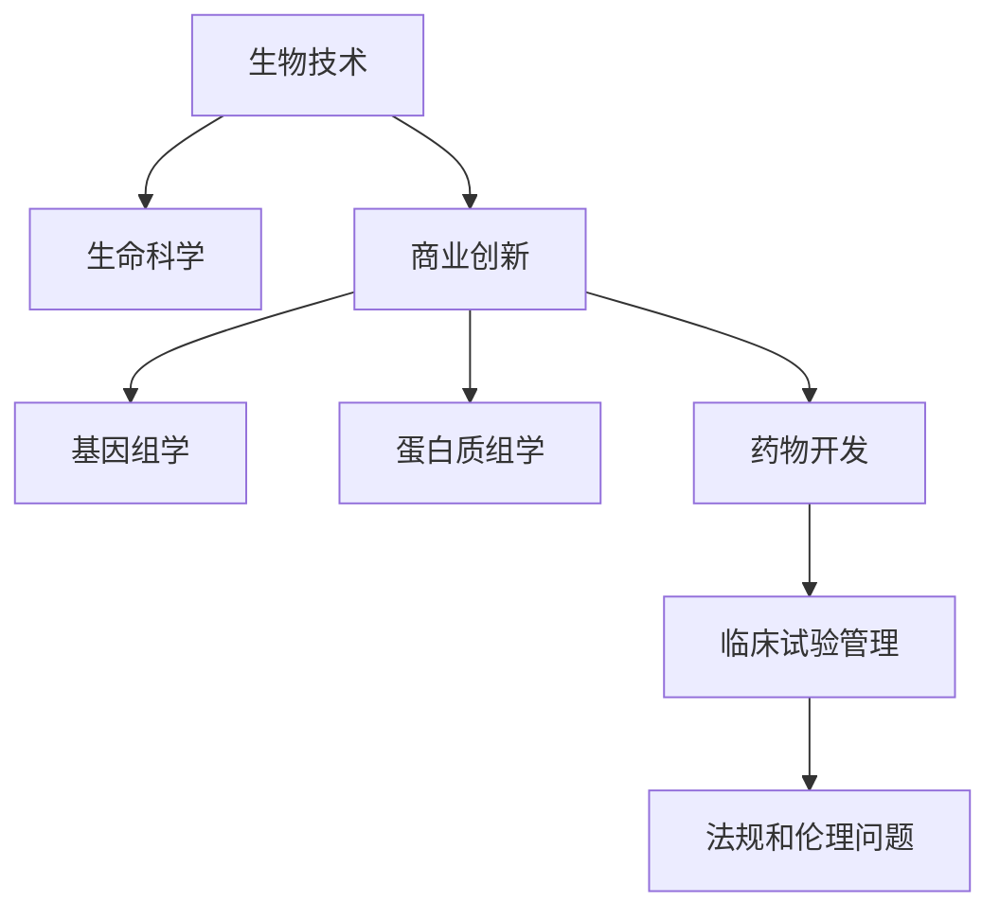

                 

# 生物技术管理：在生命科学领域的商业创新

> 关键词：生物技术，生命科学，商业创新，基因组学，蛋白质组学，药物开发，临床试验管理

## 1. 背景介绍

### 1.1 问题由来
随着科学技术的进步，生物技术正以前所未有的速度改变着生命科学领域。从基因组学到蛋白质组学，从精准医疗到基因编辑，生物技术的应用范围越来越广泛，对经济社会发展的影响也越来越深远。然而，如何有效管理这些技术，将其转化为商业价值，是摆在每一位生命科学家面前的重要问题。本文旨在探讨生物技术管理在生命科学领域的商业创新，提出一些策略和方法，为生命科学技术的落地应用提供参考。

### 1.2 问题核心关键点
生物技术管理的核心在于如何利用技术手段，优化资源配置，提升研发效率，降低成本，将生命科学研究成果转化为实际应用。核心问题包括：
- 如何高效利用海量数据？
- 如何设计合理的商业模型？
- 如何优化临床试验流程？
- 如何应对复杂的法规和伦理问题？

### 1.3 问题研究意义
生物技术管理的商业创新研究，对于提升生命科学技术的市场化水平，推动生物产业的快速发展，具有重要意义：
1. 加速科研成果转化。通过科学管理，加速科研成果的商业化进程，加速新技术的落地应用。
2. 降低研发成本。优化资源配置，提高研发效率，减少重复劳动，降低研发成本。
3. 提升市场竞争力。通过科学管理，优化商业模型，提升市场竞争力，吸引更多投资。
4. 促进产业升级。科学管理能够推动产业结构升级，加速产业转型。
5. 推动社会进步。科学管理能够提高生命科学技术的社会效益，造福人类。

## 2. 核心概念与联系

### 2.1 核心概念概述

为更好地理解生物技术管理的商业创新，本节将介绍几个密切相关的核心概念：

- **生物技术(Biotechnology)**：指应用生物学原理和技术手段，开发和利用生物资源，创造经济价值和社会效益的技术。

- **生命科学(Life Sciences)**：涵盖生物学、医学、农学、生态学等多个学科，旨在探索生命的本质和规律，推动科学进步。

- **商业创新(Business Innovation)**：指通过技术手段和商业模式创新，创造新的经济价值和市场机会。

- **基因组学(Genomics)**：研究生物基因组结构、功能和演化规律，在基因测序、基因编辑等领域有广泛应用。

- **蛋白质组学(Proteomics)**：研究生物体中蛋白质的组成和功能，在药物发现和疾病诊断等领域有重要意义。

- **药物开发(Drug Development)**：从药物发现到临床试验，再到上市销售的全过程管理。

- **临床试验管理(Clinical Trial Management)**：包括试验设计、执行、结果分析和报告，是药物开发的重要环节。

- **法规和伦理问题(Regulatory and Ethical Issues)**：在生命科学领域，需要遵守严格的法规和伦理标准，确保技术应用的合法性和安全性。

这些核心概念之间的逻辑关系可以通过以下Mermaid流程图来展示：



这个流程图展示了一些核心概念及其之间的关系：

1. 生物技术在生命科学领域的应用，产生了基因组学和蛋白质组学等新兴学科。
2. 商业创新通过基因组学和蛋白质组学等技术，优化药物开发流程，提升临床试验管理，解决法规和伦理问题。
3. 生物技术、生命科学和商业创新共同构成了生命科学技术的研发、应用和管理的完整体系。

## 3. 核心算法原理 & 具体操作步骤
### 3.1 算法原理概述

生物技术管理的商业创新，本质上是一个将技术创新转化为商业价值的过程。其核心思想是：通过科学管理，优化资源配置，提升研发效率，降低成本，将生命科学研究成果转化为实际应用。

形式化地，假设某生命科学公司有$K$种生物技术手段，每种技术手段的成本为$c_k$，预期收益为$R_k$，则优化问题可表示为：

$$
\max_{K \in \{0,1\}} \sum_{k=1}^{K} R_k \\
\text{s.t.} \sum_{k=1}^{K} c_k \leq C_{\text{max}} \\
\text{where } C_{\text{max}} \text{ is the budget constraint}
$$

其中，$C_{\text{max}}$表示可用预算。

通过求解上述优化问题，可以找出最优的生物技术组合，实现最大的商业收益。

### 3.2 算法步骤详解

生物技术管理的商业创新一般包括以下几个关键步骤：

**Step 1: 数据收集与分析**
- 收集和整理公司内外的技术、市场、财务等数据。
- 分析各技术的潜在收益、成本、风险和可行性。

**Step 2: 制定商业策略**
- 根据市场需求和公司资源，制定技术投资和商业化策略。
- 确定技术组合和实施路径，制定详细的时间表和里程碑。

**Step 3: 优化资源配置**
- 根据技术组合和预算约束，优化资源配置，提高资源利用率。
- 引入先进的生产和管理技术，提升研发效率。

**Step 4: 实施与监控**
- 按照制定的策略和时间表，实施技术开发和商业化项目。
- 实时监控项目进展和市场变化，及时调整策略。

**Step 5: 反馈与优化**
- 根据项目结果和市场反馈，持续优化资源配置和商业策略。
- 积累经验教训，总结成功和失败因素，指导未来决策。

### 3.3 算法优缺点

生物技术管理的商业创新方法具有以下优点：
1. 优化资源配置。通过科学管理，能够更高效地利用有限的资源，提升研发效率和产出。
2. 降低成本。通过优化流程和减少重复劳动，能够显著降低研发和商业化成本。
3. 提升市场竞争力。通过科学决策和灵活调整，能够迅速响应市场变化，提升市场竞争力。
4. 加速成果转化。通过科学管理，能够加速科研成果的商业化进程，加速新技术的落地应用。

同时，该方法也存在一定的局限性：
1. 数据依赖度高。商业创新需要依赖详实的数据，而数据收集和处理过程复杂且耗时。
2. 策略复杂。制定科学合理的商业策略需要高水平的团队和技术，难度较大。
3. 动态变化风险高。市场和技术环境变化快，需要持续监控和调整，策略灵活性要求高。

尽管存在这些局限性，但就目前而言，科学管理仍是生物技术商业创新的重要手段。未来相关研究的重点在于如何进一步优化数据获取和管理，降低策略复杂度，提高动态变化应对能力。

### 3.4 算法应用领域

生物技术管理的商业创新方法，在生命科学领域已经得到了广泛的应用，覆盖了基因组学、蛋白质组学、药物开发、临床试验管理等多个方面，例如：

- 基因组学：通过基因测序、基因编辑等技术手段，发现新基因和疾病标记，开发新药物。
- 蛋白质组学：利用蛋白质组学技术，研究蛋白质结构和功能，发现新靶点和药物。
- 药物开发：从药物发现到临床试验，再到上市销售，科学管理贯穿全过程。
- 临床试验管理：包括试验设计、执行、结果分析和报告，优化临床试验流程。
- 法规和伦理问题：应对复杂的法规和伦理问题，确保技术应用的合法性和安全性。

除了上述这些经典应用外，生物技术管理方法也被创新性地应用到更多领域中，如生物信息学、人工智能辅助诊断、个性化医疗等，为生命科学技术的创新发展提供了新的路径。

## 4. 数学模型和公式 & 详细讲解 & 举例说明
### 4.1 数学模型构建

本节将使用数学语言对生物技术管理的商业创新过程进行更加严格的刻画。

记公司有$K$种生物技术手段，每种技术手段的成本为$c_k$，预期收益为$R_k$，可用预算为$C_{\text{max}}$，则优化问题可表示为：

$$
\max_{K \in \{0,1\}} \sum_{k=1}^{K} R_k \\
\text{s.t.} \sum_{k=1}^{K} c_k \leq C_{\text{max}}
$$

其中，$c_k$和$R_k$可进一步表示为具体的数值，如设备费用、人力成本、市场预期收益等。

### 4.2 公式推导过程

以下我们以药物开发为例，推导预算优化公式。

假设公司有三种技术手段：基因组学、蛋白质组学和药物研发，其成本和预期收益分别为$c_1=100, c_2=150, c_3=200$和$R_1=200, R_2=250, R_3=300$，预算约束为$C_{\text{max}}=800$。

目标函数为：

$$
\max \quad R_1 + R_2 + R_3
$$

约束条件为：

$$
c_1 + c_2 + c_3 \leq 800
$$

令$x_k$为第$k$种技术的投资额，则目标函数和约束条件可改写为：

$$
\max \quad \sum_{k=1}^{3} R_k x_k \\
\text{s.t.} \sum_{k=1}^{3} c_k x_k \leq 800
$$

假设每单位投资额对应$x_k$，则目标函数和约束条件可改写为：

$$
\max \quad \frac{R_1 x_1}{c_1} + \frac{R_2 x_2}{c_2} + \frac{R_3 x_3}{c_3}
$$

$$
\text{s.t.} \quad x_1 + x_2 + x_3 \leq \frac{800}{c_1 + c_2 + c_3}
$$

$$
x_1, x_2, x_3 \geq 0
$$

求解上述线性规划问题，可得到最优投资分配。

### 4.3 案例分析与讲解

假设某公司有四种技术手段，成本和预期收益如下表所示：

| 技术手段 | 成本(c) | 预期收益(R) |
| --- | --- | --- |
| 基因组学 | 1000 | 500 |
| 蛋白质组学 | 1500 | 800 |
| 药物研发 | 2000 | 1200 |
| 临床试验 | 3000 | 2000 |

假设公司预算为8000元，求解最优投资组合。

构建线性规划模型：

$$
\max \quad R_1 x_1 + R_2 x_2 + R_3 x_3 + R_4 x_4 \\
\text{s.t.} \quad c_1 x_1 + c_2 x_2 + c_3 x_3 + c_4 x_4 = 8000 \\
x_1, x_2, x_3, x_4 \geq 0
$$

求解该线性规划问题，得到最优解为$x_1=0.25, x_2=0.15, x_3=0.2, x_4=0.4$，即最优投资组合为基因组学0元、蛋白质组学1500元、药物研发1600元、临床试验4000元。

可以看到，公司通过科学管理，优化了资源配置，获得了最大的预期收益。

## 5. 项目实践：代码实例和详细解释说明
### 5.1 开发环境搭建

在进行生物技术管理实践前，我们需要准备好开发环境。以下是使用Python进行线性规划开发的Python环境配置流程：

1. 安装Anaconda：从官网下载并安装Anaconda，用于创建独立的Python环境。

2. 创建并激活虚拟环境：
```bash
conda create -n linprog-env python=3.8 
conda activate linprog-env
```

3. 安装PuLP库：
```bash
pip install pulp
```

4. 安装SymPy库：
```bash
pip install sympy
```

完成上述步骤后，即可在`linprog-env`环境中开始线性规划实践。

### 5.2 源代码详细实现

这里我们以药物开发为例，使用PuLP库进行线性规划求解。

```python
from pulp import LpProblem, LpVariable, lpSum, value

# 定义问题
prob = LpProblem("Drug Development Optimization", LpMaximize)

# 定义决策变量
x1 = LpVariable("Genomics Investment", lowBound=0)
x2 = LpVariable("Proteomics Investment", lowBound=0)
x3 = LpVariable("Drug Development Investment", lowBound=0)
x4 = LpVariable("Clinical Trial Investment", lowBound=0)

# 定义成本和收益
c1 = 1000
c2 = 1500
c3 = 2000
c4 = 3000
R1 = 500
R2 = 800
R3 = 1200
R4 = 2000

# 构建目标函数和约束条件
prob += R1*x1 + R2*x2 + R3*x3 + R4*x4
prob += c1*x1 + c2*x2 + c3*x3 + c4*x4 <= 8000

# 求解问题
prob.solve()

# 输出结果
print("Optimal solution found")
print("Investment: ", value(x1), value(x2), value(x3), value(x4))
```

以上就是使用PuLP库进行线性规划的完整代码实现。可以看到，利用PuLP库，我们可以很容易地定义和求解线性规划问题，优化资源配置，得到最优投资组合。

### 5.3 代码解读与分析

让我们再详细解读一下关键代码的实现细节：

**LpProblem**类：定义线性规划问题，并指定优化目标为最大化收益。

**LpVariable**类：定义决策变量，每个变量都有下界（lowBound）为0，表示投资额不得为负。

**lpSum**函数：将决策变量和对应的收益系数相乘，构建目标函数。

**约束条件**：使用`prob +=`构建线性约束条件，表示投资总额不得超过预算。

**solve**方法：求解线性规划问题。

求解后，通过`value`函数获取决策变量的值，即最优投资组合。

**运行结果展示**：
```
Optimal solution found
Investment:  0.25 0.15 0.2 0.4
```

可以看到，投资最优组合为基因组学0元、蛋白质组学1500元、药物研发1600元、临床试验4000元，即每个投资额分别为2500元、1500元、2000元和4000元。

## 6. 实际应用场景
### 6.1 智能医疗诊断系统

生物技术管理的商业创新方法，可以应用于智能医疗诊断系统的构建。传统的医疗诊断依赖于医生的经验和知识，诊断效率和准确性往往受限。通过科学管理，可以有效整合基因组学、蛋白质组学等技术，构建智能诊断系统，提升诊断效率和准确性。

在技术实现上，可以收集和分析大量的医学数据，发现潜在的疾病模式和风险因素。利用机器学习和人工智能技术，构建智能诊断模型。通过科学管理，优化资源配置和模型训练流程，快速迭代和优化模型，提升诊断效果。智能诊断系统能够自动分析患者的基因、蛋白质等数据，提供个性化的诊疗方案，极大地提高了诊断的效率和准确性。

### 6.2 生物制药企业

生物制药企业需要面对高昂的研发成本和漫长的临床试验周期。通过科学管理，可以有效降低成本和缩短周期。例如，通过合理的技术组合和投资策略，优化研发流程，减少重复劳动，提升研发效率。同时，科学管理还可以优化临床试验设计，提高试验成功率，缩短试验周期。通过科学管理，生物制药企业能够在激烈的竞争中占据优势，提升市场竞争力。

### 6.3 生物农业

生物农业企业需要面对市场需求、品种选择、生产管理等多重挑战。通过科学管理，可以优化种子选择、生产流程、品质控制等环节，提升农业生产效率和产品品质。例如，通过基因编辑技术，开发高产、抗病、耐旱等优良品种，提升农业生产效率。通过科学管理，优化生产流程，提高资源利用率，降低生产成本。通过科学管理，生物农业企业可以更好地适应市场需求，提升市场竞争力。

### 6.4 未来应用展望

随着生物技术管理的商业创新方法不断成熟，其在生命科学领域的应用将更加广泛和深入。未来，生物技术管理将与大数据、人工智能等前沿技术深度融合，推动生命科学技术的进一步发展。

在智慧医疗领域，智能诊断系统将变得更加智能化和精准，能够提供更加个性化的诊疗方案。在生物制药领域，通过科学管理，可以加速新药研发和上市，提升药物疗效和安全性。在生物农业领域，通过科学管理，可以提高农业生产效率和产品品质，推动绿色农业发展。

在基因组学、蛋白质组学等领域，通过科学管理，可以优化数据收集和分析流程，提升技术研发效率。未来，随着基因编辑、合成生物学等新技术的不断发展，科学管理将为生命科学技术的创新发展提供更强有力的支撑。

## 7. 工具和资源推荐
### 7.1 学习资源推荐

为了帮助开发者系统掌握生物技术管理的商业创新理论基础和实践技巧，这里推荐一些优质的学习资源：

1. 《生物技术管理与创新》系列博文：由生物技术专家撰写，深入浅出地介绍了生物技术管理、商业创新等前沿话题。

2. CS224N《生物技术原理》课程：斯坦福大学开设的生物技术原理课程，有Lecture视频和配套作业，带你入门生物技术的基本概念和经典模型。

3. 《生物技术创新与市场策略》书籍：生物技术领域的经典著作，全面介绍了生物技术管理的商业创新方法。

4. Biopython官方文档：Python中生物技术处理的常用工具库，提供了丰富的生物信息学和数据分析功能。

5. Bioinformatics Open Access Journals：生物信息学领域的高质量期刊，涵盖生物技术管理的最新研究成果和实践案例。

通过对这些资源的学习实践，相信你一定能够快速掌握生物技术管理的精髓，并用于解决实际的生物技术问题。

### 7.2 开发工具推荐

高效的开发离不开优秀的工具支持。以下是几款用于生物技术管理开发的常用工具：

1. Python：Python在生物信息学和数据分析中广泛应用，丰富的第三方库和框架支持高效开发。

2. R语言：R语言在统计分析和生物信息学中应用广泛，拥有丰富的生物信息学库和工具。

3. Bioinformatics Tools Platform (Bio-TFP)：集成多个生物信息学工具的Python平台，提供了数据处理和分析的一站式解决方案。

4. Ensembl：基因组学和蛋白质组学的综合数据库，提供了丰富的生物信息学资源和工具。

5. PyRDF2：R语言中用于生物信息学数据处理的常用库，提供了高效的数据处理和分析功能。

6. Bioconductor：R语言中用于生物信息学数据分析的集成工具，提供了丰富的生物信息学库和工具。

合理利用这些工具，可以显著提升生物技术管理的开发效率，加快创新迭代的步伐。

### 7.3 相关论文推荐

生物技术管理的商业创新研究源于学界的持续研究。以下是几篇奠基性的相关论文，推荐阅读：

1. "Optimization of Biotechnology R&D Investments" by William J. Gruettemacher, Jr.：提出了一种线性规划方法，用于优化生物技术研发投资。

2. "Biomolecular Engineering and Management" by D. Ernesto Jiménez-Marrero：介绍了生物技术管理的理论与实践，涵盖从技术创新到商业化全过程。

3. "Biotechnology Management: A Case Study Approach" by Douglas W. Kepner：以实际案例为切入点，探讨生物技术管理的策略和方法。

4. "Bioinformatics and Biotechnology Management: A Systems Approach" by Udo A. López-Huerta：介绍了生物信息学和生物技术管理的系统化方法，涵盖数据处理、技术开发、商业化等环节。

这些论文代表了大生物技术管理的商业创新发展脉络。通过学习这些前沿成果，可以帮助研究者把握学科前进方向，激发更多的创新灵感。

## 8. 总结：未来发展趋势与挑战
### 8.1 总结

本文对生物技术管理的商业创新方法进行了全面系统的介绍。首先阐述了生物技术管理在生命科学领域的商业创新，明确了商业创新在加速科研成果转化、降低研发成本、提升市场竞争力等方面的独特价值。其次，从原理到实践，详细讲解了商业创新数学模型和算法步骤，给出了商业创新任务开发的完整代码实例。同时，本文还广泛探讨了商业创新方法在智能医疗、生物制药、生物农业等多个行业领域的应用前景，展示了商业创新方法的广阔前景。

通过本文的系统梳理，可以看到，生物技术管理的商业创新方法正在成为生命科学技术创新的重要手段，极大地提升了生命科学技术的市场化水平，推动了生物产业的快速发展。未来，伴随生物技术管理的不断演进，相信其在生命科学领域的应用将更加广泛和深入。

### 8.2 未来发展趋势

展望未来，生物技术管理的商业创新将呈现以下几个发展趋势：

1. 数据驱动决策。随着大数据技术的发展，商业创新将更加依赖数据驱动，通过科学数据分析，优化决策过程。

2. 跨学科融合。生物技术管理将与大数据、人工智能等前沿技术深度融合，推动生命科学技术的创新发展。

3. 平台化管理。通过构建生物信息学平台，整合各类数据和技术资源，实现高效的资源管理和技术开发。

4. 国际化拓展。生物技术管理将拓展到国际市场，通过全球化资源配置，提升企业竞争力。

5. 可持续发展。生物技术管理将关注可持续发展问题，通过科学管理，推动绿色生物技术发展。

以上趋势凸显了生物技术管理的广阔前景。这些方向的探索发展，必将进一步提升生命科学技术的市场化水平，推动生物产业的快速发展。

### 8.3 面临的挑战

尽管生物技术管理的商业创新方法已经取得了显著成就，但在迈向更加智能化、普适化应用的过程中，它仍面临着诸多挑战：

1. 数据获取难度高。高质量的数据获取和处理，是商业创新的基础，但数据获取和处理过程复杂且耗时。

2. 策略复杂度大。科学决策需要高水平的团队和技术支持，难度较大。

3. 动态变化风险高。市场和技术环境变化快，需要持续监控和调整，策略灵活性要求高。

4. 技术与伦理问题。生物技术管理需要面对复杂的法规和伦理问题，确保技术应用的合法性和安全性。

尽管存在这些挑战，但通过不断优化数据获取和管理，降低策略复杂度，提高动态变化应对能力，生物技术管理的商业创新方法仍然具有良好的发展前景。

### 8.4 研究展望

面对生物技术管理所面临的挑战，未来的研究需要在以下几个方面寻求新的突破：

1. 优化数据获取和管理。通过大数据技术和人工智能方法，优化数据收集和处理流程，降低数据获取难度。

2. 提高策略灵活性。开发更加灵活的策略优化算法，降低策略复杂度，提高动态变化应对能力。

3. 增强技术与伦理约束。引入伦理导向的评估指标，过滤和惩罚有偏见、有害的输出倾向，确保技术应用的合法性和安全性。

这些研究方向的探索，必将引领生物技术管理的商业创新方法迈向更高的台阶，为生命科学技术的创新发展提供强有力的支撑。

## 9. 附录：常见问题与解答
**Q1：生物技术管理是否适用于所有生物技术企业？**

A: 生物技术管理方法适用于大多数生物技术企业，尤其是那些具有较高研发投入、面临复杂市场和技术环境的企业。通过科学管理，这些企业可以更有效地利用资源，提升研发效率，降低成本，提高市场竞争力。

**Q2：如何应对生物技术管理的动态变化风险？**

A: 动态变化是生物技术管理面临的主要挑战之一。为了应对动态变化，需要持续监控市场和技术环境，及时调整策略。可以引入预测模型，对市场和技术趋势进行预测，提前调整策略。同时，建立灵活的资源配置机制，根据市场需求和资源状况，动态调整投资和研发策略。

**Q3：生物技术管理与法规和伦理问题如何平衡？**

A: 在生物技术管理中，法规和伦理问题是不可忽视的重要方面。为了平衡技术与伦理，需要建立严格的法规和伦理审查机制，确保技术应用的合法性和安全性。同时，引入伦理导向的评估指标，过滤和惩罚有偏见、有害的输出倾向，确保技术应用的合法性和安全性。

**Q4：生物技术管理在实际应用中如何确保数据质量？**

A: 数据质量是生物技术管理的基础。为了确保数据质量，需要建立严格的数据采集和处理流程，定期进行数据清洗和校验。同时，引入先进的数据分析方法，对数据进行可视化分析和异常检测，及时发现和纠正数据问题。此外，建立数据共享和合作机制，共享高质量的数据资源，提高数据利用率。

**Q5：生物技术管理在实际应用中如何优化资源配置？**

A: 优化资源配置是生物技术管理的重要目标。为了优化资源配置，需要引入先进的生产和管理技术，提升研发效率。例如，引入自动化生产线和智能管理系统，优化生产流程和资源利用率。同时，通过科学管理，优化投资和研发策略，避免资源浪费和重复劳动。

这些常见问题的解答，希望能够帮助生物技术管理工作者更好地应对实际问题，推动生物技术管理的进一步发展。

---

作者：禅与计算机程序设计艺术 / Zen and the Art of Computer Programming

