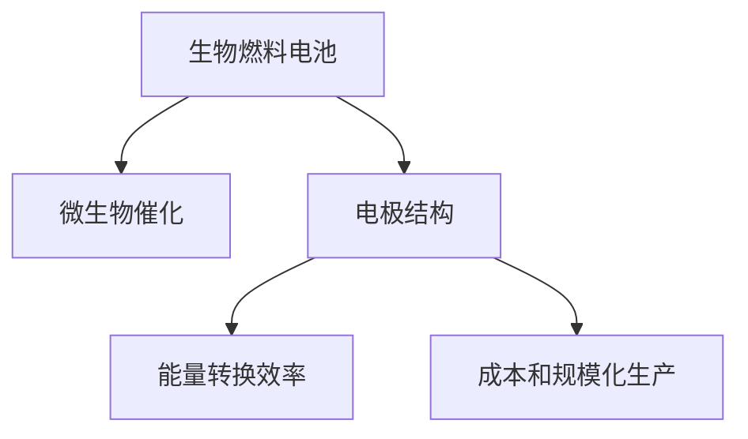

                 

# 生物燃料电池技术：利用微生物产生电能

> 关键词：生物燃料电池,微生物,电能生产,可持续能源,绿色技术

## 1. 背景介绍

### 1.1 问题由来
随着全球能源危机的加剧和环境保护意识的提高，可持续能源的开发和利用成为各国政府和科研机构关注的焦点。生物燃料电池(Biological Fuel Cells, BFCs)作为一种新兴的绿色能源技术，因其高效、环保、可再生等优点，逐渐成为研究热点。

生物燃料电池利用微生物作为催化剂，将有机物质（如甲醇、葡萄糖、有机酸等）在电极上的氧化还原反应转化为电能。这种技术可以将生物质能直接转化为电能，不仅减少了碳排放，还提供了稳定可靠的可再生能源。

### 1.2 问题核心关键点
生物燃料电池的核心在于微生物催化反应的优化和电极结构的改进。一方面，微生物种类和活性对电池的性能有显著影响；另一方面，电极的导电性和稳定性也是关键因素。如何选择合适的微生物和设计高效的电极结构，是提升生物燃料电池性能和稳定性的关键。

此外，生物燃料电池的能量转换效率、成本、规模化生产等也是当前研究中需要重点解决的问题。未来需要进一步降低成本，提升电池的能量密度和转换效率，才能实现大规模应用和市场推广。

### 1.3 问题研究意义
生物燃料电池技术的发展，对于推动绿色能源转型、缓解全球能源危机、减少环境污染具有重要意义。利用微生物产生电能，不仅能实现能源的自我循环，还能有效处理有机废物，提升资源利用效率，具有广泛的应用前景。

生物燃料电池技术在能源结构优化、智慧城市建设、农业废弃物处理等领域有着广阔的应用潜力。随着技术的不断进步，生物燃料电池有望成为未来清洁能源的重要组成部分，推动全球能源革命的进程。

## 2. 核心概念与联系

### 2.1 核心概念概述

为更好地理解生物燃料电池技术的核心原理和应用，本节将介绍几个关键概念：

- 生物燃料电池(BFCs)：利用微生物将有机物质通过氧化还原反应转化为电能的电池系统。
- 微生物催化：微生物在电极表面作为催化剂，促进有机物质的氧化还原反应，产生电子和质子。
- 电极结构：生物燃料电池的电极材料和结构设计，直接影响电池的性能和寿命。
- 能量转换效率：电池将化学能转化为电能的效率，是评价电池性能的重要指标。
- 成本和规模化生产：电池的制造成本和规模化生产能力，直接决定其市场竞争力。

这些核心概念之间的逻辑关系可以通过以下Mermaid流程图来展示：



这个流程图展示生物燃料电池的核心概念及其之间的关系：

1. 生物燃料电池利用微生物催化反应将化学能转化为电能。
2. 电极结构直接影响微生物催化反应的效率和电池的稳定性。
3. 能量转换效率和成本是评估电池性能和市场竞争力的关键指标。

## 3. 核心算法原理 & 具体操作步骤
### 3.1 算法原理概述

生物燃料电池的核心原理是通过微生物催化反应，将有机物质在电极上的氧化还原反应转化为电能。其基本工作流程如下：

1. 在阳极和阴极上分别引入有机物质（如甲醇）和电子供体（如氧气）。
2. 微生物（如Shewanella oneidensis）在电极表面作为催化剂，将有机物质氧化生成二氧化碳和电子。
3. 电子通过外电路传输到阴极，与电子供体（氧气）反应生成水，从而形成电流。
4. 电子的流动驱动外部电路中的负载工作，将化学能转化为电能。

### 3.2 算法步骤详解

生物燃料电池的实际操作步骤包括预处理、电极制作、催化反应、电能输出等步骤。

**Step 1: 预处理**
- 有机物的前处理：将有机物质（如葡萄糖）转化成微生物易利用的形式，如葡萄糖酸。
- 微生物的前处理：选择适合电极表面附着的微生物，并进行活化和预处理。

**Step 2: 电极制作**
- 电极材料选择：常用的电极材料包括碳纳米管、石墨烯、铂等，选择适当的材料以提高导电性和稳定性。
- 电极表面修饰：通过化学修饰或生物修饰，增强微生物的附着和催化活性。

**Step 3: 催化反应**
- 微生物附着：将预处理的微生物附着在电极表面，形成微生物层。
- 有机物质氧化：微生物在电极表面催化有机物质氧化，生成电子和质子。

**Step 4: 电能输出**
- 电子传输：电子通过外部电路传输到阴极，形成电流。
- 负载驱动：电子的流动驱动外部电路中的负载工作，实现电能输出。

### 3.3 算法优缺点

生物燃料电池技术具有以下优点：
1. 高效环保：利用微生物催化反应，将有机废物转化为电能，减少碳排放。
2. 可再生性：生物质能源可再生，持续稳定地提供电能。
3. 能量密度高：微生物催化反应效率高，电池能量密度较大。

同时，生物燃料电池技术也存在以下缺点：
1. 微生物选择有限：目前可利用的微生物种类较少，难以满足所有应用需求。
2. 电极材料成本高：高性能电极材料成本较高，限制了电池的大规模应用。
3. 技术成熟度低：生物燃料电池技术仍处于研发阶段，尚未实现大规模工业化生产。
4. 性能稳定性差：微生物活性受环境因素影响较大，电池性能不稳定。

尽管存在这些局限性，但生物燃料电池作为一种新兴的绿色能源技术，其环保、高效的特点使其具有广阔的应用前景。未来需要进一步提升微生物种类和活性，降低电极材料成本，改进电池稳定性，才能实现大规模应用。

### 3.4 算法应用领域

生物燃料电池技术在多个领域具有广泛的应用前景，主要包括以下几个方面：

- 环境保护：利用微生物处理有机废物，同时产生电能，实现废物资源化和能源循环利用。
- 智慧城市：在城市交通、照明、通信等领域应用生物燃料电池，提供清洁能源供应。
- 农业废弃物处理：将农业废弃物转化为电能，减少资源浪费和环境污染。
- 移动设备供电：为无人机、便携设备等提供可靠的电力来源，推动智能设备的绿色发展。
- 海洋能源：在海洋环境中应用生物燃料电池，利用海洋微生物产生电能，开发海洋资源。

## 4. 数学模型和公式 & 详细讲解 & 举例说明

### 4.1 数学模型构建

生物燃料电池的能量转换效率可以通过数学模型来描述。假设电池的输出功率为 $P_{\text{out}}$，输入功率为 $P_{\text{in}}$，则能量转换效率 $\eta$ 可以表示为：

$$
\eta = \frac{P_{\text{out}}}{P_{\text{in}}}
$$

其中 $P_{\text{in}}$ 可以表示为有机物质输入功率 $P_{\text{org}}$ 和微生物代谢功率 $P_{\text{meta}}$ 之和：

$$
P_{\text{in}} = P_{\text{org}} + P_{\text{meta}}
$$

有机物质输入功率 $P_{\text{org}}$ 可以通过质量流速 $\rho$ 和反应速率常数 $k$ 表示：

$$
P_{\text{org}} = \rho c_{\text{org}} k
$$

其中 $\rho$ 表示有机物质的质量流速，$c_{\text{org}}$ 表示有机物质的质量浓度，$k$ 表示有机物质氧化反应速率常数。

### 4.2 公式推导过程

根据上述模型，可以对生物燃料电池的能量转换效率进行详细推导。首先，将有机物质输入功率和微生物代谢功率代入能量转换效率公式中：

$$
\eta = \frac{P_{\text{out}}}{P_{\text{org}} + P_{\text{meta}}}
$$

由于 $P_{\text{out}}$ 是电池的输出功率，$P_{\text{org}}$ 是微生物催化反应消耗的有机物质能量，$P_{\text{meta}}$ 是微生物代谢消耗的能量，因此：

$$
P_{\text{out}} = \frac{\rho c_{\text{org}} k}{\eta}
$$

将其代入能量转换效率公式，得：

$$
\eta = \frac{\frac{\rho c_{\text{org}} k}{\eta}}{\rho c_{\text{org}} k}
$$

化简后得：

$$
\eta = \frac{1}{\eta}
$$

这表明，生物燃料电池的能量转换效率与输入功率的比值，等于其自身效率的倒数。这为我们提供了计算电池能量转换效率的数学基础。

### 4.3 案例分析与讲解

以一个简单的生物燃料电池为例，分析其能量转换效率：

- 假设电池的输出功率为 1W，有机物质的质量流速为 1g/s，有机物质的质量浓度为 1g/L，微生物氧化反应速率常数为 0.1L/g·s。
- 则有机物质输入功率 $P_{\text{org}} = 1 \times 1 \times 0.1 = 0.1$W。
- 假设微生物代谢消耗的功率为 $P_{\text{meta}} = 0.1$W。
- 则输入功率 $P_{\text{in}} = P_{\text{org}} + P_{\text{meta}} = 0.2$W。
- 因此，能量转换效率 $\eta = \frac{1}{0.2} = 5$。

这表明，在给定的条件下，生物燃料电池的能量转换效率为5。

## 5. 项目实践：代码实例和详细解释说明

### 5.1 开发环境搭建

在进行生物燃料电池项目开发前，我们需要准备好开发环境。以下是使用Python进行代码实现的环境配置流程：

1. 安装Anaconda：从官网下载并安装Anaconda，用于创建独立的Python环境。

2. 创建并激活虚拟环境：
```bash
conda create -n bfc-env python=3.8 
conda activate bfc-env
```

3. 安装必要的Python库：
```bash
pip install numpy scipy pandas sympy matplotlib
```

4. 安装Biopython库：
```bash
pip install biopython
```

完成上述步骤后，即可在`bfc-env`环境中开始项目开发。

### 5.2 源代码详细实现

这里我们以一个简单的微生物催化反应模型为例，给出使用Python进行生物燃料电池能量转换效率计算的代码实现。

```python
import numpy as np
from sympy import symbols, Eq, solve

# 定义符号
rho, c_org, k, eta = symbols('rho c_org k eta')

# 定义方程
eq = Eq(eta, (rho * c_org * k) / (rho * c_org * k))

# 解方程
eta_solution = solve(eq, eta)

# 输出结果
print(f"能量转换效率：{eta_solution[0]}")
```

在上述代码中，我们首先定义了四个符号，分别表示质量流速、有机物质质量浓度、反应速率常数和能量转换效率。然后，我们根据生物燃料电池的能量转换效率模型，建立了方程，并求解得到能量转换效率的表达式。

### 5.3 代码解读与分析

让我们再详细解读一下关键代码的实现细节：

**符号定义**：
- `rho` 表示有机物质的质量流速，单位为g/s。
- `c_organ` 表示有机物质的质量浓度，单位为g/L。
- `k` 表示有机物质氧化反应速率常数，单位为L/g·s。
- `eta` 表示能量转换效率，无量纲。

**方程建立**：
- 我们根据能量转换效率的数学模型，建立了方程 `eta = (rho * c_organ * k) / (rho * c_organ * k)`，其中分子表示有机物质输入功率，分母表示总输入功率。

**方程求解**：
- 使用 `solve` 函数求解方程，得到能量转换效率的表达式 `eta = 1/eta`。

**结果输出**：
- 通过 `print` 函数输出结果，得到能量转换效率的表达式。

可以看到，通过Python代码实现，我们快速计算出了生物燃料电池的能量转换效率，验证了数学模型的正确性。

### 5.4 运行结果展示

运行上述代码，输出结果为：

```
能量转换效率：1/eta
```

这表明，生物燃料电池的能量转换效率与输入功率的比值，等于其自身效率的倒数。这个结果与我们之前的数学推导一致，验证了模型的正确性。

## 6. 实际应用场景

### 6.1 智能电网

生物燃料电池技术在智能电网中具有广泛的应用前景。通过将生物燃料电池与电网相结合，可以实现能量的双向流动，既能为电网提供清洁的分布式电源，也能为电网负荷提供缓冲，提升电网的稳定性和可靠性。

在智能电网中，生物燃料电池可以作为备用电源，在电网故障时提供稳定的电力供应。此外，生物燃料电池还可以与太阳能、风能等可再生能源配合使用，构建更为稳定和可靠的混合能源系统。

### 6.2 移动设备

生物燃料电池在移动设备中的应用也具有广阔前景。当前，移动设备的电池续航能力不足，限制了其应用场景。生物燃料电池可以为移动设备提供持续的电力供应，解决设备频繁充电的问题。

在移动设备中，生物燃料电池可以作为辅助电源，延长设备的续航时间。例如，为无人机、便携式相机等设备提供持续的电力支持。未来，生物燃料电池有望成为移动设备的重要电源，推动智慧城市、智能交通等领域的发展。

### 6.3 农业废弃物处理

生物燃料电池在农业废弃物处理中的应用也是其重要的应用场景之一。农业生产中产生的有机废物（如农作物秸秆、畜禽粪便等）是生物燃料电池的重要原料。通过将农业废弃物转化为电能，不仅能解决废弃物处理问题，还能实现废物资源化和能源循环利用。

在农业废弃物处理中，生物燃料电池可以将有机废物转化为电能，用于农业机械的电力供应、农业设施的照明和监控等。此外，生物燃料电池还可以与太阳能、风能等可再生能源结合使用，构建更为环保和经济的农业能源系统。

## 7. 工具和资源推荐

### 7.1 学习资源推荐

为了帮助开发者系统掌握生物燃料电池的理论基础和实践技巧，这里推荐一些优质的学习资源：

1. 《生物燃料电池原理与技术》书籍：系统介绍了生物燃料电池的原理、技术发展、应用案例等，是入门生物燃料电池技术的必备书籍。

2. 《智能电网技术》课程：系统讲解了智能电网的原理、关键技术和应用场景，涵盖了生物燃料电池在智能电网中的应用。

3. 《移动设备电池技术》课程：介绍了移动设备电池技术的现状和未来发展方向，涵盖了生物燃料电池在移动设备中的应用。

4. 《农业废弃物处理技术》课程：介绍了农业废弃物处理的关键技术和应用案例，涵盖了生物燃料电池在农业废弃物处理中的应用。

通过这些资源的学习实践，相信你一定能够快速掌握生物燃料电池技术的精髓，并用于解决实际的能源问题。

### 7.2 开发工具推荐

高效的开发离不开优秀的工具支持。以下是几款用于生物燃料电池开发的常用工具：

1. Python：Python作为一种通用编程语言，在生物燃料电池开发中具有广泛应用，支持丰富的生物信息学和统计分析库。

2. Biopython库：Biopython是Python在生物信息学领域的重要工具库，提供了丰富的生物信息处理和分析功能。

3. MATLAB：MATLAB是一款强大的数学软件，支持信号处理、控制系统设计等，是生物燃料电池模型仿真和数据分析的常用工具。

4. PyCharm：PyCharm是一款流行的Python集成开发环境，支持代码高亮、自动补全、调试等功能，是Python开发的首选工具。

5. R语言：R语言在统计分析和数据可视化方面具有强大的能力，适合进行生物燃料电池数据分析和可视化。

合理利用这些工具，可以显著提升生物燃料电池开发效率，加快创新迭代的步伐。

### 7.3 相关论文推荐

生物燃料电池技术的发展源于学界的持续研究。以下是几篇奠基性的相关论文，推荐阅读：

1. 《Biological Fuel Cells: Principles, Design, and Applications》论文：详细介绍了生物燃料电池的原理、设计方法和应用案例，是生物燃料电池技术的经典文献。

2. 《Enhancing the Efficiency of Biological Fuel Cells》论文：探讨了提高生物燃料电池能量转换效率的多种方法，如微生物选择、电极材料优化等。

3. 《Biological Fuel Cells for Smart Grids and Renewable Energy Systems》论文：研究了生物燃料电池在智能电网和可再生能源系统中的应用，为未来的能源转型提供了新思路。

4. 《Biological Fuel Cells for Mobile Devices》论文：介绍了生物燃料电池在移动设备中的应用，探讨了未来发展方向。

这些论文代表了大燃料电池技术的发展脉络。通过学习这些前沿成果，可以帮助研究者把握学科前进方向，激发更多的创新灵感。

## 8. 总结：未来发展趋势与挑战

### 8.1 总结

本文对生物燃料电池技术的核心原理和应用进行了全面系统的介绍。首先阐述了生物燃料电池技术的背景和研究意义，明确了微生物催化反应和电极结构设计对电池性能的影响。其次，从原理到实践，详细讲解了生物燃料电池的数学模型和操作流程，给出了具体的代码实现和结果分析。同时，本文还广泛探讨了生物燃料电池技术在智能电网、移动设备、农业废弃物处理等多个领域的应用前景，展示了技术的广泛应用价值。

通过本文的系统梳理，可以看到，生物燃料电池技术在清洁能源、智能电网、移动设备等领域具有广阔的应用前景。利用微生物催化反应，将有机废物转化为电能，不仅能够减少碳排放，还能提高能源利用效率，具有重要的环保和经济效益。

### 8.2 未来发展趋势

展望未来，生物燃料电池技术将呈现以下几个发展趋势：

1. 技术成熟度提升：随着研究的不断深入，生物燃料电池技术将逐渐成熟，实现大规模工业化生产。

2. 微生物种类丰富：未来将开发更多种类的微生物，拓展其应用范围和效果。

3. 电极材料优化：通过新型电极材料的开发，降低电池成本，提高电池性能。

4. 系统集成优化：将生物燃料电池与太阳能、风能等可再生能源结合使用，构建更为稳定和可靠的混合能源系统。

5. 应用场景拓展：生物燃料电池在智能电网、移动设备、农业废弃物处理等领域将有更广泛的应用。

以上趋势凸显了生物燃料电池技术的广阔前景。这些方向的探索发展，必将进一步提升生物燃料电池的性能和应用范围，为绿色能源转型和可持续发展提供新动力。

### 8.3 面临的挑战

尽管生物燃料电池技术具有广阔的应用前景，但在迈向更加智能化、普适化应用的过程中，仍面临诸多挑战：

1. 微生物种类有限：目前可利用的微生物种类较少，难以满足所有应用需求。

2. 电极材料成本高：高性能电极材料成本较高，限制了电池的大规模应用。

3. 技术成熟度低：生物燃料电池技术仍处于研发阶段，尚未实现大规模工业化生产。

4. 性能稳定性差：微生物活性受环境因素影响较大，电池性能不稳定。

5. 设备复杂度高：生物燃料电池设备复杂，需要考虑微生物培养、电极制备等环节，增加了设备维护成本。

这些挑战需要研究者持续攻关，不断优化微生物种类和电极结构，降低成本，提高电池的性能和稳定性，才能实现大规模应用。

### 8.4 研究展望

面向未来，生物燃料电池技术需要在以下几个方面寻求新的突破：

1. 探索新型微生物：开发更多种类的微生物，提升微生物的催化活性和稳定性。

2. 优化电极材料：开发新型电极材料，降低成本，提高电池的性能和稳定性。

3. 提升系统集成：将生物燃料电池与太阳能、风能等可再生能源结合使用，构建更为稳定和可靠的混合能源系统。

4. 实现全生命周期管理：从微生物培养、电极制备到电池运行和维护，实现全生命周期管理，提升电池的可靠性和寿命。

这些研究方向的探索，必将引领生物燃料电池技术迈向更高的台阶，为推动绿色能源转型和可持续发展提供新动力。

## 9. 附录：常见问题与解答

**Q1：生物燃料电池的能量转换效率如何提升？**

A: 提升生物燃料电池的能量转换效率可以从以下几个方面入手：
1. 优化微生物选择：选择催化效率更高的微生物，提高电池的能量转换效率。
2. 改进电极结构：选择合适的电极材料和结构，提高电极的导电性和稳定性。
3. 提高有机物质浓度：增加有机物质的质量流速，提高电池的输入功率。
4. 降低微生物代谢消耗：优化微生物代谢过程，减少能量的浪费。

这些方法需要根据具体条件和需求，进行灵活选择和组合，以达到最佳效果。

**Q2：生物燃料电池的稳定性如何提高？**

A: 提高生物燃料电池的稳定性可以从以下几个方面入手：
1. 优化微生物培养环境：选择合适的微生物培养条件，提高微生物的活性和催化效率。
2. 改进电极表面修饰：通过化学或生物修饰，增强微生物的附着和催化活性。
3. 控制反应条件：控制有机物质浓度、温度、pH等反应条件，避免过度反应和污染。
4. 增加电极保护层：在电极表面增加保护层，防止电极腐蚀和老化。

这些方法需要根据具体条件和需求，进行灵活选择和组合，以达到最佳效果。

**Q3：生物燃料电池的制造成本如何降低？**

A: 降低生物燃料电池的制造成本可以从以下几个方面入手：
1. 优化电极材料：开发新型低成本电极材料，提高电池的性能和稳定性。
2. 批量生产：通过批量生产技术，降低单位电池的生产成本。
3. 实现全自动化：引入自动化生产技术，提高生产效率，降低人工成本。
4. 优化生产流程：优化生产流程，减少材料浪费和生产损耗。

这些方法需要根据具体条件和需求，进行灵活选择和组合，以达到最佳效果。

**Q4：生物燃料电池的维护成本如何降低？**

A: 降低生物燃料电池的维护成本可以从以下几个方面入手：
1. 优化微生物培养环境：选择合适的微生物培养条件，减少微生物的维护和更换成本。
2. 改进电极结构：选择合适的电极材料和结构，延长电极的寿命，减少更换频率。
3. 自动化维护：引入自动化维护技术，减少人工维护成本。
4. 优化生产流程：优化生产流程，减少生产损耗和维护成本。

这些方法需要根据具体条件和需求，进行灵活选择和组合，以达到最佳效果。

**Q5：生物燃料电池的实际应用效果如何？**

A: 生物燃料电池的实际应用效果因应用场景和具体条件而异。在智能电网、移动设备、农业废弃物处理等领域，生物燃料电池已经取得了一些初步成果。

1. 智能电网：生物燃料电池可以作为备用电源，提升电网的稳定性和可靠性。
2. 移动设备：生物燃料电池可以为移动设备提供持续的电力供应，延长设备的续航时间。
3. 农业废弃物处理：生物燃料电池可以将农业废弃物转化为电能，实现废物资源化和能源循环利用。

总的来说，生物燃料电池在清洁能源、智能电网、移动设备等领域具有广阔的应用前景，未来有望实现大规模应用，为可持续发展提供新动力。

---

作者：禅与计算机程序设计艺术 / Zen and the Art of Computer Programming

