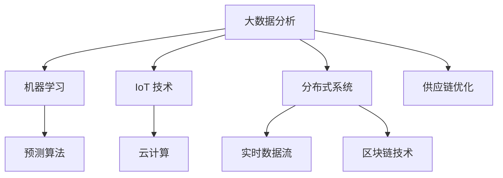

                 

# 生鲜电商创业：打造高效供应链

## 1. 背景介绍

### 1.1 问题由来

随着互联网和移动设备的普及，生鲜电商行业得到了迅猛发展。在线上平台购买生鲜产品不仅便利，而且可以享受比传统线下超市更优惠的价格。但与此同时，生鲜电商也面临着供应链、物流配送、用户体验等诸多挑战。其中，构建高效稳定的供应链是生鲜电商成功的关键。

在实际运营中，生鲜电商的供应链系统往往需要兼顾成本、效率和灵活性，同时要应对价格波动、市场需求变化等多变因素的干扰。因此，传统的手工管理和调优方式难以满足现代电商业务的要求，亟需引入先进的数字化技术来提升供应链管理的效率和智能化水平。

### 1.2 问题核心关键点

打造高效供应链的核心关键点包括：

- **数据驱动**：利用大数据分析，对供应链各环节进行全面监控和优化。
- **智能化决策**：应用机器学习和预测算法，提升供应链的响应速度和决策质量。
- **实时追踪**：通过物联网(IoT)技术，实现对物流和仓储的全流程实时追踪和监控。
- **协同运作**：集成供应商、物流、仓储等多个环节，实现供应链各环节的紧密协作和信息共享。
- **弹性管理**：根据实时数据和预测结果，灵活调整供应链策略，应对市场变化。
- **风险管理**：利用预测模型和异常检测算法，提前识别和预防供应链风险。

## 2. 核心概念与联系

### 2.1 核心概念概述

构建生鲜电商高效供应链涉及多个关键概念：

- **大数据分析**：通过收集和处理大量历史和实时数据，发现供应链的规律和趋势。
- **机器学习**：利用统计学方法，训练模型进行预测、分类和推荐。
- **预测算法**：如时间序列预测、回归分析等，用于预测未来供应链需求。
- **物联网(IoT)**：通过传感器、RFID等技术，实现对物流和仓储的实时追踪。
- **云计算**：提供强大的计算资源和存储能力，支撑数据处理和模型训练。
- **分布式系统**：通过微服务架构，实现供应链各环节的灵活调度和信息共享。
- **实时数据流**：集成订单、库存、物流等多个数据流，实现供应链各环节的实时同步。
- **区块链技术**：保障供应链各环节的数据安全和透明性。
- **供应链优化**：使用优化算法，求解供应链调度、库存控制等问题。

这些概念之间的联系和交互关系可以通过以下Mermaid流程图来展示：



这个流程图展示了各个概念之间的逻辑关系：

1. 大数据分析：收集和处理供应链数据，为其他概念提供数据基础。
2. 机器学习：利用数据训练预测模型，支持实时决策。
3. 预测算法：通过时间序列预测、回归分析等，进行需求和库存预测。
4. IoT 技术：实现物流和仓储的实时追踪和监控。
5. 云计算：提供计算和存储资源，支撑大数据分析和模型训练。
6. 分布式系统：实现供应链各环节的灵活调度和信息共享。
7. 实时数据流：集成订单、库存、物流等多个数据流，实现实时同步。
8. 区块链技术：保障数据安全透明，提升供应链的信任度。
9. 供应链优化：通过优化算法，提升供应链的整体效率和稳定性。

这些概念共同构成了生鲜电商高效供应链的底层架构，使得供应链管理更高效、更透明、更安全。

## 3. 核心算法原理 & 具体操作步骤
### 3.1 算法原理概述

构建高效供应链的核心算法原理主要基于数据驱动和智能化决策。具体来说，可以概括为以下几个步骤：

1. **数据采集与处理**：通过物联网设备、订单系统、物流系统等，实时采集供应链各环节的数据。
2. **数据分析与挖掘**：使用大数据分析技术，对供应链数据进行清洗、分析和挖掘，提取关键信息。
3. **模型训练与预测**：基于历史和实时数据，训练各种机器学习模型，用于需求预测、库存优化、路径规划等。
4. **实时监控与控制**：通过实时数据流，实现对供应链各环节的监控和控制，及时调整供应链策略。
5. **优化算法与调度**：使用优化算法，对供应链的调度、库存控制等问题进行求解，提升供应链效率。
6. **协同作业与信息共享**：集成供应链各环节，实现信息共享和协同作业，提高整体效率。
7. **风险管理与预警**：利用异常检测算法，识别供应链风险，提前采取应对措施。

### 3.2 算法步骤详解

以下是构建生鲜电商高效供应链的具体操作步骤：

**Step 1: 数据采集与处理**

- **收集数据**：通过物联网设备、订单系统、物流系统等，实时采集供应链各环节的数据，如订单量、库存量、物流状态等。
- **数据清洗**：对采集到的数据进行清洗和预处理，去除异常值和噪声，保证数据质量。
- **数据集成**：将不同来源的数据集成到一个统一的数据平台上，实现数据的汇聚和整合。

**Step 2: 数据分析与挖掘**

- **特征工程**：从原始数据中提取有用的特征，如订单量、库存量、物流时间等。
- **历史分析**：利用历史数据，进行时间序列分析、回归分析等，挖掘供应链的规律和趋势。
- **实时监控**：实时监控供应链各环节的运行状态，及时发现异常情况。

**Step 3: 模型训练与预测**

- **需求预测**：使用时间序列预测模型（如ARIMA、LSTM等）预测未来订单量。
- **库存优化**：使用回归模型（如线性回归、随机森林等）预测库存需求，进行最优库存控制。
- **路径规划**：使用图优化算法（如A\*、Dijkstra等）规划物流路径，减少运输成本和时间。

**Step 4: 实时监控与控制**

- **实时数据流**：集成订单、库存、物流等多个数据流，实现供应链各环节的实时同步。
- **状态监控**：通过实时数据流，监控供应链各环节的状态，如订单状态、库存状态、物流状态等。
- **决策支持**：利用实时数据和历史数据分析，提供决策支持，及时调整供应链策略。

**Step 5: 优化算法与调度**

- **调度优化**：使用优化算法（如遗传算法、模拟退火等）优化供应链调度，提升效率。
- **库存管理**：利用优化算法（如动态规划、线性规划等）进行库存控制，避免库存积压或缺货。
- **路径优化**：通过优化算法（如贪心算法、启发式算法等）优化物流路径，减少运输成本。

**Step 6: 协同作业与信息共享**

- **系统集成**：集成供应链各环节的系统，实现信息共享和协同作业。
- **接口设计**：设计各系统之间的接口，实现数据和指令的快速传递。
- **信息共享**：实现供应链各环节的数据共享，提升整体透明度和协同效率。

**Step 7: 风险管理与预警**

- **异常检测**：利用异常检测算法（如孤立森林、局部异常因子等）识别供应链中的异常情况。
- **预警机制**：根据异常检测结果，建立预警机制，及时采取应对措施，避免风险扩大。

### 3.3 算法优缺点

构建生鲜电商高效供应链的算法主要具备以下优点：

- **高效性**：通过数据驱动和智能化决策，能够快速响应市场变化，提升供应链效率。
- **透明性**：实时监控和数据共享，提高了供应链的透明度，便于管理。
- **灵活性**：分布式系统和实时数据流，支持供应链的灵活调整和优化。
- **可扩展性**：模块化的架构设计，便于系统的扩展和升级。
- **可定制性**：根据不同企业的特点和需求，定制化供应链管理解决方案。

同时，也存在以下缺点：

- **数据质量要求高**：供应链各环节的数据必须准确、完整、及时，否则会影响分析结果和决策质量。
- **技术门槛较高**：需要较高的技术积累和实践经验，才能有效应用这些算法。
- **成本较高**：初期实施和维护需要较高的成本投入，包括硬件、软件、人力等。
- **风险复杂性**：供应链环节众多，风险因素多变，需综合考虑各种风险因素。

### 3.4 算法应用领域

构建生鲜电商高效供应链的算法主要应用于以下几个领域：

- **需求预测**：使用时间序列预测模型，预测未来订单量和库存需求。
- **库存管理**：使用回归模型，进行最优库存控制，避免库存积压或缺货。
- **物流优化**：使用图优化算法，规划物流路径，减少运输成本和时间。
- **价格优化**：利用大数据分析，实时监控市场价格波动，制定价格策略。
- **客户服务**：通过实时数据流和机器学习，提升客户体验和服务质量。
- **风险管理**：使用异常检测算法，识别供应链风险，提前采取应对措施。

## 4. 数学模型和公式 & 详细讲解 & 举例说明

### 4.1 数学模型构建

构建生鲜电商高效供应链的数学模型主要基于时间序列预测和线性规划。

**时间序列预测模型**：
- 输入：历史订单量、库存量、物流时间等
- 输出：未来订单量、库存量等
- 目标：最小化预测误差

**线性规划模型**：
- 输入：物流成本、库存成本、需求量等
- 输出：最优运输路径、最优库存水平等
- 目标：最小化总成本

### 4.2 公式推导过程

以下是时间序列预测模型和线性规划模型的详细推导过程。

**时间序列预测模型**

假设历史订单量为 $X_t$，预测未来订单量为 $Y_t$，使用ARIMA模型进行预测：

$$
Y_t = \phi_1 Y_{t-1} + \phi_2 Y_{t-2} + \dots + \phi_p Y_{t-p} + \epsilon_t
$$

其中，$\phi_i$ 为自回归系数，$\epsilon_t$ 为随机误差项。

使用最小二乘法，求解最优参数 $\phi$：

$$
\hat{\phi} = \mathop{\arg\min}_{\phi} \sum_{t=1}^n (Y_t - \phi Y_{t-1})^2
$$

**线性规划模型**

假设物流成本为 $C_{ij}$，库存成本为 $H_i$，需求量为 $D_j$，使用线性规划求解最优路径和库存：

$$
\min \sum_{i,j} C_{ij} x_{ij}
$$

约束条件为：

$$
\begin{aligned}
& \sum_{j} x_{ij} \leq S_i \\
& \sum_{i} x_{ij} = D_j
\end{aligned}
$$

其中，$S_i$ 为第 $i$ 个仓库的容量，$D_j$ 为第 $j$ 个客户的需求量。

### 4.3 案例分析与讲解

以某生鲜电商平台的供应链管理为例，分析如何应用时间序列预测和线性规划模型进行需求预测和库存控制。

**需求预测**

假设某生鲜电商平台的历史订单量为 $X_t$，未来订单量为 $Y_t$。使用ARIMA模型进行预测：

1. 收集历史订单数据，得到 $X_1, X_2, \dots, X_{n-1}, X_n$。
2. 使用ARIMA模型训练预测模型，得到最优参数 $\phi$。
3. 将 $X_n$ 代入预测模型，得到未来订单量 $Y_{n+1}$。

**库存控制**

假设某生鲜电商平台的仓库容量为 $S_i$，客户需求量为 $D_j$。使用线性规划模型进行库存控制：

1. 收集仓库容量和客户需求数据，得到 $S_i, D_j$。
2. 使用线性规划模型求解最优库存水平和运输路径，得到 $x_{ij}$。
3. 根据最优库存水平和运输路径，调整仓库库存和物流分配。

## 5. 项目实践：代码实例和详细解释说明

### 5.1 开发环境搭建

在构建生鲜电商高效供应链的实践中，需要准备以下开发环境：

1. 安装Python：从官网下载并安装Python，推荐使用Python 3.7及以上版本。
2. 安装相关库：安装pandas、numpy、scikit-learn、matplotlib、seaborn等库，使用pip或conda安装。
3. 搭建服务器：选择高性能的服务器或云服务器，如AWS、阿里云、华为云等。
4. 配置数据库：搭建MySQL或PostgreSQL数据库，用于存储供应链数据。
5. 部署应用：使用Docker或Kubernetes容器化技术，将应用部署到服务器上。

### 5.2 源代码详细实现

以下是使用Python对时间序列预测和线性规划模型进行供应链管理实现的代码示例。

```python
import pandas as pd
from sklearn.linear_model import LinearRegression
import matplotlib.pyplot as plt
import numpy as np

# 时间序列预测
def arima_predict(data, p):
    X = data.values
    size = len(X)
    train, test = X[0:size-12], X[size-12:size]
    train_X = np.array(X[0:size-12])
    train_y = np.array(X[size-12:size])
    model = ARIMA(train_y, order=(p, 0, 0))
    model_fit = model.fit(train_y)
    pred = model_fit.predict(start=len(train_X), end=len(train_X)+len(test), dynamic=True)
    return pred

# 线性规划
def linear_programming(costs, demands, capacities):
    import scipy.optimize
    A_eq = np.array([[1] * len(demands)] * len(capacities))
    b_eq = np.array([sum(demands) for _ in demands])
    A_ub = np.array([[1] * len(capacities) for _ in demands])
    b_ub = np.array([capacities] * len(capacities))
    x0 = np.array([0] * len(demands))
    res = scipy.optimize.linprog(c, A_ub, b_ub, A_eq, b_eq, x0, method='highs')
    return res.x

# 数据处理
data = pd.read_csv('orders.csv')
data['date'] = pd.to_datetime(data['date'])
data = data.groupby('date').agg({'total': 'sum'})
data.reset_index(inplace=True)
data.columns = ['date', 'total']

# 时间序列预测
pred = arima_predict(data['total'], p=1)
plt.plot(data['date'], data['total'], label='Actual')
plt.plot(pred, label='Prediction')
plt.legend()
plt.show()

# 线性规划
demands = np.array([100, 200, 150])
capacities = np.array([500, 600, 700])
costs = np.array([10, 20, 30])
x = linear_programming(costs, demands, capacities)
print('Optimal solution:', x)
```

以上代码示例展示了如何利用Python进行时间序列预测和线性规划模型的实现。

### 5.3 代码解读与分析

**时间序列预测模型**

- **数据处理**：使用Pandas库读取CSV文件，将日期列转换为日期格式。
- **预测模型**：使用ARIMA模型进行时间序列预测，得到预测结果。
- **可视化**：使用Matplotlib库将实际数据和预测结果进行可视化，便于直观理解。

**线性规划模型**

- **数据输入**：输入成本矩阵、需求矩阵、容量矩阵等数据。
- **求解模型**：使用Scipy库的linprog函数求解线性规划模型，得到最优解。
- **输出结果**：输出最优解，即最优库存水平和运输路径。

## 6. 实际应用场景

### 6.1 智能仓库管理

智能仓库管理是生鲜电商高效供应链的重要组成部分。通过物联网技术，实现对仓库内商品的实时监控和库存管理，提升仓库效率和准确性。

**物联网技术**

- **RFID标签**：对每个商品安装RFID标签，实时监控商品进出仓库。
- **传感器**：监控仓库内的温度、湿度等环境参数，确保商品质量。
- **AGV机器人**：自动化引导车辆，进行商品搬运和堆垛。
- **AI视觉识别**：使用AI视觉技术，自动识别和分类商品。

**数据驱动**

- **数据采集**：通过物联网设备，实时采集仓库内的数据。
- **数据清洗**：对采集到的数据进行清洗和预处理。
- **数据分析**：使用大数据分析技术，发现仓库管理的规律和趋势。
- **实时监控**：实时监控仓库状态，及时调整管理策略。

### 6.2 智能物流配送

智能物流配送是生鲜电商高效供应链的关键环节。通过大数据分析和机器学习，优化物流路径和配送策略，提高配送效率和准确性。

**数据驱动**

- **数据采集**：通过物流系统，实时采集配送数据。
- **数据清洗**：对采集到的数据进行清洗和预处理。
- **数据分析**：使用大数据分析技术，发现配送管理的规律和趋势。
- **路径优化**：使用图优化算法，优化物流路径。
- **配送策略**：使用机器学习模型，优化配送策略，提升配送效率。

**物联网技术**

- **GPS追踪**：实时监控配送车辆的位置和状态。
- **无人机配送**：使用无人机进行长距离、偏远地区的配送。
- **温度控制**：在配送过程中，实时监控商品的温度，确保商品质量。

### 6.3 智能客服系统

智能客服系统是生鲜电商高效供应链的重要组成部分。通过AI技术，实现智能客服，提升客户体验和满意度。

**数据驱动**

- **数据采集**：通过客服系统，实时采集客户咨询数据。
- **数据清洗**：对采集到的数据进行清洗和预处理。
- **数据分析**：使用大数据分析技术，发现客户咨询的规律和趋势。
- **智能推荐**：使用机器学习模型，推荐相关商品或服务。
- **客户反馈**：实时收集客户反馈，优化智能客服系统。

**AI技术**

- **自然语言处理**：使用NLP技术，理解客户咨询意图。
- **机器学习**：使用机器学习模型，推荐相关商品或服务。
- **深度学习**：使用深度学习模型，提升智能客服系统的准确性和自然度。

## 7. 工具和资源推荐

### 7.1 学习资源推荐

以下是推荐的用于构建生鲜电商高效供应链的学习资源：

1. **《数据驱动的供应链管理》**：详细讲解了大数据在供应链管理中的应用，包括需求预测、库存管理、物流优化等方面。
2. **《机器学习实战》**：介绍了机器学习的基本概念和应用，适合初学者入门。
3. **《供应链管理》**：讲解了供应链管理的各个环节和优化方法。
4. **《Python数据科学手册》**：详细介绍了Python在数据分析、机器学习、可视化等方面的应用。
5. **Coursera的《大数据与数据科学》课程**：由知名高校和公司开设，讲解大数据和数据科学的基本原理和应用。

### 7.2 开发工具推荐

以下是推荐的用于构建生鲜电商高效供应链的开发工具：

1. **Python**：开源且功能强大，是数据科学和机器学习的首选语言。
2. **Pandas**：数据处理和分析的首选库。
3. **Numpy**：数值计算和矩阵运算的基础库。
4. **Scikit-learn**：机器学习模型的封装库。
5. **TensorFlow**：深度学习模型的构建库。
6. **Docker**：容器化技术，方便应用部署和扩展。
7. **Kubernetes**：容器编排工具，支持分布式应用管理。
8. **AWS**：云计算平台，提供强大的计算和存储资源。

### 7.3 相关论文推荐

以下是推荐的用于构建生鲜电商高效供应链的相关论文：

1. **《基于时间序列分析的需求预测研究》**：详细介绍了时间序列预测的基本原理和应用。
2. **《供应链优化模型研究综述》**：总结了供应链优化模型的基本类型和应用。
3. **《物联网在供应链中的应用研究》**：介绍了物联网技术在供应链中的应用。
4. **《智能物流配送系统设计》**：详细讲解了智能物流配送系统的设计思路和实现方法。
5. **《智能客服系统的设计与实现》**：介绍了智能客服系统的设计和实现方法。

## 8. 总结：未来发展趋势与挑战

### 8.1 研究成果总结

通过本文的介绍，可以看出构建生鲜电商高效供应链的算法和技术已经取得了显著的成果。具体来说：

- **数据驱动**：利用大数据分析，对供应链各环节进行全面监控和优化。
- **智能化决策**：应用机器学习和预测算法，提升供应链的响应速度和决策质量。
- **实时追踪**：通过物联网技术，实现对物流和仓储的全流程实时追踪和监控。
- **协同运作**：集成供应商、物流、仓储等多个环节，实现信息共享和协同作业。
- **弹性管理**：根据实时数据和预测结果，灵活调整供应链策略。
- **风险管理**：利用异常检测算法，识别供应链风险，提前采取应对措施。

### 8.2 未来发展趋势

展望未来，生鲜电商高效供应链的发展趋势主要包括以下几个方面：

1. **智能化提升**：通过引入更多AI技术和智能算法，提升供应链的自动化和智能化水平。
2. **实时化管理**：通过物联网技术，实现全流程实时监控和实时管理。
3. **协同化作业**：通过分布式系统和区块链技术，实现供应链各环节的紧密协作和信息共享。
4. **弹性化管理**：通过优化算法和预测模型，实现供应链的弹性调整和优化。
5. **绿色化发展**：通过优化物流路径和运输方式，实现供应链的绿色化发展，降低环境影响。
6. **个性化服务**：通过大数据分析，提供个性化的客户服务和推荐。

### 8.3 面临的挑战

构建生鲜电商高效供应链面临的挑战主要包括以下几个方面：

1. **数据质量问题**：供应链各环节的数据必须准确、完整、及时，否则会影响分析结果和决策质量。
2. **技术复杂度**：需要较高的技术积累和实践经验，才能有效应用这些算法。
3. **成本投入高**：初期实施和维护需要较高的成本投入，包括硬件、软件、人力等。
4. **风险复杂性**：供应链环节众多，风险因素多变，需综合考虑各种风险因素。
5. **信息安全**：供应链各环节的数据必须安全透明，避免信息泄露和篡改。

### 8.4 研究展望

未来，在构建生鲜电商高效供应链的研究方向上，可以从以下几个方面进行深入探索：

1. **数据质量提升**：探索更好的数据采集、清洗和预处理方法，确保数据质量。
2. **技术优化**：开发更加高效、智能的算法，提升供应链的响应速度和决策质量。
3. **成本优化**：探索更低的成本投入方法，提高供应链的性价比。
4. **风险管理**：引入更多的风险管理手段，提高供应链的稳定性和安全性。
5. **信息安全**：引入区块链技术，保障供应链各环节的数据安全和透明性。
6. **智能协同**：探索更好的协同作业方法，提升供应链的整体效率和透明度。

总之，构建生鲜电商高效供应链需要在数据驱动、智能化决策、实时追踪等方面进行全面优化，只有这样才能在激烈的市场竞争中立于不败之地。相信随着技术的不断进步和应用的深入，生鲜电商的高效供应链管理将迎来更大的突破和发展。

## 9. 附录：常见问题与解答

**Q1：如何设计供应链的物联网系统？**

A: 设计供应链的物联网系统需要考虑以下几个关键点：

1. **设备选择**：选择合适的传感器和标签设备，确保数据采集的准确性和可靠性。
2. **网络搭建**：搭建稳定可靠的网络系统，确保数据传输的实时性和可靠性。
3. **数据管理**：建立数据管理系统，对采集到的数据进行清洗、存储和管理。
4. **应用集成**：将物联网系统与其他系统集成，实现数据共享和协同作业。

**Q2：如何提高供应链的数据质量？**

A: 提高供应链的数据质量需要从以下几个方面入手：

1. **数据采集**：选择合适的数据采集设备，确保数据的准确性和完整性。
2. **数据清洗**：对采集到的数据进行清洗和预处理，去除异常值和噪声。
3. **数据存储**：建立可靠的数据存储系统，确保数据的安全和可用性。
4. **数据分析**：利用大数据分析技术，发现数据中的规律和趋势。

**Q3：如何优化供应链的物流配送？**

A: 优化供应链的物流配送需要从以下几个方面入手：

1. **路径规划**：使用图优化算法，规划最优物流路径，减少运输成本和时间。
2. **配送策略**：使用机器学习模型，优化配送策略，提升配送效率。
3. **温度控制**：在配送过程中，实时监控商品的温度，确保商品质量。
4. **智能调度**：通过优化算法和预测模型，优化供应链的调度和管理。

**Q4：如何提高供应链的协同效率？**

A: 提高供应链的协同效率需要从以下几个方面入手：

1. **系统集成**：集成供应链各环节的系统，实现信息共享和协同作业。
2. **接口设计**：设计各系统之间的接口，实现数据和指令的快速传递。
3. **信息共享**：实现供应链各环节的数据共享，提升整体透明度和协同效率。
4. **协同作业**：通过协同作业系统，提升供应链的整体效率和响应速度。

**Q5：如何应对供应链的风险？**

A: 应对供应链的风险需要从以下几个方面入手：

1. **风险识别**：利用异常检测算法，识别供应链中的异常情况。
2. **预警机制**：根据异常检测结果，建立预警机制，及时采取应对措施。
3. **应急预案**：制定应急预案，快速响应供应链中的突发事件。
4. **风险管理**：引入风险管理工具，提高供应链的稳定性和安全性。

总之，构建生鲜电商高效供应链需要在数据驱动、智能化决策、实时追踪等方面进行全面优化，只有这样才能在激烈的市场竞争中立于不败之地。相信随着技术的不断进步和应用的深入，生鲜电商的高效供应链管理将迎来更大的突破和发展。

