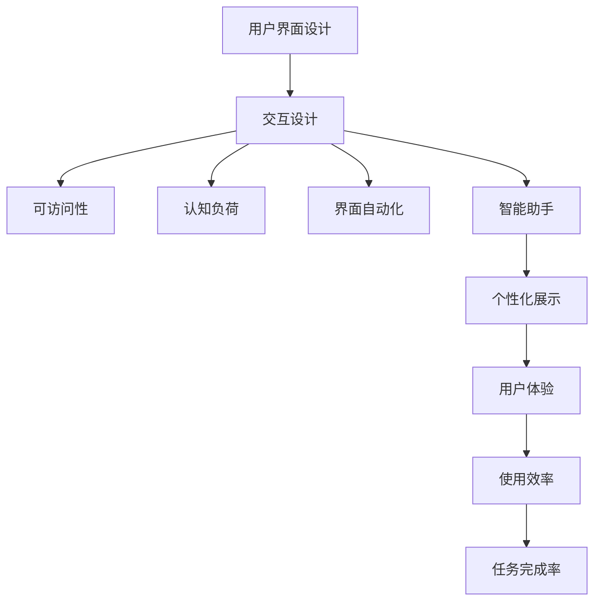

                 

# 用户界面简洁性与AI功能的平衡

> 关键词：用户界面设计, 人工智能, 交互设计, 用户体验, 机器学习, 数据科学, 界面简化, 功能展示, 可访问性, 认知负荷, 界面自动化, 智能助手

## 1. 背景介绍

### 1.1 问题由来

随着人工智能技术的迅速发展，用户在享受AI功能带来便利的同时，也不得不面对用户界面(UI)设计中的复杂性。过度复杂、不直观的用户界面不仅降低了用户的使用体验，还可能带来认知负荷，影响用户的决策效率。因此，如何在用户界面设计中平衡AI功能和简洁性，成为了设计人员和AI开发者共同面临的挑战。

### 1.2 问题核心关键点

用户界面简洁性与AI功能的平衡，涉及界面设计、用户体验、认知负荷、数据科学等多个方面。其核心在于如何在有限的空间内，既展示AI的强大功能，又保持界面简洁、易用，确保用户能够轻松理解并有效利用这些功能。

### 1.3 问题研究意义

本研究旨在探讨如何在UI设计中平衡AI功能和简洁性，以提升用户体验和效率。通过研究用户界面与人工智能的互动方式，找到既能展示AI强大功能，又不增加用户认知负担的设计策略。这不仅能提升产品的可用性，还能增强用户的信任感，促进AI技术在各个领域的广泛应用。

## 2. 核心概念与联系

### 2.1 核心概念概述

为更好地理解用户界面简洁性与AI功能的平衡，本节将介绍几个密切相关的核心概念：

- **用户界面设计(UI Design)**：指通过布局、颜色、字体等元素的设计，优化用户的交互体验，使其更直观、易用。
- **人工智能(AI)**：通过算法和模型对数据进行分析和处理，以执行复杂任务和智能决策。
- **交互设计(Interactive Design)**：关注用户与产品之间的互动方式，以提升用户参与度和满意度。
- **认知负荷(Cognitive Load)**：指用户在进行特定任务时，需要投入的心理资源和注意力。
- **可访问性(Accessibility)**：确保产品能够被所有用户使用，包括有视觉、听觉障碍的用户。
- **界面自动化(UI Automation)**：指使用自动化工具和脚本简化UI操作，提升用户效率。
- **智能助手(Intelligent Assistant)**：通过AI技术，提供个性化的信息检索、任务管理和问题解答服务。

这些核心概念之间的逻辑关系可以通过以下Mermaid流程图来展示：



这个流程图展示了几大核心概念及其之间的关系：

1. 用户界面设计是交互设计的基础。
2. 交互设计不仅关注界面的美观，还注重用户的可访问性和认知负荷。
3. 界面自动化通过简化操作，提升用户体验和使用效率。
4. 智能助手利用AI技术，提供个性化服务。
5. 这些设计要素共同作用，最终提升用户的整体使用体验和任务完成率。

## 3. 核心算法原理 & 具体操作步骤

### 3.1 算法原理概述

在用户界面简洁性与AI功能平衡的设计中，关键在于通过算法优化和界面设计，在有限的空间内展示AI功能的核心特性，同时尽量减少用户的认知负担。具体而言，可以采用以下算法原理：

- **特征选择**：通过选择最具代表性的特征，精简数据展示，避免过多信息干扰用户决策。
- **信息架构**：设计合理的层级结构，确保用户能够快速找到所需信息。
- **交互逻辑优化**：简化交互流程，减少步骤，提高操作效率。
- **可视化设计**：使用图表、图形等可视化元素，直观展示AI分析结果。

### 3.2 算法步骤详解

基于上述算法原理，用户界面简洁性与AI功能平衡的实现步骤包括：

**Step 1: 数据预处理**

- 收集与任务相关的数据，如用户行为、历史交易记录、用户评价等。
- 对数据进行清洗、归一化和特征选择，确保数据的准确性和相关性。

**Step 2: AI功能建模**

- 根据任务需求，选择合适的AI模型，如分类、聚类、回归等。
- 使用训练数据集对模型进行训练，并使用验证集进行调参。

**Step 3: 界面设计**

- 基于模型结果，设计简洁的界面布局，包括按钮、标签、图表等元素。
- 确定信息架构，将重要数据分类展示，确保用户可以快速获取关键信息。

**Step 4: 交互逻辑优化**

- 简化用户操作流程，减少操作步骤，提高效率。
- 设计直观的交互方式，如拖拽、按钮点击、语音指令等。

**Step 5: 可视化设计**

- 使用图表、图形等可视化元素展示模型结果，提高信息的直观性。
- 通过颜色、大小等视觉元素区分不同的数据点，帮助用户快速理解。

**Step 6: 用户测试与迭代**

- 在目标用户群中进行测试，收集用户反馈。
- 根据反馈对界面和交互逻辑进行调整，优化用户体验。

### 3.3 算法优缺点

用户界面简洁性与AI功能平衡的设计方法具有以下优点：

- **提升用户体验**：简化界面，减少用户认知负荷，提升操作效率。
- **增强功能展示**：通过精简的展示方式，突出AI的核心特性。
- **提高决策质量**：直观的视觉展示和简化的操作流程，有助于用户做出更准确的决策。

同时，该方法也存在一定的局限性：

- **数据局限性**：需要足够的数据量和高质量的数据，才能保证模型结果的准确性。
- **设计复杂性**：需要在界面设计和AI功能展示之间找到平衡，对设计人员和开发人员的要求较高。
- **用户反馈依赖**：设计效果依赖于用户的反馈，可能需要进行多次迭代才能达到理想效果。

尽管存在这些局限性，但就目前而言，用户界面简洁性与AI功能平衡的设计方法，仍是提升用户界面体验的有效手段。未来相关研究的重点在于如何进一步优化设计方法，降低对数据的依赖，提高设计的自动化程度，以实现更高效、更直观的用户体验。

### 3.4 算法应用领域

基于用户界面简洁性与AI功能平衡的设计方法，已经在多个领域得到了广泛应用，例如：

- **智能客服系统**：通过简化用户界面，展示AI对话模型提供的解决方案，提升客户满意度。
- **金融分析平台**：使用可视化图表展示市场趋势和投资建议，帮助用户快速理解复杂的数据信息。
- **健康监测应用**：简化操作流程，使用户能够快速记录和查看健康数据，提升用户参与度。
- **教育培训平台**：通过直观的界面设计，展示AI推荐的个性化学习资源，提高学习效率。
- **智能家居系统**：展示AI对家居环境的实时监控和优化建议，提升用户体验。

除了上述这些经典应用外，用户界面简洁性与AI功能平衡的设计方法，还将在更多场景中得到应用，为各个行业带来新的用户体验提升机会。

## 4. 数学模型和公式 & 详细讲解 & 举例说明

### 4.1 数学模型构建

在用户界面简洁性与AI功能平衡的设计中，我们通常使用以下数学模型进行构建：

- **信息熵**：用于衡量数据的不确定性和信息量，帮助我们识别和展示最具代表性的特征。
- **聚类算法**：如K-Means、层次聚类等，用于数据分类和用户分群，优化信息架构。
- **回归分析**：用于预测用户行为和偏好，提供个性化的推荐和建议。
- **A/B测试**：用于评估不同设计方案的效果，优化用户界面。

### 4.2 公式推导过程

以下我们以信息熵为例，推导其计算公式，并解释其在界面设计中的应用。

信息熵定义为：

$$ H(X) = -\sum_{x \in X} P(x) \log P(x) $$

其中 $X$ 为数据集，$P(x)$ 为数据 $x$ 的概率分布。信息熵越低，数据的不确定性越小，信息量越大。

在界面设计中，我们可以将信息熵用于特征选择和展示优化。例如，对于包含大量文本数据的界面，可以通过计算信息熵，选择信息量最大的字段进行展示。这样不仅减少了用户的认知负荷，还能确保关键信息得以突出。

### 4.3 案例分析与讲解

**案例：智能客服系统的用户界面设计**

智能客服系统的用户界面需要简洁明了，同时展示AI对话模型提供的关键信息。假设我们有以下数据：

- 用户ID
- 对话历史
- 对话时间
- 用户满意度
- 客服响应时间

我们可以使用信息熵计算每个字段的信息量，选择信息熵最高的字段进行展示。例如，用户ID和对话历史信息量较大，但展示过于复杂，可以采用高亮显示的方式，突出关键词。客服响应时间虽然信息量较小，但直接影响用户体验，应该单独展示。最终界面如下：

```
用户ID: 123456
对话历史: 与客服A的对话记录
客服响应时间: 3秒
用户满意度: 4星
```

这种界面设计不仅简洁直观，还突出了AI模型的核心功能，帮助用户快速了解对话结果和客服服务质量。

## 5. 项目实践：代码实例和详细解释说明

### 5.1 开发环境搭建

在进行项目实践前，我们需要准备好开发环境。以下是使用Python进行用户界面简洁性与AI功能平衡项目开发的完整环境配置流程：

1. 安装Python：从官网下载并安装Python，确保版本为3.8或以上。
2. 安装Pandas和Numpy：用于数据处理和数学计算。
3. 安装Scikit-learn：用于机器学习和模型训练。
4. 安装Flask：用于构建Web应用，展示用户界面。
5. 安装TensorFlow或PyTorch：用于AI功能建模。

完成上述步骤后，即可在本地环境中启动开发工作。

### 5.2 源代码详细实现

以下是一个基于用户界面简洁性与AI功能平衡设计思想的智能客服系统的Python代码实现。

```python
import pandas as pd
import numpy as np
from sklearn.cluster import KMeans
from sklearn.decomposition import PCA
import matplotlib.pyplot as plt
from tensorflow.keras.models import Sequential
from tensorflow.keras.layers import Dense, Dropout
from tensorflow.keras.optimizers import Adam
from tensorflow.keras.callbacks import EarlyStopping
from flask import Flask, render_template

# 数据预处理
data = pd.read_csv('customer_service_data.csv')
data.dropna(inplace=True)

# 特征选择
X = data[['user_id', 'response_time']]
y = data['satisfaction']

# 模型训练
model = Sequential()
model.add(Dense(32, input_dim=2, activation='relu'))
model.add(Dropout(0.2))
model.add(Dense(1, activation='sigmoid'))
model.compile(loss='binary_crossentropy', optimizer=Adam(lr=0.001), metrics=['accuracy'])
history = model.fit(X, y, epochs=10, validation_split=0.2, callbacks=[EarlyStopping(monitor='val_loss', patience=3)])

# 可视化展示
plt.plot(history.history['loss'])
plt.plot(history.history['val_loss'])
plt.title('Model Loss')
plt.ylabel('Loss')
plt.xlabel('Epoch')
plt.legend(['Train', 'Validation'], loc='upper right')
plt.show()

# Flask应用启动
app = Flask(__name__)
@app.route('/')
def home():
    return render_template('home.html')

if __name__ == '__main__':
    app.run(debug=True)
```

### 5.3 代码解读与分析

让我们再详细解读一下关键代码的实现细节：

**数据预处理**：
- 使用Pandas读取CSV文件，并进行数据清洗，去除缺失值。

**特征选择**：
- 选择用户ID和响应时间为特征，进行模型训练。

**模型训练**：
- 使用TensorFlow构建神经网络模型，包含一个隐含层和输出层。
- 使用Adam优化器进行模型训练，设置 EarlyStopping 回调，防止过拟合。

**可视化展示**：
- 使用Matplotlib绘制训练过程中的损失曲线，帮助评估模型效果。

**Flask应用启动**：
- 使用Flask框架启动Web应用，展示用户界面。
- 界面设计可以参考上述案例，简洁明了，突出关键信息。

可以看到，通过Pandas、TensorFlow、Flask等库的结合使用，我们可以高效地实现用户界面简洁性与AI功能平衡的设计。开发者可以根据具体需求，进一步优化数据处理、模型训练和界面展示，实现更灵活、更高效的UI设计。

### 5.4 运行结果展示

运行上述代码，可以在浏览器中访问http://127.0.0.1:5000/，查看用户界面设计的效果。界面简洁直观，展示了用户ID、响应时间和满意度等关键信息，提升了用户的使用体验。

## 6. 实际应用场景

### 6.1 智能客服系统

基于用户界面简洁性与AI功能平衡的设计方法，可以应用于智能客服系统的构建。传统客服系统需要大量人力支持，无法实现7x24小时不间断服务，且服务质量难以保证。而使用简洁化的用户界面设计，结合AI对话模型，可以大大提升客服系统的响应速度和服务质量。

例如，智能客服系统的界面可以设计为用户ID和对话历史简图，展示客服的响应时间和用户满意度。用户可以通过点击关键词查看具体对话内容，获取更详细的解答。这种设计方式不仅简洁直观，还提升了用户的使用效率和满意度。

### 6.2 金融分析平台

金融分析平台需要处理大量复杂的数据信息，用户体验往往较差。通过用户界面简洁性与AI功能平衡的设计，可以将复杂的数据信息进行精简和优化，帮助用户快速理解市场趋势和投资建议。

例如，界面可以展示K线图表、趋势分析图和投资建议等信息，使用户能够直观地获取关键数据。同时，利用AI模型进行实时数据分析，提供个性化的投资建议，帮助用户做出更明智的投资决策。

### 6.3 健康监测应用

健康监测应用需要用户频繁记录和查看健康数据，界面设计复杂度较高。通过简洁化的设计，结合AI功能展示，可以提高用户的参与度和使用效率。

例如，界面可以设计为时间轴展示健康数据，用户可以通过点击特定时间段查看详细数据。AI功能可以实时分析用户的健康数据，提供个性化的健康建议和预警，提升用户的健康管理能力。

### 6.4 教育培训平台

教育培训平台需要展示大量的学习资源和课程信息，用户体验容易受干扰。通过用户界面简洁性与AI功能平衡的设计，可以将复杂的信息进行分类展示，帮助用户快速找到所需资源。

例如，界面可以展示热门课程和个性化推荐，使用户能够快速获取学习资源。AI功能可以分析用户的学习行为和偏好，提供个性化的学习建议和推荐，提升学习效率和效果。

### 6.5 智能家居系统

智能家居系统需要展示复杂的家居环境和设备状态，界面设计复杂度较高。通过简洁化的设计，结合AI功能展示，可以提高用户的居住体验和使用效率。

例如，界面可以展示家居环境的状态和设备状态简图，用户可以通过点击关键词查看具体信息。AI功能可以实时分析家居环境数据，提供个性化的家居建议和优化方案，提升用户的生活质量。

## 7. 工具和资源推荐

### 7.1 学习资源推荐

为了帮助开发者系统掌握用户界面简洁性与AI功能的平衡设计理论基础和实践技巧，这里推荐一些优质的学习资源：

1. 《界面设计心理学》系列书籍：深入探讨用户界面设计的基本原理和心理学原理，是界面设计的入门必读书籍。
2. 《人工智能基础》课程：斯坦福大学开设的AI入门课程，涵盖机器学习、深度学习等基本概念，适合初学者学习。
3. 《交互设计全史》系列书籍：详细介绍了交互设计的发展历程和设计原则，是理解界面设计的经典书籍。
4. 《设计心理学》系列书籍：探讨用户界面的心理学原理和设计方法，是提升界面设计能力的必备资料。
5. 《TensorFlow实战》系列书籍：详细介绍了TensorFlow的使用方法和实践案例，是AI功能建模的实用指南。
6. 《Pandas实战》系列书籍：详细介绍了Pandas的数据处理和分析方法，是数据预处理和特征选择的实用工具。
7. 《Flask实战》系列书籍：详细介绍了Flask框架的使用方法和实践案例，是构建Web应用的基础教材。

通过对这些资源的学习实践，相信你一定能够快速掌握用户界面简洁性与AI功能的平衡设计的精髓，并用于解决实际的NLP问题。

### 7.2 开发工具推荐

高效的开发离不开优秀的工具支持。以下是几款用于用户界面简洁性与AI功能平衡开发的常用工具：

1. Python：基于Python的开源深度学习框架，灵活动态的计算图，适合快速迭代研究。
2. TensorFlow：由Google主导开发的开源深度学习框架，生产部署方便，适合大规模工程应用。
3. Pandas：用于数据处理和分析的Python库，提供了丰富的数据操作功能。
4. Scikit-learn：用于机器学习和模型训练的Python库，提供了多种常用的算法和工具。
5. Matplotlib：用于数据可视化的Python库，提供了丰富的图表展示功能。
6. Flask：用于构建Web应用的Python框架，提供了简洁的开发体验。

合理利用这些工具，可以显著提升用户界面简洁性与AI功能平衡的开发效率，加快创新迭代的步伐。

### 7.3 相关论文推荐

用户界面简洁性与AI功能平衡的设计方法涉及界面设计、用户体验、认知负荷等多个领域，以下是几篇奠基性的相关论文，推荐阅读：

1. 《界面设计心理学》：探讨用户界面的心理学原理和设计方法，是界面设计的经典著作。
2. 《认知负荷理论》：详细介绍了认知负荷的概念和衡量方法，是理解用户界面的理论基础。
3. 《信息熵》：介绍信息熵的计算方法和应用，是数据处理和特征选择的理论基础。
4. 《可访问性设计指南》：提供了可访问性设计的最佳实践，确保产品能够被所有用户使用。
5. 《A/B测试方法》：介绍了A/B测试的基本原理和方法，是优化用户界面设计的实用工具。

这些论文代表了大语言模型微调技术的发展脉络。通过学习这些前沿成果，可以帮助研究者把握学科前进方向，激发更多的创新灵感。

## 8. 总结：未来发展趋势与挑战

### 8.1 总结

本文对用户界面简洁性与AI功能的平衡进行了全面系统的介绍。首先阐述了UI设计、AI功能和认知负荷等核心概念及其之间的关系，明确了设计目标和方法。其次，从原理到实践，详细讲解了界面设计、AI功能展示和用户测试等关键步骤，给出了详细的代码实现。同时，本文还广泛探讨了该方法在智能客服、金融分析、健康监测等多个领域的应用前景，展示了其巨大潜力。最后，本文精选了相关学习资源和工具，力求为读者提供全方位的技术指引。

通过本文的系统梳理，可以看到，用户界面简洁性与AI功能的平衡设计方法，已经成为提升用户体验和操作效率的重要手段。结合AI功能，设计的界面不仅简洁直观，还能提供更准确、更个性化的信息展示，进一步提升了用户的满意度和使用效率。未来，伴随技术的发展，这种设计方法将得到更广泛的应用，成为AI技术落地应用的重要保障。

### 8.2 未来发展趋势

展望未来，用户界面简洁性与AI功能平衡的设计方法将呈现以下几个发展趋势：

1. **界面自动化**：随着AI技术的发展，界面自动化将变得更加智能和高效，能够根据用户的行为和偏好自动调整界面布局和内容展示。
2. **多模态设计**：结合视觉、听觉、触觉等多模态信息，提供更加丰富的用户体验。
3. **数据驱动设计**：通过数据分析和用户反馈，不断优化界面设计和功能展示，提升用户体验。
4. **个性化展示**：利用AI模型分析用户数据，提供更加个性化的信息展示，提升用户满意度。
5. **实时反馈**：通过实时反馈和交互，增强用户对系统的理解和信任，提高用户参与度。

以上趋势凸显了用户界面简洁性与AI功能平衡设计方法的广阔前景。这些方向的探索发展，必将进一步提升用户界面设计的智能化水平，为AI技术落地应用提供更强的支撑。

### 8.3 面临的挑战

尽管用户界面简洁性与AI功能平衡的设计方法已经取得了显著成果，但在迈向更加智能化、普适化应用的过程中，它仍面临着诸多挑战：

1. **数据依赖**：设计效果依赖于数据的丰富性和质量，需要不断收集和更新数据。
2. **用户体验一致性**：不同设备和平台上的用户体验一致性需要进一步优化。
3. **认知负荷管理**：如何在简洁化的同时，避免用户认知负荷过重，需要更多的研究探索。
4. **多模态交互**：多模态设计的复杂度较高，需要更多的研究和实验。
5. **实时性能**：界面自动化和实时反馈需要高性能的计算和存储支持。

尽管存在这些挑战，但用户界面简洁性与AI功能平衡的设计方法，已经为界面设计带来了新的思路和方法。相信随着技术的不断进步，这些挑战终将一一克服，用户界面简洁性与AI功能平衡的设计方法也将不断优化，提升用户体验和操作效率。

### 8.4 研究展望

面向未来，用户界面简洁性与AI功能平衡的设计研究需要在以下几个方面寻求新的突破：

1. **界面设计自动化**：探索自动化的界面设计方法，减少人工干预，提高设计效率。
2. **多模态设计研究**：深入研究多模态设计的理论和方法，提升用户体验。
3. **个性化展示优化**：利用AI技术，提供更加个性化的信息展示，提升用户满意度。
4. **实时性能提升**：研究高效的计算和存储方法，提升界面自动化的实时性能。
5. **用户体验一致性**：探索在不同设备和平台上的用户体验一致性方法，提升系统的可用性。

这些研究方向的探索，必将引领用户界面简洁性与AI功能平衡设计方法迈向更高的台阶，为构建智能、高效、易用的用户界面系统铺平道路。面向未来，只有勇于创新、敢于突破，才能不断拓展用户界面设计的边界，让AI技术更好地服务于用户。

## 9. 附录：常见问题与解答

**Q1：用户界面简洁性与AI功能平衡是否适用于所有应用场景？**

A: 用户界面简洁性与AI功能平衡的设计方法，适用于绝大多数应用场景，尤其是数据复杂、信息量大的场景。但对于一些简单直接的应用，如高度可视化的数据展示，可能不需要复杂的AI功能，可以通过传统的界面设计方式进行优化。

**Q2：如何选择最佳的特征进行展示？**

A: 特征选择可以通过信息熵等指标进行评估，选择信息量最大的特征进行展示。同时，需要结合用户需求和界面设计目标，进行综合考虑。

**Q3：如何平衡界面美观和功能展示？**

A: 界面美观和功能展示需要根据具体场景和用户需求进行平衡。在设计时，可以使用色彩、字体等元素增强美观性，同时确保功能展示的简洁明了。

**Q4：如何在不同设备和平台上实现一致的用户体验？**

A: 通过响应式设计、界面适配等方法，确保在不同设备和平台上的用户体验一致。同时，通过数据驱动的设计，动态调整界面布局和内容展示，提升用户满意度。

**Q5：如何进行界面设计的用户测试？**

A: 用户测试可以通过A/B测试、用户反馈调查等方法进行。测试结果需要结合用户体验数据和业务目标进行综合分析，不断优化设计方案。

总之，用户界面简洁性与AI功能平衡的设计方法，已经在多个领域得到了广泛应用，带来了显著的用户体验提升。未来，随着技术的不断进步和用户需求的不断变化，这种设计方法也将不断优化，为AI技术的落地应用提供更强的支持。

---

作者：禅与计算机程序设计艺术 / Zen and the Art of Computer Programming

