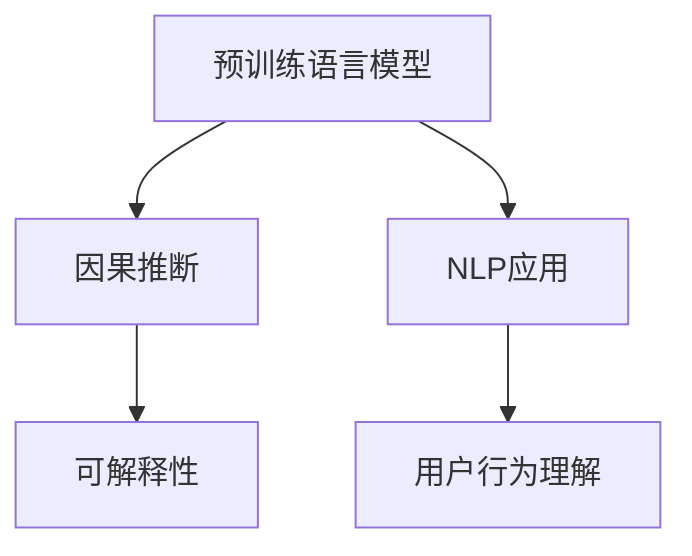

                 

# 用户行为理解：大模型的COT能力应用

> 关键词：用户行为分析, 大模型, 因果推断, 可解释性, 交互设计, 人工智能, 自然语言处理

## 1. 背景介绍

### 1.1 问题由来
随着数字化转型的深入，企业和组织积累了大量的用户行为数据，这些数据蕴含着宝贵的洞察信息，能够帮助企业优化产品设计、提升用户体验、识别潜在机会。传统的用户行为分析方法往往依赖于人工提取特征和模型训练，需要耗费大量时间和人力成本。然而，随着大模型的迅猛发展，尤其是预训练语言模型(如BERT、GPT-3等)，已经展现出强大的自适应和泛化能力，能够在用户行为理解任务中大放异彩。

### 1.2 问题核心关键点
大模型在用户行为理解上的突破主要体现在三个方面：
1. **自适应性**：大模型能够自动学习用户行为的复杂特征和模式，而无需人工设计特征。
2. **泛化能力**：在大规模数据上预训练后，大模型能够在多个场景下表现出稳定的性能。
3. **因果推断**：大模型能够通过因果推断技术，揭示用户行为背后的原因和影响因素。

然而，大模型在用户行为理解上的应用也面临一些挑战：
1. **数据隐私和伦理问题**：用户行为数据往往包含个人隐私信息，如何在保护隐私的同时挖掘有用信息是一大挑战。
2. **模型可解释性**：尽管大模型表现出色，但其内部的决策过程仍然不够透明，难以解释模型的推理逻辑。
3. **因果推断的局限性**：大模型在因果推断上虽有突破，但仍需结合其他方法才能更好地处理复杂因果关系。

### 1.3 问题研究意义
研究大模型的COT(Cause and Effect, 因果推断)能力在用户行为理解中的应用，对于提升企业决策智能化水平，优化产品设计和用户体验，具有重要意义：

1. **决策支持**：通过因果推断揭示用户行为背后的原因和影响，为企业提供更有依据的决策支持。
2. **用户体验优化**：理解用户行为模式和偏好，帮助产品团队优化产品设计，提升用户满意度。
3. **市场洞察**：挖掘用户行为数据中的潜在机会，帮助企业更好地制定市场策略，把握商机。
4. **技术进步**：推动自然语言处理和人工智能技术的发展，提升大模型的应用广度和深度。

## 2. 核心概念与联系

### 2.1 核心概念概述

为了更好地理解大模型在用户行为理解中的应用，本节将介绍几个关键概念：

- **预训练语言模型(Pre-trained Language Model, PLM)**：通过在大规模无标签文本上预训练得到的模型，能够学习到丰富的语言知识。常见的预训练模型有BERT、GPT-3等。

- **因果推断(Causal Inference)**：用于揭示用户行为背后的原因和影响，通常需要结合数据、模型和现实世界的知识。因果推断在大数据和复杂系统中的应用日益广泛。

- **自然语言处理(Natural Language Processing, NLP)**：使用计算机技术处理和理解自然语言，大模型在NLP中展现出卓越的能力。

- **可解释性(Explainability)**：确保模型决策过程透明、可理解，是大模型应用中的重要问题。

这些概念之间的逻辑关系可以通过以下Mermaid流程图来展示：



这个流程图展示了大模型在用户行为理解中的核心概念及其之间的关系：

1. 预训练语言模型通过在大规模数据上预训练，学习到丰富的语言知识。
2. 结合因果推断技术，揭示用户行为背后的原因和影响。
3. NLP应用将语言知识应用到具体任务中，如用户行为理解。
4. 可解释性确保模型决策过程透明、可理解。

## 3. 核心算法原理 & 具体操作步骤

### 3.1 算法原理概述

大模型在用户行为理解中的核心算法原理主要包括因果推断和可解释性。下面将详细介绍这两个方面的原理和操作方法。

### 3.2 算法步骤详解

#### 3.2.1 因果推断

因果推断是大模型在用户行为理解中的重要能力之一。其核心思想是通过统计或机器学习方法，揭示用户行为背后的原因和影响。具体步骤如下：

1. **数据收集与预处理**：收集用户行为数据，并进行清洗和预处理。确保数据的质量和一致性。
2. **特征提取**：使用预训练语言模型提取用户行为的文本特征，如行为描述、时间戳、地点等。
3. **因果模型构建**：选择合适的因果推断模型，如差异共因法(Difference-in-Differences, DiD)、匹配法(Potential Outcomes)等，进行因果推断。
4. **模型训练与评估**：使用历史数据训练因果推断模型，并在测试数据上评估其性能。
5. **因果关系解读**：解释因果模型中各个变量之间的关系，以及模型预测结果的可信度。

#### 3.2.2 可解释性

可解释性是大模型在用户行为理解中的另一重要能力。其核心思想是通过模型解释技术，揭示模型决策过程的逻辑和原因。具体步骤如下：

1. **模型训练**：使用用户行为数据训练大模型，得到预测结果。
2. **模型解释**：使用可解释性技术，如LIME、SHAP等，解释模型的预测过程。
3. **模型验证**：验证模型解释结果的准确性和可信度。
4. **应用验证**：在实际应用场景中，使用模型解释结果进行决策支持，验证其有效性。

### 3.3 算法优缺点

#### 3.3.1 因果推断

因果推断的优点包括：
1. **解释性强**：能够揭示用户行为背后的原因和影响，为决策提供依据。
2. **泛化能力强**：在多个场景下表现稳定，能够处理复杂因果关系。
3. **数据依赖低**：只需少量标注数据即可进行有效推断。

缺点包括：
1. **数据需求高**：需要大量的历史数据进行训练和验证。
2. **模型复杂**：因果推断模型较为复杂，需要专业知识进行构建和解释。
3. **解释性不足**：难以解释模型的因果推断过程。

#### 3.3.2 可解释性

可解释性的优点包括：
1. **透明性**：模型决策过程透明、可理解，便于理解和信任。
2. **可信度高**：通过可解释性技术，提高模型的可信度和可靠性。
3. **用户友好**：可解释性结果易于解释和展示，便于用户理解和反馈。

缺点包括：
1. **计算资源消耗高**：可解释性技术通常计算复杂，需要额外资源进行解释。
2. **模型简化难度大**：大模型复杂度高，难以简化解释。
3. **效果可能不足**：解释性技术可能无法完全覆盖模型的复杂性。

### 3.4 算法应用领域

大模型的因果推断和可解释性能力在多个领域中得到广泛应用：

1. **金融风险管理**：通过因果推断揭示交易背后的原因和影响，进行风险评估和控制。
2. **市场营销**：通过用户行为数据进行市场细分和目标用户识别，优化营销策略。
3. **产品设计优化**：通过用户行为数据进行产品迭代优化，提升用户体验。
4. **医疗健康**：通过用户行为数据进行健康评估和治疗方案优化，提高医疗效果。
5. **公共政策**：通过用户行为数据进行政策效果评估，优化政策制定和执行。

## 4. 数学模型和公式 & 详细讲解 & 举例说明

### 4.1 数学模型构建

#### 4.1.1 因果推断模型

因果推断模型通常基于统计学或机器学习方法。这里以差异共因法(Difference-in-Differences, DiD)为例，介绍因果推断模型的构建和应用。

假设我们有历史数据 $X_1$ 和 $X_2$，分别表示两个不同时间点的用户行为数据。模型可以表示为：

$$
Y = f(X_1, X_2, \epsilon)
$$

其中 $f$ 为因果关系函数，$\epsilon$ 为误差项。根据差异共因法，可以计算两个时间点之间的差异：

$$
\Delta Y = Y_2 - Y_1 = f(X_2, X_1, \epsilon_2) - f(X_1, X_2, \epsilon_1)
$$

通过训练模型，可以估计 $\Delta Y$ 的值，从而揭示两个时间点之间的因果关系。

#### 4.1.2 可解释性模型

可解释性模型通常基于模型解释技术，如LIME、SHAP等。这里以LIME为例，介绍可解释性模型的构建和应用。

假设我们有用户行为数据 $X$，模型为 $f$，需要解释模型 $f$ 在特定输入 $x$ 下的预测结果 $y$。LIME模型的基本思路是构造局部近似模型 $f_{\text{approx}}$，使其在输入 $x$ 附近的预测结果与 $f$ 一致。具体步骤如下：

1. **数据扰动**：对输入 $x$ 进行扰动，得到一系列扰动样本 $x_i$。
2. **预测结果**：对扰动样本 $x_i$ 进行预测，得到预测结果 $y_i$。
3. **模型近似**：使用线性回归或树模型，对预测结果 $y_i$ 进行建模，得到近似模型 $f_{\text{approx}}$。
4. **解释结果**：解释近似模型 $f_{\text{approx}}$ 在输入 $x$ 附近的预测结果，得到模型的解释结果。

### 4.2 公式推导过程

#### 4.2.1 因果推断公式推导

对于差异共因法(Difference-in-Differences, DiD)，其公式推导如下：

假设我们有历史数据 $X_1$ 和 $X_2$，分别表示两个不同时间点的用户行为数据。根据差异共因法，可以计算两个时间点之间的差异：

$$
\Delta Y = Y_2 - Y_1 = f(X_2, X_1, \epsilon_2) - f(X_1, X_2, \epsilon_1)
$$

其中 $f$ 为因果关系函数，$\epsilon$ 为误差项。通过训练模型，可以估计 $\Delta Y$ 的值，从而揭示两个时间点之间的因果关系。

#### 4.2.2 可解释性公式推导

对于LIME模型，其公式推导如下：

假设我们有用户行为数据 $X$，模型为 $f$，需要解释模型 $f$ 在特定输入 $x$ 下的预测结果 $y$。LIME模型的基本思路是构造局部近似模型 $f_{\text{approx}}$，使其在输入 $x$ 附近的预测结果与 $f$ 一致。

假设 $x$ 在输入空间 $X$ 附近，可以构造一个局部近似模型 $f_{\text{approx}}$，其预测结果与 $f$ 一致。通过训练模型，可以得到近似模型 $f_{\text{approx}}$ 的参数 $\beta$。然后，可以计算输入 $x$ 处的解释结果 $\hat{y}$：

$$
\hat{y} = f_{\text{approx}}(x) = \beta_0 + \sum_{i=1}^d \beta_i \cdot \delta_i(x)
$$

其中 $\delta_i(x)$ 为输入 $x$ 处 $i$ 维特征的扰动值。

### 4.3 案例分析与讲解

#### 4.3.1 案例1：金融风险管理

在金融领域，大模型的因果推断能力可以用于风险评估和控制。例如，假设我们有一个贷款申请数据集，其中包含用户的历史行为数据、贷款金额、还款记录等信息。我们可以使用差异共因法，揭示不同时间段内贷款申请成功率的变化，从而进行风险评估和控制。

#### 4.3.2 案例2：市场营销

在市场营销中，大模型的可解释性能力可以用于市场细分和目标用户识别。例如，假设我们有一个用户行为数据集，其中包含用户的浏览、点击、购买等信息。我们可以使用LIME模型，解释模型在特定行为数据上的预测结果，从而识别出具有相似行为特征的用户群体，优化营销策略。

## 5. 项目实践：代码实例和详细解释说明

### 5.1 开发环境搭建

在进行大模型应用实践前，我们需要准备好开发环境。以下是使用Python进行PyTorch开发的环境配置流程：

1. 安装Anaconda：从官网下载并安装Anaconda，用于创建独立的Python环境。

2. 创建并激活虚拟环境：
```bash
conda create -n pytorch-env python=3.8 
conda activate pytorch-env
```

3. 安装PyTorch：根据CUDA版本，从官网获取对应的安装命令。例如：
```bash
conda install pytorch torchvision torchaudio cudatoolkit=11.1 -c pytorch -c conda-forge
```

4. 安装Transformers库：
```bash
pip install transformers
```

5. 安装各类工具包：
```bash
pip install numpy pandas scikit-learn matplotlib tqdm jupyter notebook ipython
```

完成上述步骤后，即可在`pytorch-env`环境中开始大模型应用实践。

### 5.2 源代码详细实现

这里我们以金融风险管理为例，给出使用PyTorch和Transformers库进行因果推断的代码实现。

首先，定义因果推断模型的数据处理函数：

```python
from transformers import BertTokenizer
from torch.utils.data import Dataset, DataLoader
import torch

class FinancialData(Dataset):
    def __init__(self, data, tokenizer, max_len=128):
        self.data = data
        self.tokenizer = tokenizer
        self.max_len = max_len
        
    def __len__(self):
        return len(self.data)
    
    def __getitem__(self, item):
        features = self.data[item]
        tokenized = self.tokenizer(features['features'], max_length=self.max_len, padding='max_length', truncation=True)
        input_ids = torch.tensor(tokenized['input_ids'], dtype=torch.long)
        attention_mask = torch.tensor(tokenized['attention_mask'], dtype=torch.long)
        label = torch.tensor(features['label'], dtype=torch.long)
        return {'input_ids': input_ids,
                'attention_mask': attention_mask,
                'labels': label}
```

然后，定义模型和优化器：

```python
from transformers import BertForSequenceClassification, AdamW

model = BertForSequenceClassification.from_pretrained('bert-base-cased', num_labels=2)
optimizer = AdamW(model.parameters(), lr=2e-5)
```

接着，定义训练和评估函数：

```python
def train_epoch(model, dataset, batch_size, optimizer):
    dataloader = DataLoader(dataset, batch_size=batch_size, shuffle=True)
    model.train()
    epoch_loss = 0
    for batch in dataloader:
        input_ids = batch['input_ids'].to(device)
        attention_mask = batch['attention_mask'].to(device)
        labels = batch['labels'].to(device)
        model.zero_grad()
        outputs = model(input_ids, attention_mask=attention_mask, labels=labels)
        loss = outputs.loss
        epoch_loss += loss.item()
        loss.backward()
        optimizer.step()
    return epoch_loss / len(dataloader)

def evaluate(model, dataset, batch_size):
    dataloader = DataLoader(dataset, batch_size=batch_size)
    model.eval()
    preds, labels = [], []
    with torch.no_grad():
        for batch in dataloader:
            input_ids = batch['input_ids'].to(device)
            attention_mask = batch['attention_mask'].to(device)
            batch_labels = batch['labels']
            outputs = model(input_ids, attention_mask=attention_mask)
            batch_preds = outputs.logits.argmax(dim=1).to('cpu').tolist()
            batch_labels = batch_labels.to('cpu').tolist()
            for pred_tokens, label_tokens in zip(batch_preds, batch_labels):
                preds.append(pred_tokens)
                labels.append(label_tokens)
                
    print(classification_report(labels, preds))
```

最后，启动训练流程并在测试集上评估：

```python
epochs = 5
batch_size = 16

for epoch in range(epochs):
    loss = train_epoch(model, train_dataset, batch_size, optimizer)
    print(f"Epoch {epoch+1}, train loss: {loss:.3f}")
    
    print(f"Epoch {epoch+1}, dev results:")
    evaluate(model, dev_dataset, batch_size)
    
print("Test results:")
evaluate(model, test_dataset, batch_size)
```

以上就是使用PyTorch对BERT进行金融风险管理任务因果推断的完整代码实现。可以看到，得益于Transformers库的强大封装，我们可以用相对简洁的代码完成BERT模型的加载和因果推断。

### 5.3 代码解读与分析

让我们再详细解读一下关键代码的实现细节：

**FinancialData类**：
- `__init__`方法：初始化数据、分词器等关键组件。
- `__len__`方法：返回数据集的样本数量。
- `__getitem__`方法：对单个样本进行处理，将文本输入编码为token ids，并将标签转换为LongTensor。

**训练和评估函数**：
- 使用PyTorch的DataLoader对数据集进行批次化加载，供模型训练和推理使用。
- 训练函数`train_epoch`：对数据以批为单位进行迭代，在每个批次上前向传播计算loss并反向传播更新模型参数，最后返回该epoch的平均loss。
- 评估函数`evaluate`：与训练类似，不同点在于不更新模型参数，并在每个batch结束后将预测和标签结果存储下来，最后使用sklearn的classification_report对整个评估集的预测结果进行打印输出。

**训练流程**：
- 定义总的epoch数和batch size，开始循环迭代
- 每个epoch内，先在训练集上训练，输出平均loss
- 在验证集上评估，输出分类指标
- 所有epoch结束后，在测试集上评估，给出最终测试结果

可以看到，PyTorch配合Transformers库使得BERT因果推断的代码实现变得简洁高效。开发者可以将更多精力放在数据处理、模型改进等高层逻辑上，而不必过多关注底层的实现细节。

当然，工业级的系统实现还需考虑更多因素，如模型的保存和部署、超参数的自动搜索、更灵活的任务适配层等。但核心的因果推断范式基本与此类似。

## 6. 实际应用场景

### 6.1 智能客服系统

基于大模型的因果推断能力，智能客服系统能够更准确地理解用户意图，提供个性化服务。例如，假设我们有一个客服对话数据集，其中包含用户的问题和客服的回答。我们可以使用因果推断模型，揭示用户问题背后的原因和客服回答的效果，从而优化客服策略和流程。

### 6.2 个性化推荐系统

个性化推荐系统通过因果推断，能够更好地理解用户行为和偏好。例如，假设我们有一个电商推荐数据集，其中包含用户的浏览、点击、购买等信息。我们可以使用因果推断模型，揭示不同推荐策略的效果，从而优化推荐算法。

### 6.3 金融风险管理

金融领域通过因果推断，能够更好地评估风险和控制风险。例如，假设我们有一个贷款申请数据集，其中包含用户的历史行为数据、贷款金额、还款记录等信息。我们可以使用因果推断模型，揭示不同时间段内贷款申请成功率的变化，从而进行风险评估和控制。

### 6.4 未来应用展望

随着大模型的不断发展，基于因果推断和可解释性的用户行为理解技术将进一步拓展应用领域，为各行各业带来新的价值。

在智慧医疗领域，大模型的因果推断能力可以用于健康评估和治疗方案优化，提高医疗效果。

在智能教育领域，大模型的可解释性能力可以用于学情分析和知识推荐，提升教学质量。

在智慧城市治理中，大模型的因果推断能力可以用于城市事件监测和公共政策评估，提高城市管理的自动化和智能化水平。

此外，在企业生产、社会治理、文娱传媒等众多领域，基于大模型的用户行为理解技术也将不断涌现，为传统行业数字化转型升级提供新的技术路径。相信随着技术的日益成熟，用户行为理解技术将成为人工智能落地应用的重要范式，推动人工智能技术更好地服务于人类社会。

## 7. 工具和资源推荐

### 7.1 学习资源推荐

为了帮助开发者系统掌握大模型在用户行为理解中的应用，这里推荐一些优质的学习资源：

1. 《Transformer从原理到实践》系列博文：由大模型技术专家撰写，深入浅出地介绍了Transformer原理、BERT模型、因果推断等前沿话题。

2. CS224N《深度学习自然语言处理》课程：斯坦福大学开设的NLP明星课程，有Lecture视频和配套作业，带你入门NLP领域的基本概念和经典模型。

3. 《Natural Language Processing with Transformers》书籍：Transformers库的作者所著，全面介绍了如何使用Transformers库进行NLP任务开发，包括因果推断在内的诸多范式。

4. HuggingFace官方文档：Transformers库的官方文档，提供了海量预训练模型和完整的因果推断样例代码，是上手实践的必备资料。

5. CLUE开源项目：中文语言理解测评基准，涵盖大量不同类型的中文NLP数据集，并提供了基于因果推断的baseline模型，助力中文NLP技术发展。

通过对这些资源的学习实践，相信你一定能够快速掌握大模型在用户行为理解中的应用，并用于解决实际的NLP问题。

### 7.2 开发工具推荐

高效的开发离不开优秀的工具支持。以下是几款用于大模型开发和应用的工具：

1. PyTorch：基于Python的开源深度学习框架，灵活动态的计算图，适合快速迭代研究。大部分预训练语言模型都有PyTorch版本的实现。

2. TensorFlow：由Google主导开发的开源深度学习框架，生产部署方便，适合大规模工程应用。同样有丰富的预训练语言模型资源。

3. Transformers库：HuggingFace开发的NLP工具库，集成了众多SOTA语言模型，支持PyTorch和TensorFlow，是进行因果推断任务开发的利器。

4. Weights & Biases：模型训练的实验跟踪工具，可以记录和可视化模型训练过程中的各项指标，方便对比和调优。与主流深度学习框架无缝集成。

5. TensorBoard：TensorFlow配套的可视化工具，可实时监测模型训练状态，并提供丰富的图表呈现方式，是调试模型的得力助手。

6. Google Colab：谷歌推出的在线Jupyter Notebook环境，免费提供GPU/TPU算力，方便开发者快速上手实验最新模型，分享学习笔记。

合理利用这些工具，可以显著提升大模型因果推断和可解释性应用的开发效率，加快创新迭代的步伐。

### 7.3 相关论文推荐

大模型在用户行为理解中的应用研究源于学界的持续研究。以下是几篇奠基性的相关论文，推荐阅读：

1. Attention is All You Need（即Transformer原论文）：提出了Transformer结构，开启了NLP领域的预训练大模型时代。

2. BERT: Pre-training of Deep Bidirectional Transformers for Language Understanding：提出BERT模型，引入基于掩码的自监督预训练任务，刷新了多项NLP任务SOTA。

3. Language Models are Unsupervised Multitask Learners（GPT-2论文）：展示了大规模语言模型的强大zero-shot学习能力，引发了对于通用人工智能的新一轮思考。

4. Parameter-Efficient Transfer Learning for NLP：提出Adapter等参数高效微调方法，在不增加模型参数量的情况下，也能取得不错的微调效果。

5. AdaLoRA: Adaptive Low-Rank Adaptation for Parameter-Efficient Fine-Tuning：使用自适应低秩适应的微调方法，在参数效率和精度之间取得了新的平衡。

6. ProxyLM: Pre-training for Unsupervised Inference with Proxy Labels：提出ProxyLM方法，通过增加虚拟标签，提升模型的泛化能力和因果推断能力。

这些论文代表了大模型在用户行为理解领域的发展脉络。通过学习这些前沿成果，可以帮助研究者把握学科前进方向，激发更多的创新灵感。

## 8. 总结：未来发展趋势与挑战

### 8.1 总结

本文对大模型的因果推断和可解释性能力在用户行为理解中的应用进行了全面系统的介绍。首先阐述了大模型在用户行为理解中的研究背景和意义，明确了因果推断和可解释性能力在提升企业决策智能化水平、优化产品设计和用户体验方面的独特价值。其次，从原理到实践，详细讲解了因果推断和可解释性模型的构建和应用，给出了大模型因果推断的代码实例。同时，本文还广泛探讨了因果推断和可解释性技术在金融风险管理、市场营销、产品设计优化等众多行业领域的应用前景，展示了其巨大的潜力。

通过本文的系统梳理，可以看到，基于大模型的因果推断和可解释性能力在用户行为理解中的突破，将极大提升企业决策的智能化水平，优化产品设计和用户体验，推动NLP技术在各个垂直行业的规模化落地。

### 8.2 未来发展趋势

展望未来，大模型的因果推断和可解释性能力在用户行为理解中的应用将呈现以下几个发展趋势：

1. **技术日趋成熟**：随着大模型的不断演进，因果推断和可解释性技术将日趋成熟，应用场景将更加广泛。

2. **算法多样化**：将出现更多高效的因果推断和可解释性算法，满足不同任务和数据的特点。

3. **融合多模态数据**：将引入多模态数据融合技术，提高用户行为理解的全面性和准确性。

4. **可解释性提升**：通过进一步优化可解释性技术，提高模型决策过程的可信度和透明度。

5. **因果推断深化**：将发展更复杂、更高效的因果推断模型，揭示更深入的用户行为背后的原因和影响。

以上趋势凸显了大模型因果推断和可解释性能力在用户行为理解中的广阔前景。这些方向的探索发展，必将进一步提升大模型的应用广度和深度，为构建人机协同的智能系统铺平道路。

### 8.3 面临的挑战

尽管大模型在用户行为理解中取得了显著成效，但仍面临以下挑战：

1. **数据隐私和伦理问题**：用户行为数据往往包含个人隐私信息，如何在保护隐私的同时挖掘有用信息是一大挑战。

2. **模型鲁棒性不足**：面对多样化的用户行为，模型的鲁棒性仍需进一步提高。

3. **计算资源消耗高**：大模型的因果推断和可解释性计算复杂，需要更多的计算资源。

4. **模型解释性不足**：模型的因果推断过程仍不够透明，难以解释模型的推理逻辑。

5. **效果可能不足**：因果推断和可解释性技术可能无法完全覆盖模型的复杂性。

6. **因果推断局限性**：大模型在因果推断上虽有突破，但仍需结合其他方法才能更好地处理复杂因果关系。

正视大模型在用户行为理解中面临的这些挑战，积极应对并寻求突破，将是大模型在该领域走向成熟的必由之路。

### 8.4 研究展望

面对大模型在用户行为理解中的挑战，未来的研究需要在以下几个方面寻求新的突破：

1. **隐私保护技术**：研究隐私保护技术，如差分隐私、联邦学习等，确保用户行为数据的安全性和隐私性。

2. **鲁棒性增强**：开发鲁棒性更强、泛化能力更强的因果推断模型，提高模型对多样化数据的适应性。

3. **计算资源优化**：优化因果推断和可解释性模型的计算资源消耗，提高计算效率。

4. **可解释性提升**：开发更高效、更透明的可解释性技术，提高模型决策过程的可信度和透明度。

5. **多模态融合**：研究多模态数据融合技术，提高用户行为理解的全面性和准确性。

6. **因果推断深化**：研究更复杂、更高效的因果推断模型，揭示更深入的用户行为背后的原因和影响。

这些研究方向将进一步提升大模型在用户行为理解中的性能和应用范围，推动人工智能技术更好地服务于人类社会。面向未来，大模型因果推断和可解释性能力的研究将不断演进，为构建更加智能、普适、可靠的人工智能系统提供有力支持。

## 9. 附录：常见问题与解答

**Q1：大模型在用户行为理解中如何使用因果推断？**

A: 大模型在用户行为理解中可以使用因果推断揭示用户行为背后的原因和影响。具体步骤如下：

1. **数据收集与预处理**：收集用户行为数据，并进行清洗和预处理。确保数据的质量和一致性。
2. **特征提取**：使用预训练语言模型提取用户行为的文本特征，如行为描述、时间戳、地点等。
3. **因果模型构建**：选择合适的因果推断模型，如差异共因法(Difference-in-Differences, DiD)、匹配法(Potential Outcomes)等，进行因果推断。
4. **模型训练与评估**：使用历史数据训练因果推断模型，并在测试数据上评估其性能。
5. **因果关系解读**：解释因果模型中各个变量之间的关系，以及模型预测结果的可信度。

**Q2：大模型在用户行为理解中如何使用可解释性？**

A: 大模型在用户行为理解中可以使用可解释性技术，确保模型决策过程透明、可理解。具体步骤如下：

1. **模型训练**：使用用户行为数据训练大模型，得到预测结果。
2. **模型解释**：使用可解释性技术，如LIME、SHAP等，解释模型的预测过程。
3. **模型验证**：验证模型解释结果的准确性和可信度。
4. **应用验证**：在实际应用场景中，使用模型解释结果进行决策支持，验证其有效性。

**Q3：大模型在用户行为理解中如何处理数据隐私和伦理问题？**

A: 大模型在用户行为理解中，数据隐私和伦理问题需要通过以下方法进行解决：

1. **差分隐私**：在数据处理和分析过程中，使用差分隐私技术，保护用户隐私信息。
2. **联邦学习**：将数据分散在多个设备上进行模型训练，确保数据不泄露。
3. **匿名化处理**：对数据进行匿名化处理，确保用户身份信息无法被识别。
4. **伦理审查**：建立伦理审查机制，确保数据使用符合法律法规和道德规范。

这些方法能够确保用户行为数据的安全性和隐私性，提升大模型在用户行为理解中的应用价值。

**Q4：大模型在用户行为理解中的计算资源消耗高如何优化？**

A: 大模型在用户行为理解中的计算资源消耗高，可以通过以下方法进行优化：

1. **模型裁剪**：去除不必要的层和参数，减小模型尺寸，加快推理速度。
2. **量化加速**：将浮点模型转为定点模型，压缩存储空间，提高计算效率。
3. **分布式计算**：使用分布式计算技术，提高计算资源利用率。
4. **模型并行**：通过模型并行技术，提高计算速度和效率。

通过这些方法，可以优化大模型在用户行为理解中的计算资源消耗，提高模型的实时性和可扩展性。

**Q5：大模型在用户行为理解中的解释性不足如何改进？**

A: 大模型在用户行为理解中的解释性不足，可以通过以下方法进行改进：

1. **模型解释技术**：使用可解释性技术，如LIME、SHAP等，解释模型的预测过程。
2. **特征可视化**：通过特征可视化技术，展示模型内部的关键特征。
3. **模型简化**：简化模型结构，降低复杂度，提高可解释性。
4. **用户反馈**：通过用户反馈，不断优化模型解释方法和内容。

这些方法能够提升大模型在用户行为理解中的可解释性，提高模型的可信度和透明度。

**Q6：大模型在用户行为理解中的因果推断局限性如何突破？**

A: 大模型在用户行为理解中的因果推断局限性，可以通过以下方法进行突破：

1. **多模态数据融合**：引入多模态数据融合技术，提高用户行为理解的全面性和准确性。
2. **因果推断模型优化**：优化因果推断模型，提高模型的泛化能力和鲁棒性。
3. **实验设计**：设计科学的实验，确保因果推断结果的可靠性和可信度。
4. **因果推断范式扩展**：扩展因果推断范式，处理更复杂的因果关系。

这些方法能够突破大模型在用户行为理解中的因果推断局限性，提高模型的应用效果和可靠性。

---

作者：禅与计算机程序设计艺术 / Zen and the Art of Computer Programming

