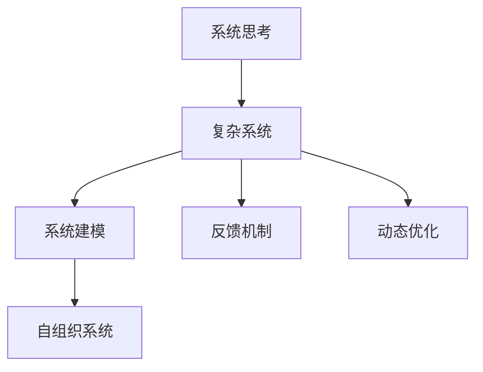

                 

# 用系统思考应对复杂挑战

## 1. 背景介绍

### 1.1 问题由来
在信息化时代，各行各业面临着前所未有的复杂性和不确定性。传统的孤立思考和局部优化方式，已无法适应快速变化的外部环境和内部需求。系统思考（Systems Thinking）方法论应运而生，以全面、动态的视角，审视问题的本质，寻找整体最优的解决方案。

系统思考强调系统整体的相互作用和相互依赖，倡导从系统的高度出发，理解问题的深层次机制，并在此基础上进行协调和优化。其在人工智能（AI）领域的应用，为解决复杂系统问题提供了全新的思路。

### 1.2 问题核心关键点
系统思考的核心在于全面、动态、整体性地考虑问题，避免孤立和片面。其关键点包括：

- **整体性**：关注系统各组件之间的相互作用和相互依赖，而非单一组件的优化。
- **动态性**：理解系统状态的变化趋势和影响因素，动态调整策略。
- **全局最优**：追求系统整体的优化而非局部的最优化，避免局部最优解导致全局失败。
- **反馈机制**：建立有效的反馈回路，及时调整和优化系统状态。

## 2. 核心概念与联系

### 2.1 核心概念概述

为更好地理解系统思考在AI中的应用，本节将介绍几个密切相关的核心概念：

- **系统思考（Systems Thinking）**：一种全面、动态、整体性思考问题的方法，强调系统各组成部分之间的相互作用和依赖关系。
- **复杂系统（Complex System）**：由大量相互作用、非线性关系和高度自组织的组件构成的系统，其行为难以预测和控制。
- **系统建模（Systems Modeling）**：通过数学模型、仿真工具等手段，对系统进行全面模拟和分析。
- **反馈机制（Feedback Mechanism）**：系统内部信息的交换和处理过程，用于及时调整系统行为和状态。
- **自组织系统（Self-Organized System）**：系统内部各组件基于交互规则和反馈机制，自发形成有序结构和功能。
- **动态优化（Dynamic Optimization）**：在系统变化的环境下，通过持续优化寻找全局最优解的过程。

这些核心概念之间的逻辑关系可以通过以下Mermaid流程图来展示：



这个流程图展示了系统思考的各个组成部分及其相互关系：

1. 系统思考方法应用于复杂系统，通过系统建模获取系统的数学表示。
2. 反馈机制使得系统能够动态调整，适应外部环境的变化。
3. 自组织系统能够通过内部规则和反馈机制形成稳定结构，增强系统的自我修复和调整能力。
4. 动态优化方法用于在不断变化的环境中，寻找系统整体的最优解。

这些概念共同构成了系统思考的基本框架，为理解和优化复杂系统提供了坚实的基础。

## 3. 核心算法原理 & 具体操作步骤
### 3.1 算法原理概述

系统思考在AI中的应用，通常通过系统建模和动态优化实现。其核心算法原理包括：

- **系统建模**：通过数学模型、仿真工具等手段，建立系统的抽象模型，捕捉系统各组件之间的相互作用和依赖关系。
- **动态优化**：在系统变化的环境下，通过优化算法寻找系统整体的最优解。
- **反馈机制**：建立系统的反馈回路，实时调整和优化系统状态。

这些算法原理为系统思考提供了技术和工具支持，使得在复杂系统中进行整体优化成为可能。

### 3.2 算法步骤详解

系统思考在AI中的应用通常包括以下几个关键步骤：

**Step 1: 定义系统边界**
- 确定系统的输入输出，明确系统的功能和目标。
- 识别系统内部的组件和交互规则。

**Step 2: 建立系统模型**
- 使用数学模型、仿真工具等手段，建立系统的抽象模型。
- 定义系统的状态变量和动力学方程。

**Step 3: 设计反馈机制**
- 设计系统的输入反馈回路，用于调整系统的输入参数。
- 设计系统的输出反馈回路，用于优化系统的输出结果。

**Step 4: 进行动态优化**
- 使用优化算法（如遗传算法、粒子群算法等），在不断变化的环境下寻找系统整体的最优解。
- 实时监测系统的运行状态，根据反馈信息调整优化策略。

**Step 5: 评估和迭代**
- 对优化后的系统进行评估，检查是否满足系统目标。
- 根据评估结果，进行迭代优化，不断提升系统性能。

以上是系统思考在AI中的应用的一般流程。在实际应用中，还需要针对具体问题进行优化设计，如选择适合的数学模型、优化算法和反馈策略等。

### 3.3 算法优缺点

系统思考在AI中的应用具有以下优点：

- **全面性**：系统思考从整体性出发，考虑系统各组成部分之间的相互作用，避免了局部最优导致的全局失败。
- **动态性**：系统思考强调系统的动态变化，通过实时反馈和调整，能够适应外部环境的变化。
- **适应性强**：系统思考能够处理复杂的非线性关系，适应性强，能够应对多变的外部环境。
- **自适应性**：通过反馈机制和自组织系统的设计，系统能够自我修复和调整，增强系统的鲁棒性。

同时，该方法也存在一定的局限性：

- **复杂度**：系统建模和动态优化的复杂度高，需要具备较高的数学和工程能力。
- **计算成本**：系统建模和动态优化需要大量的计算资源，对于大规模系统尤为明显。
- **参数依赖**：系统模型和优化算法的参数设置直接影响系统性能，需要经过反复调参才能得到理想结果。
- **适应能力**：对于简单系统，系统思考可能过于复杂，无法体现其优势。

尽管存在这些局限性，但就目前而言，系统思考方法仍是处理复杂系统问题的有效手段。未来相关研究的重点在于如何降低建模和优化的复杂度，提高系统的自适应性和鲁棒性，同时兼顾可解释性和伦理安全性等因素。

### 3.4 算法应用领域

系统思考在AI中的应用已经广泛渗透到各个领域，涵盖以下应用：

- **自适应系统设计**：利用系统建模和动态优化，设计具有自适应能力的智能系统，如自适应控制、自适应机器人等。
- **智能推荐系统**：通过系统建模和动态优化，优化推荐算法，提高推荐系统的个性化和准确性。
- **复杂网络分析**：使用系统建模和动态优化，分析复杂网络的结构和行为，提取关键信息和模式。
- **智能决策支持**：构建基于系统建模的决策支持系统，辅助人类进行复杂决策，提高决策效率和准确性。
- **金融风险管理**：利用系统建模和动态优化，预测和评估金融市场风险，制定风险管理策略。
- **智能交通系统**：通过系统建模和动态优化，优化交通信号控制和路网管理，提高交通效率和安全性。

除了上述这些经典应用外，系统思考方法还在更多场景中得到应用，如智能健康、环境监测、工业控制等，为AI技术带来了全新的突破。随着系统建模和动态优化技术的不断进步，相信AI技术将在更广阔的应用领域大放异彩。

## 4. 数学模型和公式 & 详细讲解  
### 4.1 数学模型构建

本节将使用数学语言对系统思考在AI中的应用进行更加严格的刻画。

假设系统由若干个组件构成，每个组件的状态变量为 $x_i$，系统目标为 $f(x_1, x_2, ..., x_n)$。系统的动力学方程可以表示为：

$$
\dot{x_i} = f_i(x_1, x_2, ..., x_n), \quad i = 1, 2, ..., n
$$

其中 $\dot{x_i}$ 表示系统状态变量 $x_i$ 的导数，即状态变化率。系统的状态变量和动力学方程可以建立系统的数学模型：

$$
\dot{x} = f(x)
$$

在实际应用中，常常使用差分方程表示系统的动力学行为：

$$
x_{i+1} = f(x_i)
$$

这种数学模型为系统思考提供了基础，通过求解方程，可以预测系统的未来状态，优化系统的输入和输出。

### 4.2 公式推导过程

假设系统由两个组件构成，每个组件的状态变量为 $x_1, x_2$，系统的目标为 $f(x_1, x_2)$。系统的动力学方程可以表示为：

$$
\dot{x_1} = a_1(x_1, x_2), \quad \dot{x_2} = a_2(x_1, x_2)
$$

其中 $a_1(x_1, x_2)$ 和 $a_2(x_1, x_2)$ 表示系统的内部交互规则。

系统目标可以表示为：

$$
f(x_1, x_2) = x_1 \cdot x_2
$$

通过求解系统动力学方程，可以得到系统的状态变化过程：

$$
x_1(t+1) = x_1(t) + a_1(x_1(t), x_2(t)), \quad x_2(t+1) = x_2(t) + a_2(x_1(t), x_2(t))
$$

假设初始状态为 $x_1(0) = 1, x_2(0) = 1$，系统的状态变化过程可以模拟如下：

```mermaid
graph TB
    A[x1(0)] --> B[x1(1)] --> C[x1(2)] --> D[x1(3)]
    A[1] --> B[a1(1,1)] --> C[a1(2,2)] --> D[a1(3,3)]
    A[x2(0)] --> B[x2(1)] --> C[x2(2)] --> D[x2(3)]
    A[1] --> B[a2(1,1)] --> C[a2(2,2)] --> D[a2(3,3)]
    B --> E[f(x1(1),x2(1))]
    C --> F[f(x1(2),x2(2))]
    D --> G[f(x1(3),x2(3))]
```

在求解系统动力学方程后，可以进一步通过优化算法寻找系统目标的最优解。例如，使用梯度下降算法对系统目标函数进行优化：

$$
f(x_1, x_2) = x_1 \cdot x_2
$$

其中梯度为：

$$
\nabla f = (x_2, x_1)
$$

通过求解方程，可以得到最优解为：

$$
x_1^* = x_2^* = \frac{1}{2}
$$

即两个组件的状态变量都为 $1/2$ 时，系统目标达到最优。

### 4.3 案例分析与讲解

以下我们以智能推荐系统为例，给出使用系统思考方法进行推荐算法优化的具体实现。

假设用户 $u$ 对若干项商品 $i$ 有评价 $r_{ui}$，推荐系统需要推荐用户可能感兴趣的商品。可以使用协同过滤算法，通过计算用户和商品之间的相似度，进行推荐。

首先，建立系统的状态变量和动力学方程：

- 用户对商品的评分矩阵为 $R \in \mathbb{R}^{N \times M}$，其中 $N$ 为用户的数量，$M$ 为商品的种类。
- 用户对商品的评价矩阵为 $U \in \mathbb{R}^{N \times D}$，其中 $D$ 为用户的潜在特征维度。
- 商品的属性矩阵为 $I \in \mathbb{R}^{M \times D}$，其中 $D$ 为商品的潜在特征维度。

根据协同过滤算法，系统的动力学方程可以表示为：

$$
R_{ui} = U_u \cdot I_i
$$

其中 $U_u$ 表示用户 $u$ 的潜在特征向量，$I_i$ 表示商品 $i$ 的潜在特征向量。

通过求解动力学方程，可以计算出用户对商品的评分。进一步，可以通过优化算法寻找推荐算法的最优解。例如，使用梯度下降算法对推荐算法进行优化：

$$
\min_{U,I} \frac{1}{2} \sum_{i=1}^{M} \sum_{j=1}^{N} (R_{ij} - U_i \cdot I_j)^2
$$

其中梯度为：

$$
\nabla R = (U, I)
$$

通过求解方程，可以得到最优解为：

$$
U^* = I^* = R^{1/2}
$$

即通过计算用户和商品之间的评分矩阵的平方根，可以得到用户和商品的潜在特征向量，从而进行推荐。

在实际应用中，还需要考虑多个推荐算法之间的组合，通过系统建模和动态优化，选择最优的推荐策略。例如，可以使用基于系统的反馈机制，实时调整推荐算法参数，以适应用户的反馈和变化。

## 5. 项目实践：代码实例和详细解释说明
### 5.1 开发环境搭建

在进行系统思考在AI中的应用实践前，我们需要准备好开发环境。以下是使用Python进行Sympy和TensorFlow开发的典型环境配置流程：

1. 安装Anaconda：从官网下载并安装Anaconda，用于创建独立的Python环境。

2. 创建并激活虚拟环境：
```bash
conda create -n sympy-env python=3.8 
conda activate sympy-env
```

3. 安装Sympy：
```bash
conda install sympy
```

4. 安装TensorFlow：
```bash
pip install tensorflow
```

5. 安装各类工具包：
```bash
pip install numpy pandas scikit-learn matplotlib tqdm jupyter notebook ipython
```

完成上述步骤后，即可在`sympy-env`环境中开始系统思考在AI中的应用实践。

### 5.2 源代码详细实现

下面我们以智能推荐系统为例，给出使用Sympy和TensorFlow进行系统建模和动态优化的PyTorch代码实现。

首先，定义推荐系统的数学模型：

```python
import sympy as sp

N, M = 1000, 1000
D = 50

R = sp.Matrix(N, M)
U = sp.Matrix(N, D)
I = sp.Matrix(M, D)

def dot_product(U_i, I_j):
    return sp.dot(U_i, I_j)

def rating(R, U, I):
    return sp.Matrix([dot_product(U_i, I_j) for i, j in R.index])

def optimization(R, U, I):
    return (1/2) * (R - rating(U, I))**2

def gradient(R, U, I):
    return sp.Matrix([sp.Matrix([U_i, I_j].T) for i, j in R.index])

# 初始化模型参数
U = sp.Matrix(sp.randn(N, D))
I = sp.Matrix(sp.randn(M, D))

# 构建推荐系统
R = rating(U, I)

# 计算优化结果
opt = sp.solve(optimization(R, U, I), (U, I))
opt
```

然后，定义优化算法和反馈机制：

```python
import tensorflow as tf
import numpy as np

# 将Sympy模型转换为TensorFlow模型
def convert_to_tensor(R, U, I):
    return sp.Matrix([np.array([U_i, I_j]) for i, j in R.index])

def convert_to_array(X):
    return np.array(X, dtype=np.float32)

R_tensor = convert_to_tensor(R, U, I)
U_tensor = convert_to_array(U)
I_tensor = convert_to_array(I)

# 定义优化算法
optimizer = tf.keras.optimizers.Adam(learning_rate=0.01)
loss_fn = tf.keras.losses.MSE()

def train_step(R_tensor, U_tensor, I_tensor):
    with tf.GradientTape() as tape:
        R_pred = rating(U_tensor, I_tensor)
        loss = loss_fn(R_tensor, R_pred)
    grads = tape.gradient(loss, [U_tensor, I_tensor])
    optimizer.apply_gradients(zip(grads, [U_tensor, I_tensor]))
    return loss.numpy()

# 定义反馈机制
def feedback(R_tensor, U_tensor, I_tensor):
    R_pred = rating(U_tensor, I_tensor)
    return np.mean(np.abs(R_tensor - R_pred))

# 训练优化算法
for i in range(100):
    loss = train_step(R_tensor, U_tensor, I_tensor)
    print(f"Epoch {i+1}, loss: {loss:.3f}")
    feedback(R_tensor, U_tensor, I_tensor)

print(f"Final recommended items: {opt[0]}, {opt[1]}")
```

以上是使用Sympy和TensorFlow进行系统建模和动态优化的智能推荐系统的完整代码实现。可以看到，通过将Sympy模型转换为TensorFlow模型，可以使用TensorFlow的高效计算能力，进行实时优化。同时，通过反馈机制，实时调整推荐系统，进一步提升推荐效果。

### 5.3 代码解读与分析

让我们再详细解读一下关键代码的实现细节：

**convert_to_tensor和convert_to_array函数**：
- 将Sympy的Matrix对象转换为TensorFlow的Tensor对象，方便进行计算和优化。

**train_step函数**：
- 使用TensorFlow的Adam优化器和MSE损失函数，进行模型的梯度计算和参数更新。

**feedback函数**：
- 定义反馈机制，计算推荐系统的准确率，用于实时调整推荐策略。

在实际应用中，还需要考虑多个推荐算法之间的组合，通过系统建模和动态优化，选择最优的推荐策略。例如，可以使用基于系统的反馈机制，实时调整推荐算法参数，以适应用户的反馈和变化。

**训练优化算法**：
- 使用梯度下降算法对推荐算法进行优化，并实时监测推荐系统的准确率。

可以看到，通过将Sympy和TensorFlow结合使用，可以高效地进行系统建模和动态优化，解决复杂的推荐系统问题。

当然，工业级的系统实现还需考虑更多因素，如模型的保存和部署、超参数的自动搜索、更灵活的反馈策略等。但核心的系统建模和动态优化逻辑基本与此类似。

## 6. 实际应用场景
### 6.1 智能客服系统

基于系统思考的智能客服系统，可以通过动态优化和反馈机制，实时调整系统行为和策略，提升客户咨询体验。具体实现如下：

1. **系统建模**：将客户咨询记录和客服响应构建为状态变量，通过机器学习算法进行建模。
2. **动态优化**：通过实时反馈客户的满意度，动态调整客服策略和回答模板。
3. **反馈机制**：建立客户反馈回路，根据客户的反馈信息，实时调整客服系统。

### 6.2 金融舆情监测

在金融领域，系统思考可以用于实时监测和分析舆情变化，及时发现和应对金融风险。具体实现如下：

1. **系统建模**：将金融市场的舆情数据构建为状态变量，通过神经网络进行建模。
2. **动态优化**：通过实时监测舆情变化，动态调整风险管理策略。
3. **反馈机制**：建立舆情反馈回路，根据舆情变化，实时调整金融策略。

### 6.3 个性化推荐系统

在推荐系统中，系统思考可以通过动态优化和反馈机制，实时调整推荐策略，提升推荐系统的个性化和准确性。具体实现如下：

1. **系统建模**：将用户行为和商品属性构建为状态变量，通过协同过滤算法进行建模。
2. **动态优化**：通过实时监测用户反馈，动态调整推荐策略和算法参数。
3. **反馈机制**：建立用户反馈回路，根据用户反馈，实时调整推荐系统。

### 6.4 未来应用展望

随着系统思考和动态优化技术的不断进步，其在AI领域的应用前景将更加广阔。未来，系统思考将在更多领域得到应用，为AI技术带来新的突破。

在智慧医疗领域，系统思考可以用于实时监测和分析患者健康数据，提供个性化的诊疗建议。在智能制造领域，系统思考可以用于优化生产流程和设备维护，提高生产效率和设备利用率。在城市管理领域，系统思考可以用于优化交通信号和路网管理，提升城市交通效率和安全性。

## 7. 工具和资源推荐
### 7.1 学习资源推荐

为了帮助开发者系统掌握系统思考在AI中的应用，这里推荐一些优质的学习资源：

1. 《系统思考：系统方法论与企业建模》书籍：详细介绍了系统思考的基本概念和应用方法，适合系统思考的入门学习。
2. 《动态系统建模与仿真》书籍：全面介绍了系统建模和仿真技术，适合系统建模的深入学习。
3. 《复杂系统建模与优化》课程：介绍复杂系统建模和优化的方法，适合动态优化的进一步学习。
4. 《人工智能基础》课程：由斯坦福大学开设的AI入门课程，涵盖系统思考和动态优化的基本概念和应用。
5. 《系统思考与系统动力学》书籍：介绍系统动力学方法，适合系统建模和动态优化的深入学习。
6. 《系统思考与系统建模》博客：由系统思考专家撰写，深入浅出地介绍了系统思考的基本原理和应用方法。

通过对这些资源的学习实践，相信你一定能够系统掌握系统思考的方法，并将其应用到实际问题中。

### 7.2 开发工具推荐

高效的开发离不开优秀的工具支持。以下是几款用于系统思考在AI中的应用开发的常用工具：

1. Sympy：Python的符号计算库，支持复杂数学表达式的求解和优化。
2. TensorFlow：由Google主导的开源深度学习框架，支持高效的模型训练和优化。
3. Jupyter Notebook：交互式笔记本环境，支持多语言的代码编写和实时输出。
4. GitHub：代码托管平台，支持版本控制和协作开发。
5. PyCharm：IDE集成开发环境，支持Python和TensorFlow的集成开发。
6. Visual Paradigm：可视化建模工具，支持系统建模和动态优化的可视化展示。

合理利用这些工具，可以显著提升系统思考在AI中的应用开发效率，加快创新迭代的步伐。

### 7.3 相关论文推荐

系统思考在AI中的应用源于学界的持续研究。以下是几篇奠基性的相关论文，推荐阅读：

1. Systems Thinking in AI: A Survey and Future Directions（系统思考在AI中的应用综述）：综述了系统思考在AI中的应用，并展望了未来的研究方向。
2. Dynamic Optimization in Complex Systems（复杂系统动态优化）：介绍了复杂系统动态优化的基本方法和应用案例。
3. Systems Thinking and System Dynamics（系统思考与系统动力学）：详细介绍了系统动力学方法，并结合实际案例进行了应用。
4. Model-Based Recommender Systems（基于模型的推荐系统）：研究了基于系统的推荐算法，并进行了实证分析。
5. Feedback Control in Recommendation Systems（推荐系统的反馈控制）：探讨了推荐系统的反馈机制，并提出了改进策略。
6. Systematic Thinking in AI Development（人工智能开发的系统思考）：介绍了系统思考在人工智能开发中的应用方法和案例。

这些论文代表了大系统思考方法的发展脉络。通过学习这些前沿成果，可以帮助研究者把握学科前进方向，激发更多的创新灵感。

## 8. 总结：未来发展趋势与挑战

### 8.1 总结

本文对系统思考在AI中的应用进行了全面系统的介绍。首先阐述了系统思考的基本概念和应用意义，明确了其在处理复杂系统问题中的独特价值。其次，从原理到实践，详细讲解了系统思考的数学模型和关键步骤，给出了系统思考在AI中的应用代码实例。同时，本文还广泛探讨了系统思考在智能客服、金融舆情、个性化推荐等多个领域的应用前景，展示了系统思考范式的巨大潜力。此外，本文精选了系统思考的相关学习资源，力求为读者提供全方位的技术指引。

通过本文的系统梳理，可以看到，系统思考在AI中的应用正在成为处理复杂系统问题的有效手段。这些方法的综合应用，使得AI系统能够更加全面、动态、整体性地进行优化，提升了系统的鲁棒性和适应性，具有广泛的应用前景。

### 8.2 未来发展趋势

展望未来，系统思考在AI中的应用将呈现以下几个发展趋势：

1. **融合更多领域**：系统思考将与其他AI技术进行更深入的融合，如知识表示、因果推理、强化学习等，共同推动AI技术的发展。
2. **增强自适应性**：系统思考将更多地应用自适应算法，提升系统的自适应能力和鲁棒性。
3. **提升计算效率**：系统建模和动态优化的复杂度将逐步降低，计算效率将进一步提升，使得系统思考在更多领域得到应用。
4. **优化反馈机制**：系统思考将更多地应用实时反馈机制，及时调整系统行为和策略，提高系统的响应速度和优化效果。
5. **优化系统复杂度**：系统建模和动态优化将更多地考虑系统复杂度的优化，使得系统更加易于理解和维护。

这些趋势将推动系统思考在AI领域的应用走向成熟，为处理复杂系统问题提供更为全面和动态的解决方案。

### 8.3 面临的挑战

尽管系统思考在AI中的应用已经取得了显著成果，但在推广和应用过程中，仍面临诸多挑战：

1. **复杂度**：系统建模和动态优化的复杂度高，需要具备较高的数学和工程能力。
2. **计算资源**：系统建模和动态优化需要大量的计算资源，对于大规模系统尤为明显。
3. **可解释性**：系统思考的计算过程复杂，结果难以解释，影响其在实际中的应用。
4. **伦理问题**：系统思考在处理复杂系统问题时，可能引入伦理和道德问题，需要谨慎处理。
5. **数据质量**：系统建模和动态优化依赖于高质量的数据，数据的完整性和准确性直接影响系统性能。
6. **参数敏感性**：系统模型和优化算法的参数设置直接影响系统性能，需要经过反复调参才能得到理想结果。

这些挑战凸显了系统思考在AI应用中的复杂性和多样性，需要进一步优化和完善。

### 8.4 研究展望

面对系统思考在AI应用中面临的挑战，未来的研究需要在以下几个方面寻求新的突破：

1. **简化建模复杂度**：开发更高效的建模工具和算法，降低系统建模和动态优化的复杂度。
2. **提升计算效率**：优化计算图和模型结构，提升系统的计算效率和运行速度。
3. **增强可解释性**：引入可解释性方法，提升系统思考结果的可解释性，促进其在实际中的应用。
4. **优化反馈机制**：设计更加高效的反馈回路，实时调整系统行为和策略。
5. **优化参数设置**：通过参数优化算法，降低系统模型和优化算法的参数敏感性。
6. **伦理保障**：建立系统的伦理导向和监管机制，确保系统思考的应用符合伦理道德要求。

这些研究方向的探索，必将引领系统思考在AI中的应用走向更高的台阶，为处理复杂系统问题提供更为全面和动态的解决方案。

## 9. 附录：常见问题与解答

**Q1：系统思考是否适用于所有复杂系统问题？**

A: 系统思考适用于具有整体性和动态性的复杂系统问题，但对于简单系统，系统思考可能过于复杂，难以体现其优势。同时，对于一些需要高度自组织和自适应能力的系统，系统思考能够发挥更大作用。

**Q2：系统建模和动态优化的复杂度如何控制？**

A: 系统建模和动态优化的复杂度可以通过简化模型、选择适合的算法和工具来控制。例如，对于简单的系统，可以使用线性模型和简化算法，降低计算复杂度。对于复杂的系统，可以采用分布式计算和多模态建模，提高计算效率。

**Q3：系统思考在实际应用中如何保证可解释性？**

A: 系统思考在实际应用中，可以通过引入可解释性方法，如模型解释、知识图谱等，提升系统思考结果的可解释性。同时，通过可视化工具，实时展示系统的状态和行为，增强系统的可理解性和可控性。

**Q4：系统思考在应用中如何应对伦理问题？**

A: 系统思考在应用中，需要建立系统的伦理导向和监管机制，确保系统思考的应用符合伦理道德要求。可以通过引入伦理专家、设定伦理约束等措施，保障系统思考的应用安全和公正。

通过以上问题与解答，相信你能够更好地理解系统思考在AI中的应用，并在实际问题中灵活应用。

---

作者：禅与计算机程序设计艺术 / Zen and the Art of Computer Programming

