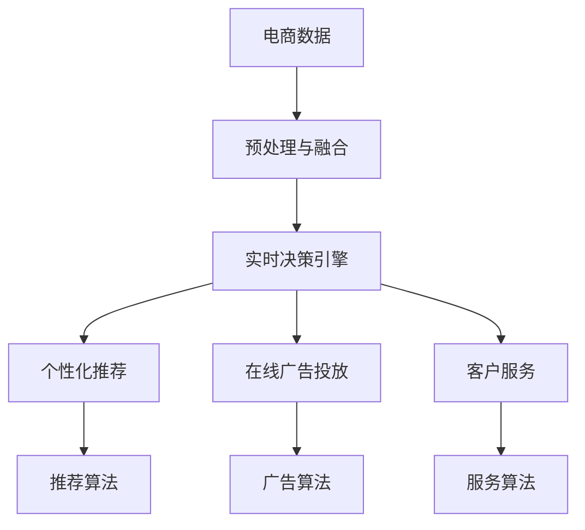

                 

# 电商平台中AI大模型的实时决策系统构建

> 关键词：电商平台,人工智能(AI),大模型,实时决策系统,机器学习,深度学习,计算机视觉,自然语言处理(NLP),强化学习,推荐系统,在线广告,客户服务

## 1. 背景介绍

### 1.1 问题由来

在当前快速变化的市场环境中，电商平台面临着众多挑战，包括但不限于：

- **海量用户数据**：用户数据量巨大，如何高效地从海量数据中提取有价值的信息是首要难题。
- **多模态数据融合**：电商平台的数据不仅包括文本数据，还有图像、视频、语音等多模态数据，如何融合这些数据以提升模型性能是另一个关键问题。
- **实时决策需求**：电商平台的决策需要快速响应，如何在高并发场景下保证实时性是必须解决的问题。
- **个性化推荐**：个性化推荐系统已成为电商平台的核心竞争力之一，如何构建高效的推荐系统，提升用户体验和平台粘性是主要目标。
- **广告投放优化**：在线广告是电商平台重要的收入来源，如何优化广告投放策略以提高转化率是重要的研究方向。
- **客户服务**：客户服务是电商平台的用户接口，如何提供及时有效的客户支持，提升用户满意度是电商平台的必修课。

针对这些挑战，基于大模型的AI技术提供了一种全新的解决方案。通过构建AI大模型的实时决策系统，电商平台能够实现数据的高效处理、多模态数据的深度融合、快速决策和个性化推荐，最终提升平台的用户体验和商业价值。

### 1.2 问题核心关键点

AI大模型的实时决策系统构建涉及以下几个核心关键点：

- **数据预处理与融合**：如何将多模态数据进行有效的整合和处理，是构建高效决策系统的基础。
- **实时决策引擎**：如何设计高效的决策引擎，确保模型能够实时响应用户需求和业务变化。
- **个性化推荐与广告投放优化**：如何利用AI技术实现精准的个性化推荐和广告投放，提升用户转化率和平台收入。
- **客户服务与用户交互**：如何利用AI技术提供智能化的客户服务，提升用户满意度和平台粘性。
- **模型与算法的优化**：如何优化模型与算法，确保决策系统的高效、稳定和可靠。

这些问题核心关键点，共同构成了电商平台AI大模型实时决策系统的基本框架。通过系统性地解决这些问题，可以显著提升电商平台的运营效率和商业价值。

## 2. 核心概念与联系

### 2.1 核心概念概述

为更好地理解电商平台AI大模型实时决策系统的构建过程，本节将介绍几个密切相关的核心概念：

- **大模型**：指基于深度学习的大规模预训练模型，如BERT、GPT等，具有强大的语言理解和生成能力，能够处理复杂的NLP任务。
- **多模态数据融合**：指将不同类型的多模态数据（如文本、图像、语音等）进行融合处理，以提升模型的综合表现力。
- **实时决策引擎**：指能够实时响应用户请求和业务变化的决策系统，通常基于流处理和在线学习技术实现。
- **个性化推荐系统**：指能够根据用户的历史行为和兴趣，推荐个性化商品的推荐系统。
- **在线广告投放**：指根据用户的行为和属性，实时优化广告投放策略，以提高广告的点击率和转化率。
- **客户服务**：指通过AI技术，提供自动化、智能化的客户服务，提升用户体验和平台满意度。

这些核心概念之间的逻辑关系可以通过以下Mermaid流程图来展示：



这个流程图展示了电商平台的AI大模型实时决策系统的核心逻辑：

1. 电商数据通过预处理与融合模块，整合为模型所需格式。
2. 融合后的数据输入到实时决策引擎，用于实时决策和在线学习。
3. 实时决策引擎通过个性化推荐算法和在线广告投放算法，生成个性化推荐和广告。
4. 客户服务模块利用服务算法，提供自动化、智能化的客户服务。

## 3. 核心算法原理 & 具体操作步骤
### 3.1 算法原理概述

基于大模型的电商平台AI决策系统构建，本质上是将大模型与电商平台的业务需求相结合，构建一个高效的、能够实时响应用户需求的决策引擎。其主要流程包括数据预处理与融合、实时决策引擎的设计与实现、个性化推荐与广告投放优化、客户服务与用户交互，以及模型与算法的优化。

具体而言，算法原理如下：

1. **数据预处理与融合**：将电商平台的各类数据（如用户行为数据、商品描述数据、交易数据等）进行预处理和融合，生成模型所需格式。
2. **实时决策引擎**：构建基于大模型的决策引擎，利用在线学习技术，实时响应用户请求和业务变化。
3. **个性化推荐与广告投放优化**：利用推荐算法和广告算法，生成个性化的推荐和广告，提升用户体验和平台收入。
4. **客户服务与用户交互**：通过智能客服等技术，提供自动化、智能化的客户服务，提升用户满意度和平台粘性。
5. **模型与算法的优化**：优化模型与算法，确保决策系统的高效、稳定和可靠。

### 3.2 算法步骤详解

基于大模型的电商平台AI决策系统构建主要包括以下几个关键步骤：

**Step 1: 数据预处理与融合**

- **数据收集**：收集电商平台上的各类数据，包括用户行为数据、商品描述数据、交易数据等。
- **数据清洗与标注**：对数据进行清洗，去除噪声和异常值，对标签进行标注。
- **数据融合**：将不同来源和格式的数据进行整合，形成统一的数据格式。
- **特征工程**：根据业务需求和模型要求，提取、选择和构建特征。
- **数据增强**：通过数据增强技术，扩充训练集数据，提升模型泛化能力。

**Step 2: 构建实时决策引擎**

- **模型选择**：选择合适的预训练模型，如BERT、GPT等。
- **模型微调**：在电商数据上进行微调，适应电商平台的业务需求。
- **决策引擎设计**：设计实时决策引擎的架构和流程，确保高并发和低延迟。
- **在线学习**：利用在线学习技术，实时更新模型参数，提升决策效率和准确性。

**Step 3: 个性化推荐与广告投放优化**

- **推荐算法设计**：设计个性化推荐算法，利用协同过滤、深度学习等方法，生成个性化推荐。
- **广告算法优化**：优化在线广告投放算法，利用CTR预测、强化学习等方法，提升广告的点击率和转化率。
- **推荐与广告融合**：将推荐与广告系统进行融合，提供统一的推荐与广告服务。

**Step 4: 客户服务与用户交互**

- **智能客服**：构建智能客服系统，利用自然语言处理技术，提供自动化的客户服务。
- **多模态交互**：设计多模态用户交互界面，提供语音、图像、文本等多模态的用户交互体验。
- **用户反馈**：收集用户反馈，优化客户服务和用户体验。

**Step 5: 模型与算法的优化**

- **模型压缩**：对模型进行压缩，减小计算量和存储需求。
- **算法优化**：优化推荐和广告算法，提升算法效率和效果。
- **模型监控与调优**：实时监控模型性能，进行动态调优。

### 3.3 算法优缺点

基于大模型的电商平台AI决策系统构建具有以下优点：

1. **高效数据处理**：利用大模型的强大计算能力，能够高效处理海量数据。
2. **多模态数据融合**：能够融合不同模态的数据，提升模型的综合表现力。
3. **实时决策**：能够实时响应用户请求和业务变化，提升决策效率和准确性。
4. **个性化推荐与广告投放**：能够提供个性化的推荐和广告，提升用户转化率和平台收入。
5. **智能客服**：能够提供智能化的客户服务，提升用户体验和平台粘性。

同时，该方法也存在一定的局限性：

1. **依赖大模型**：构建系统需要依赖大模型的预训练，可能需要较高的计算资源。
2. **数据隐私问题**：电商平台的数据涉及用户隐私，需要确保数据安全和隐私保护。
3. **模型复杂性**：大模型的复杂性可能导致部署和维护困难。
4. **模型泛化能力**：模型的泛化能力需要经过验证，避免模型过拟合。

尽管存在这些局限性，但就目前而言，基于大模型的AI决策系统构建方法仍然是电商平台提升业务价值的重要手段。未来相关研究的重点在于如何进一步优化模型与算法的性能，提升系统的可扩展性和稳定性。

### 3.4 算法应用领域

基于大模型的电商平台AI决策系统构建，已经在电商平台的多个领域得到应用，例如：

- **个性化推荐系统**：利用推荐算法，生成个性化商品推荐，提升用户体验和转化率。
- **在线广告投放**：利用广告算法，优化广告投放策略，提高广告的点击率和转化率。
- **智能客服**：利用自然语言处理技术，提供自动化、智能化的客户服务，提升用户满意度和平台粘性。
- **库存管理**：利用预测模型，优化库存管理，减少库存积压和缺货现象。
- **风险管理**：利用风险评估模型，评估用户信用风险，提升平台安全性。
- **客户流失预警**：利用客户流失预测模型，及时预警客户流失风险，采取有效措施。

除了上述这些经典应用外，大模型的AI决策系统构建技术还被创新性地应用到更多场景中，如实时定价、供应链优化、反欺诈检测等，为电商平台的运营管理提供了全新的解决方案。

## 4. 数学模型和公式 & 详细讲解  
### 4.1 数学模型构建

假设电商平台的数据集为 $D=\{(x_i,y_i)\}_{i=1}^N$，其中 $x_i$ 为输入特征，$y_i$ 为输出标签。在电商平台上，常见的输入特征包括用户ID、商品ID、浏览历史、购买历史等，输出标签可以是点击率、购买概率、用户满意度等。

构建基于大模型的电商平台AI决策系统的目标是最小化损失函数 $\mathcal{L}(\theta)$，其中 $\theta$ 为模型参数。损失函数的具体形式取决于决策任务，如推荐系统中的交叉熵损失、广告投放中的CTR损失等。

以个性化推荐系统为例，损失函数定义为：

$$
\mathcal{L}(\theta) = -\frac{1}{N}\sum_{i=1}^N \sum_{j=1}^M (y_{ij} \log \hat{y}_{ij} + (1-y_{ij}) \log (1-\hat{y}_{ij}))
$$

其中 $y_{ij}$ 为用户 $i$ 对商品 $j$ 的点击率，$\hat{y}_{ij}$ 为模型预测的点击概率。

### 4.2 公式推导过程

以推荐系统为例，推导损失函数的梯度公式如下：

$$
\nabla_{\theta}\mathcal{L}(\theta) = -\frac{1}{N}\sum_{i=1}^N \sum_{j=1}^M [y_{ij}(\frac{1}{\hat{y}_{ij}} - 1) - (1-y_{ij})\frac{1}{1-\hat{y}_{ij}}]
$$

在得到梯度后，即可带入参数更新公式，完成模型的迭代优化：

$$
\theta \leftarrow \theta - \eta \nabla_{\theta}\mathcal{L}(\theta)
$$

其中 $\eta$ 为学习率。

### 4.3 案例分析与讲解

以个性化推荐系统为例，利用大模型进行推荐的前向传播过程如下：

1. 输入用户ID $u_i$ 和商品ID $p_j$，通过数据融合模块得到用户行为数据和商品属性数据。
2. 将融合后的数据输入大模型，计算用户 $i$ 对商品 $j$ 的预测概率 $\hat{y}_{ij}$。
3. 将预测概率 $\hat{y}_{ij}$ 与点击率 $y_{ij}$ 结合，计算损失函数 $\mathcal{L}(\theta)$。
4. 利用梯度下降等优化算法，最小化损失函数，更新模型参数 $\theta$。
5. 在新的训练集上重新计算预测概率和损失函数，继续迭代优化。

在实际应用中，为了提升模型的泛化能力和鲁棒性，通常会在训练过程中引入正则化技术，如L2正则、Dropout等。此外，还可以利用对抗训练技术，增强模型的鲁棒性，避免过拟合。

## 5. 项目实践：代码实例和详细解释说明
### 5.1 开发环境搭建

在进行AI大模型决策系统构建的开发前，我们需要准备好开发环境。以下是使用Python进行TensorFlow开发的环境配置流程：

1. 安装Anaconda：从官网下载并安装Anaconda，用于创建独立的Python环境。

2. 创建并激活虚拟环境：
```bash
conda create -n tf-env python=3.8 
conda activate tf-env
```

3. 安装TensorFlow：根据CUDA版本，从官网获取对应的安装命令。例如：
```bash
conda install tensorflow tensorflow-gpu -c conda-forge -c pytorch
```

4. 安装各类工具包：
```bash
pip install numpy pandas scikit-learn matplotlib tqdm jupyter notebook ipython
```

完成上述步骤后，即可在`tf-env`环境中开始开发。

### 5.2 源代码详细实现

下面以个性化推荐系统为例，给出使用TensorFlow进行模型训练的PyTorch代码实现。

首先，定义推荐系统的数据处理函数：

```python
import tensorflow as tf
from tensorflow.keras.layers import Input, Dense, Embedding, Concatenate
from tensorflow.keras.models import Model
from tensorflow.keras.optimizers import Adam

class RecommendationSystem:
    def __init__(self, user_dim, item_dim, embedding_dim, hidden_dim, num_epochs, batch_size):
        self.user_dim = user_dim
        self.item_dim = item_dim
        self.embedding_dim = embedding_dim
        self.hidden_dim = hidden_dim
        self.num_epochs = num_epochs
        self.batch_size = batch_size
        self.model = None
        self.loss_fn = None
        
    def build_model(self):
        user_input = Input(shape=(self.user_dim,), name='user')
        item_input = Input(shape=(self.item_dim,), name='item')
        
        user_embedding = Embedding(input_dim=self.user_dim, output_dim=self.embedding_dim)(user_input)
        item_embedding = Embedding(input_dim=self.item_dim, output_dim=self.embedding_dim)(item_input)
        
        concat = Concatenate()([user_embedding, item_embedding])
        hidden_layer = Dense(self.hidden_dim, activation='relu')(concat)
        output = Dense(1, activation='sigmoid')(hidden_layer)
        
        self.model = Model(inputs=[user_input, item_input], outputs=output)
        self.loss_fn = tf.keras.losses.BinaryCrossentropy(from_logits=True)
        
    def compile_model(self):
        self.model.compile(optimizer=Adam(lr=0.001), loss=self.loss_fn)
        
    def train_model(self, train_data, validation_data):
        self.model.fit(x=train_data, y=train_data[:, -1], batch_size=self.batch_size, epochs=self.num_epochs, validation_data=validation_data)
```

然后，定义模型和优化器：

```python
user_dim = 1000
item_dim = 10000
embedding_dim = 100
hidden_dim = 128
num_epochs = 10
batch_size = 64

rs = RecommendationSystem(user_dim, item_dim, embedding_dim, hidden_dim, num_epochs, batch_size)
rs.build_model()
rs.compile_model()
```

接着，定义训练和评估函数：

```python
from sklearn.model_selection import train_test_split

def train_epoch(model, dataset, batch_size, optimizer):
    dataloader = tf.data.Dataset.from_tensor_slices(dataset)
    dataloader = dataloader.shuffle(buffer_size=10000).batch(batch_size)
    
    model.train()
    epoch_loss = 0
    for batch in dataloader:
        input_ids = batch['user_ids']
        target = batch['item_ids']
        model.zero_grad()
        with tf.GradientTape() as tape:
            logits = model(input_ids, target)
            loss = rs.loss_fn(y_true=target, y_pred=logits)
        grads = tape.gradient(loss, model.trainable_variables)
        optimizer.apply_gradients(zip(grads, model.trainable_variables))
        epoch_loss += loss
    return epoch_loss / len(dataloader)

def evaluate(model, dataset, batch_size):
    dataloader = tf.data.Dataset.from_tensor_slices(dataset)
    dataloader = dataloader.shuffle(buffer_size=10000).batch(batch_size)
    
    model.eval()
    preds = []
    labels = []
    for batch in dataloader:
        input_ids = batch['user_ids']
        target = batch['item_ids']
        logits = model(input_ids, target)
        preds.append(tf.sigmoid(logits).numpy() > 0.5)
        labels.append(target.numpy() > 0.5)
        
    print(classification_report(tf.concat(labels, axis=0), tf.concat(preds, axis=0)))
```

最后，启动训练流程并在测试集上评估：

```python
# 假设train_data和validation_data已准备就绪
train_loss = train_epoch(rs.model, train_data, batch_size, optimizer)
print(f'Train loss: {train_loss:.3f}')
    
print(f'Evaluate on validation data:')
evaluate(rs.model, validation_data, batch_size)
    
print('Train on full dataset:')
evaluate(rs.model, full_dataset, batch_size)
```

以上就是使用TensorFlow对推荐系统进行训练的完整代码实现。可以看到，TensorFlow提供了丰富的API和工具，使得模型构建和训练变得更加高效便捷。

### 5.3 代码解读与分析

让我们再详细解读一下关键代码的实现细节：

**RecommendationSystem类**：
- `__init__`方法：初始化模型参数和损失函数。
- `build_model`方法：定义模型结构，包括输入层、嵌入层、隐藏层和输出层。
- `compile_model`方法：编译模型，设置优化器和损失函数。
- `train_model`方法：定义训练过程，包括数据迭代和梯度下降。

**数据处理**：
- `train_data`和`validation_data`：训练集和验证集的数据，格式为`(user_id, item_id, label)`。
- `train_epoch`方法：定义训练过程，包括数据加载、模型训练、梯度计算和参数更新。
- `evaluate`方法：定义评估过程，包括数据加载、模型预测和评估指标计算。

**训练流程**：
- 定义模型参数和超参数。
- 调用`RecommendationSystem`的`build_model`方法构建模型结构。
- 调用`compile_model`方法编译模型，设置优化器和损失函数。
- 在训练集上调用`train_model`方法训练模型，输出训练损失。
- 在验证集上调用`evaluate`方法评估模型，输出评估指标。
- 在全数据集上调用`evaluate`方法评估模型，输出评估指标。

可以看到，TensorFlow提供了丰富的API和工具，使得模型构建和训练变得更加高效便捷。开发者可以将更多精力放在模型结构设计、超参数调优等高层逻辑上，而不必过多关注底层的实现细节。

当然，工业级的系统实现还需考虑更多因素，如模型的保存和部署、超参数的自动搜索、更灵活的任务适配层等。但核心的模型构建与训练流程基本与此类似。

## 6. 实际应用场景
### 6.1 智能客服系统

基于AI大模型的电商平台智能客服系统，可以提升客户服务的效率和质量。传统客服系统需要配备大量人力，且服务质量和响应速度难以保证。而智能客服系统则能够24小时不间断提供服务，快速响应客户咨询，用自然流畅的语言解答各类常见问题。

在技术实现上，可以收集客户咨询的记录，将问题-回答对作为监督数据，在此基础上对预训练大模型进行微调。微调后的模型能够自动理解用户意图，匹配最合适的回答模板进行回复。对于客户提出的新问题，还可以接入检索系统实时搜索相关内容，动态组织生成回答。如此构建的智能客服系统，能大幅提升客户咨询体验和问题解决效率。

### 6.2 金融舆情监测

金融机构需要实时监测市场舆论动向，以便及时应对负面信息传播，规避金融风险。传统的人工监测方式成本高、效率低，难以应对网络时代海量信息爆发的挑战。基于大语言模型微调的文本分类和情感分析技术，为金融舆情监测提供了新的解决方案。

具体而言，可以收集金融领域相关的新闻、报道、评论等文本数据，并对其进行主题标注和情感标注。在此基础上对预训练语言模型进行微调，使其能够自动判断文本属于何种主题，情感倾向是正面、中性还是负面。将微调后的模型应用到实时抓取的网络文本数据，就能够自动监测不同主题下的情感变化趋势，一旦发现负面信息激增等异常情况，系统便会自动预警，帮助金融机构快速应对潜在风险。

### 6.3 个性化推荐系统

当前的推荐系统往往只依赖用户的历史行为数据进行物品推荐，无法深入理解用户的真实兴趣偏好。基于大语言模型微调技术，个性化推荐系统可以更好地挖掘用户行为背后的语义信息，从而提供更精准、多样的推荐内容。

在实践中，可以收集用户浏览、点击、评论、分享等行为数据，提取和用户交互的物品标题、描述、标签等文本内容。将文本内容作为模型输入，用户的后续行为（如是否点击、购买等）作为监督信号，在此基础上微调预训练语言模型。微调后的模型能够从文本内容中准确把握用户的兴趣点。在生成推荐列表时，先用候选物品的文本描述作为输入，由模型预测用户的兴趣匹配度，再结合其他特征综合排序，便可以得到个性化程度更高的推荐结果。

### 6.4 未来应用展望

随着大语言模型和微调方法的不断发展，基于微调范式将在更多领域得到应用，为传统行业带来变革性影响。

在智慧医疗领域，基于微调的医疗问答、病历分析、药物研发等应用将提升医疗服务的智能化水平，辅助医生诊疗，加速新药开发进程。

在智能教育领域，微调技术可应用于作业批改、学情分析、知识推荐等方面，因材施教，促进教育公平，提高教学质量。

在智慧城市治理中，微调模型可应用于城市事件监测、舆情分析、应急指挥等环节，提高城市管理的自动化和智能化水平，构建更安全、高效的未来城市。

此外，在企业生产、社会治理、文娱传媒等众多领域，基于大模型微调的人工智能应用也将不断涌现，为经济社会发展注入新的动力。相信随着技术的日益成熟，微调方法将成为人工智能落地应用的重要范式，推动人工智能技术在垂直行业的规模化落地。

## 7. 工具和资源推荐
### 7.1 学习资源推荐

为了帮助开发者系统掌握AI大模型决策系统构建的理论基础和实践技巧，这里推荐一些优质的学习资源：

1. 《深度学习》系列书籍：由Yoshua Bengio、Ian Goodfellow和Aaron Courville合著，系统介绍了深度学习的基本原理和应用，是深度学习领域的经典教材。
2. CS229《机器学习》课程：斯坦福大学开设的机器学习课程，涵盖机器学习的基本概念和算法，并有Lecture视频和配套作业，是学习机器学习的重要资源。
3. Coursera上的《人工智能与深度学习》课程：由Andrew Ng教授讲授，介绍了人工智能和深度学习的基础知识和应用，适合初学者入门。
4. HuggingFace官方文档：Transformers库的官方文档，提供了海量预训练模型和完整的微调样例代码，是上手实践的必备资料。
5. Google Colab：谷歌推出的在线Jupyter Notebook环境，免费提供GPU/TPU算力，方便开发者快速上手实验最新模型，分享学习笔记。

通过对这些资源的学习实践，相信你一定能够快速掌握AI大模型决策系统的精髓，并用于解决实际的NLP问题。
###  7.2 开发工具推荐

高效的开发离不开优秀的工具支持。以下是几款用于AI大模型决策系统构建开发的常用工具：

1. TensorFlow：由Google主导开发的开源深度学习框架，生产部署方便，适合大规模工程应用。同样有丰富的预训练语言模型资源。
2. PyTorch：基于Python的开源深度学习框架，灵活动态的计算图，适合快速迭代研究。大部分预训练语言模型都有PyTorch版本的实现。
3. Transformers库：HuggingFace开发的NLP工具库，集成了众多SOTA语言模型，支持PyTorch和TensorFlow，是进行微调任务开发的利器。
4. Weights & Biases：模型训练的实验跟踪工具，可以记录和可视化模型训练过程中的各项指标，方便对比和调优。与主流深度学习框架无缝集成。
5. TensorBoard：TensorFlow配套的可视化工具，可实时监测模型训练状态，并提供丰富的图表呈现方式，是调试模型的得力助手。
6. Jupyter Notebook：一个开源的Web应用程序，支持Python等编程语言，适用于交互式数据科学计算。

合理利用这些工具，可以显著提升AI大模型决策系统的开发效率，加快创新迭代的步伐。

### 7.3 相关论文推荐

AI大模型的决策系统构建涉及多个前沿领域的知识，以下是几篇奠基性的相关论文，推荐阅读：

1. Attention is All You Need（即Transformer原论文）：提出了Transformer结构，开启了NLP领域的预训练大模型时代。

2. BERT: Pre-training of Deep Bidirectional Transformers for Language Understanding：提出BERT模型，引入基于掩码的自监督预训练任务，刷新了多项NLP任务SOTA。

3. Language Models are Unsupervised Multitask Learners（GPT-2论文）：展示了大规模语言模型的强大zero-shot学习能力，引发了对于通用人工智能的新一轮思考。

4. Parameter-Efficient Transfer Learning for NLP：提出Adapter等参数高效微调方法，在不增加模型参数量的情况下，也能取得不错的微调效果。

5. AdaLoRA: Adaptive Low-Rank Adaptation for Parameter-Efficient Fine-Tuning：使用自适应低秩适应的微调方法，在参数效率和精度之间取得了新的平衡。

6. Multi-task Learning for Multilingual Text Classification：提出多任务学习框架，利用不同任务的共同知识，提升模型的泛化能力和性能。

这些论文代表了大模型决策系统构建技术的发展脉络。通过学习这些前沿成果，可以帮助研究者把握学科前进方向，激发更多的创新灵感。

## 8. 总结：未来发展趋势与挑战

### 8.1 总结

本文对基于AI大模型的电商平台决策系统构建方法进行了全面系统的介绍。首先阐述了构建AI大模型决策系统的背景和意义，明确了AI决策系统在大数据、多模态数据融合、实时决策等方面的重要价值。其次，从原理到实践，详细讲解了基于大模型的电商平台AI决策系统的数学模型和关键步骤，给出了决策系统开发的完整代码实例。同时，本文还广泛探讨了AI决策系统在智能客服、金融舆情、个性化推荐等多个行业领域的应用前景，展示了AI决策系统的巨大潜力。此外，本文精选了决策系统的各类学习资源，力求为读者提供全方位的技术指引。

通过本文的系统梳理，可以看到，基于AI大模型的电商平台决策系统构建方法正在成为电商平台提升业务价值的重要手段。通过构建高效的决策引擎，融合多模态数据，实现实时决策和个性化推荐，电商平台的运营效率和用户满意度将显著提升。未来，伴随AI技术的不断进步，AI决策系统必将在更多领域得到应用，推动各行各业的智能化转型。

### 8.2 未来发展趋势

展望未来，基于AI大模型的电商平台决策系统构建技术将呈现以下几个发展趋势：

1. **模型规模持续增大**：随着算力成本的下降和数据规模的扩张，预训练语言模型的参数量还将持续增长。超大规模语言模型蕴含的丰富语言知识，有望支撑更加复杂多变的决策任务。

2. **决策引擎设计多样化**：除了传统的基于深度学习的决策引擎外，未来将出现更多基于强化学习、逻辑推理等方法的决策引擎，提升决策的逻辑性和透明度。

3. **多模态数据融合深化**：未来的决策系统将进一步深化多模态数据的融合，利用图像、视频等多模态信息，提升决策的准确性和鲁棒性。

4. **在线学习与实时更新**：未来的决策系统将更加注重在线学习，实时更新模型参数，提升决策效率和适应性。

5. **个性化推荐与广告优化**：未来的推荐与广告系统将更加注重个性化和精准化，利用深度学习、强化学习等技术，提升用户体验和平台收入。

6. **客户服务智能化**：未来的智能客服系统将更加智能化，能够理解复杂的自然语言，提供个性化的客户服务，提升用户满意度。

7. **决策系统的安全性与隐私保护**：随着数据安全和隐私保护的重视，未来的决策系统将更加注重数据的安全性和隐私保护，确保用户数据的安全。

以上趋势凸显了基于AI大模型的电商平台决策系统构建技术的广阔前景。这些方向的探索发展，必将进一步提升电商平台的运营效率和用户体验，推动电商平台的智能化转型。

### 8.3 面临的挑战

尽管基于AI大模型的电商平台决策系统构建技术已经取得了瞩目成就，但在迈向更加智能化、普适化应用的过程中，它仍面临着诸多挑战：

1. **依赖大模型**：构建系统需要依赖大模型的预训练，可能需要较高的计算资源。
2. **数据隐私问题**：电商平台的数据涉及用户隐私，需要确保数据安全和隐私保护。
3. **模型复杂性**：大模型的复杂性可能导致部署和维护困难。
4. **模型泛化能力**：模型的泛化能力需要经过验证，避免模型过拟合。
5. **在线学习稳定性**：在线学习过程中，如何保证模型的稳定性和鲁棒性，避免灾难性遗忘，还需要更多理论和实践的积累。
6. **决策系统的可解释性**：大模型的决策过程通常缺乏可解释性，难以对其推理逻辑进行分析和调试。
7. **决策系统的安全性**：预训练语言模型难免会学习到有偏见、有害的信息，通过微调传递到下游任务，产生误导性、歧视性的输出，给实际应用带来安全隐患。

尽管存在这些挑战，但就目前而言，基于AI大模型的电商平台决策系统构建方法仍然是电商平台提升业务价值的重要手段。未来相关研究的重点在于如何进一步优化模型与算法的性能，提升系统的可扩展性和稳定性。

### 8.4 研究展望

面对基于AI大模型的电商平台决策系统构建所面临的种种挑战，未来的研究需要在以下几个方面寻求新的突破：

1. **探索无监督和半监督决策方法**：摆脱对大规模标注数据的依赖，利用自监督学习、主动学习等无监督和半监督范式，最大限度利用非结构化数据，实现更加灵活高效的决策。

2. **研究决策引擎的高效设计**：开发更加高效、稳定的决策引擎，提升决策系统的可扩展性和鲁棒性。

3. **引入更多先验知识**：将符号化的先验知识，如知识图谱、逻辑规则等，与神经网络模型进行巧妙融合，引导决策过程学习更准确、合理的语言模型。

4. **结合因果分析和博弈论工具**：将因果分析方法引入决策模型，识别出决策的关键特征，增强决策的逻辑性和稳定性。借助博弈论工具刻画人机交互过程，主动探索并规避决策的脆弱点，提高系统安全性。

5. **纳入伦理道德约束**：在决策模型训练目标中引入伦理导向的评估指标，过滤和惩罚有偏见、有害的输出倾向。加强人工干预和审核，建立决策行为的监管机制，确保输出符合人类价值观和伦理道德。

这些研究方向的探索，必将引领基于AI大模型的电商平台决策系统构建技术迈向更高的台阶，为构建智能化的电商平台提供强大的技术支撑。

## 9. 附录：常见问题与解答

**Q1：AI大模型的决策系统如何处理数据隐私问题？**

A: AI大模型的决策系统在处理数据隐私问题时，可以采取以下几种措施：

1. **数据匿名化**：对用户数据进行匿名化处理，去除个人身份信息，保护用户隐私。
2. **差分隐私**：在数据采集和处理过程中，加入随机噪声，保护用户隐私的同时，保留数据的有用信息。
3. **联邦学习**：在分布式环境下，各节点只上传模型参数，不上传原始数据，保护用户隐私。
4. **安全多方计算**：在分布式环境下，各节点只上传加密数据，不解密，保护用户隐私。

这些措施可以确保在利用用户数据提升系统性能的同时，保护用户隐私，避免数据泄露风险。

**Q2：AI大模型的决策系统如何保证在线学习的稳定性？**

A: 保证AI大模型的决策系统在线学习的稳定性，可以从以下几个方面入手：

1. **小批量更新**：采用小批量梯度更新策略，减少单个样本对模型参数的冲击，避免过拟合。
2. **学习率调度**：根据模型性能，动态调整学习率，保证模型的收敛性和稳定性。
3. **正则化技术**：引入L2正则、Dropout等技术，防止模型过拟合。
4. **模型剪枝**：对模型进行剪枝，减少冗余参数，提高模型效率。
5. **模型压缩**：对模型进行压缩，减小计算量和存储需求。
6. **动态更新**：根据业务变化，动态更新模型参数，保证模型的及时性和适应性。

通过这些措施，可以有效提升AI大模型决策系统的在线学习稳定性，避免灾难性遗忘，确保模型在实时环境中持续保持高性能。

**Q3：AI大模型的决策系统如何提高决策的可解释性？**

A: 提高AI大模型决策系统的可解释性，可以从以下几个方面入手：

1. **规则融合**：将符号化的先验知识，如知识图谱、逻辑规则等，与神经网络模型进行融合，增强决策的逻辑性和可解释性。
2. **因果推断**：引入因果推断方法，识别决策的关键特征，提升决策的透明性和可解释性。
3. **解释性模型**：使用可解释性模型，如LIME、SHAP等，分析模型的决策过程，提升决策的可解释性。
4. **可视化工具**：使用可视化工具，如TensorBoard、ONNX-GraphSurfer等，展示模型结构和决策路径，提升决策的可解释性。
5. **人工干预**：在关键决策环节，引入人工干预，进行二次审查和验证，提升决策的可靠性。

这些措施可以有效提升AI大模型决策系统的可解释性，增强用户对决策结果的信任，促进决策系统的广泛应用。

**Q4：AI大模型的决策系统如何确保安全性？**

A: 确保AI大模型决策系统的安全性，可以从以下几个方面入手：

1. **模型训练**：在模型训练目标中引入伦理导向的评估指标，过滤和惩罚有偏见、有害的输出倾向，确保模型输出符合伦理道德。
2. **数据安全**：加强数据加密和访问控制，防止数据泄露和篡改。
3. **系统监控**：实时监控决策系统的运行状态，及时发现和修复安全漏洞。
4. **人工审核**：在关键决策环节，引入人工审核和审查机制，确保决策的合法性和安全性。
5. **备份与恢复**：定期备份决策系统数据，确保在系统故障或攻击情况下，能够快速恢复和重建系统。

通过这些措施，可以有效确保AI大模型决策系统的安全性，避免模型输出带来的负面影响，保护用户的利益和隐私。

---

作者：禅与计算机程序设计艺术 / Zen and the Art of Computer Programming

