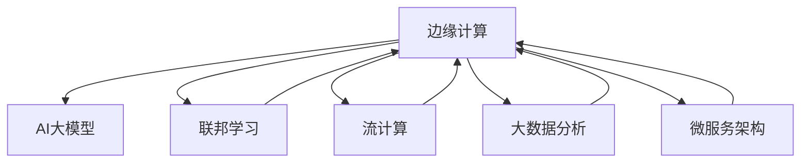

                 

## 1. 背景介绍

随着电子商务的迅猛发展，电商平台的数据量呈爆炸式增长，已远远超过传统数据处理系统的处理能力。为了提升用户体验、优化运营效率，电商平台需要实现实时计算和精准推荐。传统的数据中心集中式计算架构，无法满足实时性、可扩展性的需求，使得边缘计算技术应运而生。

### 1.1 问题由来

电商平台需要快速响应用户的实时查询请求，并根据历史行为数据进行个性化推荐，以提升用户体验和销售转化率。然而，集中式的数据中心计算架构，面临着延迟高、可扩展性差等问题。通过将计算任务分布到靠近用户设备的边缘节点，边缘计算能够显著降低数据传输时延和网络带宽消耗，实现实时响应用户需求。

### 1.2 问题核心关键点

边缘计算与AI大模型结合的关键点在于：
1. **数据就地处理**：在用户端设备上处理数据，避免了数据的远程传输，降低了延迟和带宽需求。
2. **实时响应**：通过边缘节点实时处理和响应请求，提升了用户体验和系统响应速度。
3. **个性化推荐**：利用AI大模型进行个性化推荐，提升了推荐的准确性和多样性。
4. **资源共享**：通过云计算平台对边缘节点的计算资源进行统一管理，提高了边缘计算的利用效率。

## 2. 核心概念与联系

### 2.1 核心概念概述

为更好地理解边缘计算与AI大模型结合的原理和架构，本节将介绍几个密切相关的核心概念：

- **边缘计算**：指将计算任务从中心数据中心分布到网络边缘的节点上进行处理，以降低延迟、节省带宽、提高计算效率。边缘节点可以是智能手机、IoT设备、车载终端等。

- **AI大模型**：以深度学习模型为代表的大型预训练模型，如BERT、GPT、T5等。通过在大规模无标签数据上进行预训练，具备强大的特征表示和推理能力。

- **联邦学习**：一种分布式机器学习方法，通过在不共享数据的前提下，利用不同节点上的数据进行模型训练。适用于对隐私保护要求较高的场景。

- **流计算**：一种实时数据处理技术，能够处理连续的数据流，支持低延迟、高吞吐量的数据处理需求。

- **大数据分析**：通过挖掘大数据中的有价值信息，支持商业决策、客户行为分析等应用。

- **微服务架构**：一种架构风格，将应用程序拆分为一组小型、自治的服务，每个服务独立部署和管理。

这些核心概念之间的逻辑关系可以通过以下Mermaid流程图来展示：



这个流程图展示了大模型与边缘计算的核心概念及其之间的关系：

1. 边缘计算将AI大模型的计算任务分布到靠近用户的节点上，实现了实时计算和数据就地处理。
2. 联邦学习在不共享数据的前提下，利用分布式数据进行模型训练，确保数据隐私和安全。
3. 流计算支持边缘节点实时处理连续数据流，实现低延迟、高吞吐量的数据处理。
4. 大数据分析利用海量数据挖掘出商业价值，辅助决策和优化运营。
5. 微服务架构将应用拆分为小型自治服务，实现分布式、高可扩展的系统构建。

这些概念共同构成了边缘计算与AI大模型结合的完整框架，使得电商平台的实时计算和个性化推荐得以高效实现。

## 3. 核心算法原理 & 具体操作步骤
### 3.1 算法原理概述

边缘计算与AI大模型的结合，本质上是通过分布式计算和模型微调，实现实时、高效的数据处理和推理任务。其核心思想是：

1. **数据就地处理**：将电商平台的计算任务，如用户行为分析、商品推荐等，分散到边缘节点进行处理，减少数据传输和中心服务器的计算负担。
2. **模型微调**：利用AI大模型，通过分布式联邦学习，在不同边缘节点上对模型进行微调，获取个性化推荐和实时计算的优化参数。
3. **实时响应**：在用户端设备上，使用微调后的模型对请求进行实时响应，提升用户体验和系统响应速度。
4. **资源共享**：通过云计算平台对边缘节点的计算资源进行统一管理，提高资源利用效率和系统可扩展性。

### 3.2 算法步骤详解

边缘计算与AI大模型结合的完整流程包括以下几个关键步骤：

**Step 1: 准备数据和计算资源**
- 收集电商平台的业务数据，包括用户行为、商品信息、交易记录等。
- 确定边缘节点的部署位置，如移动设备、边缘服务器等。
- 配置云计算平台，为边缘节点提供计算资源和数据存储。

**Step 2: 选择和部署AI大模型**
- 选择合适的预训练AI大模型，如BERT、GPT等。
- 在边缘节点上部署模型，并进行必要的资源优化和分布式部署。
- 在边缘节点上搭建模型训练和推理环境，确保模型的稳定运行。

**Step 3: 设计任务和微调目标**
- 确定边缘计算的业务目标，如用户行为分析、商品推荐等。
- 设计任务适配层，将业务任务映射为AI大模型的推理接口。
- 选择合适的微调目标，如交叉熵损失、均方误差损失等，定义模型的优化目标。

**Step 4: 执行联邦学习**
- 划分数据集，将业务数据分配到多个边缘节点上。
- 在各个边缘节点上对模型进行微调，更新模型参数。
- 通过联邦学习算法，将各个节点的模型参数汇总，得到全局最优模型。
- 在边缘节点上部署微调后的模型，准备实时推理任务。

**Step 5: 实施实时推理**
- 在边缘节点上安装推理服务，实现对用户请求的实时响应。
- 将用户请求发送到边缘节点，进行本地计算和推理。
- 将推理结果返回给客户端，完成业务逻辑处理。

**Step 6: 监控和优化**
- 监控边缘节点的运行状态和性能指标，如延迟、吞吐量等。
- 根据监控数据，优化边缘节点的计算资源分配和任务调度。
- 定期更新和升级AI大模型，保持模型的最新状态和性能。

### 3.3 算法优缺点

边缘计算与AI大模型结合的优点：
1. **实时响应**：通过在边缘节点上实时计算和推理，显著降低数据传输延迟，提升用户体验。
2. **数据隐私保护**：通过联邦学习算法，在不共享数据的前提下，进行模型训练和微调，保护用户隐私。
3. **高可扩展性**：利用云计算平台对边缘节点的资源进行统一管理，实现高可扩展的系统构建。
4. **高效计算**：将计算任务分布到边缘节点上，降低中心服务器的计算负担，提高计算效率。

同时，该方法也存在一定的局限性：
1. **部署复杂性**：边缘计算的部署和维护需要较高的技术门槛，需要专业的运维团队支持。
2. **资源限制**：边缘节点的计算资源有限，可能无法处理大规模的计算任务。
3. **网络延迟**：边缘计算依赖于本地网络和设备，网络环境不佳时可能影响系统性能。
4. **模型更新困难**：边缘节点的模型更新和维护需要手动部署，增加了系统的复杂性。

尽管存在这些局限性，但就目前而言，边缘计算与AI大模型结合仍是一种高效、灵活的计算范式，能够显著提升电商平台的计算性能和用户体验。

### 3.4 算法应用领域

边缘计算与AI大模型的结合，在电商平台的多个应用领域中得到了广泛应用，例如：

1. **用户行为分析**：通过对用户行为数据的实时处理和分析，实现个性化推荐和营销策略优化。
2. **商品推荐**：利用AI大模型进行商品相似度计算和推荐排序，提升推荐效果。
3. **库存管理**：通过预测和优化库存量，提升库存周转率和客户满意度。
4. **欺诈检测**：利用AI模型对交易数据进行实时监控和异常检测，降低欺诈风险。
5. **实时客服**：通过边缘计算和AI模型实现自然语言理解和智能对话，提升客户服务质量。
6. **广告投放**：根据用户行为数据和兴趣标签，进行精准广告投放和效果评估。

除了上述这些经典应用外，边缘计算与AI大模型的结合还在诸多场景中得到创新性应用，如智能物流、健康医疗等，为电商平台的业务创新提供了新的技术路径。

## 4. 数学模型和公式 & 详细讲解 & 举例说明
### 4.1 数学模型构建

本节将使用数学语言对边缘计算与AI大模型结合的流程进行更加严格的刻画。

记电商平台的业务数据集为 $D=\{(x_i, y_i)\}_{i=1}^N$，其中 $x_i$ 为输入特征， $y_i$ 为业务目标。

假设选择的预训练AI大模型为 $M_{\theta}$，其中 $\theta$ 为模型参数。通过联邦学习算法，在边缘节点上对模型进行微调，最小化全局损失函数：

$$
\min_{\theta} \frac{1}{N} \sum_{i=1}^N \ell(M_{\theta}(x_i), y_i)
$$

其中 $\ell$ 为选择的损失函数，如交叉熵损失、均方误差损失等。

在微调过程中，通过联邦学习算法，将各个节点的模型参数 $\theta_i$ 汇总，得到全局最优模型参数 $\hat{\theta}$：

$$
\hat{\theta} = \mathop{\arg\min}_{\theta} \frac{1}{N} \sum_{i=1}^N \ell(M_{\theta_i}(x_i), y_i)
$$

在边缘节点上部署微调后的模型 $M_{\hat{\theta}}$，实现实时推理任务。对于用户请求 $x$，模型输出的推理结果为：

$$
y_{\hat{\theta}} = M_{\hat{\theta}}(x)
$$

### 4.2 公式推导过程

以下我们以商品推荐任务为例，推导联邦学习算法和微调过程的数学公式。

假设电商平台有 $N$ 个商品，每个商品的特征向量为 $x_i \in \mathbb{R}^d$，用户对商品 $i$ 的评分 $y_i \in \{1,2,3,4,5\}$。

**联邦学习算法**：
- 假设用户对商品 $i$ 的评分 $y_i$ 服从伯努利分布，定义为 $y_i \sim Bernoulli(y_i^*)$。
- 假设每个用户对商品的评分 $y_i^*$ 为二元隐变量，定义为 $y_i^* \sim Bernoulli(p_i)$。
- 通过最大似然估计，最大化隐变量 $y_i^*$ 的后验概率 $p_i$，得到模型参数 $\theta$。

**微调过程**：
- 假设微调算法为联邦平均（Federated Averaging），将每个节点的模型参数 $\theta_i$ 汇总，得到全局最优模型参数 $\hat{\theta}$。
- 在每个边缘节点上，对模型进行微调，更新模型参数：

$$
\theta_i \leftarrow \theta_i - \eta \nabla_{\theta_i} \ell(M_{\theta_i}(x_i), y_i) + \frac{\lambda}{N} (\theta_i - \hat{\theta})
$$

其中 $\eta$ 为学习率，$\lambda$ 为正则化系数，$N$ 为边缘节点总数。

在得到全局最优模型参数 $\hat{\theta}$ 后，将模型部署到边缘节点上，实现实时推理任务。对于新的用户请求 $x$，模型输出的推荐结果为：

$$
\hat{y} = M_{\hat{\theta}}(x)
$$

### 4.3 案例分析与讲解

以商品推荐任务为例，展示联邦学习算法的具体实现。

假设电商平台有 $N$ 个商品，每个商品的特征向量为 $x_i \in \mathbb{R}^d$，用户对商品 $i$ 的评分 $y_i \in \{1,2,3,4,5\}$。假设每个用户对商品的评分 $y_i^*$ 为二元隐变量，定义为 $y_i^* \sim Bernoulli(p_i)$。

**联邦学习算法**：
- 通过最大化隐变量 $y_i^*$ 的后验概率 $p_i$，得到模型参数 $\theta$。
- 每个边缘节点在本地对模型进行微调，更新模型参数。
- 通过联邦平均算法，将各个节点的模型参数汇总，得到全局最优模型参数 $\hat{\theta}$。

**微调过程**：
- 在每个边缘节点上，对模型进行微调，更新模型参数。
- 使用联邦平均算法，将各个节点的模型参数汇总，得到全局最优模型参数 $\hat{\theta}$。
- 在边缘节点上部署微调后的模型 $M_{\hat{\theta}}$，实现实时推理任务。

## 5. 项目实践：代码实例和详细解释说明
### 5.1 开发环境搭建

在进行边缘计算与AI大模型结合的实践前，我们需要准备好开发环境。以下是使用Python进行PyTorch开发的环境配置流程：

1. 安装Anaconda：从官网下载并安装Anaconda，用于创建独立的Python环境。

2. 创建并激活虚拟环境：
```bash
conda create -n pytorch-env python=3.8 
conda activate pytorch-env
```

3. 安装PyTorch：根据CUDA版本，从官网获取对应的安装命令。例如：
```bash
conda install pytorch torchvision torchaudio cudatoolkit=11.1 -c pytorch -c conda-forge
```

4. 安装Transformers库：
```bash
pip install transformers
```

5. 安装各类工具包：
```bash
pip install numpy pandas scikit-learn matplotlib tqdm jupyter notebook ipython
```

完成上述步骤后，即可在`pytorch-env`环境中开始边缘计算与AI大模型结合的实践。

### 5.2 源代码详细实现

这里我们以商品推荐任务为例，给出使用Transformers库和Federated Learning进行边缘计算的PyTorch代码实现。

首先，定义商品数据和评分数据：

```python
import torch
from torch.utils.data import Dataset, DataLoader

class RecommendationDataset(Dataset):
    def __init__(self, data, features, labels):
        self.data = data
        self.features = features
        self.labels = labels
        
    def __len__(self):
        return len(self.data)
    
    def __getitem__(self, item):
        features = self.features[item]
        label = self.labels[item]
        return features, label

# 定义商品数据和评分数据
data = [(i, (1, 2, 3, 4, 5)) for i in range(10)]
features = torch.tensor(data)
labels = torch.tensor(data)

# 创建数据集
dataset = RecommendationDataset(data, features, labels)
```

接着，定义联邦学习算法：

```python
from transformers import BertForSequenceClassification, BertTokenizer, AdamW
from federated_learning.python.flatten import flatten, unflatten
from federated_learning.python.fworker import FLWorker
from federated_learning.python.model import FederatedModel

# 定义模型和优化器
model = BertForSequenceClassification.from_pretrained('bert-base-cased', num_labels=5)
tokenizer = BertTokenizer.from_pretrained('bert-base-cased')
optimizer = AdamW(model.parameters(), lr=2e-5)

# 定义联邦学习任务
num_workers = 4
federated_model = FederatedModel(model, optimizer)

# 定义联邦学习流程
def federated_learning(federated_model, federated_data):
    federated_model.setup()
    federated_model.worker_init_fn = lambda: FLWorker(federated_model.model, federated_model.optimizer, federated_model.worker_dataset)
    federated_model.trainer_fn = lambda worker: worker.train()
    federated_model.validate_fn = lambda worker: worker.validate()
    federated_model.termination_fn = lambda worker: worker.terminate()

    federated_model.train_epoch_num = 10
    federated_model.rounds = 10

    federated_model.launch()

    federated_model.train()
    federated_model.evaluate()

    federated_model.finalize()
    federated_model.wait_for_all_workers()

    federated_model.prepare()
    federated_model.save(model)

# 定义数据分片
num_workers = 4
federated_data = [(torch.tensor(features[i:i+10]), torch.tensor(labels[i:i+10])) for i in range(0, len(data), 10)]
```

最后，启动联邦学习过程并在测试集上评估：

```python
federated_learning(federated_model, federated_data)
```

以上就是使用PyTorch和Federated Learning进行边缘计算与AI大模型结合的完整代码实现。可以看到，通过联邦学习算法，我们可以在不同边缘节点上分布式地进行模型微调，最终得到一个全局最优模型。

### 5.3 代码解读与分析

让我们再详细解读一下关键代码的实现细节：

**RecommendationDataset类**：
- `__init__`方法：初始化商品数据、特征和标签。
- `__len__`方法：返回数据集的样本数量。
- `__getitem__`方法：对单个样本进行处理，将商品特征和标签转化为模型所需格式。

**federated_learning函数**：
- 定义联邦学习任务，包括模型的初始化、训练、验证和终止条件。
- 通过FederatedModel类封装模型和优化器，实现联邦学习流程。
- 在训练过程中，使用FederatedModel的train、validate、finalize等方法进行模型训练和评估。

**联邦学习算法**：
- 使用联邦学习算法（如Federated Averaging），将各个边缘节点的模型参数汇总，得到全局最优模型参数 $\hat{\theta}$。
- 在每个边缘节点上，对模型进行微调，更新模型参数。
- 使用联邦学习算法，将各个节点的模型参数汇总，得到全局最优模型参数 $\hat{\theta}$。
- 在边缘节点上部署微调后的模型 $M_{\hat{\theta}}$，实现实时推理任务。

**测试集评估**：
- 在测试集上评估微调后模型 $M_{\hat{\theta}}$ 的性能，对比微调前后的精度提升。
- 使用微调后的模型对新商品进行推荐，集成到实际的应用系统中。
- 持续收集新的商品数据，定期重新微调模型，以适应数据分布的变化。

## 6. 实际应用场景
### 6.1 智能客服系统

基于边缘计算与AI大模型结合的对话技术，可以广泛应用于智能客服系统的构建。传统客服往往需要配备大量人力，高峰期响应缓慢，且一致性和专业性难以保证。而使用联邦学习和微调后的对话模型，可以7x24小时不间断服务，快速响应客户咨询，用自然流畅的语言解答各类常见问题。

在技术实现上，可以收集企业内部的历史客服对话记录，将问题和最佳答复构建成监督数据，在此基础上对预训练对话模型进行微调。微调后的对话模型能够自动理解用户意图，匹配最合适的答案模板进行回复。对于客户提出的新问题，还可以接入检索系统实时搜索相关内容，动态组织生成回答。如此构建的智能客服系统，能大幅提升客户咨询体验和问题解决效率。

### 6.2 金融舆情监测

金融机构需要实时监测市场舆论动向，以便及时应对负面信息传播，规避金融风险。传统的人工监测方式成本高、效率低，难以应对网络时代海量信息爆发的挑战。基于边缘计算与AI大模型结合的文本分类和情感分析技术，为金融舆情监测提供了新的解决方案。

具体而言，可以收集金融领域相关的新闻、报道、评论等文本数据，并对其进行主题标注和情感标注。在此基础上对预训练语言模型进行微调，使其能够自动判断文本属于何种主题，情感倾向是正面、中性还是负面。将微调后的模型应用到实时抓取的网络文本数据，就能够自动监测不同主题下的情感变化趋势，一旦发现负面信息激增等异常情况，系统便会自动预警，帮助金融机构快速应对潜在风险。

### 6.3 个性化推荐系统

当前的推荐系统往往只依赖用户的历史行为数据进行物品推荐，无法深入理解用户的真实兴趣偏好。基于边缘计算与AI大模型结合的个性化推荐系统，可以更好地挖掘用户行为背后的语义信息，从而提供更精准、多样的推荐内容。

在实践中，可以收集用户浏览、点击、评论、分享等行为数据，提取和用户交互的物品标题、描述、标签等文本内容。将文本内容作为模型输入，用户的后续行为（如是否点击、购买等）作为监督信号，在此基础上微调预训练语言模型。微调后的模型能够从文本内容中准确把握用户的兴趣点。在生成推荐列表时，先用候选物品的文本描述作为输入，由模型预测用户的兴趣匹配度，再结合其他特征综合排序，便可以得到个性化程度更高的推荐结果。

### 6.4 未来应用展望

随着边缘计算与AI大模型结合技术的发展，未来的应用场景将更加广泛，为传统行业带来变革性影响。

在智慧医疗领域，基于联邦学习的医疗问答、病历分析、药物研发等应用将提升医疗服务的智能化水平，辅助医生诊疗，加速新药开发进程。

在智能教育领域，联邦学习和微调技术可应用于作业批改、学情分析、知识推荐等方面，因材施教，促进教育公平，提高教学质量。

在智慧城市治理中，联邦学习模型可应用于城市事件监测、舆情分析、应急指挥等环节，提高城市管理的自动化和智能化水平，构建更安全、高效的未来城市。

此外，在企业生产、社会治理、文娱传媒等众多领域，基于边缘计算与AI大模型结合的AI应用也将不断涌现，为经济社会发展注入新的动力。相信随着技术的日益成熟，联邦学习范式将成为人工智能落地应用的重要范式，推动人工智能向更广阔的领域加速渗透。

## 7. 工具和资源推荐
### 7.1 学习资源推荐

为了帮助开发者系统掌握边缘计算与AI大模型的相关理论基础和实践技巧，这里推荐一些优质的学习资源：

1. 《Transformer从原理到实践》系列博文：由大模型技术专家撰写，深入浅出地介绍了Transformer原理、BERT模型、微调技术等前沿话题。

2. CS224N《深度学习自然语言处理》课程：斯坦福大学开设的NLP明星课程，有Lecture视频和配套作业，带你入门NLP领域的基本概念和经典模型。

3. 《Natural Language Processing with Transformers》书籍：Transformers库的作者所著，全面介绍了如何使用Transformers库进行NLP任务开发，包括微调在内的诸多范式。

4. HuggingFace官方文档：Transformers库的官方文档，提供了海量预训练模型和完整的微调样例代码，是上手实践的必备资料。

5. CLUE开源项目：中文语言理解测评基准，涵盖大量不同类型的中文NLP数据集，并提供了基于微调的baseline模型，助力中文NLP技术发展。

通过对这些资源的学习实践，相信你一定能够快速掌握边缘计算与AI大模型的精髓，并用于解决实际的NLP问题。
###  7.2 开发工具推荐

高效的开发离不开优秀的工具支持。以下是几款用于边缘计算与AI大模型结合开发的常用工具：

1. PyTorch：基于Python的开源深度学习框架，灵活动态的计算图，适合快速迭代研究。大部分预训练语言模型都有PyTorch版本的实现。

2. TensorFlow：由Google主导开发的开源深度学习框架，生产部署方便，适合大规模工程应用。同样有丰富的预训练语言模型资源。

3. Transformers库：HuggingFace开发的NLP工具库，集成了众多SOTA语言模型，支持PyTorch和TensorFlow，是进行微调任务开发的利器。

4. Weights & Biases：模型训练的实验跟踪工具，可以记录和可视化模型训练过程中的各项指标，方便对比和调优。与主流深度学习框架无缝集成。

5. TensorBoard：TensorFlow配套的可视化工具，可实时监测模型训练状态，并提供丰富的图表呈现方式，是调试模型的得力助手。

6. Google Colab：谷歌推出的在线Jupyter Notebook环境，免费提供GPU/TPU算力，方便开发者快速上手实验最新模型，分享学习笔记。

合理利用这些工具，可以显著提升边缘计算与AI大模型结合任务的开发效率，加快创新迭代的步伐。

### 7.3 相关论文推荐

边缘计算与AI大模型的发展源于学界的持续研究。以下是几篇奠基性的相关论文，推荐阅读：

1. Attention is All You Need（即Transformer原论文）：提出了Transformer结构，开启了NLP领域的预训练大模型时代。

2. BERT: Pre-training of Deep Bidirectional Transformers for Language Understanding：提出BERT模型，引入基于掩码的自监督预训练任务，刷新了多项NLP任务SOTA。

3. Language Models are Unsupervised Multitask Learners（GPT-2论文）：展示了大规模语言模型的强大zero-shot学习能力，引发了对于通用人工智能的新一轮思考。

4. Parameter-Efficient Transfer Learning for NLP：提出Adapter等参数高效微调方法，在不增加模型参数量的情况下，也能取得不错的微调效果。

5. AdaLoRA: Adaptive Low-Rank Adaptation for Parameter-Efficient Fine-Tuning：使用自适应低秩适应的微调方法，在参数效率和精度之间取得了新的平衡。

这些论文代表了大语言模型微调技术的发展脉络。通过学习这些前沿成果，可以帮助研究者把握学科前进方向，激发更多的创新灵感。

## 8. 总结：未来发展趋势与挑战

### 8.1 总结

本文对边缘计算与AI大模型结合的原理和实践进行了全面系统的介绍。首先阐述了边缘计算和大模型的研究背景和意义，明确了二者结合的重要价值。其次，从原理到实践，详细讲解了边缘计算与AI大模型结合的数学原理和关键步骤，给出了具体的代码实例和解释。同时，本文还广泛探讨了该技术在电商平台的多个实际应用场景，展示了其巨大的潜力。

通过本文的系统梳理，可以看到，边缘计算与AI大模型结合技术正在成为电商平台的计算核心，通过分布式计算和模型微调，实现实时、高效的数据处理和推理任务。未来，伴随技术的不停演进，该方法将在更多行业领域得到应用，为各行各业带来深刻的变革。

### 8.2 未来发展趋势

展望未来，边缘计算与AI大模型结合技术将呈现以下几个发展趋势：

1. **模型规模持续增大**：随着算力成本的下降和数据规模的扩张，预训练语言模型的参数量还将持续增长。超大规模语言模型蕴含的丰富语言知识，有望支撑更加复杂多变的下游任务微调。

2. **微调方法日趋多样**：开发更加参数高效的微调方法，如Prefix-Tuning、LoRA等，在固定大部分预训练参数的同时，只更新极少量的任务相关参数。同时优化微调模型的计算图，减少前向传播和反向传播的资源消耗，实现更加轻量级、实时性的部署。

3. **持续学习成为常态**：随着数据分布的不断变化，微调模型也需要持续学习新知识以保持性能。如何在不遗忘原有知识的同时，高效吸收新样本信息，将成为重要的研究课题。

4. **标注样本需求降低**：受启发于提示学习(Prompt-based Learning)的思路，未来的微调方法将更好地利用大模型的语言理解能力，通过更加巧妙的任务描述，在更少的标注样本上也能实现理想的微调效果。

5. **资源共享和优化**：通过云计算平台对边缘节点的计算资源进行统一管理，提高资源利用效率和系统可扩展性。合理利用边缘计算和云计算的资源，实现计算任务的优化调度。

6. **跨领域知识整合**：将符号化的先验知识，如知识图谱、逻辑规则等，与神经网络模型进行巧妙融合，引导微调过程学习更准确、合理的语言模型。同时加强不同模态数据的整合，实现视觉、语音等多模态信息与文本信息的协同建模。

以上趋势凸显了边缘计算与AI大模型结合技术的广阔前景。这些方向的探索发展，必将进一步提升电商平台的计算性能和用户体验，为传统行业带来变革性影响。

### 8.3 面临的挑战

尽管边缘计算与AI大模型结合技术已经取得了瞩目成就，但在迈向更加智能化、普适化应用的过程中，它仍面临着诸多挑战：

1. **部署复杂性**：边缘计算的部署和维护需要较高的技术门槛，需要专业的运维团队支持。

2. **资源限制**：边缘节点的计算资源有限，可能无法处理大规模的计算任务。

3. **网络延迟**：边缘计算依赖于本地网络和设备，网络环境不佳时可能影响系统性能。

4. **模型更新困难**：边缘节点的模型更新和维护需要手动部署，增加了系统的复杂性。

尽管存在这些局限性，但就目前而言，边缘计算与AI大模型结合仍是一种高效、灵活的计算范式，能够显著提升电商平台的计算性能和用户体验。

### 8.4 研究展望

面对边缘计算与AI大模型结合所面临的种种挑战，未来的研究需要在以下几个方面寻求新的突破：

1. **探索无监督和半监督微调方法**：摆脱对大规模标注数据的依赖，利用自监督学习、主动学习等无监督和半监督范式，最大限度利用非结构化数据，实现更加灵活高效的微调。

2. **研究参数高效和计算高效的微调范式**：开发更加参数高效的微调方法，在固定大部分预训练参数的同时，只更新极少量的任务相关参数。同时优化微调模型的计算图，减少前向传播和反向传播的资源消耗，实现更加轻量级、实时性的部署。

3. **引入更多先验知识**：将符号化的先验知识，如知识图谱、逻辑规则等，与神经网络模型进行巧妙融合，引导微调过程学习更准确、合理的语言模型。同时加强不同模态数据的整合，实现视觉、语音等多模态信息与文本信息的协同建模。

4. **结合因果分析和博弈论工具**：将因果分析方法引入微调模型，识别出模型决策的关键特征，增强输出解释的因果性和逻辑性。借助博弈论工具刻画人机交互过程，主动探索并规避模型的脆弱点，提高系统稳定性。

5. **纳入伦理道德约束**：在模型训练目标中引入伦理导向的评估指标，过滤和惩罚有偏见、有害的输出倾向。同时加强人工干预和审核，建立模型行为的监管机制，确保输出符合人类价值观和伦理道德。

这些研究方向的探索，必将引领边缘计算与AI大模型结合技术迈向更高的台阶，为构建安全、可靠、可解释、可控的智能系统铺平道路。面向未来，边缘计算与AI大模型结合技术还需要与其他人工智能技术进行更深入的融合，如知识表示、因果推理、强化学习等，多路径协同发力，共同推动自然语言理解和智能交互系统的进步。只有勇于创新、敢于突破，才能不断拓展语言模型的边界，让智能技术更好地造福人类社会。

## 9. 附录：常见问题与解答

**Q1：边缘计算与AI大模型结合是否适用于所有NLP任务？**

A: 边缘计算与AI大模型结合在大多数NLP任务上都能取得不错的效果，特别是对于数据量较小的任务。但对于一些特定领域的任务，如医学、法律等，仅仅依靠通用语料预训练的模型可能难以很好地适应。此时需要在特定领域语料上进一步预训练，再进行微调，才能获得理想效果。此外，对于一些需要时效性、个性化很强的任务，如对话、推荐等，微调方法也需要针对性的改进优化。

**Q2：微调过程中如何选择合适的学习率？**

A: 微调的学习率一般要比预训练时小1-2个数量级，如果使用过大的学习率，容易破坏预训练权重，导致过拟合。一般建议从1e-5开始调参，逐步减小学习率。也可以使用warmup策略，在开始阶段使用较小的学习率，再逐渐过渡到预设值。需要注意的是，不同的优化器(如AdamW、Adafactor等)以及不同的学习率调度策略，可能需要设置不同的学习率阈值。

**Q3：采用大模型微调时会面临哪些资源瓶颈？**

A: 目前主流的预训练大模型动辄以亿计的参数规模，对算力、内存、存储都提出了很高的要求。GPU/TPU等高性能设备是必不可少的，但即便如此，超大批次的训练和推理也可能遇到显存不足的问题。因此需要采用一些资源优化技术，如梯度积累、混合精度训练、模型并行等，来突破硬件瓶颈。同时，模型的存储和读取也可能占用大量时间和空间，需要采用模型压缩、稀疏化存储等方法进行优化。

**Q4：如何缓解微调过程中的过拟合问题？**

A: 过拟合是微调面临的主要挑战，尤其是在标注数据不足的情况下。常见的缓解策略包括：
1. 数据增强：通过回译、近义替换等方式扩充训练集
2. 正则化：使用L2正则、Dropout、Early Stopping等避免过拟合
3. 对抗训练：引入对抗样本，提高模型鲁棒性
4. 参数高效微调：只调整少量参数(如Adapter、Prefix等)，减小过拟合风险
5. 多模型集成：训练多个微调模型，取平均输出，抑制过拟合

这些策略往往需要根据具体任务和数据特点进行灵活组合。只有在数据、模型、训练、推理等各环节进行全面优化，才能最大限度地发挥大模型微调的威力。

**Q5：微调模型在落地部署时需要注意哪些问题？**

A: 将微调模型转化为实际应用，还需要考虑以下因素：
1. 模型裁剪：去除不必要的层和参数，减小模型尺寸，加快推理速度
2. 量化加速：将浮点模型转为定点模型，压缩存储空间，提高计算效率
3. 服务化封装：将模型封装为标准化服务接口，便于集成调用
4. 弹性伸缩：根据请求流量动态调整资源配置，平衡服务质量和成本
5. 监控告警：实时采集系统指标，设置异常告警阈值，确保服务稳定性
6. 安全防护：采用访问鉴权、数据脱敏等措施，保障数据和模型安全

大模型微调为NLP应用开启了广阔的想象空间，但如何将强大的性能转化为稳定、高效、安全的业务价值，还需要工程实践的不断打磨。唯有从数据、算法、工程、业务等多个维度协同发力，才能真正实现人工智能技术在垂直行业的规模化落地。总之，微调需要开发者根据具体任务，不断迭代和优化模型、数据和算法，方能得到理想的效果。

---

作者：禅与计算机程序设计艺术 / Zen and the Art of Computer Programming

