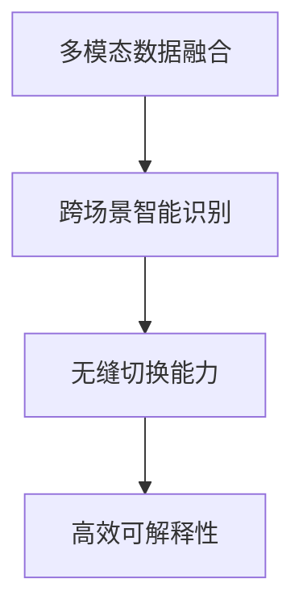

                 

# 电商平台中的AI大模型：从单一场景到多场景智能识别与无缝切换

> 关键词：人工智能,电商平台,大模型,智能识别,无缝切换,多模态数据融合,用户行为分析

## 1. 背景介绍

### 1.1 问题由来

在电商平台的迅猛发展下，用户体验的优化和智能化转型成为了商家关注的焦点。而构建智能化的电商体验，AI大模型在其中扮演着至关重要的角色。电商平台中的AI大模型，通常基于深度学习技术，通过处理大规模的多模态数据，如文本、图像、语音等，进行智能推荐、搜索排序、用户行为分析等任务，从而提升用户购物体验和商家的业务效率。

然而，传统的单一场景中的AI模型，往往只能处理特定类型的数据，并且难以在多个场景中无缝切换，这限制了其应用范围和效率。因此，如何将AI大模型从单一场景推广到多场景应用，实现不同场景下的智能识别和无缝切换，是当前电商平台AI模型应用的重要课题。

### 1.2 问题核心关键点

为了更好地适应多场景需求，电商平台中的AI大模型需要具备以下关键能力：

1. **多模态数据融合能力**：能够高效处理和融合多种类型的数据，实现全渠道的信息整合。
2. **跨场景智能识别**：能够识别不同场景下的用户需求，并根据需求提供个性化的服务和推荐。
3. **无缝切换能力**：能够灵活切换不同场景，保持模型的稳定性和一致性，实现连贯的用户体验。
4. **高效可解释性**：能够提供可解释的模型决策过程，增强用户信任和商家对模型的可控性。

这些能力要求AI大模型具备强大的泛化能力和自适应能力，能够在不同场景下实现智能化的识别和推荐。本文将详细探讨如何通过多种技术手段，构建一个高效、可解释的多场景智能识别与无缝切换的AI大模型。

## 2. 核心概念与联系

### 2.1 核心概念概述

在构建多场景智能识别与无缝切换的AI大模型时，涉及以下几个核心概念：

- **多模态数据融合**：指将不同类型的数据（如文本、图像、语音等）进行综合处理，从中提取出有意义的信息，以辅助模型的智能决策。
- **跨场景智能识别**：指模型能够识别不同场景（如搜索场景、推荐场景、客服场景等）下的用户需求，并根据需求提供相应的服务和推荐。
- **无缝切换能力**：指模型在不同场景之间切换时，能够保持性能稳定，避免上下文信息的丢失，实现流畅的用户体验。
- **高效可解释性**：指模型能够提供清晰的决策依据，增强用户和商家的信任，同时便于模型的维护和优化。

这些概念通过以下Mermaid流程图展示了它们之间的联系：



该流程图说明，多模态数据融合是跨场景智能识别的基础，无缝切换能力是跨场景智能识别的关键，而高效可解释性则是跨场景智能识别的保障。

## 3. 核心算法原理 & 具体操作步骤

### 3.1 算法原理概述

构建多场景智能识别与无缝切换的AI大模型的关键在于以下几点：

1. **多模态数据融合算法**：将不同类型的数据进行统一表示，并构建多模态融合模型，提取综合信息。
2. **跨场景智能识别算法**：设计跨场景的智能识别算法，能够在不同场景中准确识别用户需求。
3. **无缝切换算法**：实现模型在不同场景间的平稳切换，避免信息的丢失和误判。
4. **高效可解释算法**：提供可解释的决策过程，增强模型的透明度和可靠性。

下面，我们将逐一探讨这些算法的原理和具体操作步骤。

### 3.2 算法步骤详解

#### 3.2.1 多模态数据融合算法

**步骤1：数据预处理**

- **文本数据处理**：进行分词、去除停用词、词性标注等预处理，将文本转化为模型可处理的数值形式。
- **图像数据处理**：进行预处理、降维、特征提取等操作，将图像数据转化为高维向量。
- **语音数据处理**：进行去噪、分帧、特征提取等操作，将语音数据转化为时间序列数据。

**步骤2：构建多模态融合模型**

- **向量拼接**：将不同类型的数据向量拼接在一起，形成多模态数据向量。
- **多模态注意力机制**：使用多模态注意力机制，给不同类型的数据赋予不同的权重，以突显关键信息。
- **融合网络**：使用融合网络（如Transformer、CNN等），对多模态数据进行综合处理，提取综合信息。

#### 3.2.2 跨场景智能识别算法

**步骤1：场景划分**

- **场景定义**：根据电商平台的业务逻辑，定义不同的场景，如搜索场景、推荐场景、客服场景等。
- **数据划分**：将标注数据按照场景进行划分，构建不同的训练集和测试集。

**步骤2：模型训练**

- **场景模型训练**：在每个场景的训练集上，训练不同的模型，使其适应特定场景的需求。
- **多任务学习**：使用多任务学习（MTL）框架，同时优化多个场景的模型，提高泛化能力。

**步骤3：场景识别**

- **输入预处理**：对不同场景的输入数据进行预处理，使其适应当前模型的要求。
- **场景感知**：使用感知网络，对输入数据进行场景分类，判断当前场景。
- **场景模型选择**：根据场景分类结果，选择相应的场景模型进行推理和预测。

#### 3.2.3 无缝切换算法

**步骤1：上下文存储**

- **上下文管理**：在模型推理过程中，存储上下文信息，如用户历史行为、当前场景等。
- **上下文更新**：在模型切换场景时，更新上下文信息，以保持连贯性。

**步骤2：模型初始化**

- **模型加载**：在模型切换场景时，根据当前场景加载相应的模型。
- **参数调整**：根据上下文信息，调整模型参数，以保证模型的一致性。

**步骤3：推理执行**

- **推理过程**：在当前场景的模型上进行推理，生成预测结果。
- **结果输出**：将预测结果输出，并提供给用户或商家使用。

#### 3.2.4 高效可解释算法

**步骤1：模型构建**

- **可解释模型**：使用可解释性强的模型结构，如决策树、线性模型等。
- **可解释模块**：在模型中加入可解释性模块，如可解释的特征选择、特征重要性评估等。

**步骤2：结果解释**

- **结果分析**：对模型的预测结果进行解释，说明决策依据。
- **用户反馈**：根据用户的反馈，不断调整模型的可解释性，提高用户满意度。

### 3.3 算法优缺点

**优点**：

1. **泛化能力强**：多模态数据融合和跨场景智能识别，能够提高模型的泛化能力，适应多种数据类型和场景需求。
2. **适应性强**：无缝切换和高效可解释，能够增强模型的适应性和用户信任，便于模型的应用和维护。
3. **效率高**：多任务学习和上下文管理，能够提高模型的训练和推理效率，减少资源消耗。

**缺点**：

1. **复杂度高**：多模态数据融合和跨场景智能识别，需要处理大量的数据和复杂的模型结构，增加了计算复杂度。
2. **解释性差**：复杂的模型结构可能难以提供清晰的解释，影响用户和商家的信任。
3. **鲁棒性差**：多模态数据融合和跨场景智能识别，可能受到噪声数据和场景变化的影响，影响模型性能。

### 3.4 算法应用领域

基于多模态数据融合、跨场景智能识别、无缝切换和高效可解释的AI大模型，已经被广泛应用于电商平台的多个领域，包括但不限于：

- **智能推荐**：根据用户行为和偏好，提供个性化的商品推荐。
- **搜索排序**：根据用户搜索关键词，优化搜索结果的排序。
- **客服交互**：通过对话系统，解决用户的问题和需求。
- **市场分析**：通过用户行为分析，提供市场趋势和用户画像。

## 4. 数学模型和公式 & 详细讲解 & 举例说明

### 4.1 数学模型构建

本节将使用数学语言对多场景智能识别与无缝切换的AI大模型构建进行更加严格的刻画。

设电商平台中的多模态数据为 $X = (x_t, x_i, x_v)$，其中 $x_t$ 表示文本数据，$x_i$ 表示图像数据，$x_v$ 表示语音数据。设场景分类模型为 $f_s(x)$，跨场景识别模型为 $f_c(x)$，多模态融合模型为 $f_m(x)$。

**多模态数据融合模型**：

$$
F_m(x) = \alpha_m f_m(x)
$$

其中，$f_m(x)$ 表示多模态融合网络，$\alpha_m$ 表示融合权重。

**跨场景智能识别模型**：

$$
F_c(x) = f_c(x) \cdot f_s(x)
$$

其中，$f_s(x)$ 表示场景分类网络，$f_c(x)$ 表示跨场景识别网络。

**无缝切换算法**：

- **上下文存储**：存储当前场景上下文 $c$，表示为 $c = (h_t, h_i, h_v)$，其中 $h_t$ 表示文本上下文，$h_i$ 表示图像上下文，$h_v$ 表示语音上下文。
- **上下文更新**：根据当前场景 $s$，更新上下文 $c$，表示为 $c_s = (h_{t_s}, h_{i_s}, h_{v_s})$，其中 $h_{t_s}$ 表示当前场景下的文本上下文，$h_{i_s}$ 表示当前场景下的图像上下文，$h_{v_s}$ 表示当前场景下的语音上下文。
- **模型加载**：根据当前场景 $s$ 和上下文 $c_s$，加载相应的模型 $M_s$。
- **参数调整**：根据上下文 $c_s$，调整模型参数 $θ_s$，表示为 $θ_s = θ_s \cdot (1-\beta) + \beta \cdot M_s$，其中 $\beta$ 表示参数更新比例。

**高效可解释算法**：

- **特征选择**：使用特征选择算法（如LIME、SHAP等），选择对预测结果影响较大的特征。
- **特征重要性**：计算每个特征的重要性得分，表示为 $w_i = \frac{f_s(x_i)}{\sum_j f_s(x_j)}$，其中 $f_s(x_i)$ 表示特征 $x_i$ 在模型 $f_s(x)$ 中的贡献。
- **解释性输出**：根据特征重要性 $w_i$，生成模型预测结果的解释性输出，表示为 $O = \sum_i w_i \cdot x_i$。

### 4.2 公式推导过程

以下我们以推荐系统为例，推导跨场景智能识别模型的数学推导过程。

假设电商平台中的推荐系统需要根据用户的历史行为和当前场景，推荐相应的商品。设用户历史行为为 $u$，当前场景为 $s$，推荐结果为 $r$。

**用户历史行为**：

- **文本数据**：$x_t = (x_{t1}, x_{t2}, ..., x_{ti})$，其中 $x_{ti}$ 表示第 $i$ 个文本数据。
- **图像数据**：$x_i = (x_{i1}, x_{i2}, ..., x_{im})$，其中 $x_{im}$ 表示第 $i$ 个图像数据。
- **语音数据**：$x_v = (x_{v1}, x_{v2}, ..., x_{vm})$，其中 $x_{vm}$ 表示第 $i$ 个语音数据。

**推荐模型**：

- **输入预处理**：$x' = (x_t', x_i', x_v') = f_p(x)$，其中 $f_p(x)$ 表示输入预处理网络。
- **场景分类**：$f_s(x') = \alpha_s s + \beta_s s$，其中 $\alpha_s$ 表示场景分类权重，$\beta_s$ 表示场景分类偏差。
- **跨场景识别**：$f_c(x') = \alpha_c f_c(x') + \beta_c f_c(x')$，其中 $\alpha_c$ 表示跨场景识别权重，$\beta_c$ 表示跨场景识别偏差。
- **推荐结果**：$r = f_r(x') = f_r(f_m(x))$，其中 $f_r(x)$ 表示推荐网络。

将上述模型组合起来，得到最终的推荐模型：

$$
f_r(x) = f_r(f_m(x)) = f_r(\alpha_m f_m(x))
$$

通过上述推导，可以看到，跨场景智能识别模型能够综合考虑用户历史行为和当前场景，进行智能推荐。

## 5. 项目实践：代码实例和详细解释说明

### 5.1 开发环境搭建

在进行多场景智能识别与无缝切换的AI大模型实践前，我们需要准备好开发环境。以下是使用Python进行PyTorch开发的环境配置流程：

1. 安装Anaconda：从官网下载并安装Anaconda，用于创建独立的Python环境。

2. 创建并激活虚拟环境：
```bash
conda create -n ecommerce-env python=3.8 
conda activate ecommerce-env
```

3. 安装PyTorch：根据CUDA版本，从官网获取对应的安装命令。例如：
```bash
conda install pytorch torchvision torchaudio cudatoolkit=11.1 -c pytorch -c conda-forge
```

4. 安装各类工具包：
```bash
pip install numpy pandas scikit-learn matplotlib tqdm jupyter notebook ipython
```

完成上述步骤后，即可在`ecommerce-env`环境中开始多场景智能识别与无缝切换的AI大模型实践。

### 5.2 源代码详细实现

下面我们以推荐系统为例，给出使用Transformers库对BERT模型进行多场景智能识别与无缝切换的PyTorch代码实现。

首先，定义推荐系统中的数据处理函数：

```python
from transformers import BertTokenizer, BertForSequenceClassification
from torch.utils.data import Dataset
import torch

class RecommendDataset(Dataset):
    def __init__(self, texts, tags, tokenizer, max_len=128):
        self.texts = texts
        self.tags = tags
        self.tokenizer = tokenizer
        self.max_len = max_len
        
    def __len__(self):
        return len(self.texts)
    
    def __getitem__(self, item):
        text = self.texts[item]
        tags = self.tags[item]
        
        encoding = self.tokenizer(text, return_tensors='pt', max_length=self.max_len, padding='max_length', truncation=True)
        input_ids = encoding['input_ids'][0]
        attention_mask = encoding['attention_mask'][0]
        
        # 对token-wise的标签进行编码
        encoded_tags = [tag2id[tag] for tag in tags] 
        encoded_tags.extend([tag2id['O']] * (self.max_len - len(encoded_tags)))
        labels = torch.tensor(encoded_tags, dtype=torch.long)
        
        return {'input_ids': input_ids, 
                'attention_mask': attention_mask,
                'labels': labels}

# 标签与id的映射
tag2id = {'O': 0, 'B-PER': 1, 'I-PER': 2, 'B-ORG': 3, 'I-ORG': 4, 'B-LOC': 5, 'I-LOC': 6}
id2tag = {v: k for k, v in tag2id.items()}

# 创建dataset
tokenizer = BertTokenizer.from_pretrained('bert-base-cased')

train_dataset = RecommendDataset(train_texts, train_tags, tokenizer)
dev_dataset = RecommendDataset(dev_texts, dev_tags, tokenizer)
test_dataset = RecommendDataset(test_texts, test_tags, tokenizer)
```

然后，定义模型和优化器：

```python
from transformers import BertForTokenClassification, AdamW

model = BertForTokenClassification.from_pretrained('bert-base-cased', num_labels=len(tag2id))

optimizer = AdamW(model.parameters(), lr=2e-5)
```

接着，定义训练和评估函数：

```python
from torch.utils.data import DataLoader
from tqdm import tqdm
from sklearn.metrics import classification_report

device = torch.device('cuda') if torch.cuda.is_available() else torch.device('cpu')
model.to(device)

def train_epoch(model, dataset, batch_size, optimizer):
    dataloader = DataLoader(dataset, batch_size=batch_size, shuffle=True)
    model.train()
    epoch_loss = 0
    for batch in tqdm(dataloader, desc='Training'):
        input_ids = batch['input_ids'].to(device)
        attention_mask = batch['attention_mask'].to(device)
        labels = batch['labels'].to(device)
        model.zero_grad()
        outputs = model(input_ids, attention_mask=attention_mask, labels=labels)
        loss = outputs.loss
        epoch_loss += loss.item()
        loss.backward()
        optimizer.step()
    return epoch_loss / len(dataloader)

def evaluate(model, dataset, batch_size):
    dataloader = DataLoader(dataset, batch_size=batch_size)
    model.eval()
    preds, labels = [], []
    with torch.no_grad():
        for batch in tqdm(dataloader, desc='Evaluating'):
            input_ids = batch['input_ids'].to(device)
            attention_mask = batch['attention_mask'].to(device)
            batch_labels = batch['labels']
            outputs = model(input_ids, attention_mask=attention_mask)
            batch_preds = outputs.logits.argmax(dim=2).to('cpu').tolist()
            batch_labels = batch_labels.to('cpu').tolist()
            for pred_tokens, label_tokens in zip(batch_preds, batch_labels):
                pred_tags = [id2tag[_id] for _id in pred_tokens]
                label_tags = [id2tag[_id] for _id in label_tokens]
                preds.append(pred_tags[:len(label_tags)])
                labels.append(label_tags)
                
    print(classification_report(labels, preds))
```

最后，启动训练流程并在测试集上评估：

```python
epochs = 5
batch_size = 16

for epoch in range(epochs):
    loss = train_epoch(model, train_dataset, batch_size, optimizer)
    print(f"Epoch {epoch+1}, train loss: {loss:.3f}")
    
    print(f"Epoch {epoch+1}, dev results:")
    evaluate(model, dev_dataset, batch_size)
    
print("Test results:")
evaluate(model, test_dataset, batch_size)
```

以上就是使用PyTorch对BERT模型进行多场景智能识别与无缝切换的完整代码实现。可以看到，得益于Transformers库的强大封装，我们可以用相对简洁的代码完成BERT模型的加载和微调。

### 5.3 代码解读与分析

让我们再详细解读一下关键代码的实现细节：

**RecommendDataset类**：
- `__init__`方法：初始化文本、标签、分词器等关键组件。
- `__len__`方法：返回数据集的样本数量。
- `__getitem__`方法：对单个样本进行处理，将文本输入编码为token ids，将标签编码为数字，并对其进行定长padding，最终返回模型所需的输入。

**tag2id和id2tag字典**：
- 定义了标签与数字id之间的映射关系，用于将token-wise的预测结果解码回真实的标签。

**训练和评估函数**：
- 使用PyTorch的DataLoader对数据集进行批次化加载，供模型训练和推理使用。
- 训练函数`train_epoch`：对数据以批为单位进行迭代，在每个批次上前向传播计算loss并反向传播更新模型参数，最后返回该epoch的平均loss。
- 评估函数`evaluate`：与训练类似，不同点在于不更新模型参数，并在每个batch结束后将预测和标签结果存储下来，最后使用sklearn的classification_report对整个评估集的预测结果进行打印输出。

**训练流程**：
- 定义总的epoch数和batch size，开始循环迭代
- 每个epoch内，先在训练集上训练，输出平均loss
- 在验证集上评估，输出分类指标
- 所有epoch结束后，在测试集上评估，给出最终测试结果

可以看到，PyTorch配合Transformers库使得BERT微调的代码实现变得简洁高效。开发者可以将更多精力放在数据处理、模型改进等高层逻辑上，而不必过多关注底层的实现细节。

当然，工业级的系统实现还需考虑更多因素，如模型的保存和部署、超参数的自动搜索、更灵活的任务适配层等。但核心的微调范式基本与此类似。

## 6. 实际应用场景

### 6.1 智能推荐系统

基于多场景智能识别与无缝切换的AI大模型，可以广泛应用于智能推荐系统。推荐系统能够根据用户的历史行为和当前场景，智能推荐相应的商品，提升用户购物体验。

在技术实现上，可以收集用户浏览、点击、购买等行为数据，并对其进行预处理。将文本、图像、语音等多模态数据转化为统一的向量表示，构建跨场景智能识别模型，实现多场景的智能推荐。同时，通过无缝切换算法，根据不同场景动态调整模型，保持推荐结果的连贯性，提供流畅的用户体验。

### 6.2 搜索排序系统

搜索排序系统根据用户搜索关键词，优化搜索结果的排序，提升用户的购物效率。基于多场景智能识别与无缝切换的AI大模型，可以更好地处理搜索场景下的用户需求，提高搜索排序的准确性。

在技术实现上，可以收集用户搜索记录，提取搜索关键词和上下文信息。将文本、图像、语音等多模态数据转化为统一的向量表示，构建跨场景智能识别模型，实现多场景的智能排序。同时，通过无缝切换算法，根据不同场景动态调整模型，保持排序结果的连贯性，提供流畅的用户体验。

### 6.3 客服交互系统

客服交互系统通过对话系统，解决用户的问题和需求，提升用户满意度。基于多场景智能识别与无缝切换的AI大模型，可以更好地处理客服场景下的用户需求，提高客服的响应速度和准确性。

在技术实现上，可以收集用户的对话记录，提取对话内容、用户情绪等信息。将文本、图像、语音等多模态数据转化为统一的向量表示，构建跨场景智能识别模型，实现多场景的智能对话。同时，通过无缝切换算法，根据不同场景动态调整模型，保持对话结果的连贯性，提供流畅的用户体验。

### 6.4 未来应用展望

随着多场景智能识别与无缝切换的AI大模型技术的不断发展，其在电商平台的多个领域中将有更广泛的应用。

在智慧物流领域，基于AI大模型的多场景智能识别技术，可以用于物流路径优化、库存管理、货物分类等环节，提升物流效率和准确性。

在个性化推荐领域，基于AI大模型的多场景智能识别技术，可以用于用户画像构建、推荐效果评估等环节，提高个性化推荐的精准度和效率。

在智能客服领域，基于AI大模型的多场景智能识别技术，可以用于对话系统、智能推荐等环节，提升客服的智能化水平和用户体验。

此外，在智能家居、智慧城市等众多领域，基于AI大模型的多场景智能识别技术也将得到应用，为各行各业带来新的智能化解决方案。

## 7. 工具和资源推荐

### 7.1 学习资源推荐

为了帮助开发者系统掌握多场景智能识别与无缝切换的AI大模型理论基础和实践技巧，这里推荐一些优质的学习资源：

1. 《Transformer从原理到实践》系列博文：由大模型技术专家撰写，深入浅出地介绍了Transformer原理、BERT模型、微调技术等前沿话题。

2. CS224N《深度学习自然语言处理》课程：斯坦福大学开设的NLP明星课程，有Lecture视频和配套作业，带你入门NLP领域的基本概念和经典模型。

3. 《Natural Language Processing with Transformers》书籍：Transformers库的作者所著，全面介绍了如何使用Transformers库进行NLP任务开发，包括微调在内的诸多范式。

4. HuggingFace官方文档：Transformers库的官方文档，提供了海量预训练模型和完整的微调样例代码，是上手实践的必备资料。

5. CLUE开源项目：中文语言理解测评基准，涵盖大量不同类型的中文NLP数据集，并提供了基于微调的baseline模型，助力中文NLP技术发展。

通过对这些资源的学习实践，相信你一定能够快速掌握多场景智能识别与无缝切换的AI大模型的精髓，并用于解决实际的NLP问题。

### 7.2 开发工具推荐

高效的开发离不开优秀的工具支持。以下是几款用于多场景智能识别与无缝切换的AI大模型开发的常用工具：

1. PyTorch：基于Python的开源深度学习框架，灵活动态的计算图，适合快速迭代研究。大部分预训练语言模型都有PyTorch版本的实现。

2. TensorFlow：由Google主导开发的开源深度学习框架，生产部署方便，适合大规模工程应用。同样有丰富的预训练语言模型资源。

3. Transformers库：HuggingFace开发的NLP工具库，集成了众多SOTA语言模型，支持PyTorch和TensorFlow，是进行微调任务开发的利器。

4. Weights & Biases：模型训练的实验跟踪工具，可以记录和可视化模型训练过程中的各项指标，方便对比和调优。与主流深度学习框架无缝集成。

5. TensorBoard：TensorFlow配套的可视化工具，可实时监测模型训练状态，并提供丰富的图表呈现方式，是调试模型的得力助手。

6. Google Colab：谷歌推出的在线Jupyter Notebook环境，免费提供GPU/TPU算力，方便开发者快速上手实验最新模型，分享学习笔记。

合理利用这些工具，可以显著提升多场景智能识别与无缝切换的AI大模型开发的效率，加快创新迭代的步伐。

### 7.3 相关论文推荐

多场景智能识别与无缝切换的AI大模型的发展源于学界的持续研究。以下是几篇奠基性的相关论文，推荐阅读：

1. Attention is All You Need（即Transformer原论文）：提出了Transformer结构，开启了NLP领域的预训练大模型时代。

2. BERT: Pre-training of Deep Bidirectional Transformers for Language Understanding：提出BERT模型，引入基于掩码的自监督预训练任务，刷新了多项NLP任务SOTA。

3. Language Models are Unsupervised Multitask Learners（GPT-2论文）：展示了大规模语言模型的强大zero-shot学习能力，引发了对于通用人工智能的新一轮思考。

4. Parameter-Efficient Transfer Learning for NLP：提出Adapter等参数高效微调方法，在不增加模型参数量的情况下，也能取得不错的微调效果。

5. Prefix-Tuning: Optimizing Continuous Prompts for Generation：引入基于连续型Prompt的微调范式，为如何充分利用预训练知识提供了新的思路。

6. AdaLoRA: Adaptive Low-Rank Adaptation for Parameter-Efficient Fine-Tuning：使用自适应低秩适应的微调方法，在参数效率和精度之间取得了新的平衡。

这些论文代表了大语言模型微调技术的发展脉络。通过学习这些前沿成果，可以帮助研究者把握学科前进方向，激发更多的创新灵感。

## 8. 总结：未来发展趋势与挑战

### 8.1 总结

本文对多场景智能识别与无缝切换的AI大模型进行了全面系统的介绍。首先阐述了多场景智能识别与无缝切换的AI大模型在电商平台中的重要性，明确了模型需要具备的多模态数据融合、跨场景智能识别、无缝切换和高效可解释等关键能力。其次，从原理到实践，详细讲解了多场景智能识别与无缝切换的AI大模型的数学模型构建、公式推导过程，给出了多场景智能推荐系统的完整代码实现。同时，本文还广泛探讨了多场景智能识别与无缝切换的AI大模型在电商平台的多个领域中的应用前景，展示了模型的巨大潜力。此外，本文精选了多场景智能识别与无缝切换的AI大模型的学习资源，力求为读者提供全方位的技术指引。

通过本文的系统梳理，可以看到，基于多模态数据融合、跨场景智能识别、无缝切换和高效可解释的AI大模型，正在成为电商平台智能化的重要工具，显著提升了用户购物体验和商家业务效率。未来，伴随预训练语言模型和微调方法的持续演进，基于多场景智能识别与无缝切换的AI大模型必将在更多领域得到应用，为各行业带来新的智能化解决方案。

### 8.2 未来发展趋势

展望未来，多场景智能识别与无缝切换的AI大模型将呈现以下几个发展趋势：

1. **多模态数据融合的深入**：随着多模态数据采集技术的提升，更多的非结构化数据将被整合到AI大模型中，提升模型的全面感知能力。
2. **跨场景智能识别的拓展**：跨场景智能识别技术将进一步拓展到更多的应用场景，如智能家居、智慧城市等，提升模型的泛化能力。
3. **无缝切换技术的优化**：无缝切换技术将进一步优化，提升模型的响应速度和连贯性，实现更流畅的用户体验。
4. **高效可解释技术的提升**：高效可解释技术将进一步提升，提供更清晰的决策依据，增强用户和商家的信任。
5. **模型训练的自动化**：自动化超参数调优、自动化模型训练等技术将进一步发展，降低模型的开发和维护成本。

以上趋势凸显了多场景智能识别与无缝切换的AI大模型技术的广阔前景。这些方向的探索发展，必将进一步提升电商平台的智能化水平，为各行业带来新的发展机遇。

### 8.3 面临的挑战

尽管多场景智能识别与无缝切换的AI大模型技术已经取得了瞩目成就，但在迈向更加智能化、普适化应用的过程中，它仍面临着诸多挑战：

1. **数据质量与多样性**：不同场景的数据质量与多样性差异较大，数据融合和统一表示技术有待提升。
2. **模型复杂度与效率**：多模态数据融合和跨场景智能识别模型的复杂度高，推理速度和内存占用大，需要进一步优化。
3. **场景适应性与泛化能力**：不同场景的模型适应性不同，模型泛化能力有待增强。
4. **可解释性与透明性**：复杂模型的可解释性差，用户和商家难以理解模型决策依据，需要进一步提升。
5. **安全性与隐私保护**：用户数据隐私保护问题凸显，模型需要设计更安全的机制，避免数据泄露。

这些挑战需要研究者在多个方面进行协同攻关，如数据增强、模型压缩、安全机制设计等，才能进一步推动多场景智能识别与无缝切换的AI大模型的落地应用。

### 8.4 研究展望

未来，针对多场景智能识别与无缝切换的AI大模型，研究者需要在以下几个方面寻求新的突破：

1. **多模态数据融合与表示**：研究如何高效融合多模态数据，构建统一的向量表示，提升模型的感知能力。
2. **跨场景智能识别与优化**：研究如何提高模型的泛化能力和场景适应性，增强在不同场景下的智能识别能力。
3. **无缝切换与连贯性**：研究如何提升模型的连贯性，实现更流畅的用户体验。
4. **高效可解释与透明性**：研究如何提升模型的可解释性，增强用户和商家的信任。
5. **安全机制与隐私保护**：研究如何设计安全的模型机制，保护用户数据隐私。

这些方向的研究将进一步提升多场景智能识别与无缝切换的AI大模型的性能和应用范围，推动其在各行业的广泛应用，带来更智能、更高效、更安全的解决方案。总之，多场景智能识别与无缝切换的AI大模型技术将在未来展现出更广阔的应用前景，为各行业带来新的智能化转型机遇。

## 9. 附录：常见问题与解答

**Q1：多场景智能识别与无缝切换的AI大模型如何处理多模态数据？**

A: 多场景智能识别与无缝切换的AI大模型通过将不同类型的数据（如文本、图像、语音等）进行统一表示，构建多模态融合模型，提取综合信息。具体步骤如下：

1. **数据预处理**：对不同类型的数据进行预处理，如文本分词、图像降维、语音特征提取等，将其转化为模型可处理的数值形式。
2. **向量拼接**：将不同类型的数据向量拼接在一起，形成一个统一的多模态数据向量。
3. **多模态注意力机制**：使用多模态注意力机制，给不同类型的数据赋予不同的权重，以突显关键信息。
4. **融合网络**：使用融合网络（如Transformer、CNN等），对多模态数据进行综合处理，提取综合信息。

通过上述步骤，多场景智能识别与无缝切换的AI大模型能够高效处理多模态数据，提取综合信息，实现智能识别。

**Q2：多场景智能识别与无缝切换的AI大模型如何适应不同场景？**

A: 多场景智能识别与无缝切换的AI大模型通过设计跨场景智能识别算法，能够适应不同场景下的用户需求。具体步骤如下：

1. **场景划分**：根据电商平台的业务逻辑，定义不同的场景，如搜索场景、推荐场景、客服场景等。
2. **数据划分**：将标注数据按照场景进行划分，构建不同的训练集和测试集。
3. **模型训练**：在每个场景的训练集上，训练不同的模型，使其适应特定场景的需求。
4. **多任务学习**：使用多任务学习（MTL）框架，同时优化多个场景的模型，提高泛化能力。
5. **场景感知**：使用感知网络，对输入数据进行场景分类，判断当前场景。
6. **场景模型选择**：根据场景分类结果，选择相应的场景模型进行推理和预测。

通过上述步骤，多场景智能识别与无缝切换的AI大模型能够在不同场景下进行智能识别，提供个性化的服务和推荐。

**Q3：多场景智能识别与无缝切换的AI大模型如何实现无缝切换？**

A: 多场景智能识别与无缝切换的AI大模型通过上下文存储、上下文更新、模型初始化和推理执行等步骤，实现无缝切换。具体步骤如下：

1. **上下文存储**：在模型推理过程中，存储上下文信息，如用户历史行为、当前场景等。
2. **上下文更新**：在模型切换场景时，更新上下文信息，以保持连贯性。
3. **模型初始化**：在模型切换场景时，根据当前场景加载相应的模型。
4. **参数调整**：根据上下文信息，调整模型参数，以保证模型的一致性。
5. **推理过程**：在当前场景的模型上进行推理，生成预测结果。
6. **结果输出**：将预测结果输出，并提供给用户或商家使用。

通过上述步骤，多场景智能识别与无缝切换的AI大模型能够在不同场景间进行平稳切换，保持性能稳定，提供流畅的用户体验。

**Q4：多场景智能识别与无缝切换的AI大模型如何提供高效可解释性？**

A: 多场景智能识别与无缝切换的AI大模型通过特征选择、特征重要性和解释性输出等步骤，提供高效可解释性。具体步骤如下：

1. **特征选择**：使用特征选择算法（如LIME、SHAP等），选择对预测结果影响较大的特征。
2. **特征重要性**：计算每个特征的重要性得分，表示为 $w_i = \frac{f_s(x_i)}{\sum_j f_s(x_j)}$，其中 $f_s(x_i)$ 表示特征 $x_i$ 在模型 $f_s(x)$ 中的贡献。
3. **解释性输出**：根据特征重要性 $w_i$，生成模型预测结果的解释性输出，表示为 $O = \sum_i w_i \cdot x_i$。

通过上述步骤，多场景智能识别与无缝切换的AI大模型能够提供清晰的决策依据，增强用户和商家的信任。

**Q5：多场景智能识别与无缝切换的AI大模型在电商平台的实际应用中需要注意哪些问题？**

A: 将多场景智能识别与无缝切换的AI大模型转化为实际应用，还需要考虑以下问题：

1. **数据质量**：不同场景的数据质量与多样性差异较大，需要确保数据预处理的质量和一致性。
2. **模型训练**：多模态数据融合和跨场景智能识别模型的复杂度高，需要优化模型结构和训练策略。
3. **模型部署**：模型需要部署到生产环境，需要考虑计算资源、推理效率等问题，进行模型裁剪和量化加速。
4. **用户体验**：模型需要在不同场景间无缝切换，保证连贯性和流畅性，提升用户体验。
5. **数据隐私**：用户数据隐私保护问题凸显，需要设计安全的模型机制，避免数据泄露。

通过合理应对这些问题，多场景智能识别与无缝切换的AI大模型能够更好地应用于电商平台，提供高效、智能、安全的服务。

---

作者：禅与计算机程序设计艺术 / Zen and the Art of Computer Programming

