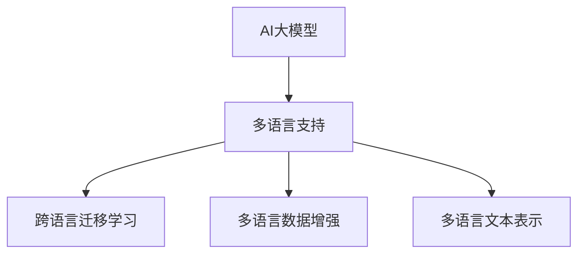

                 

# 电商平台中的AI大模型：从单一语言到多语言支持

## 1. 背景介绍

随着电子商务市场的全球化，电商平台不仅需要为用户提供多样化的商品选择，还需要支持多语言搜索、推荐、客户服务等多种场景，以服务来自全球的客户。在这样的背景下，引入AI大模型来提升电商平台的智能化水平，成为了一种趋势。然而，现有的AI大模型往往局限于单一语言，无法满足多语言环境的需求。为了解决这一问题，本文将从多个角度探索如何将AI大模型扩展到多语言环境，并介绍具体的实现方法和实践案例。

## 2. 核心概念与联系

### 2.1 核心概念概述

为了更好地理解电商平台中AI大模型的应用，我们将介绍几个相关的核心概念：

- **AI大模型**：如BERT、GPT-3等大规模预训练语言模型，通过自监督学习任务在海量无标签文本数据上训练，能够学习到丰富的语言知识。
- **多语言支持**：指AI大模型能够处理和理解多种语言，提供多语言输入和输出，支持多语言环境下的自然语言处理任务。
- **跨语言迁移学习**：指将一个语言的预训练模型迁移到另一个语言上，以实现多语言任务的微调，从而减少数据需求和训练成本。
- **多语言数据增强**：指通过将多种语言的数据进行混合增强，提高模型在不同语言环境下的泛化能力。
- **多语言文本表示**：指将不同语言中的文本表示成统一格式，以便于模型处理和理解。

这些概念之间的联系可以通过以下Mermaid流程图来展示：



## 3. 核心算法原理 & 具体操作步骤

### 3.1 算法原理概述

将AI大模型扩展到多语言环境的主要方法是利用跨语言迁移学习。这一方法的基本思想是将预训练模型在不同语言之间进行迁移，通过微调来适应特定任务。

具体而言，假设我们已经有一个在单一语言下训练好的预训练模型 $M_{\theta}$，现在希望将其迁移到另一种语言 $L$ 上，并进行特定任务 $T$ 的微调。首先，我们需要将单语言预训练模型的表示空间映射到多语言表示空间，然后通过微调来优化模型，使其适应多语言环境下的任务。

### 3.2 算法步骤详解

跨语言迁移学习一般包括以下几个步骤：

**Step 1: 多语言数据准备**
- 收集多语言下的标注数据集，一般要求不同语言的数据集具有相似的数据分布。
- 对数据进行预处理，包括分词、标注等。

**Step 2: 多语言表示映射**
- 使用跨语言嵌入技术，如Byte Pair Encoding (BPE)、FastText等，将不同语言中的文本表示成统一格式。
- 设计多语言文本表示模型，如Multilingual BERT (mBERT)、XLM等，将单语言预训练模型进行多语言迁移。

**Step 3: 特定任务微调**
- 选择适当的任务适配层，如分类器、解码器等，用于微调模型。
- 使用优化算法，如AdamW、SGD等，在标注数据集上进行微调，最小化损失函数。
- 应用正则化技术，如L2正则、Dropout等，防止模型过拟合。

**Step 4: 测试和评估**
- 在测试集上评估微调后模型的性能，与单语言模型进行对比。
- 持续收集新的多语言数据，定期重新微调模型，以适应语言分布的变化。

### 3.3 算法优缺点

跨语言迁移学习在多语言环境下的应用具有以下优点：
1. **数据需求减少**：通过多语言数据增强，减少了对特定语言数据的依赖。
2. **泛化能力强**：多语言迁移学习提高了模型在不同语言环境下的泛化能力。
3. **训练成本低**：由于使用了单语言预训练模型，减少了从头开始训练的资源消耗。

同时，该方法也存在一些缺点：
1. **数据质量要求高**：多语言数据集的质量和多样性对模型性能有重要影响。
2. **语言差异问题**：不同语言之间的语法、词汇等差异，可能导致迁移学习的困难。
3. **模型复杂度高**：多语言表示映射和任务适配层的复杂度较高，需要更多的计算资源。

### 3.4 算法应用领域

跨语言迁移学习已经在多个领域得到了广泛的应用，例如：

- **电商平台搜索**：通过多语言查询和推荐，提升全球用户的搜索体验。
- **多语言客户服务**：利用多语言模型提供客户服务，支持多语言客户咨询和反馈。
- **跨语言商品推荐**：通过多语言数据增强，实现不同语言环境下的个性化商品推荐。
- **跨语言情感分析**：对不同语言的用户评论进行情感分析，了解用户情绪变化。

除了上述这些应用外，跨语言迁移学习还将在更多的电商场景中得到应用，为电商平台提供更智能、更高效的服务。

## 4. 数学模型和公式 & 详细讲解 & 举例说明

### 4.1 数学模型构建

为了更好地理解跨语言迁移学习的数学模型，我们以情感分析任务为例，介绍多语言文本表示模型mBERT的构建。

假设我们要进行多语言情感分析任务，假设存在 $n$ 种语言，每种语言下的情感分析任务可以表示为 $T_1, T_2, \ldots, T_n$。我们假设每种语言的标注数据集为 $D_i=\{(x_{i,j}, y_{i,j})\}_{j=1}^{J_i}$，其中 $x_{i,j}$ 为语言 $i$ 的文本样本，$y_{i,j}$ 为对应的情感标签。

### 4.2 公式推导过程

为了实现多语言情感分析，我们首先使用mBERT对单语言预训练模型进行多语言迁移，然后在每个语言任务上进行微调。mBERT的具体构建方法如下：

1. **语言空间对齐**：将不同语言中的词汇映射到统一的空间中，可以通过使用BPE或其他跨语言嵌入技术实现。
2. **多语言表示映射**：将单语言预训练模型 $M_{\theta}$ 的表示映射到多语言表示空间 $M_{\phi}$，其中 $\phi$ 为多语言表示的参数。
3. **多语言情感分析**：在多语言表示空间 $M_{\phi}$ 上，利用任务适配层对情感分析任务进行微调，得到多语言情感分析模型 $M_{\phi^T}$。

假设我们要对语言 $i$ 的情感分析任务进行微调，则多语言情感分析模型的输出可以表示为 $M_{\phi^T}(x_{i,j})$，其中 $x_{i,j}$ 为语言 $i$ 的情感分析样本，$y_{i,j}$ 为对应的情感标签。

### 4.3 案例分析与讲解

以中文和英文为例，假设我们已经训练好了一个在英文上使用的BERT模型 $M_{\theta}$，现在希望将其迁移到中文上，并进行情感分析任务 $T$ 的微调。

1. **语言空间对齐**：使用BPE技术将英文和中文的词汇映射到统一的空间中，得到跨语言的词汇表示。
2. **多语言表示映射**：将英文BERT模型 $M_{\theta}$ 的表示映射到多语言表示空间 $M_{\phi}$，得到多语言情感分析模型 $M_{\phi^T}$。
3. **多语言情感分析**：在多语言表示空间 $M_{\phi}$ 上，利用任务适配层对中文情感分析任务 $T$ 进行微调，得到中文情感分析模型 $M_{\phi^T}$。

假设我们要对一段中文文本进行情感分析，输入文本为 $x_{c}=[\text{很高兴}]$，则模型的输出为 $M_{\phi^T}(x_{c})=[1]$，表示文本的情感为正面。

## 5. 项目实践：代码实例和详细解释说明

### 5.1 开发环境搭建

在进行跨语言迁移学习实践前，我们需要准备好开发环境。以下是使用Python进行PyTorch开发的环境配置流程：

1. 安装Anaconda：从官网下载并安装Anaconda，用于创建独立的Python环境。

2. 创建并激活虚拟环境：
```bash
conda create -n multilang-env python=3.8 
conda activate multilang-env
```

3. 安装PyTorch：根据CUDA版本，从官网获取对应的安装命令。例如：
```bash
conda install pytorch torchvision torchaudio cudatoolkit=11.1 -c pytorch -c conda-forge
```

4. 安装多语言工具包：
```bash
pip install pytorch-transformers sentencepiece fasttext
```

5. 安装各类工具包：
```bash
pip install numpy pandas scikit-learn matplotlib tqdm jupyter notebook ipython
```

完成上述步骤后，即可在`multilang-env`环境中开始跨语言迁移学习的实践。

### 5.2 源代码详细实现

下面以多语言情感分析任务为例，给出使用PyTorch和mBERT模型进行跨语言迁移学习的PyTorch代码实现。

首先，定义情感分析任务的数据处理函数：

```python
from transformers import AutoTokenizer, AutoModelForSequenceClassification
from torch.utils.data import Dataset, DataLoader
import torch
import sentencepiece

class MultilingualSentimentDataset(Dataset):
    def __init__(self, texts, tags, tokenizer, max_len=128):
        self.texts = texts
        self.tags = tags
        self.tokenizer = tokenizer
        self.max_len = max_len
        
    def __len__(self):
        return len(self.texts)
    
    def __getitem__(self, item):
        text = self.texts[item]
        tag = self.tags[item]
        
        encoding = self.tokenizer(text, return_tensors='pt', max_length=self.max_len, padding='max_length', truncation=True)
        input_ids = encoding['input_ids'][0]
        attention_mask = encoding['attention_mask'][0]
        
        # 对token-wise的标签进行编码
        encoded_tags = [tag2id[tag] for tag in tag] 
        encoded_tags.extend([tag2id['O']] * (self.max_len - len(encoded_tags)))
        labels = torch.tensor(encoded_tags, dtype=torch.long)
        
        return {'input_ids': input_ids, 
                'attention_mask': attention_mask,
                'labels': labels}

# 标签与id的映射
tag2id = {'O': 0, 'positive': 1, 'negative': 2}
id2tag = {v: k for k, v in tag2id.items()}

# 创建dataset
tokenizer = AutoTokenizer.from_pretrained('microsoft/mbert-base-multilingual-uncased')
train_dataset = MultilingualSentimentDataset(train_texts, train_tags, tokenizer)
dev_dataset = MultilingualSentimentDataset(dev_texts, dev_tags, tokenizer)
test_dataset = MultilingualSentimentDataset(test_texts, test_tags, tokenizer)
```

然后，定义模型和优化器：

```python
from transformers import AutoModelForSequenceClassification, AdamW

model = AutoModelForSequenceClassification.from_pretrained('microsoft/mbert-base-multilingual-uncased', num_labels=len(tag2id))

optimizer = AdamW(model.parameters(), lr=2e-5)
```

接着，定义训练和评估函数：

```python
from tqdm import tqdm

device = torch.device('cuda') if torch.cuda.is_available() else torch.device('cpu')
model.to(device)

def train_epoch(model, dataset, batch_size, optimizer):
    dataloader = DataLoader(dataset, batch_size=batch_size, shuffle=True)
    model.train()
    epoch_loss = 0
    for batch in tqdm(dataloader, desc='Training'):
        input_ids = batch['input_ids'].to(device)
        attention_mask = batch['attention_mask'].to(device)
        labels = batch['labels'].to(device)
        model.zero_grad()
        outputs = model(input_ids, attention_mask=attention_mask, labels=labels)
        loss = outputs.loss
        epoch_loss += loss.item()
        loss.backward()
        optimizer.step()
    return epoch_loss / len(dataloader)

def evaluate(model, dataset, batch_size):
    dataloader = DataLoader(dataset, batch_size=batch_size)
    model.eval()
    preds, labels = [], []
    with torch.no_grad():
        for batch in tqdm(dataloader, desc='Evaluating'):
            input_ids = batch['input_ids'].to(device)
            attention_mask = batch['attention_mask'].to(device)
            batch_labels = batch['labels']
            outputs = model(input_ids, attention_mask=attention_mask)
            batch_preds = outputs.logits.argmax(dim=2).to('cpu').tolist()
            batch_labels = batch_labels.to('cpu').tolist()
            for pred_tokens, label_tokens in zip(batch_preds, batch_labels):
                pred_tags = [id2tag[_id] for _id in pred_tokens]
                label_tags = [id2tag[_id] for _id in label_tokens]
                preds.append(pred_tags[:len(label_tokens)])
                labels.append(label_tags)
                
    print(classification_report(labels, preds))
```

最后，启动训练流程并在测试集上评估：

```python
epochs = 5
batch_size = 16

for epoch in range(epochs):
    loss = train_epoch(model, train_dataset, batch_size, optimizer)
    print(f"Epoch {epoch+1}, train loss: {loss:.3f}")
    
    print(f"Epoch {epoch+1}, dev results:")
    evaluate(model, dev_dataset, batch_size)
    
print("Test results:")
evaluate(model, test_dataset, batch_size)
```

以上就是使用PyTorch和mBERT模型进行跨语言迁移学习的完整代码实现。可以看到，得益于Transformers库的强大封装，我们可以用相对简洁的代码完成mBERT模型的加载和微调。

### 5.3 代码解读与分析

让我们再详细解读一下关键代码的实现细节：

**MultilingualSentimentDataset类**：
- `__init__`方法：初始化文本、标签、分词器等关键组件。
- `__len__`方法：返回数据集的样本数量。
- `__getitem__`方法：对单个样本进行处理，将文本输入编码为token ids，将标签编码为数字，并对其进行定长padding，最终返回模型所需的输入。

**tag2id和id2tag字典**：
- 定义了标签与数字id之间的映射关系，用于将token-wise的预测结果解码回真实的标签。

**训练和评估函数**：
- 使用PyTorch的DataLoader对数据集进行批次化加载，供模型训练和推理使用。
- 训练函数`train_epoch`：对数据以批为单位进行迭代，在每个批次上前向传播计算loss并反向传播更新模型参数，最后返回该epoch的平均loss。
- 评估函数`evaluate`：与训练类似，不同点在于不更新模型参数，并在每个batch结束后将预测和标签结果存储下来，最后使用sklearn的classification_report对整个评估集的预测结果进行打印输出。

**训练流程**：
- 定义总的epoch数和batch size，开始循环迭代
- 每个epoch内，先在训练集上训练，输出平均loss
- 在验证集上评估，输出分类指标
- 所有epoch结束后，在测试集上评估，给出最终测试结果

可以看到，PyTorch配合Transformers库使得mBERT微调的代码实现变得简洁高效。开发者可以将更多精力放在数据处理、模型改进等高层逻辑上，而不必过多关注底层的实现细节。

当然，工业级的系统实现还需考虑更多因素，如模型的保存和部署、超参数的自动搜索、更灵活的任务适配层等。但核心的跨语言迁移学习过程基本与此类似。

## 6. 实际应用场景

### 6.1 多语言电商搜索

在多语言电商搜索场景中，用户可以通过多语言查询进行搜索，平台需要返回多语言推荐结果。利用mBERT模型，可以实现对多语言查询的快速处理和翻译，提供高效的多语言搜索体验。

具体而言，平台可以收集不同语言下的搜索记录和点击记录，利用mBERT模型对查询进行情感分析、主题分类等处理，从而提取用户的搜索意图和兴趣点。同时，平台还可以利用mBERT进行商品描述的情感分析和主题分类，生成多语言推荐结果。

### 6.2 多语言客户服务

在多语言客户服务场景中，客户可以通过多语言文本或语音输入进行咨询，平台需要返回多语言回复。利用mBERT模型，可以实现对多语言文本和语音的快速处理和理解，提供高效的客户服务。

具体而言，平台可以收集不同语言下的客服对话记录，利用mBERT模型进行意图识别和实体抽取，从而理解客户的咨询意图。同时，平台还可以利用mBERT进行多语言生成，生成多语言回复，提高客户满意度。

### 6.3 多语言商品推荐

在多语言商品推荐场景中，用户可以通过多语言界面进行浏览和购买，平台需要推荐多语言商品。利用mBERT模型，可以实现对多语言商品描述的情感分析和主题分类，生成多语言推荐结果。

具体而言，平台可以收集不同语言下的商品描述和用户评价，利用mBERT模型进行情感分析和主题分类，从而提取商品的特征。同时，平台还可以利用mBERT进行多语言生成，生成多语言推荐结果，提升用户的多语言购物体验。

### 6.4 未来应用展望

随着mBERT等大模型的不断进步，基于跨语言迁移学习的方法将在更多领域得到应用，为电商平台提供更智能、更高效的服务。

在智慧物流领域，基于mBERT的翻译和情感分析技术，可以实现对不同语言下订单的快速处理和理解，提高物流系统的自动化和智能化水平。

在社交电商领域，利用mBERT模型进行情感分析和话题建模，可以分析用户的多语言社交内容，从而推荐多语言商品，提升社交电商的互动和转化率。

在国际化电商领域，基于mBERT模型的多语言处理能力，可以实现对不同语言下的市场数据进行分析和预测，提升国际电商的运营效率和竞争力。

## 7. 工具和资源推荐

### 7.1 学习资源推荐

为了帮助开发者系统掌握跨语言迁移学习的理论基础和实践技巧，这里推荐一些优质的学习资源：

1. 《Transformer from Zero to Hero》系列博文：由大模型技术专家撰写，深入浅出地介绍了Transformer原理、mBERT模型、跨语言迁移学习等前沿话题。

2. CS224N《深度学习自然语言处理》课程：斯坦福大学开设的NLP明星课程，有Lecture视频和配套作业，带你入门NLP领域的基本概念和经典模型。

3. 《Natural Language Processing with Transformers》书籍：Transformers库的作者所著，全面介绍了如何使用Transformers库进行NLP任务开发，包括跨语言迁移学习在内的诸多范式。

4. HuggingFace官方文档：Transformers库的官方文档，提供了海量预训练模型和完整的跨语言迁移学习样例代码，是上手实践的必备资料。

5. CLUE开源项目：中文语言理解测评基准，涵盖大量不同类型的中文NLP数据集，并提供了基于mBERT的baseline模型，助力中文NLP技术发展。

通过对这些资源的学习实践，相信你一定能够快速掌握mBERT模型的跨语言迁移学习精髓，并用于解决实际的NLP问题。

### 7.2 开发工具推荐

高效的开发离不开优秀的工具支持。以下是几款用于mBERT模型跨语言迁移学习开发的常用工具：

1. PyTorch：基于Python的开源深度学习框架，灵活动态的计算图，适合快速迭代研究。大部分预训练语言模型都有PyTorch版本的实现。

2. TensorFlow：由Google主导开发的开源深度学习框架，生产部署方便，适合大规模工程应用。同样有丰富的预训练语言模型资源。

3. Transformers库：HuggingFace开发的NLP工具库，集成了众多SOTA语言模型，支持PyTorch和TensorFlow，是进行跨语言迁移学习开发的利器。

4. Weights & Biases：模型训练的实验跟踪工具，可以记录和可视化模型训练过程中的各项指标，方便对比和调优。与主流深度学习框架无缝集成。

5. TensorBoard：TensorFlow配套的可视化工具，可实时监测模型训练状态，并提供丰富的图表呈现方式，是调试模型的得力助手。

6. Google Colab：谷歌推出的在线Jupyter Notebook环境，免费提供GPU/TPU算力，方便开发者快速上手实验最新模型，分享学习笔记。

合理利用这些工具，可以显著提升mBERT模型跨语言迁移学习的开发效率，加快创新迭代的步伐。

### 7.3 相关论文推荐

mBERT模型和跨语言迁移学习的发展源于学界的持续研究。以下是几篇奠基性的相关论文，推荐阅读：

1. Multilingual BERT: A Multilingual Pre-Trained Language Representation with Cross-lingual Transfer (mBERT)：提出mBERT模型，利用跨语言迁移学习在多种语言上取得优异的语言表示能力。

2. Cross-lingual Language Model Pretraining (XLMP)：提出跨语言预训练方法，利用单语言数据和跨语言数据联合训练，提高模型的多语言泛化能力。

3. Cross-lingual Text Matching and Generalization: A Study of Multi-lingual Sequence Matching with BERT（mBERT的匹配任务研究）：研究mBERT在不同语言下的文本匹配任务性能，提出跨语言匹配的优化方法。

4. Simultaneously Learning Cross-Lingual Representations with Limited Data：提出基于对抗学习的跨语言表示学习算法，在少量多语言数据上实现高质量的跨语言迁移学习。

5. Multi-lingual Transformers：提出多语言Transformer，通过多语言数据增强和跨语言迁移学习，提升模型在不同语言环境下的性能。

这些论文代表了大模型跨语言迁移学习的发展脉络。通过学习这些前沿成果，可以帮助研究者把握学科前进方向，激发更多的创新灵感。

## 8. 总结：未来发展趋势与挑战

### 8.1 总结

本文对基于mBERT模型的跨语言迁移学习进行了全面系统的介绍。首先阐述了mBERT模型和多语言迁移学习的背景和意义，明确了跨语言迁移学习在电商平台中的应用价值。其次，从原理到实践，详细讲解了跨语言迁移学习的数学原理和关键步骤，给出了mBERT模型的跨语言迁移学习完整代码实现。同时，本文还广泛探讨了跨语言迁移学习在电商平台的多种应用场景，展示了其广阔的应用前景。此外，本文精选了跨语言迁移学习的各类学习资源，力求为读者提供全方位的技术指引。

通过本文的系统梳理，可以看到，基于mBERT模型的跨语言迁移学习技术在电商平台中具有巨大的应用潜力，可以提升电商平台的智能化水平，为用户提供更智能、更高效的服务。未来，伴随mBERT模型和微调方法的不断进步，基于跨语言迁移学习的方法必将在更多领域得到应用，为人类认知智能的进化带来深远影响。

### 8.2 未来发展趋势

展望未来，mBERT模型跨语言迁移学习将呈现以下几个发展趋势：

1. **数据需求减少**：通过多语言数据增强，减少了对特定语言数据的依赖。
2. **泛化能力强**：多语言迁移学习提高了模型在不同语言环境下的泛化能力。
3. **训练成本低**：由于使用了单语言预训练模型，减少了从头开始训练的资源消耗。
4. **多语言推荐系统**：利用mBERT模型进行多语言商品推荐，提升用户的多语言购物体验。
5. **多语言情感分析**：对不同语言的用户评论进行情感分析，了解用户情绪变化。

以上趋势凸显了mBERT模型跨语言迁移学习的广阔前景。这些方向的探索发展，必将进一步提升电商平台的服务智能化水平，为消费者提供更加个性化、高效化的服务。

### 8.3 面临的挑战

尽管mBERT模型跨语言迁移学习已经取得了瞩目成就，但在迈向更加智能化、普适化应用的过程中，它仍面临着诸多挑战：

1. **数据质量瓶颈**：多语言数据集的质量和多样性对模型性能有重要影响，如何获取高质量的多语言数据，将是一大难题。
2. **语言差异问题**：不同语言之间的语法、词汇等差异，可能导致迁移学习的困难。
3. **模型复杂度高**：多语言表示映射和任务适配层的复杂度较高，需要更多的计算资源。
4. **可解释性问题**：mBERT模型的决策过程较为复杂，难以解释其内部工作机制和决策逻辑，这对高风险应用领域尤为重要。

### 8.4 研究展望

面对mBERT模型跨语言迁移学习所面临的挑战，未来的研究需要在以下几个方面寻求新的突破：

1. **无监督和半监督学习**：摆脱对大规模标注数据的依赖，利用自监督学习、主动学习等无监督和半监督范式，最大限度利用非结构化数据，实现更加灵活高效的跨语言迁移学习。

2. **参数高效微调**：开发更加参数高效的跨语言迁移学习算法，在固定大部分预训练参数的同时，只更新极少量的任务相关参数，以提高模型的泛化能力和推理效率。

3. **多模态融合**：将符号化的先验知识，如知识图谱、逻辑规则等，与神经网络模型进行巧妙融合，引导跨语言迁移学习过程学习更准确、合理的语言模型，同时加强不同模态数据的整合，实现视觉、语音等多模态信息与文本信息的协同建模。

4. **因果分析和博弈论工具**：将因果分析方法引入跨语言迁移学习，识别出模型决策的关键特征，增强输出解释的因果性和逻辑性。借助博弈论工具刻画人机交互过程，主动探索并规避模型的脆弱点，提高系统稳定性。

5. **伦理道德约束**：在模型训练目标中引入伦理导向的评估指标，过滤和惩罚有偏见、有害的输出倾向。同时加强人工干预和审核，建立模型行为的监管机制，确保输出符合人类价值观和伦理道德。

这些研究方向的探索，必将引领mBERT模型跨语言迁移学习技术迈向更高的台阶，为构建安全、可靠、可解释、可控的智能系统铺平道路。面向未来，mBERT模型跨语言迁移学习技术还需要与其他人工智能技术进行更深入的融合，如知识表示、因果推理、强化学习等，多路径协同发力，共同推动自然语言理解和智能交互系统的进步。只有勇于创新、敢于突破，才能不断拓展mBERT模型的边界，让智能技术更好地造福人类社会。

## 9. 附录：常见问题与解答

**Q1：mBERT模型是否适用于所有NLP任务？**

A: mBERT模型在大多数NLP任务上都能取得不错的效果，特别是对于数据量较小的任务。但对于一些特定领域的任务，如医学、法律等，仅仅依靠通用语料预训练的模型可能难以很好地适应。此时需要在特定领域语料上进一步预训练，再进行跨语言迁移学习，才能获得理想效果。

**Q2：mBERT模型在多语言环境下的表现如何？**

A: mBERT模型在多语言环境下的表现取决于数据质量和预训练策略。通常情况下，mBERT模型在多种语言上都能取得不错的效果，但不同语言的差异会导致模型在不同语言上的泛化能力有所差异。需要根据具体任务和数据特点进行微调和优化，以提高模型的性能。

**Q3：如何缓解mBERT模型在多语言环境下的过拟合问题？**

A: 缓解mBERT模型在多语言环境下的过拟合问题，可以采用以下策略：
1. 数据增强：通过回译、近义替换等方式扩充训练集
2. 正则化：使用L2正则、Dropout、Early Stopping等避免过拟合
3. 对抗训练：引入对抗样本，提高模型鲁棒性
4. 参数高效微调：只调整少量参数(如Adapter、Prefix等)，减小过拟合风险
5. 多模型集成：训练多个mBERT模型，取平均输出，抑制过拟合

这些策略往往需要根据具体任务和数据特点进行灵活组合。只有在数据、模型、训练、推理等各环节进行全面优化，才能最大限度地发挥mBERT模型的威力。

**Q4：mBERT模型在多语言环境下的推理效率如何？**

A: mBERT模型在多语言环境下的推理效率取决于模型结构、硬件环境和优化策略。通常情况下，mBERT模型在多语言环境下的推理效率较高，但面对大规模数据集和高并行计算时，可能存在一定的瓶颈。可以通过模型裁剪、量化加速、模型并行等技术优化推理效率，确保高效运行。

**Q5：mBERT模型在多语言环境下的可解释性如何？**

A: mBERT模型的可解释性主要依赖于任务适配层的设计和优化。通常情况下，mBERT模型的决策过程较为复杂，难以解释其内部工作机制和决策逻辑。为了提高可解释性，可以引入模型可视化技术、模型解释工具等，帮助用户理解模型的决策过程和输出结果。

---

作者：禅与计算机程序设计艺术 / Zen and the Art of Computer Programming

