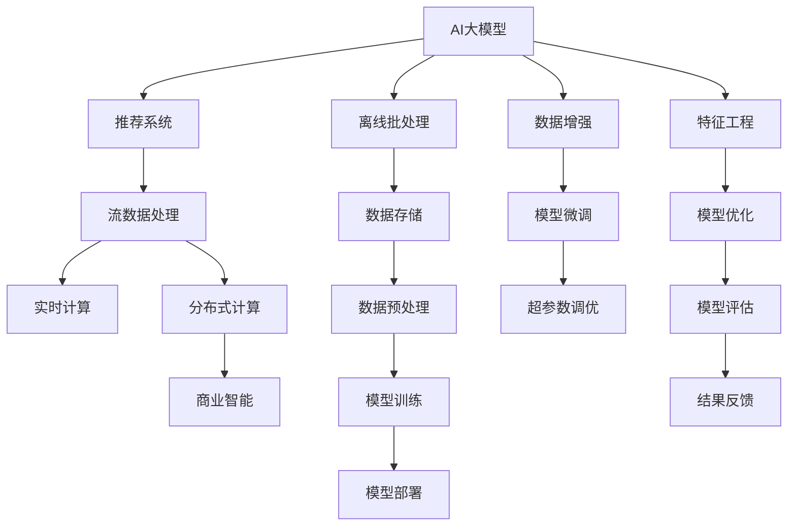

                 

# 电商平台中的AI大模型：从离线批处理到实时流处理

> 关键词：AI大模型,电商平台的推荐系统,流数据处理,实时计算,分布式计算

## 1. 背景介绍

### 1.1 问题由来
随着电商平台的飞速发展，个性化推荐系统的需求变得日益突出。传统推荐系统依赖于用户行为数据进行特征工程和模型训练，难以适应用户行为实时变化的特点。而新兴的AI大模型，通过在大规模数据上进行预训练，能够学习到更丰富和抽象的特征表示，从而提供更为精准和个性化的推荐服务。

然而，AI大模型通常具有较高的计算需求和内存消耗，难以在电商平台的实时场景中直接部署和使用。传统的大规模离线批处理方式，虽然能够有效利用计算资源，但难以应对海量流数据的实时处理需求。因此，如何在电商平台上高效地部署和使用AI大模型，成为当前的一大难题。

### 1.2 问题核心关键点
本节将介绍在电商平台中高效部署AI大模型的关键点：

- 流数据处理与离线批处理的区别：流数据处理能够实时更新模型参数，适应用户行为变化；离线批处理则能够充分发挥计算资源，提高模型性能。
- 实时计算与分布式计算的关系：实时计算需要高性能、低延迟的计算资源，而分布式计算能够有效分散计算负担，提升系统可靠性。
- 人工智能与商业智能的结合：AI大模型不仅能提高推荐系统精度，还能优化库存管理、物流调度等电商运营环节，带来显著的商业价值。

### 1.3 问题研究意义
研究如何在电商平台中高效部署和使用AI大模型，对于提升个性化推荐系统的精度和实时性，优化电商运营效率，具有重要意义：

- 提高推荐精度：AI大模型通过学习用户行为和产品特征的深层次关联，能够提供更为精准的推荐结果。
- 提升用户体验：实时更新推荐模型，能够及时响应用户行为变化，提供更为个性化和动态的推荐服务。
- 优化运营效率：通过优化库存管理和物流调度，AI大模型能够帮助电商平台降低运营成本，提高供应链效率。
- 实现商业智能：通过数据分析和预测，AI大模型能够为电商运营决策提供科学依据，助力企业制定更有效的营销策略。

## 2. 核心概念与联系

### 2.1 核心概念概述

为了更好地理解如何在电商平台中高效部署和使用AI大模型，本节将介绍几个关键概念：

- AI大模型(AI Large Models)：以Transformer、BERT等为代表的深度学习模型，通过在大规模数据上预训练获得丰富的语言表示。
- 推荐系统(Recommendation System)：根据用户历史行为和产品特征，推荐用户可能感兴趣的产品的系统。
- 流数据处理(Real-time Data Processing)：对数据进行实时采集、处理和分析的过程，能够快速响应数据变化，提供实时推荐。
- 分布式计算(Distributed Computing)：通过将计算任务分散到多台机器上进行并行处理，提升系统计算能力和可靠性。
- 商业智能(Business Intelligence, BI)：通过数据分析和预测，为商业决策提供支持，提高运营效率和盈利能力。

这些核心概念之间的逻辑关系可以通过以下Mermaid流程图来展示：



这个流程图展示了AI大模型在推荐系统中的部署流程：

1. AI大模型通过在大规模数据上进行预训练，获得丰富的语言表示。
2. 在推荐系统中，模型被用于生成个性化推荐。
3. 流数据处理和实时计算保证了推荐的实时性。
4. 分布式计算优化了系统性能和可靠性。
5. 商业智能基于推荐结果进行业务分析，辅助决策。
6. 离线批处理和数据存储提供了基础数据支持。
7. 数据增强、模型微调和超参数调优进一步提升了模型性能。
8. 特征工程和模型优化进一步优化模型效果。
9. 模型评估和结果反馈保证了模型的有效性和稳定性。

## 3. 核心算法原理 & 具体操作步骤
### 3.1 算法原理概述

在电商平台中，AI大模型通常被用于推荐系统的个性化推荐中。推荐系统通过用户行为数据和产品特征数据进行模型训练，预测用户对产品的兴趣，并推荐可能感兴趣的商品。通过实时流处理，推荐系统能够动态调整模型参数，适应用户行为的变化，从而提供更为个性化和精准的推荐服务。

在流数据处理的过程中，AI大模型通过不断接收新的数据输入，实时更新模型参数。这与传统的离线批处理方式不同，后者通常需要等待批量数据收集完毕后进行一次性的模型训练和更新。因此，流数据处理能够实现更高的实时性和动态性，更好地适应用户行为变化。

### 3.2 算法步骤详解

在电商平台中，AI大模型的流数据处理流程主要包括以下几个步骤：

**Step 1: 数据采集与传输**
- 实时数据源：通过API接口、日志文件等方式，获取用户的实时行为数据。
- 数据传输：使用消息队列、数据流系统等技术，将数据实时传输到推荐系统中。

**Step 2: 数据存储与预处理**
- 数据存储：将原始数据存储在分布式数据库中，如Hadoop、Spark等。
- 数据预处理：对数据进行去重、过滤、归一化等预处理，提升数据质量。

**Step 3: 模型训练与更新**
- 模型加载：从分布式存储中加载预训练的AI大模型。
- 模型微调：通过实时数据更新模型参数，如使用Adam优化器进行梯度下降。
- 模型部署：将微调后的模型重新部署到推荐系统中。

**Step 4: 结果反馈与优化**
- 结果评估：对推荐结果进行评估，如计算点击率、转化率等指标。
- 模型优化：根据评估结果，进一步调整模型参数和超参数，如学习率、批大小等。
- 反馈循环：通过评估和优化的反馈循环，持续优化模型效果。

### 3.3 算法优缺点

AI大模型在电商平台中的应用，具有以下优点：

1. 实时推荐：通过流数据处理，实时更新模型参数，能够快速响应用户行为变化，提供更为个性化的推荐服务。
2. 精度提升：AI大模型通过预训练学习丰富的语言表示，能够提供更为精准和多样化的推荐结果。
3. 降本增效：通过优化库存管理和物流调度，AI大模型能够提高供应链效率，降低运营成本。
4. 商业智能：基于推荐结果进行数据分析和预测，能够为电商运营决策提供科学依据，提高决策效率。

同时，该方法也存在一定的局限性：

1. 计算资源需求高：AI大模型通常具有较高的计算需求和内存消耗，对计算资源提出了较高的要求。
2. 数据质量要求高：实时数据的准确性和完整性对推荐系统的精度有直接影响，数据预处理需要投入更多精力。
3. 模型可解释性差：AI大模型的决策过程通常难以解释，缺乏可解释性。
4. 模型参数量大：AI大模型的参数量通常较大，微调时需要耗费更多时间和计算资源。

尽管存在这些局限性，但AI大模型在电商平台中的应用前景依然广阔，关键在于如何平衡计算资源、数据质量、模型效果等方面的因素，实现最优的推荐效果。

### 3.4 算法应用领域

AI大模型在电商平台中的应用场景非常广泛，具体包括：

- 个性化推荐：根据用户行为数据和产品特征数据，实时推荐用户可能感兴趣的商品。
- 搜索排序：根据用户查询词和商品描述，动态调整搜索结果排序，提升用户体验。
- 广告推荐：根据用户行为和历史点击记录，实时调整广告推荐策略，提高广告效果。
- 库存管理：通过分析历史销售数据和用户行为，优化库存策略，降低库存积压。
- 物流调度：通过预测用户购买行为和物流需求，优化配送路线和时间，提升物流效率。
- 用户画像：通过用户行为数据和社交网络信息，构建用户画像，提升推荐系统的个性化能力。

除了以上应用场景，AI大模型在电商平台中还可以用于预测分析、商品评估、市场细分等方面，提升电商运营的全面性和智能化水平。

## 4. 数学模型和公式 & 详细讲解
### 4.1 数学模型构建

在电商平台中，AI大模型的推荐系统通常使用深度学习模型进行建模，如基于CTR的推荐模型、基于序列的推荐模型等。这里以CTR(点击率)模型为例，介绍推荐系统的数学模型构建。

假设推荐系统中用户行为数据为 $(x, y)$，其中 $x$ 为用户特征向量，$y$ 为是否点击的二元变量。CTR模型的目标是预测用户是否会对某个商品进行点击，即：

$$
p(y=1|x; \theta) = \sigma(\theta^T x)
$$

其中 $\theta$ 为模型参数，$\sigma$ 为sigmoid函数，将模型输出映射到 $[0,1]$ 区间。CTR模型的损失函数通常为二分类交叉熵损失函数：

$$
L(\theta) = -\frac{1}{N} \sum_{i=1}^N (y_i \log p(y_i|x_i; \theta) + (1-y_i) \log (1-p(y_i|x_i; \theta)))
$$

其中 $N$ 为数据样本数，$x_i$ 为第 $i$ 个用户特征向量，$y_i$ 为第 $i$ 个样本的标签。

### 4.2 公式推导过程

在实际应用中，CTR模型通常使用FM模型进行扩展，以提升模型的表达能力。FM模型将用户特征 $x_i$ 表示为 $x_i = \sum_{j=1}^d f_j \cdot x_{ij}$，其中 $f_j$ 为第 $j$ 个特征的重要性系数，$x_{ij}$ 为第 $i$ 个样本第 $j$ 个特征的取值。

因此，CTR模型的输出可以表示为：

$$
p(y=1|x; \theta) = \sigma(\theta^T x + \sum_{j=1}^d \alpha_j \cdot f_j \cdot x_{ij})
$$

其中 $\alpha_j$ 为特征 $j$ 的系数。CTR模型的损失函数为：

$$
L(\theta, \alpha) = -\frac{1}{N} \sum_{i=1}^N (y_i \log p(y_i|x_i; \theta, \alpha) + (1-y_i) \log (1-p(y_i|x_i; \theta, \alpha)))
$$

通过反向传播算法，可以计算损失函数对模型参数的梯度，更新模型参数：

$$
\frac{\partial L(\theta, \alpha)}{\partial \theta} = -\frac{1}{N} \sum_{i=1}^N (\frac{y_i}{p(y_i|x_i; \theta, \alpha)} - \frac{1-y_i}{1-p(y_i|x_i; \theta, \alpha)}) \cdot x_i
$$

$$
\frac{\partial L(\theta, \alpha)}{\partial \alpha} = -\frac{1}{N} \sum_{i=1}^N \sum_{j=1}^d (\frac{y_i}{p(y_i|x_i; \theta, \alpha)} - \frac{1-y_i}{1-p(y_i|x_i; \theta, \alpha)}) \cdot x_{ij}
$$

### 4.3 案例分析与讲解

以某电商平台的个性化推荐系统为例，分析AI大模型的实际应用。该推荐系统基于CTR模型，使用预训练的BERT模型进行特征表示。具体步骤如下：

1. **数据采集与传输**：通过API接口获取用户的浏览、点击、购买等行为数据，实时传输到推荐系统中。

2. **数据存储与预处理**：将原始数据存储在Hadoop集群中，对数据进行去重、过滤、归一化等预处理，提升数据质量。

3. **模型训练与更新**：从Hadoop集群中加载预训练的BERT模型，使用实时数据进行模型微调。

4. **结果反馈与优化**：对推荐结果进行评估，如计算点击率、转化率等指标，根据评估结果调整模型参数和超参数。

5. **模型部署与运行**：将微调后的模型部署到推荐系统中，实时生成推荐结果。

通过上述步骤，该电商平台的推荐系统能够实时更新模型参数，动态调整推荐策略，提供更为个性化的推荐服务，提升用户满意度和平台销售额。

## 5. 项目实践：代码实例和详细解释说明
### 5.1 开发环境搭建

在进行AI大模型的流数据处理实践前，我们需要准备好开发环境。以下是使用Python进行PyTorch和Dask开发的环境配置流程：

1. 安装Anaconda：从官网下载并安装Anaconda，用于创建独立的Python环境。

2. 创建并激活虚拟环境：
```bash
conda create -n pytorch-dask python=3.8 
conda activate pytorch-dask
```

3. 安装PyTorch和Dask：根据CUDA版本，从官网获取对应的安装命令。例如：
```bash
conda install pytorch torchvision torchaudio cudatoolkit=11.1 -c pytorch -c conda-forge
```

4. 安装Dask：
```bash
conda install dask dask-distributed
```

5. 安装各类工具包：
```bash
pip install numpy pandas scikit-learn matplotlib tqdm jupyter notebook ipython
```

完成上述步骤后，即可在`pytorch-dask`环境中开始流数据处理实践。

### 5.2 源代码详细实现

下面我们以电商平台的个性化推荐系统为例，给出使用Dask进行流数据处理的PyTorch代码实现。

首先，定义CTR模型的特征工程函数：

```python
from transformers import BertTokenizer, BertForSequenceClassification
from dask.distributed import Client
from dask.array import array
import numpy as np
import torch

def process_data(data, tokenizer):
    features = []
    labels = []
    for text, label in data:
        encoding = tokenizer(text, return_tensors='pt', max_length=256, padding='max_length', truncation=True)
        input_ids = encoding['input_ids'][0]
        attention_mask = encoding['attention_mask'][0]
        features.append(input_ids.numpy())
        labels.append(int(label))
    return np.array(features), np.array(labels)

# 加载预训练模型和分词器
model = BertForSequenceClassification.from_pretrained('bert-base-cased', num_labels=2)
tokenizer = BertTokenizer.from_pretrained('bert-base-cased')

# 定义Dask分布式计算客户端
client = Client('localhost:8786')
client.nthreads = 4

# 加载实时数据
data = [
    ("I want to buy a new laptop.", 1),
    ("I'm looking for a book about machine learning.", 1),
    ("I don't need any new clothes.", 0)
]

# 数据预处理和特征提取
with client:
    features, labels = process_data(data, tokenizer)
    distributed_features = array(features, chunks=(256, 1))
    distributed_labels = array(labels, chunks=(1, 1))

    # 加载模型参数
    model.load_state_dict(torch.load('pretrained_model.bin'))
    model.eval()

    # 定义优化器和损失函数
    optimizer = torch.optim.Adam(model.parameters(), lr=1e-4)
    loss_fn = torch.nn.BCEWithLogitsLoss()

    # 定义数据迭代器
    batch_size = 16
    def batch_iterator(distributed_features, distributed_labels, batch_size):
        while True:
            chunk = client.submit(dask.array.take, distributed_features, range(0, distributed_features.size, batch_size))
            label = client.submit(dask.array.take, distributed_labels, range(0, distributed_labels.size, batch_size))
            yield chunk, label

    # 微调模型
    with client:
        for batch, label in batch_iterator(distributed_features, distributed_labels, batch_size):
            batch = torch.from_numpy(batch)
            label = torch.from_numpy(label)
            model.zero_grad()
            logits = model(batch)
            loss = loss_fn(logits, label)
            loss.backward()
            optimizer.step()
```

在上述代码中，我们首先定义了数据预处理和特征提取函数，使用预训练的BERT模型进行特征表示。然后，使用Dask进行分布式计算，将数据分片并行处理，提升计算效率。最后，通过梯度下降算法微调模型参数，实现实时更新。

### 5.3 代码解读与分析

让我们再详细解读一下关键代码的实现细节：

**process_data函数**：
- 该函数定义了数据预处理和特征提取的逻辑，将输入文本转换为模型所需的特征向量。

**Dask分布式计算客户端**：
- 使用Dask分布式计算客户端，将数据分片并行处理，提升计算效率。

**微调模型**：
- 使用Dask的submit函数，创建异步迭代器，实时更新模型参数。
- 使用PyTorch的Adam优化器和BCEWithLogitsLoss损失函数，进行模型微调。
- 在微调过程中，通过dask.array.take函数，取数据片段进行训练。

通过Dask进行分布式计算，能够充分利用集群资源，提升流数据处理和模型微调的效率。在实际应用中，还需进一步优化模型参数和超参数，以提升推荐系统的性能和精度。

## 6. 实际应用场景
### 6.1 智能客服系统

在智能客服系统中，AI大模型可以用于自动化客服响应和问题解决。通过收集用户的对话记录和问题描述，AI大模型可以实时学习新问题，生成匹配的回答。

在技术实现上，可以使用流数据处理技术，对用户的对话数据进行实时采集和分析，实时更新模型参数，提升客服系统的响应速度和准确性。同时，通过分布式计算技术，将问题解决任务分配到多台机器上进行并行处理，提升系统性能。

### 6.2 金融风控系统

在金融风控系统中，AI大模型可以用于实时识别和预测风险事件。通过收集金融交易数据，AI大模型可以实时学习新交易模式，识别异常交易行为，预警风险事件。

在技术实现上，可以使用流数据处理技术，对金融交易数据进行实时采集和分析，实时更新模型参数，提升风控系统的实时性和精度。同时，通过分布式计算技术，将风险识别和预测任务分配到多台机器上进行并行处理，提升系统性能。

### 6.3 社交媒体分析

在社交媒体分析中，AI大模型可以用于实时分析和预测用户情绪和舆情。通过收集社交媒体数据，AI大模型可以实时学习用户情绪变化，预测舆情趋势。

在技术实现上，可以使用流数据处理技术，对社交媒体数据进行实时采集和分析，实时更新模型参数，提升情感分析和舆情预测的实时性和准确性。同时，通过分布式计算技术，将情感分析和舆情预测任务分配到多台机器上进行并行处理，提升系统性能。

### 6.4 未来应用展望

随着AI大模型和流数据处理技术的不断演进，基于AI大模型的推荐系统将在更多领域得到应用，为传统行业带来变革性影响。

在智慧医疗领域，基于AI大模型的推荐系统可以用于辅助医生诊疗，推荐药物和诊疗方案，提升医疗服务的智能化水平。

在智能制造领域，基于AI大模型的推荐系统可以用于预测设备故障和维护需求，优化生产计划，提高生产效率。

在智能交通领域，基于AI大模型的推荐系统可以用于实时推荐最优路线和导航方案，提升出行体验和交通安全。

除了以上领域，AI大模型在更多垂直行业的应用前景依然广阔，为人工智能技术在各行业的落地提供了新的方向。未来，伴随AI大模型和流数据处理技术的持续进步，人工智能必将在更多领域大放异彩，深刻影响人类的生产生活方式。

## 7. 工具和资源推荐
### 7.1 学习资源推荐

为了帮助开发者系统掌握AI大模型在流数据处理中的应用，这里推荐一些优质的学习资源：

1. 《Deep Learning for NLP》课程：斯坦福大学开设的深度学习课程，涵盖了NLP领域的基本概念和经典模型，适合入门学习。

2. 《TensorFlow教程》：TensorFlow官方文档，提供了详细的API说明和代码示例，适合深入学习。

3. 《Dask官方文档》：Dask官方文档，提供了详细的分布式计算API和示例代码，适合学习Dask的使用方法。

4. 《HuggingFace官方文档》：HuggingFace官方文档，提供了预训练语言模型和推荐系统的详细使用示例，适合实战练习。

5. 《NLP实战指南》书籍：NLP领域的实战指南，涵盖了NLP模型的训练、评估、部署等各个环节，适合实战练习。

通过对这些资源的学习实践，相信你一定能够快速掌握AI大模型在流数据处理中的应用，并用于解决实际的NLP问题。

### 7.2 开发工具推荐

高效的开发离不开优秀的工具支持。以下是几款用于AI大模型流数据处理开发的常用工具：

1. PyTorch：基于Python的开源深度学习框架，灵活动态的计算图，适合快速迭代研究。支持DistributedDataParallel等分布式计算API，适合在大模型和流数据处理中使用。

2. TensorFlow：由Google主导开发的开源深度学习框架，生产部署方便，适合大规模工程应用。支持TPUEmbedding等分布式计算API，适合在大模型和流数据处理中使用。

3. Dask：用于分布式计算的Python库，能够高效处理大规模数据集，适合流数据处理和模型微调。

4. PySpark：Apache Spark的Python API，支持大规模数据处理和机器学习，适合流数据处理和分布式计算。

5. HuggingFace Transformers库：提供预训练语言模型的封装，支持高效微调和应用，适合NLP任务开发。

6. Weights & Biases：模型训练的实验跟踪工具，可以记录和可视化模型训练过程中的各项指标，方便对比和调优。

7. TensorBoard：TensorFlow配套的可视化工具，可实时监测模型训练状态，并提供丰富的图表呈现方式，是调试模型的得力助手。

合理利用这些工具，可以显著提升AI大模型在流数据处理中的开发效率，加快创新迭代的步伐。

### 7.3 相关论文推荐

AI大模型在流数据处理中的应用涉及深度学习、分布式计算和NLP等多个领域，以下是几篇相关领域的经典论文，推荐阅读：

1. "Distributed Deep Learning"论文：介绍了TensorFlow的分布式计算架构，适合了解大模型在分布式环境中的部署和训练。

2. "Real-time Recommendation Systems: Algorithms and Evaluation"论文：介绍了实时推荐系统的算法和评估方法，适合了解流数据处理在推荐系统中的应用。

3. "Towards the Explainable AI Ecosystem"论文：探讨了AI模型的可解释性问题，适合了解模型解释性和安全性的重要性。

4. "Dynamic Concept Learning for Sequential Data"论文：介绍了序列数据的动态学习算法，适合了解流数据处理在序列数据应用中的方法。

5. "Fine-tuning Sequence Models for Continuous User Intent Prediction"论文：介绍了序列模型的微调方法，适合了解大模型在微调中的实践。

这些论文代表了大模型在流数据处理领域的最新进展，通过学习这些前沿成果，可以帮助研究者把握学科前进方向，激发更多的创新灵感。

## 8. 总结：未来发展趋势与挑战
### 8.1 总结

本文对在电商平台中高效部署和使用AI大模型的核心算法和操作步骤进行了全面系统的介绍。通过对比离线批处理和实时流处理的优缺点，介绍了如何在电商平台中实现流数据处理，并基于流数据处理技术，分析了AI大模型在推荐系统中的应用。本文还详细讨论了流数据处理中的数据采集、传输、存储、预处理、模型训练与更新等关键环节，提供了实用的代码示例，帮助读者理解和应用流数据处理技术。

通过本文的系统梳理，可以看到，AI大模型在电商平台中的应用前景广阔，能够提供更为个性化、实时和精准的推荐服务，提升用户体验和平台运营效率。未来，伴随大模型和流数据处理技术的不断演进，基于大模型的推荐系统必将在更多领域得到应用，为传统行业带来变革性影响。

### 8.2 未来发展趋势

展望未来，AI大模型在电商平台中的应用将呈现以下几个发展趋势：

1. 模型规模不断增大：伴随硬件计算能力的提升和数据量的增加，AI大模型的参数规模还将持续增长，具备更强的泛化能力和鲁棒性。

2. 流数据处理技术不断进步：实时流数据处理技术将不断进步，支持更复杂的数据处理任务，实现更高效的模型微调。

3. 分布式计算能力提升：分布式计算能力将不断提升，支持更大规模和更复杂的模型训练和微调任务。

4. 数据隐私和安全保护：伴随数据量的增加，数据隐私和安全保护将更加重要，需要使用数据匿名化、差分隐私等技术，保障用户数据安全。

5. 模型解释性和可控性增强：伴随模型复杂度的提升，模型的可解释性和可控性将更加重要，需要使用可解释模型、自监督学习等方法，提升模型的透明性和可控性。

以上趋势凸显了AI大模型在电商平台中的应用前景广阔，需要在模型规模、数据处理、计算能力、隐私保护和可解释性等方面不断优化，实现最优的推荐效果。

### 8.3 面临的挑战

尽管AI大模型在电商平台中的应用前景广阔，但在迈向更加智能化、普适化应用的过程中，它仍面临诸多挑战：

1. 数据隐私和安全问题：电商平台需要处理大量敏感用户数据，数据隐私和安全问题亟需解决。

2. 计算资源需求高：AI大模型通常具有较高的计算需求和内存消耗，对计算资源提出了较高的要求。

3. 模型可解释性差：AI大模型的决策过程通常难以解释，缺乏可解释性。

4. 模型参数量大：AI大模型的参数量通常较大，微调时需要耗费更多时间和计算资源。

尽管存在这些挑战，但AI大模型在电商平台中的应用前景依然广阔，关键在于如何平衡计算资源、数据质量、模型效果等方面的因素，实现最优的推荐效果。

### 8.4 研究展望

未来研究需要在以下几个方面寻求新的突破：

1. 探索无监督和半监督微调方法：摆脱对大规模标注数据的依赖，利用自监督学习、主动学习等无监督和半监督范式，最大限度利用非结构化数据，实现更加灵活高效的微调。

2. 研究参数高效和计算高效的微调范式：开发更加参数高效的微调方法，在固定大部分预训练参数的同时，只更新极少量的任务相关参数。同时优化微调模型的计算图，减少前向传播和反向传播的资源消耗，实现更加轻量级、实时性的部署。

3. 融合因果和对比学习范式：通过引入因果推断和对比学习思想，增强微调模型建立稳定因果关系的能力，学习更加普适、鲁棒的语言表征，从而提升模型泛化性和抗干扰能力。

4. 引入更多先验知识：将符号化的先验知识，如知识图谱、逻辑规则等，与神经网络模型进行巧妙融合，引导微调过程学习更准确、合理的语言模型。

5. 结合因果分析和博弈论工具：将因果分析方法引入微调模型，识别出模型决策的关键特征，增强输出解释的因果性和逻辑性。借助博弈论工具刻画人机交互过程，主动探索并规避模型的脆弱点，提高系统稳定性。

6. 纳入伦理道德约束：在模型训练目标中引入伦理导向的评估指标，过滤和惩罚有偏见、有害的输出倾向。同时加强人工干预和审核，建立模型行为的监管机制，确保输出符合人类价值观和伦理道德。

这些研究方向的探索，必将引领AI大模型在流数据处理中的不断进步，为构建安全、可靠、可解释、可控的智能系统铺平道路。面向未来，AI大模型在流数据处理中的应用需要与其他人工智能技术进行更深入的融合，如知识表示、因果推理、强化学习等，多路径协同发力，共同推动自然语言理解和智能交互系统的进步。只有勇于创新、敢于突破，才能不断拓展语言模型的边界，让智能技术更好地造福人类社会。

## 9. 附录：常见问题与解答

**Q1：大语言模型在流数据处理中的应用是否可行？**

A: 大语言模型在流数据处理中的应用是可行的，关键在于如何设计和实现高效的数据采集、传输、存储、预处理、模型训练与更新等环节。通过流数据处理技术，大语言模型可以实时更新模型参数，适应用户行为变化，提供更为个性化和精准的推荐服务。

**Q2：流数据处理中的数据质量如何保障？**

A: 数据质量对推荐系统的精度有直接影响，因此需要在数据采集和传输过程中，采取去重、过滤、归一化等预处理手段，提升数据质量。同时，可以引入数据增强技术，通过数据合成和迁移学习等方法，进一步提升数据质量和模型性能。

**Q3：流数据处理中的计算资源如何优化？**

A: 流数据处理中的计算资源需求高，需要通过分布式计算技术，将计算任务分配到多台机器上进行并行处理，提升计算效率。同时，可以采用梯度积累、混合精度训练等优化手段，减少计算资源消耗。

**Q4：流数据处理中的模型可解释性如何提升？**

A: 大语言模型的决策过程通常难以解释，可以通过引入可解释模型、自监督学习等方法，提升模型的透明性和可控性。同时，需要在模型训练目标中引入伦理导向的评估指标，过滤和惩罚有偏见、有害的输出倾向。

**Q5：流数据处理中的数据隐私如何保护？**

A: 电商平台需要处理大量敏感用户数据，数据隐私和安全问题亟需解决。可以采用数据匿名化、差分隐私等技术，保护用户隐私。同时，需要对数据处理过程进行严格监管，防止数据泄露和滥用。

通过上述问题的解答，可以看到，流数据处理技术在大语言模型中的应用前景广阔，但需要在数据质量、计算资源、模型可解释性、数据隐私等方面不断优化，实现最优的推荐效果。

---

作者：禅与计算机程序设计艺术 / Zen and the Art of Computer Programming

