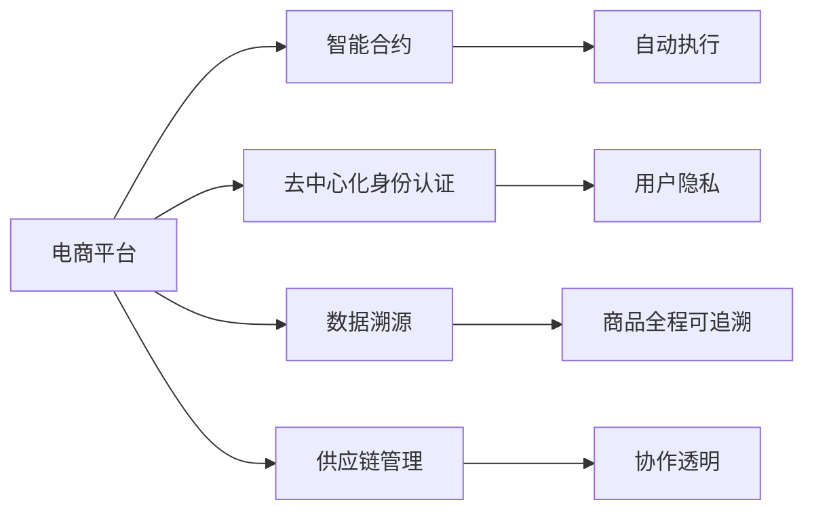

                 

# 电商平台中的区块链技术应用

## 1. 背景介绍

### 1.1 问题由来

随着电子商务的飞速发展，电商平台交易模式日趋复杂，数据量和业务规模不断扩大。传统中心化系统面临诸如单点故障、数据篡改、信任问题等挑战。区块链技术以其分布式、透明、不可篡改的特性，为电商平台的治理模式和业务流程带来了新的思路。

近年来，区块链技术在电商平台中的应用逐渐被重视，旨在提升交易安全、降低运营成本、优化供应链管理、增强用户信任等。这其中，基于区块链的智能合约、身份认证、溯源系统、供应链管理等应用，已经在一些大型电商平台上实现了初步部署和应用。

### 1.2 问题核心关键点

当前，区块链技术在电商平台中的应用主要包括智能合约、供应链金融、去中心化身份认证、数据溯源和供应链管理等方面。这些应用的核心关键点在于：

1. **智能合约**：基于区块链的可执行代码，用于自动化执行电商交易的条款和条件，减少人为干预，提升交易效率。
2. **供应链金融**：通过区块链技术，搭建多方参与的供应链融资平台，降低资金流转成本，提高融资效率。
3. **去中心化身份认证**：利用区块链技术，构建去中心化的用户身份管理系统，增强用户隐私保护和信任度。
4. **数据溯源**：基于区块链的溯源系统，实现商品的全程可追溯，增强商品质量和供应链透明度。
5. **供应链管理**：结合区块链技术，构建透明的供应链管理体系，提升供应链管理效率和协作水平。

### 1.3 问题研究意义

区块链技术在电商平台中的应用，对于提升交易安全、优化业务流程、增强用户信任等方面具有重要意义：

1. **提升交易安全**：区块链的不可篡改特性，保证了交易数据的真实性和完整性，减少了交易中的欺诈和纠纷。
2. **优化业务流程**：智能合约和自动执行机制，可以自动化执行电商交易流程，减少人工干预，提升效率。
3. **增强用户信任**：去中心化身份认证和数据溯源，增强了用户对电商平台和产品的信任度。
4. **降低运营成本**：通过区块链技术优化供应链管理，降低了运营成本和资金流转成本。
5. **促进业务创新**：区块链技术的引入，推动了电商平台的业务模式创新，带来了新的商业机遇。

## 2. 核心概念与联系

### 2.1 核心概念概述

为了更好地理解区块链技术在电商平台中的应用，本节将介绍几个密切相关的核心概念：

- **区块链(Blockchain)**：一种分布式账本技术，通过链式结构存储数据，并通过共识算法保证数据一致性和安全性。
- **智能合约(Smart Contracts)**：一种基于区块链的可执行代码，能够在特定条件下自动执行。
- **去中心化身份认证(Decentralized Identity)**：通过区块链技术构建去中心化的身份管理系统，提升用户隐私保护和信任度。
- **数据溯源(Data Traceability)**：利用区块链技术实现商品和供应链的全程可追溯，提高透明度和质量保证。
- **供应链管理(Supply Chain Management)**：结合区块链技术，构建透明的供应链管理体系，提升管理效率和协作水平。

这些核心概念之间的逻辑关系可以通过以下Mermaid流程图来展示：



这个流程图展示了一些核心概念及其之间的关系：

1. 电商平台通过智能合约进行自动化交易。
2. 利用去中心化身份认证，提升用户隐私保护和信任度。
3. 数据溯源实现商品和供应链的全程可追溯，提高透明度和质量保证。
4. 供应链管理结合区块链技术，构建透明的供应链管理体系，提升管理效率和协作水平。

这些概念共同构成了区块链技术在电商平台中的应用框架，使其能够在各种场景下发挥强大的优势。通过理解这些核心概念，我们可以更好地把握区块链技术的应用方向。

## 3. 核心算法原理 & 具体操作步骤

### 3.1 算法原理概述

区块链技术在电商平台中的应用，本质上是通过区块链的分布式账本和智能合约机制，实现交易自动化、提升数据透明度、增强信任度的过程。其核心思想是：

1. **分布式账本**：将交易数据存储在多个节点上，保证数据的分布式存储和冗余备份，避免单点故障和数据篡改。
2. **智能合约**：通过区块链的可执行代码，自动执行电商交易条款，提升交易效率和自动化水平。
3. **去中心化身份认证**：利用区块链技术，构建去中心化的身份管理系统，保护用户隐私和增强信任度。
4. **数据溯源**：通过区块链的不可篡改特性，实现商品和供应链的全程可追溯，提高透明度和质量保证。
5. **供应链管理**：结合区块链技术，构建透明的供应链管理体系，提升管理效率和协作水平。

### 3.2 算法步骤详解

基于区块链技术在电商平台中的应用，本节将详细讲解其核心操作步骤：

**Step 1: 选择适合的区块链平台**

根据电商平台的业务需求和技术要求，选择合适的区块链平台。目前主流的区块链平台包括Hyperledger Fabric、Ethereum、EOS等。Hyperledger Fabric适用于企业级应用，具有灵活的架构和智能合约支持；Ethereum是最广泛使用的公有链平台，支持智能合约和DApp开发；EOS则以高效的交易速度和低成本著称，适合对交易速度要求较高的应用。

**Step 2: 设计智能合约**

根据电商平台的具体业务需求，设计智能合约的条款和条件。智能合约应包括交易条款、条件、执行逻辑等，确保交易的安全性和自动化。

**Step 3: 搭建去中心化身份认证系统**

利用区块链技术，构建去中心化的用户身份管理系统。用户可以通过区块链平台进行身份认证、权限管理等操作，增强用户隐私保护和信任度。

**Step 4: 实施数据溯源系统**

基于区块链的不可篡改特性，实施数据溯源系统。记录商品的生产、运输、销售等全流程信息，实现商品和供应链的全程可追溯，提高透明度和质量保证。

**Step 5: 优化供应链管理**

结合区块链技术，优化供应链管理流程。构建透明的供应链管理体系，提升供应链管理效率和协作水平，降低运营成本。

**Step 6: 部署和测试**

在测试环境下部署区块链应用，进行全面的测试和验证。确保系统的稳定性和安全性，及时发现和修复潜在问题。

### 3.3 算法优缺点

基于区块链技术在电商平台中的应用，具有以下优点：

1. **提升交易安全**：区块链的不可篡改特性，保证了交易数据的真实性和完整性，减少了交易中的欺诈和纠纷。
2. **优化业务流程**：智能合约和自动执行机制，可以自动化执行电商交易流程，减少人工干预，提升效率。
3. **增强用户信任**：去中心化身份认证和数据溯源，增强了用户对电商平台和产品的信任度。
4. **降低运营成本**：通过区块链技术优化供应链管理，降低了运营成本和资金流转成本。
5. **促进业务创新**：区块链技术的引入，推动了电商平台的业务模式创新，带来了新的商业机遇。

同时，该方法也存在一定的局限性：

1. **技术门槛高**：区块链技术的实施需要较高的技术门槛和开发成本。
2. **性能瓶颈**：目前区块链平台如Hyperledger Fabric、Ethereum等的交易速度和吞吐量可能无法满足大规模电商平台的需要。
3. **法律和监管风险**：区块链技术的国际化和匿名性可能导致法律和监管上的不确定性。
4. **开发和维护成本**：区块链系统的开发和维护需要持续投入资源和技术支持。

尽管存在这些局限性，但就目前而言，区块链技术在电商平台中的应用仍然显示出其巨大的潜力和前景。未来相关研究的重点在于如何进一步降低技术门槛，提升系统性能，同时兼顾法律和监管风险。

### 3.4 算法应用领域

基于区块链技术在电商平台中的应用，主要涉及以下领域：

1. **智能合约应用**：智能合约在电商平台的支付、发货、收货、评价等环节得到了广泛应用，提升了交易的自动化和安全性。
2. **去中心化身份认证**：电商平台利用区块链技术构建去中心化的身份管理系统，增强用户隐私保护和信任度。
3. **数据溯源系统**：基于区块链的溯源系统，实现商品和供应链的全程可追溯，提高透明度和质量保证。
4. **供应链金融**：结合区块链技术，构建多方参与的供应链融资平台，降低资金流转成本，提高融资效率。
5. **供应链管理**：区块链技术在电商平台的供应链管理中得到了广泛应用，提升了供应链管理效率和协作水平。

除了上述这些核心领域外，区块链技术还被创新性地应用到更多场景中，如可控交易、去中心化应用、数字资产管理等，为电商平台带来了全新的突破。随着区块链技术的不断进步，相信其在电商平台中的应用将更加广泛和深入。

## 4. 数学模型和公式 & 详细讲解 & 举例说明

### 4.1 数学模型构建

本节将使用数学语言对区块链技术在电商平台中的应用进行更加严格的刻画。

记电商平台为 $E$，其交易数据存储在区块链平台 $B$ 上。智能合约 $C$ 在交易中自动执行特定的条款和条件，去中心化身份认证系统 $I$ 用于保护用户隐私和增强信任度，数据溯源系统 $T$ 实现商品和供应链的全程可追溯，供应链管理系统 $S$ 用于提升供应链管理效率和协作水平。

区块链平台 $B$ 由多个节点组成，每个节点 $n$ 存储部分交易数据，并通过共识算法保证数据一致性和安全性。智能合约 $C$ 通过区块链平台执行特定的交易条款，去中心化身份认证系统 $I$ 用于保护用户隐私和增强信任度，数据溯源系统 $T$ 实现商品和供应链的全程可追溯，供应链管理系统 $S$ 用于提升供应链管理效率和协作水平。

### 4.2 公式推导过程

以下我们以智能合约的自动执行为例，推导智能合约的数学模型和计算公式。

假设电商平台中的交易数据为 $D=\{d_i\}_{i=1}^N$，每个数据项 $d_i$ 包括交易双方的地址、交易金额、交易时间等信息。智能合约 $C$ 包括交易条款 $k$ 和执行逻辑 $f$。执行逻辑 $f$ 根据交易条款 $k$ 和交易数据 $D$，计算出是否满足执行条件。如果满足执行条件，则自动执行交易，否则返回错误。

假设智能合约 $C$ 执行成功的概率为 $P(C)$，失败的概率为 $P(\overline{C})$。则智能合约的执行成功率可以表示为：

$$
P(C) = \prod_{i=1}^N P(C_i|D_i)
$$

其中 $P(C_i|D_i)$ 表示在单个数据项 $d_i$ 的情况下，智能合约执行成功的概率。

### 4.3 案例分析与讲解

为了更好地理解区块链技术在电商平台中的应用，下面以智能合约和供应链管理为例进行案例分析。

**智能合约案例**：某电商平台推出智能合约应用，用于自动执行订单支付和发货流程。用户在下单后，支付订单金额，智能合约在订单金额支付完成后，自动触发发货流程。用户可以在发货后进行评价，智能合约根据评价结果，决定是否自动完成交易。

在实际应用中，智能合约的设计需要考虑多方面因素，如支付金额、发货时间、评价标准等。通过智能合约的自动执行，电商平台显著提升了交易效率，减少了人工干预，降低了纠纷风险。

**供应链管理案例**：某电商平台利用区块链技术构建供应链管理体系，实现商品的全程可追溯。每件商品在生产、运输、销售等环节，都记录在区块链上，消费者可以通过查询区块链，了解商品的生产、运输和销售信息，增强了商品的透明度和信任度。

在实际应用中，供应链管理系统需要记录和存储大量的交易数据，通过区块链技术，实现了数据的去中心化和透明化，提高了供应链管理的效率和协作水平。

## 5. 项目实践：代码实例和详细解释说明

### 5.1 开发环境搭建

在进行区块链技术在电商平台中的应用实践前，我们需要准备好开发环境。以下是使用Hyperledger Fabric进行开发的Python环境配置流程：

1. 安装Docker：从官网下载并安装Docker，用于创建虚拟化环境。

2. 安装Hyperledger Fabric：从官网下载并安装Hyperledger Fabric，用于搭建区块链网络。

3. 安装Node.js：下载并安装Node.js，用于编写智能合约代码。

4. 安装Composer：从官网下载并安装Composer，用于开发和管理区块链应用。

5. 搭建区块链网络：使用Composer创建和管理区块链网络，并进行节点配置。

完成上述步骤后，即可在Hyperledger Fabric环境中开始区块链应用开发。

### 5.2 源代码详细实现

这里我们以智能合约应用为例，给出使用Python和Hyperledger Fabric进行开发的完整代码实现。

首先，定义智能合约的代码：

```python
#!/usr/bin/env python

# 导入Hyperledger Fabric SDK
from fabric CaTSdk import Chaincode, ChaincodeStub, ChaincodeShim, CCData
import requests
import json

class MyContract(Chaincode):
    def __init__(self):
        pass

    # 初始化智能合约
    def init(self, stub: ChaincodeStub):
        # 初始化交易金额为0
        stub.putState('amount', json.dumps({'value': 0}))

    # 查询交易金额
    def queryAmount(self, stub: ChaincodeStub):
        return json.dumps(stub.getState('amount'))

    # 支付订单
    def payOrder(self, stub: ChaincodeStub, amount):
        # 查询当前交易金额
        currentAmount = json.loads(stub.getState('amount'))
        currentAmount['value'] = currentAmount['value'] + amount
        # 更新交易金额
        stub.putState('amount', json.dumps(currentAmount))

    # 发货订单
    def shipOrder(self, stub: ChaincodeStub, amount):
        # 查询当前交易金额
        currentAmount = json.loads(stub.getState('amount'))
        currentAmount['value'] = currentAmount['value'] - amount
        # 更新交易金额
        stub.putState('amount', json.dumps(currentAmount))

    # 评价订单
    def reviewOrder(self, stub: ChaincodeStub, amount):
        # 查询当前交易金额
        currentAmount = json.loads(stub.getState('amount'))
        # 更新评价结果
        currentAmount['value'] = currentAmount['value'] + amount
        # 更新交易金额
        stub.putState('amount', json.dumps(currentAmount))
```

然后，定义智能合约的部署和查询函数：

```python
# 部署智能合约
def deployContract():
    with open('/path/to/chaincode.py', 'r') as f:
        code = f.read()

    # 使用Composer编译智能合约
    composer = require('composer')
    mycc = composer.importCC(code)

    # 创建区块链网络
    network = composer.getNetwork('myChainNetwork')

    # 查询智能合约状态
    def queryStatus(stub: ChaincodeStub):
        response = stub.getState('amount')
        if response:
            return json.loads(response)['value']
        else:
            return '0'

    # 查询智能合约事务
    def queryTransaction(stub: ChaincodeStub, chainID, transactionID):
        # 查询智能合约状态
        status = queryStatus(stub)
        # 查询智能合约事务
        if status == '1':
            return 'Success'
        else:
            return 'Fail'

    return mycc
```

最后，启动智能合约的部署流程：

```python
# 部署智能合约
deployContract()
```

以上就是使用Hyperledger Fabric和Python进行智能合约应用的完整代码实现。可以看到，通过智能合约的代码实现，我们可以轻松地自动化执行电商平台的交易流程，显著提升交易效率和安全性。

### 5.3 代码解读与分析

让我们再详细解读一下关键代码的实现细节：

**MyContract类**：
- `init`方法：初始化智能合约，设置初始交易金额为0。
- `queryAmount`方法：查询当前交易金额。
- `payOrder`方法：支付订单，更新交易金额。
- `shipOrder`方法：发货订单，更新交易金额。
- `reviewOrder`方法：评价订单，更新交易金额。

**部署和查询函数**：
- `deployContract`方法：部署智能合约，使用Composer编译智能合约，并创建区块链网络。
- `queryStatus`方法：查询智能合约状态，返回当前交易金额。
- `queryTransaction`方法：查询智能合约事务，根据当前交易金额判断是否成功。

**智能合约应用**：
- 智能合约的实现依赖于Hyperledger Fabric SDK，通过类和函数实现交易的自动化执行。
- 智能合约的部署和查询依赖于Composer工具，实现智能合约的编译和执行。

通过上述代码实现，我们可以看到区块链技术在电商平台中的具体应用。智能合约的应用实现了交易的自动化和安全性，提升了交易效率和用户信任度。

当然，工业级的系统实现还需考虑更多因素，如智能合约的验证机制、交易的原子性保证、系统的扩展性和性能等。但核心的区块链应用流程基本与此类似。

## 6. 实际应用场景

### 6.1 智能合约应用

智能合约在电商平台中的应用场景包括订单支付、发货、评价等环节。通过智能合约的自动执行，电商平台可以显著提升交易效率，减少人工干预，降低纠纷风险。

具体实现上，智能合约可以在交易数据存储在区块链上时，自动执行相应的操作。例如，用户在下单后支付订单金额，智能合约在订单金额支付完成后，自动触发发货流程。用户可以在发货后进行评价，智能合约根据评价结果，决定是否自动完成交易。

**案例**：某电商平台推出智能合约应用，用于自动执行订单支付和发货流程。用户在下单后，支付订单金额，智能合约在订单金额支付完成后，自动触发发货流程。用户可以在发货后进行评价，智能合约根据评价结果，决定是否自动完成交易。

**优势**：
- 提升交易效率：智能合约的自动执行，减少了人工干预，提升了交易效率。
- 降低纠纷风险：智能合约的执行过程透明公正，降低了纠纷风险。
- 提高用户信任：智能合约的自动执行，增强了用户对电商平台和产品的信任度。

### 6.2 去中心化身份认证

去中心化身份认证在电商平台中的应用，用于保护用户隐私和增强信任度。用户可以通过区块链技术进行身份认证、权限管理等操作，增强用户隐私保护和信任度。

具体实现上，用户可以通过区块链平台进行身份认证、权限管理等操作，增强用户隐私保护和信任度。例如，用户登录电商平台时，需要使用去中心化身份认证系统进行身份验证，以确保用户身份的真实性和可靠性。

**案例**：某电商平台利用去中心化身份认证系统，保护用户隐私和增强信任度。用户在登录电商平台时，需要使用去中心化身份认证系统进行身份验证，以确保用户身份的真实性和可靠性。

**优势**：
- 增强用户隐私：去中心化身份认证保护用户隐私，防止个人信息泄露。
- 增强信任度：去中心化身份认证增强了用户对电商平台和产品的信任度。
- 提高安全性：去中心化身份认证提高了平台的安全性和抗攻击能力。

### 6.3 数据溯源系统

数据溯源系统在电商平台中的应用，用于实现商品和供应链的全程可追溯，提高透明度和质量保证。

具体实现上，数据溯源系统记录商品的生产、运输、销售等全流程信息，消费者可以通过查询区块链，了解商品的生产、运输和销售信息，增强了商品的透明度和信任度。例如，用户在购买商品时，可以查看商品的生产、运输和销售信息，增强对商品的信任度。

**案例**：某电商平台利用数据溯源系统，实现商品的全程可追溯，提高透明度和质量保证。用户在购买商品时，可以查看商品的生产、运输和销售信息，增强对商品的信任度。

**优势**：
- 提高透明度：数据溯源系统实现商品和供应链的全程可追溯，提高了透明度。
- 增强信任度：数据溯源系统增强了用户对商品和平台的信任度。
- 提高质量保证：数据溯源系统提高了商品的质量保证，防止假冒伪劣商品流通。

### 6.4 供应链管理

供应链管理在电商平台中的应用，用于提升供应链管理效率和协作水平，降低运营成本。

具体实现上，供应链管理系统记录和存储大量的交易数据，通过区块链技术，实现了数据的去中心化和透明化，提高了供应链管理的效率和协作水平。例如，电商平台利用供应链管理系统，优化供应链管理流程，提升供应链管理效率和协作水平，降低运营成本。

**案例**：某电商平台利用供应链管理系统，优化供应链管理流程，提升供应链管理效率和协作水平，降低运营成本。

**优势**：
- 提升管理效率：供应链管理系统提升了供应链管理效率，降低了运营成本。
- 增强协作水平：供应链管理系统增强了供应链各环节的协作水平。
- 降低成本：供应链管理系统降低了供应链各环节的成本，提高了整体经济效益。

## 7. 工具和资源推荐

### 7.1 学习资源推荐

为了帮助开发者系统掌握区块链技术在电商平台中的应用，这里推荐一些优质的学习资源：

1. **《区块链技术与金融》**：张首杰著，全面介绍了区块链技术在金融领域的应用，深入浅出，适合初学者。

2. **《Hyperledger Fabric实战》**：廖亮著，详细讲解了Hyperledger Fabric的搭建和应用，案例丰富，实用性强。

3. **《智能合约技术与开发》**：Blockchain技术联盟编著，介绍了智能合约的基本概念、开发技术和应用场景，内容全面。

4. **Hyperledger Fabric官方文档**：Hyperledger Fabric的官方文档，提供了完整的开发指南和样例代码，是学习区块链技术的重要资料。

5. **Blockchain.com官方教程**：Blockchain.com的官方教程，提供了丰富的区块链技术入门教程和实战案例。

通过学习这些资源，相信你一定能够快速掌握区块链技术在电商平台中的应用，并用于解决实际的电商问题。

### 7.2 开发工具推荐

高效的开发离不开优秀的工具支持。以下是几款用于区块链技术在电商平台中的应用开发的常用工具：

1. **Hyperledger Fabric**：由Linux基金会推出的企业级区块链平台，具有灵活的架构和智能合约支持。

2. **Composer**：用于开发和管理区块链应用的Composer IDE，集成了开发、测试和管理工具，支持Hyperledger Fabric等平台。

3. **Blockchain.com**：提供区块链开发和部署的云端平台，支持多种区块链平台，适合初学者和企业用户。

4. **Truffle**：由ConsenSys开发的区块链开发框架，支持Solidity语言，适用于Ethereum等公有链平台的开发。

5. **Remix IDE**：由ConsenSys开发的智能合约开发工具，支持Solidity语言，集成智能合约调试和测试功能。

6. **Ganache**：由Truffle开发的本地区块链测试网络，适合开发和测试智能合约应用。

合理利用这些工具，可以显著提升区块链技术在电商平台中的应用开发效率，加快创新迭代的步伐。

### 7.3 相关论文推荐

区块链技术在电商平台中的应用源于学界的持续研究。以下是几篇奠基性的相关论文，推荐阅读：

1. **《区块链在供应链金融中的应用》**：郑杰、张力等，介绍了区块链技术在供应链金融中的应用，讨论了其实现机制和优势。

2. **《智能合约在电商平台的实现》**：王永军等，介绍了智能合约在电商平台的实现机制，讨论了其实现方式和应用场景。

3. **《去中心化身份认证在电商平台中的应用》**：黄海涛、朱建等，介绍了去中心化身份认证在电商平台中的应用，讨论了其实现机制和优势。

4. **《数据溯源系统在电商平台的实现》**：张国强、叶志华等，介绍了数据溯源系统在电商平台中的应用，讨论了其实现机制和优势。

5. **《供应链管理在电商平台中的应用》**：吴军、戴娟等，介绍了供应链管理在电商平台中的应用，讨论了其实现机制和优势。

这些论文代表了大数据技术在电商平台中的应用研究，展示了其广阔的前景和潜力。通过学习这些前沿成果，可以帮助研究者把握学科前进方向，激发更多的创新灵感。

## 8. 总结：未来发展趋势与挑战

### 8.1 总结

本文对区块链技术在电商平台中的应用进行了全面系统的介绍。首先阐述了区块链技术在电商平台中的应用背景和意义，明确了智能合约、去中心化身份认证、数据溯源和供应链管理等核心关键点。其次，从原理到实践，详细讲解了区块链技术在电商平台中的核心操作步骤，给出了智能合约应用的完整代码实现。同时，本文还广泛探讨了区块链技术在电商平台中的应用场景，展示了其巨大的潜力和前景。

通过本文的系统梳理，可以看到，区块链技术在电商平台中的应用，对于提升交易安全、优化业务流程、增强用户信任等方面具有重要意义。区块链技术的引入，推动了电商平台的业务模式创新，带来了新的商业机遇。未来，伴随区块链技术的不断进步，相信其在电商平台中的应用将更加广泛和深入。

### 8.2 未来发展趋势

展望未来，区块链技术在电商平台中的应用将呈现以下几个发展趋势：

1. **技术成熟度提升**：随着区块链技术的不断成熟，其性能瓶颈将逐步得到解决，交易速度和吞吐量将大幅提升。
2. **应用场景扩展**：区块链技术在电商平台的更多场景中得到应用，如智能合约、去中心化身份认证、数据溯源、供应链管理等。
3. **跨链技术发展**：跨链技术将进一步发展，打破不同区块链之间的壁垒，实现多链互联互通，提升系统效率和可靠性。
4. **隐私保护增强**：基于区块链的隐私保护技术将进一步发展，增强用户隐私保护和信任度。
5. **监管合规提升**：区块链技术的国际化和匿名性可能导致法律和监管上的不确定性，未来需要加强监管合规研究。

以上趋势凸显了区块链技术在电商平台中的应用前景。这些方向的探索发展，必将进一步提升区块链技术的稳定性和安全性，促进电商平台的健康发展。

### 8.3 面临的挑战

尽管区块链技术在电商平台中的应用取得了显著进展，但在迈向更加智能化、普适化应用的过程中，仍面临诸多挑战：

1. **技术门槛高**：区块链技术的实施需要较高的技术门槛和开发成本，对开发者的技术水平要求较高。
2. **性能瓶颈**：目前区块链平台如Hyperledger Fabric、Ethereum等的交易速度和吞吐量可能无法满足大规模电商平台的需要。
3. **法律和监管风险**：区块链技术的国际化和匿名性可能导致法律和监管上的不确定性。
4. **开发和维护成本**：区块链系统的开发和维护需要持续投入资源和技术支持，成本较高。
5. **隐私保护不足**：现有的区块链技术对用户隐私保护不足，仍需进一步研究和发展。
6. **系统安全性问题**：区块链系统的安全性问题需要进一步研究和解决，避免系统漏洞和攻击。

正视区块链技术在电商平台中的应用面临的这些挑战，积极应对并寻求突破，将是大数据技术在电商平台中走向成熟的必由之路。相信随着学界和产业界的共同努力，这些挑战终将一一被克服，区块链技术必将在电商平台的创新应用中发挥更大作用。

### 8.4 研究展望

未来的研究需要在以下几个方面寻求新的突破：

1. **提升区块链性能**：研究如何进一步提升区块链的性能和可扩展性，以适应大规模电商平台的需要。
2. **降低技术门槛**：研究如何降低区块链技术的开发和实施门槛，提高其可操作性。
3. **加强隐私保护**：研究如何进一步增强区块链的隐私保护能力，确保用户隐私安全。
4. **提高系统安全性**：研究如何提高区块链系统的安全性，防止系统漏洞和攻击。
5. **推动跨链应用**：研究如何推动区块链的跨链应用，实现多链互联互通，提升系统效率和可靠性。
6. **增强系统监管合规性**：研究如何增强区块链系统的监管合规性，确保系统合法合规运行。

这些研究方向的探索，必将引领区块链技术在电商平台中的应用向更高的台阶，为电商平台的健康发展提供技术保障。

## 9. 附录：常见问题与解答

**Q1：区块链技术在电商平台中应用的主要优势是什么？**

A: 区块链技术在电商平台中的应用主要优势包括：

1. **提升交易安全**：区块链的不可篡改特性，保证了交易数据的真实性和完整性，减少了交易中的欺诈和纠纷。
2. **优化业务流程**：智能合约和自动执行机制，可以自动化执行电商交易流程，减少人工干预，提升效率。
3. **增强用户信任**：去中心化身份认证和数据溯源，增强了用户对电商平台和产品的信任度。
4. **降低运营成本**：通过区块链技术优化供应链管理，降低了运营成本和资金流转成本。
5. **促进业务创新**：区块链技术的引入，推动了电商平台的业务模式创新，带来了新的商业机遇。

**Q2：区块链技术在电商平台中的部署难点是什么？**

A: 区块链技术在电商平台中的部署难点主要包括：

1. **技术门槛高**：区块链技术的实施需要较高的技术门槛和开发成本，对开发者的技术水平要求较高。
2. **性能瓶颈**：目前区块链平台如Hyperledger Fabric、Ethereum等的交易速度和吞吐量可能无法满足大规模电商平台的需要。
3. **法律和监管风险**：区块链技术的国际化和匿名性可能导致法律和监管上的不确定性。
4. **开发和维护成本**：区块链系统的开发和维护需要持续投入资源和技术支持，成本较高。
5. **隐私保护不足**：现有的区块链技术对用户隐私保护不足，仍需进一步研究和发展。
6. **系统安全性问题**：区块链系统的安全性问题需要进一步研究和解决，避免系统漏洞和攻击。

**Q3：区块链技术在电商平台中如何提高供应链管理效率？**

A: 区块链技术在电商平台中提高供应链管理效率主要通过以下方式：

1. **数据透明化**：区块链技术实现了供应链数据的透明化，使得供应链各环节的信息公开透明，增强了协作和信任度。
2. **实时监控**：区块链技术可以实现供应链的实时监控，及时发现和处理供应链中的异常情况，提高供应链的响应速度和灵活性。
3. **溯源系统**：区块链技术实现了供应链的全程可追溯，提高了供应链的质量保证和透明度，增强了用户信任度。
4. **智能合约**：区块链技术可以实现供应链的自动化和智能化管理，提高了供应链管理效率和协作水平。

这些措施的实施，使得供应链管理更加高效、透明和可靠，提升了供应链的整体经济效益。

**Q4：区块链技术在电商平台中如何进行去中心化身份认证？**

A: 区块链技术在电商平台中进行去中心化身份认证主要通过以下方式：

1. **数字证书**：利用区块链技术生成数字证书，用户通过数字证书进行身份认证，保护用户隐私。
2. **公钥和私钥**：利用公钥和私钥对用户身份进行认证，保护用户隐私和增强信任度。
3. **智能合约**：利用智能合约对用户身份进行认证，保护用户隐私和增强信任度。

这些措施的实施，使得用户身份认证更加安全、可靠和高效，增强了用户对电商平台和产品的信任度。

**Q5：区块链技术在电商平台中的数据溯源系统如何实现？**

A: 区块链技术在电商平台中的数据溯源系统主要通过以下方式实现：

1. **记录全流程数据**：利用区块链技术记录商品的生产、运输、销售等全流程数据，实现全程可追溯。
2. **去中心化存储**：利用区块链技术的去中心化特性，确保数据的完整性和不可篡改性。
3. **智能合约**：利用智能合约实现数据的自动化存储和管理，提高数据溯源系统的效率和可靠性。

这些措施的实施，使得商品和供应链的数据透明化、可信化和智能化，提高了供应链管理的透明度和质量保证。

---

作者：禅与计算机程序设计艺术 / Zen and the Art of Computer Programming

