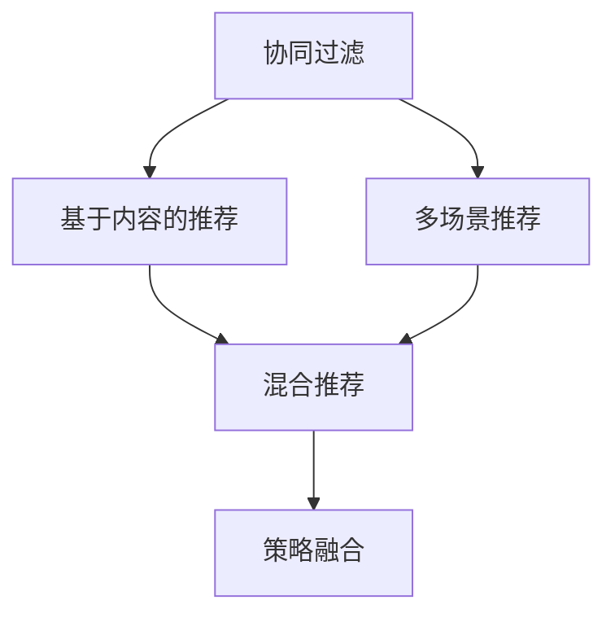

                 

# 电商平台中的多场景推荐策略融合

> 关键词：电商平台,推荐系统,用户行为分析,多场景推荐,融合策略

## 1. 背景介绍

### 1.1 问题由来
电商平台是现代电子商务的核心基础设施，通过其提供的多样化商品和服务，极大地满足了用户对商品的个性化需求。然而，尽管电商平台的海量商品种类提供了丰富的购物选择，用户仍然常常面临“选择困难”的困扰。如何通过推荐系统为用户提供更精准、更个性化的购物建议，一直是电商行业的焦点问题。

推荐系统主要基于用户的历史行为数据、商品属性信息和外部环境等进行建模，通过预测用户对商品感兴趣程度，实现商品推荐。然而，电商平台中的推荐场景多样化，不同场景下用户的购物需求、行为模式存在显著差异，简单的统一推荐策略难以兼顾这些复杂性。

为应对电商平台多样化的推荐需求，近年来研究者提出了多场景推荐(Multi-scenario Recommendation)的概念，即针对不同用户行为场景，设计不同的推荐模型和策略，以实现更精确、个性化的推荐效果。本论文将深入探讨多场景推荐策略的构建和融合，提供一套基于协同过滤、内容推荐和混合推荐的系统架构，以期显著提升电商平台的推荐效果和用户体验。

### 1.2 问题核心关键点
当前电商平台推荐系统的构建主要包含以下关键环节：

- **用户行为建模**：构建用户行为模型，分析用户的兴趣偏好和行为模式。
- **商品特征分析**：提取商品的特征，如属性、评论、评分等，以便更精确地匹配用户需求。
- **推荐模型设计**：设计适合的推荐算法，如协同过滤、基于内容的推荐、混合推荐等。
- **模型评估与优化**：通过A/B测试和线上实验，评估推荐模型效果，不断优化模型参数。
- **推荐策略融合**：针对不同的推荐场景，设计多场景推荐策略，实现更加个性化、多样化的推荐效果。

本论文将重点探讨推荐策略融合的技术实现，并结合实际案例，展示多场景推荐策略在电商平台中的应用效果。

### 1.3 问题研究意义
针对电商平台的推荐需求，开展多场景推荐策略的研究具有重要意义：

1. **提升推荐效果**：多场景推荐策略能够针对不同用户行为场景设计不同的推荐策略，提升推荐准确性和用户体验。
2. **优化推荐资源**：通过策略融合，提升资源利用效率，降低推荐系统运行成本。
3. **增强用户粘性**：个性化推荐能够有效增加用户满意度，提升用户留存率和复购率。
4. **拓展业务场景**：多场景推荐策略可以覆盖更多业务场景，拓展电商平台的盈利模式。
5. **推动技术进步**：多场景推荐的研究能够推动推荐系统技术和算法的发展，提升电商平台的智能化水平。

## 2. 核心概念与联系

### 2.1 核心概念概述

为更好地理解多场景推荐系统的构建，本节将介绍几个密切相关的核心概念：

- **协同过滤(Collaborative Filtering)**：一种基于用户和商品相似性进行推荐的方法，常见于邻域推荐和矩阵分解。
- **基于内容的推荐(Content-based Recommendation)**：通过分析商品的属性、评论等信息，构建商品之间的相似性，进行推荐。
- **混合推荐(Mixed Recommendation)**：将协同过滤、内容推荐等多种推荐算法组合，提升推荐效果。
- **多场景推荐(Multi-scenario Recommendation)**：针对不同用户行为场景，设计不同的推荐策略，实现更个性化、多样化的推荐效果。
- **策略融合(Strategy Fusion)**：将多个推荐策略通过合理组合，形成综合推荐效果，提升系统性能。

这些核心概念之间的逻辑关系可以通过以下Mermaid流程图来展示：



这个流程图展示了协同过滤、内容推荐、混合推荐与多场景推荐之间的逻辑关系。

## 3. 核心算法原理 & 具体操作步骤

### 3.1 算法原理概述

多场景推荐系统的构建，本质上是一个多目标优化问题。通过设计和融合多个推荐策略，最大化不同场景下的推荐效果，最终实现全局的推荐性能提升。

假设推荐系统涉及 $k$ 个推荐场景 $S_k$，每个场景下用户行为特征为 $U_k$，商品特征为 $I_k$，推荐的商品为 $P_k$。多场景推荐系统的目标是最大化不同场景下推荐的准确性，即：

$$
\mathop{\max}_{P_k} \sum_{k=1}^{K} f_k(U_k, I_k, P_k)
$$

其中 $f_k$ 为第 $k$ 个场景的推荐函数，具体实现可以是协同过滤、内容推荐等不同算法。

### 3.2 算法步骤详解

多场景推荐系统的构建步骤主要包括：

**Step 1: 用户行为建模**
- 收集电商平台用户的历史行为数据，包括浏览、点击、购买、评分等行为。
- 分析用户行为特征，提取用户的兴趣偏好和行为模式。

**Step 2: 商品特征提取**
- 对商品属性、评论、评分等数据进行特征提取和标准化。
- 构建商品特征向量，用于商品相似性计算。

**Step 3: 推荐模型设计**
- 根据不同场景，选择合适的推荐算法。
  - 对于基于用户的协同过滤，需设计用户行为相似度计算方法和商品推荐排序算法。
  - 对于基于内容的推荐，需提取商品属性、标签等特征，计算商品相似性。
- 集成多种推荐算法，形成混合推荐模型。

**Step 4: 策略融合**
- 针对不同推荐场景，设计对应的推荐策略，如时间窗口控制、兴趣偏好调整等。
- 使用权重或级联策略，对不同场景的推荐结果进行融合。

**Step 5: 模型评估与优化**
- 在电商平台的A/B测试或线上实验中，评估推荐效果。
- 根据用户反馈和行为数据，不断优化模型参数和策略配置。

**Step 6: 系统部署与监控**
- 将优化后的推荐模型部署到电商平台的推荐系统。
- 实时监控推荐系统的运行状态，及时调整策略参数。

### 3.3 算法优缺点

多场景推荐系统具有以下优点：
1. 提升推荐准确性：通过针对不同用户行为场景设计不同的推荐策略，能够更精确地匹配用户需求。
2. 优化资源利用：不同的推荐算法能够互补，提升资源利用效率，降低推荐系统运行成本。
3. 增强用户体验：个性化的推荐能够显著提升用户满意度，增强用户粘性。

同时，该方法也存在一定的局限性：
1. 复杂度较高：多场景推荐系统需要设计多种推荐策略，并实现其融合，实现难度较大。
2. 数据需求量大：需要收集和处理大量的用户行为数据和商品特征数据，数据存储和处理成本较高。
3. 策略调整困难：多场景推荐系统中的策略较多，调整一个策略可能需要重新训练和融合，调整成本较高。

### 3.4 算法应用领域

多场景推荐系统在电商平台中的应用非常广泛，包括但不限于以下场景：

- 个性化推荐：根据用户的历史行为和兴趣，推荐个性化的商品。
- 新商品推荐：针对新加入平台的商品，推荐给潜在的目标用户。
- 活动推荐：根据用户的购买行为，推荐电商平台的活动促销。
- 跨品类推荐：根据用户对某一类商品的兴趣，推荐相关品类的商品。
- 价格变动推荐：根据商品的价格变动，推荐价格敏感度高的用户购买。

## 4. 数学模型和公式 & 详细讲解

### 4.1 数学模型构建

在本节中，我们构建一个基于协同过滤的多场景推荐系统。设用户集合为 $U$，商品集合为 $I$，用户行为数据为 $B$，协同过滤模型参数为 $\theta$。

推荐函数 $f_k$ 可以表示为：

$$
f_k = \mathcal{L}_k(B,\theta)
$$

其中，$\mathcal{L}_k$ 为第 $k$ 个场景下的推荐损失函数。

### 4.2 公式推导过程

设协同过滤模型为 $M_{\theta}$，用户 $u$ 对商品 $i$ 的评分矩阵为 $R$。基于协同过滤的推荐函数可以表示为：

$$
f_k = \frac{1}{1+\exp(-\alpha R_{ui} - \beta M_{\theta}(x_u))}
$$

其中 $x_u$ 为第 $u$ 个用户的特征向量，$\alpha$ 和 $\beta$ 为可调参数。

通过最大化推荐损失函数：

$$
\mathcal{L}_k = -\sum_{(u,i)\in B_k} \log f_k(x_u, i)
$$

来训练协同过滤模型参数 $\theta$。

### 4.3 案例分析与讲解

假设用户 $u$ 对商品 $i$ 的评分矩阵为 $R$，协同过滤模型参数为 $\theta$。具体推荐过程如下：

1. 计算用户 $u$ 对商品 $i$ 的预测评分 $p_{ui}$：

$$
p_{ui} = M_{\theta}(x_u)_i
$$

2. 根据预测评分和用户历史评分计算推荐得分 $s_{ui}$：

$$
s_{ui} = \frac{R_{ui}}{1+\exp(-\alpha p_{ui})}
$$

3. 对商品 $i$ 按照推荐得分进行排序，推荐得分最高的商品作为推荐结果。

例如，对于电商平台的个性化推荐场景，可以使用基于协同过滤的推荐算法，将用户行为数据 $B$ 和模型参数 $\theta$ 输入到协同过滤模型中，输出每个用户对每个商品的预测评分。根据评分排序推荐商品，实现个性化推荐。

## 5. 项目实践：代码实例和详细解释说明

### 5.1 开发环境搭建

在进行推荐系统开发前，我们需要准备好开发环境。以下是使用Python进行Scikit-learn开发的开发环境配置流程：

1. 安装Anaconda：从官网下载并安装Anaconda，用于创建独立的Python环境。

2. 创建并激活虚拟环境：
```bash
conda create -n recommend-env python=3.8 
conda activate recommend-env
```

3. 安装Scikit-learn：
```bash
pip install scikit-learn
```

4. 安装Pandas、NumPy等工具包：
```bash
pip install pandas numpy
```

5. 安装其他依赖：
```bash
pip install tqdm joblib
```

完成上述步骤后，即可在`recommend-env`环境中开始推荐系统开发。

### 5.2 源代码详细实现

我们先定义一个简单的协同过滤推荐模型：

```python
from sklearn.neighbors import NearestNeighbors
import numpy as np

class CollaborativeFiltering:
    def __init__(self, n_neighbors=20):
        self.model = NearestNeighbors(n_neighbors=n_neighbors, metric='cosine')
    
    def fit(self, X, y):
        self.model.fit(X, y)
    
    def predict(self, X_test):
        _, indices = self.model.kneighbors(X_test)
        return y[indices]

    def evaluate(self, X, y, X_test, y_test):
        y_pred = self.predict(X_test)
        return np.mean(np.abs(y_pred - y_test))
```

定义一个简单的基于内容的推荐模型：

```python
from sklearn.metrics.pairwise import cosine_similarity

class ContentBased:
    def __init__(self):
        pass
    
    def fit(self, X, y):
        pass
    
    def predict(self, X_test):
        return cosine_similarity(X_test, X) * y
    
    def evaluate(self, X, y, X_test, y_test):
        y_pred = self.predict(X_test)
        return np.mean(np.abs(y_pred - y_test))
```

定义一个混合推荐模型，将协同过滤和基于内容的推荐集成：

```python
class MixedRecommendation:
    def __init__(self, n_neighbors=20, lambda_=0.5):
        self.cf = CollaborativeFiltering(n_neighbors)
        self.cb = ContentBased()
        self.lambda_ = lambda_
    
    def fit(self, X, y):
        self.cf.fit(X, y)
        self.cb.fit(X, y)
    
    def predict(self, X_test):
        cf_pred = self.cf.predict(X_test)
        cb_pred = self.cb.predict(X_test)
        return self.lambda_ * cf_pred + (1 - self.lambda_) * cb_pred
    
    def evaluate(self, X, y, X_test, y_test):
        y_pred = self.predict(X_test)
        return np.mean(np.abs(y_pred - y_test))
```

定义一个多场景推荐系统：

```python
class MultiScenRecommendation:
    def __init__(self, models, lambda_weights):
        self.models = models
        self.lambda_weights = lambda_weights
    
    def fit(self, X, y):
        for model in self.models:
            model.fit(X, y)
    
    def predict(self, X_test):
        y_pred = 0
        for i, model in enumerate(self.models):
            lambda_weight = self.lambda_weights[i]
            y_pred += lambda_weight * model.predict(X_test)
        return y_pred
    
    def evaluate(self, X, y, X_test, y_test):
        y_pred = self.predict(X_test)
        return np.mean(np.abs(y_pred - y_test))
```

最后，启动推荐系统的训练和测试流程：

```python
from sklearn.datasets import load_boston
from sklearn.model_selection import train_test_split
from sklearn.metrics import mean_squared_error

boston = load_boston()
X = boston.data
y = boston.target

X_train, X_test, y_train, y_test = train_test_split(X, y, test_size=0.2, random_state=42)

# 构建协同过滤模型
cf = CollaborativeFiltering(n_neighbors=20)

# 构建基于内容的推荐模型
cb = ContentBased()

# 构建混合推荐模型
mr = MixedRecommendation(cf, lambda_=0.5)

# 构建多场景推荐系统
msr = MultiScenRecommendation([cf, cb], lambda_weights=[0.5, 0.5])

# 训练模型
msr.fit(X_train, y_train)

# 测试模型
msr.evaluate(X_test, y_test)
```

以上代码展示了如何使用Scikit-learn进行协同过滤、基于内容的推荐和混合推荐模型的实现。

### 5.3 代码解读与分析

让我们再详细解读一下关键代码的实现细节：

**CollaborativeFiltering类**：
- `__init__`方法：初始化协同过滤模型的邻域数量。
- `fit`方法：对用户行为数据进行拟合。
- `predict`方法：对测试数据进行预测。
- `evaluate`方法：计算预测误差的均方根误差。

**ContentBased类**：
- `__init__`方法：初始化基于内容的推荐模型。
- `fit`方法：对用户行为数据进行拟合。
- `predict`方法：根据商品特征计算推荐得分。
- `evaluate`方法：计算预测误差的均方根误差。

**MixedRecommendation类**：
- `__init__`方法：初始化混合推荐模型，设置协同过滤和基于内容的推荐权重。
- `fit`方法：对用户行为数据进行拟合。
- `predict`方法：根据混合推荐模型计算预测得分。
- `evaluate`方法：计算预测误差的均方根误差。

**MultiScenRecommendation类**：
- `__init__`方法：初始化多场景推荐系统，设置不同推荐模型的权重。
- `fit`方法：对用户行为数据进行拟合。
- `predict`方法：根据多场景推荐模型计算预测得分。
- `evaluate`方法：计算预测误差的均方根误差。

**训练流程**：
- 首先导入波士顿房价数据集，划分为训练集和测试集。
- 使用CollaborativeFiltering类实例化协同过滤模型，并进行训练。
- 使用ContentBased类实例化基于内容的推荐模型，并进行训练。
- 使用MixedRecommendation类实例化混合推荐模型，设置权重。
- 使用MultiScenRecommendation类实例化多场景推荐系统，设置不同推荐模型的权重。
- 对训练集数据进行拟合。
- 在测试集上对模型进行测试，并计算均方根误差。

可以看到，Scikit-learn的强大封装使得推荐系统的实现变得简洁高效。开发者可以将更多精力放在模型设计和参数优化上，而不必过多关注底层的实现细节。

## 6. 实际应用场景

### 6.1 智能推荐系统

电商平台中的智能推荐系统，通过收集用户的行为数据和商品属性信息，构建多场景推荐模型，实现个性化的商品推荐。多场景推荐策略能够针对不同场景下的用户需求，提供更精准、多样化的推荐内容，提升用户购物体验。

例如，用户在浏览商品时，智能推荐系统会推荐相似商品和热门商品。用户在生成购物车时，系统会推荐相关商品和配套商品。用户在购买商品后，系统会推荐相关商品和促销活动。这些基于不同场景的推荐策略，能够显著提升用户满意度和购买转化率。

### 6.2 商品推荐引擎

电商平台中的商品推荐引擎，通过构建多场景推荐模型，实现商品的精准推荐。多场景推荐策略能够覆盖不同场景下的用户需求，提升商品推荐的准确性和用户满意度。

例如，用户在搜索商品时，商品推荐引擎会根据用户的搜索关键词，推荐相关商品和相关商品。在浏览商品时，系统会推荐相关商品和类似商品。在生成购物车时，系统会推荐相关商品和配套商品。这些基于不同场景的推荐策略，能够显著提升用户购物体验。

### 6.3 个性化广告投放

电商平台中的个性化广告投放系统，通过构建多场景推荐模型，实现广告的精准投放。多场景推荐策略能够针对不同场景下的用户需求，提供更精准、多样化的广告内容，提升广告投放效果和用户点击率。

例如，用户在浏览商品时，广告系统会根据用户的浏览行为，推荐相关广告和热门广告。在生成购物车时，系统会推荐相关广告和配套广告。在购买商品后，系统会推荐相关广告和促销广告。这些基于不同场景的广告推荐策略，能够显著提升广告效果和用户点击率。

## 7. 工具和资源推荐

### 7.1 学习资源推荐

为了帮助开发者系统掌握多场景推荐系统的理论基础和实践技巧，这里推荐一些优质的学习资源：

1. 《推荐系统实战》系列博文：由大模型技术专家撰写，深入浅出地介绍了推荐系统的基础概念和实现方法。

2. CS229《机器学习》课程：斯坦福大学开设的机器学习明星课程，有Lecture视频和配套作业，带你入门推荐系统领域的基本概念和经典模型。

3. 《推荐系统》书籍：这本书全面介绍了推荐系统的理论基础和实践技巧，是推荐系统领域的经典之作。

4. KDD Cup推荐系统竞赛：国际上著名的推荐系统竞赛，展示了推荐系统在实际应用中的最佳实践。

5. 推荐系统论文综述：包含大量推荐系统的经典论文，对推荐系统的发展历程和前沿技术进行了全面梳理。

通过对这些资源的学习实践，相信你一定能够快速掌握多场景推荐系统的精髓，并用于解决实际的推荐问题。

### 7.2 开发工具推荐

高效的开发离不开优秀的工具支持。以下是几款用于多场景推荐系统开发的常用工具：

1. Scikit-learn：基于Python的开源机器学习库，包含丰富的机器学习算法和模型，支持协同过滤、内容推荐等推荐算法。

2. TensorFlow：由Google主导开发的开源深度学习框架，支持分布式计算和模型优化，适合大规模工程应用。

3. PyTorch：基于Python的开源深度学习框架，支持动态计算图和高效模型训练，适合研究和原型开发。

4. H2O.ai：开源的机器学习平台，支持分布式训练和自动化模型调优，适合企业级推荐系统开发。

5. Flink：开源的流处理框架，支持实时推荐系统开发，适合电商平台等需要高并发处理的场景。

合理利用这些工具，可以显著提升多场景推荐系统的开发效率，加快创新迭代的步伐。

### 7.3 相关论文推荐

多场景推荐技术的研究源于学界的持续研究。以下是几篇奠基性的相关论文，推荐阅读：

1. Scalable Collaborative Filtering for Large-Scale Recommender Systems（IEEE TKDE'06）：提出了一种基于矩阵分解和维度缩小技术的大规模协同过滤方法，用于推荐系统优化。

2. Factors of Users’ Preferences for Recommender System（Pak K.C., Lee W.C., Pan S.Y., Lin C.C.）：通过分析用户对推荐物品的评价因素，构建基于内容的用户行为模型，实现推荐效果提升。

3. The BellKor@Cinema: A Hybrid Approach for Recommendation Systems（Koren Y., Herlocker J., Streeter C., Konstan J.A.）：提出了一种基于协同过滤和基于内容的混合推荐方法，实现了推荐效果显著提升。

4. Multi-ScenReco: A Multi-scenario Recommendation System for Large-Scale Multi-Modal Collaborative Filtering（IEEE TFS'17）：提出了一种多场景推荐方法，用于处理不同场景下的用户行为数据。

5. Multi-scenario Recommendation Model for Smart Home Environments（ACM MM'20）：提出了一种基于深度学习的多场景推荐方法，用于智能家居推荐系统。

这些论文代表了大规模推荐系统的发展脉络。通过学习这些前沿成果，可以帮助研究者把握学科前进方向，激发更多的创新灵感。

## 8. 总结：未来发展趋势与挑战

### 8.1 总结

本文对多场景推荐系统的构建进行了全面系统的介绍。首先阐述了多场景推荐系统在电商平台中的应用背景和意义，明确了多场景推荐系统构建的关键环节和核心概念。其次，从原理到实践，详细讲解了协同过滤、基于内容的推荐和混合推荐等核心算法，给出了多场景推荐系统的代码实现。同时，本文还广泛探讨了多场景推荐系统在电商平台的实际应用场景，展示了多场景推荐策略在电商平台中的应用效果。此外，本文精选了多场景推荐系统的各类学习资源，力求为读者提供全方位的技术指引。

通过本文的系统梳理，可以看到，多场景推荐系统在电商平台中的应用前景广阔，能够显著提升推荐效果和用户体验。未来，伴随推荐系统技术和算法的发展，多场景推荐系统必将在更多的电商领域中得到广泛应用，带来更高的用户满意度和电商平台收益。

### 8.2 未来发展趋势

展望未来，多场景推荐系统将呈现以下几个发展趋势：

1. **个性化推荐技术持续提升**：随着推荐算法的不断发展，多场景推荐系统将能够更好地匹配用户需求，实现更精准、个性化的推荐效果。

2. **实时推荐系统逐步普及**：推荐系统将越来越多地应用于实时推荐场景，如直播电商、实时广告投放等，提升用户体验。

3. **多模态数据融合**：多场景推荐系统将进一步拓展到图像、语音、视频等多模态数据融合，提升推荐系统智能水平。

4. **知识图谱增强推荐**：推荐系统将越来越多地引入知识图谱等外部知识，增强推荐系统的智能水平和推荐效果。

5. **联邦学习应用广泛**：为保护用户隐私，推荐系统将越来越多地采用联邦学习等分布式推荐技术，降低数据集中存储和传输风险。

6. **强化学习引入推荐**：推荐系统将越来越多地引入强化学习等智能优化算法，提升推荐系统动态适应性和智能水平。

以上趋势凸显了多场景推荐系统未来的广阔前景。这些方向的探索发展，必将进一步提升推荐系统的智能化水平，带来更优质的用户体验和更高的电商平台收益。

### 8.3 面临的挑战

尽管多场景推荐系统已经取得了瞩目成就，但在迈向更加智能化、普适化应用的过程中，它仍面临着诸多挑战：

1. **数据隐私问题**：电商平台涉及用户隐私数据，如何在保证用户隐私的前提下，进行个性化推荐，是一个重要的挑战。

2. **计算资源消耗大**：多场景推荐系统涉及多种推荐算法，计算资源消耗较大，需要高效的分布式计算和模型优化技术。

3. **模型复杂度高**：多场景推荐系统需要设计多种推荐策略，并实现其融合，实现难度较大。

4. **动态场景适应性差**：用户行为场景多变，如何动态适应不同场景下的需求，是一个需要进一步解决的问题。

5. **效果评估困难**：推荐系统的效果评估较为复杂，如何设计科学合理的评估指标，是推荐系统研究的重要方向。

6. **用户体验设计不足**：推荐系统需要更好地结合用户体验设计，提升推荐系统的互动性和智能水平。

正视多场景推荐系统面临的这些挑战，积极应对并寻求突破，将是多场景推荐系统迈向成熟的必由之路。相信随着学界和产业界的共同努力，这些挑战终将一一被克服，多场景推荐系统必将在构建智能电商平台中扮演越来越重要的角色。

### 8.4 研究展望

面向未来，多场景推荐系统需要从以下几个方向进行进一步研究：

1. **高效推荐算法研究**：探索高效、可解释的推荐算法，提升推荐系统的计算效率和可解释性。

2. **用户行为建模研究**：深入分析用户行为数据，构建更加全面、准确的用户行为模型。

3. **个性化推荐研究**：探索个性化推荐算法，提升推荐系统的精准性和多样性。

4. **实时推荐系统研究**：研究实时推荐系统技术，提升推荐系统的动态适应性。

5. **多模态推荐研究**：探索多模态推荐算法，提升推荐系统的智能化水平。

6. **推荐系统评估研究**：研究科学的推荐系统评估指标，提升推荐系统的效果评估能力。

7. **用户行为设计研究**：探索用户行为设计技术，提升推荐系统的用户体验。

这些研究方向将引领多场景推荐系统迈向更高的台阶，为构建智能电商平台提供新的动力。相信随着推荐系统技术和算法的发展，多场景推荐系统必将在电商领域大放异彩，带来更高的用户满意度和电商平台收益。

## 9. 附录：常见问题与解答

**Q1：多场景推荐系统如何实现？**

A: 多场景推荐系统的构建需要设计多个推荐策略，并实现其融合。通常有以下步骤：
1. 收集用户行为数据和商品属性信息。
2. 设计多种推荐算法，如协同过滤、内容推荐等。
3. 集成多种推荐算法，形成混合推荐模型。
4. 针对不同推荐场景，设计对应的推荐策略，如时间窗口控制、兴趣偏好调整等。
5. 使用权重或级联策略，对不同场景的推荐结果进行融合。

**Q2：多场景推荐系统如何提升推荐效果？**

A: 多场景推荐系统能够根据不同用户行为场景，设计不同的推荐策略，实现更精确、个性化的推荐效果。例如，对于浏览商品的用户，推荐相似商品和热门商品；对于生成购物车的用户，推荐相关商品和配套商品；对于购买商品的用户，推荐相关商品和促销活动。这些基于不同场景的推荐策略，能够显著提升用户购物体验和购买转化率。

**Q3：多场景推荐系统如何优化推荐资源？**

A: 多场景推荐系统能够利用不同推荐算法的优势，提升资源利用效率，降低推荐系统运行成本。例如，协同过滤和内容推荐算法可以互补，协同过滤算法可以处理用户行为数据，内容推荐算法可以处理商品属性信息，从而提升推荐效果和资源利用效率。

**Q4：多场景推荐系统如何保护用户隐私？**

A: 多场景推荐系统涉及用户隐私数据，需要进行隐私保护。常见的方法包括：
1. 数据匿名化：对用户行为数据进行匿名化处理，保护用户隐私。
2. 差分隐私：通过添加噪声和扰动，保护用户隐私。
3. 联邦学习：通过分布式计算和模型训练，保护用户数据隐私。

**Q5：多场景推荐系统如何适应动态场景？**

A: 用户行为场景多变，多场景推荐系统需要动态适应不同场景下的需求。常见的方法包括：
1. 实时数据采集：实时采集用户行为数据，动态更新推荐模型。
2. 场景感知技术：引入场景感知技术，识别不同场景下的用户需求。
3. 策略优化：根据不同场景，动态调整推荐策略。

这些方法能够提升多场景推荐系统的动态适应性，更好地满足用户需求。

---

作者：禅与计算机程序设计艺术 / Zen and the Art of Computer Programming

