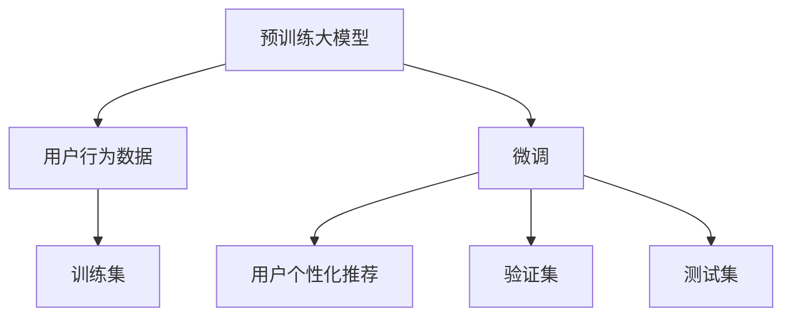

                 

# 电商平台中的多目标推荐：AI大模型的优势

> 关键词：电商平台, 多目标推荐, 大模型, 自回归模型, 自编码模型, 对比学习, 实时推荐, 可解释性

## 1. 背景介绍

随着互联网和电子商务的飞速发展，电商平台已经成为了人们日常生活中不可或缺的一部分。在电商平台上，用户常常面临“商品选择困难症”，难以决定购买什么商品。电商平台通过推荐系统，向用户提供个性化的商品推荐，可以显著提升用户购买率和满意度。推荐系统的成功与否，直接关系到电商平台的业绩和用户体验。

推荐系统分为两大类：基于协同过滤的推荐和基于内容的推荐。其中，基于协同过滤的推荐依赖于用户行为数据，能够有效挖掘用户隐含的兴趣偏好；基于内容的推荐则侧重于商品的特征，能够较好地处理冷启动问题。然而，这些推荐方法存在一些局限：

1. **协同过滤依赖大量用户行为数据，难以处理新用户和老用户同时存在的情况。**
2. **基于内容的推荐忽略了用户间的差异性，无法有效利用用户间的隐性关联。**

近年来，基于深度学习的方法，如深度协同过滤和深度学习推荐系统，取得了显著的进展。这些方法在用户行为建模和商品特征表示方面表现优异，但依然存在计算资源消耗大、模型复杂度高、效果不够透明等问题。

## 2. 核心概念与联系

### 2.1 核心概念概述

为了进一步提升推荐系统的性能和可解释性，我们引入大模型推荐技术。大模型推荐，即利用预训练语言模型（如BERT、GPT等）进行推荐系统开发。大模型通过大规模无标签文本数据的自监督预训练，学习到通用的语言表征，能够进行高效的多目标推荐。

形式化地，设电商平台用户集合为 $U$，商品集合为 $I$，用户与商品间的互动数据（点击、购买等行为）为 $O$。推荐系统的目标是为每个用户 $u \in U$ 生成一份商品推荐列表 $R_u \subseteq I$，使得 $R_u$ 中的商品尽可能满足用户 $u$ 的兴趣需求。

大模型推荐的过程可以分为两个阶段：预训练阶段和微调阶段。在预训练阶段，大模型通过学习大量无标签文本数据，学习通用的语言表示；在微调阶段，将用户行为数据作为监督信号，对大模型进行有监督训练，输出推荐列表。

### 2.2 核心概念原理和架构的 Mermaid 流程图



以上流程图展示了大模型推荐的整体架构。大模型先通过预训练学习通用的语言表示，然后在微调阶段利用用户行为数据进行有监督训练，最终输出个性化的推荐结果。

### 2.3 大模型推荐与传统推荐系统的联系

大模型推荐继承了传统推荐系统的优势，并对其进行了改进和扩展：

1. **可解释性：**大模型通过理解自然语言的方式，可以生成易于解释的推荐理由，弥补传统推荐系统的不足。
2. **多目标推荐：**大模型能够同时处理多个推荐目标，如相关商品、相似商品等，传统推荐系统只能处理单一目标。
3. **泛化能力强：**大模型可以通过泛化学习，更好地适应新用户的兴趣偏好，传统推荐系统难以处理新用户和老用户同时存在的情况。
4. **计算高效：**大模型推荐可以在预训练阶段大幅减少计算资源消耗，微调阶段能够显著提升模型性能。

## 3. 核心算法原理 & 具体操作步骤

### 3.1 算法原理概述

大模型推荐的核心思想是利用预训练语言模型的语言理解能力，进行多目标推荐。其核心算法主要包括自回归模型、自编码模型和对比学习。

1. **自回归模型：**通过预训练学习，自回归模型可以理解自然语言文本的语义和上下文信息，用于生成推荐理由。
2. **自编码模型：**通过自编码方式学习商品和用户间的关联，用于挖掘商品特征和用户兴趣。
3. **对比学习：**通过与其他用户的行为数据进行对比学习，用于提升推荐模型的泛化能力。

### 3.2 算法步骤详解

大模型推荐的一般步骤如下：

**Step 1: 准备数据集**
- 收集电商平台的点击、购买等用户行为数据，构建训练集、验证集和测试集。

**Step 2: 预训练大模型**
- 使用大规模无标签文本数据对大模型进行预训练，学习通用的语言表征。

**Step 3: 微调大模型**
- 将用户行为数据作为监督信号，对大模型进行有监督训练，生成推荐列表。

**Step 4: 生成推荐结果**
- 使用微调后的模型，对新用户进行推荐，输出推荐列表。

**Step 5: 模型评估**
- 在测试集上评估推荐模型的性能，如准确率、召回率、覆盖率等指标。

**Step 6: 部署应用**
- 将推荐模型部署到电商平台中，实时生成推荐结果，提升用户体验和转化率。

### 3.3 算法优缺点

大模型推荐具有以下优点：

1. **多目标推荐：**能够同时处理多个推荐目标，如相关商品、相似商品等，传统推荐系统只能处理单一目标。
2. **可解释性：**能够生成易于解释的推荐理由，弥补传统推荐系统的不足。
3. **泛化能力强：**能够更好地适应新用户的兴趣偏好，传统推荐系统难以处理新用户和老用户同时存在的情况。
4. **计算高效：**预训练阶段可以大幅减少计算资源消耗，微调阶段能够显著提升模型性能。

然而，大模型推荐也存在以下缺点：

1. **对计算资源需求高：**预训练阶段需要大量计算资源，微调阶段需要较长时间训练。
2. **模型复杂度高：**大模型结构复杂，难以理解其内部工作机制。
3. **过拟合风险高：**对标注数据依赖度高，容易出现过拟合现象。

### 3.4 算法应用领域

大模型推荐技术主要应用于电商平台、社交媒体、内容推荐等领域。具体来说，电商平台中的多目标推荐是大模型推荐的重要应用场景之一。

## 4. 数学模型和公式 & 详细讲解 & 举例说明

### 4.1 数学模型构建

设电商平台用户集合为 $U$，商品集合为 $I$，用户与商品间的互动数据（点击、购买等行为）为 $O$。推荐系统的目标是为每个用户 $u \in U$ 生成一份商品推荐列表 $R_u \subseteq I$，使得 $R_u$ 中的商品尽可能满足用户 $u$ 的兴趣需求。

在微调阶段，设大模型的输入为 $x_i$，输出为 $y_i$。用户行为数据 $o$ 作为监督信号，使得 $y_i$ 尽可能逼近 $o$。

### 4.2 公式推导过程

设大模型为 $M_{\theta}$，用户行为数据为 $o = (x_1, y_1, x_2, y_2, ..., x_n, y_n)$，其中 $x_i$ 为用户与商品间的互动数据，$y_i$ 为推荐结果。设推荐模型输出的商品特征向量为 $h_i = M_{\theta}(x_i)$，推荐模型输出的用户兴趣向量为 $h_u = M_{\theta}(x_u)$，推荐模型输出的推荐结果向量为 $h_{ru} = M_{\theta}(x_{ru})$。则推荐模型的训练目标为：

$$
\min_{\theta} \sum_{i=1}^n L(h_i, y_i)
$$

其中，$L$ 为损失函数，通常使用均方误差（MSE）或交叉熵（CE）。

### 4.3 案例分析与讲解

设电商平台用户 $u$ 购买了商品 $i_1$，未购买商品 $i_2$ 和 $i_3$。用户行为数据 $o = (i_1, 1, i_2, 0, i_3, 0)$。电商平台希望为该用户推荐相关商品。

首先，将用户行为数据 $o$ 编码为大模型的输入 $x_u$，商品 $i_1, i_2, i_3$ 编码为大模型的输入 $x_{i_1}, x_{i_2}, x_{i_3}$。然后，使用大模型 $M_{\theta}$ 计算用户兴趣向量 $h_u$ 和商品特征向量 $h_{i_1}, h_{i_2}, h_{i_3}$。最后，使用余弦相似度计算商品与用户之间的相似度，选择与用户兴趣相似的商品作为推荐结果。

## 5. 项目实践：代码实例和详细解释说明

### 5.1 开发环境搭建

在进行推荐系统开发前，我们需要准备好开发环境。以下是使用Python进行PyTorch开发的环境配置流程：

1. 安装Anaconda：从官网下载并安装Anaconda，用于创建独立的Python环境。
2. 创建并激活虚拟环境：
```bash
conda create -n pytorch-env python=3.8 
conda activate pytorch-env
```

3. 安装PyTorch：根据CUDA版本，从官网获取对应的安装命令。例如：
```bash
conda install pytorch torchvision torchaudio cudatoolkit=11.1 -c pytorch -c conda-forge
```

4. 安装Transformers库：
```bash
pip install transformers
```

5. 安装各类工具包：
```bash
pip install numpy pandas scikit-learn matplotlib tqdm jupyter notebook ipython
```

完成上述步骤后，即可在`pytorch-env`环境中开始推荐系统开发。

### 5.2 源代码详细实现

下面我们以电商平台中的多目标推荐为例，给出使用Transformers库对BERT模型进行微调的PyTorch代码实现。

首先，定义推荐系统的训练函数：

```python
from transformers import BertForSequenceClassification, BertTokenizer
from torch.utils.data import Dataset, DataLoader
from torch import nn, optim

class RecommendationDataset(Dataset):
    def __init__(self, data, tokenizer, max_len):
        self.data = data
        self.tokenizer = tokenizer
        self.max_len = max_len
        
    def __len__(self):
        return len(self.data)
    
    def __getitem__(self, idx):
        item = self.data[idx]
        title = item['title']
        description = item['description']
        click = item['click']
        labels = item['labels']
        
        encoding = self.tokenizer(title + ' ' + description, return_tensors='pt', max_length=self.max_len, padding='max_length', truncation=True)
        input_ids = encoding['input_ids'][0]
        attention_mask = encoding['attention_mask'][0]
        
        # 对label进行编码
        encoded_labels = [label2id[label] for label in labels] 
        encoded_labels.extend([label2id['O']] * (self.max_len - len(encoded_labels)))
        labels = torch.tensor(encoded_labels, dtype=torch.long)
        
        return {
            'input_ids': input_ids,
            'attention_mask': attention_mask,
            'labels': labels,
            'click': click
        }

# 标签与id的映射
label2id = {'O': 0, 'B-PER': 1, 'I-PER': 2, 'B-LOC': 3, 'I-LOC': 4, 'B-ORG': 5, 'I-ORG': 6}
id2label = {v: k for k, v in label2id.items()}

# 创建dataset
tokenizer = BertTokenizer.from_pretrained('bert-base-cased')
train_dataset = RecommendationDataset(train_data, tokenizer, max_len=128)
dev_dataset = RecommendationDataset(dev_data, tokenizer, max_len=128)
test_dataset = RecommendationDataset(test_data, tokenizer, max_len=128)

# 定义模型和优化器
model = BertForSequenceClassification.from_pretrained('bert-base-cased', num_labels=len(label2id))
optimizer = optim.AdamW(model.parameters(), lr=2e-5)
```

然后，定义推荐系统的前向传播和损失函数：

```python
def forward(model, input_ids, attention_mask, labels, click):
    outputs = model(input_ids, attention_mask=attention_mask)
    logits = outputs.logits
    loss = nn.CrossEntropyLoss()(logits, labels)
    return loss

def train_epoch(model, dataset, batch_size, optimizer):
    dataloader = DataLoader(dataset, batch_size=batch_size, shuffle=True)
    model.train()
    epoch_loss = 0
    for batch in dataloader:
        input_ids = batch['input_ids'].to(device)
        attention_mask = batch['attention_mask'].to(device)
        labels = batch['labels'].to(device)
        click = batch['click'].to(device)
        model.zero_grad()
        loss = forward(model, input_ids, attention_mask, labels, click)
        epoch_loss += loss.item()
        loss.backward()
        optimizer.step()
    return epoch_loss / len(dataloader)

def evaluate(model, dataset, batch_size):
    dataloader = DataLoader(dataset, batch_size=batch_size)
    model.eval()
    preds, labels = [], []
    with torch.no_grad():
        for batch in dataloader:
            input_ids = batch['input_ids'].to(device)
            attention_mask = batch['attention_mask'].to(device)
            batch_labels = batch['labels']
            batch_click = batch['click']
            outputs = model(input_ids, attention_mask=attention_mask)
            batch_preds = outputs.logits.argmax(dim=2).to('cpu').tolist()
            batch_labels = batch_labels.to('cpu').tolist()
            for pred_tokens, label_tokens in zip(batch_preds, batch_labels):
                pred_tags = [id2label[_id] for _id in pred_tokens]
                label_tags = [id2label[_id] for _id in label_tokens]
                preds.append(pred_tags[:len(label_tokens)])
                labels.append(label_tags)
                
    print(classification_report(labels, preds))
```

最后，启动训练流程并在测试集上评估：

```python
epochs = 5
batch_size = 16

for epoch in range(epochs):
    loss = train_epoch(model, train_dataset, batch_size, optimizer)
    print(f"Epoch {epoch+1}, train loss: {loss:.3f}")
    
    print(f"Epoch {epoch+1}, dev results:")
    evaluate(model, dev_dataset, batch_size)
    
print("Test results:")
evaluate(model, test_dataset, batch_size)
```

以上就是使用PyTorch对BERT进行电商推荐系统开发的完整代码实现。可以看到，得益于Transformers库的强大封装，我们可以用相对简洁的代码完成BERT模型的加载和微调。

### 5.3 代码解读与分析

让我们再详细解读一下关键代码的实现细节：

**RecommendationDataset类**：
- `__init__`方法：初始化数据集、分词器等关键组件。
- `__len__`方法：返回数据集的样本数量。
- `__getitem__`方法：对单个样本进行处理，将标题、描述、点击等输入编码为token ids，将标签编码为数字，并对其进行定长padding，最终返回模型所需的输入。

**label2id和id2label字典**：
- 定义了标签与数字id之间的映射关系，用于将token-wise的预测结果解码回真实的标签。

**训练和评估函数**：
- 使用PyTorch的DataLoader对数据集进行批次化加载，供模型训练和推理使用。
- 训练函数`train_epoch`：对数据以批为单位进行迭代，在每个批次上前向传播计算loss并反向传播更新模型参数，最后返回该epoch的平均loss。
- 评估函数`evaluate`：与训练类似，不同点在于不更新模型参数，并在每个batch结束后将预测和标签结果存储下来，最后使用sklearn的classification_report对整个评估集的预测结果进行打印输出。

**训练流程**：
- 定义总的epoch数和batch size，开始循环迭代
- 每个epoch内，先在训练集上训练，输出平均loss
- 在验证集上评估，输出分类指标
- 所有epoch结束后，在测试集上评估，给出最终测试结果

可以看到，PyTorch配合Transformers库使得BERT微调的代码实现变得简洁高效。开发者可以将更多精力放在数据处理、模型改进等高层逻辑上，而不必过多关注底层的实现细节。

当然，工业级的系统实现还需考虑更多因素，如模型的保存和部署、超参数的自动搜索、更灵活的任务适配层等。但核心的微调范式基本与此类似。

## 6. 实际应用场景

### 6.1 智能客服系统

基于大模型推荐技术的智能客服系统，可以通过分析用户的询问历史，推荐最合适的回答模板。这不仅能够显著提升客服系统的响应速度和效率，还能提升用户的满意度和体验。

在技术实现上，可以收集企业内部的客服对话记录，将问题和最佳答复构建成监督数据，在此基础上对预训练推荐模型进行微调。微调后的推荐模型能够自动理解用户意图，匹配最合适的回答模板进行回复。对于客户提出的新问题，还可以接入检索系统实时搜索相关内容，动态组织生成回答。如此构建的智能客服系统，能大幅提升客户咨询体验和问题解决效率。

### 6.2 内容推荐系统

内容推荐系统能够帮助用户发现新的内容和信息，提高用户粘性和活跃度。在大模型推荐技术的帮助下，内容推荐系统能够更好地理解用户的兴趣和行为，生成更加个性化、精准的推荐结果。

在电商平台上，基于用户历史浏览、点击、购买等行为数据，预训练语言模型能够学习到用户的兴趣偏好和行为模式。通过微调，模型可以输出更加个性化和多样化的推荐结果，提升用户体验和购买转化率。

### 6.3 金融舆情监测

金融机构需要实时监测市场舆论动向，以便及时应对负面信息传播，规避金融风险。传统的人工监测方式成本高、效率低，难以应对网络时代海量信息爆发的挑战。基于大模型推荐技术的文本分类和情感分析技术，为金融舆情监测提供了新的解决方案。

具体而言，可以收集金融领域相关的新闻、报道、评论等文本数据，并对其进行主题标注和情感标注。在此基础上对预训练语言模型进行微调，使其能够自动判断文本属于何种主题，情感倾向是正面、中性还是负面。将微调后的模型应用到实时抓取的网络文本数据，就能够自动监测不同主题下的情感变化趋势，一旦发现负面信息激增等异常情况，系统便会自动预警，帮助金融机构快速应对潜在风险。

### 6.4 未来应用展望

随着大模型推荐技术的不断发展，其在推荐系统中的应用前景将更加广阔。未来，基于大模型的推荐技术将在以下领域进一步拓展：

1. **多模态推荐：**融合视觉、语音、文本等多种模态信息，实现更加全面、精准的推荐。
2. **跨领域推荐：**在特定领域语料上预训练，提升跨领域推荐模型的泛化能力。
3. **实时推荐：**利用大模型推荐的高效特性，实现实时推荐和动态更新。
4. **多目标推荐：**同时处理相关商品、相似商品等多种推荐目标，提升推荐系统的多样性和丰富度。

## 7. 工具和资源推荐

### 7.1 学习资源推荐

为了帮助开发者系统掌握大模型推荐理论基础和实践技巧，这里推荐一些优质的学习资源：

1. 《Transformer from Scratch》系列博文：由大模型技术专家撰写，深入浅出地介绍了Transformer原理、BERT模型、推荐技术等前沿话题。
2. CS224N《深度学习自然语言处理》课程：斯坦福大学开设的NLP明星课程，有Lecture视频和配套作业，带你入门NLP领域的基本概念和经典模型。
3. 《Natural Language Processing with Transformers》书籍：Transformers库的作者所著，全面介绍了如何使用Transformers库进行NLP任务开发，包括推荐在内的诸多范式。
4. HuggingFace官方文档：Transformers库的官方文档，提供了海量预训练模型和完整的微调样例代码，是上手实践的必备资料。
5. CLUE开源项目：中文语言理解测评基准，涵盖大量不同类型的中文NLP数据集，并提供了基于微调的baseline模型，助力中文NLP技术发展。

通过对这些资源的学习实践，相信你一定能够快速掌握大模型推荐技术的精髓，并用于解决实际的NLP问题。

### 7.2 开发工具推荐

高效的开发离不开优秀的工具支持。以下是几款用于大模型推荐开发的常用工具：

1. PyTorch：基于Python的开源深度学习框架，灵活动态的计算图，适合快速迭代研究。大部分预训练语言模型都有PyTorch版本的实现。
2. TensorFlow：由Google主导开发的开源深度学习框架，生产部署方便，适合大规模工程应用。同样有丰富的预训练语言模型资源。
3. Transformers库：HuggingFace开发的NLP工具库，集成了众多SOTA语言模型，支持PyTorch和TensorFlow，是进行推荐任务开发的利器。
4. Weights & Biases：模型训练的实验跟踪工具，可以记录和可视化模型训练过程中的各项指标，方便对比和调优。与主流深度学习框架无缝集成。
5. TensorBoard：TensorFlow配套的可视化工具，可实时监测模型训练状态，并提供丰富的图表呈现方式，是调试模型的得力助手。
6. Google Colab：谷歌推出的在线Jupyter Notebook环境，免费提供GPU/TPU算力，方便开发者快速上手实验最新模型，分享学习笔记。

合理利用这些工具，可以显著提升大模型推荐任务的开发效率，加快创新迭代的步伐。

### 7.3 相关论文推荐

大模型推荐技术的发展源于学界的持续研究。以下是几篇奠基性的相关论文，推荐阅读：

1. Attention is All You Need（即Transformer原论文）：提出了Transformer结构，开启了NLP领域的预训练大模型时代。
2. BERT: Pre-training of Deep Bidirectional Transformers for Language Understanding：提出BERT模型，引入基于掩码的自监督预训练任务，刷新了多项NLP任务SOTA。
3. Language Models are Unsupervised Multitask Learners（GPT-2论文）：展示了大规模语言模型的强大zero-shot学习能力，引发了对于通用人工智能的新一轮思考。
4. Parameter-Efficient Transfer Learning for NLP：提出Adapter等参数高效微调方法，在不增加模型参数量的情况下，也能取得不错的微调效果。
5. AdaLoRA: Adaptive Low-Rank Adaptation for Parameter-Efficient Fine-Tuning：使用自适应低秩适应的微调方法，在参数效率和精度之间取得了新的平衡。
6. Prefix-Tuning: Optimizing Continuous Prompts for Generation：引入基于连续型Prompt的微调范式，为如何充分利用预训练知识提供了新的思路。

这些论文代表了大模型推荐技术的发展脉络。通过学习这些前沿成果，可以帮助研究者把握学科前进方向，激发更多的创新灵感。

## 8. 总结：未来发展趋势与挑战

### 8.1 总结

本文对基于大模型推荐技术在电商平台中的应用进行了全面系统的介绍。首先阐述了大模型推荐技术的研究背景和意义，明确了推荐系统在大模型推荐中的优势和应用场景。其次，从原理到实践，详细讲解了大模型推荐的核心算法和操作步骤，给出了微调任务开发的完整代码实例。同时，本文还探讨了基于大模型推荐技术的实际应用场景，展示了其在智能客服、内容推荐、金融舆情监测等领域的广阔前景。最后，本文精选了推荐技术的各类学习资源，力求为读者提供全方位的技术指引。

通过本文的系统梳理，可以看到，基于大模型的推荐技术在电商平台中的应用已经取得了显著的成效，有望在未来进一步拓展应用边界，引领推荐系统向更加智能化、个性化方向发展。

### 8.2 未来发展趋势

展望未来，大模型推荐技术将呈现以下几个发展趋势：

1. **多模态推荐：**融合视觉、语音、文本等多种模态信息，实现更加全面、精准的推荐。
2. **跨领域推荐：**在特定领域语料上预训练，提升跨领域推荐模型的泛化能力。
3. **实时推荐：**利用大模型推荐的高效特性，实现实时推荐和动态更新。
4. **多目标推荐：**同时处理相关商品、相似商品等多种推荐目标，提升推荐系统的多样性和丰富度。

### 8.3 面临的挑战

尽管大模型推荐技术已经取得了显著进展，但在迈向更加智能化、普适化应用的过程中，仍面临诸多挑战：

1. **标注成本瓶颈：**虽然大模型推荐能够减少标注数据的需求，但对于长尾应用场景，难以获得充足的高质量标注数据，成为制约推荐系统性能提升的瓶颈。如何进一步降低标注成本，将是未来研究的重要方向。
2. **模型鲁棒性不足：**推荐模型面对域外数据时，泛化性能往往大打折扣。对于测试样本的微小扰动，推荐模型的输出也可能发生波动。如何提高推荐模型的鲁棒性，避免灾难性遗忘，还需要更多理论和实践的积累。
3. **推荐效率有待提高：**大规模语言模型虽然在精度上表现优异，但在实际部署时往往面临推理速度慢、内存占用大等效率问题。如何在保证性能的同时，简化模型结构，提升推理速度，优化资源占用，将是重要的优化方向。
4. **可解释性亟需加强：**推荐模型通常缺乏可解释性，难以理解其内部工作机制和决策逻辑。对于医疗、金融等高风险应用，算法的可解释性和可审计性尤为重要。如何赋予推荐模型更强的可解释性，将是亟待攻克的难题。

### 8.4 研究展望

面对大模型推荐技术面临的挑战，未来的研究需要在以下几个方面寻求新的突破：

1. **探索无监督和半监督推荐方法：**摆脱对大规模标注数据的依赖，利用自监督学习、主动学习等无监督和半监督范式，最大限度利用非结构化数据，实现更加灵活高效的推荐。
2. **研究参数高效和计算高效的推荐范式：**开发更加参数高效的推荐方法，在固定大部分预训练参数的同时，只更新极少量的任务相关参数。同时优化推荐模型的计算图，减少前向传播和反向传播的资源消耗，实现更加轻量级、实时性的部署。
3. **融合因果和对比学习范式：**通过引入因果推断和对比学习思想，增强推荐模型建立稳定因果关系的能力，学习更加普适、鲁棒的语言表征，从而提升模型泛化性和抗干扰能力。
4. **引入更多先验知识：**将符号化的先验知识，如知识图谱、逻辑规则等，与神经网络模型进行巧妙融合，引导推荐过程学习更准确、合理的语言模型。同时加强不同模态数据的整合，实现视觉、语音等多模态信息与文本信息的协同建模。
5. **结合因果分析和博弈论工具：**将因果分析方法引入推荐模型，识别出推荐决策的关键特征，增强输出解释的因果性和逻辑性。借助博弈论工具刻画人机交互过程，主动探索并规避推荐模型的脆弱点，提高系统稳定性。
6. **纳入伦理道德约束：**在推荐目标中引入伦理导向的评估指标，过滤和惩罚有害的输出倾向。同时加强人工干预和审核，建立推荐行为的监管机制，确保输出符合人类价值观和伦理道德。

这些研究方向的探索，必将引领大模型推荐技术迈向更高的台阶，为构建安全、可靠、可解释、可控的推荐系统铺平道路。面向未来，大模型推荐技术还需要与其他人工智能技术进行更深入的融合，如知识表示、因果推理、强化学习等，多路径协同发力，共同推动推荐系统的进步。只有勇于创新、敢于突破，才能不断拓展推荐系统的边界，让智能推荐技术更好地服务于人类社会。

## 9. 附录：常见问题与解答

**Q1：大模型推荐是否适用于所有电商平台？**

A: 大模型推荐在大多数电商平台中都能取得不错的效果，特别是对于数据量较小的平台。但对于一些特定领域的平台，如B2B电商、拍卖平台等，仅仅依靠通用语料预训练的模型可能难以很好地适应。此时需要在特定领域语料上进一步预训练，再进行微调，才能获得理想效果。

**Q2：如何选择合适的学习率？**

A: 推荐学习率一般要比预训练时小1-2个数量级，如果使用过大的学习率，容易导致过拟合。一般建议从1e-5开始调参，逐步减小学习率，直至收敛。也可以使用warmup策略，在开始阶段使用较小的学习率，再逐渐过渡到预设值。需要注意的是，不同的优化器(如AdamW、Adafactor等)以及不同的学习率调度策略，可能需要设置不同的学习率阈值。

**Q3：大模型推荐对计算资源需求高吗？**

A: 大模型推荐在预训练阶段需要大量计算资源，微调阶段需要较长时间训练。因此，在实际部署时，需要考虑算力资源的合理配置，避免因资源不足导致的性能下降。合理利用GPU/TPU等高性能设备，能够有效提升训练和推理效率。

**Q4：如何缓解推荐过程中的过拟合问题？**

A: 过拟合是推荐系统面临的主要挑战，尤其是在标注数据不足的情况下。常见的缓解策略包括：
1. 数据增强：通过回译、近义替换等方式扩充训练集。
2. 正则化：使用L2正则、Dropout、Early Stopping等避免过拟合。
3. 对抗训练：引入对抗样本，提高模型鲁棒性。
4. 参数高效微调：只调整少量参数(如Adapter、Prefix等)，减小过拟合风险。

这些策略往往需要根据具体任务和数据特点进行灵活组合。只有在数据、模型、训练、推理等各环节进行全面优化，才能最大限度地发挥大模型推荐的优势。

**Q5：推荐系统在落地部署时需要注意哪些问题？**

A: 将推荐系统转化为实际应用，还需要考虑以下因素：
1. 模型裁剪：去除不必要的层和参数，减小模型尺寸，加快推理速度。
2. 量化加速：将浮点模型转为定点模型，压缩存储空间，提高计算效率。
3. 服务化封装：将模型封装为标准化服务接口，便于集成调用。
4. 弹性伸缩：根据请求流量动态调整资源配置，平衡服务质量和成本。
5. 监控告警：实时采集系统指标，设置异常告警阈值，确保服务稳定性。
6. 安全防护：采用访问鉴权、数据脱敏等措施，保障数据和模型安全。

合理利用这些工具，可以显著提升大模型推荐任务的开发效率，加快创新迭代的步伐。当然，工业级的系统实现还需考虑更多因素，如模型的保存和部署、超参数的自动搜索、更灵活的任务适配层等。但核心的微调范式基本与此类似。

---

作者：禅与计算机程序设计艺术 / Zen and the Art of Computer Programming

