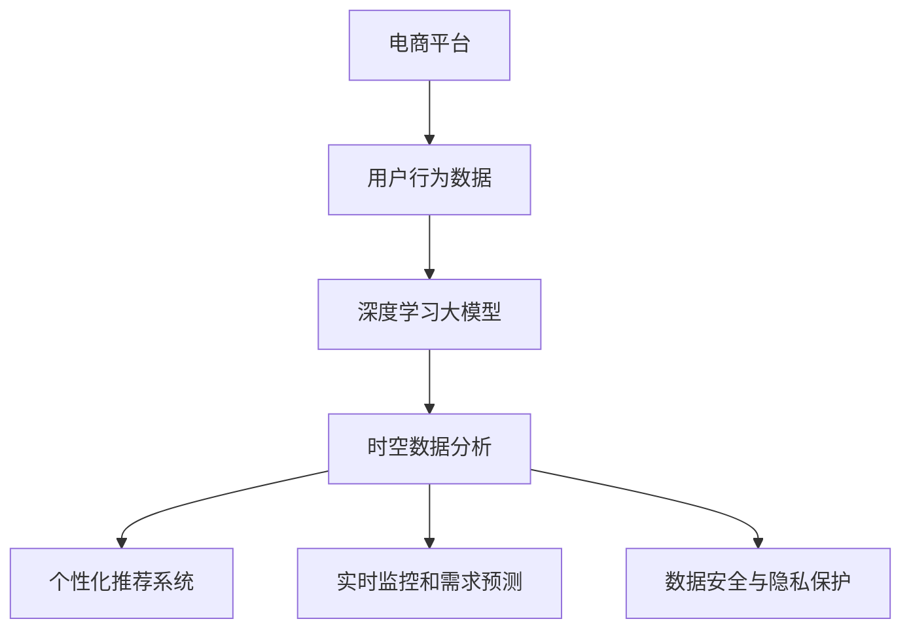

                 

# 电商平台中的时空数据分析：大模型的创新应用

> 关键词：电商平台,时空数据分析,大模型,深度学习,数据挖掘,推荐系统,用户行为分析

## 1. 背景介绍

### 1.1 问题由来
随着电商平台的迅猛发展，用户数据量呈指数级增长。如何高效地利用海量用户数据，从中挖掘有价值的信息，已成为电商平台关注的焦点。传统的机器学习算法在处理大规模数据时面临高计算复杂度和低处理效率的问题，难以满足实际需求。

与此同时，近年来深度学习大模型的快速崛起，为大规模数据分析提供了新的解决方案。利用深度学习大模型，电商平台能够更高效、更准确地处理和分析用户行为数据，从而实现个性化推荐、实时监控、需求预测等应用场景。

### 1.2 问题核心关键点
大模型在电商平台中主要应用于时空数据分析，涉及以下几个核心关键点：

- 用户行为数据的时空特性：电商平台用户行为数据具有时序性和空间性，需要在时间序列和地理分布中进行综合分析。
- 大模型的深度学习能力：深度学习大模型可以自动学习用户数据中的复杂模式，捕捉隐藏在数据背后的规律。
- 个性化推荐系统：利用大模型分析用户行为数据，进行商品推荐，提升用户购物体验。
- 实时监控和需求预测：大模型可以实时分析用户数据，预测用户需求，优化库存和运营策略。
- 数据安全与隐私保护：在处理用户数据时，需要确保数据安全性和隐私保护，防止数据泄露和滥用。

通过大模型进行时空数据分析，电商平台可以更好地理解用户需求，提高运营效率，降低运营成本，增强市场竞争力。

## 2. 核心概念与联系

### 2.1 核心概念概述

为更好地理解基于深度学习大模型的时空数据分析方法，本节将介绍几个关键概念：

- 深度学习大模型(Deep Learning Large Model, DL-LM)：以自回归(如GPT)或自编码(如BERT)模型为代表的大规模预训练语言模型。通过在大规模无标签文本语料上进行预训练，学习通用的语言表示，具备强大的语言理解和生成能力。

- 用户行为数据(User Behavior Data)：用户在电商平台上的各种行为数据，包括浏览记录、点击次数、购买记录、评价内容等。

- 时空数据分析(Spatial-Temporal Data Analysis)：分析用户在特定时间和空间范围内的行为模式，挖掘用户行为背后的规律和趋势。

- 推荐系统(Recommendation System)：通过分析用户行为数据，生成个性化推荐，提升用户体验。

- 深度学习(Deep Learning)：利用神经网络进行数据建模和预测的机器学习范式，可以处理复杂非线性的数据。

- 数据挖掘(Data Mining)：通过自动或半自动分析海量数据，发现隐藏在数据背后的模式、趋势和关联。

- 安全与隐私保护(Security and Privacy Protection)：在处理用户数据时，确保数据安全性和用户隐私，防止数据泄露和滥用。

这些核心概念之间的逻辑关系可以通过以下Mermaid流程图来展示：



这个流程图展示了基于深度学习大模型的时空数据分析流程：

1. 电商平台通过各种方式收集用户行为数据。
2. 数据经过预处理和清洗，输入深度学习大模型进行训练。
3. 大模型分析用户行为数据的时空特性，提取模式和规律。
4. 根据分析结果，构建个性化推荐系统，提升用户体验。
5. 实时监控用户行为数据，预测用户需求，优化库存和运营策略。
6. 确保数据安全性和隐私保护，防止数据泄露和滥用。

这些概念共同构成了基于深度学习大模型的时空数据分析框架，使其能够在电商平台中发挥强大的数据处理和分析能力。

## 3. 核心算法原理 & 具体操作步骤
### 3.1 算法原理概述

基于深度学习大模型的时空数据分析，本质上是一个通过深度学习模型学习用户行为数据中时空特性，进行数据建模和预测的过程。其核心思想是：将用户行为数据作为模型的输入，通过深度学习模型自动提取数据中的复杂模式，捕捉隐藏在数据背后的规律，从而进行数据建模和预测。

形式化地，假设用户行为数据为 $D=\{(x_t, y_t)\}_{t=1}^T, x_t \in \mathbb{R}^d, y_t \in \mathbb{R}$，其中 $x_t$ 表示用户在第 $t$ 时刻的行为特征，$y_t$ 表示用户在当前时刻的目标值（如购买概率、点击率等）。目标是通过大模型 $M_{\theta}$ 学习 $x_t$ 与 $y_t$ 之间的映射关系，即：

$$
y_t = M_{\theta}(x_t)
$$

其中 $\theta$ 为模型参数，需要通过深度学习大模型进行训练。通过梯度下降等优化算法，模型不断更新参数 $\theta$，最小化损失函数 $\mathcal{L}(M_{\theta},D)$，使得模型输出逼近真实标签。

### 3.2 算法步骤详解

基于深度学习大模型的时空数据分析一般包括以下几个关键步骤：

**Step 1: 准备数据集**
- 收集用户行为数据，划分为训练集、验证集和测试集。
- 数据预处理，包括数据清洗、特征工程等。
- 对数据进行时空分割，准备时序分析和空间分析所需的数据。

**Step 2: 选择模型**
- 选择合适的深度学习大模型，如BERT、GPT-2等。
- 确定模型的架构和超参数，如层数、节点数、学习率等。

**Step 3: 数据加载与处理**
- 将数据集输入模型进行训练。
- 对时序数据进行padding和truncation，保证输入数据的格式一致。
- 对空间数据进行编码，转换为向量表示。

**Step 4: 模型训练**
- 使用训练集进行模型训练，选择适当的优化算法（如Adam、SGD等）。
- 在验证集上进行模型验证，选择合适的超参数。
- 使用测试集评估模型的性能，优化模型参数。

**Step 5: 数据建模与预测**
- 对用户行为数据进行时空数据分析，提取特征。
- 利用训练好的模型进行数据建模和预测，如用户行为预测、推荐生成等。

**Step 6: 结果评估与优化**
- 在测试集上评估模型性能，如准确率、召回率、F1-score等。
- 根据评估结果，优化模型参数和超参数。
- 持续收集新的数据，定期重新训练和优化模型。

### 3.3 算法优缺点

基于深度学习大模型的时空数据分析方法具有以下优点：
1. 处理大规模数据：深度学习大模型可以高效处理大规模用户数据，具有强大的数据处理能力。
2. 自动提取模式：大模型可以自动学习用户数据中的复杂模式，捕捉隐藏在数据背后的规律。
3. 实时性：通过在线预测，可以实现实时分析和用户行为监控。
4. 预测精度高：深度学习大模型在预测准确性和鲁棒性方面表现优异。

同时，该方法也存在一定的局限性：
1. 计算复杂度高：大模型需要大量计算资源进行训练和推理。
2. 数据质量要求高：数据清洗和预处理需要耗费大量人力物力，数据质量直接影响模型性能。
3. 模型可解释性不足：大模型通常是"黑盒"模型，缺乏可解释性。
4. 部署复杂：大模型部署需要高性能硬件和复杂算法支持，对工程师要求较高。

尽管存在这些局限性，但深度学习大模型在处理时空数据分析方面仍然具有显著优势，得到了广泛应用。

### 3.4 算法应用领域

基于深度学习大模型的时空数据分析，在电商平台的多个领域得到了应用，包括但不限于：

- 个性化推荐系统：分析用户历史行为数据，生成个性化推荐，提升用户购物体验。
- 用户行为分析：挖掘用户行为背后的规律和趋势，进行用户画像和需求预测。
- 实时监控与预警：实时监控用户行为数据，预测用户需求，及时预警异常行为。
- 库存管理与优化：利用用户需求预测，优化库存管理，减少库存积压和缺货情况。
- 客户服务与营销：通过分析用户行为数据，优化客户服务策略，提升营销效果。

除了这些应用外，大模型还在电商平台的金融风控、市场分析、广告投放等场景中得到了广泛应用，为电商平台带来了巨大的商业价值。

## 4. 数学模型和公式 & 详细讲解 & 举例说明

### 4.1 数学模型构建

假设用户行为数据为 $D=\{(x_t, y_t)\}_{t=1}^T, x_t \in \mathbb{R}^d, y_t \in \mathbb{R}$。目标是通过大模型 $M_{\theta}$ 学习 $x_t$ 与 $y_t$ 之间的映射关系，即：

$$
y_t = M_{\theta}(x_t)
$$

其中 $\theta$ 为模型参数。

模型的输入 $x_t$ 通常为用户的各种行为特征，如浏览记录、点击次数、购买记录等。模型的输出 $y_t$ 为用户的各种目标值，如购买概率、点击率等。

### 4.2 公式推导过程

以用户行为预测为例，我们假设用户行为数据 $D=\{(x_t, y_t)\}_{t=1}^T$，其中 $x_t \in \mathbb{R}^d$ 表示用户在第 $t$ 时刻的行为特征，$y_t \in \mathbb{R}$ 表示用户在当前时刻的目标值。

假设模型 $M_{\theta}$ 为深度学习大模型，其输出为：

$$
\hat{y}_t = M_{\theta}(x_t)
$$

则模型的损失函数 $\mathcal{L}$ 可以定义为：

$$
\mathcal{L}(\theta) = \frac{1}{N}\sum_{i=1}^N \ell(\hat{y}_i, y_i)
$$

其中 $\ell(\hat{y}_i, y_i)$ 为损失函数，如均方误差、交叉熵等。目标是通过最小化损失函数 $\mathcal{L}(\theta)$，找到最优的模型参数 $\theta$。

模型的前向传播过程为：

$$
\hat{y}_t = M_{\theta}(x_t)
$$

模型的反向传播过程为：

$$
\frac{\partial \mathcal{L}(\theta)}{\partial \theta} = -\frac{1}{N}\sum_{i=1}^N \frac{\partial \ell(\hat{y}_i, y_i)}{\partial \hat{y}_i} \frac{\partial \hat{y}_i}{\partial \theta}
$$

其中 $\frac{\partial \hat{y}_i}{\partial \theta}$ 为模型对输入数据的梯度，可通过自动微分技术计算。

通过以上过程，模型可以不断更新参数 $\theta$，最小化损失函数 $\mathcal{L}(\theta)$，从而学习用户行为数据中隐藏的模式和规律。

### 4.3 案例分析与讲解

下面以电商平台的个性化推荐系统为例，分析基于深度学习大模型的时空数据分析过程。

假设电商平台收集到用户的历史行为数据 $D=\{(x_t, y_t)\}_{t=1}^T, x_t \in \mathbb{R}^d, y_t \in \{0,1\}$，其中 $x_t$ 表示用户在第 $t$ 时刻的行为特征，如浏览记录、点击次数、购买记录等，$y_t$ 表示用户是否购买了该商品。

1. **数据准备**
   - 将用户行为数据 $D$ 划分为训练集、验证集和测试集。
   - 对数据进行清洗和预处理，如去除异常数据、处理缺失值等。
   - 对时序数据进行padding和truncation，保证输入数据的格式一致。

2. **模型选择**
   - 选择深度学习大模型，如BERT、GPT-2等。
   - 确定模型的架构和超参数，如层数、节点数、学习率等。

3. **数据加载与处理**
   - 将数据集输入模型进行训练。
   - 对时序数据进行padding和truncation，保证输入数据的格式一致。
   - 对空间数据进行编码，转换为向量表示。

4. **模型训练**
   - 使用训练集进行模型训练，选择适当的优化算法（如Adam、SGD等）。
   - 在验证集上进行模型验证，选择合适的超参数。
   - 使用测试集评估模型的性能，优化模型参数。

5. **数据建模与预测**
   - 对用户行为数据进行时空数据分析，提取特征。
   - 利用训练好的模型进行数据建模和预测，如用户行为预测、推荐生成等。

6. **结果评估与优化**
   - 在测试集上评估模型性能，如准确率、召回率、F1-score等。
   - 根据评估结果，优化模型参数和超参数。
   - 持续收集新的数据，定期重新训练和优化模型。

通过以上过程，电商平台可以实现基于深度学习大模型的个性化推荐，提升用户体验和平台收益。

## 5. 项目实践：代码实例和详细解释说明
### 5.1 开发环境搭建

在进行时空数据分析项目实践前，我们需要准备好开发环境。以下是使用Python进行PyTorch开发的环境配置流程：

1. 安装Anaconda：从官网下载并安装Anaconda，用于创建独立的Python环境。

2. 创建并激活虚拟环境：
```bash
conda create -n pytorch-env python=3.8 
conda activate pytorch-env
```

3. 安装PyTorch：根据CUDA版本，从官网获取对应的安装命令。例如：
```bash
conda install pytorch torchvision torchaudio cudatoolkit=11.1 -c pytorch -c conda-forge
```

4. 安装Transformer库：
```bash
pip install transformers
```

5. 安装各类工具包：
```bash
pip install numpy pandas scikit-learn matplotlib tqdm jupyter notebook ipython
```

完成上述步骤后，即可在`pytorch-env`环境中开始时空数据分析实践。

### 5.2 源代码详细实现

下面我们以电商平台中的个性化推荐系统为例，给出使用Transformers库对BERT模型进行时空数据分析的PyTorch代码实现。

首先，定义推荐系统模型的输入和输出：

```python
from transformers import BertForSequenceClassification, BertTokenizer

class RecommendationModel:
    def __init__(self, model_name, num_labels=2):
        self.model = BertForSequenceClassification.from_pretrained(model_name, num_labels=num_labels)
        self.tokenizer = BertTokenizer.from_pretrained(model_name)
        
    def encode_input(self, input_text):
        return self.tokenizer.encode(input_text, truncation=True, padding='max_length')
    
    def predict(self, input_ids, attention_mask):
        with torch.no_grad():
            outputs = self.model(input_ids=input_ids, attention_mask=attention_mask)
            logits = outputs.logits
            return logits

# 初始化推荐系统模型
model = RecommendationModel('bert-base-cased', num_labels=2)
```

然后，定义模型训练和评估函数：

```python
from torch.utils.data import DataLoader
from tqdm import tqdm
from sklearn.metrics import accuracy_score, precision_recall_fscore_support

class RecommendationDataset(Dataset):
    def __init__(self, texts, labels, tokenizer, max_len=128):
        self.texts = texts
        self.labels = labels
        self.tokenizer = tokenizer
        self.max_len = max_len
        
    def __len__(self):
        return len(self.texts)
    
    def __getitem__(self, item):
        text = self.texts[item]
        label = self.labels[item]
        
        encoding = self.tokenizer(text, return_tensors='pt', max_length=self.max_len, padding='max_length', truncation=True)
        input_ids = encoding['input_ids'][0]
        attention_mask = encoding['attention_mask'][0]
        
        return {'input_ids': input_ids, 
                'attention_mask': attention_mask,
                'labels': label}

# 创建dataset
tokenizer = BertTokenizer.from_pretrained('bert-base-cased')
train_dataset = RecommendationDataset(train_texts, train_labels, tokenizer, max_len=128)
dev_dataset = RecommendationDataset(dev_texts, dev_labels, tokenizer, max_len=128)
test_dataset = RecommendationDataset(test_texts, test_labels, tokenizer, max_len=128)

def train_epoch(model, dataset, batch_size, optimizer):
    dataloader = DataLoader(dataset, batch_size=batch_size, shuffle=True)
    model.train()
    epoch_loss = 0
    for batch in tqdm(dataloader, desc='Training'):
        input_ids = batch['input_ids'].to(device)
        attention_mask = batch['attention_mask'].to(device)
        labels = batch['labels'].to(device)
        model.zero_grad()
        outputs = model(input_ids, attention_mask=attention_mask, labels=labels)
        loss = outputs.loss
        epoch_loss += loss.item()
        loss.backward()
        optimizer.step()
    return epoch_loss / len(dataloader)

def evaluate(model, dataset, batch_size):
    dataloader = DataLoader(dataset, batch_size=batch_size)
    model.eval()
    preds, labels = [], []
    with torch.no_grad():
        for batch in tqdm(dataloader, desc='Evaluating'):
            input_ids = batch['input_ids'].to(device)
            attention_mask = batch['attention_mask'].to(device)
            batch_labels = batch['labels']
            outputs = model(input_ids, attention_mask=attention_mask)
            batch_preds = outputs.logits.argmax(dim=2).to('cpu').tolist()
            batch_labels = batch_labels.to('cpu').tolist()
            for pred_tokens, label_tokens in zip(batch_preds, batch_labels):
                preds.append(pred_tokens[:len(label_tokens)])
                labels.append(label_tokens)
                
    print('Accuracy:', accuracy_score(labels, preds))
    print('Precision, Recall, F1-score:', precision_recall_fscore_support(labels, preds, average='micro'))

# 训练模型
epochs = 5
batch_size = 16

device = torch.device('cuda') if torch.cuda.is_available() else torch.device('cpu')
model.to(device)

optimizer = torch.optim.Adam(model.parameters(), lr=2e-5)

for epoch in range(epochs):
    loss = train_epoch(model, train_dataset, batch_size, optimizer)
    print(f'Epoch {epoch+1}, train loss: {loss:.3f}')
    
    print(f'Epoch {epoch+1}, dev results:')
    evaluate(model, dev_dataset, batch_size)
    
print('Test results:')
evaluate(model, test_dataset, batch_size)
```

以上就是使用PyTorch对BERT进行电商推荐系统的代码实现。可以看到，借助Transformers库的封装，我们可以更简洁地实现模型的构建和训练。

### 5.3 代码解读与分析

让我们再详细解读一下关键代码的实现细节：

**RecommendationModel类**：
- `__init__`方法：初始化模型和分词器。
- `encode_input`方法：将输入文本进行分词和编码，保证输入数据的格式一致。
- `predict`方法：输入编码后的文本，通过模型进行预测，返回预测结果。

**RecommendationDataset类**：
- `__init__`方法：初始化数据集的文本和标签，进行编码和padding处理。
- `__len__`方法：返回数据集的样本数量。
- `__getitem__`方法：对单个样本进行处理，将文本输入转换为模型所需的输入格式。

**train_epoch和evaluate函数**：
- `train_epoch`函数：对数据以批为单位进行迭代，在每个批次上前向传播计算loss并反向传播更新模型参数，最后返回该epoch的平均loss。
- `evaluate`函数：与训练类似，不同点在于不更新模型参数，并在每个batch结束后将预测和标签结果存储下来，最后使用sklearn的accuracy_score和precision_recall_fscore_support对整个评估集的预测结果进行打印输出。

**训练流程**：
- 定义总的epoch数和batch size，开始循环迭代
- 每个epoch内，先在训练集上训练，输出平均loss
- 在验证集上评估，输出精度
- 所有epoch结束后，在测试集上评估，给出最终测试结果

可以看到，PyTorch配合Transformers库使得BERT微调的代码实现变得简洁高效。开发者可以将更多精力放在数据处理、模型改进等高层逻辑上，而不必过多关注底层的实现细节。

当然，工业级的系统实现还需考虑更多因素，如模型的保存和部署、超参数的自动搜索、更灵活的任务适配层等。但核心的时空数据分析过程基本与此类似。

## 6. 实际应用场景
### 6.1 电商推荐系统

基于深度学习大模型的时空数据分析，在电商平台的个性化推荐系统中得到了广泛应用。通过分析用户的历史行为数据，模型可以精准预测用户的未来需求，生成个性化推荐，提升用户体验和平台收益。

在技术实现上，可以收集用户浏览、点击、购买等行为数据，将行为数据作为模型输入，进行训练和预测。在生成推荐列表时，模型根据用户的历史行为数据，预测用户对不同商品的兴趣程度，并按照兴趣程度排序，生成个性化推荐结果。如此构建的个性化推荐系统，能够动态调整推荐策略，实现精准推荐，大大提升用户购物体验和平台转化率。

### 6.2 实时监控与预警

深度学习大模型可以实时分析用户行为数据，预测用户需求，进行异常行为监控和预警。通过实时收集用户行为数据，模型可以捕捉用户行为的异动情况，及时预警异常行为。例如，在电商平台上，当用户浏览或购买行为出现异常波动时，系统可以自动预警，便于运营团队进行干预，避免潜在的风险和损失。

在技术实现上，可以利用深度学习大模型对用户行为数据进行实时分析，提取异常行为模式，进行预警。例如，当模型检测到用户浏览记录的平均时长突然下降，或者购买记录的频率显著增加时，系统可以自动触发预警机制，提示运营团队进行进一步的调查和处理。

### 6.3 库存管理与优化

通过时空数据分析，电商平台可以实现库存管理与优化，减少库存积压和缺货情况。通过分析用户历史行为数据，模型可以预测用户未来的购买需求，从而优化库存管理，确保供需平衡。

在技术实现上，可以收集用户浏览、点击、购买等行为数据，将行为数据作为模型输入，进行训练和预测。模型可以预测用户在未来的某个时间段内的购买概率，据此优化库存，避免库存积压和缺货。例如，当模型预测到用户对某商品的购买概率在近期内有显著提升时，系统可以自动增加该商品的库存量，确保商品供应的充足。

### 6.4 客户服务与营销

利用时空数据分析，电商平台可以优化客户服务策略，提升营销效果。通过分析用户历史行为数据，模型可以精准预测用户的个性化需求，推荐合适的服务和营销活动，提升客户满意度。

在技术实现上，可以收集用户浏览、点击、购买等行为数据，将行为数据作为模型输入，进行训练和预测。模型可以预测用户在未来的某个时间段内的购买意图，据此推荐合适的服务和营销活动。例如，当模型预测到用户对某类商品有较高的购买意图时，系统可以自动推送相应的营销活动，提升用户购买意愿。

## 7. 工具和资源推荐
### 7.1 学习资源推荐

为了帮助开发者系统掌握基于深度学习大模型的时空数据分析的理论基础和实践技巧，这里推荐一些优质的学习资源：

1. 《深度学习理论与实践》系列博文：由深度学习领域的知名专家撰写，系统讲解深度学习的基本原理和应用场景。

2. CS229《机器学习》课程：斯坦福大学开设的经典机器学习课程，涵盖机器学习的各种算法和应用。

3. 《深度学习与自然语言处理》书籍：Transformer库的作者所著，全面介绍深度学习在NLP领域的应用，包括时空数据分析在内。

4. TensorFlow官方文档：TensorFlow的官方文档，提供丰富的预训练模型和代码样例，是学习深度学习的必备资源。

5. PyTorch官方文档：PyTorch的官方文档，提供灵活的深度学习模型框架，支持深度学习大模型的训练和推理。

通过这些资源的学习实践，相信你一定能够快速掌握基于深度学习大模型的时空数据分析的精髓，并用于解决实际的电商问题。
###  7.2 开发工具推荐

高效的开发离不开优秀的工具支持。以下是几款用于时空数据分析开发的常用工具：

1. PyTorch：基于Python的开源深度学习框架，灵活动态的计算图，适合快速迭代研究。大部分深度学习大模型都有PyTorch版本的实现。

2. TensorFlow：由Google主导开发的开源深度学习框架，生产部署方便，适合大规模工程应用。同样有丰富的预训练语言模型资源。

3. Transformers库：HuggingFace开发的NLP工具库，集成了众多SOTA语言模型，支持PyTorch和TensorFlow，是进行时空数据分析开发的利器。

4. Weights & Biases：模型训练的实验跟踪工具，可以记录和可视化模型训练过程中的各项指标，方便对比和调优。与主流深度学习框架无缝集成。

5. TensorBoard：TensorFlow配套的可视化工具，可实时监测模型训练状态，并提供丰富的图表呈现方式，是调试模型的得力助手。

6. Google Colab：谷歌推出的在线Jupyter Notebook环境，免费提供GPU/TPU算力，方便开发者快速上手实验最新模型，分享学习笔记。

合理利用这些工具，可以显著提升时空数据分析任务的开发效率，加快创新迭代的步伐。

### 7.3 相关论文推荐

大语言模型和时空数据分析的发展源于学界的持续研究。以下是几篇奠基性的相关论文，推荐阅读：

1. Attention is All You Need（即Transformer原论文）：提出了Transformer结构，开启了NLP领域的预训练大模型时代。

2. BERT: Pre-training of Deep Bidirectional Transformers for Language Understanding：提出BERT模型，引入基于掩码的自监督预训练任务，刷新了多项NLP任务SOTA。

3. Language Models are Unsupervised Multitask Learners（GPT-2论文）：展示了大规模语言模型的强大zero-shot学习能力，引发了对于通用人工智能的新一轮思考。

4. Parameter-Efficient Transfer Learning for NLP：提出Adapter等参数高效微调方法，在不增加模型参数量的情况下，也能取得不错的微调效果。

5. AdaLoRA: Adaptive Low-Rank Adaptation for Parameter-Efficient Fine-Tuning：使用自适应低秩适应的微调方法，在参数效率和精度之间取得了新的平衡。

这些论文代表了大语言模型和时空数据分析的发展脉络。通过学习这些前沿成果，可以帮助研究者把握学科前进方向，激发更多的创新灵感。

## 8. 总结：未来发展趋势与挑战
### 8.1 总结

本文对基于深度学习大模型的时空数据分析方法进行了全面系统的介绍。首先阐述了深度学习大模型和时空数据分析的研究背景和意义，明确了时空数据分析在电商平台中的应用价值。其次，从原理到实践，详细讲解了时空数据分析的数学原理和关键步骤，给出了时空数据分析任务开发的完整代码实例。同时，本文还广泛探讨了时空数据分析方法在电商平台的多个领域的应用前景，展示了时空数据分析的巨大潜力。此外，本文精选了时空数据分析技术的各类学习资源，力求为读者提供全方位的技术指引。

通过本文的系统梳理，可以看到，基于深度学习大模型的时空数据分析方法在电商平台中具有广阔的应用前景。深度学习大模型可以高效处理海量用户数据，自动学习用户行为数据中隐藏的模式和规律，提供精准的个性化推荐、实时监控和需求预测，大大提升电商平台的运营效率和市场竞争力。未来，伴随深度学习大模型的不断发展，时空数据分析技术将在电商平台中发挥越来越重要的作用，带来更加智能化、个性化的用户体验。

### 8.2 未来发展趋势

展望未来，基于深度学习大模型的时空数据分析将呈现以下几个发展趋势：

1. 模型规模持续增大。随着算力成本的下降和数据规模的扩张，深度学习大模型的参数量还将持续增长。超大规模语言模型蕴含的丰富语言知识，有望支撑更加复杂多变的时空数据分析。

2. 数据质量要求提高。深度学习大模型对数据质量的要求更高，数据清洗和预处理需要耗费更多人力物力。数据质量直接影响模型性能，需要更高的数据管理能力和技术储备。

3. 实时性要求增强。深度学习大模型可以实时分析用户行为数据，进行实时推荐和监控。实时性和响应速度将成为未来时空数据分析的重要考量因素。

4. 跨模态融合趋势。时空数据分析不仅局限于文本数据，未来的分析将更加注重跨模态数据的融合。例如，结合图像、视频、语音等多模态信息，进行更全面、更深入的分析。

5. 增强隐私保护。用户数据的隐私保护和安全性将受到更多重视。如何在保证数据分析效果的同时，加强隐私保护，将是未来研究的重要方向。

6. 强化学习融合。将强化学习思想引入时空数据分析，实现数据驱动的智能决策。例如，通过深度学习大模型预测用户行为，再通过强化学习优化推荐策略，提升推荐效果。

以上趋势凸显了基于深度学习大模型的时空数据分析技术的广阔前景。这些方向的探索发展，必将进一步提升时空数据分析的精度和效率，为电商平台带来更大的商业价值。

### 8.3 面临的挑战

尽管基于深度学习大模型的时空数据分析技术已经取得了显著成果，但在迈向更加智能化、普适化应用的过程中，仍面临诸多挑战：

1. 计算资源瓶颈。深度学习大模型需要大量计算资源进行训练和推理，硬件资源和算法优化需求较高。如何降低计算资源消耗，提高推理效率，将是重要研究方向。

2. 数据标注成本高。深度学习大模型对数据标注的质量和数量要求高，标注成本高，数据管理难度大。如何降低标注成本，提高标注效率，是未来研究的重要任务。

3. 模型鲁棒性不足。深度学习大模型面对域外数据时，泛化性能往往大打折扣。如何在不同领域和不同数据分布下，提升模型的鲁棒性和泛化能力，还需要更多理论和实践的积累。

4. 数据隐私和安全。用户数据的隐私保护和安全性将受到更多重视。如何在保证数据分析效果的同时，加强隐私保护，防止数据泄露和滥用，将是未来研究的重要方向。

5. 数据驱动的决策。如何利用数据驱动的智能决策，优化电商平台的各种运营策略，提升业务效果，是未来研究的重要课题。

6. 模型可解释性。深度学习大模型通常是"黑盒"模型，缺乏可解释性。如何赋予模型更强的可解释性，增强用户信任，将是未来研究的重要方向。

这些挑战凸显了基于深度学习大模型的时空数据分析技术的复杂性和多样性。解决这些挑战，需要多学科交叉融合，共同推动技术进步。

### 8.4 研究展望

面向未来，基于深度学习大模型的时空数据分析技术需要在以下几个方面寻求新的突破：

1. 探索无监督和半监督学习。摆脱对大规模标注数据的依赖，利用自监督学习、主动学习等无监督和半监督范式，最大限度利用非结构化数据，实现更加灵活高效的时空数据分析。

2. 研究参数高效和计算高效的微调范式。开发更加参数高效的微调方法，在固定大部分预训练参数的同时，只更新极少量的任务相关参数。同时优化微调模型的计算图，减少前向传播和反向传播的资源消耗，实现更加轻量级、实时性的部署。

3. 融合因果和对比学习范式。通过引入因果推断和对比学习思想，增强时空数据分析模型的建立稳定因果关系的能力，学习更加普适、鲁棒的语言表征，从而提升模型泛化性和抗干扰能力。

4. 引入更多先验知识。将符号化的先验知识，如知识图谱、逻辑规则等，与神经网络模型进行巧妙融合，引导时空数据分析过程学习更准确、合理的语言模型。同时加强不同模态数据的整合，实现视觉、语音等多模态信息与文本信息的协同建模。

5. 结合因果分析和博弈论工具。将因果分析方法引入时空数据分析模型，识别出模型决策的关键特征，增强输出解释的因果性和逻辑性。借助博弈论工具刻画人机交互过程，主动探索并规避模型的脆弱点，提高系统稳定性。

6. 纳入伦理道德约束。在时空数据分析过程中，需要考虑伦理道德问题，如用户隐私保护、数据偏见等。如何在时空数据分析过程中，纳入伦理导向的评估指标，过滤和惩罚有害的输出倾向，是未来研究的重要方向。

这些研究方向的探索，必将引领时空数据分析技术迈向更高的台阶，为电商平台带来更大的商业价值。相信随着技术的不断发展，时空数据分析技术将在更多场景中得到应用，推动电商平台的智能化、个性化和高效化发展。

## 9. 附录：常见问题与解答
### Q1: 深度学习大模型时空数据分析的优缺点是什么？

**A1**: 深度学习大模型时空数据分析具有以下优点：
1. 处理大规模数据：深度学习大模型可以高效处理大规模用户数据，具有强大的数据处理能力。
2. 自动提取模式：大模型可以自动学习用户数据中的复杂模式，捕捉隐藏在数据背后的规律。
3. 实时性：通过在线预测，可以实现实时分析和用户行为监控。
4. 预测精度高：深度学习大模型在预测准确性和鲁棒性方面表现优异。

同时，该方法也存在以下缺点：
1. 计算复杂度高：深度学习大模型需要大量计算资源进行训练和推理。
2. 数据质量要求高：数据清洗和预处理需要耗费大量人力物力，数据质量直接影响模型性能。
3. 模型可解释性不足：大模型通常是"黑盒"模型，缺乏可解释性。
4. 部署复杂：深度学习大模型部署需要高性能硬件和复杂算法支持，对工程师要求较高。

### Q2: 基于深度学习大模型的时空数据分析如何进行数据准备？

**A2**: 基于深度学习大模型的时空数据分析，数据准备是关键步骤。以下是数据准备的主要流程：
1. 数据收集：从电商平台的日志、数据库、API等渠道收集用户行为数据。
2. 数据清洗：去除异常数据、处理缺失值、去重等。
3. 数据预处理：对时序数据进行padding和truncation，对空间数据进行编码。
4. 数据划分：将数据集划分为训练集、验证集和测试集。
5. 数据增强：通过数据增强技术，如回译、近义词替换等，扩充训练集。
6. 数据标准化：对输入数据进行标准化处理，保证格式一致。

### Q3: 如何选择合适的深度学习大模型进行时空数据分析？

**A3**: 选择合适的深度学习大模型需要考虑以下几个方面：
1. 数据类型：根据用户行为数据的特点，选择适合处理时序数据或空间数据的模型。
2. 模型规模：根据计算资源和数据量，选择模型规模合适的模型。
3. 预训练任务：选择预训练任务与目标任务相似的模型，提升微调效果。
4. 模型性能：选择性能稳定、预测精度高的模型，保证数据分析效果。
5. 模型开源性：选择开源模型，方便快速迭代和优化。

### Q4: 如何进行深度学习大模型的训练和评估？

**A4**: 深度学习大模型的训练和评估过程包括：
1. 模型选择：选择合适的深度学习大模型和预训练任务。
2. 数据加载与处理：将数据集输入模型进行训练，对时序数据进行padding和truncation，对空间数据进行编码。
3. 模型训练：使用训练集进行模型训练，选择适当的优化算法（如Adam、SGD等）。
4. 模型验证：在验证集上进行模型验证，选择合适的超参数。
5. 模型评估：在测试集上评估模型性能，如准确率、召回率、F1-score等。
6. 模型优化：根据评估结果，优化模型参数和超参数。

### Q5: 深度学习大模型在电商平台中的实际应用有哪些？

**A5**: 深度学习大模型在电商平台中的实际应用包括：
1. 个性化推荐系统：分析用户历史行为数据，生成个性化推荐，提升用户体验和平台收益。
2. 实时监控与预警：实时分析用户行为数据，预测用户需求，进行异常行为监控和预警。
3. 库存管理与优化：预测用户未来的购买需求，优化库存管理，确保供需平衡。
4. 客户服务与营销：预测用户的个性化需求，推荐合适的服务和营销活动，提升客户满意度。

综上所述，基于深度学习大模型的时空数据分析技术，通过高效处理大规模用户数据，自动学习用户行为数据中隐藏的模式和规律，能够实现个性化推荐、实时监控、库存优化等多种应用，为电商平台带来显著的商业价值。

