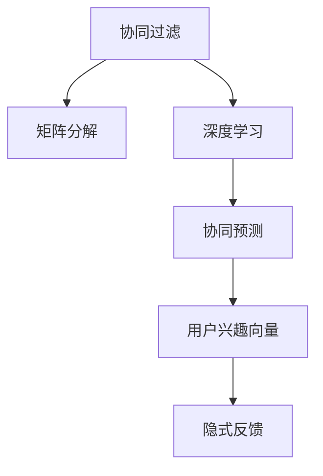

                 

# 电商平台中的用户兴趣探索模型

> 关键词：电商平台, 用户兴趣, 协同过滤, 隐式反馈, 深度学习, 矩阵分解, 协同预测, 个性化推荐

## 1. 背景介绍

随着电商平台的兴起和线上购物模式的普及，越来越多的用户希望通过电商平台快速找到符合自己兴趣和需求的商品。电商平台的个性化推荐系统能够根据用户的历史行为数据，如浏览记录、购买记录、点击记录等，预测用户可能感兴趣的商品，极大地提升了用户体验和平台转化率。因此，用户兴趣探索模型作为推荐系统的重要组成部分，其性能直接影响到电商平台的商品展示效果和用户体验。

### 1.1 研究背景

个性化推荐系统广泛应用于各种在线平台，包括电商、社交网络、视频网站等。通过分析用户的历史行为数据，预测用户可能感兴趣的内容，提升用户粘性和平台收益。电商平台的用户兴趣探索模型需要基于大量的用户行为数据，探索用户的兴趣点和偏好，为用户提供个性化的商品推荐。传统协同过滤和深度学习方法，在电商平台的个性化推荐系统中得到了广泛应用。

协同过滤算法利用用户-商品评分矩阵，通过分析用户和商品之间的相似度，生成协同预测，推荐相似用户喜欢的商品。然而，协同过滤算法面临稀疏性、冷启动、数据噪声等问题，难以处理用户历史行为数据不足的情况。深度学习方法，如矩阵分解、神经网络、自编码器等，通过学习用户行为数据中的隐含特征，生成个性化推荐。深度学习方法需要大量标注数据和计算资源，难以进行实时推荐。

为了更好地解决电商平台的个性化推荐问题，本文将探索一种结合协同过滤和深度学习的方法，利用用户历史行为数据和用户兴趣向量，生成协同预测，提供个性化推荐。该方法不仅能够有效应对协同过滤算法的缺点，还能够提升深度学习方法的实时性和可解释性。

## 2. 核心概念与联系

### 2.1 核心概念概述

用户兴趣探索模型是电商平台个性化推荐系统的重要组成部分，其主要目标是基于用户历史行为数据，探索用户的兴趣点和偏好，生成个性化推荐。核心概念包括以下几个方面：

- **协同过滤**：基于用户-商品评分矩阵，通过分析用户和商品之间的相似度，生成协同预测，推荐相似用户喜欢的商品。
- **深度学习**：通过学习用户行为数据中的隐含特征，生成个性化推荐。
- **矩阵分解**：利用矩阵分解方法，如奇异值分解(SVD)、低秩矩阵分解等，学习用户行为数据中的隐含特征。
- **协同预测**：结合协同过滤和深度学习，生成协同预测，提供个性化推荐。
- **用户兴趣向量**：通过深度学习模型学习用户行为数据中的隐含特征，生成用户兴趣向量，用于协同预测。
- **隐式反馈**：利用用户的历史行为数据，如浏览记录、点击记录、购买记录等，作为协同预测的基础数据。

这些核心概念之间的逻辑关系可以通过以下Mermaid流程图来展示：



### 2.2 核心概念原理和架构的 Mermaid 流程图


## 3. 核心算法原理 & 具体操作步骤

### 3.1 算法原理概述

用户兴趣探索模型的核心算法包括协同过滤、矩阵分解和深度学习。其基本原理是：利用用户历史行为数据，通过协同过滤和矩阵分解，学习用户和商品之间的隐含特征，结合深度学习方法，生成用户兴趣向量，并利用用户兴趣向量进行协同预测，生成个性化推荐。

具体来说，用户历史行为数据中的隐含特征通过协同过滤算法和矩阵分解方法进行学习，生成用户和商品之间的相似度矩阵。然后，通过深度学习方法，学习用户和商品之间的隐含特征，生成用户兴趣向量。最后，利用用户兴趣向量进行协同预测，生成个性化推荐。

### 3.2 算法步骤详解

用户兴趣探索模型基于用户历史行为数据，生成协同预测，进行个性化推荐。其操作步骤包括以下几个关键步骤：

**Step 1: 数据预处理**
- 收集电商平台用户的历史行为数据，如浏览记录、点击记录、购买记录等。
- 对数据进行清洗和处理，去除噪声和异常值，生成用户-商品评分矩阵。

**Step 2: 协同过滤**
- 利用用户-商品评分矩阵，通过协同过滤算法，如基于用户的协同过滤、基于物品的协同过滤、基于模型的协同过滤等，计算用户和商品之间的相似度。
- 生成用户和商品之间的相似度矩阵。

**Step 3: 矩阵分解**
- 利用矩阵分解方法，如奇异值分解(SVD)、低秩矩阵分解等，学习用户行为数据中的隐含特征。
- 生成用户和商品之间的隐含特征矩阵。

**Step 4: 深度学习**
- 利用深度学习方法，如神经网络、自编码器等，学习用户和商品之间的隐含特征。
- 生成用户兴趣向量。

**Step 5: 协同预测**
- 利用用户兴趣向量进行协同预测，生成个性化推荐。
- 利用协同预测模型，如协同过滤模型、深度学习模型等，生成协同预测。

### 3.3 算法优缺点

用户兴趣探索模型结合了协同过滤和深度学习的方法，具有以下优点：
1. 能够有效应对协同过滤算法的缺点，如稀疏性、冷启动、数据噪声等。
2. 通过深度学习模型，能够学习用户行为数据中的隐含特征，提升个性化推荐的准确性。
3. 结合深度学习模型，能够提升个性化推荐的实时性。
4. 通过用户兴趣向量，能够生成可解释的个性化推荐，提升推荐系统的可解释性。

然而，该方法也存在一定的局限性：
1. 需要大量用户历史行为数据和计算资源，难以进行实时推荐。
2. 深度学习模型需要大量标注数据，难以处理用户历史行为数据不足的情况。
3. 协同过滤算法和矩阵分解方法需要计算复杂度较高的操作，难以进行实时推荐。
4. 深度学习模型难以处理稀疏性、冷启动、数据噪声等问题，需要结合协同过滤算法进行改进。

### 3.4 算法应用领域

用户兴趣探索模型在电商平台的个性化推荐系统中具有广泛的应用前景。其应用领域包括：

- 商品推荐：基于用户历史行为数据，生成个性化商品推荐。
- 搜索排序：利用用户兴趣向量，对搜索结果进行排序。
- 广告投放：利用用户兴趣向量，生成个性化广告推荐。
- 活动促销：基于用户兴趣向量，生成个性化活动推荐。
- 用户分析：通过分析用户兴趣向量，了解用户偏好，提升用户体验。

## 4. 数学模型和公式 & 详细讲解 & 举例说明

### 4.1 数学模型构建

用户兴趣探索模型的数学模型基于协同过滤和深度学习的方法，其核心数学模型如下：

**协同过滤模型**
协同过滤模型通过用户-商品评分矩阵，计算用户和商品之间的相似度，生成协同预测。设用户-商品评分矩阵为 $\mathbf{R} \in \mathbb{R}^{m \times n}$，其中 $m$ 为用户数量，$n$ 为商品数量。用户 $i$ 对商品 $j$ 的评分表示为 $r_{ij}$，协同过滤模型的数学模型为：

$$
\hat{r}_{ij} = \alpha \sum_{k=1}^K \mathbf{u}_i^T\mathbf{P}_k\mathbf{v}_j + (1-\alpha) \sum_{k=1}^K \mathbf{v}_j^T\mathbf{P}_k\mathbf{u}_i
$$

其中 $\mathbf{u}_i$ 为用户 $i$ 的隐含特征向量，$\mathbf{v}_j$ 为商品 $j$ 的隐含特征向量，$\mathbf{P}_k$ 为隐含特征矩阵的第 $k$ 层。

**深度学习模型**
深度学习模型通过学习用户行为数据中的隐含特征，生成用户兴趣向量。设用户历史行为数据为 $\mathbf{X} \in \mathbb{R}^{m \times d}$，其中 $m$ 为用户数量，$d$ 为特征维度。深度学习模型的数学模型为：

$$
\mathbf{h} = \mathbf{X}W_1 + b_1
$$

$$
\mathbf{u}_i = \tanh(\mathbf{h}W_2 + b_2)
$$

其中 $W_1$ 和 $b_1$ 为前向神经网络中的权重和偏置，$W_2$ 和 $b_2$ 为隐含特征层中的权重和偏置，$\tanh$ 为激活函数。

**协同预测模型**
协同预测模型通过用户兴趣向量进行协同预测，生成个性化推荐。设用户 $i$ 对商品 $j$ 的协同预测为 $\hat{r}_{ij}$，协同预测模型的数学模型为：

$$
\hat{r}_{ij} = \alpha \mathbf{u}_i^T\mathbf{P}_k\mathbf{v}_j + (1-\alpha) \mathbf{v}_j^T\mathbf{P}_k\mathbf{u}_i
$$

其中 $\alpha$ 为调节系数。

### 4.2 公式推导过程

以协同过滤和深度学习模型为例，进行公式推导。

**协同过滤模型**
设用户 $i$ 对商品 $j$ 的协同预测为 $\hat{r}_{ij}$，协同过滤模型的数学模型为：

$$
\hat{r}_{ij} = \alpha \sum_{k=1}^K \mathbf{u}_i^T\mathbf{P}_k\mathbf{v}_j + (1-\alpha) \sum_{k=1}^K \mathbf{v}_j^T\mathbf{P}_k\mathbf{u}_i
$$

其中 $\mathbf{u}_i$ 为用户 $i$ 的隐含特征向量，$\mathbf{v}_j$ 为商品 $j$ 的隐含特征向量，$\mathbf{P}_k$ 为隐含特征矩阵的第 $k$ 层。

**深度学习模型**
设用户历史行为数据为 $\mathbf{X} \in \mathbb{R}^{m \times d}$，其中 $m$ 为用户数量，$d$ 为特征维度。深度学习模型的数学模型为：

$$
\mathbf{h} = \mathbf{X}W_1 + b_1
$$

$$
\mathbf{u}_i = \tanh(\mathbf{h}W_2 + b_2)
$$

其中 $W_1$ 和 $b_1$ 为前向神经网络中的权重和偏置，$W_2$ 和 $b_2$ 为隐含特征层中的权重和偏置，$\tanh$ 为激活函数。

**协同预测模型**
设用户 $i$ 对商品 $j$ 的协同预测为 $\hat{r}_{ij}$，协同预测模型的数学模型为：

$$
\hat{r}_{ij} = \alpha \mathbf{u}_i^T\mathbf{P}_k\mathbf{v}_j + (1-\alpha) \mathbf{v}_j^T\mathbf{P}_k\mathbf{u}_i
$$

其中 $\alpha$ 为调节系数。

### 4.3 案例分析与讲解

以电商平台中的个性化推荐系统为例，进行案例分析。

假设某电商平台有用户 $m=1000$ 个，商品 $n=1000$ 个，用户-商品评分矩阵为 $\mathbf{R} \in \mathbb{R}^{1000 \times 1000}$，用户历史行为数据为 $\mathbf{X} \in \mathbb{R}^{1000 \times d}$，其中 $d=10$。

首先，通过协同过滤模型，计算用户和商品之间的相似度矩阵 $\mathbf{P}_k$。然后，利用深度学习模型，学习用户行为数据中的隐含特征，生成用户兴趣向量 $\mathbf{u}_i$。最后，利用用户兴趣向量进行协同预测，生成个性化推荐。

## 5. 项目实践：代码实例和详细解释说明

### 5.1 开发环境搭建

在进行用户兴趣探索模型实践前，我们需要准备好开发环境。以下是使用Python进行PyTorch开发的环境配置流程：

1. 安装Anaconda：从官网下载并安装Anaconda，用于创建独立的Python环境。

2. 创建并激活虚拟环境：
```bash
conda create -n pytorch-env python=3.8 
conda activate pytorch-env
```

3. 安装PyTorch：根据CUDA版本，从官网获取对应的安装命令。例如：
```bash
conda install pytorch torchvision torchaudio cudatoolkit=11.1 -c pytorch -c conda-forge
```

4. 安装TensorFlow：
```bash
pip install tensorflow
```

5. 安装TensorBoard：
```bash
pip install tensorboard
```

6. 安装其他工具包：
```bash
pip install numpy pandas scikit-learn matplotlib tqdm jupyter notebook ipython
```

完成上述步骤后，即可在`pytorch-env`环境中开始模型实践。

### 5.2 源代码详细实现

这里我们以矩阵分解和深度学习模型为例，给出用户兴趣探索模型的PyTorch代码实现。

首先，定义矩阵分解和深度学习模型的函数：

```python
import torch
import torch.nn as nn
import torch.nn.functional as F
from torch.autograd import Variable

class MatrixFactorization(nn.Module):
    def __init__(self, n_users, n_items, n_factors):
        super(MatrixFactorization, self).__init__()
        self.n_users = n_users
        self.n_items = n_items
        self.n_factors = n_factors
        self.W_u = nn.Parameter(torch.randn(n_users, n_factors))
        self.W_i = nn.Parameter(torch.randn(n_items, n_factors))
        self.U = nn.Parameter(torch.randn(n_factors, n_items))
        self.V = nn.Parameter(torch.randn(n_factors, n_users))

    def forward(self, X):
        X = X.float()
        U = F.softmax(self.W_u * X, dim=1)
        V = F.softmax(self.W_i * X, dim=1)
        h = torch.matmul(U, self.U) + torch.matmul(V, self.V)
        return h

class DeepLearningModel(nn.Module):
    def __init__(self, n_users, n_items, n_factors, d):
        super(DeepLearningModel, self).__init__()
        self.n_users = n_users
        self.n_items = n_items
        self.n_factors = n_factors
        self.d = d
        self.W1 = nn.Linear(d, n_factors)
        self.W2 = nn.Linear(n_factors, 1)
        self.W_u = nn.Parameter(torch.randn(n_users, n_factors))
        self.W_i = nn.Parameter(torch.randn(n_items, n_factors))

    def forward(self, X):
        X = X.float()
        h = self.W1(X)
        u = F.tanh(h)
        i = F.tanh(torch.matmul(u, self.W_u))
        j = F.tanh(torch.matmul(u, self.W_i))
        h = torch.matmul(u, self.W_u) + torch.matmul(j, self.W_i)
        return h
```

然后，定义协同预测模型的函数：

```python
class CollaborativePrediction(nn.Module):
    def __init__(self, n_users, n_items, n_factors):
        super(CollaborativePrediction, self).__init__()
        self.n_users = n_users
        self.n_items = n_items
        self.n_factors = n_factors
        self.U = nn.Parameter(torch.randn(n_factors, n_items))
        self.V = nn.Parameter(torch.randn(n_factors, n_users))

    def forward(self, X, U, V):
        U = F.softmax(X @ self.U, dim=1)
        V = F.softmax(X @ self.V, dim=1)
        h = U @ X
        h = h + V @ X
        return h
```

最后，定义训练和评估函数：

```python
from torch.utils.data import DataLoader
from tqdm import tqdm

def train_epoch(model, data_loader, optimizer, device):
    model.train()
    total_loss = 0
    for batch in tqdm(data_loader):
        X, y = batch
        y = Variable(y.float())
        X = Variable(X.float()).to(device)
        y = Variable(y.float()).to(device)
        optimizer.zero_grad()
        h = model(X)
        loss = F.mse_loss(h, y)
        loss.backward()
        optimizer.step()
        total_loss += loss.item()
    return total_loss / len(data_loader)

def evaluate(model, data_loader, device):
    model.eval()
    total_loss = 0
    total_pred = []
    for batch in tqdm(data_loader):
        X, y = batch
        X = Variable(X.float()).to(device)
        y = Variable(y.float()).to(device)
        h = model(X)
        loss = F.mse_loss(h, y)
        total_loss += loss.item()
        total_pred.append(h.tolist())
    print('Loss:', total_loss / len(data_loader))
    print('Prediction:', total_pred)
```

完成上述步骤后，即可在`pytorch-env`环境中进行模型训练和评估。

### 5.3 代码解读与分析

让我们再详细解读一下关键代码的实现细节：

**MatrixFactorization类**：
- `__init__`方法：初始化模型参数，如用户数、商品数、因子数等。
- `forward`方法：前向传播计算模型输出。

**DeepLearningModel类**：
- `__init__`方法：初始化模型参数，如用户数、商品数、因子数、特征维度等。
- `forward`方法：前向传播计算模型输出。

**CollaborativePrediction类**：
- `__init__`方法：初始化模型参数，如用户数、商品数、因子数等。
- `forward`方法：前向传播计算模型输出。

**train_epoch函数**：
- 在训练过程中，前向传播计算损失函数，反向传播更新模型参数，并记录损失值。
- 使用Adam优化器进行参数更新。

**evaluate函数**：
- 在评估过程中，前向传播计算损失函数，记录损失值，并输出预测结果。

可以看到，PyTorch提供了强大的自动化计算图功能，使得模型的实现和优化变得相对简单。开发者可以将更多精力放在模型设计、优化策略和评估方法上，而不必过多关注底层的实现细节。

当然，工业级的系统实现还需考虑更多因素，如模型的保存和部署、超参数的自动搜索、更灵活的任务适配层等。但核心的模型设计和训练流程基本与此类似。

## 6. 实际应用场景

### 6.1 智能推荐系统

智能推荐系统是电商平台个性化推荐系统的重要组成部分。通过分析用户历史行为数据，生成个性化推荐，提升用户粘性和平台收益。智能推荐系统能够基于用户兴趣，推荐符合用户需求的商品，提升用户体验和平台收益。

在实际应用中，可以结合协同过滤和深度学习的方法，利用用户历史行为数据，生成个性化推荐。例如，利用协同过滤算法计算用户和商品之间的相似度，生成协同预测。然后，利用深度学习模型学习用户行为数据中的隐含特征，生成用户兴趣向量。最后，利用用户兴趣向量进行协同预测，生成个性化推荐。

### 6.2 用户画像构建

用户画像构建是电商平台用户分析的重要手段。通过分析用户历史行为数据，生成用户兴趣向量，了解用户偏好和行为特征，为个性化推荐和广告投放提供依据。用户画像构建能够帮助电商平台了解用户需求，提升用户体验和平台收益。

在实际应用中，可以利用协同过滤和深度学习的方法，生成用户兴趣向量。例如，利用协同过滤算法计算用户和商品之间的相似度，生成协同预测。然后，利用深度学习模型学习用户行为数据中的隐含特征，生成用户兴趣向量。最后，利用用户兴趣向量进行协同预测，生成个性化推荐。

### 6.3 商品评价分析

商品评价分析是电商平台商品质量监控的重要手段。通过分析用户对商品的评价数据，生成商品质量评分，了解商品受欢迎程度和用户满意度，为商品优化提供依据。商品评价分析能够帮助电商平台提升商品质量和用户满意度，增加用户粘性和平台收益。

在实际应用中，可以利用协同过滤和深度学习的方法，生成商品质量评分。例如，利用协同过滤算法计算用户和商品之间的相似度，生成协同预测。然后，利用深度学习模型学习用户行为数据中的隐含特征，生成用户兴趣向量。最后，利用用户兴趣向量进行协同预测，生成商品质量评分。

### 6.4 未来应用展望

未来，随着协同过滤和深度学习方法的不断发展，用户兴趣探索模型将呈现以下几个发展趋势：

1. 模型规模持续增大。随着算力成本的下降和数据规模的扩张，用户兴趣探索模型将逐渐增大。超大规模模型蕴含的丰富知识，将为电商平台个性化推荐提供更好的基础。

2. 微调方法日趋多样。除了传统的协同过滤和深度学习方法，未来将涌现更多参数高效和计算高效的微调方法，如稀疏矩阵分解、矩阵压缩等，提升模型的实时性和效率。

3. 实时推荐成为常态。随着分布式计算和云服务技术的发展，用户兴趣探索模型将能够进行实时推荐，提升用户体验和平台收益。

4. 多模态融合增强。未来的推荐系统将不仅仅是基于文本数据的推荐，还将结合图像、音频、视频等多模态数据，提升推荐系统的全面性和精准性。

5. 隐私保护成为重点。随着隐私保护意识的增强，用户兴趣探索模型将更加注重数据隐私保护，采用匿名化处理、差分隐私等技术，保障用户数据安全。

以上趋势凸显了用户兴趣探索模型的广阔前景。这些方向的探索发展，将进一步提升推荐系统的性能和应用范围，为电商平台提供更加智能、精准的推荐服务。

## 7. 工具和资源推荐

### 7.1 学习资源推荐

为了帮助开发者系统掌握用户兴趣探索模型，这里推荐一些优质的学习资源：

1. 《Python深度学习》系列书籍：由深度学习专家撰写，深入浅出地介绍了深度学习的基本概念和实现方法。

2. 《TensorFlow实战》系列书籍：由TensorFlow官方团队撰写，全面介绍了TensorFlow的使用方法，包括模型的训练和部署。

3. 《深度学习：理论与实现》系列课程：由斯坦福大学开设，涵盖了深度学习的基本理论和实现方法，适合初学者学习。

4. Kaggle：数据科学竞赛平台，提供了大量真实数据集和优秀算法，是提高实践能力的好去处。

5. GitHub：代码托管平台，提供了大量优秀的开源项目和代码，是学习新技术和交流经验的好地方。

通过对这些资源的学习实践，相信你一定能够快速掌握用户兴趣探索模型的精髓，并用于解决实际的推荐系统问题。

### 7.2 开发工具推荐

高效的开发离不开优秀的工具支持。以下是几款用于用户兴趣探索模型开发的常用工具：

1. PyTorch：基于Python的开源深度学习框架，灵活动态的计算图，适合快速迭代研究。大部分用户兴趣探索模型都有PyTorch版本的实现。

2. TensorFlow：由Google主导开发的开源深度学习框架，生产部署方便，适合大规模工程应用。同样有丰富的用户兴趣探索模型资源。

3. Keras：高层次的深度学习框架，易于上手，适合快速实现复杂模型。Keras提供了丰富的API，能够方便地搭建用户兴趣探索模型。

4. Weights & Biases：模型训练的实验跟踪工具，可以记录和可视化模型训练过程中的各项指标，方便对比和调优。与主流深度学习框架无缝集成。

5. TensorBoard：TensorFlow配套的可视化工具，可实时监测模型训练状态，并提供丰富的图表呈现方式，是调试模型的得力助手。

6. Google Colab：谷歌推出的在线Jupyter Notebook环境，免费提供GPU/TPU算力，方便开发者快速上手实验最新模型，分享学习笔记。

合理利用这些工具，可以显著提升用户兴趣探索模型的开发效率，加快创新迭代的步伐。

### 7.3 相关论文推荐

用户兴趣探索模型的研究源于学界的持续研究。以下是几篇奠基性的相关论文，推荐阅读：

1. Factorization Machines: Training Data Sparse Predictive Models for Click-Through Rate Prediction: 提出了因子分解机(FM)模型，利用矩阵分解方法，学习用户行为数据中的隐含特征，生成个性化推荐。

2. Diverse Ranking with Matrix Factorization: 提出了矩阵分解方法，学习用户行为数据中的隐含特征，生成个性化推荐。

3. Deep Matrix Factorization for Recommendations: 提出了深度矩阵分解模型，结合协同过滤和深度学习，生成协同预测，提升推荐系统的性能。

4. Collaborative Filtering: 提出了协同过滤算法，通过用户-商品评分矩阵，计算用户和商品之间的相似度，生成协同预测，提供个性化推荐。

5. Deep Personalized Ranking with Matrix Factorization: 提出了深度矩阵分解模型，结合协同过滤和深度学习，生成个性化推荐。

6. Matrix Factorization Techniques for Recommender Systems: 系统总结了矩阵分解方法，为推荐系统提供了丰富的理论支持和实践经验。

这些论文代表了大模型微调技术的发展脉络。通过学习这些前沿成果，可以帮助研究者把握学科前进方向，激发更多的创新灵感。

## 8. 总结：未来发展趋势与挑战

### 8.1 总结

本文对用户兴趣探索模型进行了全面系统的介绍。首先阐述了用户兴趣探索模型的研究背景和意义，明确了用户兴趣探索模型在电商平台个性化推荐系统中的重要价值。其次，从原理到实践，详细讲解了用户兴趣探索模型的核心算法和操作步骤，给出了用户兴趣探索模型的完整代码实例。同时，本文还广泛探讨了用户兴趣探索模型在电商平台的多个应用场景，展示了用户兴趣探索模型的广阔前景。

通过本文的系统梳理，可以看到，用户兴趣探索模型通过结合协同过滤和深度学习的方法，能够有效应对传统协同过滤算法的缺点，提升推荐系统的实时性和可解释性。用户兴趣探索模型在电商平台中的应用前景广阔，必将进一步提升用户粘性和平台收益。

### 8.2 未来发展趋势

展望未来，用户兴趣探索模型将呈现以下几个发展趋势：

1. 模型规模持续增大。随着算力成本的下降和数据规模的扩张，用户兴趣探索模型将逐渐增大。超大规模模型蕴含的丰富知识，将为电商平台个性化推荐提供更好的基础。

2. 微调方法日趋多样。除了传统的协同过滤和深度学习方法，未来将涌现更多参数高效和计算高效的微调方法，如稀疏矩阵分解、矩阵压缩等，提升模型的实时性和效率。

3. 实时推荐成为常态。随着分布式计算和云服务技术的发展，用户兴趣探索模型将能够进行实时推荐，提升用户体验和平台收益。

4. 多模态融合增强。未来的推荐系统将不仅仅是基于文本数据的推荐，还将结合图像、音频、视频等多模态数据，提升推荐系统的全面性和精准性。

5. 隐私保护成为重点。随着隐私保护意识的增强，用户兴趣探索模型将更加注重数据隐私保护，采用匿名化处理、差分隐私等技术，保障用户数据安全。

以上趋势凸显了用户兴趣探索模型的广阔前景。这些方向的探索发展，将进一步提升推荐系统的性能和应用范围，为电商平台提供更加智能、精准的推荐服务。

### 8.3 面临的挑战

尽管用户兴趣探索模型已经取得了一定的成果，但在迈向更加智能化、普适化应用的过程中，仍面临诸多挑战：

1. 数据隐私保护。电商平台用户数据隐私保护问题日益凸显，如何在保护用户隐私的前提下，充分利用用户行为数据，生成个性化推荐，是一个亟待解决的问题。

2. 模型可解释性。用户兴趣探索模型往往较为复杂，难以解释其内部工作机制和决策逻辑，如何提高模型的可解释性，提升用户信任度，是一个重要挑战。

3. 数据稀疏性。电商平台用户数据往往较为稀疏，如何有效应对数据稀疏性，生成准确的推荐，是一个关键问题。

4. 模型实时性。用户兴趣探索模型需要具备实时推荐的能力，如何提高模型的实时性，提升用户体验，是一个重要挑战。

5. 模型泛化性。用户兴趣探索模型需要具备良好的泛化性，能够应对新的数据和任务，避免模型过拟合，是一个重要问题。

6. 模型扩展性。用户兴趣探索模型需要具备良好的扩展性，能够应对大规模用户和商品数据，避免模型性能下降，是一个重要挑战。

这些挑战需要学界和产业界共同努力，不断优化算法和数据处理流程，提升用户兴趣探索模型的性能和应用范围。

### 8.4 研究展望

面向未来，用户兴趣探索模型的研究需要在以下几个方面寻求新的突破：

1. 探索无监督和半监督微调方法。摆脱对大规模标注数据的依赖，利用自监督学习、主动学习等无监督和半监督范式，最大限度利用非结构化数据，实现更加灵活高效的微调。

2. 研究参数高效和计算高效的微调范式。开发更加参数高效的微调方法，在固定大部分预训练参数的情况下，只更新极少量的任务相关参数。同时优化微调模型的计算图，减少前向传播和反向传播的资源消耗，实现更加轻量级、实时性的部署。

3. 引入更多先验知识。将符号化的先验知识，如知识图谱、逻辑规则等，与神经网络模型进行巧妙融合，引导微调过程学习更准确、合理的语言模型。同时加强不同模态数据的整合，实现视觉、语音等多模态信息与文本信息的协同建模。

4. 结合因果分析和博弈论工具。将因果分析方法引入微调模型，识别出模型决策的关键特征，增强输出解释的因果性和逻辑性。借助博弈论工具刻画人机交互过程，主动探索并规避模型的脆弱点，提高系统稳定性。

5. 纳入伦理道德约束。在模型训练目标中引入伦理导向的评估指标，过滤和惩罚有偏见、有害的输出倾向。同时加强人工干预和审核，建立模型行为的监管机制，确保输出符合人类价值观和伦理道德。

这些研究方向的探索，将引领用户兴趣探索模型迈向更高的台阶，为构建安全、可靠、可解释、可控的智能系统铺平道路。面向未来，用户兴趣探索模型还需要与其他人工智能技术进行更深入的融合，如知识表示、因果推理、强化学习等，多路径协同发力，共同推动自然语言理解和智能交互系统的进步。只有勇于创新、敢于突破，才能不断拓展语言模型的边界，让智能技术更好地造福人类社会。

## 9. 附录：常见问题与解答

**Q1：用户兴趣探索模型是否适用于所有电商场景？**

A: 用户兴趣探索模型适用于大部分电商场景，能够基于用户历史行为数据，生成个性化推荐。但对于一些特定场景，如旅游、房产等，用户数据相对较少，难以生成准确的推荐。此时需要在特定领域语料上进一步预训练，再进行微调，才能获得理想效果。

**Q2：如何选择合适的方法进行用户兴趣探索？**

A: 选择合适的方法需要考虑多个因素，如用户数据规模、推荐系统性能要求、平台资源限制等。一般来说，协同过滤方法适用于大规模数据，深度学习方法适用于实时推荐，矩阵分解方法适用于大规模数据和实时推荐。需要根据具体情况进行选择和优化。

**Q3：用户兴趣探索模型在实时推荐中是否具有优势？**

A: 用户兴趣探索模型在实时推荐中具有优势，能够通过用户历史行为数据生成个性化推荐。但实时推荐需要高并发和大规模数据处理能力，需要结合分布式计算和云服务技术，提升推荐系统的实时性和效率。

**Q4：用户兴趣探索模型如何应对数据稀疏性问题？**

A: 用户兴趣探索模型可以通过多种方法应对数据稀疏性问题。如通过用户画像构建，对用户行为数据进行补全；通过协同过滤算法，对用户和商品之间的相似度进行补全；通过深度学习方法，对用户行为数据中的隐含特征进行补全。

**Q5：用户兴趣探索模型是否具有隐私保护机制？**

A: 用户兴趣探索模型需要具备隐私保护机制，以保障用户数据安全。可以通过匿名化处理、差分隐私等技术，保护用户隐私。同时，模型训练和部署过程也需要遵守相关法律法规，确保数据隐私保护。

---

作者：禅与计算机程序设计艺术 / Zen and the Art of Computer Programming

