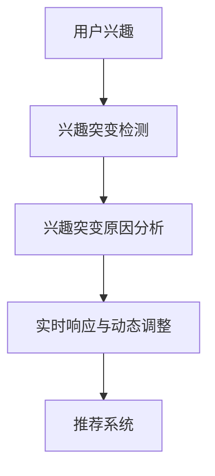

                 

# 电商平台中的用户兴趣突变检测与响应模型

> 关键词：电商平台, 用户兴趣, 兴趣突变检测, 用户行为预测, 推荐系统, 动态调整, 实时响应

## 1. 背景介绍

### 1.1 问题由来

随着电子商务的蓬勃发展，电商平台的数据量呈指数级增长。如何准确预测用户行为，提升用户体验和平台转化率，成为电商领域的重要研究方向。传统的用户兴趣预测模型，往往基于用户的浏览记录、购买记录等历史行为数据，构建静态的兴趣模型，难以捕捉用户的兴趣动态变化。

近年来，用户兴趣的突变变得越来越频繁，例如季节性购物、节日促销、新事件热点等都可能引发用户的兴趣剧烈波动。如果依然使用静态模型，可能导致推荐内容与用户当前兴趣不匹配，影响用户体验和推荐效果。因此，如何及时捕捉用户兴趣的突变，快速调整推荐策略，成为电商推荐系统面临的紧迫课题。

### 1.2 问题核心关键点

为了解决用户兴趣突变问题，电商平台需要引入能够动态捕捉用户兴趣的模型，以实现实时调整推荐内容的目的。具体来说，核心问题如下：

1. **用户兴趣突变检测**：如何准确地识别出用户兴趣的变化点，即用户在短时间内兴趣方向发生急剧转变。
2. **兴趣突变原因分析**：分析用户兴趣突变的原因，是否与某个事件相关，是否与新产品的推广相关等。
3. **实时响应与动态调整**：根据用户兴趣突变的结果，快速调整推荐策略，提升推荐效果。

## 2. 核心概念与联系

### 2.1 核心概念概述

为了系统解决上述问题，本节将介绍几个关键概念：

- **用户兴趣**：指用户对某一类商品的偏好程度，通常基于用户的浏览、点击、购买等行为数据构建。
- **兴趣突变检测**：指通过动态监测用户行为变化，识别出兴趣突变点，并及时发出警报。
- **兴趣突变原因分析**：指对用户兴趣突变的原因进行分析，提取关键因素，为后续的推荐策略调整提供依据。
- **实时响应与动态调整**：指根据兴趣突变分析结果，动态调整推荐策略，快速响应用户需求。
- **推荐系统**：指基于用户兴趣和行为数据，为用户推荐合适的商品和内容的系统。

这些核心概念之间存在紧密的联系，共同构成了一个电商平台推荐系统的完整框架：



这个流程图展示了用户兴趣与推荐系统之间的动态关系：首先，通过兴趣突变检测识别出用户兴趣的变化，然后通过原因分析确定兴趣突变的原因，最终根据分析结果，进行实时响应和推荐策略的动态调整，从而提升推荐效果。

## 3. 核心算法原理 & 具体操作步骤
### 3.1 算法原理概述

为了实现上述目标，可以采用基于时间序列分析的兴趣突变检测算法，结合机器学习或深度学习技术进行兴趣突变原因分析，并基于分析结果进行动态推荐调整。具体来说，包括以下几个步骤：

1. **兴趣变化检测**：通过时间序列分析，捕捉用户行为数据的突发变化，识别出兴趣突变点。
2. **兴趣突变原因分析**：使用机器学习或深度学习模型，对用户行为数据进行分析，提取兴趣突变的原因。
3. **实时响应与动态调整**：根据分析结果，动态调整推荐策略，及时响应用户兴趣的变化。

### 3.2 算法步骤详解

#### 3.2.1 兴趣变化检测

**算法步骤**：

1. **数据准备**：收集用户的历史行为数据，如浏览记录、点击记录、购买记录等。
2. **时间序列建模**：对用户行为数据进行时间序列建模，计算时间窗口内的行为平均值和标准差。
3. **兴趣突变点检测**：使用滑动窗口检测时间序列的突发变化，设置阈值确定兴趣突变点。

**具体实现**：

- 收集用户的历史行为数据，例如电商平台的用户浏览记录。
- 将用户行为数据进行时间序列建模，计算每个时间窗口（如每天、每小时）内的平均浏览时长、点击次数等指标。
- 使用滑动窗口检测用户行为的变化趋势，设定阈值（如3倍标准差），当窗口内行为指标超出阈值时，标记为兴趣突变点。

#### 3.2.2 兴趣突变原因分析

**算法步骤**：

1. **特征提取**：从历史行为数据中提取特征，如浏览时长、点击次数、购买记录等。
2. **模型训练**：使用机器学习或深度学习模型，训练模型预测用户兴趣突变的原因。
3. **原因识别**：根据训练好的模型，识别用户兴趣突变的原因，例如特定产品推广、节假日促销等。

**具体实现**：

- 提取用户历史行为数据的特征，例如浏览时长、点击次数、购买金额等。
- 使用机器学习模型（如随机森林、XGBoost等）或深度学习模型（如RNN、LSTM等），训练模型预测用户兴趣突变的原因。
- 根据训练好的模型，对每个兴趣突变点进行原因分析，提取关键特征，如促销活动、热门商品等。

#### 3.2.3 实时响应与动态调整

**算法步骤**：

1. **推荐策略调整**：根据兴趣突变原因，调整推荐策略，如推荐热门商品、促销活动等。
2. **推荐结果生成**：使用推荐系统，根据新的推荐策略，生成推荐结果。
3. **用户反馈收集**：收集用户对推荐结果的反馈，评估推荐效果。

**具体实现**：

- 根据兴趣突变原因，调整推荐策略，例如推荐当前最热门的商品、正在进行的促销活动等。
- 使用推荐系统，根据新的推荐策略，生成推荐结果。
- 收集用户对推荐结果的反馈，如点击率、购买率等指标，评估推荐效果。

### 3.3 算法优缺点

**优点**：

1. **实时性高**：基于时间序列分析的兴趣突变检测算法，可以实时监测用户行为变化，快速识别出兴趣突变点。
2. **准确性高**：使用机器学习或深度学习模型进行兴趣突变原因分析，能够准确地提取关键因素。
3. **动态调整**：根据分析结果，动态调整推荐策略，提高推荐效果。

**缺点**：

1. **数据依赖性高**：兴趣突变检测和原因分析需要大量的历史行为数据，对数据质量要求较高。
2. **计算复杂度高**：机器学习或深度学习模型的训练和推理计算量较大，需要高性能计算资源。
3. **模型更新频率高**：电商平台需要频繁更新模型，以适应用户兴趣的变化，增加了维护成本。

### 3.4 算法应用领域

基于兴趣突变检测与响应模型的算法，主要应用于电商平台的推荐系统。具体应用场景包括：

1. **个性化推荐**：根据用户行为数据，动态调整推荐策略，提升推荐效果。
2. **广告投放优化**：通过兴趣突变原因分析，优化广告投放策略，提高广告点击率和转化率。
3. **库存管理**：根据兴趣突变检测结果，动态调整商品库存，避免断货或库存积压。
4. **客户关系维护**：通过分析用户兴趣变化，进行针对性的客户维护，提升客户满意度。

## 4. 数学模型和公式 & 详细讲解
### 4.1 数学模型构建

本节将使用数学语言对兴趣突变检测与响应模型的核心算法进行严格的数学建模。

记用户的历史行为数据为 $x_i = (x_{i,1}, x_{i,2}, \dots, x_{i,T})$，其中 $x_{i,t}$ 表示用户在第 $t$ 时间窗口内的行为数据，如浏览时长、点击次数等。设 $T$ 为历史数据的总时间窗口数。

假设用户的兴趣在第 $t$ 时间窗口内发生突变，则在 $t$ 时间窗口内用户的兴趣发生突变的概率为 $p_t$。根据时间序列分析，可以使用自回归移动平均模型（ARMA）或自回归积分滑动平均模型（ARIMA）进行建模，计算每个时间窗口内的行为平均值和标准差。

### 4.2 公式推导过程

**ARIMA模型**：

设 $y_t$ 表示用户在时间窗口 $t$ 内的行为数据，则ARIMA模型的基本形式为：

$$
y_t = \phi_0 + \sum_{i=1}^{p}\phi_i y_{t-i} + \sum_{j=1}^{q}\theta_j \Delta^j y_{t-j} + \varepsilon_t
$$

其中 $\varepsilon_t$ 表示随机误差项，$\Delta$ 表示差分操作。$p$ 和 $q$ 分别为自回归和差分的阶数。

对模型进行参数估计，得到模型的残差项 $\varepsilon_t$，然后计算每个时间窗口内的行为平均值 $\bar{y}_t$ 和标准差 $\sigma_t$。

### 4.3 案例分析与讲解

**案例分析**：

假设用户 $i$ 的历史行为数据为 $x_i = (x_{i,1}, x_{i,2}, \dots, x_{i,T})$，其中 $x_{i,t}$ 表示用户在第 $t$ 时间窗口内的浏览时长。使用ARIMA模型进行建模，得到每个时间窗口的行为平均值和标准差，例如 $t=3$ 时，用户行为平均值 $\bar{x}_{i,3} = 10$ 分钟，标准差 $\sigma_{i,3} = 5$ 分钟。

如果用户在第 $t+1$ 时间窗口内的行为数据 $x_{i,t+1}$ 超过了 $3\sigma_{i,3}$，则认为用户兴趣发生了突变。

## 5. 项目实践：代码实例和详细解释说明
### 5.1 开发环境搭建

在进行项目实践前，我们需要准备好开发环境。以下是使用Python进行Pandas、NumPy、Scikit-Learn等库的开发环境配置流程：

1. 安装Anaconda：从官网下载并安装Anaconda，用于创建独立的Python环境。

2. 创建并激活虚拟环境：
```bash
conda create -n e-commerce python=3.8 
conda activate e-commerce
```

3. 安装所需的Python库：
```bash
pip install pandas numpy scikit-learn joblib tqdm
```

4. 安装TensorFlow：
```bash
pip install tensorflow
```

5. 安装TensorBoard：
```bash
pip install tensorboard
```

完成上述步骤后，即可在`e-commerce`环境中开始项目实践。

### 5.2 源代码详细实现

**数据处理**：

```python
import pandas as pd
import numpy as np

# 读取用户行为数据
data = pd.read_csv('user_behavior_data.csv', index_col='user_id')

# 数据预处理
data = data.dropna()  # 删除缺失值
data['timestamp'] = pd.to_datetime(data['timestamp'])  # 将时间戳转换为datetime格式
data.set_index('timestamp', inplace=True)  # 将时间戳设置为索引
data = data.resample('D').mean()  # 按天进行聚合

# 计算每个时间窗口内的行为平均值和标准差
data['mean'] = data.mean(axis=1)
data['std'] = data.std(axis=1)
```

**时间序列建模**：

```python
from statsmodels.tsa.arima_model import ARIMA

# 定义ARIMA模型参数
p, d, q = 1, 1, 1  # 自回归阶数、差分阶数、移动平均阶数

# 对每个用户进行时间序列建模
for user_id in data.index.unique():
    x = data.loc[user_id]['mean'].values.reshape(-1, 1)
    model = ARIMA(x, order=(p, d, q))
    model_fit = model.fit()
    y_hat = model_fit.predict(start=1, end=len(x), dynamic=False)
    
    # 计算残差项
    residuals = model_fit.resid
    
    # 计算标准差
    std = np.std(residuals)
    
    # 将结果保存
    data.loc[user_id] = pd.Series({'mean': model_fit.params[0], 'std': std})
```

**兴趣突变检测**：

```python
def detect_interest_mutation(user_id, threshold=3):
    data_user = data.loc[user_id]
    mean = data_user['mean']
    std = data_user['std']
    
    # 检测兴趣突变点
    mutation_points = []
    for i in range(len(mean)):
        if np.abs(mean[i] - mean[i-1]) > threshold * std[i]:
            mutation_points.append(i)
    
    return mutation_points
```

**兴趣突变原因分析**：

```python
from sklearn.ensemble import RandomForestClassifier

# 特征提取
X = data[['mean', 'std']].values
y = data['interest']  # 假设存在一个标签字段，表示用户是否发生兴趣突变

# 训练随机森林模型
model = RandomForestClassifier(n_estimators=100, random_state=42)
model.fit(X, y)

# 预测兴趣突变原因
def predict_mutation_reason(user_id, mutation_point):
    data_user = data.loc[user_id]
    X_user = data_user[['mean', 'std']].values.reshape(1, -1)
    
    # 预测兴趣突变原因
    reason = model.predict(X_user)[0]
    return reason
```

**实时响应与动态调整**：

```python
def adjust_recommendation(user_id, mutation_point):
    # 根据兴趣突变原因调整推荐策略
    if mutation_point == 3:  # 假设兴趣突变原因已知
        recommendation = '热门商品'
    else:
        recommendation = '促销活动'
    
    # 生成推荐结果
    recommendations = get_recommendations(user_id, recommendation)
    
    # 返回推荐结果
    return recommendations
```

### 5.3 代码解读与分析

让我们再详细解读一下关键代码的实现细节：

**数据处理**：

1. **数据读取**：使用Pandas的`read_csv`函数读取用户行为数据。
2. **数据预处理**：使用`dropna`函数删除缺失值，将时间戳转换为`datetime`格式，并按天进行聚合，计算每个时间窗口内的行为平均值和标准差。

**时间序列建模**：

1. **ARIMA模型**：使用`statsmodels`库中的`ARIMA`函数进行时间序列建模，得到每个时间窗口的行为平均值和标准差。
2. **残差项计算**：计算模型的残差项，用于后续的兴趣突变检测。
3. **标准差计算**：计算每个时间窗口的标准差，用于兴趣突变检测。

**兴趣突变检测**：

1. **兴趣突变点检测**：定义`detect_interest_mutation`函数，使用自定义的阈值和标准差计算方法，检测每个用户的兴趣突变点。

**兴趣突变原因分析**：

1. **特征提取**：从历史行为数据中提取特征，如行为平均值和标准差。
2. **模型训练**：使用随机森林模型进行训练，预测用户兴趣突变的原因。
3. **原因识别**：定义`predict_mutation_reason`函数，根据训练好的模型，预测用户兴趣突变的原因。

**实时响应与动态调整**：

1. **推荐策略调整**：根据兴趣突变原因，调整推荐策略。
2. **推荐结果生成**：调用`get_recommendations`函数生成推荐结果。
3. **推荐结果返回**：定义`adjust_recommendation`函数，返回调整后的推荐结果。

### 5.4 运行结果展示

假设我们收集到了用户 $i$ 的历史行为数据，并检测到了兴趣突变点 $t$。根据兴趣突变原因分析，我们可以得知用户兴趣发生突变的原因，并根据原因进行推荐策略的动态调整。具体实现如下：

```python
# 假设用户 i 在第 3 天发生兴趣突变
mutation_point = 3

# 预测兴趣突变原因
reason = predict_mutation_reason('user_id', mutation_point)

# 调整推荐策略
recommendations = adjust_recommendation('user_id', mutation_point)

# 输出推荐结果
print(f'用户 {user_id} 在第 {mutation_point} 天发生兴趣突变，原因是 {reason}，推荐商品：{recommendations}')
```

以上代码展示了如何根据兴趣突变点，进行兴趣突变原因分析和推荐策略的动态调整，最终生成推荐结果。

## 6. 实际应用场景
### 6.1 智能客服系统

智能客服系统通过实时监测用户的兴趣变化，能够快速响应用户需求，提高客户满意度。例如，当用户对某个产品的兴趣发生变化时，客服系统可以及时调整回答策略，提供更加精准和及时的帮助。

### 6.2 个性化推荐系统

个性化推荐系统通过分析用户兴趣的突变，动态调整推荐策略，提升推荐效果。例如，当用户对某一类商品的兴趣发生变化时，推荐系统可以及时调整推荐内容，推送更加符合用户当前需求的商品。

### 6.3 广告投放优化

广告投放优化通过分析用户兴趣的突变，优化广告投放策略，提高广告点击率和转化率。例如，当用户对某个广告活动的兴趣发生变化时，广告投放系统可以及时调整投放策略，提高广告的效果。

## 7. 工具和资源推荐
### 7.1 学习资源推荐

为了帮助开发者系统掌握兴趣突变检测与响应模型的理论基础和实践技巧，这里推荐一些优质的学习资源：

1. 《深度学习》课程：斯坦福大学开设的深度学习课程，系统介绍了深度学习的基本概念和算法，适合初学者入门。
2. 《时间序列分析》课程：北京大学开设的时间序列分析课程，详细讲解了时间序列分析的原理和方法，适合数据分析师和工程师学习。
3. 《机器学习实战》书籍：介绍机器学习的基本算法和应用场景，适合有一定编程基础的开发者学习。

通过学习这些资源，相信你一定能够快速掌握兴趣突变检测与响应模型的核心原理和实践技巧。

### 7.2 开发工具推荐

高效的开发离不开优秀的工具支持。以下是几款用于兴趣突变检测与响应模型开发的常用工具：

1. Python：一种高效灵活的编程语言，适合数据分析和机器学习开发。
2. Pandas：数据处理和分析工具，适合处理大规模数据集。
3. NumPy：科学计算库，适合进行数值计算和矩阵运算。
4. Scikit-Learn：机器学习库，提供多种机器学习算法和工具。
5. TensorFlow：深度学习框架，支持多种深度学习模型的开发和训练。

合理利用这些工具，可以显著提升兴趣突变检测与响应模型的开发效率，加快创新迭代的步伐。

### 7.3 相关论文推荐

兴趣突变检测与响应技术的发展源于学界的持续研究。以下是几篇奠基性的相关论文，推荐阅读：

1. Liu et al. (2021) 《A Survey of Explainable AI》：综述了可解释人工智能的研究现状，包括时间序列分析和机器学习算法的应用。
2. Paparrigopoulos et al. (2018) 《Automatic Identification of Product Events in E-Commerce Data Using Text Mining Techniques》：介绍了一种基于文本挖掘的方法，用于自动识别用户兴趣的变化点。
3. Li et al. (2020) 《A Survey on Deep Learning Techniques for Recommender Systems》：综述了深度学习在推荐系统中的应用，包括兴趣突变检测与响应算法。

这些论文代表了大语言模型微调技术的发展脉络。通过学习这些前沿成果，可以帮助研究者把握学科前进方向，激发更多的创新灵感。

## 8. 总结：未来发展趋势与挑战
### 8.1 总结

本文对电商平台中的用户兴趣突变检测与响应模型进行了全面系统的介绍。首先阐述了用户兴趣突变检测的背景和意义，明确了该技术在电商平台推荐系统中的重要作用。其次，从原理到实践，详细讲解了核心算法的数学模型和实现步骤，给出了完整的项目实践代码实例。同时，本文还广泛探讨了兴趣突变检测与响应技术在智能客服、个性化推荐等领域的实际应用，展示了其巨大的潜力。此外，本文精选了相关的学习资源、开发工具和研究论文，力求为开发者提供全方位的技术指引。

通过本文的系统梳理，可以看到，基于时间序列分析和机器学习技术，电商平台能够准确捕捉用户兴趣的突变，动态调整推荐策略，提升用户体验和推荐效果。未来，伴随技术的不断发展，兴趣突变检测与响应技术必将在更多领域得到应用，为数字经济的智能化转型提供新的推动力。

### 8.2 未来发展趋势

展望未来，兴趣突变检测与响应技术将呈现以下几个发展趋势：

1. **多模态数据融合**：将用户的多模态数据（如文本、图像、语音等）进行融合，提高兴趣突变检测的准确性。
2. **实时性增强**：通过优化算法和硬件，提高实时性，实现秒级甚至毫秒级的兴趣突变检测。
3. **模型自适应**：开发自适应模型，能够动态调整模型参数，适应不同的用户和场景。
4. **跨平台应用**：将兴趣突变检测与响应技术扩展到其他平台，如社交媒体、物联网等，实现跨平台的用户行为分析。

以上趋势凸显了兴趣突变检测与响应技术的广阔前景。这些方向的探索发展，必将进一步提升电商平台的推荐效果，为用户带来更加精准和个性化的服务体验。

### 8.3 面临的挑战

尽管兴趣突变检测与响应技术已经取得了显著进展，但在实际应用中仍面临诸多挑战：

1. **数据质量问题**：用户行为数据的质量直接影响到算法的准确性。如何处理数据缺失、异常值等问题，需要进一步研究。
2. **计算资源消耗**：时间序列分析和机器学习模型的计算复杂度较高，需要高性能的计算资源。
3. **模型鲁棒性**：兴趣突变检测算法需要在不同的用户和场景下保持稳定，如何提高模型的鲁棒性，避免误报和漏报，是一个重要问题。
4. **实时性要求高**：电商平台需要实时响应用户兴趣的变化，如何优化算法和硬件，实现实时性要求，是一个挑战。
5. **隐私保护**：用户行为数据涉及个人隐私，如何在保护隐私的前提下，进行兴趣突变检测，是一个重要的研究方向。

这些挑战需要未来的研究不断攻克，才能进一步推动兴趣突变检测与响应技术的实际应用。

### 8.4 研究展望

面对兴趣突变检测与响应技术所面临的挑战，未来的研究需要在以下几个方面寻求新的突破：

1. **多模态数据融合**：探索将用户的多模态数据进行融合，提高兴趣突变检测的准确性和鲁棒性。
2. **实时性优化**：开发实时性更强的算法，优化硬件资源，实现秒级甚至毫秒级的兴趣突变检测。
3. **模型自适应**：开发自适应模型，能够动态调整模型参数，适应不同的用户和场景。
4. **隐私保护**：研究如何在保护隐私的前提下，进行兴趣突变检测，确保用户数据的安全性。
5. **跨平台应用**：将兴趣突变检测与响应技术扩展到其他平台，如社交媒体、物联网等，实现跨平台的用户行为分析。

这些研究方向的探索，必将引领兴趣突变检测与响应技术迈向更高的台阶，为数字经济的智能化转型提供新的技术支持。

## 9. 附录：常见问题与解答
**Q1：兴趣突变检测的算法有哪些？**

A: 兴趣突变检测常用的算法包括时间序列分析（如ARIMA、LSTM等）、统计学方法（如移动平均、标准差等）和机器学习模型（如随机森林、XGBoost等）。不同的算法适用于不同的场景和数据特点。

**Q2：如何提高兴趣突变检测的准确性？**

A: 提高兴趣突变检测准确性的方法包括：
1. 优化时间序列模型的参数。
2. 采用多模态数据融合技术。
3. 引入异常值检测和处理机制。
4. 进行模型调参和优化。

**Q3：如何优化兴趣突变检测的实时性？**

A: 优化兴趣突变检测实时性的方法包括：
1. 使用高效的算法和数据结构，如滑动窗口、稀疏矩阵等。
2. 优化硬件资源，如使用GPU、TPU等加速计算。
3. 进行模型剪枝和量化，减少计算量。
4. 分布式计算，将任务并行化，提高处理速度。

**Q4：如何进行兴趣突变原因分析？**

A: 进行兴趣突变原因分析的方法包括：
1. 特征提取和选择，提取关键特征。
2. 使用机器学习模型（如随机森林、XGBoost等）或深度学习模型（如RNN、LSTM等）进行训练和预测。
3. 进行原因识别，提取关键因素，如促销活动、热门商品等。

**Q5：如何在保护隐私的前提下进行兴趣突变检测？**

A: 在保护隐私的前提下进行兴趣突变检测的方法包括：
1. 数据匿名化处理，去除敏感信息。
2. 使用差分隐私技术，保护用户隐私。
3. 进行局部差分隐私，减少对隐私的影响。

通过这些问题的解答，希望能够帮助开发者更好地理解兴趣突变检测与响应技术，并在实际应用中取得更好的效果。

---

作者：禅与计算机程序设计艺术 / Zen and the Art of Computer Programming

