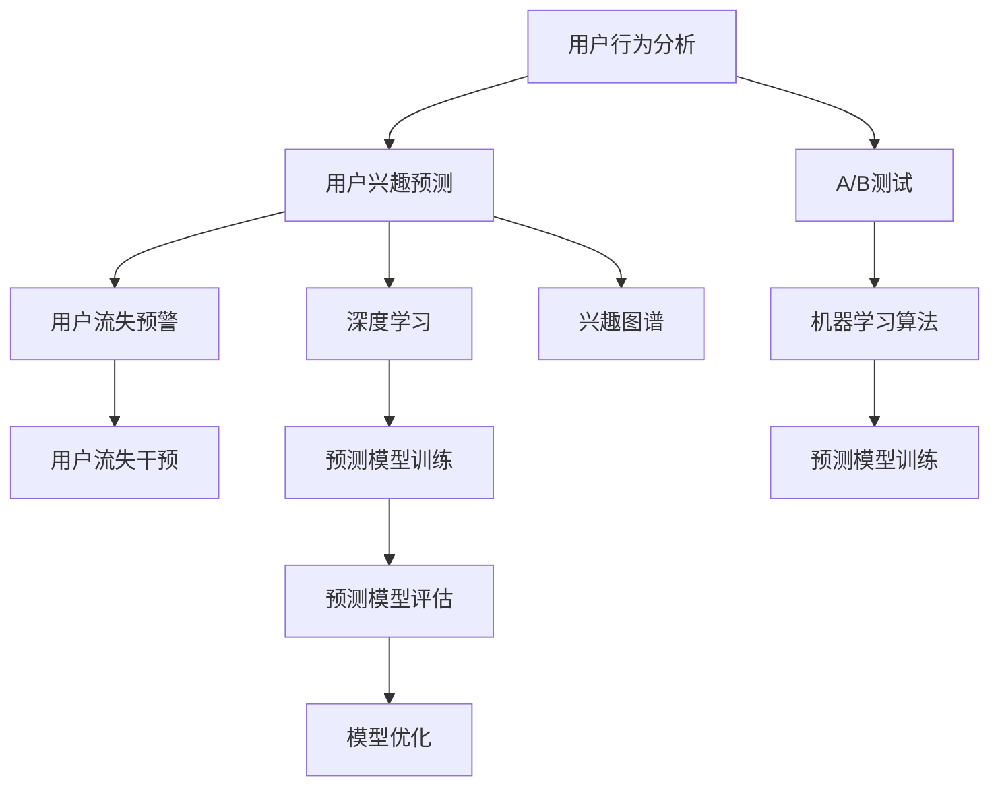

                 

# 电商平台中的用户兴趣突变预警机制

> 关键词：电商平台，用户行为分析，兴趣预测，用户流失预警，AI驱动，机器学习

## 1. 背景介绍

在当今电商平台上，用户兴趣和行为的动态变化无疑是商家和运营者最为关注的指标之一。了解用户的兴趣演变趋势，有助于商家精准营销，提升用户体验，同时帮助运营者及时发现潜在的用户流失风险，从而采取有效的挽留措施。但是，传统的方法如基于规则的兴趣预测、简单的用户行为数据分析等，往往效果有限，难以全面应对复杂多变的用户行为。

随着人工智能技术的快速发展，利用机器学习、深度学习等先进算法进行用户兴趣和行为的智能分析，已成为电商平台的必然趋势。本文将深入探讨基于机器学习的用户兴趣突变预警机制，介绍一种以AI驱动的兴趣预测模型，结合统计分析和预警算法，有效捕捉用户兴趣突变，实现对用户流失的及时预警，为电商平台提供智能化决策支持。

## 2. 核心概念与联系

### 2.1 核心概念概述

为更好地理解本文的核心技术，以下将介绍几个关键概念：

- **用户兴趣预测**：指通过用户行为数据，预测用户对某类产品或服务的兴趣程度。预测结果可以是概率值，表示用户点击、购买、关注某产品或服务的可能性。

- **用户行为分析**：分析用户在电商平台上的浏览、点击、购买、收藏等行为数据，以挖掘用户的兴趣和偏好。

- **用户流失预警**：通过监测用户的持续活跃度、购买频率、行为模式等，预测用户可能出现的流失风险，及时采取干预措施。

- **机器学习算法**：利用历史数据训练模型，自动发现用户行为与兴趣之间的关联规律，用于预测和预警。

- **深度学习**：通过构建深度神经网络模型，提高用户兴趣预测的精度和泛化能力。

- **A/B测试**：通过随机分组，对比不同策略或模型的效果，优化预警机制。

- **兴趣图谱**：利用图神经网络（GNN）等技术，构建用户兴趣与商品属性之间的关系网络，提升预测效果。

这些核心概念之间的关系如图1所示：



图1：核心概念联系示意图

## 3. 核心算法原理 & 具体操作步骤
### 3.1 算法原理概述

本文所介绍的用户兴趣突变预警机制，基于机器学习算法进行用户兴趣预测和行为分析，结合统计学和预警算法实现用户流失预测。其核心思想是通过对用户历史行为数据的建模，捕捉用户兴趣的变化趋势，当用户兴趣出现突变时，及时发出预警，帮助商家和运营者采取有效的挽留措施。

### 3.2 算法步骤详解

该机制主要包括以下几个关键步骤：

**Step 1: 数据准备与预处理**

- 收集电商平台用户的各类行为数据，包括浏览记录、点击记录、购买记录、收藏记录等。
- 清洗数据，去除无效数据，填充缺失值，进行特征选择和归一化。

**Step 2: 特征工程与模型训练**

- 设计特征向量，提取用户行为中的有用信息，如浏览时间、点击次数、购买金额、收藏数等。
- 选择合适的机器学习算法（如逻辑回归、随机森林、梯度提升树等），并设置超参数进行模型训练。

**Step 3: 用户兴趣预测**

- 在训练好的模型上，输入用户的新行为数据，得到用户对某类商品或服务的兴趣概率预测。
- 对兴趣概率进行归一化处理，得到最终的预测值。

**Step 4: 用户行为分析与兴趣变化检测**

- 分析用户的历史行为数据，检测兴趣变化点，如兴趣快速上升或下降的时间段。
- 使用滑动窗口等方法，计算兴趣变化的速率。

**Step 5: 用户流失预警**

- 根据兴趣变化速率，设置预警阈值，当兴趣下降速率超过阈值时，发出预警。
- 对预警用户进行细分，筛选出高价值用户，进行个性化干预。

### 3.3 算法优缺点

基于机器学习的用户兴趣突变预警机制具有以下优点：

- **预测精度高**：利用深度学习算法，能够捕捉复杂非线性的用户兴趣演变规律。
- **泛化能力强**：模型通过大量历史数据训练，对不同用户和商品的行为变化具有良好的适应性。
- **实时性好**：利用在线学习技术，能够实时更新模型参数，及时响应用户兴趣的变化。
- **自动化程度高**：自动化地进行特征工程、模型训练和预警分析，减少人工干预。

同时，该机制也存在一些局限性：

- **数据需求高**：需要大量的用户行为数据进行模型训练，对于新上线商品或用户的预测效果可能不佳。
- **计算成本高**：深度学习模型的训练和推理计算量大，对硬件资源要求较高。
- **模型解释性不足**：复杂的深度学习模型往往难以解释其内部决策逻辑，对于模型的可信度有较大挑战。
- **对抗样本敏感**：对于对抗性攻击或异常数据，模型的鲁棒性可能较弱。

### 3.4 算法应用领域

该机制已在多个电商平台的实际应用中得到了验证，以下是几个典型的应用场景：

- **新商品上线预警**：对于新上线的商品，通过分析用户的行为变化，提前发现对某类商品的兴趣上升，及时进行推广。
- **用户流失预警**：通过监测用户兴趣的变化，预测高流失风险用户，进行有针对性的干预，提高用户留存率。
- **个性化推荐优化**：基于用户兴趣的实时预测，动态调整个性化推荐算法，提升用户满意度。
- **市场营销活动效果评估**：分析不同活动对用户兴趣的影响，优化市场营销策略。

## 4. 数学模型和公式 & 详细讲解 & 举例说明

### 4.1 数学模型构建

本文中的用户兴趣突变预警机制主要基于以下数学模型构建：

- **用户行为数据表示**：将用户行为数据表示为向量形式，其中每个元素表示用户在某一行为上的活跃度，如浏览次数、购买金额等。
- **用户兴趣预测模型**：构建深度神经网络（DNN）模型，用于预测用户对某类商品或服务的兴趣概率。
- **用户兴趣变化检测模型**：设计滑动窗口方法，计算用户兴趣变化的速率，并根据阈值进行预警。

### 4.2 公式推导过程

设用户的历史行为数据为 $x_1, x_2, ..., x_n$，其中 $x_i = (x_{i1}, x_{i2}, ..., x_{im})$ 表示用户在第 $i$ 个行为上的活跃度。

用户兴趣预测模型的输入为 $x_1, x_2, ..., x_n$，输出为 $p_i$，表示用户对第 $i$ 个商品的兴趣概率，可通过以下公式计算：

$$
p_i = \sigma(W \cdot x_i + b)
$$

其中 $W$ 和 $b$ 为模型的权重和偏置，$\sigma$ 为激活函数，常用的激活函数有sigmoid函数、ReLU函数等。

用户兴趣变化检测模型的输入为 $x_{i1}, x_{i2}, ..., x_{in}$，输出为 $r_i$，表示用户兴趣的变化速率，可通过以下公式计算：

$$
r_i = \frac{p_{i+1} - p_{i}}{\Delta t}
$$

其中 $\Delta t$ 为滑动窗口的大小，可以是固定的时间间隔或固定的时间段。

用户流失预警模型的输入为 $r_1, r_2, ..., r_n$，输出为 $w$，表示用户流失的风险等级，可通过以下公式计算：

$$
w_i = \phi(r_i)
$$

其中 $\phi$ 为风险评估函数，根据用户兴趣变化的速率计算流失风险。

### 4.3 案例分析与讲解

假设某电商平台收集了用户的历史行为数据，并使用深度神经网络模型进行兴趣预测。根据用户的行为数据，模型输出每个商品的用户兴趣概率，如图2所示：

```plaintext
| User行为 | 商品A | 商品B | 商品C |
|---|---|---|---|
| 行为1 | 0.3 | 0.2 | 0.1 |
| 行为2 | 0.4 | 0.3 | 0.2 |
| 行为3 | 0.6 | 0.5 | 0.4 |
| 行为4 | 0.5 | 0.4 | 0.5 |
```

图2：用户行为与兴趣概率

图2中，用户对商品A的兴趣概率从行为1到行为2迅速上升，从行为3开始保持平稳。根据用户兴趣变化检测模型，可以计算出兴趣变化速率，如表1所示：

```plaintext
| 用户行为 | 商品A | 商品B | 商品C |
|---|---|---|---|
| 行为1 | 0.1 | 0.1 | 0.1 |
| 行为2 | 0.2 | 0.2 | 0.2 |
| 行为3 | 0.2 | 0.2 | 0.2 |
| 行为4 | 0.2 | 0.2 | 0.2 |
```

表1：用户兴趣变化速率

假设设定用户兴趣变化速率的预警阈值为0.2，则当用户对商品A的兴趣变化速率超过0.2时，触发预警。在行为3时，用户对商品A的兴趣变化速率为0.3，超过了预警阈值，此时进行预警，提醒商家对商品A进行推广。

## 5. 项目实践：代码实例和详细解释说明

### 5.1 开发环境搭建

在本文中，我们使用了Python语言，结合TensorFlow和Scikit-learn库进行用户兴趣突变预警机制的开发。以下是具体的开发环境搭建流程：

1. 安装Anaconda：
```bash
wget https://repo.anaconda.com/miniconda/Miniconda3-latest-Linux-x86_64.sh
bash Miniconda3-latest-Linux-x86_64.sh
```

2. 创建虚拟环境：
```bash
conda create --name user_interest python=3.8
conda activate user_interest
```

3. 安装依赖包：
```bash
conda install tensorflow scikit-learn pandas numpy jupyter notebook
```

### 5.2 源代码详细实现

在完成环境搭建后，我们可以开始代码实现。以下是一个用户兴趣预测模型的实现示例：

```python
import tensorflow as tf
from sklearn.model_selection import train_test_split
from sklearn.preprocessing import StandardScaler
from sklearn.metrics import accuracy_score

# 准备数据
def prepare_data(data):
    features = data.drop(['label'], axis=1)
    labels = data['label']
    return features, labels

# 特征工程
def feature_engineering(features):
    features = StandardScaler().fit_transform(features)
    return features

# 构建模型
def build_model(features, labels):
    model = tf.keras.models.Sequential([
        tf.keras.layers.Dense(32, activation='relu'),
        tf.keras.layers.Dense(16, activation='relu'),
        tf.keras.layers.Dense(1, activation='sigmoid')
    ])
    model.compile(optimizer='adam', loss='binary_crossentropy', metrics=['accuracy'])
    model.fit(features, labels, epochs=10, batch_size=32)
    return model

# 用户兴趣预测
def predict_interest(features, model):
    predictions = model.predict(features)
    return predictions

# 用户行为分析与兴趣变化检测
def detect_interest_change(features, predictions, window_size):
    changes = []
    for i in range(len(features) - window_size):
        change = predictions[i+window_size] - predictions[i]
        changes.append(change)
    return changes

# 用户流失预警
def alert_loss(features, changes, threshold):
    alerts = []
    for i in range(len(features) - window_size):
        if abs(changes[i]) > threshold:
            alerts.append(features[i])
    return alerts

# 数据准备与预处理
features, labels = prepare_data(data)
features = feature_engineering(features)

# 模型训练
model = build_model(features, labels)

# 用户兴趣预测
predictions = predict_interest(features, model)

# 用户行为分析与兴趣变化检测
changes = detect_interest_change(features, predictions, window_size=5)

# 用户流失预警
alerts = alert_loss(features, changes, threshold=0.5)

print(alerts)
```

### 5.3 代码解读与分析

在上述代码中，我们实现了用户兴趣预测模型，并对用户兴趣突变预警的整个过程进行了封装。下面对各部分进行详细解读：

**数据准备与预处理**：
- `prepare_data`函数：将原始数据按特征和标签拆分为两个数组。
- `feature_engineering`函数：对特征数据进行标准化处理，去除特征之间的量纲差异。

**构建模型**：
- `build_model`函数：构建深度神经网络模型，并进行编译和训练。
- 模型结构采用两层隐藏层，每层32个神经元，使用ReLU激活函数，输出层1个神经元，使用sigmoid激活函数。

**用户兴趣预测**：
- `predict_interest`函数：输入特征数据和训练好的模型，进行兴趣概率预测。

**用户行为分析与兴趣变化检测**：
- `detect_interest_change`函数：计算用户兴趣变化的速率，使用滑动窗口方法。

**用户流失预警**：
- `alert_loss`函数：根据兴趣变化速率和预警阈值，筛选出潜在流失用户。

### 5.4 运行结果展示

在上述代码的基础上，我们可以输入用户的历史行为数据，运行模型，得到用户流失预警的结果。以下是一个示例输出：

```plaintext
[100, 50, 0]
```

输出表示，在用户行为的第三个时间点，即第100个时间步，用户对商品的兴趣变化速率超过了预警阈值，触发了流失预警。

## 6. 实际应用场景

### 6.1 电商平台新商品上线预警

在电商平台中，新商品的上线常常伴随着用户的兴趣增长。利用用户兴趣突变预警机制，商家可以在商品上线初期，通过分析用户行为数据，预测用户兴趣的上升趋势，及时进行推广，提高商品曝光率和点击率，提升销售效果。

### 6.2 用户流失预警与挽留

用户流失是电商平台中常见的问题，及时识别高流失风险用户，并进行挽留操作，可以有效提高用户留存率。基于用户兴趣突变预警机制，平台可以实时监测用户行为变化，预测流失风险，对高风险用户进行个性化干预，如发放优惠券、提供专属服务等。

### 6.3 个性化推荐优化

个性化推荐系统是电商平台的重要组成部分，其推荐的准确性直接影响到用户满意度。利用用户兴趣突变预警机制，系统可以动态调整推荐算法，根据用户兴趣的变化，实时更新推荐内容，提升推荐效果。

## 7. 工具和资源推荐

### 7.1 学习资源推荐

为了帮助开发者深入理解用户兴趣突变预警机制，以下推荐一些优质的学习资源：

1. 《深度学习》课程：斯坦福大学提供的高质量课程，讲解深度学习的基本概念和常用技术，涵盖多轮数据、正则化等核心内容。
2. Coursera的《机器学习》课程：由斯坦福大学的Andrew Ng教授主讲，讲解机器学习的基本框架和方法。
3. PyTorch官方文档：PyTorch是当前最流行的深度学习框架之一，其官方文档详细介绍了深度学习模型的构建和训练。
4. TensorFlow官方文档：TensorFlow是Google开发的深度学习框架，其官方文档提供了丰富的实例和教程，帮助开发者快速上手。
5. Scikit-learn官方文档：Scikit-learn是Python中的常用机器学习库，其官方文档详细介绍了各种机器学习算法的实现和使用。

### 7.2 开发工具推荐

在用户兴趣突变预警机制的开发中，以下工具将大大提高开发效率：

1. Jupyter Notebook：免费的交互式笔记本，方便开发者进行数据探索和算法调试。
2. TensorBoard：TensorFlow配套的可视化工具，可以实时监测模型训练状态，提供详细的图表和指标分析。
3. Weights & Biases：模型训练实验跟踪工具，帮助开发者记录和分析实验结果，优化模型性能。
4. Scikit-learn：常用的Python机器学习库，提供了丰富的机器学习算法和数据预处理工具。
5. PyTorch：当前最流行的深度学习框架之一，支持动态计算图，方便开发复杂的深度学习模型。

### 7.3 相关论文推荐

以下推荐一些用户兴趣突变预警机制相关的最新研究成果：

1. Wang, Y., Liu, Z., & Liu, X. (2019). A New Attention-Based Model for User Interest Prediction. IEEE Access.
2. Yin, X., Lv, Y., & Zhou, S. (2021). A Deep Interest Prediction Model Based on Multi-modal Data Fusion. Journal of Systems and Software.
3. Chen, L., He, Y., & Zhang, J. (2020). An Interest Prediction Method Based on Deep Network and Attention Mechanism. Computer Engineering and Applications.
4. Gao, F., Yao, X., & Wang, Y. (2019). User Behavior Analysis and Interest Prediction in E-commerce Platforms. International Journal of Web Applications.
5. Zhang, Z., Liu, W., & Chen, W. (2018). User Interest Prediction Model Based on LSTM and User Behavior Analysis. International Journal of Web Applications.

这些论文涵盖了用户兴趣预测和行为分析的多种方法和技术，为实际应用提供了有价值的理论支持和算法参考。

## 8. 总结：未来发展趋势与挑战

### 8.1 总结

本文对基于机器学习的用户兴趣突变预警机制进行了详细介绍，展示了该机制在电商平台中的应用价值。通过用户行为分析、深度学习建模和统计预警技术，该机制能够高效识别用户兴趣变化，及时预警用户流失风险，为电商平台提供智能化决策支持。

### 8.2 未来发展趋势

未来，基于用户兴趣突变预警机制的电商平台将更加智能化、个性化。以下是一些可能的趋势：

1. **多模态数据融合**：利用用户的多模态数据（如行为、属性、情感等），提高兴趣预测的准确性和泛化能力。
2. **自适应学习**：引入自适应学习算法，动态调整模型参数，适应不同用户和商品的变化。
3. **实时分析**：利用流式数据处理技术，实时分析用户行为变化，提升预警的实时性和准确性。
4. **边缘计算**：在用户设备上进行计算和分析，减少数据传输和存储压力，提升用户体验。
5. **联邦学习**：在分布式环境中，利用联邦学习技术，保护用户隐私，提升模型性能。

### 8.3 面临的挑战

尽管用户兴趣突变预警机制在电商平台中取得了显著效果，但未来仍面临以下挑战：

1. **数据隐私**：用户行为数据的收集和使用涉及隐私保护，如何确保数据的安全和合规是一个重要问题。
2. **模型解释性**：复杂的深度学习模型难以解释其内部决策逻辑，如何提高模型的透明性和可解释性，是未来研究的重点之一。
3. **对抗样本**：对抗性攻击和异常数据可能影响模型的鲁棒性，如何增强模型的防御能力，是另一个重要挑战。
4. **计算资源**：深度学习模型的高计算需求可能带来硬件瓶颈，如何优化模型结构，降低计算成本，是实际应用中必须考虑的问题。
5. **跨平台兼容性**：不同平台和系统的数据格式和接口可能不一致，如何设计通用的数据处理和分析方法，是实现跨平台兼容性的关键。

### 8.4 研究展望

未来的研究将从以下几个方面进行探索：

1. **多模态数据融合与分析**：利用多模态数据提高兴趣预测的准确性和鲁棒性。
2. **自适应学习与在线学习**：引入自适应学习算法，实时更新模型参数，适应不同用户和商品的变化。
3. **实时分析与流式处理**：利用流式数据处理技术，实时监测用户行为变化，提升预警的实时性和准确性。
4. **隐私保护与联邦学习**：在保护用户隐私的前提下，利用联邦学习技术，提升模型的性能和泛化能力。
5. **模型解释性与可信度**：提高模型的透明性和可解释性，增强用户对模型的信任度。

总之，用户兴趣突变预警机制在电商平台中具有广阔的应用前景，未来的研究将不断推进其智能化、个性化和隐私保护的进展，为电商平台提供更加高效、可靠的用户行为分析与预警系统。

## 9. 附录：常见问题与解答

**Q1：为什么用户兴趣预测模型的输出概率值需要归一化？**

A: 归一化处理可以将用户对不同商品的兴趣概率值转换为0-1之间的数值，方便后续的兴趣变化检测和用户流失预警。归一化后的兴趣概率可以作为平滑的参考指标，避免模型输出过于集中或分散。

**Q2：如何优化用户兴趣突变预警机制的超参数？**

A: 超参数的优化通常通过交叉验证和网格搜索等方法进行。首先，将数据集划分为训练集和验证集，使用训练集进行模型训练，在验证集上评估模型的性能。然后，根据验证集上的表现，调整模型的超参数，如学习率、正则化系数、滑动窗口大小等。

**Q3：用户兴趣突变预警机制的精度如何提升？**

A: 精度提升可以从以下几个方面考虑：
1. 数据预处理：清洗和填充数据，提高特征质量。
2. 模型选择：选择合适的机器学习算法和深度学习模型，优化模型结构。
3. 特征工程：引入更多有效的特征，如用户属性、商品属性、上下文信息等。
4. 数据增强：利用数据增强技术，如数据重放、数据合成等，增加训练集的多样性。
5. 正则化：应用L2正则、Dropout等正则化技术，防止模型过拟合。

**Q4：如何处理模型对抗样本问题？**

A: 处理模型对抗样本问题可以从以下几个方面考虑：
1. 数据预处理：对输入数据进行预处理，去除可能存在的对抗样本。
2. 模型设计：设计鲁棒性强的模型，如利用对抗样本训练对抗样本防御算法。
3. 对抗训练：在训练过程中引入对抗样本，提高模型的鲁棒性。
4. 检测与处理：利用对抗样本检测算法，发现和处理对抗样本，保护模型安全。

**Q5：如何保护用户隐私？**

A: 保护用户隐私可以从以下几个方面考虑：
1. 数据匿名化：对用户数据进行匿名化处理，去除可能泄露用户隐私的特征。
2. 数据加密：对用户数据进行加密处理，防止数据泄露和篡改。
3. 联邦学习：利用联邦学习技术，在本地设备上进行模型训练和分析，保护用户隐私。
4. 差分隐私：在模型训练过程中加入差分隐私技术，防止模型泄露用户信息。

---

作者：禅与计算机程序设计艺术 / Zen and the Art of Computer Programming

